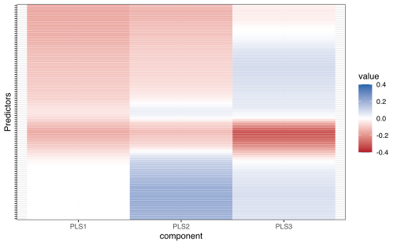

We're very chuffed to announce the release of [recipes](https://recipes.tidymodels.org) 0.1.13. recipes is an alternative method for creating and preprocessing design matrices that can be used for modeling or visualization.

You can install it from CRAN with:

<pre class='chroma'><code class='language-r' data-lang='r'>install.packages("recipes")</code></pre>

You can see a full list of changes in the [release notes](https://recipes.tidymodels.org/news/index.html). There are some improvements and changes to talk about.

General changes
---------------

First, `step_filter()`, `step_slice()`, `step_sample()`, and `step_naomit()` had their defaults for `skip` changed to `TRUE`. In the vast majority of applications, these steps should not be applied to the test or assessment sets.

Also, `step_upsample()` and `step_downsample()` are soft deprecated in recipes as they are now available in the [themis package](https://tidymodels.github.io/themis/). They will be removed in the next version.

Finally, for the new version of dplyr, the selectors `all_of()` and `any_of()` can now be used in step selections.

Feature extraction improvements
-------------------------------

In the [*feature extraction*](https://en.wikipedia.org/wiki/Feature_extraction) category, there are two improvements. First, the `tidy()` method for `step_pca()` can return the percentage of variation accounted for by each [PCA component](https://en.wikipedia.org/wiki/Principal_component_analysis). For example:

<pre class='chroma'><code class='language-r' data-lang='r'>library(<a href='https://rdrr.io/pkg/tidymodels/man'>tidymodels</a>)

# Many highly correlated numeric predictors:
data(meats, package = "modeldata")

set.seed(2383)
split &lt;- initial_split(meats)
meat_tr &lt;- training(split)
meat_te &lt;- testing(split)

pca_rec &lt;- 
  recipe(water + fat + protein ~ ., data = meat_tr) %&gt;% 
  step_normalize(all_predictors()) %&gt;% 
  step_pca(all_predictors(), num_comp = 10, id = "pca") %&gt;% 
  prep()

var_info &lt;- tidy(pca_rec, id = "pca", type = "variance")

table(var_info$terms)
#&gt; 
#&gt; cumulative percent variance         cumulative variance 
#&gt;                         100                         100 
#&gt;            percent variance                    variance 
#&gt;                         100                         100

var_info %&gt;% 
  dplyr::<a href='https://dplyr.tidyverse.org/reference/filter.html'>filter</a>(terms == "percent variance") %&gt;% 
  ggplot(aes(x = component, y = value)) + 
  geom_bar(stat = "identity") + 
  xlim(c(0, 10)) + 
  ylab("% of Total Variation")
</code></pre>

Another change in this version of recipes is that `step_pls()` has received an upgrade. [Partial least squares](https://en.wikipedia.org/wiki/Partial_least_squares_regression) (PLS) is similar to PCA but takes the outcome(s) into account.

Previously, it used the [pls package](https://github.com/bhmevik/pls) to do the computations. That's a great package but it lacks two important features: allow for a categorical outcome value (e.g. "pls-da" for *discriminant analysis*) or allow for sparsity in the coefficients. Sparsity would facilitate simpler and perhaps more robust models.

`step_pls()` now uses the Bioconductor [mixOmics package](https://www.bioconductor.org/packages/release/bioc/html/mixOmics.html). As such, the outcome data can now be a factor and a new argument `predictor_prop` is used for sparsity. That argument specifies the maximum proportion of partial least squares loadings that will be *non-zero* (per component) during training. Newly prepped recipes will use this package but previously created recipes still use the pls package. For our previous example, let's look at the protein outcome and build a recipe:

<pre class='chroma'><code class='language-r' data-lang='r'>pls_rec &lt;- 
  recipe(water + fat + protein ~ ., data = meat_tr) %&gt;% 
  step_normalize(all_predictors()) %&gt;% 
  step_pls(
    all_predictors(),
    outcome = vars(protein),
    num_comp = 3,
    predictor_prop = 0.75,
    id = "pls"
  ) %&gt;% 
  prep()

# for new data: 
bake(pls_rec, meat_te, protein, starts_with("PLS")) %&gt;%
  tidyr::<a href='https://tidyr.tidyverse.org/reference/pivot_longer.html'>pivot_longer</a>(cols = c(-protein),
                      names_to = "component",
                      values_to = "values") %&gt;% 
  ggplot(aes(x = values, y = protein)) + 
  geom_point(alpha = 0.5) + 
  facet_wrap(~ component, scale = "free_x") +
  xlab("PLS Score")
</code></pre>

What are the PLS coefficients from this?

<pre class='chroma'><code class='language-r' data-lang='r'>tidy(pls_rec, id = "pls") %&gt;%
  ggplot(aes(x = component, y = terms, fill = value)) +
  geom_tile() +
  scale_fill_gradient2(
    low = "#B2182B",
    mid = "white",
    high = "#2166AC",
    limits = c(-0.4, 0.4)
  ) + 
  theme(axis.text.y = element_blank()) + 
  ylab("Predictors")
</code></pre>

The third component has the largest coefficients and the largest effect on predicting the percentage of protein. This is consistent with the scatter plot above. The blocks of white in the heatmap above are coefficients effected by the sparsity argument.

