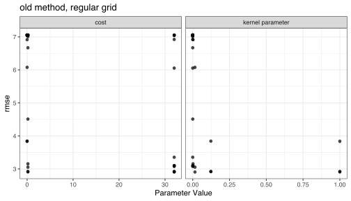

We're pleased to announce the release of [tune](https://tune.tidymodels.org/) 0.1.1. tune is a tidy interface for optimizing model tuning parameters. 

You can install it from CRAN with:

```{r, eval = FALSE}
install.packages("tune")
```

```{r setup, include=FALSE}
library(tidymodels)
theme_set(theme_bw())
library(doMC)
registerDoMC(cores = parallel::detectCores())

thm <- theme_bw() + 
  theme(
    panel.background = element_rect(fill = "transparent", colour = NA), 
    plot.background = element_rect(fill = "transparent", colour = NA),
    legend.background = element_rect(fill = "transparent", colour = NA),
    legend.key = element_rect(fill = "transparent", colour = NA)
  )
theme_set(thm)
```

You can see a full list of changes in the [release notes](https://tune.tidymodels.org/news/index.html). The release was originally motivated by [dplyr 1.0.0 changes](https://www.tidyverse.org/tags/dplyr-1-0-0) although there are a lot of nice, new features to talk about. 

## Better `autoplot()`

The previous plot method produces what we refer to as a _marginal plot_; each predictor was plotted against performance. That is probably the best that we can do for non-regular grids (which tends to be the default in tune). Here's an example using the [Chicago train data](https://bookdown.org/max/FES/chicago-intro.html): 

```{r ap-irr, cache = TRUE}
library(tidymodels)

data(Chicago, package = "modeldata")

# Time-series resampling
set.seed(7898)
data_folds <-
  rolling_origin(
    Chicago,
    initial = 364 * 15,
    assess = 7 * 4,
    skip = 7 * 4,
    cumulative = FALSE
  )

svm_mod <- 
  svm_rbf(cost = tune(), rbf_sigma = tune("kernel parameter")) %>% 
  set_mode("regression") %>% 
  set_engine("kernlab")

ctrl <- control_grid(save_pred = TRUE)

set.seed(2893)
non_regular_grid <-
  svm_mod %>%
  tune_grid(
    ridership ~ Harlem + Archer_35th,
    resamples = data_folds,
    grid = 36,
    control = ctrl
  )
```

```{r irreg-plot-old, eval = FALSE, dev = 'svg', dev.args = list(bg = "transparent"), fig.align='center', fig.height=4}
autoplot(non_regular_grid, metric = "rmse") + 
  ggtitle("old method, irregular grid")
```


Not bad but it could be improved in a few ways: 

 * Both tuning parameters are generated on log scales. The data are shown above in the natural units and the data at the low end of the scale gets smashed together. 
 
 * We could show its parameter label (e.g. "Radial Basis Function sigma") when no parameter ID is given. 
 
What happens when a regular (i.e. factorial) grid is used? 

```{r ap-reg, cache = TRUE}
grid <- 
  svm_mod %>% 
  parameters() %>% 
  grid_regular(levels = c(3, 12))

grid

set.seed(2893)
regular_grid <-
  svm_mod %>%
  tune_grid(
    ridership ~ Harlem + Archer_35th,
    resamples = data_folds,
    grid = grid,
    control = ctrl
  )
```


```{r reg-plot-old, eval = FALSE, dev = 'svg', dev.args = list(bg = "transparent"), fig.align='center', fig.height=4}
autoplot(regular_grid, metric = "rmse") + 
  ggtitle("old method, regular grid")
```


This visualization also could be improved, since there might be a pattern in one parameter for each value of the other.  

The new version of tune creates improved versions of both of these plots: 

```{r ap-irr-new, dev = 'svg', dev.args = list(bg = "transparent"), fig.align='center', fig.height=4}
autoplot(non_regular_grid, metric = "rmse") + 
  ggtitle("new method, irregular grid")
```

This tells a completely different story than the previous version where the parameters were in their natural units. 

The regular grid results are also much better and tell a cleaner story: 

```{r ap-reg-new, dev = 'svg', dev.args = list(bg = "transparent"), fig.align='center', fig.height=4, fig.width=5.5}
autoplot(regular_grid, metric = "rmse") + 
  ggtitle("new method, regular grid")
```

Extra arguments can be passed when a numeric grouping column is used;l these are given to `format()`. To avoid scientific notation:

```{r ap-reg-new-new, dev = 'svg', dev.args = list(bg = "transparent"), fig.align='center', fig.height=4, fig.width=5.5}
autoplot(regular_grid, metric = "rmse", digits = 3, scientific = FALSE) + 
  ggtitle("Formatting for coloring column")
```

## A ggplot2 `coord` for plotting observed and predicted values

One helpful visualization of the fit of a regression model is to plot the true outcome value against the predictions. These _should_ be on the same scale. Let's look at such a plot: 

```{r obs-pred-old, dev = 'svg', dev.args = list(bg = "transparent"), fig.align='center', fig.height=4}
best_values <- select_best(regular_grid, metric = "rmse")
best_values

holdout_predictions <- 
  regular_grid %>% 
  collect_predictions(parameters = best_values)
holdout_predictions

ggplot(holdout_predictions, aes(x = ridership, y = .pred)) + 
  geom_abline(lty = 2) + 
  geom_point(alpha = 0.3)
```

This is very helpful but there are a few possible improvements. The new version of tune has `coord_obs_pred()` that produces a square plot with the same axes: 


```{r obs-pred-new, dev = 'svg', dev.args = list(bg = "transparent"), eval = TRUE, fig.align='center', fig.height=4}
ggplot(holdout_predictions, aes(x = ridership, y = .pred)) + 
  geom_abline(lty = 2) + 
  geom_point(alpha = 0.3) + 
  coord_obs_pred()
```


## Tuning engine parameters

[Bruna Wundervald](https://github.com/brunaw) (from Maynooth University) gave a [great presentation](https://brunaw.com/slides/rladies-helsinki/talk.html#1) that used tidymodels packages. She ran into the problem that, if you wanted to tune parameters that were specific to the engine, you'd have to go through a lot of trouble to do so. This used to work well in a previous version of tune. Unfortunately, we accidentally broke it, but now you can once again tune engine specific parameters. One feature in this version of tune, along with the new 0.0.8 version of the dials package, is that we have added dials `parameter` objects for every parameter that users might tuned with the existing engines that we support (this was not as difficult as it sounds).

To demonstrate, we'll use the time series data above, but this time we'll optimize the ranger parameters that Bruna was interested in. 

Since parsnip has a pre-defined list of models and engines, we've gone ahead and set up the infrastructure for tuning most engine-specific values. For example, in the above example we could tune two regularization parameters specific to ranger.

```{r reg-param-tune}
rf_mod <- 
  rand_forest(min_n = tune()) %>%
  set_mode("regression") %>%
  set_engine("ranger", 
             regularization.factor = tune(), 
             regularization.usedepth = tune())

# Are there dials objects to work with these? 
rf_param <- parameters(rf_mod)
rf_param
```

There are parameter objects for these (and they keep their original names). You can adjust the ranges and values for these parameters using the `update()` function as you would for others. To see their underlying functions: 

```{r show-param}
rf_param$object[[2]]
```

From here, the standard tools in the tune package can be used. You can use one of the `grid_*()` functions to create a grid of values, let `tune_grid()` create a set for you, or use Bayesian optimization to find appropriate values sequentially. 

The new `autoplot()` method can also be used to produce nice visualizations of the relationship between performance and the parameters. 

```{r rf-tune, dev = 'svg', dev.args = list(bg = "transparent"), fig.align='center', fig.height=4}
set.seed(4976)
ranger_params <-
  rf_mod %>%
  tune_grid(
    ridership ~ Harlem + Archer_35th,
    resamples = data_folds,
    grid = 10,
    control = ctrl
  )

autoplot(ranger_params, metric = "rmse") + 
  theme(legend.position = "top")
```

Note that the tuning parameter labels (i.e. "Gain Penalization" instead of "`regularization.factor`") are used. 

I'm sure that we missed someone's favorite engine-specific parameter so please put in a [GitHub issue for dials](https://github.com/tidymodels/dials/issues) to let us know. 

## `.config` columns

When model tuning is conducted, the tune package now saves a new column in the output called `.config`. This column is a qualitative identification column for unique tuning parameter combinations. It often reflects what is being tuned. A value of `.config = "Recipe1_Model3"` indicates that the first recipe tuning parameter set is being evaluated in conjunction with the third set of model parameters. Here's an example from the random forest model that we just fit: 

```{r rf-config}
ranger_params %>% 
  collect_metrics() %>% 
  # get the unique tuning parameter combinations:
  select(min_n, regularization.factor, regularization.usedepth, .config) %>% 
  distinct()
```

## Other changes

* `conf_mat_resampled()` is a new function that computes the average confusion matrix across resampling statistics for a single model.  

* `show_best()` and the `select_*()` functions will now use the first metric in the metric set if no metric is supplied. 

* `filter_parameters()` can trim the `.metrics` column of unwanted results (as well as columns `.predictions` and `.extracts`) from `tune_*` objects. 

* If a grid is given, parameters do not need to be finalized to be used in the `tune_*()` functions. 

## Acknowledgements

Thanks to everyone who contributed code or filed issues since the last version: [&#x0040;cimentadaj](https://github.com/cimentadaj), [&#x0040;connor-french](https://github.com/connor-french), [&#x0040;cwchang-nelson](https://github.com/cwchang-nelson), [&#x0040;DavisVaughan](https://github.com/DavisVaughan), [&#x0040;dcossyleon](https://github.com/dcossyleon), [&#x0040;EmilHvitfeldt](https://github.com/EmilHvitfeldt), [&#x0040;jg43b](https://github.com/jg43b), [&#x0040;JHucker](https://github.com/JHucker), [&#x0040;juliasilge](https://github.com/juliasilge), [&#x0040;karaesmen](https://github.com/karaesmen), [&#x0040;kbzsl](https://github.com/kbzsl), [&#x0040;kylegilde](https://github.com/kylegilde), [&#x0040;LucyMcGowan](https://github.com/LucyMcGowan), [&#x0040;mdancho84](https://github.com/mdancho84), [&#x0040;py9mrg](https://github.com/py9mrg), [&#x0040;realauggieheschmeyer](https://github.com/realauggieheschmeyer), [&#x0040;robyjos](https://github.com/robyjos), [&#x0040;rorynolan](https://github.com/rorynolan), [&#x0040;simonpcouch](https://github.com/simonpcouch), [&#x0040;ThomasWolf0701](https://github.com/ThomasWolf0701), and [&#x0040;UnclAlDeveloper](https://github.com/UnclAlDeveloper).
