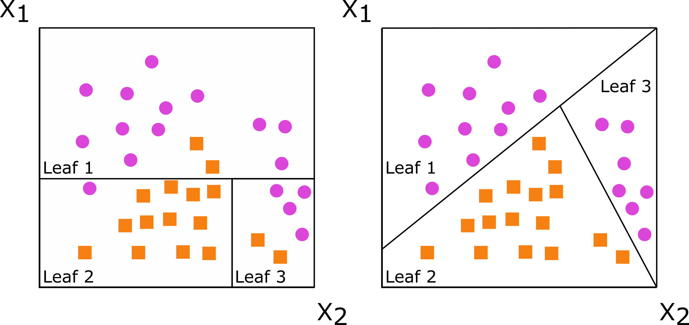

We're brimming with glee to announce the release of [bonsai](https://bonsai.tidymodels.org) 0.3.0. bonsai is a parsnip extension package for tree-based models, and includes support for random forest and gradient-boosted tree frameworks like partykit and LightGBM. This most recent release of the package introduces support for the `"aorsf"` engine, which implements accelerated oblique random forests (Jaeger et al. 2022, Jaeger et al. 2024).

You can install it from CRAN with:

```{r install-bonsai, eval = FALSE}
install.packages("bonsai")
```

This blog post will demonstrate a modeling workflow where the benefits of using oblique random forests shine through.

You can see a full list of changes in the [release notes](https://bonsai.tidymodels.org/news/index.html#bonsai-030).

```{r setup, message = FALSE}
library(tidymodels)
library(bonsai)
library(plsmod)
library(corrr)
```

## The `meats` data

The modeldata package, loaded automatically with the tidymodels meta-package, includes several example datasets to demonstrate modeling problems. We'll make use of a dataset called `meats` in this post. Each row is a measurement of a sample of finely chopped meat.

```{r print-meats}
meats
```

From that dataset's documentation:

> These data are recorded on a Tecator Infratec Food and Feed Analyzer... For each meat sample the data consists of a 100 channel spectrum of absorbances and the contents of moisture (water), fat and protein. The absorbance is -log10 of the transmittance measured by the spectrometer. The three contents, measured in percent, are determined by analytic chemistry.

We'll try to predict the protein content, as a percentage, using the absorbance measurements.

Before we take a further look, let's split up our data. I'll first select off two other possible outcome variables and, after splitting into training and testing sets, resample the data using 5-fold cross-validation with 2 repeats.

```{r split-meats}
meats <- meats %>% select(-water, -fat)

set.seed(1)
meats_split <- initial_split(meats)
meats_train <- training(meats_split)
meats_test <- testing(meats_split)
meats_folds <- vfold_cv(meats_train, v = 5, repeats = 2)
```

The tricky parts of this modeling problem are that:

1) There are few observations to work with (`r nrow(meats)` total).
2) Each of these 100 absorbance measurements are _highly_ correlated.

Visualizing that correlation:

```{r correlate}
meats_train %>%
  correlate() %>%
  autoplot() +
  theme(axis.text.x = element_blank(), axis.text.y = element_blank())
```

Almost all of these pairwise correlations between predictors are near 1, besides the last variable and every other variable. That last variable with weaker correlation values? It's the outcome.

## Baseline models

There are several existing model implementations in tidymodels that are resilient to highly correlated predictors. The first one I'd probably reach for is an elastic net: an interpolation of the LASSO and Ridge regularized linear regression models. Evaluating that modeling approach against resamples:

```{r res-lr}
# define a regularized linear model
spec_lr <- 
  linear_reg(penalty = tune(), mixture = tune()) %>%
  set_engine("glmnet")

# try out different penalization approaches
res_lr <- tune_grid(spec_lr, protein ~ ., meats_folds)

show_best(res_lr, metric = "rmse")
show_best(res_lr, metric = "rsq")
```

That best RMSE value of `r round(show_best(res_lr, metric = "rmse")$mean[1], 2)` gives us a baseline to work with, and the best R-squared `r round(show_best(res_lr, metric = "rsq")$mean[1], 2)` seems like a good start.

Many tree-based model implementations in tidymodels generally handle correlated predictors well. Just to be apples-to-apples with `"aorsf"`, let's use a different random forest engine to get a better sense for baseline performance:

```{r res-rf}
spec_rf <- 
  rand_forest(mtry = tune(), min_n = tune()) %>%
  # this is the default engine, but for consistency's sake:
  set_engine("ranger") %>%
  set_mode("regression")

res_rf <- tune_grid(spec_rf, protein ~ ., meats_folds)

show_best(res_rf, metric = "rmse")
show_best(res_rf, metric = "rsq")
```

Not so hot. Just to show I'm not making a straw man here, I'll evaluate a few more alternative modeling approaches behind the curtain and print out their best performance metrics:

```{r alt-models, include = FALSE}
# lightgbm ----------
spec_lgb <- 
  boost_tree(learn_rate = tune(), trees = tune()) %>%
  set_engine("lightgbm") %>%
  set_mode("regression")

res_lgb <- tune_grid(spec_lgb, protein ~ ., meats_folds)

# pls --------------
spec_pls <- 
  pls(predictor_prop = tune(), num_comp = tune()) %>%
  set_mode("regression")

res_pls <- tune_grid(spec_pls, protein ~ ., meats_folds)

# svm --------------
spec_svm <-
  svm_rbf(cost = tune(), rbf_sigma = tune(), margin = tune()) %>%
  set_mode("regression")

res_svm <- tune_grid(spec_svm, protein ~ ., meats_folds)
```

* **Gradient boosted tree with LightGBM**. Best RMSE: `r round(show_best(res_lgb, metric = "rmse")$mean[1], 2)`. Best R-squared: `r round(show_best(res_lgb, metric = "rsq")$mean[1], 2)`.
* **Partial least squares regression**. Best RMSE: `r round(show_best(res_pls, metric = "rmse")$mean[1], 2)`. Best R-squared: `r round(show_best(res_pls, metric = "rsq")$mean[1], 2)`.
* **Support vector machine**. Best RMSE: `r round(show_best(res_svm, metric = "rmse")$mean[1], 2)`. Best R-squared: `r round(show_best(res_svm, metric = "rsq")$mean[1], 2)`.

This is a tricky one.

## Introducing accelerated oblique random forests

The 0.3.0 release of bonsai introduces support for accelerated oblique random forests via the `"aorsf"` engine for classification and regression in tidymodels. (Tidy survival modelers might note that [we already support `"aorsf"` for censored regression](https://www.tidyverse.org/blog/2023/04/censored-0-2-0/) via the [censored](https://censored.tidymodels.org) parsnip extension package!)

Unlike trees in conventional random forests, which create splits using thresholds based on individual predictors (e.g. `x_001 > 3`), oblique random forests use linear combinations of predictors to create splits (e.g. `x_001 * x_002 > 7.5`) and have been shown to improve predictive performance related to conventional random forests for a variety of applications (Menze et al. 2011). "Oblique" references the appearance of decision boundaries when a set of splits is plotted; I've grabbed a visual from the [aorsf README](https://github.com/ropensci/aorsf?tab=readme-ov-file#what-does-oblique-mean) that demonstrates:

```{r oblique, echo = FALSE, fig.alt = "Two plots of decision boundaries for a classification problem. One uses single-variable splitting and the other oblique splitting. Both trees partition the predictor space defined by predictors X1 and X2, but the oblique splits do a better job of separating the two classes thanks to an 'oblique' boundary formed by considering both X1 and X2 at the same time."}

```

In the above, we'd like to separate the purple dots from the orange squares. A tree in a traditional random forest, represented on the left, can only generate splits based on one of X1 or X2 at a time. A tree in an oblique random forest, represented on the right, can consider both X1 and X2 in creating decision boundaries, often resulting in stronger predictive performance.

Where does the "accelerated" come from? Generally, finding optimal oblique splits is computationally more intensive than finding single-predictor splits. The aorsf package uses something called "Newton Raphson scoring"—the same algorithm under the hood in the survival package—to identify splits based on linear combinations of predictor variables. This approach speeds up that process greatly, resulting in fit times that are analogous to implementations of traditional random forests in R (and hundreds of times faster than existing oblique random forest implementations, Jaeger et al. 2024).

The code to tune this model with the `"aorsf"` engine is the same as for `"ranger"`, except we switch out the `engine` argument to `set_engine()`:

```{r res-aorsf}
spec_aorsf <- 
  rand_forest(
    mtry = tune(),
    min_n = tune()
  ) %>%
  set_engine("aorsf") %>%
  set_mode("regression")

res_aorsf <- tune_grid(spec_aorsf, protein ~ ., meats_folds)

show_best(res_aorsf, metric = "rmse")
show_best(res_aorsf, metric = "rsq")
```

Holy smokes. The best RMSE from aorsf is `r round(show_best(res_aorsf, metric = "rmse")$mean[1], 2)`, much more performant than the previous best RMSE from the elastic net with a value of `r round(show_best(res_lr, metric = "rmse")$mean[1], 2)`, and the best R-squared is `r round(show_best(res_aorsf, metric = "rsq")$mean[1], 2)`, much stronger than the previous best (also from the elastic net) of `r round(show_best(res_lr, metric = "rsq")$mean[1], 2)`.

Especially if your modeling problems involve few samples of many, highly correlated predictors, give the `"aorsf"` modeling engine a whirl in your workflows and let us know what you think!

## References

Byron C. Jaeger, Sawyer Welden, Kristin Lenoir, Jaime L. Speiser, Matthew W. Segar, Ambarish Pandey, Nicholas M. Pajewski. 2024. "Accelerated and Interpretable Oblique Random Survival Forests." _Journal of Computational and Graphical Statistics_ 33.1: 192-207.

Byron C. Jaeger, Sawyer Welden, Kristin Lenoir, and Nicholas M. Pajewski. 2022. "aorsf: An R package for Supervised Learning Using the Oblique Random Survival Forest." _The Journal of Open Source Software_.

Bjoern H. Menze, B. Michael Kelm, Daniel N. Splitthoff, Ullrich Koethe, and Fred A. Hamprecht. (2011). "On Oblique Random Forests." _Joint European Conference on Machine Learning and Knowledge Discovery in Databases_ (pp. 453–469). Springer.

## Acknowledgements

Thank you to [&#x0040;bcjaeger](https://github.com/bcjaeger), the aorsf author, for doing most of the work to implement aorsf support in bonsai. Thank you to [&#x0040;hfrick](https://github.com/hfrick), [&#x0040;joranE](https://github.com/joranE), [&#x0040;jrosell](https://github.com/jrosell),  [&#x0040;nipnipj](https://github.com/nipnipj),  [&#x0040;p-schaefer](https://github.com/p-schaefer),  [&#x0040;seb-mueller](https://github.com/seb-mueller), and [&#x0040;tcovert](https://github.com/tcovert) for their contributions on the bonsai repository since version 0.2.1.
