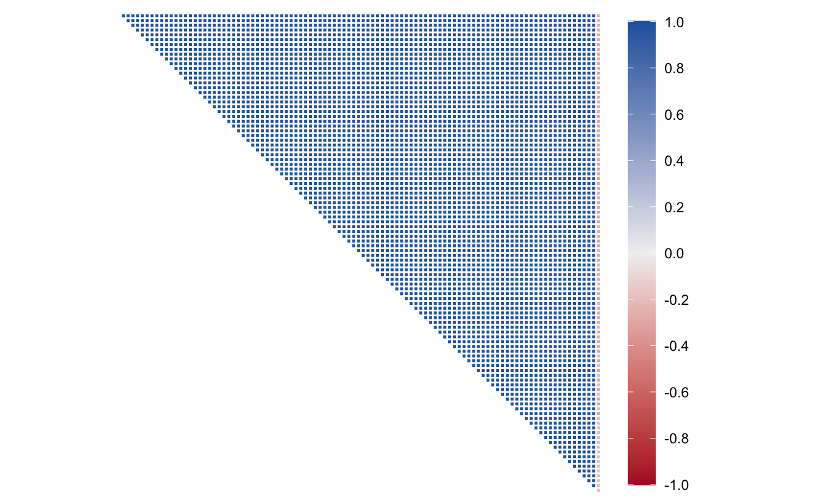

We're brimming with glee to announce the release of [bonsai](https://bonsai.tidymodels.org) 0.3.0. bonsai is a parsnip extension package for tree-based models, and includes support for random forest and gradient-boosted tree frameworks like partykit and LightGBM. This most recent release of the package introduces support for the `"aorsf"` engine, which implements accelerated oblique random forests (Jaeger et al. 2022, Jaeger et al. 2024).

You can install it from CRAN with:

<pre class='chroma'><code class='language-r' data-lang='r'><a href='https://rdrr.io/r/utils/install.packages.html'>install.packages</a>("bonsai")</code></pre>

This blog post will demonstrate a modeling workflow where the benefits of using oblique random forests shine through.

You can see a full list of changes in the [release notes](https://bonsai.tidymodels.org/news/index.html#bonsai-030).

<pre class='chroma'><code class='language-r' data-lang='r'><a href='https://rdrr.io/r/base/library.html'>library</a>(<a href='https://tidymodels.tidymodels.org'>tidymodels</a>)
<a href='https://rdrr.io/r/base/library.html'>library</a>(<a href='https://bonsai.tidymodels.org/'>bonsai</a>)
<a href='https://rdrr.io/r/base/library.html'>library</a>(<a href='https://plsmod.tidymodels.org'>plsmod</a>)
<a href='https://rdrr.io/r/base/library.html'>library</a>(<a href='https://github.com/tidymodels/corrr'>corrr</a>)</code></pre>

## The `meats` data

The modeldata package, loaded automatically with the tidymodels meta-package, includes several example datasets to demonstrate modeling problems. We'll make use of a dataset called `meats` in this post. Each row is a measurement of a sample of finely chopped meat.

<pre class='chroma'><code class='language-r' data-lang='r'>meats
#&gt; # A tibble: 215 × 103
#&gt;    x_001 x_002 x_003 x_004 x_005 x_006 x_007 x_008 x_009 x_010 x_011 x_012 x_013
#&gt;    &lt;dbl&gt; &lt;dbl&gt; &lt;dbl&gt; &lt;dbl&gt; &lt;dbl&gt; &lt;dbl&gt; &lt;dbl&gt; &lt;dbl&gt; &lt;dbl&gt; &lt;dbl&gt; &lt;dbl&gt; &lt;dbl&gt; &lt;dbl&gt;
#&gt;  1  2.62  2.62  2.62  2.62  2.62  2.62  2.62  2.62  2.63  2.63  2.63  2.63  2.64
#&gt;  2  2.83  2.84  2.84  2.85  2.85  2.86  2.86  2.87  2.87  2.88  2.88  2.89  2.90
#&gt;  3  2.58  2.58  2.59  2.59  2.59  2.59  2.59  2.60  2.60  2.60  2.60  2.61  2.61
#&gt;  4  2.82  2.82  2.83  2.83  2.83  2.83  2.83  2.84  2.84  2.84  2.84  2.85  2.85
#&gt;  5  2.79  2.79  2.79  2.79  2.80  2.80  2.80  2.80  2.81  2.81  2.81  2.82  2.82
#&gt;  6  3.01  3.02  3.02  3.03  3.03  3.04  3.04  3.05  3.06  3.06  3.07  3.08  3.09
#&gt;  7  2.99  2.99  3.00  3.01  3.01  3.02  3.02  3.03  3.04  3.04  3.05  3.06  3.07
#&gt;  8  2.53  2.53  2.53  2.53  2.53  2.53  2.53  2.53  2.54  2.54  2.54  2.54  2.54
#&gt;  9  3.27  3.28  3.29  3.29  3.30  3.31  3.31  3.32  3.33  3.33  3.34  3.35  3.36
#&gt; 10  3.40  3.41  3.41  3.42  3.43  3.43  3.44  3.45  3.46  3.47  3.48  3.48  3.49
#&gt; # ℹ 205 more rows
#&gt; # ℹ 90 more variables: x_014 &lt;dbl&gt;, x_015 &lt;dbl&gt;, x_016 &lt;dbl&gt;, x_017 &lt;dbl&gt;,
#&gt; #   x_018 &lt;dbl&gt;, x_019 &lt;dbl&gt;, x_020 &lt;dbl&gt;, x_021 &lt;dbl&gt;, x_022 &lt;dbl&gt;,
#&gt; #   x_023 &lt;dbl&gt;, x_024 &lt;dbl&gt;, x_025 &lt;dbl&gt;, x_026 &lt;dbl&gt;, x_027 &lt;dbl&gt;,
#&gt; #   x_028 &lt;dbl&gt;, x_029 &lt;dbl&gt;, x_030 &lt;dbl&gt;, x_031 &lt;dbl&gt;, x_032 &lt;dbl&gt;,
#&gt; #   x_033 &lt;dbl&gt;, x_034 &lt;dbl&gt;, x_035 &lt;dbl&gt;, x_036 &lt;dbl&gt;, x_037 &lt;dbl&gt;,
#&gt; #   x_038 &lt;dbl&gt;, x_039 &lt;dbl&gt;, x_040 &lt;dbl&gt;, x_041 &lt;dbl&gt;, x_042 &lt;dbl&gt;, …
</code></pre>

From that dataset's documentation:

> These data are recorded on a Tecator Infratec Food and Feed Analyzer... For each meat sample the data consists of a 100 channel spectrum of absorbances and the contents of moisture (water), fat and protein. The absorbance is -log10 of the transmittance measured by the spectrometer. The three contents, measured in percent, are determined by analytic chemistry.

We'll try to predict the protein content, as a percentage, using the absorbance measurements.

Before we take a further look, let's split up our data. I'll first select off two other possible outcome variables and, after splitting into training and testing sets, resample the data using 5-fold cross-validation with 2 repeats.

<pre class='chroma'><code class='language-r' data-lang='r'>meats &lt;- meats <a href='https://magrittr.tidyverse.org/reference/pipe.html'>%&gt;%</a> select(-water, -fat)

<a href='https://rdrr.io/r/base/Random.html'>set.seed</a>(1)
meats_split &lt;- initial_split(meats)
meats_train &lt;- training(meats_split)
meats_test &lt;- testing(meats_split)
meats_folds &lt;- vfold_cv(meats_train, v = 5, repeats = 2)</code></pre>

The tricky parts of this modeling problem are that:

1.  There are few observations to work with (215 total).
2.  Each of these 100 absorbance measurements are *highly* correlated.

Visualizing that correlation:

<pre class='chroma'><code class='language-r' data-lang='r'>meats_train <a href='https://magrittr.tidyverse.org/reference/pipe.html'>%&gt;%</a>
  <a href='https://corrr.tidymodels.org/reference/correlate.html'>correlate</a>() <a href='https://magrittr.tidyverse.org/reference/pipe.html'>%&gt;%</a>
  <a href='https://ggplot2.tidyverse.org/reference/autoplot.html'>autoplot</a>() +
  theme(axis.text.x = element_blank(), axis.text.y = element_blank())
#&gt; Correlation computed with
#&gt; • Method: 'pearson'
#&gt; • Missing treated using: 'pairwise.complete.obs'
</code></pre>

Almost all of these pairwise correlations between predictors are near 1, besides the last variable and every other variable. That last variable with weaker correlation values? It's the outcome.

## Baseline models

There are several existing model implementations in tidymodels that are resilient to highly correlated predictors. The first one I'd probably reach for is an elastic net: an interpolation of the LASSO and Ridge regularized linear regression models. Evaluating that modeling approach against resamples:

<pre class='chroma'><code class='language-r' data-lang='r'># define a regularized linear model
spec_lr &lt;- 
  <a href='https://parsnip.tidymodels.org/reference/linear_reg.html'>linear_reg</a>(penalty = <a href='https://hardhat.tidymodels.org/reference/tune.html'>tune</a>(), mixture = <a href='https://hardhat.tidymodels.org/reference/tune.html'>tune</a>()) <a href='https://magrittr.tidyverse.org/reference/pipe.html'>%&gt;%</a>
  <a href='https://parsnip.tidymodels.org/reference/set_engine.html'>set_engine</a>("glmnet")

# try out different penalization approaches
res_lr &lt;- tune_grid(spec_lr, protein ~ ., meats_folds)

show_best(res_lr, metric = "rmse")
#&gt; # A tibble: 5 × 8
#&gt;         penalty mixture .metric .estimator  mean     n std_err .config          
#&gt;           &lt;dbl&gt;   &lt;dbl&gt; &lt;chr&gt;   &lt;chr&gt;      &lt;dbl&gt; &lt;int&gt;   &lt;dbl&gt; &lt;chr&gt;            
#&gt; 1 0.0000324       0.668 rmse    standard    1.24    10  0.0516 Preprocessor1_Mo…
#&gt; 2 0.00000000524   0.440 rmse    standard    1.25    10  0.0548 Preprocessor1_Mo…
#&gt; 3 0.000000461     0.839 rmse    standard    1.26    10  0.0538 Preprocessor1_Mo…
#&gt; 4 0.00000550      0.965 rmse    standard    1.26    10  0.0540 Preprocessor1_Mo…
#&gt; 5 0.0000000489    0.281 rmse    standard    1.26    10  0.0534 Preprocessor1_Mo…
show_best(res_lr, metric = "rsq")
#&gt; # A tibble: 5 × 8
#&gt;         penalty mixture .metric .estimator  mean     n std_err .config          
#&gt;           &lt;dbl&gt;   &lt;dbl&gt; &lt;chr&gt;   &lt;chr&gt;      &lt;dbl&gt; &lt;int&gt;   &lt;dbl&gt; &lt;chr&gt;            
#&gt; 1 0.0000324       0.668 rsq     standard   0.849    10  0.0126 Preprocessor1_Mo…
#&gt; 2 0.00000000524   0.440 rsq     standard   0.848    10  0.0128 Preprocessor1_Mo…
#&gt; 3 0.000000461     0.839 rsq     standard   0.846    10  0.0114 Preprocessor1_Mo…
#&gt; 4 0.00000550      0.965 rsq     standard   0.846    10  0.0111 Preprocessor1_Mo…
#&gt; 5 0.0000000489    0.281 rsq     standard   0.846    10  0.0126 Preprocessor1_Mo…
</code></pre>

That best RMSE value of 1.24 gives us a baseline to work with, and the best R-squared 0.85 seems like a good start.

Many tree-based model implementations in tidymodels generally handle correlated predictors well. Just to be apples-to-apples with `"aorsf"`, let's use a different random forest engine to get a better sense for baseline performance:

<pre class='chroma'><code class='language-r' data-lang='r'>spec_rf &lt;- 
  <a href='https://parsnip.tidymodels.org/reference/rand_forest.html'>rand_forest</a>(mtry = <a href='https://hardhat.tidymodels.org/reference/tune.html'>tune</a>(), min_n = <a href='https://hardhat.tidymodels.org/reference/tune.html'>tune</a>()) <a href='https://magrittr.tidyverse.org/reference/pipe.html'>%&gt;%</a>
  # this is the default engine, but for consistency's sake:
  <a href='https://parsnip.tidymodels.org/reference/set_engine.html'>set_engine</a>("ranger") <a href='https://magrittr.tidyverse.org/reference/pipe.html'>%&gt;%</a>
  <a href='https://parsnip.tidymodels.org/reference/set_args.html'>set_mode</a>("regression")

res_rf &lt;- tune_grid(spec_rf, protein ~ ., meats_folds)
#&gt; i Creating pre-processing data to finalize unknown parameter: mtry

show_best(res_rf, metric = "rmse")
#&gt; # A tibble: 5 × 8
#&gt;    mtry min_n .metric .estimator  mean     n std_err .config              
#&gt;   &lt;int&gt; &lt;int&gt; &lt;chr&gt;   &lt;chr&gt;      &lt;dbl&gt; &lt;int&gt;   &lt;dbl&gt; &lt;chr&gt;                
#&gt; 1    96     4 rmse    standard    2.37    10  0.0905 Preprocessor1_Model08
#&gt; 2    41     6 rmse    standard    2.39    10  0.0883 Preprocessor1_Model01
#&gt; 3    88    10 rmse    standard    2.43    10  0.0816 Preprocessor1_Model06
#&gt; 4    79    17 rmse    standard    2.51    10  0.0740 Preprocessor1_Model07
#&gt; 5    27    18 rmse    standard    2.52    10  0.0778 Preprocessor1_Model04
show_best(res_rf, metric = "rsq")
#&gt; # A tibble: 5 × 8
#&gt;    mtry min_n .metric .estimator  mean     n std_err .config              
#&gt;   &lt;int&gt; &lt;int&gt; &lt;chr&gt;   &lt;chr&gt;      &lt;dbl&gt; &lt;int&gt;   &lt;dbl&gt; &lt;chr&gt;                
#&gt; 1    96     4 rsq     standard   0.424    10  0.0385 Preprocessor1_Model08
#&gt; 2    41     6 rsq     standard   0.409    10  0.0394 Preprocessor1_Model01
#&gt; 3    88    10 rsq     standard   0.387    10  0.0365 Preprocessor1_Model06
#&gt; 4    79    17 rsq     standard   0.353    10  0.0404 Preprocessor1_Model07
#&gt; 5    27    18 rsq     standard   0.346    10  0.0397 Preprocessor1_Model04
</code></pre>

Not so hot. Just to show I'm not making a straw man here, I'll evaluate a few more alternative modeling approaches behind the curtain and print out their best performance metrics:

-   **Gradient boosted tree with LightGBM**. Best RMSE: 2.34. Best R-squared: 0.43.
-   **Partial least squares regression**. Best RMSE: 1.39. Best R-squared: 0.81.
-   **Support vector machine**. Best RMSE: 2.28. Best R-squared: 0.46.

This is a tricky one.

## Introducing accelerated oblique random forests

The 0.3.0 release of bonsai introduces support for accelerated oblique random forests via the `"aorsf"` engine for classification and regression in tidymodels. (Tidy survival modelers might note that [we already support `"aorsf"` for censored regression](https://www.tidyverse.org/blog/2023/04/censored-0-2-0/) via the [censored](https://censored.tidymodels.org) parsnip extension package!)

Unlike trees in conventional random forests, which create splits using thresholds based on individual predictors (e.g. `x_001 > 3`), oblique random forests use linear combinations of predictors to create splits (e.g. `x_001 * x_002 > 7.5`) and have been shown to improve predictive performance related to conventional random forests for a variety of applications (Menze et al. 2011). "Oblique" references the appearance of decision boundaries when a set of splits is plotted; I've grabbed a visual from the [aorsf README](https://github.com/ropensci/aorsf?tab=readme-ov-file#what-does-oblique-mean) that demonstrates:

In the above, we'd like to separate the purple dots from the orange squares. A tree in a traditional random forest, represented on the left, can only generate splits based on one of X1 or X2 at a time. A tree in an oblique random forest, represented on the right, can consider both X1 and X2 in creating decision boundaries, often resulting in stronger predictive performance.

Where does the "accelerated" come from? Generally, finding optimal oblique splits is computationally more intensive than finding single-predictor splits. The aorsf package uses something called "Newton Raphson scoring"---the same algorithm under the hood in the survival package---to identify splits based on linear combinations of predictor variables. This approach speeds up that process greatly, resulting in fit times that are analogous to implementations of traditional random forests in R (and hundreds of times faster than existing oblique random forest implementations, Jaeger et al. 2024).

The code to tune this model with the `"aorsf"` engine is the same as for `"ranger"`, except we switch out the `engine` argument to [`set_engine()`](https://parsnip.tidymodels.org/reference/set_engine.html):

<pre class='chroma'><code class='language-r' data-lang='r'>spec_aorsf &lt;- 
  <a href='https://parsnip.tidymodels.org/reference/rand_forest.html'>rand_forest</a>(
    mtry = <a href='https://hardhat.tidymodels.org/reference/tune.html'>tune</a>(),
    min_n = <a href='https://hardhat.tidymodels.org/reference/tune.html'>tune</a>()
  ) <a href='https://magrittr.tidyverse.org/reference/pipe.html'>%&gt;%</a>
  <a href='https://parsnip.tidymodels.org/reference/set_engine.html'>set_engine</a>("aorsf") <a href='https://magrittr.tidyverse.org/reference/pipe.html'>%&gt;%</a>
  <a href='https://parsnip.tidymodels.org/reference/set_args.html'>set_mode</a>("regression")

res_aorsf &lt;- tune_grid(spec_aorsf, protein ~ ., meats_folds)
#&gt; i Creating pre-processing data to finalize unknown parameter: mtry

show_best(res_aorsf, metric = "rmse")
#&gt; # A tibble: 5 × 8
#&gt;    mtry min_n .metric .estimator  mean     n std_err .config              
#&gt;   &lt;int&gt; &lt;int&gt; &lt;chr&gt;   &lt;chr&gt;      &lt;dbl&gt; &lt;int&gt;   &lt;dbl&gt; &lt;chr&gt;                
#&gt; 1    87    11 rmse    standard   0.786    10  0.0370 Preprocessor1_Model02
#&gt; 2    98     8 rmse    standard   0.789    10  0.0363 Preprocessor1_Model10
#&gt; 3    48     5 rmse    standard   0.793    10  0.0363 Preprocessor1_Model01
#&gt; 4    16    17 rmse    standard   0.803    10  0.0325 Preprocessor1_Model09
#&gt; 5    31    18 rmse    standard   0.813    10  0.0359 Preprocessor1_Model05
show_best(res_aorsf, metric = "rsq")
#&gt; # A tibble: 5 × 8
#&gt;    mtry min_n .metric .estimator  mean     n std_err .config              
#&gt;   &lt;int&gt; &lt;int&gt; &lt;chr&gt;   &lt;chr&gt;      &lt;dbl&gt; &lt;int&gt;   &lt;dbl&gt; &lt;chr&gt;                
#&gt; 1    48     5 rsq     standard   0.946    10 0.00446 Preprocessor1_Model01
#&gt; 2    98     8 rsq     standard   0.945    10 0.00482 Preprocessor1_Model10
#&gt; 3    87    11 rsq     standard   0.945    10 0.00484 Preprocessor1_Model02
#&gt; 4    16    17 rsq     standard   0.941    10 0.00370 Preprocessor1_Model09
#&gt; 5    31    18 rsq     standard   0.940    10 0.00547 Preprocessor1_Model05
</code></pre>

Holy smokes. The best RMSE from aorsf is 0.79, much more performant than the previous best RMSE from the elastic net with a value of 1.24, and the best R-squared is 0.95, much stronger than the previous best (also from the elastic net) of 0.85.

Especially if your modeling problems involve few samples of many, highly correlated predictors, give the `"aorsf"` modeling engine a whirl in your workflows and let us know what you think!

## References

Byron C. Jaeger, Sawyer Welden, Kristin Lenoir, Jaime L. Speiser, Matthew W. Segar, Ambarish Pandey, Nicholas M. Pajewski. 2024. "Accelerated and Interpretable Oblique Random Survival Forests." *Journal of Computational and Graphical Statistics* 33.1: 192-207.

Byron C. Jaeger, Sawyer Welden, Kristin Lenoir, and Nicholas M. Pajewski. 2022. "aorsf: An R package for Supervised Learning Using the Oblique Random Survival Forest." *The Journal of Open Source Software*.

Bjoern H. Menze, B. Michael Kelm, Daniel N. Splitthoff, Ullrich Koethe, and Fred A. Hamprecht. (2011). "On Oblique Random Forests." *Joint European Conference on Machine Learning and Knowledge Discovery in Databases* (pp. 453--469). Springer.

## Acknowledgements

Thank you to [@bcjaeger](https://github.com/bcjaeger), the aorsf author, for doing most of the work to implement aorsf support in bonsai. Thank you to [@hfrick](https://github.com/hfrick), [@joranE](https://github.com/joranE), [@jrosell](https://github.com/jrosell), [@nipnipj](https://github.com/nipnipj), [@p-schaefer](https://github.com/p-schaefer), [@seb-mueller](https://github.com/seb-mueller), and [@tcovert](https://github.com/tcovert) for their contributions on the bonsai repository since version 0.2.1.

