<!--
TODO:
* [x] Look over / edit the post's title in the yaml
* [x] Edit (or delete) the description; note this appears in the Twitter card
* [x] Pick category and tags (see existing with [`hugodown::tidy_show_meta()`](https://rdrr.io/pkg/hugodown/man/use_tidy_post.html))
* [x] Find photo & update yaml metadata
* [x] Create `thumbnail-sq.jpg`; height and width should be equal
* [x] Create `thumbnail-wd.jpg`; width should be >5x height
* [x] [`hugodown::use_tidy_thumbnails()`](https://rdrr.io/pkg/hugodown/man/use_tidy_post.html)
* [x] Add intro sentence, e.g. the standard tagline for the package
* [x] [`usethis::use_tidy_thanks()`](https://usethis.r-lib.org/reference/use_tidy_thanks.html)
-->

I'm excited to present [patchwork](https://patchwork.data-imaginist.com) 1.3.0, our package for creating multifigure plot compositions. This versions adds table support and improves support for "free"ing components to span across multiple grid cells.

You can install patchwork from CRAN with:

<pre class='chroma'><code class='language-r' data-lang='r'><a href='https://rdrr.io/r/utils/install.packages.html'>install.packages</a>("patchwork")</code></pre>

You can see a full list of changes in the [release notes](https://patchwork.data-imaginist.com/news/index.html)

<pre class='chroma'><code class='language-r' data-lang='r'><a href='https://rdrr.io/r/base/library.html'>library</a>(<a href='https://patchwork.data-imaginist.com'>patchwork</a>)
<a href='https://rdrr.io/r/base/library.html'>library</a>(<a href='https://ggplot2.tidyverse.org'>ggplot2</a>)
<a href='https://rdrr.io/r/base/library.html'>library</a>(<a href='https://gt.rstudio.com'>gt</a>)</code></pre>

## Tables are figures too

The new and shiny feature of the release is that patchwork now has native support for gt objects, making it possible to compose beautifully formatted tables together with your figures. This has been made possible through Teun Van den Brand's effort to provide grob output to gt. While this means that you can now pass in gt objects to [`wrap_elements()`](https://patchwork.data-imaginist.com/reference/wrap_elements.html) in the same way as other supported data types, it also goes one step further, using the semantics of the table design to add table specific formatting options through the new [`wrap_table()`](https://patchwork.data-imaginist.com/reference/wrap_table.html) function.

But let's take a step back and see how the simplest support works in reality:

<pre class='chroma'><code class='language-r' data-lang='r'>p1 &lt;- <a href='https://ggplot2.tidyverse.org/reference/ggplot.html'>ggplot</a>(airquality) +
  <a href='https://ggplot2.tidyverse.org/reference/geom_path.html'>geom_line</a>(<a href='https://ggplot2.tidyverse.org/reference/aes.html'>aes</a>(x = Day, y = Temp, colour = month.name[Month])) +
  <a href='https://ggplot2.tidyverse.org/reference/labs.html'>labs</a>(colour = "Month")

aq &lt;- airquality[<a href='https://rdrr.io/r/base/sample.html'>sample</a>(<a href='https://rdrr.io/r/base/nrow.html'>nrow</a>(airquality), 10), ]
p1 + <a href='https://gt.rstudio.com/reference/gt.html'>gt</a>(aq) + <a href='https://ggplot2.tidyverse.org/reference/labs.html'>ggtitle</a>("Sample of the dataset")
</code></pre>
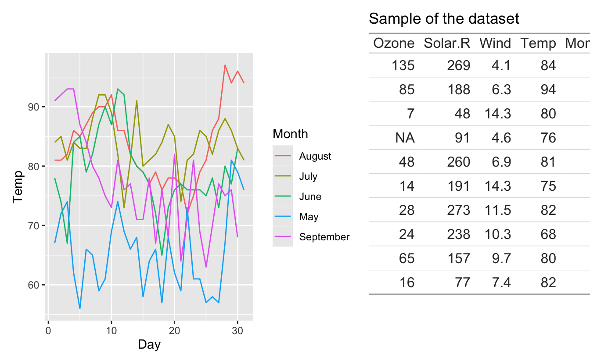

A few things can be gathered already from this small example. Tables can have titles (and subtitles, captions, and tags) like regular plots (in that sense they behave like [`wrap_elements()`](https://patchwork.data-imaginist.com/reference/wrap_elements.html) output). Also, and this is perhaps more interesting, patchwork is aware that the first row is special (a header row), and thus places that on top of the panel area so that the plot region of the left plot is aligned with the body of the table, not the full table.

Lastly, we see that tables often have a fixed size, contrary to plots which can shrink and expand based on how much room they have. Because of this, our table is overflowing it's region in the plot above creating a not-so-great look.

Let's see how we can use [`wrap_table()`](https://patchwork.data-imaginist.com/reference/wrap_table.html) to control some of these behaviors. First, while we could decrease the font size in the table to make it smaller, we could also allow it some more space instead. We could do this by using `plot_layout(widths = ...)` but it would require a fair amount of guessing on our side to get it just right. Thankfully, patchwork is smart enough to figure it out for us and we can instruct it to do so using the `space` argument in [`wrap_table()`](https://patchwork.data-imaginist.com/reference/wrap_table.html). Setting it to `"free_y"` instructs it to fix the width to the table width but keep the height free:

<pre class='chroma'><code class='language-r' data-lang='r'>p1 + <a href='https://patchwork.data-imaginist.com/reference/wrap_table.html'>wrap_table</a>(aq, space = "free_y")
</code></pre>
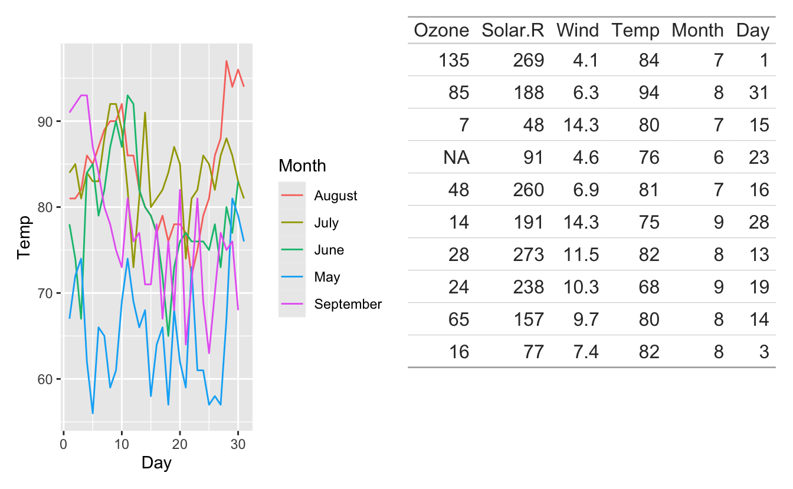

Setting `space` to `"fixed"` would constrain both the width and the height of the area it occupies. Since we only have a single row in our layout this would leave us with some empty horizontal space:

<pre class='chroma'><code class='language-r' data-lang='r'>p1 + <a href='https://patchwork.data-imaginist.com/reference/wrap_table.html'>wrap_table</a>(aq, space = "fixed")
</code></pre>
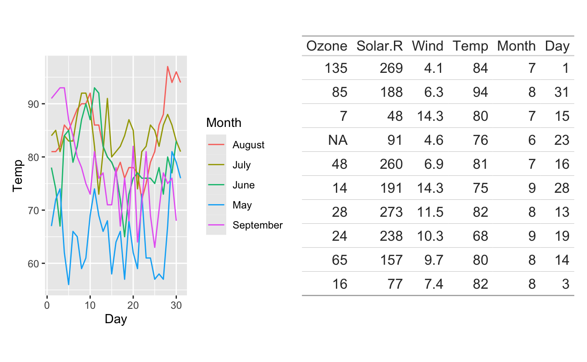

If the space is fixed in the y direction and the table has any source notes or footnotes, these will behave like the column header and be placed outside the panel area depending on the `panel` setting

<pre class='chroma'><code class='language-r' data-lang='r'>aq_footer &lt;- <a href='https://gt.rstudio.com/reference/gt.html'>gt</a>(aq) |&gt;
  <a href='https://gt.rstudio.com/reference/tab_source_note.html'>tab_source_note</a>("This is not part of the table body")
p1 + <a href='https://patchwork.data-imaginist.com/reference/wrap_table.html'>wrap_table</a>(aq_footer, space = "fixed")
</code></pre>
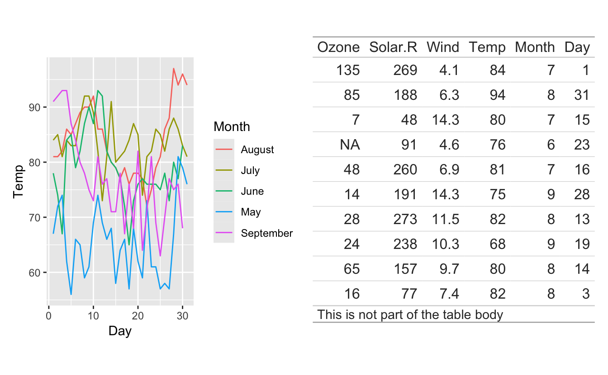

While the space argument is great for making the composition look good and the table well placed in the whole, it can also serve a different purpose of making sure that rows (or columns) are aligned with the axis of a plot. There are no facilities to ensure that the breaks order matches between plots and tables so that is the responsibility of the user, but otherwise this is a great way to use tables to directly augment a plot:

<pre class='chroma'><code class='language-r' data-lang='r'>p2 &lt;- <a href='https://ggplot2.tidyverse.org/reference/ggplot.html'>ggplot</a>(airquality) +
  <a href='https://ggplot2.tidyverse.org/reference/geom_boxplot.html'>geom_boxplot</a>(<a href='https://ggplot2.tidyverse.org/reference/aes.html'>aes</a>(x = month.name[Month], y = Temp)) +
  <a href='https://ggplot2.tidyverse.org/reference/theme.html'>theme</a>(axis.text.x = <a href='https://ggplot2.tidyverse.org/reference/element.html'>element_blank</a>(), axis.title.x = <a href='https://ggplot2.tidyverse.org/reference/element.html'>element_blank</a>()) +
  <a href='https://ggplot2.tidyverse.org/reference/scale_discrete.html'>scale_x_discrete</a>(expand = <a href='https://rdrr.io/r/base/c.html'>c</a>(0, 0.5))

# Construct our table
table &lt;- <a href='https://rdrr.io/r/base/cbind.html'>rbind</a>(
  <a href='https://rdrr.io/r/base/tapply.html'>tapply</a>(airquality$Temp, airquality$Month, max),
  <a href='https://rdrr.io/r/base/tapply.html'>tapply</a>(airquality$Temp, airquality$Month, median),
  <a href='https://rdrr.io/r/base/tapply.html'>tapply</a>(airquality$Temp, airquality$Month, min)
)
<a href='https://rdrr.io/r/base/colnames.html'>colnames</a>(table) &lt;- month.name[5:9]
table &lt;- <a href='https://rdrr.io/r/base/data.frame.html'>data.frame</a>(
  Measure = <a href='https://rdrr.io/r/base/c.html'>c</a>("Max", "Median", "Min"),
  table
)
table &lt;- <a href='https://gt.rstudio.com/reference/gt.html'>gt</a>(table, rowname_col = "Measure") |&gt;
  <a href='https://gt.rstudio.com/reference/cols_width.html'>cols_width</a>(<a href='https://tidyselect.r-lib.org/reference/starts_with.html'>contains</a>(month.name) ~ <a href='https://gt.rstudio.com/reference/px.html'>px</a>(100)) |&gt;
  <a href='https://gt.rstudio.com/reference/cols_align.html'>cols_align</a>(align = "center") |&gt;
  <a href='https://gt.rstudio.com/reference/cols_align.html'>cols_align</a>(align = "right", columns = "Measure")

p2 / <a href='https://patchwork.data-imaginist.com/reference/wrap_table.html'>wrap_table</a>(table, space = "fixed")
</code></pre>
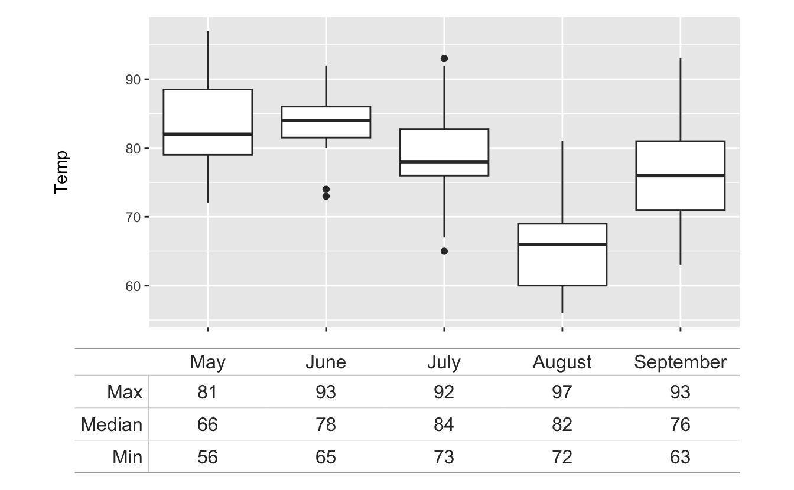

Circling back, there was another argument to [`wrap_table()`](https://patchwork.data-imaginist.com/reference/wrap_table.html) we didn't get into yet. In the plot above, we see that the row names are conveniently aligned with the axis rather than the panel of the plot above, in the same way as the headers where placed outside the panel area. This is a nice default and generally makes sense for the semantics of a table, but you might want something different. The `panel` argument allows you to control this exact behavior. It takes `"body"`, `"full"`, `"rows"`, or `"cols"` which indicate what portion of the table should be inside the panel area. The default is `"body"` which places row and column names outside the panel. `"full"`, on the contrary, places everything inside, while `"rows"` and `"cols"` are half versions that allows you to keep either column *or* row names outside the panel respectively.

<pre class='chroma'><code class='language-r' data-lang='r'># Place all rows (including the header row) inside the panel area
p1 + <a href='https://patchwork.data-imaginist.com/reference/wrap_table.html'>wrap_table</a>(aq, panel = "rows", space = "free_y")
</code></pre>
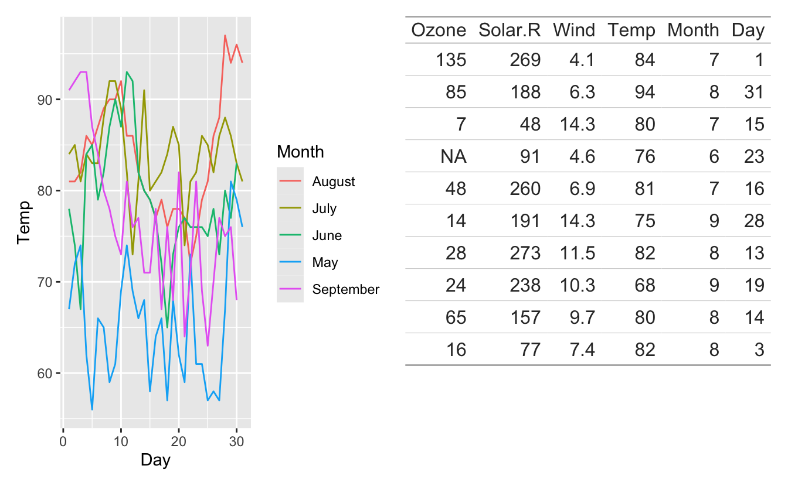

Just like the tables support ggplot2-like titles, they also support tags, meaning that patchworks auto-tagging works as expected. It can be turned off using the `ignore_tag` argument but often you'd want to treat it as a figure in the figure text:

<pre class='chroma'><code class='language-r' data-lang='r'>p1 + <a href='https://patchwork.data-imaginist.com/reference/wrap_table.html'>wrap_table</a>(aq, panel = "rows", space = "free_y") +
  <a href='https://patchwork.data-imaginist.com/reference/plot_annotation.html'>plot_annotation</a>(tag_levels = "A") &amp;
  <a href='https://ggplot2.tidyverse.org/reference/theme.html'>theme</a>(plot.tag = <a href='https://ggplot2.tidyverse.org/reference/element.html'>element_text</a>(margin = <a href='https://ggplot2.tidyverse.org/reference/element.html'>margin</a>(0, 6, 6, 0)))
</code></pre>
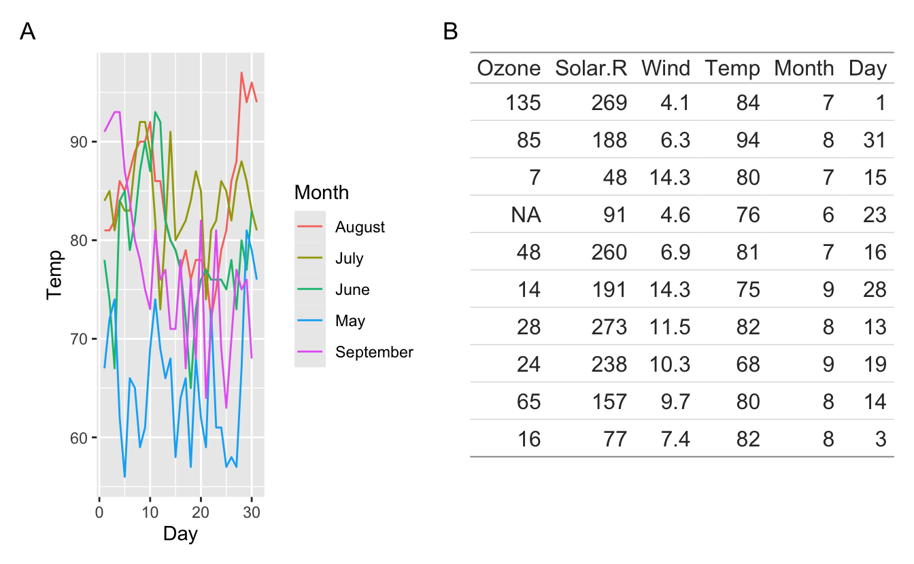

### Accesibility

We truly believe that the features laid out above will be a boon for augmenting your data visualisation with data that can be read precisely at a glance. However, we would be remiss to not note how tables that are part of a patchwork visualisation doesn't have the same accessibility featurees as a gt table included directly in e.g. an HTML output. This is because graphics are rasterised into a PNG file and thus looses all semantical information that is inherent in a table. This should be kept in mind when providing Alt text for your figures so you ensure they are legible for everyone.

### Future

The support on the patchwork end is likely done at this point, but the conversion to grobs that has been added to gt is still somewhat young and will improve over time. It is likely that markdown formatting (through marquee) and other niceties will get added, leading to even more power in composing tables with plots using patchwork as the glue between them. As with the [support for gt in typst](https://quarto.org/docs/blog/posts/2024-07-02-beautiful-tables-in-typst/) the support for gt in patchwork is part of our larger effort to bring the power of gt to more environments and create a single unified solution to table styling.

## With freedom comes great responsibility

The second leg of this release concerns the [`free()`](https://patchwork.data-imaginist.com/reference/free.html) function which was introduced in the last release. I devoted a whole section of my posit::conf talk this year to talk about [`free()`](https://patchwork.data-imaginist.com/reference/free.html) and how it was a good thing to say no to requests for functionality until you have a solution that fits into your API and doesn't add clutter. I really like how the API for [`free()`](https://patchwork.data-imaginist.com/reference/free.html) turned out but I also knew it could do more. In this release it delivers on those promises with two additional arguments.

### Which side?

As it were, [`free()`](https://patchwork.data-imaginist.com/reference/free.html) could only be used to completely turn off alignment of a plot, e.g. like below:

<pre class='chroma'><code class='language-r' data-lang='r'>p1 &lt;- <a href='https://ggplot2.tidyverse.org/reference/ggplot.html'>ggplot</a>(mtcars) +
  <a href='https://ggplot2.tidyverse.org/reference/geom_bar.html'>geom_bar</a>(<a href='https://ggplot2.tidyverse.org/reference/aes.html'>aes</a>(y = <a href='https://rdrr.io/r/base/factor.html'>factor</a>(gear), fill = <a href='https://rdrr.io/r/base/factor.html'>factor</a>(gear))) +
  <a href='https://ggplot2.tidyverse.org/reference/scale_discrete.html'>scale_y_discrete</a>(
    "",
    labels = <a href='https://rdrr.io/r/base/c.html'>c</a>("3 gears are often enough",
               "But, you know, 4 is a nice number",
               "I would def go with 5 gears in a modern car")
  )
p2 &lt;- <a href='https://ggplot2.tidyverse.org/reference/ggplot.html'>ggplot</a>(mtcars) + <a href='https://ggplot2.tidyverse.org/reference/geom_point.html'>geom_point</a>(<a href='https://ggplot2.tidyverse.org/reference/aes.html'>aes</a>(mpg, disp))

<a href='https://patchwork.data-imaginist.com/reference/free.html'>free</a>(p1) / p2
</code></pre>
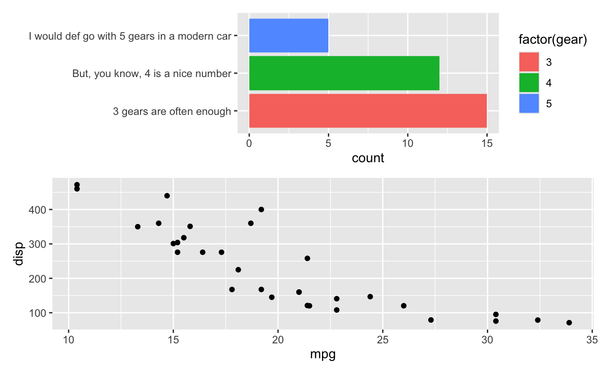

We can see that panel alignment has been turned off both to the left and to the right (and top and bottom if it were visible). But perhaps you are only interested in un-aligning the left side, keeping the legend to the right of both plots. Now you can, thanks to the `side` argument which takes a string containing one or more of the `t`, `r`, `b`, and `l` characters to indicate which sides to apply the freeing to (default is `"trbl"` meaning "target all sides").

<pre class='chroma'><code class='language-r' data-lang='r'><a href='https://patchwork.data-imaginist.com/reference/free.html'>free</a>(p1, side = "l") / p2
</code></pre>
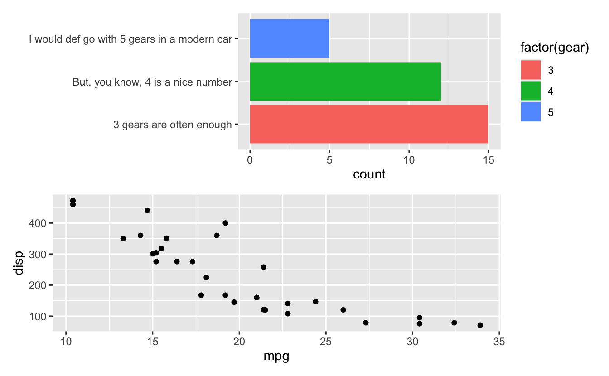

Freeing works inside nested patchworks, where you can target various sides at various levels:

<pre class='chroma'><code class='language-r' data-lang='r'>p3 &lt;- <a href='https://ggplot2.tidyverse.org/reference/ggplot.html'>ggplot</a>(mtcars) +
  <a href='https://ggplot2.tidyverse.org/reference/geom_boxplot.html'>geom_boxplot</a>(<a href='https://ggplot2.tidyverse.org/reference/aes.html'>aes</a>(y = <a href='https://rdrr.io/r/base/factor.html'>factor</a>(gear), disp)) +
  <a href='https://ggplot2.tidyverse.org/reference/scale_discrete.html'>scale_y_discrete</a>(
    "",
    labels = <a href='https://rdrr.io/r/base/c.html'>c</a>("... and 3",
               "4 of them",
               "5 gears")
  )

nested &lt;- p2 / <a href='https://patchwork.data-imaginist.com/reference/free.html'>free</a>(p1, side = "l")

<a href='https://patchwork.data-imaginist.com/reference/free.html'>free</a>(nested, side = "r") /
  p3
</code></pre>
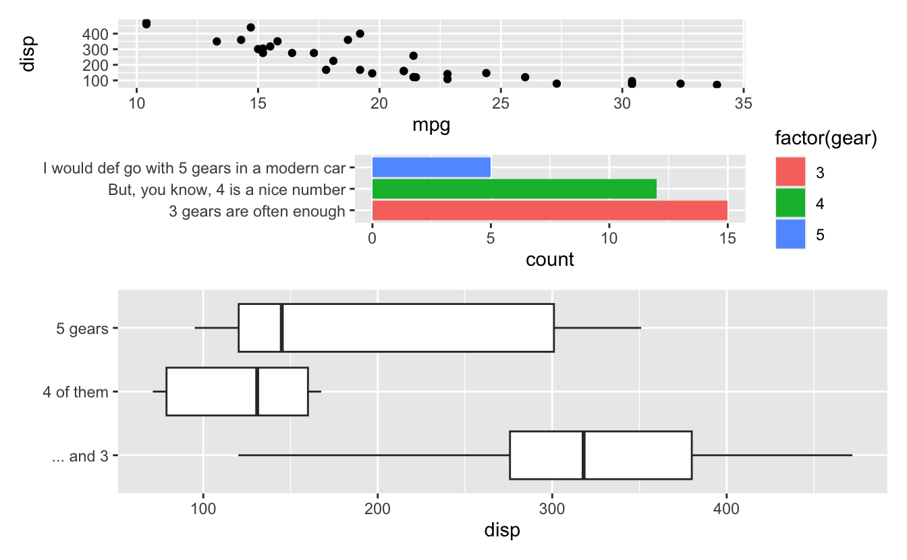

### What does "freeing" means anyway?

While being able to target specific sides is pretty great in and off itself, we are not done yet. After being able to *not* align panels the most requested feature was the possibility of moving the axis title closer to the axis text if alignment had pushed it apart. Consider again our unfreed patchwork:

<pre class='chroma'><code class='language-r' data-lang='r'>p1 / p2
</code></pre>

While we can "fix" it by letting the top panel stretch, another way to improve upon it would be to move the dangling y-axis title of the bottom plot closer to the axis. Enter the `type` argument to [`free()`](https://patchwork.data-imaginist.com/reference/free.html) which informs patchwork how to not align the input. The default (`"panel"`) works just as [`free()`](https://patchwork.data-imaginist.com/reference/free.html) always has, but the other two values opens up some new nifty goodies. Setting `type = "label"` does exactly what we discussed above, freeing the label from alignment so it sticks together with the axis and axis text:

<pre class='chroma'><code class='language-r' data-lang='r'>p1 /
  <a href='https://patchwork.data-imaginist.com/reference/free.html'>free</a>(p2, type = "label")
</code></pre>
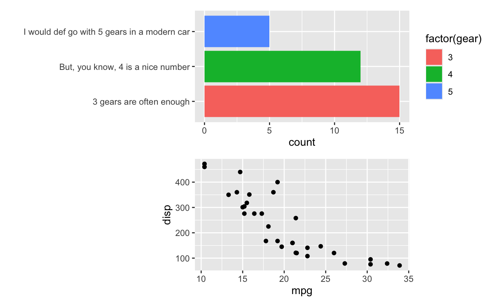

The other type is `"space"` which works slightly different. Using this you tell patchwork to not reserve any space for what the side(s) contain. This is perfect in situation where you already have empty space next to it that can fit the content. Consider this plot:

<pre class='chroma'><code class='language-r' data-lang='r'><a href='https://patchwork.data-imaginist.com/reference/plot_spacer.html'>plot_spacer</a>() + p1 +
  p2 + p2
</code></pre>
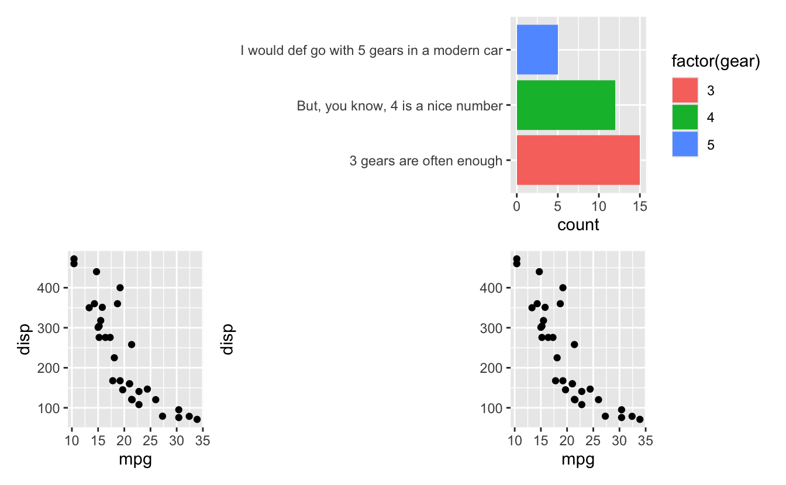

Ugh, the axis text of the top plot pushes everything apart even though there is ample of space for it in the empty region on the left. This is where `type = "space"` comes in handy:

<pre class='chroma'><code class='language-r' data-lang='r'><a href='https://patchwork.data-imaginist.com/reference/plot_spacer.html'>plot_spacer</a>() + <a href='https://patchwork.data-imaginist.com/reference/free.html'>free</a>(p1, type = "space", side = "l") +
  p2 + p2
</code></pre>
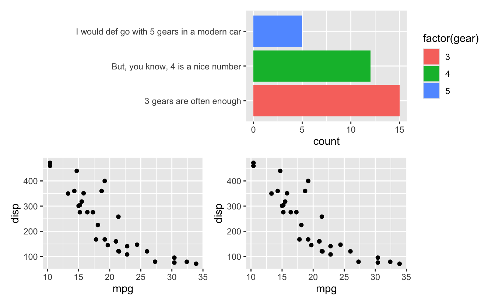

Of course, such power comes with the responsibility of you ensuring there is actually space for it --- otherwise it will escape out of the figure area:

<pre class='chroma'><code class='language-r' data-lang='r'><a href='https://patchwork.data-imaginist.com/reference/free.html'>free</a>(p1, type = "space", side = "l") /
  p2
</code></pre>
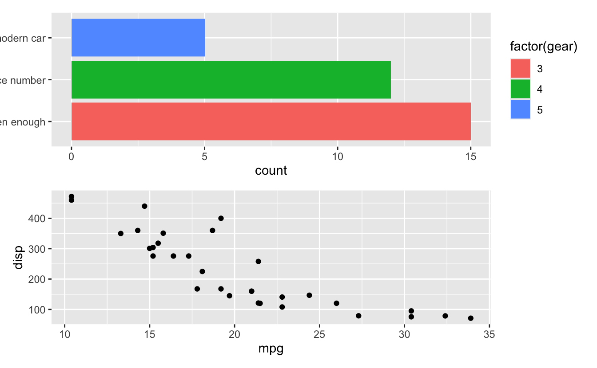

All the different types of freeing can be stacked on top of each other so you can have a plot that keeps the left axis label together with the axis while also stretches the right side to take up empty space:

<pre class='chroma'><code class='language-r' data-lang='r'>p1 /
  <a href='https://patchwork.data-imaginist.com/reference/free.html'>free</a>(<a href='https://patchwork.data-imaginist.com/reference/free.html'>free</a>(p2, "panel", "r"), "label", "l")
</code></pre>
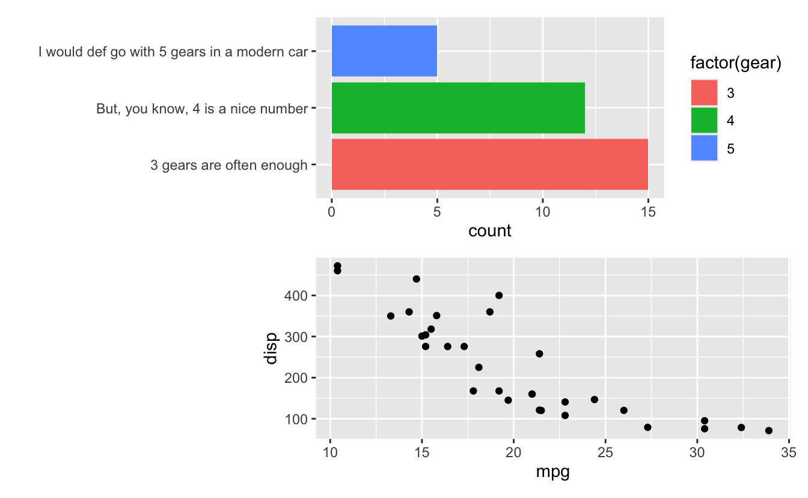

But as always, don't go overboard. If you find yourself needing to use an elaborate combination of stacked [`free()`](https://patchwork.data-imaginist.com/reference/free.html) calls there is a good chance that something with your core composition needs rethinking.

## The rest

The above are the clear highlights of this release. It also contains the standard bug fixes --- especially in the area of axis collecting which was introduced in the last release and came with a bunch of edge cases that were unaccounted for. There is also a new utility function: [`merge()`](https://rdrr.io/r/base/merge.html) which is an alternative to the `-` operator that I don't think many users understood or used. It allows you to merge all plots together into a nested patchwork so that the right hand side is added to a new composition.

## Acknowledgements

Thank you to all people who have contributed issues, code and comments to this release:

[@BenVolpe94](https://github.com/BenVolpe94), [@daniellembecker](https://github.com/daniellembecker), [@dchiu911](https://github.com/dchiu911), [@ericKuo722](https://github.com/ericKuo722), [@Fan-iX](https://github.com/Fan-iX), [@IndrajeetPatil](https://github.com/IndrajeetPatil), [@jack-davison](https://github.com/jack-davison), [@karchern](https://github.com/karchern), [@laresbernardo](https://github.com/laresbernardo), [@marchtaylor](https://github.com/marchtaylor), [@mariadelmarq](https://github.com/mariadelmarq), [@Maschette](https://github.com/Maschette), [@michaeltopper1](https://github.com/michaeltopper1), [@mkoohafkan](https://github.com/mkoohafkan), [@n-kall](https://github.com/n-kall), [@person-c](https://github.com/person-c), [@pettyalex](https://github.com/pettyalex), [@petzi53](https://github.com/petzi53), [@phispu](https://github.com/phispu), [@psychelzh](https://github.com/psychelzh), [@rinivarg](https://github.com/rinivarg), [@selkamand](https://github.com/selkamand), [@Soham6298](https://github.com/Soham6298), [@svraka](https://github.com/svraka), [@teng-gao](https://github.com/teng-gao), [@teunbrand](https://github.com/teunbrand), [@thomasp85](https://github.com/thomasp85), [@timz0605](https://github.com/timz0605), [@wish1832](https://github.com/wish1832), and [@Yunuuuu](https://github.com/Yunuuuu).

