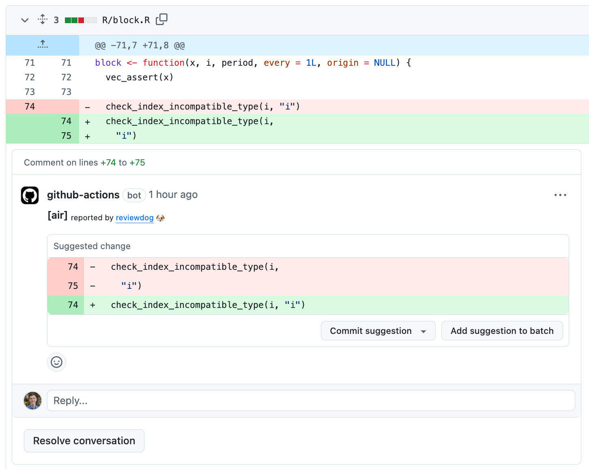

We're very excited to announce [Air 0.7.0](https://posit-dev.github.io/air/), a new release of our extremely fast R formatter. This post will act as a roundup of releases 0.5.0 through 0.7.0, including: even better Positron support, a new feature called autobracing, and an official GitHub Action! If you haven't heard of Air, read our [announcement blog post](https://www.tidyverse.org/blog/2025/02/air/) first to get up to speed. To install Air, read our [editors guide](https://posit-dev.github.io/air/editors.html).

## Positron

The [Air extension](https://open-vsx.org/extension/posit/air-vscode) is now included in [Positron](https://positron.posit.co/) by default, and will automatically keep itself up to date. We've been working hard to ensure that Air leaves a positive first impression, and we think that having Positron come batteries included with Air really helps with that! Positron now also ships with [Ruff](https://docs.astral.sh/ruff/), the extremely fast Python formatter and linter, ensuring that you have a great editing experience out of the box, no matter which language you prefer.

We've also streamlined the process of adding Air to a new or existing project. With dev usethis, you can now run [`usethis::use_air()`](https://usethis.r-lib.org/dev/reference/use_air.html) to automatically configure recommended Air settings. In particular, this will:

-   Create an [empty `air.toml`](https://posit-dev.github.io/air/configuration.html#configuration-recommendations).

-   Create `.vscode/settings.json` filled with the following settings. This enables `Format on Save` within your workspace.

    ``` json
    {
        "[r]": {
            "editor.formatOnSave": true,
            "editor.defaultFormatter": "Posit.air-vscode"
        }
    }
    ```

-   Create `.vscode/extensions.json` filled with the following settings. This automatically prompts contributors that don't have the Air extension to install it when they open your workspace, ensuring that everyone is using the same formatter!

    ``` json
    {
        "recommendations": [
            "Posit.air-vscode"
        ]
    }
    ```

-   Update your `.Rbuildignore` to exclude Air related configuration, if you're working on an R package.

Once you've used usethis to configure Air, you can now immediately reformat your entire workspace by running `Air: Format Workspace Folder` from the Command Palette (accessible via `Cmd + Shift + P` on Mac/Linux, or `Ctrl + Shift + P` on Windows). I've found that this is invaluable for adopting Air in an existing project!

To summarize, we've reduced our advice on adding Air to an existing project down to:

-   Open Positron

-   Run [`usethis::use_air()`](https://usethis.r-lib.org/reference/use_air.html)

-   Run `Air: Format Workspace Folder`

-   Commit, push, and then enjoy using `Format on Save` forevermore 😄

## More editors!

Positron isn't the only editor that's received some love! We now have official documentation for using Air in the following editors:

-   [Zed](https://posit-dev.github.io/air/editor-zed.html)

-   [Neovim](https://posit-dev.github.io/air/editor-neovim.html)

-   [Helix](https://posit-dev.github.io/air/editor-helix.html)

We're very proud of the fact that Air can be used within any editor, not just RStudio and Positron! This documentation was a community effort - thanks in particular to [@taplasz](https://github.com/taplasz), [@PMassicotte](https://github.com/PMassicotte), [@m-muecke](https://github.com/m-muecke), [@TymekDev](https://github.com/TymekDev), and [@wurli](https://github.com/wurli).

## Autobracing

Autobracing is the process of adding braces (i.e. [`{ }`](https://rdrr.io/r/base/Paren.html)) to if statements, loops, and function definitions to create more consistent, readable, and portable code. It looks like this:

``` r
for (i in seq_along(x)) x[[i]] <- x[[i]] + 1L

# Becomes:
for (i in seq_along(x)) {
  x[[i]] <- x[[i]] + 1L
}

function(x, y)
  call_that_spans_lines(
    x,
    y,
    fixed_option = FALSE
  )

# Becomes:
function(x, y) {
  call_that_spans_lines(
    x,
    y,
    fixed_option = FALSE
  )
}
```

It's particularly important to autobrace multiline if statements for *portability*, which we roughly define as the ability to copy and paste that if statement into any context and have it still parse correctly. Consider the following if statement:

``` r
do_something <- function(this = TRUE) {
  if (this)
    do_this()
  else 
    do_that()
}
```

As written, this is correct R code, but if you were to pull out the if statement and place it in a file at "top level" and try to run it, you'd see a parse error:

``` r
if (this)
  do_this()
else 
  do_that()
#> Error: unexpected 'else'
```

In practice, this typically bites you when you're debugging and you send a chunk of lines to the console:

<video controls autoplay loop muted width="100%" src="video/portable-if-statement.mov" style="border: 2px solid #CCC;">
</video>

Air autobraces this if statement to the following, which has no issues with portability:

``` r
do_something <- function(this = TRUE) {
  if (this) {
    do_this()
  } else {
    do_that()
  }
}
```

### Give side effects some Air

We believe code that create *side effects* which modify state or affect control flow are important enough to live on their own line. For example, the following [`stop()`](https://rdrr.io/r/base/stop.html) call is an example of a side effect, so it moves to its own line and is autobraced:

``` r
if (anyNA(x)) stop("`x` can't contain missing values.")

# Becomes:
if (anyNA(x)) {
  stop("`x` can't contain missing values.")
}
```

You might be thinking, "But I like my single line if statements!" We do too! Air still allows single line if statements if they look to be used for their *value* rather than for their *side effect*. These single line if statements are still allowed:

``` r
x <- if (condition) this else that

x <- x %||% if (condition) this else that

list(a = if (condition) this else that)
```

Similarly, single line function definitions are also still allowed if they don't already have braces and don't exceed the line length:

``` r
add_one <- function(x) x + 1

bools <- map_lgl(xs, function(x) is.logical(x) && length(x) == 1L && !is.na(x))
```

For the full set of rules, check out our [documentation on autobracing](https://posit-dev.github.io/air/formatter.html#autobracing).

## Empty braces

You may have noticed the following forced expansion of empty [`{}`](https://rdrr.io/r/base/Paren.html) in previous versions of Air:

``` r
dummy <- function() {}

# Previously became:
dummy <- function() {
}

tryCatch(fn, error = function(e) {})

# Previously became:
tryCatch(fn, error = function(e) {
})

my_fn(expr = {}, option = TRUE)

# Previously became:
my_fn(
  expr = {
  }, 
  option = TRUE
)
```

As of 0.7.0, empty braces [`{}`](https://rdrr.io/r/base/Paren.html) are now never expanded, which retains the original form of each of these examples.

## `skip` configuration

In [our release post](https://www.tidyverse.org/blog/2025/02/air/#how-can-i-disable-formatting), we detailed how to disable formatting using a `# fmt: skip` comment for a single expression, or a `# fmt: skip file` comment for an entire file. Skip comments are useful for disabling formatting for one-off function calls, but sometimes you may find yourself repeatedly using functions from a domain specific language (DSL) that doesn't follow conventional formatting rules. For example, the igraph package contains a DSL for constructing a graph from a literal representation:

``` r
igraph::graph_from_literal(A +-+ B +---+ C ++ D + E)
```

By default, Air would format this as:

``` r
igraph::graph_from_literal(A + -+B + ---+C + +D + E)
```

If you use `graph_from_literal()` often, it would be annoying to add `# fmt: skip` comments at every call site. Instead, `air.toml` now supports a `skip` field that allows you to specify function names that you never want formatting for. Specifying this would retain the original formatting of the `graph_from_literal()` call, even without a `# fmt: skip` comment:

``` toml
skip = ["graph_from_literal"]
```

In the short term, you may also want to use this for [`tibble::tribble()`](https://tibble.tidyverse.org/reference/tribble.html) calls, i.e. `skip = ["tribble"]`. In the long term, we're hoping to provide more sophisticated tooling for formatting using a [specified alignment](https://github.com/posit-dev/air/issues/113).

## GitHub Action

Air now has an official GitHub Action, [`setup-air`](https://github.com/posit-dev/setup-air). This action really only has one job - to get Air installed on your GitHub runner and put on the `PATH`. The basic usage is:

``` yaml
- name: Install Air
  uses: posit-dev/setup-air@v1
```

If you need to pin a version:

``` yaml
- name: Install Air 0.4.4
  uses: posit-dev/setup-air@v1
  with:
    version: "0.4.4"
```

From there, you can call Air's CLI in downstream steps. A minimal workflow that errors if any files require formatting might look like:

``` yaml
- name: Install Air
  uses: posit-dev/setup-air@v1

- name: Check formatting
  run: air format . --check
```

Rather than creating the workflow file yourself, we instead recommend using usethis to pull in our [example workflow](https://github.com/posit-dev/setup-air/blob/main/examples/format-suggest.yaml):

``` r
usethis::use_github_action(url = "https://github.com/posit-dev/setup-air/blob/main/examples/format-suggest.yaml")
```

This is a special workflow that runs on pull requests. It calls `air format` and then uses [`reviewdog/action-suggester`](https://github.com/reviewdog/action-suggester) to push any formatting diffs as GitHub Suggestion comments on your pull request. It looks like this:



You can accept all suggestions in a single batch, which will then rerun the format check, along with any other GitHub workflows (like an R package check), so you can feel confident that accepting the changes hasn't broken anything.

We like this workflow because it provides an easy way for external contributors who aren't using Air to still abide by your formatting rules. The external contributor can even accept the suggestions themselves, so by the time you look at their pull request it's already good to go from a formatting perspective ✅!

## Acknowledgements

A big thanks to the 49 users who helped make this release possible by finding bugs, discussing issues, contributing documentation, and writing code: [@adisarid](https://github.com/adisarid), [@aronatkins](https://github.com/aronatkins), [@ateucher](https://github.com/ateucher), [@avhz](https://github.com/avhz), [@aymennasri](https://github.com/aymennasri), [@christophe-gouel](https://github.com/christophe-gouel), [@dkStevensNZed](https://github.com/dkStevensNZed), [@eitsupi](https://github.com/eitsupi), [@ELICHOS](https://github.com/ELICHOS), [@fh-mthomson](https://github.com/fh-mthomson), [@fzenoni](https://github.com/fzenoni), [@gaborcsardi](https://github.com/gaborcsardi), [@grasshoppermouse](https://github.com/grasshoppermouse), [@hadley](https://github.com/hadley), [@idavydov](https://github.com/idavydov), [@j-dobner](https://github.com/j-dobner), [@jacpete](https://github.com/jacpete), [@jeffkeller-einc](https://github.com/jeffkeller-einc), [@jhk0530](https://github.com/jhk0530), [@joakimlinde](https://github.com/joakimlinde), [@JosephBARBIERDARNAL](https://github.com/JosephBARBIERDARNAL), [@JosiahParry](https://github.com/JosiahParry), [@kkanden](https://github.com/kkanden), [@krlmlr](https://github.com/krlmlr), [@Kupac](https://github.com/Kupac), [@kv9898](https://github.com/kv9898), [@lcolladotor](https://github.com/lcolladotor), [@lulunac27a](https://github.com/lulunac27a), [@m-muecke](https://github.com/m-muecke), [@maelle](https://github.com/maelle), [@matanhakim](https://github.com/matanhakim), [@njtierney](https://github.com/njtierney), [@novica](https://github.com/novica), [@ntluong95](https://github.com/ntluong95), [@philibe](https://github.com/philibe), [@PMassicotte](https://github.com/PMassicotte), [@RobinKohrs](https://github.com/RobinKohrs), [@salim-b](https://github.com/salim-b), [@sawelch-NIVA](https://github.com/sawelch-NIVA), [@schochastics](https://github.com/schochastics), [@Sebastian-T-T](https://github.com/Sebastian-T-T), [@stevenpav-helm](https://github.com/stevenpav-helm), [@t-kalinowski](https://github.com/t-kalinowski), [@taplasz](https://github.com/taplasz), [@tbadams45cdm](https://github.com/tbadams45cdm), [@wurli](https://github.com/wurli), [@xx02al](https://github.com/xx02al), [@Yunuuuu](https://github.com/Yunuuuu), and [@yutannihilation](https://github.com/yutannihilation).

