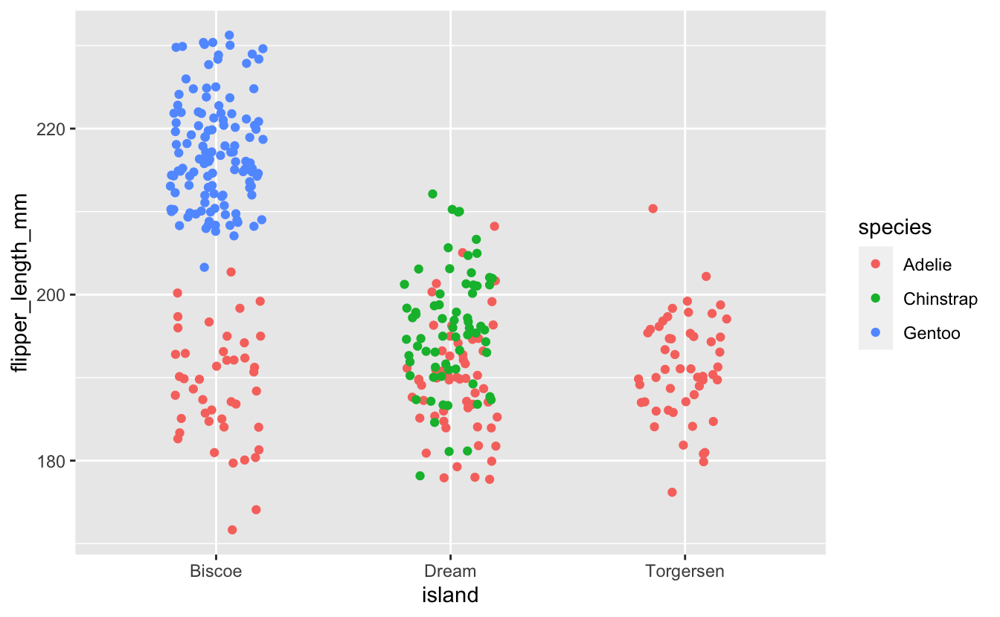
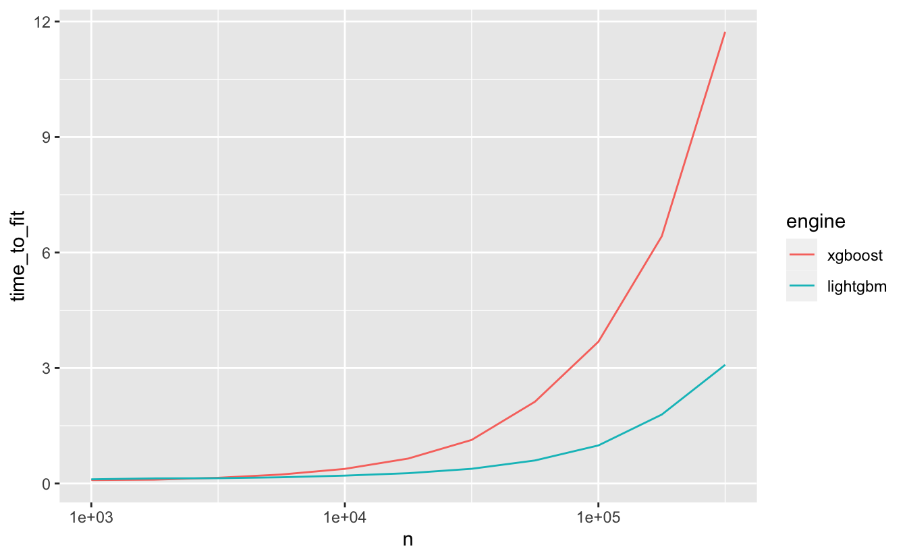

We're super stoked to announce the first release of the [bonsai](https://bonsai.tidymodels.org/) package on CRAN! bonsai is a [parsnip](https://parsnip.tidymodels.org/) extension package for tree-based models.

You can install it from CRAN with:

<pre class='chroma'><code class='language-r' data-lang='r'><a href='https://rdrr.io/r/utils/install.packages.html'>install.packages</a>("bonsai")</code></pre>

Without extension packages, the parsnip package already supports fitting decision trees, random forests, and boosted trees. The bonsai package introduces support for two additional engines that implement variants of these algorithms:

-   [partykit](https://CRAN.R-project.org/package=partykit): conditional inference trees via [`decision_tree()`](https://parsnip.tidymodels.org/reference/decision_tree.html) and conditional random forests via [`rand_forest()`](https://parsnip.tidymodels.org/reference/rand_forest.html)
-   [LightGBM](https://CRAN.R-project.org/package=lightgbm): optimized gradient boosted trees via [`boost_tree()`](https://parsnip.tidymodels.org/reference/boost_tree.html)

To illustrate the advantages that these new engines have to offer, we'll fit a few models and explore their output. First, loading bonsai as well as the rest of the tidymodels core packages:

<pre class='chroma'><code class='language-r' data-lang='r'><a href='https://rdrr.io/r/base/library.html'>library</a>(<a href='https://bonsai.tidymodels.org/'>bonsai</a>)
#&gt; Loading required package: parsnip

<a href='https://rdrr.io/r/base/library.html'>library</a>(<a href='https://tidymodels.tidymodels.org'>tidymodels</a>)
#&gt; ── Attaching packages ────────────────────────────────────── tidymodels 0.2.0 ──
#&gt; ✔ broom        0.8.0          ✔ rsample      0.1.1     
#&gt; ✔ dials        1.0.0          ✔ tibble       3.1.7     
#&gt; ✔ dplyr        1.0.9          ✔ tidyr        1.2.0     
#&gt; ✔ ggplot2      3.3.6          ✔ tune         0.2.0     
#&gt; ✔ infer        1.0.2          ✔ workflows    0.2.6     
#&gt; ✔ modeldata    0.1.1.9000     ✔ workflowsets 0.2.1     
#&gt; ✔ purrr        0.3.4          ✔ yardstick    1.0.0     
#&gt; ✔ recipes      0.2.0
#&gt; ── Conflicts ───────────────────────────────────────── tidymodels_conflicts() ──
#&gt; ✖ purrr::discard() masks scales::discard()
#&gt; ✖ dplyr::filter()  masks stats::filter()
#&gt; ✖ dplyr::lag()     masks stats::lag()
#&gt; ✖ recipes::step()  masks stats::step()
#&gt; • Search for functions across packages at https://www.tidymodels.org/find/</code></pre>

We'll use a [dataset](https://allisonhorst.github.io/palmerpenguins/) containing measurements on 3 different species of penguins as an example. Loading that data in and checking it out:

<pre class='chroma'><code class='language-r' data-lang='r'><a href='https://rdrr.io/r/utils/data.html'>data</a>(penguins, package = "modeldata")

<a href='https://rdrr.io/r/utils/str.html'>str</a>(penguins)
#&gt; tibble [344 × 7] (S3: tbl_df/tbl/data.frame)
#&gt;  $ species          : Factor w/ 3 levels "Adelie","Chinstrap",..: 1 1 1 1 1 1 1 1 1 1 ...
#&gt;  $ island           : Factor w/ 3 levels "Biscoe","Dream",..: 3 3 3 3 3 3 3 3 3 3 ...
#&gt;  $ bill_length_mm   : num [1:344] 39.1 39.5 40.3 NA 36.7 39.3 38.9 39.2 34.1 42 ...
#&gt;  $ bill_depth_mm    : num [1:344] 18.7 17.4 18 NA 19.3 20.6 17.8 19.6 18.1 20.2 ...
#&gt;  $ flipper_length_mm: int [1:344] 181 186 195 NA 193 190 181 195 193 190 ...
#&gt;  $ body_mass_g      : int [1:344] 3750 3800 3250 NA 3450 3650 3625 4675 3475 4250 ...
#&gt;  $ sex              : Factor w/ 2 levels "female","male": 2 1 1 NA 1 2 1 2 NA NA ...</code></pre>

Specifically, we'll make use of flipper length and home island to model a penguin's species:

<pre class='chroma'><code class='language-r' data-lang='r'>ggplot(penguins) +
  aes(x = island, y = flipper_length_mm, col = species) +
  geom_jitter(width = .2)
</code></pre>

Looking at this plot, you might begin to imagine your own simple set of binary splits for guessing which species a penguin might be given its home island and flipper length. Given that this small set of predictors almost completely separates our outcome with only a few splits, a relatively simple tree should serve our purposes just fine.

## Decision Trees

bonsai introduces support for fitting decision trees with partykit, which implements a variety of decision trees called conditional inference trees (CITs).

CITs differ from implementations of decision trees available elsewhere in the tidymodels in the criteria used to generate splits. The details of how these criteria differ are outside of the scope of this post.[^1] Practically, though, CITs offer a few notable advantages over CART- and C5.0-based decision trees:

-   **Overfitting**: Common implementations of decision trees are notoriously prone to overfitting, and require several well-chosen penalization (i.e. cost-complexity) and early stopping (e.g. pruning, max depth) hyperparameters to fit a model that will perform well when predicting on new observations. "Out-of-the-box," CITs are not as prone to these same issues and do not accept a penalization parameter at all.
-   **Selection bias**: Common implementations of decision trees are biased towards selecting variables with many possible split points or missing values. CITs are natively not prone to the first issue, and many popular implementations address the second vulnerability.

To define a conditional inference tree model specification, just set the modeling engine to `"partykit"` when creating a decision tree. Fitting to the penguins data, then:

<pre class='chroma'><code class='language-r' data-lang='r'>dt_mod &lt;-
  <a href='https://parsnip.tidymodels.org/reference/decision_tree.html'>decision_tree</a>() <a href='https://magrittr.tidyverse.org/reference/pipe.html'>%&gt;%</a>
  <a href='https://parsnip.tidymodels.org/reference/set_engine.html'>set_engine</a>(engine = "partykit") <a href='https://magrittr.tidyverse.org/reference/pipe.html'>%&gt;%</a>
  <a href='https://parsnip.tidymodels.org/reference/set_args.html'>set_mode</a>(mode = "classification") <a href='https://magrittr.tidyverse.org/reference/pipe.html'>%&gt;%</a>
  <a href='https://generics.r-lib.org/reference/fit.html'>fit</a>(
    formula = species ~ flipper_length_mm + island, 
    data = penguins
  )

dt_mod
#&gt; parsnip model object
#&gt; 
#&gt; 
#&gt; Model formula:
#&gt; species ~ flipper_length_mm + island
#&gt; 
#&gt; Fitted party:
#&gt; [1] root
#&gt; |   [2] island in Biscoe
#&gt; |   |   [3] flipper_length_mm &lt;= 203
#&gt; |   |   |   [4] flipper_length_mm &lt;= 196: Adelie (n = 38, err = 0.0%)
#&gt; |   |   |   [5] flipper_length_mm &gt; 196: Adelie (n = 7, err = 14.3%)
#&gt; |   |   [6] flipper_length_mm &gt; 203: Gentoo (n = 123, err = 0.0%)
#&gt; |   [7] island in Dream, Torgersen
#&gt; |   |   [8] island in Dream
#&gt; |   |   |   [9] flipper_length_mm &lt;= 192: Adelie (n = 59, err = 33.9%)
#&gt; |   |   |   [10] flipper_length_mm &gt; 192: Chinstrap (n = 65, err = 26.2%)
#&gt; |   |   [11] island in Torgersen: Adelie (n = 52, err = 0.0%)
#&gt; 
#&gt; Number of inner nodes:    5
#&gt; Number of terminal nodes: 6</code></pre>

Do any of these splits line up with your intuition? This tree results in only 6 terminal nodes and describes the structure shown in the above plot quite well.

Read more about this implementation of decision trees in [`?details_decision_tree_partykit`](https://parsnip.tidymodels.org/reference/details_decision_tree_partykit.html).

## Random Forests

One generalization of a decision tree is a *random forest*, which fits a large number of decision trees, each independently of the others. The fitted random forest model combines predictions from the individual decision trees to generate its predictions.

bonsai introduces support for random forests using the `partykit` engine, which implements an algorithm called a *conditional random forest*. Conditional random forests are a type of random forest that uses conditional inference trees (like the one we fit above!) for its constituent decision trees.

To fit a conditional random forest with partykit, our code looks pretty similar to that which we we needed to fit a conditional inference tree. Just switch out [`decision_tree()`](https://parsnip.tidymodels.org/reference/decision_tree.html) with [`rand_forest()`](https://parsnip.tidymodels.org/reference/rand_forest.html) and remember to keep the engine set as `"partykit"`.

<pre class='chroma'><code class='language-r' data-lang='r'>rf_mod &lt;- 
  <a href='https://parsnip.tidymodels.org/reference/rand_forest.html'>rand_forest</a>() <a href='https://magrittr.tidyverse.org/reference/pipe.html'>%&gt;%</a>
  <a href='https://parsnip.tidymodels.org/reference/set_engine.html'>set_engine</a>(engine = "partykit") <a href='https://magrittr.tidyverse.org/reference/pipe.html'>%&gt;%</a>
  <a href='https://parsnip.tidymodels.org/reference/set_args.html'>set_mode</a>(mode = "classification") <a href='https://magrittr.tidyverse.org/reference/pipe.html'>%&gt;%</a>
  <a href='https://generics.r-lib.org/reference/fit.html'>fit</a>(
    formula = species ~ flipper_length_mm + island, 
    data = penguins
  )</code></pre>

Read more about this implementation of random forests in [`?details_rand_forest_partykit`](https://parsnip.tidymodels.org/reference/details_rand_forest_partykit.html).

## Boosted Trees

Another generalization of a decision tree is a series of decision trees where *each tree depends on the results of previous trees*---this is called a *boosted tree*. bonsai implements an additional parsnip engine for this model type called `"lightgbm"`. While fitting boosted trees is quite computationally intensive, especially with high-dimensional data, LightGBM provides an implementation of a highly efficient variant of the algorithm.

To make use of it, start out with a `boost_tree` model spec and set `engine = "lightgbm"`:

<pre class='chroma'><code class='language-r' data-lang='r'>bt_mod &lt;-
  <a href='https://parsnip.tidymodels.org/reference/boost_tree.html'>boost_tree</a>() <a href='https://magrittr.tidyverse.org/reference/pipe.html'>%&gt;%</a>
  <a href='https://parsnip.tidymodels.org/reference/set_engine.html'>set_engine</a>(engine = "lightgbm") <a href='https://magrittr.tidyverse.org/reference/pipe.html'>%&gt;%</a>
  <a href='https://parsnip.tidymodels.org/reference/set_args.html'>set_mode</a>(mode = "classification") <a href='https://magrittr.tidyverse.org/reference/pipe.html'>%&gt;%</a>
  <a href='https://generics.r-lib.org/reference/fit.html'>fit</a>(
    formula = species ~ flipper_length_mm + island, 
    data = penguins
  )</code></pre>

The main benefit of using LightGBM is its computational efficiency: as the number of observations in training data increases, we can observe an increasingly substantial decrease in time-to-fit when using the LightGBM engine as compared to other implementations of boosted trees, like XGBoost.

To show this, we'll use the `sim_regression()` function from modeldata to simulate increasingly large datasets that we can fit models to. For example, generating a dataset with 10 observations and 20 numeric predictors:

<pre class='chroma'><code class='language-r' data-lang='r'>sim_regression(num_samples = 10)
#&gt; # A tibble: 10 × 21
#&gt;    outcome predictor_01 predictor_02 predictor_03 predictor_04 predictor_05
#&gt;      &lt;dbl&gt;        &lt;dbl&gt;        &lt;dbl&gt;        &lt;dbl&gt;        &lt;dbl&gt;        &lt;dbl&gt;
#&gt;  1  31.2        -0.352         2.52         2.43        -3.45         5.52 
#&gt;  2  -0.635      -4.26          1.99         1.32        -1.38        -1.37 
#&gt;  3  27.7        -1.10          2.02        -2.18         5.85        -1.01 
#&gt;  4  13.4        -1.76         -1.12        -3.11        -0.122        2.05 
#&gt;  5   0.815      -1.73          0.505        0.163        2.31        -6.38 
#&gt;  6  39.7        -0.0994        0.666        3.46         4.05         2.61 
#&gt;  7  33.4        -5.49         -7.15        -1.57        -4.27         1.61 
#&gt;  8  18.0        -2.07         -0.245        0.620        1.28         1.94 
#&gt;  9  25.9        -1.57         -3.26         6.20         1.50         0.164
#&gt; 10  12.0        -1.77         -1.70         1.70         1.35        -2.32 
#&gt; # … with 15 more variables: predictor_06 &lt;dbl&gt;, predictor_07 &lt;dbl&gt;,
#&gt; #   predictor_08 &lt;dbl&gt;, predictor_09 &lt;dbl&gt;, predictor_10 &lt;dbl&gt;,
#&gt; #   predictor_11 &lt;dbl&gt;, predictor_12 &lt;dbl&gt;, predictor_13 &lt;dbl&gt;,
#&gt; #   predictor_14 &lt;dbl&gt;, predictor_15 &lt;dbl&gt;, predictor_16 &lt;dbl&gt;,
#&gt; #   predictor_17 &lt;dbl&gt;, predictor_18 &lt;dbl&gt;, predictor_19 &lt;dbl&gt;,
#&gt; #   predictor_20 &lt;dbl&gt;</code></pre>

Now, fitting boosted trees on increasingly large datasets with XGBoost and LightGBM and observing time-to-fit:

<pre class='chroma'><code class='language-r' data-lang='r'># given an engine and nrow(training_data), return the time to fit
time_boost_fit &lt;- function(engine, n) &#123;
  time &lt;- 
    <a href='https://rdrr.io/r/base/system.time.html'>system.time</a>(&#123;
      <a href='https://parsnip.tidymodels.org/reference/boost_tree.html'>boost_tree</a>() <a href='https://magrittr.tidyverse.org/reference/pipe.html'>%&gt;%</a>
      <a href='https://parsnip.tidymodels.org/reference/set_engine.html'>set_engine</a>(engine = engine) <a href='https://magrittr.tidyverse.org/reference/pipe.html'>%&gt;%</a>
      <a href='https://parsnip.tidymodels.org/reference/set_args.html'>set_mode</a>(mode = "regression") <a href='https://magrittr.tidyverse.org/reference/pipe.html'>%&gt;%</a>
      <a href='https://generics.r-lib.org/reference/fit.html'>fit</a>(
        formula = outcome ~ ., 
        data = sim_regression(num_samples = n)
      )
    &#125;)
  
  tibble(
    engine = engine,
    n = n,
    time_to_fit = time[["elapsed"]]
  )
&#125;

# setup engine and n_samples combinations
engines &lt;- <a href='https://rdrr.io/r/base/rep.html'>rep</a>(<a href='https://rdrr.io/r/base/c.html'>c</a>(XGBoost = "xgboost", LightGBM = "lightgbm"), each = 11)
n_samples &lt;- <a href='https://rdrr.io/r/base/Round.html'>round</a>(<a href='https://rdrr.io/r/base/rep.html'>rep</a>(10 * 10^(<a href='https://rdrr.io/r/base/seq.html'>seq</a>(2, 4.5, .25)), times  = 2))

# apply the function over each combination
fit_times &lt;- 
  map2_dfr(
    engines,
    n_samples,
    time_boost_fit
  ) <a href='https://magrittr.tidyverse.org/reference/pipe.html'>%&gt;%</a>
  mutate(
    engine = <a href='https://rdrr.io/r/base/factor.html'>factor</a>(engine, levels = <a href='https://rdrr.io/r/base/c.html'>c</a>("xgboost", "lightgbm"))
  )

# visualize results
ggplot(fit_times) +
  aes(x = n, y = time_to_fit, col = engine) +
  geom_line() +
  scale_x_log10()
</code></pre>

As we can see, the decrease in time-to-fit when using LightGBM as opposed to XGBoost becomes more notable as the number of rows in the training data increases.

Read more about this implementation of boosted trees in [`?details_boost_tree_lightgbm`](https://parsnip.tidymodels.org/reference/details_boost_tree_lightgbm.html).

## Other Notes

This package is based off of [the treesnip package](https://github.com/curso-r/treesnip) by Daniel Falbel, Athos Damiani, and Roel M. Hogervorst. Users of that package will note that we have not included support for [the catboost package](https://github.com/catboost/catboost). Unfortunately, the catboost R package is not on CRAN so we're not able to add support for the package for now. We'll be keeping an eye on discussions in that development community and plan to support the package upon its release to CRAN!

Each of these model specs and engines have several arguments and tuning parameters that affect user experience and results greatly. We recommend reading about each of these parameters and tuning them when you find them relevant for your modeling use case.

## Acknowledgements

A big thanks to Daniel Falbel, Athos Damiani, and Roel M. Hogervorst for their work on [the treesnip package](https://github.com/curso-r/treesnip), on which this package is based. We've listed the treesnip authors as co-authors of bonsai in recognition of their help in laying the foundations for this project.

We're also grateful for the wonderful package hex sticker by Amanda Petri!

Finally, thank you to those who have tested and provided feedback on the developmental versions of the package over the last couple months.

[^1]: For those interested, the [original paper](https://doi.org/10.1198/106186006X133933) introducing conditional inference trees describes and motivates these differences well.

