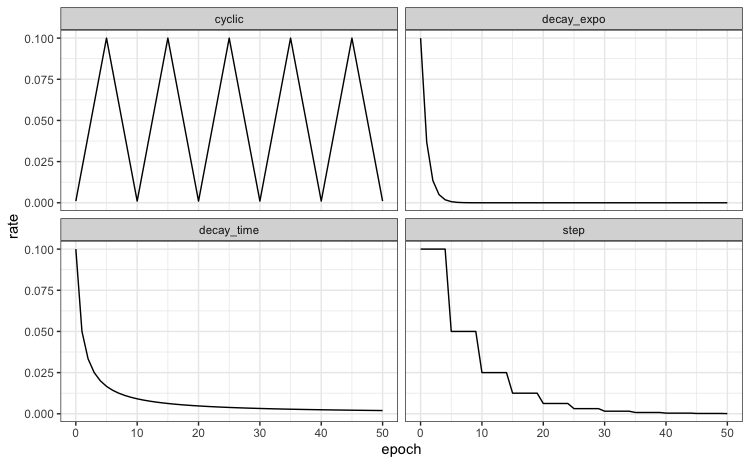

We're thrilled to announce the release of [brulee](https://tidymodels.github.io/brulee/) 0.2.0. brulee contains several basic modeling functions that use the torch package infrastructure, such as: neural networks, linear regression, logistic regression, and multinomial regression. 

You can install it from CRAN with:

```{r, eval = FALSE}
install.packages("brulee")
```

This blog post will describe the changes to the package. You can see a full list of changes in the [release notes](https://tidymodels.github.io/brulee/news/index.html)

There were two main additions to brulee. 

First, since brulee is focused on fitting models to _tabular data_, we've been be moving away from optimizing via stochastic gradient descent (SGD) as the default. For `brulee_mlp()`, we switched the default optimizer from SGD to more traditional quasi-newton methods, specifically to Broyden–Fletcher–Goldfarb–Shanno algorithm (BFGS) method. You can still use SGD via the `optimizer` option. 

Second, we've added [learning rate schedulers](https://www.google.com/search?rls=en&q=%22learning+rate+schedule%22) to `brulee_mlp()`. The learning rate is one of the most important parameters to tune and there is an existing option to have a constant learning rate (via the `learn_rate` argument). However, there is some intuition that the rate should probably decrease once the optimizer is closer to the best solution (to avoid overshooting the target). A scheduler is just a function that adjusts the rate over time. Apart from a constant learning rate (the default), the options are: cyclic, exponential decay, time-based decay, and step functions: 

```{r echo = FALSE, fig.align='center'}

```

The corresponding [set of functions](https://tidymodels.github.io/brulee/reference/schedule_decay_time.html) share the prefix `schedule_*()`. 

To use these with `brulee_mlp()`, there is a  `rate_schedule` argument with possible values: `"none"` (the default), `"decay_time"`, `"decay_expo"`, `"cyclic"` and `"step"`. Each function has arguments and these can be passed directly to `brulee_mlp()`. The `rate_schedule` argument can also be tuned as any other engine-specific parameter.

## An example

Let's look at an example using the Ames housing data. We'll use tidymodels to split the data and also preprocess the data a bit. 

```{r, results = 'hide', warning = FALSE, message=FALSE}
library(tidymodels)
library(brulee)

# ------------------------------------------------------------------------------

tidymodels_prefer()
theme_set(theme_bw())

# ------------------------------------------------------------------------------

data(ames, package = "modeldata")
ames$Sale_Price <- log10(ames$Sale_Price)

# ------------------------------------------------------------------------------

set.seed(5685)
split <- initial_split(ames)
ames_train <- training(split)
ames_test  <- testing(split)

# ------------------------------------------------------------------------------
# Let's make a recipe to preprocess the data

ames_rec <-
  recipe(Sale_Price ~ Bldg_Type + Neighborhood + Year_Built + Gr_Liv_Area +
           Full_Bath + Year_Sold + Lot_Area + Central_Air + Longitude + Latitude,
         data = ames_train) %>%
  # Transform some highly skewed predictors
  step_BoxCox(Lot_Area, Gr_Liv_Area) %>%
  # Lump some rarely occurring categories into "other"
  step_other(Neighborhood, threshold = 0.05)  %>%
  # Encode categorical predictors as binary.
  step_dummy(all_nominal_predictors(), one_hot = TRUE) %>%
  # Add an interaction effect:
  step_interact(~ starts_with("Central_Air"):Year_Built) %>%
  step_zv(all_predictors()) %>%
  step_normalize(all_numeric_predictors())
```

Now we can fit the model by passing the data, the recipe, and other options to `brulee_mlp()`. We'll use a cyclic scheduler with a half-cycle size of 5 epochs:

```{r val-loss, dev = "svg", out.width="90%", fig.height=4.25}
set.seed(827)
fit <- brulee_mlp(ames_rec, data = ames_train, hidden_units = 20, epochs = 151,
                  penalty = 0.05, rate_schedule = "cyclic", step_size = 5)

# Show the validation loss and alter the x-axis tick marks to correspond to cycles. 
cycles <- seq(1, 151, by = 10)
autoplot(fit) + scale_x_continuous(breaks = cycles, minor_breaks = NULL)
```


## Acknowledgements

We'd like to thank [&#x0040;EmilHvitfeldt](https://github.com/EmilHvitfeldt), [&#x0040;sametsoekel](https://github.com/sametsoekel), and  [&#x0040;dfalbel](https://github.com/dfalbel) for their help since the previous release. 
