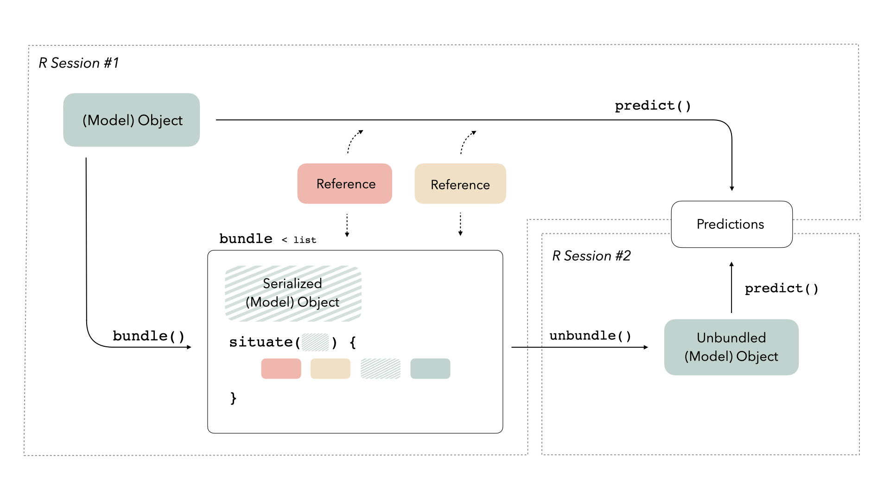

We're thrilled to announce the first release of [bundle](https://rstudio.github.io/bundle/) 0.1.0. The bundle package provides a consistent interface to capture all information needed to serialize a model, situate that information within a portable object, and restore it for use in new settings.

You can install it from CRAN with:


```r
install.packages("bundle")
```

Let's walk through what bundle does, and when you might need to use it.

## Saving things is hard

We often think of a trained model as a self-contained R object. The model exists in memory in R and if we have some new data, the model object can generate predictions on its own:


In reality, model objects sometimes also make use of *references* to generate predictions. A reference is a piece of information that a model object refers to that isn't part of the object itself; this could be something like a connection to a server, a file on disk, or an internal function in the package used to train the model. When we call `predict()`, model objects know where to look to retrieve that information:


Saving model objects can sometimes disrupt those references. Thus, if we want to train a model, save it, re-load it in a production setting, and generate predictions with it, we may run into issues:


We need some way to preserve access to those references. This new package provides a consistent interface for *bundling* model objects with their references so that they can be safely saved and re-loaded in production:



## When to bundle your model

Let's walk through building a couple of models using data on [cell body segmentation](https://modeldata.tidymodels.org/reference/cells.html).


```r
library(tidymodels)
data(cells, package = "modeldata")

set.seed(123)
cell_split <- cells %>% 
  select(-case) %>%
  initial_split(strata = class)

cell_train <- training(cell_split)
cell_test  <- testing(cell_split)
```

First, let's train a logistic regression model:


```r
glm_fit <- glm(class ~ ., family = "binomial", data = cell_train)
```

If we're satisfied with this model and think it is ready for production, we might want to deploy it somewhere, maybe as a REST API or as a Shiny app. A typical approach would be to:

-   save our model object
-   start up a new R session
-   load the model object into the new session
-   predict on new data with the loaded model object

The [callr](https://callr.r-lib.org/) package is helpful for demonstrating this kind of situation; it allows us to start up a fresh R session and pass a few objects in.

We'll just make use of two of the arguments to the function `r()`:

-   `func`: A function that, given a model object and some new data, will generate predictions, and
-   `args`: A named list, giving the arguments to the above function.

Let's save our model object to a temporary file and pass it to a fresh R session for prediction, like if we had deployed the model somewhere.


```r
library(callr)

temp_file <- tempfile()
saveRDS(glm_fit, file = temp_file)

r(
  function(temp_file, new_data) {
    model_object <- readRDS(file = temp_file)
    predict(model_object, new_data)
  },
  args = list(
    temp_file = temp_file,
    new_data = head(cell_test)
  )
)
```

```
##          1          2          3          4          5          6 
## -4.8706401 -1.8143956  2.3386470 -1.2735249 -0.3586448  2.7865270
```

Nice! 😀

What if instead we wanted to use a neural network, using tidymodels and keras as the modeling engine?


```r
cell_rec <- 
  recipe(class ~ ., data = cell_train) %>%
  step_YeoJohnson(all_numeric_predictors()) %>%
  step_normalize(all_numeric_predictors())

keras_spec <- 
  mlp(penalty = 0, epochs = 10) %>% 
  set_mode("classification") %>% 
  set_engine("keras", verbose = 0) 

keras_fit <- 
  workflow(cell_rec, keras_spec) %>%
  fit(data = cell_train)
```

Let's try to save this to disk and then reload it in a new session.


```r
temp_file <- tempfile()
saveRDS(keras_fit, file = temp_file)

r(
  function(temp_file, new_data) {
    model_object <- readRDS(file = temp_file)
    predict(model_object, new_data)
  },
  args = list(
    temp_file = temp_file,
    new_data = head(cell_test)
  )
)
```

```
## Error: ! error in callr subprocess
## Caused by error in `UseMethod("predict")`:
## ! no applicable method for 'predict' applied to an object of class "workflow"
```

Oh no! 😱

It turns out that keras models [need to be saved in a special way](https://tensorflow.rstudio.com/guides/keras/serialization_and_saving.html). This is true of a handful of models, like XGBoost, and even some preprocessing steps, like UMAP. These special ways to save objects, like the ones that keras provide, are often referred to as *native serialization*. Methods for native serialization know which references need to be brought along in order for an object to effectively do its thing in a new environment, but they are different for each model.

The bundle package provides a consistent way to deal with all these kinds of special serialization. The package provides two functions, `bundle()` and `unbundle()`, that take care of all of the minutae of preparing to save and load R objects effectively. You `bundle()` your model before you save it:


```r
library(bundle)
temp_file <- tempfile()
keras_bundle <- bundle(keras_fit)
saveRDS(keras_bundle, file = temp_file)
```

And then you `unbundle()` after you read the object in a new session:


```r
r(
  function(temp_file, new_data) {
    library(bundle)
    library(workflows)
    model_bundle <- readRDS(file = temp_file)
    model_object <- unbundle(model_bundle)
    predict(model_object, new_data)
  },
  args = list(
    temp_file = temp_file,
    new_data = head(cell_test)
  )
)
```

```
## # A tibble: 6 × 1
##   .pred_class
##   <fct>      
## 1 PS         
## 2 PS         
## 3 WS         
## 4 PS         
## 5 PS         
## 6 WS
```

Hooray! 🎉

We have support in bundle for a [wide variety](https://rstudio.github.io/bundle/reference/) of models that require (or *sometimes* require) special handling for serialization, from [H2O](https://h2o.ai/) to [torch luz models](https://mlverse.github.io/luz/). Soon bundle will be integrated into [vetiver](https://vetiver.rstudio.com/), for better and more robust deployment options. If you use a model that needs special serialization and is not yet supported, [let us know](https://github.com/rstudio/bundle/issues) in an issue.

## Acknowledgements

Thank you so much to everyone who contributed to this first release: [\@dfalbel](https://github.com/dfalbel), [\@juliasilge](https://github.com/juliasilge), [\@qiushiyan](https://github.com/qiushiyan), and [\@simonpcouch](https://github.com/simonpcouch). I would especially like to highlight Simon's contributions, which have been central to bundle getting off the ground!
