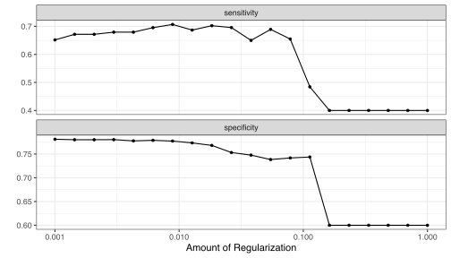
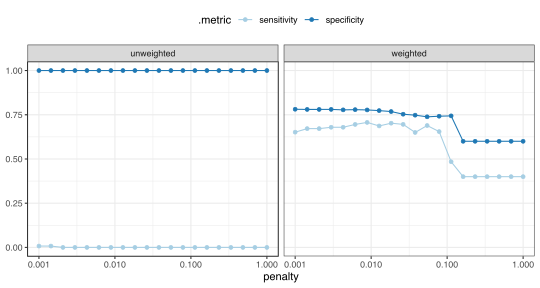

<!--
TODO:
* [ ] Look over / edit the post's title in the yaml
* [ ] Edit (or delete) the description; note this appears in the Twitter card
* [ ] Pick category and tags (see existing with `hugodown::tidy_show_meta()`)
* [ ] Find photo & update yaml metadata
* [ ] Create `thumbnail-sq.jpg`; height and width should be equal
* [ ] Create `thumbnail-wd.jpg`; width should be >5x height
* [ ] `hugodown::use_tidy_thumbnails()`
* [ ] Add intro sentence, e.g. the standard tagline for the package
* [ ] `usethis::use_tidy_thanks()`
-->


After quite a bit of time, the tidymodels packages have finally enabled the use of case weights. There has been a ton of work and multiple technical hurdles to overcome. The diversity of the types of weights, and how they should be used, is very complex, but I think that we've come up with a solution that is fairly straight-forward for users. 

## What are case weights?

Case weights are non-negative numbers that are used to impact how much each observation influences a model fit. 

If you are new to this term, it is worth reading Thomas Lumley’s excellent post [_Weights in statistics_](https://notstatschat.rbind.io/2020/08/04/weights-in-statistics/) as well as ["Struggles with Survey Weighting and Regression Modeling"](https://projecteuclid.org/journals/statistical-science/volume-22/issue-2/Struggles-with-Survey-Weighting-and-Regression-Modeling/10.1214/088342306000000691.full). Although "case weights" isn't a universally used term, we'll use it to distinguish it from other types of weights, such as class weights in cost-sensitive learning and others. 

There are different types of case weights whose terminology can be very different across problem domains. Here are some examples: 

* **Frequency weights** are integers that denote how many times a particular row of data has been observed. They help compress redundant rows into a smaller format. 
* **Importance weights** focus on how much each row of the data set should influence the model fit. These can be based on data or arbitrarily set to achieve some goal. 
* When survey respondents have different probabilities of selection, (inverse) **probability weights** can help remove bias from the results of a data analysis. 
* If a data point has an associated precision, **analytic weighting** helps a model focus on the data points with less uncertainty (such as in meta-analysis).

There are undoubtedly more types of weights in other domains. Quoting [Andrew Gelman](https://projecteuclid.org/journals/statistical-science/volume-22/issue-2/Struggles-with-Survey-Weighting-and-Regression-Modeling/10.1214/088342306000000691.full): 

> Weighting causes no end of confusion both in applied and theoretical statistics. People just assume because something has one name ("weights"), it is one thing. So then we get questions like, "How do you do weighted regression in Stan," and we have to reply, "What is it that you actually want to do?"

## How are they used in traditional modeling?

A traditional example is for categorical data where a small number of possible categories are observed many times. For example, the `UCBAdmissions` contains "Aggregate data on applicants to graduate school at Berkeley for the six largest departments in 1973 classified by admission and sex."


```r
data("UCBAdmissions")
UCBAdmissions
```

```
## , , Dept = A
## 
##           Gender
## Admit      Male Female
##   Admitted  512     89
##   Rejected  313     19
## 
## , , Dept = B
## 
##           Gender
## Admit      Male Female
##   Admitted  353     17
##   Rejected  207      8
## 
## , , Dept = C
## 
##           Gender
## Admit      Male Female
##   Admitted  120    202
##   Rejected  205    391
## 
## , , Dept = D
## 
##           Gender
## Admit      Male Female
##   Admitted  138    131
##   Rejected  279    244
## 
## , , Dept = E
## 
##           Gender
## Admit      Male Female
##   Admitted   53     94
##   Rejected  138    299
## 
## , , Dept = F
## 
##           Gender
## Admit      Male Female
##   Admitted   22     24
##   Rejected  351    317
```

This is a 3D array, so let's convert to a rectangular data format:


```r
library(tidymodels)

ucb <- 
  as_tibble(UCBAdmissions) %>% 
  mutate(across(where(is.character), ~ as.factor(.)))
ucb
```

```
## # A tibble: 24 × 4
##    Admit    Gender Dept      n
##    <fct>    <fct>  <fct> <dbl>
##  1 Admitted Male   A       512
##  2 Rejected Male   A       313
##  3 Admitted Female A        89
##  4 Rejected Female A        19
##  5 Admitted Male   B       353
##  6 Rejected Male   B       207
##  7 Admitted Female B        17
##  8 Rejected Female B         8
##  9 Admitted Male   C       120
## 10 Rejected Male   C       205
## # … with 14 more rows
```

There are 24 possible configurations of the variables but a total of 4526 observations. If we want to model the data in this format, using a logistic regression, we could  use


```r
glm_fit <-
  glm(
    Admit ~ Gender + Dept,
    data = ucb,
    weights = n,
    family = "binomial"
  )
glm_fit
```

```
## 
## Call:  glm(formula = Admit ~ Gender + Dept, family = "binomial", data = ucb, 
##     weights = n)
## 
## Coefficients:
## (Intercept)   GenderMale        DeptB        DeptC        DeptD        DeptE  
##    -0.68192      0.09987      0.04340      1.26260      1.29461      1.73931  
##       DeptF  
##     3.30648  
## 
## Degrees of Freedom: 23 Total (i.e. Null);  17 Residual
## Null Deviance:	    6044 
## Residual Deviance: 5187 	AIC: 5201
```


_This is not quite right though_. There are 12 combinations of `Gender` and `Dept`. How can the model have 23 total degrees of freedom?

If we are treating our data as binomial, the traditional method for fitting this model is to convert the data to a format with columns for the number of events and non-events (per covariate pattern). Let's convert our data into that format:


```r
ucb_grouped_data <- 
  ucb %>% 
  pivot_wider(
    id_cols = c(Gender, Dept),
    names_from = Admit,
    values_from = n,
    values_fill = 0L
  )
ucb_grouped_data
```

```
## # A tibble: 12 × 4
##    Gender Dept  Admitted Rejected
##    <fct>  <fct>    <dbl>    <dbl>
##  1 Male   A          512      313
##  2 Female A           89       19
##  3 Male   B          353      207
##  4 Female B           17        8
##  5 Male   C          120      205
##  6 Female C          202      391
##  7 Male   D          138      279
##  8 Female D          131      244
##  9 Male   E           53      138
## 10 Female E           94      299
## 11 Male   F           22      351
## 12 Female F           24      317
```

Now, since there are really only 12 covariate combinations, the appropriate model can be created. 


```r
glm(
  cbind(Rejected, Admitted) ~ Gender + Dept,
  data = ucb_grouped_data,
  family = binomial
)
```

```
## 
## Call:  glm(formula = cbind(Rejected, Admitted) ~ Gender + Dept, family = binomial, 
##     data = ucb_grouped_data)
## 
## Coefficients:
## (Intercept)   GenderMale        DeptB        DeptC        DeptD        DeptE  
##    -0.68192      0.09987      0.04340      1.26260      1.29461      1.73931  
##       DeptF  
##     3.30648  
## 
## Degrees of Freedom: 11 Total (i.e. Null);  5 Residual
## Null Deviance:	    877.1 
## Residual Deviance: 20.2 	AIC: 103.1
```

In both cases the model coefficients are the same; the standard errors and degrees of freedom are correct for the model with grouped data though. 


## Why is this so complicated? 

Traditionally, the use of weights in base R functions are to fit the model and to report limited measures of model fit. Here, `glm()` reports the deviance while `lm()` shows estimates of the RMSE and adjusted-R<sup>2</sup>.

Believe it or not, the logistic regression code shown above, which is a typical example of using weights in a classical statistical setting, is much simpler that we what we have to contend with in modern data analysis. There are a few things that we do in modern data analysis where correctly using weights is not so straightforward. These include:

* Resampling (e.g. the bootstrap or cross-validation).
* Preprocessing methods such as centering and scaling. 
* Expanded measures of performance (e.g. area under the ROC curve, mean absolute deviations, Kohen's Kappa, and so on)

A framework like tidymodels enables all of these tools and the impact of case weights is more comprehensive. 

Additionally, the type of case weights **and their intent** affect which of these operations should be affected. 

For example, frequency weights should affect the model fit, the preprocessing steps, and performance estimation. If the predictors require centering, a weighted mean should be used to appropriately ensure that the mean of that column is truly zero. Let's say that sensitivity and specificity estimates are required. The 2x2 table of observed and predicted results should have cell counts that reflect the case weights. If they did not, infrequently occurring data points have as much weight as the rows that have a high prevalence. 

As a counter example, importance weights reflect the idea that they should only influence _the model fitting procedure_. It wouldn't make sense to use a weighted mean to center a predictor; the weight shouldn't influence an unsupervised operation in the same way as the model fit. More critically, any holdout data set used to quantify model efficacy should reflect the data as seen in the wild (without the impact of the weights). 

## How does tidymodels handle this? 

We've decided to add some additional vector data types that allow users to describe the type of weights. These data types also help tidymodels functions know what the intent of the analysis should be. 

In parsnip, the functions `frequency_weights()` and `importance_weights()` can be used to set the weights: 


```r
# For the UC admissions data
ucb$n <- frequency_weights(ucb$n)
ucb
```

```
## # A tibble: 24 × 4
##    Admit    Gender Dept           n
##    <fct>    <fct>  <fct> <freq_wts>
##  1 Admitted Male   A            512
##  2 Rejected Male   A            313
##  3 Admitted Female A             89
##  4 Rejected Female A             19
##  5 Admitted Male   B            353
##  6 Rejected Male   B            207
##  7 Admitted Female B             17
##  8 Rejected Female B              8
##  9 Admitted Male   C            120
## 10 Rejected Male   C            205
## # … with 14 more rows
```

```r
# For a general vector of importance weights: 
importance_weights(round(runif(10), 2))
```

```
## <importance_weights[10]>
##  [1] 0.91 0.53 0.72 0.81 0.33 0.11 0.61 0.61 0.20 0.49
```

The class of these objects tell packages like recipes and yardstick if their values should be used for preprocessing and performance metrics, respectively: 

* Importance weights only affect the model fit and _supervised_ recipes steps. They are not used with yardstick functions.

* Frequency weights are used for all parts of the preprocessing, model fitting, and performance estimation operations. 

Currently, these are the only classes implemented. We are doing a lot of reading on how the analysis of survey data should use case weights and how we can enable this and other data analysis use cases. [We'd love to hear from you](https://community.rstudio.com/) if you have expertise in this area. 

## About resampling

This is a topic that we are still unsure about. We definitively think that importance weights should not affect how the data are split or resampled. 

Frequency weights are more complex. Suppose we are using 10-fold cross-validation with the logistic regression on the UCB admission data, should we:

* Have all the case weights be placed into either the modeling or holdout set? 
* Fractionally, split the case weights into both the modeling and holdout data? 

For the latter case, suppose a row of data has a case weight of 100 and we use 10-fold cross-validation. We would always put 90 of those 100 into the modeling data set and the other 10 into the holdout. This seems to be consistent with the sampling of the data and is what would happen if there were actually 100 rows in the data (instead of one row with a case weight of 100). However, it does raise questions regarding data leakage by just re-predicting the same data that went into the model. 

This is also an area where we'd like [community feedback](https://community.rstudio.com/). 

## Tidymodels syntax

Let's work through an example. We'll use some data simulated with a severe class imbalance. These functions are in the [development version of the modeldata package](https://modeldata.tidymodels.org/dev/reference/sim_classification.html).


```r
set.seed(1)
training_sim <- sim_classification(5000, intercept = -25) 
training_sim %>% count(class)
```

```
## # A tibble: 2 × 2
##   class       n
##   <fct>   <int>
## 1 class_1    80
## 2 class_2  4920
```

If we would like to encourage models to more accurately predict the minority class, we can give these samples a much larger weight in the analysis


```r
training_sim <-
  training_sim %>% 
  mutate(
    case_wts = ifelse(class == "class_1", 60, 1),
    case_wts = importance_weights(case_wts)
  )
```

We strongly advise that users set the case weight column before any other tidymodels functions are used. This ensures that they are handled correctly in the analyses that follow. 

Let's use 10-fold cross-validation to resample the data. This case is unaffected by the presence of weights: 


```r
set.seed(2)
sim_folds <- vfold_cv(training_sim, strata = class)
```

We'll fit a regularized logistic regression model to the data using glmnet: 


```r
lr_spec <- 
  logistic_reg(penalty = tune(), mixture = 1) %>% 
  set_engine("glmnet")
```

For this model, we need to ensure that the predictors are in the same units. We'll use a recipe to center and scale the data and also add some spline terms for predictors that appear to have a nonlinear relationship with the outcome: 


```r
sim_rec <- 
  recipe(class ~ ., data = training_sim) %>% 
  step_ns(starts_with("non_linear"), deg_free = 10) %>% 
  step_normalize(all_numeric_predictors())
sim_rec
```

```
## Recipe
## 
## Inputs:
## 
##          role #variables
##  case_weights          1
##       outcome          1
##     predictor         15
## 
## Operations:
## 
## Natural splines on starts_with("non_linear")
## Centering and scaling for all_numeric_predictors()
```

There are a few things to point out here. The recipe automatically detects the case weights even though they are captured by the dot in the right-hand side of the formula. The recipe automatically sets their role and will error if that column is changed in any way. 

As mentioned above, any unsupervised steps are unaffected by importance weights so neither `step_ns()` or `step_normalize()` use the weights in their calculations. 

When using case weights, we would like to encourage users to keep their model and preprocessing tool within a workflow. The workflows package now has a `add_case_weights()` function to help here: 


```r
lr_wflow <- 
  workflow() %>% 
  add_model(lr_spec) %>% 
  add_recipe(sim_rec) %>% 
  add_case_weights(case_wts)
lr_wflow
```

```
## ══ Workflow ═══════════════════════════════════════════════════════════════════════
## Preprocessor: Recipe
## Model: logistic_reg()
## 
## ── Preprocessor ───────────────────────────────────────────────────────────────────
## 2 Recipe Steps
## 
## • step_ns()
## • step_normalize()
## 
## ── Case Weights ───────────────────────────────────────────────────────────────────
## case_wts
## 
## ── Model ──────────────────────────────────────────────────────────────────────────
## Logistic Regression Model Specification (classification)
## 
## Main Arguments:
##   penalty = tune()
##   mixture = 1
## 
## Computational engine: glmnet
```

From here, let's tune the model. This code doesn't have to change at all. Because we set the case weights column with `add_case_weights()`, tune and workflows automatically know how to pass the case weights on to the underlying parsnip model. We will add some additional metrics to show the affect of the weights though: 


```r
cls_metrics <- metric_set(sensitivity, specificity)

grid <- tibble(penalty = 10^seq(-3, 0, length.out = 20))

set.seed(3)
lr_res <- 
  lr_wflow %>% 
  tune_grid(resamples = sim_folds, grid = grid, metrics = cls_metrics)

autoplot(lr_res)
```



Recall that tidymodels assumes that the first level of the outcome factor is the event of interest. Since the first level of the outcome has the fewest values, we would expect that the sensitivity of the model to suffer. These results suggest that the weights are making the model focus on the majority class. 

For comparison, let's remove the weights then tune the same parameter values. 


```r
lr_unwt_wflow <- 
  lr_wflow %>% 
  remove_case_weights()

set.seed(3)
lr_unwt_res <- 
  lr_unwt_wflow %>% 
  tune_grid(resamples = sim_folds, grid = grid, metrics = cls_metrics)
```

How do the results compare? 



The importance weights certainly did their job since the weighted analysis has a better balance of sensitivity and specificity. 

## Getting feedback

We've laid the groundwork for using case weights holistically in tidymodels. For those of you who use case weights, we'd like to know what you think of our approach and answer any questions that you have. We have an [RStudio Community post](https://community.rstudio.com/) queued up to discuss this topic. 

We've waited to release packages with case weight support until the main pieces were in place. If you would like to play around with what we've done, you can load the development versions of the packages using:


```r
if (!rlang::is_installed("pak")) {
  install.packages("pak")
}

pkgs <- c("hardhat", "parsnip@feature/case-weights", "recipes@case-weights",
          "tune", "workflows", "yardstick")
pkgs <- paste0("tidymodels/", pkgs)

pak::pak(pkgs)
```

If you use any of the parsnip extension packages (e.g. discrim, rules, etc), make sure to install the development versions of these too. 

