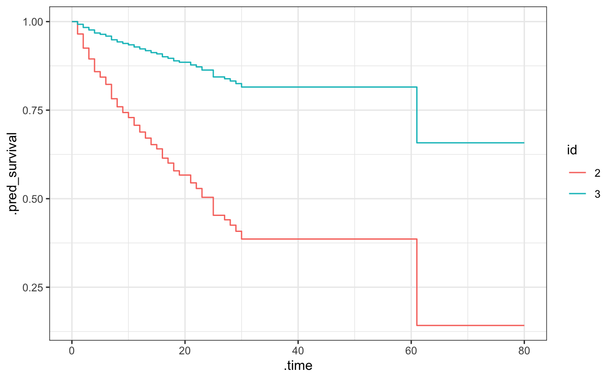

<!--
TODO:
* [x] Look over / edit the post's title in the yaml
* [x] Edit (or delete) the description; note this appears in the Twitter card
* [x] Pick category and tags (see existing with [`hugodown::tidy_show_meta()`](https://rdrr.io/pkg/hugodown/man/use_tidy_post.html))
* [x] Find photo & update yaml metadata
* [x] Create `thumbnail-sq.jpg`; height and width should be equal
* [x] Create `thumbnail-wd.jpg`; width should be >5x height
* [x] [`hugodown::use_tidy_thumbnails()`](https://rdrr.io/pkg/hugodown/man/use_tidy_post.html)
* [x] Add intro sentence, e.g. the standard tagline for the package
* [x] [`usethis::use_tidy_thanks()`](https://usethis.r-lib.org/reference/use_tidy_thanks.html)
-->

We're extremely pleased to announce the first release of [censored](https://censored.tidymodels.org) on CRAN. The censored package is a parsnip extension package for survival models.

You can install it from CRAN with:

<pre class='chroma'><code class='language-r' data-lang='r'><a href='https://rdrr.io/r/utils/install.packages.html'>install.packages</a>("censored")</code></pre>

This blog post will introduce a new model type, a new mode, and new prediction types for survival analysis in the tidymodels framework. We have [previously](https://www.tidyverse.org/blog/2021/11/survival-analysis-parsnip-adjacent/) blogged about these changes while they were in development, now they have been released!

<pre class='chroma'><code class='language-r' data-lang='r'><a href='https://rdrr.io/r/base/library.html'>library</a>(<a href='https://github.com/tidymodels/censored'>censored</a>)
#&gt; Loading required package: parsnip
#&gt; Loading required package: survival</code></pre>

## Model types, modes, and engines

A parsnip model specification consists of three elements:

-   a **model type** such as linear model, random forest, support vector machine, etc
-   a computational **engine** such as a specific R package or tools outside of R like Keras or Stan
-   a **mode** such as regression or classification

parsnip 1.0.0 introduces a new mode `"censored regression"` and the censored package provides engines to fit various models in this new mode. With the addition of the new [`proportional_hazards()`](https://parsnip.tidymodels.org/reference/proportional_hazards.html) model type, the available models cover parametric, semi-parametric, and tree-based models:

| model                    | engine   |
|:-------------------------|:---------|
| [`bag_tree()`](https://parsnip.tidymodels.org/reference/bag_tree.html)             | rpart    |
| [`boost_tree()`](https://parsnip.tidymodels.org/reference/boost_tree.html)           | mboost   |
| [`decision_tree()`](https://parsnip.tidymodels.org/reference/decision_tree.html)        | rpart    |
| [`decision_tree()`](https://parsnip.tidymodels.org/reference/decision_tree.html)        | partykit |
| [`proportional_hazards()`](https://parsnip.tidymodels.org/reference/proportional_hazards.html) | survival |
| [`proportional_hazards()`](https://parsnip.tidymodels.org/reference/proportional_hazards.html) | glmnet   |
| [`rand_forest()`](https://parsnip.tidymodels.org/reference/rand_forest.html)          | partykit |
| [`survival_reg()`](https://parsnip.tidymodels.org/reference/survival_reg.html)         | survival |
| [`survival_reg()`](https://parsnip.tidymodels.org/reference/survival_reg.html)         | flexsurv |

All models can be fitted through a formula interface. For example, when the engine allows for stratification variables, these can be specified by using a [`strata()`](https://rdrr.io/pkg/survival/man/strata.html) term in the formula, as in the survival package.

The `cetaceans` data set contains information about dolphins and whales living in captivity in the USA. It is derived from a [Tidy Tuesday data set](https://github.com/rfordatascience/tidytuesday/tree/master/data/2018/2018-12-18) and you can install the corresponding data package with `pak::pak("hfrick/cetaceans")`.

<pre class='chroma'><code class='language-r' data-lang='r'><a href='https://rdrr.io/r/base/library.html'>library</a>(cetaceans)
<a href='https://rdrr.io/r/utils/str.html'>str</a>(cetaceans)
#&gt; tibble [1,358 × 10] (S3: tbl_df/tbl/data.frame)
#&gt;  $ age              : num [1:1358] 28 44 39 38 38 37 36 36 35 34 ...
#&gt;  $ event            : num [1:1358] 0 0 0 0 0 0 0 0 0 0 ...
#&gt;  $ species          : chr [1:1358] "Bottlenose" "Bottlenose" "Bottlenose" "Bottlenose" ...
#&gt;  $ sex              : chr [1:1358] "F" "F" "M" "F" ...
#&gt;  $ birth_decade     : num [1:1358] 1980 1970 1970 1970 1970 1980 1980 1980 1980 1980 ...
#&gt;  $ born_in_captivity: logi [1:1358] TRUE TRUE TRUE TRUE TRUE TRUE ...
#&gt;  $ time_in_captivity: num [1:1358] 1 1 1 1 1 1 1 1 1 1 ...
#&gt;  $ origin_location  : chr [1:1358] "Marineland Florida" "Dolphin Research Center" "SeaWorld" "SeaWorld" ...
#&gt;  $ transfers        : int [1:1358] 0 0 13 1 2 2 2 2 3 4 ...
#&gt;  $ current_location : chr [1:1358] "Marineland Florida" "Dolphin Research Center" "SeaWorld" "SeaWorld" ...</code></pre>

To illustrate the new modelling function [`proportional_hazards()`](https://parsnip.tidymodels.org/reference/proportional_hazards.html) and the formula interface for glmnet, let's fit a penalized Cox model.

<pre class='chroma'><code class='language-r' data-lang='r'>cox_penalized &lt;- <a href='https://parsnip.tidymodels.org/reference/proportional_hazards.html'>proportional_hazards</a>(penalty = 0.1) <a href='https://magrittr.tidyverse.org/reference/pipe.html'>%&gt;%</a>
  <a href='https://parsnip.tidymodels.org/reference/set_engine.html'>set_engine</a>("glmnet") <a href='https://magrittr.tidyverse.org/reference/pipe.html'>%&gt;%</a>
  <a href='https://parsnip.tidymodels.org/reference/set_args.html'>set_mode</a>("censored regression") <a href='https://magrittr.tidyverse.org/reference/pipe.html'>%&gt;%</a>
  <a href='https://generics.r-lib.org/reference/fit.html'>fit</a>(
    <a href='https://rdrr.io/pkg/survival/man/Surv.html'>Surv</a>(age, event) ~ sex + transfers + <a href='https://rdrr.io/pkg/survival/man/strata.html'>strata</a>(born_in_captivity),
    data = cetaceans
  )</code></pre>

## Prediction types

For censored regression, parsnip now also includes new prediction types:

-   `"time"` for the survival time
-   `"survival"` for the survival probability
-   `"hazard"` for the hazard
-   `"quantile"` for quantiles of the event time distribution
-   `"linear_pred"` for the linear predictor

Predictions made with censored respect the tidymodels principles of:

-   The predictions are always inside a tibble.
-   The column names and types are unsurprising and predictable.
-   The number of rows in `new_data` and the output are the same.

Let's demonstrate that with a small data set to predict on: just three observations, and the first one includes a missing value for one of the predictors.

<pre class='chroma'><code class='language-r' data-lang='r'>cetaceans_3 &lt;- cetaceans[1:3,]
cetaceans_3$sex[1] &lt;- NA</code></pre>

Predictions of types `"time"` and `"survival"` are available for all model/engine combinations in censored.

<pre class='chroma'><code class='language-r' data-lang='r'><a href='https://rdrr.io/r/stats/predict.html'>predict</a>(cox_penalized, new_data = cetaceans_3, type = "time")
#&gt; # A tibble: 3 × 1
#&gt;   .pred_time
#&gt;        &lt;dbl&gt;
#&gt; 1       NA  
#&gt; 2       31.8
#&gt; 3       52.6</code></pre>

Survival probability can be predicted at multiple time points, specified through the `time` argument to [`predict()`](https://rdrr.io/r/stats/predict.html). Here we are predicting survival probability at age 10, 20, 30, and 40 years.

<pre class='chroma'><code class='language-r' data-lang='r'>pred &lt;- <a href='https://rdrr.io/r/stats/predict.html'>predict</a>(cox_penalized, new_data = cetaceans_3, type = "survival", time = <a href='https://rdrr.io/r/base/c.html'>c</a>(10, 20, 30, 40))
pred
#&gt; # A tibble: 3 × 1
#&gt;   .pred           
#&gt;   &lt;list&gt;          
#&gt; 1 &lt;tibble [4 × 2]&gt;
#&gt; 2 &lt;tibble [4 × 2]&gt;
#&gt; 3 &lt;tibble [4 × 2]&gt;</code></pre>

The `.pred` column is a list-column, containing nested tibbles:

<pre class='chroma'><code class='language-r' data-lang='r'># for the observation with NA
pred$.pred[[1]]
#&gt; # A tibble: 4 × 2
#&gt;   .time .pred_survival
#&gt;   &lt;dbl&gt;          &lt;dbl&gt;
#&gt; 1    10             NA
#&gt; 2    20             NA
#&gt; 3    30             NA
#&gt; 4    40             NA

# without NA
pred$.pred[[2]]
#&gt; # A tibble: 4 × 2
#&gt;   .time .pred_survival
#&gt;   &lt;dbl&gt;          &lt;dbl&gt;
#&gt; 1    10          0.729
#&gt; 2    20          0.567
#&gt; 3    30          0.386
#&gt; 4    40          0.386</code></pre>

This can be used to visualize an approximation of the underlying survival curve.

<pre class='chroma'><code class='language-r' data-lang='r'><a href='https://rdrr.io/r/base/library.html'>library</a>(<a href='https://ggplot2.tidyverse.org'>ggplot2</a>)

<a href='https://rdrr.io/r/stats/predict.html'>predict</a>(cox_penalized, new_data = cetaceans[2:3,], 
        type = "survival", time = <a href='https://rdrr.io/r/base/seq.html'>seq</a>(0, 80, 1)) <a href='https://magrittr.tidyverse.org/reference/pipe.html'>%&gt;%</a> 
  dplyr::<a href='https://dplyr.tidyverse.org/reference/mutate.html'>mutate</a>(id = <a href='https://rdrr.io/r/base/factor.html'>factor</a>(2:3)) <a href='https://magrittr.tidyverse.org/reference/pipe.html'>%&gt;%</a> 
  tidyr::<a href='https://tidyr.tidyverse.org/reference/nest.html'>unnest</a>(cols = .pred) <a href='https://magrittr.tidyverse.org/reference/pipe.html'>%&gt;%</a> 
  <a href='https://ggplot2.tidyverse.org/reference/ggplot.html'>ggplot</a>(<a href='https://ggplot2.tidyverse.org/reference/aes.html'>aes</a>(x = .time, y = .pred_survival, col = id)) +
  <a href='https://ggplot2.tidyverse.org/reference/geom_path.html'>geom_step</a>() +
  <a href='https://ggplot2.tidyverse.org/reference/ggtheme.html'>theme_bw</a>()
</code></pre>

More examples of available models, engines, and prediction types can be found in the article [Fitting and Predicting with censored](https://censored.tidymodels.org/articles/examples.html).

## What's next?

Our aim is to broadly integrate survival analysis in the tidymodels framework. Next, we'll be working on adding appropriate metrics to the yardstick package and enabling model tuning via the tune package.

## Acknowledgements

A big thanks to all the contributors: [@bcjaeger](https://github.com/bcjaeger), [@brunocarlin](https://github.com/brunocarlin), [@caimiao0714](https://github.com/caimiao0714), [@DavisVaughan](https://github.com/DavisVaughan), [@dvdsb](https://github.com/dvdsb), [@EmilHvitfeldt](https://github.com/EmilHvitfeldt), [@erikvona](https://github.com/erikvona), [@gvelasq](https://github.com/gvelasq), [@hfrick](https://github.com/hfrick), [@jennybc](https://github.com/jennybc), [@mattwarkentin](https://github.com/mattwarkentin), [@mikemahoney218](https://github.com/mikemahoney218), [@schelhorn](https://github.com/schelhorn), and [@topepo](https://github.com/topepo).

