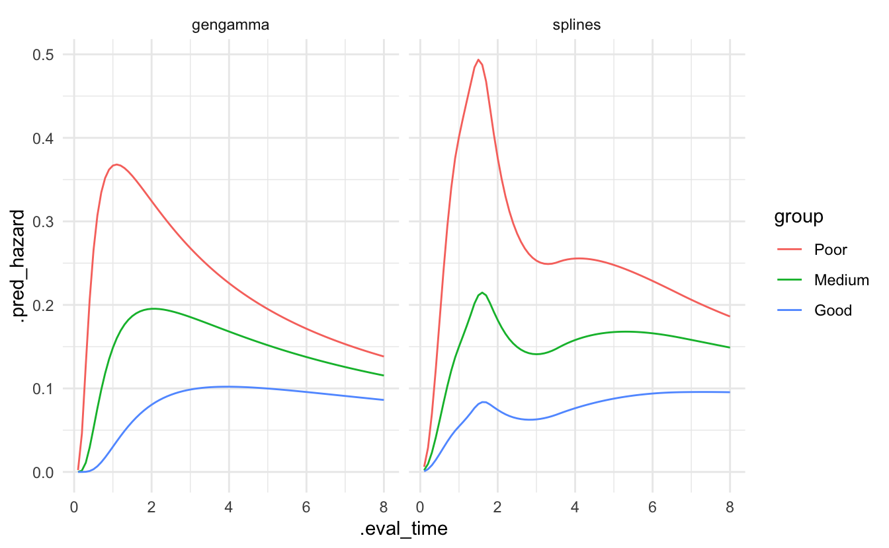

<!--
TODO:
* [x] Look over / edit the post's title in the yaml
* [x] Edit (or delete) the description; note this appears in the Twitter card
* [x] Pick category and tags (see existing with [`hugodown::tidy_show_meta()`](https://rdrr.io/pkg/hugodown/man/use_tidy_post.html))
* [x] Find photo & update yaml metadata
* [x] Create `thumbnail-sq.jpg`; height and width should be equal
* [x] Create `thumbnail-wd.jpg`; width should be >5x height
* [x] [`hugodown::use_tidy_thumbnails()`](https://rdrr.io/pkg/hugodown/man/use_tidy_post.html)
* [x] Add intro sentence, e.g. the standard tagline for the package
* [x] [`usethis::use_tidy_thanks()`](https://usethis.r-lib.org/reference/use_tidy_thanks.html)
-->

We're thrilled to announce the release of [censored](https://censored.tidymodels.org/) 0.2.0. censored is a parsnip extension package for survival models.

You can install it from CRAN with:

<pre class='chroma'><code class='language-r' data-lang='r'><a href='https://rdrr.io/r/utils/install.packages.html'>install.packages</a>("censored")</code></pre>

This blog post will introduce you to a new argument name, `eval_time`, and two new engines for fitting random forests and parametric survival models.

You can see a full list of changes in the [release notes](https://github.com/tidymodels/censored/releases/tag/v0.2.0).

## Introducing `eval_time`

As we continue to add support for survival analysis across tidymodels, we have seen a need to be more explicit about which time we mean when we say "time": event time, observed time, censoring time, time at which to predict survival probability at? The last one is a particular mouthful. We now refer to this time as "evaluation time." In preparation for dynamic survival performance metrics which can be calculated at different evaluation time points, the argument to set these evaluation time points for [`predict()`](https://rdrr.io/r/stats/predict.html) is now called `eval_time` instead of just `time`.

<pre class='chroma'><code class='language-r' data-lang='r'>cox &lt;- <a href='https://parsnip.tidymodels.org/reference/proportional_hazards.html'>proportional_hazards</a>() |&gt; 
  <a href='https://parsnip.tidymodels.org/reference/set_engine.html'>set_engine</a>("survival") |&gt; 
  <a href='https://parsnip.tidymodels.org/reference/set_args.html'>set_mode</a>("censored regression") |&gt; 
  <a href='https://generics.r-lib.org/reference/fit.html'>fit</a>(<a href='https://rdrr.io/pkg/survival/man/Surv.html'>Surv</a>(time, status) ~ ., data = lung)
pred &lt;- <a href='https://rdrr.io/r/stats/predict.html'>predict</a>(cox, lung[1:3, ], type = "survival", eval_time = <a href='https://rdrr.io/r/base/c.html'>c</a>(100, 500))
pred
#&gt; # A tibble: 3 × 1
#&gt;   .pred           
#&gt;   &lt;list&gt;          
#&gt; 1 &lt;tibble [2 × 2]&gt;
#&gt; 2 &lt;tibble [2 × 2]&gt;
#&gt; 3 &lt;tibble [2 × 2]&gt;
</code></pre>

The predictions follow the tidymodels principle of one row per observation, and the nested tibble contains the predicted survival probability, `.pred_survival`, as well as the corresponding evaluation time. The column for the evaluation time is now called `.eval_time` instead of `.time`.

<pre class='chroma'><code class='language-r' data-lang='r'>pred$.pred[[2]]
#&gt; # A tibble: 2 × 2
#&gt;   .eval_time .pred_survival
#&gt;        &lt;dbl&gt;          &lt;dbl&gt;
#&gt; 1        100          0.910
#&gt; 2        500          0.422
</code></pre>

## New engines

censored contains engines for parametric, semi-parametric, and tree-based models. This release adds two new engines:

-   the `"aorsf"` engine for random forests via [`rand_forest()`](https://parsnip.tidymodels.org/reference/rand_forest.html)
-   the `"flexsurvspline"` engine for parametric models via [`survival_reg()`](https://parsnip.tidymodels.org/reference/survival_reg.html)

### New `"aorsf"` engine for `rand_forest()`

This engine has been contributed by [Byron Jaeger](https://github.com/bcjaeger) and enables users to fit oblique random survival forests with the aorsf package. What's with the *oblique* you ask?

Oblique describes how the decision trees that form the random forest make their splits at each node. If the split is based on a single predictor, the resulting tree is called *axis-based* because the split is perpendicular to the axis of the predictor. If the split is based on a linear combination of predictors, there is a lot more flexibility in how the data is split: the split does not need to be perpendicular to any of the predictor axes. Such trees are called *oblique*.

The documentation for the [aorsf](https://docs.ropensci.org/aorsf) package includes a nice illustration of this with the splits for an axis-based tree on the left and an oblique tree on the right:

To fit such a model, set the engine for a random forest to `"aorsf"`:

<pre class='chroma'><code class='language-r' data-lang='r'>lung &lt;- <a href='https://rdrr.io/r/stats/na.fail.html'>na.omit</a>(lung)

forest &lt;- <a href='https://parsnip.tidymodels.org/reference/rand_forest.html'>rand_forest</a>() |&gt; 
  <a href='https://parsnip.tidymodels.org/reference/set_engine.html'>set_engine</a>("aorsf") |&gt; 
  <a href='https://parsnip.tidymodels.org/reference/set_args.html'>set_mode</a>("censored regression") |&gt; 
  <a href='https://generics.r-lib.org/reference/fit.html'>fit</a>(<a href='https://rdrr.io/pkg/survival/man/Surv.html'>Surv</a>(time, status) ~ ., data = lung)

pred &lt;- <a href='https://rdrr.io/r/stats/predict.html'>predict</a>(forest, lung[1:3, ], type = "survival", eval_time = <a href='https://rdrr.io/r/base/c.html'>c</a>(100, 500))
pred$.pred[[1]]
#&gt; # A tibble: 2 × 2
#&gt;   .eval_time .pred_survival
#&gt;        &lt;dbl&gt;          &lt;dbl&gt;
#&gt; 1        100          0.928
#&gt; 2        500          0.368
</code></pre>

### New `"flexsurvspline"` engine for `survival_reg()`

This engine has been contributed by [Matt Warkentin](https://github.com/mattwarkentin) and enables users to fit a parametric survival model with splines via [`flexsurv::flexsurvspline()`](https://rdrr.io/pkg/flexsurv/man/flexsurvspline.html).

This model uses natural cubic splines to model a transformation of the survival function, e.g., the log cumulative hazard. This gives a lot more flexibility to a parametric model allowing us, for example, to represent more irregular hazard curves. Let's illustrate that with a data set of survival times of breast cancer patients, based on the example from [Jackson (2016)](https://www.jstatsoft.org/article/view/v070i08).

The flexibility of the model is governed by `k`, the number of knots in the spline. We set `scale = "odds"` for a proportional hazards model.

<pre class='chroma'><code class='language-r' data-lang='r'><a href='https://rdrr.io/r/utils/data.html'>data</a>(bc, package = "flexsurv")

fit_splines &lt;- <a href='https://parsnip.tidymodels.org/reference/survival_reg.html'>survival_reg</a>() |&gt; 
  <a href='https://parsnip.tidymodels.org/reference/set_engine.html'>set_engine</a>("flexsurvspline", k = 5, scale = "odds") |&gt; 
  <a href='https://generics.r-lib.org/reference/fit.html'>fit</a>(<a href='https://rdrr.io/pkg/survival/man/Surv.html'>Surv</a>(recyrs, censrec) ~ group, data = bc)</code></pre>

For comparison, we also fit a parametric model without splines.

<pre class='chroma'><code class='language-r' data-lang='r'>fit_gengamma &lt;- <a href='https://parsnip.tidymodels.org/reference/survival_reg.html'>survival_reg</a>(dist = "gengamma") |&gt; 
  <a href='https://parsnip.tidymodels.org/reference/set_engine.html'>set_engine</a>("flexsurv") |&gt; 
  <a href='https://generics.r-lib.org/reference/fit.html'>fit</a>(<a href='https://rdrr.io/pkg/survival/man/Surv.html'>Surv</a>(recyrs, censrec) ~ group, data = bc)</code></pre>

We can predict the hazard for the three levels of the prognostic `group`.

<pre class='chroma'><code class='language-r' data-lang='r'>bc_groups &lt;- tibble(group = <a href='https://rdrr.io/r/base/c.html'>c</a>("Poor","Medium","Good"))

pred_splines &lt;- <a href='https://rdrr.io/r/stats/predict.html'>predict</a>(fit_splines, new_data = bc_groups, type = "hazard", 
                        eval_time = <a href='https://rdrr.io/r/base/seq.html'>seq</a>(0.1, 8, by = 0.1)) |&gt; 
  mutate(model = "splines") |&gt; 
  bind_cols(bc_groups)

pred_gengamma &lt;- <a href='https://rdrr.io/r/stats/predict.html'>predict</a>(fit_gengamma, new_data = bc_groups, type = "hazard", 
                         eval_time = <a href='https://rdrr.io/r/base/seq.html'>seq</a>(0.1, 8, by = 0.1)) |&gt; 
  mutate(model = "gengamma") |&gt; 
  bind_cols(bc_groups)</code></pre>

Plotting the predictions of both models shows a lot more flexibility in the splines model.

<pre class='chroma'><code class='language-r' data-lang='r'>bind_rows(pred_splines, pred_gengamma) <a href='https://magrittr.tidyverse.org/reference/pipe.html'>%&gt;%</a> 
  mutate(group = <a href='https://rdrr.io/r/base/factor.html'>factor</a>(group, levels = <a href='https://rdrr.io/r/base/c.html'>c</a>("Poor","Medium","Good"))) |&gt; 
  tidyr::<a href='https://tidyr.tidyverse.org/reference/unnest.html'>unnest</a>(cols = .pred) |&gt; 
  ggplot() +
  geom_line(aes(x = .eval_time, y = .pred_hazard, group = group, col = group)) +
  facet_wrap(~ model)
</code></pre>

## Acknowledgements

Special thanks to Matt Warkentin and Byron Jaeger for the new engines! A big thank you to all the people who have contributed to censored since the release of v0.1.0:

[@bcjaeger](https://github.com/bcjaeger), [@hfrick](https://github.com/hfrick), [@mattwarkentin](https://github.com/mattwarkentin), [@simonpcouch](https://github.com/simonpcouch), [@therneau](https://github.com/therneau), and [@topepo](https://github.com/topepo).

