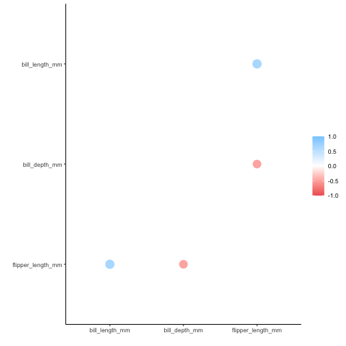

<!--
TODO:
* [ ] Pick category and tags (see existing with `post_tags()`)
* [ ] Find photo & update yaml metadata
* [ ] Create `thumbnail-sq.jpg`; height and width should be equal
* [ ] Create `thumbnail-wd.jpg`; width should be >5x height
* [ ] `hugodown::use_tidy_thumbnail()`
* [ ] Add intro sentence
* [ ] `use_tidy_thanks()`
-->

We're thrilled to announce the release of [corrr](https://corrr.tidymodels.org/) 0.4.3. corrr is for exploring correlations in R. It focuses on creating and working with data frames of correlations (instead of matrices) that can be easily explored via corrr functions or by leveraging tools like those in the tidyverse. 

You can install it from CRAN with:


```r
install.packages("corrr")
```

This blog post will describe changes in the new version. You can see a full list of changes in the [release notes](https://corrr.tidymodels.org/news/index.html).


```r
library(corrr)
library(dplyr, warn.conflicts = FALSE)
```

## Changes

This version of corrr has a few changes in the behavior of user-facing functions as well as the introduction of a new user-facing function.

There are also some internal changes that make package functions more robust. These changes don't affect how you use the package but address some edge cases where previous versions were failing inappropriately.


New features of note are:

1. The first column of a `cor_df` object is now named "term". Previously it was named "rowname". The name "term" is consistent with the output of `broom::tidy()`. **This is a breaking change**: code written to make use of the column name "rowname" will have to be amended.  

2. An `.order` argument has been added to `rplot()` to allow users to choose the ordering of variables along the axes in the output plot. The default is that the output plots retain the variable ordering in the input `cor_df` object. Setting `.order` to "alphabet" orders the variables in alphabetical order in the plots.

3. A new function, `colpair_map()`, allows for column comparisons using the values returned by an arbitrary function. `colpair_map()` is discussed in detail below.


### New column name in `cor_df` objects


We can create a `cor_df` object containing the pairwise correlations between a few numerical columns of the `palmerpenguins::penguins` data set to see that the first column is now named "term":  


```r
library(palmerpenguins)

penguins_cor <- penguins %>% 
  select(bill_length_mm, bill_depth_mm, flipper_length_mm) %>% 
  correlate()

penguins_cor
```

```
## # A tibble: 3 x 4
##   term              bill_length_mm bill_depth_mm flipper_length_mm
##   <chr>                      <dbl>         <dbl>             <dbl>
## 1 bill_length_mm            NA            -0.235             0.656
## 2 bill_depth_mm             -0.235        NA                -0.584
## 3 flipper_length_mm          0.656        -0.584            NA
```
 
### Ordering variables in `rplot()` output 

Previously, the default behavior of `rplot()` was that the variables were displayed in alphabetical order in the output. This was an artifact of using `ggplot2` and inheriting its behavior. The new default is to retain the ordering of variables in the input data: 


```r
rplot(penguins_cor) 
```



If alphabetical ordering is desired, set `.order` to "alphabet": 


```r
rplot(penguins_cor, .order = "alphabet")
```


## `colpair_map()`

Doing analysis with corrr has always been about correlations, usually starting with a call to `correlate()`.


```r
mini_mtcars <- mtcars %>% select(mpg, cyl, disp)

correlate(mini_mtcars)
```

```
## 
## Correlation method: 'pearson'
## Missing treated using: 'pairwise.complete.obs'
```

```
## # A tibble: 3 x 4
##   term     mpg    cyl   disp
##   <chr>  <dbl>  <dbl>  <dbl>
## 1 mpg   NA     -0.852 -0.848
## 2 cyl   -0.852 NA      0.902
## 3 disp  -0.848  0.902 NA
```

The result is a data frame where each of the columns in the original data are compared on the basis of their correlation coefficients. But the correlation coefficient is just one possible statistic that can be used for comparing columns with one another. Correlations are also limited in their usefulness as they are only applicable to pairs of numeric columns.

This version of corrr introduces `colpair_map()`, which allows you to apply your own choice of function across the columns of your data. Just like with `correlate()`, `colpair_map()` takes a data frame as its first  argument, while the second argument is for the function you wish to apply.

Let's demonstrate using the `mini_mtcars` data frame we just created. Lets say we are interested in covariance values rather than correlations. These can be found by passing in `cov()` from the stats package:


```r
cov_df <- colpair_map(mini_mtcars, stats::cov)

cov_df
```

```
## # A tibble: 3 x 4
##   term      mpg    cyl  disp
##   <chr>   <dbl>  <dbl> <dbl>
## 1 mpg     NA     -9.17 -633.
## 2 cyl     -9.17  NA     200.
## 3 disp  -633.   200.     NA
```

The resulting data frame behaves just like one returned by `correlate()`, except that it is populated with covariance values rather than correlations. This means we still have access to all corrr's other tooling when working with it. We can still use `shave()` for example to remove duplication, which will set the upper triangle of values to `NA`.


```r
cov_df %>% 
  shave()
```

```
## # A tibble: 3 x 4
##   term      mpg   cyl  disp
##   <chr>   <dbl> <dbl> <dbl>
## 1 mpg     NA      NA     NA
## 2 cyl     -9.17   NA     NA
## 3 disp  -633.    200.    NA
```

Similarly, we can still use `stretch()` to get the resulting data frame into a longer format:


```r
cov_df %>% 
  stretch()
```

```
## # A tibble: 9 x 3
##   x     y           r
##   <chr> <chr>   <dbl>
## 1 mpg   mpg     NA   
## 2 mpg   cyl     -9.17
## 3 mpg   disp  -633.  
## 4 cyl   mpg     -9.17
## 5 cyl   cyl     NA   
## 6 cyl   disp   200.  
## 7 disp  mpg   -633.  
## 8 disp  cyl    200.  
## 9 disp  disp    NA
```

The first part of the name ("colpair_") comes from the fact that we are comparing pairs of columns. The second part of the name ("_map") is designed to evoke the same ideas as in purrr's family of `map_*` functions. These iterate over a set of elements and apply a function to each of them. In this case, `colpair_map()` is iterating over each possible pair of columns and applying a function to each pairing.

As such, any function passed to `colpair_map()` must accept a vector for both its first and second arguments. To illustrate, let's say we wanted to run a series t-tests to see which of our variables are significantly related to one another. We can write a function to do so as follows:


```r
calc_ttest_p_value <- function(vec_a, vec_b){
  t.test(vec_a, vec_b)$p.value
}
```

The function returns the t-test's p-value. The two arguments to the function are the two vectors being compared. Let's first run the function on each pair of columns individually.


```r
calc_ttest_p_value(mini_mtcars[, "mpg"], mini_mtcars[, "cyl"])
```

```
## [1] 9.507708e-15
```

```r
calc_ttest_p_value(mini_mtcars[, "mpg"], mini_mtcars[, "disp"])
```

```
## [1] 7.978234e-11
```

```r
calc_ttest_p_value(mini_mtcars[, "cyl"], mini_mtcars[, "disp"])
```

```
## [1] 1.774454e-11
```

As you can see, this is tedious and involves a lot of repeated code. But `colpair_map()` lets us do this for all column pairings at once and the output makes the results easy to read.


```r
colpair_map(mini_mtcars, calc_ttest_p_value)
```

```
## # A tibble: 3 x 4
##   term        mpg       cyl      disp
##   <chr>     <dbl>     <dbl>     <dbl>
## 1 mpg   NA         9.51e-15  7.98e-11
## 2 cyl    9.51e-15 NA         1.77e-11
## 3 disp   7.98e-11  1.77e-11 NA
```

Having the ability to use arbitrary functions like this opens up intriguing possibilities for analyzing data. One limitation of using only correlations is they will only work for continuous variables. With `colpair_map()`, we have a way of comparing categorical columns with one another. Let's try this with a few categorical columns from dplyr's dataset of Star Wars characters.


```r
mini_star_wars <- starwars %>% select(hair_color, eye_color, skin_color)

head(mini_star_wars)
```

```
## # A tibble: 6 x 3
##   hair_color  eye_color skin_color 
##   <chr>       <chr>     <chr>      
## 1 blond       blue      fair       
## 2 <NA>        yellow    gold       
## 3 <NA>        red       white, blue
## 4 none        yellow    white      
## 5 brown       brown     light      
## 6 brown, grey blue      light
```

There are a few different ways of finding the strength of the relationship 
between two categorical variables. One useful measure is called Cramer's V, 
which takes on values between 0 and 1 depending on how closely associated the
variables are. The rcompanion package provides an implementation of Cramer's V
which we can make use of.


```r
library(rcompanion)

colpair_map(mini_star_wars, cramerV)
```

```
## # A tibble: 3 x 4
##   term       hair_color eye_color skin_color
##   <chr>           <dbl>     <dbl>      <dbl>
## 1 hair_color     NA         0.449      0.510
## 2 eye_color       0.449    NA          0.691
## 3 skin_color      0.510     0.691     NA
```

`colpair_map()` will allow you pass additional arguments to the called  function via the dots (`...`). For example, the `cramerV()` function will allow you to specify the number of decimal places to round the results using `digits`. Let's instead pass in this option via the dots:


```r
colpair_map(mini_star_wars, cramerV, digits = 1)
```

```
## # A tibble: 3 x 4
##   term       hair_color eye_color skin_color
##   <chr>           <dbl>     <dbl>      <dbl>
## 1 hair_color       NA         0.4        0.5
## 2 eye_color         0.4      NA          0.7
## 3 skin_color        0.5       0.7       NA
```

We are excited to see the different ways `colpair_map()` gets used by the R community. We are hopeful that it will open up new and exciting ways of conducting data analysis.

## Acknowledgements

We'd like to thank everyone who contributed to the package or filed an issue since the last release: [&#x0040;Aariq](https://github.com/Aariq), [&#x0040;antoine-sachet](https://github.com/antoine-sachet), [&#x0040;bjornerstedt](https://github.com/bjornerstedt), [&#x0040;jameslairdsmith](https://github.com/jameslairdsmith), [&#x0040;jamesMo84](https://github.com/jamesMo84), [&#x0040;juliangkr](https://github.com/juliangkr), [&#x0040;juliasilge](https://github.com/juliasilge), [&#x0040;mattwarkentin](https://github.com/mattwarkentin), [&#x0040;mwilson19](https://github.com/mwilson19), [&#x0040;norhther](https://github.com/norhther), [&#x0040;thisisdaryn](https://github.com/thisisdaryn), and [&#x0040;topepo](https://github.com/topepo).
