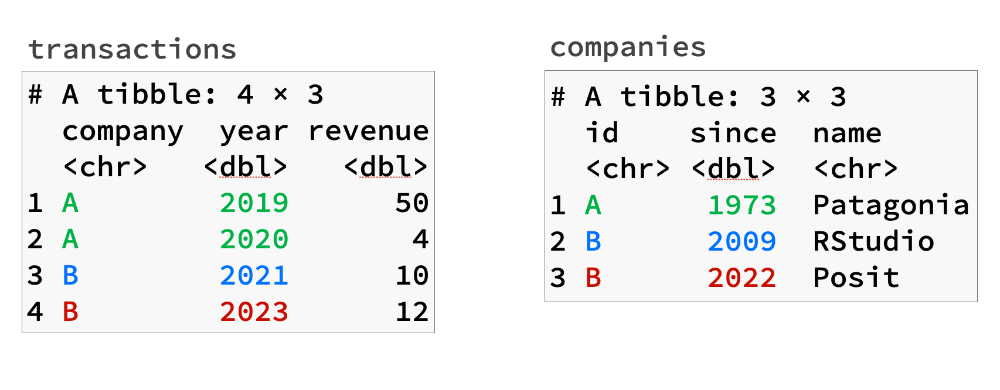

[dplyr 1.1.0](https://dplyr.tidyverse.org/news/index.html#dplyr-110) is out now! This is post 1 of 4 detailing some of the new features in this release. In this post, we will discuss various new updates to dplyr's joins.

You can install it from CRAN with:

<pre class='chroma'><code class='language-r' data-lang='r'><a href='https://rdrr.io/r/utils/install.packages.html'>install.packages</a>("dplyr")</code></pre>

<pre class='chroma'><code class='language-r' data-lang='r'><a href='https://rdrr.io/r/base/library.html'>library</a>(<a href='https://dplyr.tidyverse.org'>dplyr</a>)</code></pre>

## `join_by()`

Consider the following two tables, `transactions` and `companies`. `transactions` tracks sales across various years for different companies, and `companies` connects the short company id to its actual company name - either Patagonia (a fellow B-Corp!) or RStudio.

<pre class='chroma'><code class='language-r' data-lang='r'>transactions &lt;- <a href='https://tibble.tidyverse.org/reference/tibble.html'>tibble</a>(
  company = <a href='https://rdrr.io/r/base/c.html'>c</a>("A", "A", "B", "B"),
  year = <a href='https://rdrr.io/r/base/c.html'>c</a>(2019, 2020, 2021, 2023),
  revenue = <a href='https://rdrr.io/r/base/c.html'>c</a>(50, 4, 10, 12)
)
transactions
#&gt; # A tibble: 4 × 3
#&gt;   company  year revenue
#&gt;   &lt;chr&gt;   &lt;dbl&gt;   &lt;dbl&gt;
#&gt; 1 A        2019      50
#&gt; 2 A        2020       4
#&gt; 3 B        2021      10
#&gt; 4 B        2023      12

companies &lt;- <a href='https://tibble.tidyverse.org/reference/tibble.html'>tibble</a>(
  id = <a href='https://rdrr.io/r/base/c.html'>c</a>("A", "B"),
  name = <a href='https://rdrr.io/r/base/c.html'>c</a>("Patagonia", "RStudio")
)
companies
#&gt; # A tibble: 2 × 2
#&gt;   id    name     
#&gt;   &lt;chr&gt; &lt;chr&gt;    
#&gt; 1 A     Patagonia
#&gt; 2 B     RStudio
</code></pre>

To join these two tables together, we might use an inner join:

<pre class='chroma'><code class='language-r' data-lang='r'>transactions |&gt; 
  <a href='https://dplyr.tidyverse.org/reference/mutate-joins.html'>inner_join</a>(companies, by = <a href='https://rdrr.io/r/base/c.html'>c</a>(company = "id"))
#&gt; # A tibble: 4 × 4
#&gt;   company  year revenue name     
#&gt;   &lt;chr&gt;   &lt;dbl&gt;   &lt;dbl&gt; &lt;chr&gt;    
#&gt; 1 A        2019      50 Patagonia
#&gt; 2 A        2020       4 Patagonia
#&gt; 3 B        2021      10 RStudio  
#&gt; 4 B        2023      12 RStudio
</code></pre>

This works great, but has always felt a little clunky. Specifying `c(company = "id")` is a little unnatural for new users, especially if they are used to "equivalence" in R being expressed with `==`. We've improved on this with a new helper, [`join_by()`](https://dplyr.tidyverse.org/reference/join_by.html), which takes expressions in a way that allows you to more naturally express this join:

<pre class='chroma'><code class='language-r' data-lang='r'><a href='https://dplyr.tidyverse.org/reference/join_by.html'>join_by</a>(company == id)
#&gt; Join By:
#&gt; - company == id
</code></pre>

This *join specification* can be used as the `by` argument in any of the `*_join()` functions:

<pre class='chroma'><code class='language-r' data-lang='r'>transactions |&gt; 
  <a href='https://dplyr.tidyverse.org/reference/mutate-joins.html'>inner_join</a>(companies, by = <a href='https://dplyr.tidyverse.org/reference/join_by.html'>join_by</a>(company == id))
#&gt; # A tibble: 4 × 4
#&gt;   company  year revenue name     
#&gt;   &lt;chr&gt;   &lt;dbl&gt;   &lt;dbl&gt; &lt;chr&gt;    
#&gt; 1 A        2019      50 Patagonia
#&gt; 2 A        2020       4 Patagonia
#&gt; 3 B        2021      10 RStudio  
#&gt; 4 B        2023      12 RStudio
</code></pre>

This small quality of life improvement is just one of the many new features that come with [`join_by()`](https://dplyr.tidyverse.org/reference/join_by.html). We'll look at more of these next.

## Inequality joins

To make things a little more interesting, we'll add one more column to `companies`, and one more row:

<pre class='chroma'><code class='language-r' data-lang='r'>companies &lt;- <a href='https://tibble.tidyverse.org/reference/tibble.html'>tibble</a>(
  id = <a href='https://rdrr.io/r/base/c.html'>c</a>("A", "B", "B"),
  since = <a href='https://rdrr.io/r/base/c.html'>c</a>(1973, 2009, 2022),
  name = <a href='https://rdrr.io/r/base/c.html'>c</a>("Patagonia", "RStudio", "Posit")
)

companies
#&gt; # A tibble: 3 × 3
#&gt;   id    since name     
#&gt;   &lt;chr&gt; &lt;dbl&gt; &lt;chr&gt;    
#&gt; 1 A      1973 Patagonia
#&gt; 2 B      2009 RStudio  
#&gt; 3 B      2022 Posit
</code></pre>

This table now also tracks name changes that have happened over the course of a company's history. In 2022, we changed our name from RStudio to Posit, so we've tracked that as an additional row in our dataset. Note that both RStudio and Posit are given an `id` of `B`, which links back to the `transactions` table.

If we were to join these two tables together, ideally we'd bring over the name that was in effect when the transaction took place. For example, for the transaction in 2021, the company was still RStudio, so ideally we'd only match up against the RStudio row in `companies`. If we colored the expected matches, they'd look something like this:

How can we do this? We can try the same join from before, but we won't like the results:

<pre class='chroma'><code class='language-r' data-lang='r'>faulty &lt;- transactions |&gt; 
  <a href='https://dplyr.tidyverse.org/reference/mutate-joins.html'>inner_join</a>(companies, by = <a href='https://dplyr.tidyverse.org/reference/join_by.html'>join_by</a>(company == id))
#&gt; Warning in inner_join(transactions, companies, by = join_by(company == id)): Each row in `x` is expected to match at most 1 row in `y`.
#&gt; ℹ Row 3 of `x` matches multiple rows.
#&gt; ℹ If multiple matches are expected, set `multiple = "all"` to silence this
#&gt;   warning.

faulty
#&gt; # A tibble: 6 × 5
#&gt;   company  year revenue since name     
#&gt;   &lt;chr&gt;   &lt;dbl&gt;   &lt;dbl&gt; &lt;dbl&gt; &lt;chr&gt;    
#&gt; 1 A        2019      50  1973 Patagonia
#&gt; 2 A        2020       4  1973 Patagonia
#&gt; 3 B        2021      10  2009 RStudio  
#&gt; 4 B        2021      10  2022 Posit    
#&gt; 5 B        2023      12  2009 RStudio  
#&gt; 6 B        2023      12  2022 Posit
</code></pre>

Company `A` matches correctly, but since we only joined on the company id, we get *multiple matches* for each of company `B`'s transactions and end up with more rows than we started with. This is a problem, as we were expecting a 1:1 match for each row in `transactions`. Multiple matches in equality joins like this one are typically unexpected -- in fact, many people don't even know this is possible even though it is technically default SQL behavior -- so we've also added a new warning to alert you when this happens. If multiple matches are expected, explicitly set `multiple = "all"` to silence this warning. This also serves as a code "sign post" for future readers of your code to let them know that this is a join that is expected to increase the number of rows in the data. If multiple matches *aren't* expected, you can also set `multiple = "error"` to immediately halt the analysis. We expect this will be useful as a quality control check for production code where you might rerun analyses with new data on a rolling basis.

To actually fix this issue, we'll need to expand our join specification to include another condition. Let's zoom in to just 2021:

<pre class='chroma'><code class='language-r' data-lang='r'><a href='https://dplyr.tidyverse.org/reference/filter.html'>filter</a>(faulty, company == "B", year == 2021)
#&gt; # A tibble: 2 × 5
#&gt;   company  year revenue since name   
#&gt;   &lt;chr&gt;   &lt;dbl&gt;   &lt;dbl&gt; &lt;dbl&gt; &lt;chr&gt;  
#&gt; 1 B        2021      10  2009 RStudio
#&gt; 2 B        2021      10  2022 Posit
</code></pre>

We want to retain the match with RStudio, but not with Posit (because the name hasn't changed yet). One way to express this is by using the `year` and `since` columns to state that you only want a match if the transaction `year` occurred *after* a name change:

<pre class='chroma'><code class='language-r' data-lang='r'># `year[i] &gt;= since`?
2021 &gt;= 2009
#&gt; [1] TRUE
2021 &gt;= 2022
#&gt; [1] FALSE
</code></pre>

Because [`join_by()`](https://dplyr.tidyverse.org/reference/join_by.html) accepts expressions, we can express this inequality directly inside the join specification:

<pre class='chroma'><code class='language-r' data-lang='r'><a href='https://dplyr.tidyverse.org/reference/join_by.html'>join_by</a>(company == id, year &gt;= since)
#&gt; Join By:
#&gt; - company == id
#&gt; - year &gt;= since
</code></pre>

<pre class='chroma'><code class='language-r' data-lang='r'>transactions |&gt;
  <a href='https://dplyr.tidyverse.org/reference/mutate-joins.html'>inner_join</a>(companies, <a href='https://dplyr.tidyverse.org/reference/join_by.html'>join_by</a>(company == id, year &gt;= since))
#&gt; # A tibble: 5 × 5
#&gt;   company  year revenue since name     
#&gt;   &lt;chr&gt;   &lt;dbl&gt;   &lt;dbl&gt; &lt;dbl&gt; &lt;chr&gt;    
#&gt; 1 A        2019      50  1973 Patagonia
#&gt; 2 A        2020       4  1973 Patagonia
#&gt; 3 B        2021      10  2009 RStudio  
#&gt; 4 B        2023      12  2009 RStudio  
#&gt; 5 B        2023      12  2022 Posit
</code></pre>

This eliminated the 2021 match to Posit, as expected! This type of join is known as an *inequality join*, i.e. it involves at least one join expression containing one of the following inequality conditions: `>=`, `>`, `<=`, or `<`.

However, we still have 2 matches corresponding to the 2023 year. In this case, we only wanted the match to Posit. We can understand why we are still getting multiple matches here by running the same row-by-row analysis as before:

<pre class='chroma'><code class='language-r' data-lang='r'># `year[i] &gt;= since`? Both are true!
2023 &gt;= 2009
#&gt; [1] TRUE
2023 &gt;= 2022
#&gt; [1] TRUE
</code></pre>

To remove the last problematic match of the 2023 transaction to the RStudio name, we'll need to refine our join specification one more time.

## Rolling joins

Inequality conditions like `year >= since` are powerful, but since the condition is only bounded on one side it is common for them to return a large number of matches. Since multiple matches are the typical case with inequality joins, we don't get a warning like with the equality join, but we clearly still haven't gotten the join right. As a reminder, here are where we still have too many matches:

<pre class='chroma'><code class='language-r' data-lang='r'>transactions |&gt;
  <a href='https://dplyr.tidyverse.org/reference/mutate-joins.html'>inner_join</a>(companies, <a href='https://dplyr.tidyverse.org/reference/join_by.html'>join_by</a>(company == id, year &gt;= since)) |&gt;
  <a href='https://dplyr.tidyverse.org/reference/filter.html'>filter</a>(company == "B", year == 2023)
#&gt; # A tibble: 2 × 5
#&gt;   company  year revenue since name   
#&gt;   &lt;chr&gt;   &lt;dbl&gt;   &lt;dbl&gt; &lt;dbl&gt; &lt;chr&gt;  
#&gt; 1 B        2023      12  2009 RStudio
#&gt; 2 B        2023      12  2022 Posit
</code></pre>

We need a way to filter down the matches returned from `year >= since` to only the most recent name change. In other words, we prefer the Posit match over the RStudio match because 2022 is *closer* to the transaction year of 2023 than 2009 is. We can express this in [`join_by()`](https://dplyr.tidyverse.org/reference/join_by.html) by using a helper named `closest()`.

<pre class='chroma'><code class='language-r' data-lang='r'>transactions |&gt;
  <a href='https://dplyr.tidyverse.org/reference/mutate-joins.html'>inner_join</a>(companies, <a href='https://dplyr.tidyverse.org/reference/join_by.html'>join_by</a>(company == id, closest(year &gt;= since)))
#&gt; # A tibble: 4 × 5
#&gt;   company  year revenue since name     
#&gt;   &lt;chr&gt;   &lt;dbl&gt;   &lt;dbl&gt; &lt;dbl&gt; &lt;chr&gt;    
#&gt; 1 A        2019      50  1973 Patagonia
#&gt; 2 A        2020       4  1973 Patagonia
#&gt; 3 B        2021      10  2009 RStudio  
#&gt; 4 B        2023      12  2022 Posit
</code></pre>

`closest(year >= since)` finds all of the matches in `since` for a particular `year`, and then filters them down to only the closest match to that `year`. This is known as a *rolling join*, because in this case it *rolls* the most recent name change forward to match up with the transaction. Rolling joins were popularized by data.table, and are related to `ASOF` joins supported by some SQL flavors.

## `unmatched` rows

I mentioned earlier that we expected a 1:1 match between `transactions` and `companies`. We saw that `multiple` can help protect us from having too many matches, but what about not having enough? Consider what happens if we add a new company to `transactions` without a corresponding match in `companies`.

<pre class='chroma'><code class='language-r' data-lang='r'>transactions &lt;- transactions |&gt;
  tibble::<a href='https://tibble.tidyverse.org/reference/add_row.html'>add_row</a>(company = "C", year = 2023, revenue = 15)

transactions
#&gt; # A tibble: 5 × 3
#&gt;   company  year revenue
#&gt;   &lt;chr&gt;   &lt;dbl&gt;   &lt;dbl&gt;
#&gt; 1 A        2019      50
#&gt; 2 A        2020       4
#&gt; 3 B        2021      10
#&gt; 4 B        2023      12
#&gt; 5 C        2023      15
</code></pre>

<pre class='chroma'><code class='language-r' data-lang='r'>transactions |&gt;
  <a href='https://dplyr.tidyverse.org/reference/mutate-joins.html'>inner_join</a>(
    companies, 
    <a href='https://dplyr.tidyverse.org/reference/join_by.html'>join_by</a>(company == id, closest(year &gt;= since))
  )
#&gt; # A tibble: 4 × 5
#&gt;   company  year revenue since name     
#&gt;   &lt;chr&gt;   &lt;dbl&gt;   &lt;dbl&gt; &lt;dbl&gt; &lt;chr&gt;    
#&gt; 1 A        2019      50  1973 Patagonia
#&gt; 2 A        2020       4  1973 Patagonia
#&gt; 3 B        2021      10  2009 RStudio  
#&gt; 4 B        2023      12  2022 Posit
</code></pre>

We've accidentally lost the `C` row! If you don't expect any unmatched rows, you can now catch this problem automatically by using our other new quality control argument, `unmatched`:

<pre class='chroma'><code class='language-r' data-lang='r'>transactions |&gt;
  <a href='https://dplyr.tidyverse.org/reference/mutate-joins.html'>inner_join</a>(
    companies, 
    <a href='https://dplyr.tidyverse.org/reference/join_by.html'>join_by</a>(company == id, closest(year &gt;= since)),
    unmatched = "error"
  )
#&gt; Error in `inner_join()`:
#&gt; ! Each row of `x` must have a match in `y`.
#&gt; ℹ Row 5 of `x` does not have a match.
</code></pre>

If you've been questioning why I've been using an [`inner_join()`](https://dplyr.tidyverse.org/reference/mutate-joins.html) over a [`left_join()`](https://dplyr.tidyverse.org/reference/mutate-joins.html) this whole time, `unmatched` is why. We could use a [`left_join()`](https://dplyr.tidyverse.org/reference/mutate-joins.html):

<pre class='chroma'><code class='language-r' data-lang='r'>transactions |&gt;
  <a href='https://dplyr.tidyverse.org/reference/mutate-joins.html'>left_join</a>(
    companies, 
    <a href='https://dplyr.tidyverse.org/reference/join_by.html'>join_by</a>(company == id, closest(year &gt;= since)),
    unmatched = "error"
  )
#&gt; # A tibble: 5 × 5
#&gt;   company  year revenue since name     
#&gt;   &lt;chr&gt;   &lt;dbl&gt;   &lt;dbl&gt; &lt;dbl&gt; &lt;chr&gt;    
#&gt; 1 A        2019      50  1973 Patagonia
#&gt; 2 A        2020       4  1973 Patagonia
#&gt; 3 B        2021      10  2009 RStudio  
#&gt; 4 B        2023      12  2022 Posit    
#&gt; 5 C        2023      15    NA NA
</code></pre>

But you'll notice that we don't get an error here. `unmatched` will only error if the input that has the potential to drop rows has an unmatched row. The reason you'd use a [`left_join()`](https://dplyr.tidyverse.org/reference/mutate-joins.html) is to ensure that rows from `x` are always retained, so it wouldn't make sense to error when rows from `x` are also unmatched. If `y` had unmatched rows instead, *then* it would have errored because those rows would otherwise be lost from the join. In an [`inner_join()`](https://dplyr.tidyverse.org/reference/mutate-joins.html), both inputs can potentially drop rows, so `unmatched = "error"` checks for unmatched rows in both inputs.

