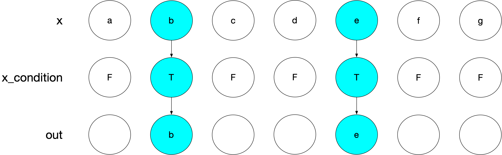
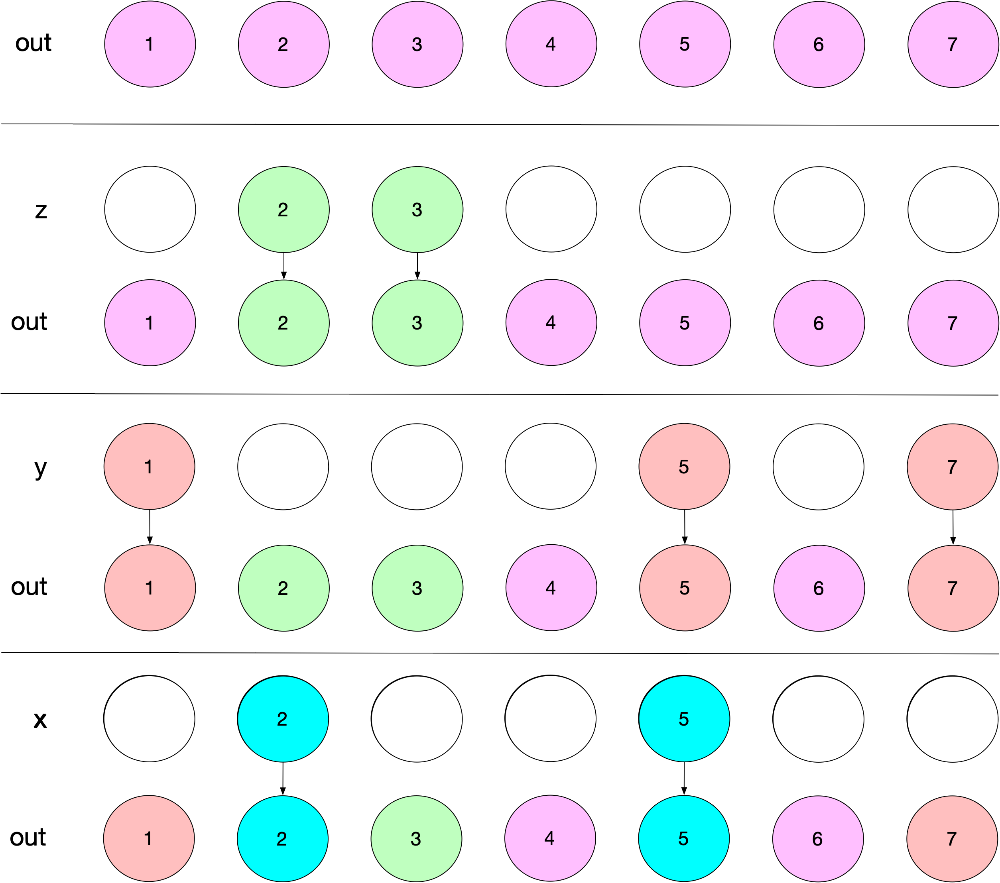

In this technical post, we'll dive into some performance improvements we've made to dplyr 1.2.0 to make [`if_else()`](https://dplyr.tidyverse.org/reference/if_else.html) and [`case_when()`](https://dplyr.tidyverse.org/reference/case-and-replace-when.html) up to 30x faster and use up to 10x less memory.

If you haven't seen our [previous post](https://tidyverse.org/blog/2026/02/dplyr-1-2-0/) about the exciting new features in dplyr 1.2.0, you'll want to go check that out first!

Here's a before-and-after benchmark with [`if_else()`](https://dplyr.tidyverse.org/reference/if_else.html):

<div class="highlight">

<pre class='chroma'><code class='language-r' data-lang='r'><span><span class='c'># Using https://github.com/DavisVaughan/cross</span></span>
<span><span class='nf'>cross</span><span class='nf'>::</span><span class='nf'><a href='https://rdrr.io/pkg/cross/man/bench_versions.html'>bench_versions</a></span><span class='o'>(</span>pkgs <span class='o'>=</span> <span class='nf'><a href='https://rdrr.io/r/base/c.html'>c</a></span><span class='o'>(</span><span class='s'>"tidyverse/dplyr@v1.1.4"</span>, <span class='s'>"tidyverse/dplyr"</span><span class='o'>)</span>, <span class='o'>&#123;</span></span>
<span>  <span class='kr'><a href='https://rdrr.io/r/base/library.html'>library</a></span><span class='o'>(</span><span class='nv'><a href='https://dplyr.tidyverse.org'>dplyr</a></span><span class='o'>)</span></span>
<span>  <span class='nf'><a href='https://rdrr.io/r/base/Random.html'>set.seed</a></span><span class='o'>(</span><span class='m'>123</span><span class='o'>)</span></span>
<span></span>
<span>  <span class='nv'>condition</span> <span class='o'>&lt;-</span> <span class='nf'><a href='https://rdrr.io/r/base/sample.html'>sample</a></span><span class='o'>(</span><span class='nf'><a href='https://rdrr.io/r/base/c.html'>c</a></span><span class='o'>(</span><span class='kc'>TRUE</span>, <span class='kc'>FALSE</span>, <span class='kc'>NA</span><span class='o'>)</span>, size <span class='o'>=</span> <span class='m'>1e7</span>, replace <span class='o'>=</span> <span class='kc'>TRUE</span><span class='o'>)</span></span>
<span>  <span class='nv'>x</span> <span class='o'>&lt;-</span> <span class='nf'><a href='https://rdrr.io/r/base/sample.html'>sample</a></span><span class='o'>(</span><span class='m'>10</span>, size <span class='o'>=</span> <span class='m'>1e7</span>, replace <span class='o'>=</span> <span class='kc'>TRUE</span><span class='o'>)</span></span>
<span>  <span class='nv'>y</span> <span class='o'>&lt;-</span> <span class='nf'><a href='https://rdrr.io/r/base/sample.html'>sample</a></span><span class='o'>(</span><span class='m'>10</span>, size <span class='o'>=</span> <span class='m'>1e7</span>, replace <span class='o'>=</span> <span class='kc'>TRUE</span><span class='o'>)</span></span>
<span>  <span class='nv'>z</span> <span class='o'>&lt;-</span> <span class='nf'><a href='https://rdrr.io/r/base/sample.html'>sample</a></span><span class='o'>(</span><span class='m'>10</span>, size <span class='o'>=</span> <span class='m'>1e7</span>, replace <span class='o'>=</span> <span class='kc'>TRUE</span><span class='o'>)</span></span>
<span></span>
<span>  <span class='nf'>bench</span><span class='nf'>::</span><span class='nf'><a href='https://bench.r-lib.org/reference/mark.html'>mark</a></span><span class='o'>(</span>if_else <span class='o'>=</span> <span class='nf'><a href='https://dplyr.tidyverse.org/reference/if_else.html'>if_else</a></span><span class='o'>(</span><span class='nv'>condition</span>, <span class='nv'>x</span>, <span class='nv'>y</span>, missing <span class='o'>=</span> <span class='nv'>z</span><span class='o'>)</span><span class='o'>)</span></span>
<span><span class='o'>&#125;</span><span class='o'>)</span></span></code></pre>

</div>

``` r
#> # A tibble: 2 × 6
#>   pkg                    expression      min   median `itr/sec` mem_alloc
#>   <chr>                  <bch:expr> <bch:tm> <bch:tm>     <dbl> <bch:byt>
#> 1 tidyverse/dplyr@v1.1.4 if_else    248.25ms 249.25ms      4.02   381.6MB
#> 2 tidyverse/dplyr        if_else      7.27ms   7.51ms    132.      38.2MB
```

And with [`case_when()`](https://dplyr.tidyverse.org/reference/case-and-replace-when.html):

<div class="highlight">

<pre class='chroma'><code class='language-r' data-lang='r'><span><span class='nf'>cross</span><span class='nf'>::</span><span class='nf'><a href='https://rdrr.io/pkg/cross/man/bench_versions.html'>bench_versions</a></span><span class='o'>(</span>pkgs <span class='o'>=</span> <span class='nf'><a href='https://rdrr.io/r/base/c.html'>c</a></span><span class='o'>(</span><span class='s'>"tidyverse/dplyr@v1.1.4"</span>, <span class='s'>"tidyverse/dplyr"</span><span class='o'>)</span>, <span class='o'>&#123;</span></span>
<span>  <span class='kr'><a href='https://rdrr.io/r/base/library.html'>library</a></span><span class='o'>(</span><span class='nv'><a href='https://dplyr.tidyverse.org'>dplyr</a></span><span class='o'>)</span></span>
<span>  <span class='nf'><a href='https://rdrr.io/r/base/Random.html'>set.seed</a></span><span class='o'>(</span><span class='m'>123</span><span class='o'>)</span></span>
<span></span>
<span>  <span class='nv'>column</span> <span class='o'>&lt;-</span> <span class='nf'><a href='https://rdrr.io/r/base/sample.html'>sample</a></span><span class='o'>(</span><span class='m'>100</span>, size <span class='o'>=</span> <span class='m'>1e7</span>, replace <span class='o'>=</span> <span class='kc'>TRUE</span><span class='o'>)</span></span>
<span></span>
<span>  <span class='nv'>x_condition</span> <span class='o'>&lt;-</span> <span class='nv'>column</span> <span class='o'>&lt;</span> <span class='m'>20</span></span>
<span>  <span class='nv'>y_condition</span> <span class='o'>&lt;-</span> <span class='nv'>column</span> <span class='o'>&lt;</span> <span class='m'>50</span></span>
<span>  <span class='nv'>z_condition</span> <span class='o'>&lt;-</span> <span class='nv'>column</span> <span class='o'>&lt;</span> <span class='m'>80</span></span>
<span></span>
<span>  <span class='nv'>x</span> <span class='o'>&lt;-</span> <span class='nf'><a href='https://rdrr.io/r/base/sample.html'>sample</a></span><span class='o'>(</span><span class='m'>10</span>, size <span class='o'>=</span> <span class='m'>1e7</span>, replace <span class='o'>=</span> <span class='kc'>TRUE</span><span class='o'>)</span></span>
<span>  <span class='nv'>y</span> <span class='o'>&lt;-</span> <span class='nf'><a href='https://rdrr.io/r/base/sample.html'>sample</a></span><span class='o'>(</span><span class='m'>10</span>, size <span class='o'>=</span> <span class='m'>1e7</span>, replace <span class='o'>=</span> <span class='kc'>TRUE</span><span class='o'>)</span></span>
<span>  <span class='nv'>z</span> <span class='o'>&lt;-</span> <span class='nf'><a href='https://rdrr.io/r/base/sample.html'>sample</a></span><span class='o'>(</span><span class='m'>10</span>, size <span class='o'>=</span> <span class='m'>1e7</span>, replace <span class='o'>=</span> <span class='kc'>TRUE</span><span class='o'>)</span></span>
<span></span>
<span>  <span class='nf'>bench</span><span class='nf'>::</span><span class='nf'><a href='https://bench.r-lib.org/reference/mark.html'>mark</a></span><span class='o'>(</span></span>
<span>    case_when <span class='o'>=</span> <span class='nf'><a href='https://dplyr.tidyverse.org/reference/case-and-replace-when.html'>case_when</a></span><span class='o'>(</span></span>
<span>      <span class='nv'>x_condition</span> <span class='o'>~</span> <span class='nv'>x</span>,</span>
<span>      <span class='nv'>y_condition</span> <span class='o'>~</span> <span class='nv'>y</span>,</span>
<span>      <span class='nv'>z_condition</span> <span class='o'>~</span> <span class='nv'>z</span></span>
<span>    <span class='o'>)</span></span>
<span>  <span class='o'>)</span></span>
<span><span class='o'>&#125;</span><span class='o'>)</span></span></code></pre>

</div>

``` r
#> # A tibble: 2 × 6
#>   pkg                    expression      min   median `itr/sec` mem_alloc
#>   <chr>                  <bch:expr> <bch:tm> <bch:tm>     <dbl> <bch:byt>
#> 1 tidyverse/dplyr@v1.1.4 case_when   228.3ms  231.2ms      4.33   419.9MB
#> 2 tidyverse/dplyr        case_when    15.5ms   15.8ms     62.8     38.3MB
```

So a 33x speed improvement for [`if_else()`](https://dplyr.tidyverse.org/reference/if_else.html), a 15x speed improvement for [`case_when()`](https://dplyr.tidyverse.org/reference/case-and-replace-when.html), and a 10x improvement in memory usage for both! In the rest of this post, we'll explain how we've achieved these numbers.

<div class="highlight">

<pre class='chroma'><code class='language-r' data-lang='r'><span><span class='kr'><a href='https://rdrr.io/r/base/library.html'>library</a></span><span class='o'>(</span><span class='nv'><a href='https://dplyr.tidyverse.org'>dplyr</a></span><span class='o'>)</span></span></code></pre>

</div>

## Let's talk memory

We'll start with [`case_when()`](https://dplyr.tidyverse.org/reference/case-and-replace-when.html), because [`if_else()`](https://dplyr.tidyverse.org/reference/if_else.html) is actually just a small variant of that.

The most important place to start is with the memory usage. Memory usage and raw speed are often related, as allocating memory takes time. Let's look at the memory usage of [`case_when()`](https://dplyr.tidyverse.org/reference/case-and-replace-when.html) in dplyr 1.1.4:

<div class="highlight">

<pre class='chroma'><code class='language-r' data-lang='r'><span><span class='nf'><a href='https://rdrr.io/r/base/Random.html'>set.seed</a></span><span class='o'>(</span><span class='m'>123</span><span class='o'>)</span></span>
<span></span>
<span><span class='nv'>column</span> <span class='o'>&lt;-</span> <span class='nf'><a href='https://rdrr.io/r/base/sample.html'>sample</a></span><span class='o'>(</span><span class='m'>100</span>, size <span class='o'>=</span> <span class='m'>1e7</span>, replace <span class='o'>=</span> <span class='kc'>TRUE</span><span class='o'>)</span></span>
<span></span>
<span><span class='nv'>x_condition</span> <span class='o'>&lt;-</span> <span class='nv'>column</span> <span class='o'>&lt;</span> <span class='m'>20</span></span>
<span><span class='nv'>y_condition</span> <span class='o'>&lt;-</span> <span class='nv'>column</span> <span class='o'>&lt;</span> <span class='m'>50</span></span>
<span><span class='nv'>z_condition</span> <span class='o'>&lt;-</span> <span class='nv'>column</span> <span class='o'>&lt;</span> <span class='m'>80</span></span>
<span></span>
<span><span class='nv'>x</span> <span class='o'>&lt;-</span> <span class='nf'><a href='https://rdrr.io/r/base/sample.html'>sample</a></span><span class='o'>(</span><span class='m'>10</span>, size <span class='o'>=</span> <span class='m'>1e7</span>, replace <span class='o'>=</span> <span class='kc'>TRUE</span><span class='o'>)</span></span>
<span><span class='nv'>y</span> <span class='o'>&lt;-</span> <span class='nf'><a href='https://rdrr.io/r/base/sample.html'>sample</a></span><span class='o'>(</span><span class='m'>10</span>, size <span class='o'>=</span> <span class='m'>1e7</span>, replace <span class='o'>=</span> <span class='kc'>TRUE</span><span class='o'>)</span></span>
<span><span class='nv'>z</span> <span class='o'>&lt;-</span> <span class='nf'><a href='https://rdrr.io/r/base/sample.html'>sample</a></span><span class='o'>(</span><span class='m'>10</span>, size <span class='o'>=</span> <span class='m'>1e7</span>, replace <span class='o'>=</span> <span class='kc'>TRUE</span><span class='o'>)</span></span></code></pre>

</div>

``` r
profmem::profmem(
  threshold = 1000,
  case_when(
    x_condition ~ x,
    y_condition ~ y,
    z_condition ~ z
  )
)
#> Rprofmem memory profiling of:
#> case_when(x_condition ~ x, y_condition ~ y, z_condition ~ z)
#>
#> Memory allocations (>= 1000 bytes):
#>        what     bytes                                           calls
#> 1     alloc  40000048     case_when() -> vec_case_when() -> vec_rep()
#> 2     alloc  40000048                  case_when() -> vec_case_when()
#> 3     alloc  40000056       case_when() -> vec_case_when() -> which()
#> 4     alloc   7600664       case_when() -> vec_case_when() -> which()
#> 5     alloc  40000048                  case_when() -> vec_case_when()
#> 6     alloc  40000056       case_when() -> vec_case_when() -> which()
#> 7     alloc  12003312       case_when() -> vec_case_when() -> which()
#> 8     alloc  40000048                  case_when() -> vec_case_when()
#> 9     alloc  40000056       case_when() -> vec_case_when() -> which()
#> 10    alloc  11996112       case_when() -> vec_case_when() -> which()
#> 11    alloc  40000056       case_when() -> vec_case_when() -> which()
#> 12    alloc   8400112       case_when() -> vec_case_when() -> which()
#> 13    alloc   7600664   case_when() -> vec_case_when() -> vec_slice()
#> 14    alloc  12003312   case_when() -> vec_case_when() -> vec_slice()
#> 15    alloc  11996112   case_when() -> vec_case_when() -> vec_slice()
#> 16    alloc   8400112 case_when() -> vec_case_when() -> vec_recycle()
#> 17    alloc  40000048 case_when() -> vec_case_when() -> list_unchop()
#> total       440000864
```

That's a lot of allocations! And it's pretty hard to understand where they are coming from without a bit more explanation. For that, we're actually going to "manually" implement an underpowered version of [`case_when()`](https://dplyr.tidyverse.org/reference/case-and-replace-when.html) for this example.

Here's a diagram of what we need to accomplish:


In bullets:

-   `x_condition` selects the blue elements of `x`
-   `y_condition` selects the red elements of `y`
-   `z_condition` selects the green elements of `z`
-   A `default` is built around the unused locations
-   We combine all of the pieces into `out`

The trickiest part about [`case_when()`](https://dplyr.tidyverse.org/reference/case-and-replace-when.html) is handling places where `x_condition` and `y_condition` overlap. In the image, even though both `x` and `y` are selected at location 5, only the value of `x` is retained since it is hit "first". This forces us to have to modify `y_condition` to avoid already "used" locations.

An R implementation that computes these modified locations might look like:

<div class="highlight">

<pre class='chroma'><code class='language-r' data-lang='r'><span><span class='nv'>n</span> <span class='o'>&lt;-</span> <span class='nf'><a href='https://rdrr.io/r/base/length.html'>length</a></span><span class='o'>(</span><span class='nv'>x_condition</span><span class='o'>)</span></span>
<span></span>
<span><span class='nv'>unused</span> <span class='o'>&lt;-</span> <span class='nf'><a href='https://rdrr.io/r/base/rep.html'>rep</a></span><span class='o'>(</span><span class='kc'>TRUE</span>, times <span class='o'>=</span> <span class='nv'>n</span><span class='o'>)</span> <span class='c'># 1</span></span>
<span></span>
<span><span class='nv'>x_loc</span> <span class='o'>&lt;-</span> <span class='nv'>unused</span> <span class='o'>&amp;</span> <span class='nv'>x_condition</span> <span class='c'># 2</span></span>
<span><span class='nv'>x_loc</span> <span class='o'>&lt;-</span> <span class='nf'><a href='https://rdrr.io/r/base/which.html'>which</a></span><span class='o'>(</span><span class='nv'>x_loc</span><span class='o'>)</span> <span class='c'># 3,4</span></span>
<span><span class='nv'>unused</span><span class='o'>[</span><span class='nv'>x_loc</span><span class='o'>]</span> <span class='o'>&lt;-</span> <span class='kc'>FALSE</span></span>
<span></span>
<span><span class='nv'>y_loc</span> <span class='o'>&lt;-</span> <span class='nv'>unused</span> <span class='o'>&amp;</span> <span class='nv'>y_condition</span> <span class='c'># 5</span></span>
<span><span class='nv'>y_loc</span> <span class='o'>&lt;-</span> <span class='nf'><a href='https://rdrr.io/r/base/which.html'>which</a></span><span class='o'>(</span><span class='nv'>y_loc</span><span class='o'>)</span> <span class='c'># 6,7</span></span>
<span><span class='nv'>unused</span><span class='o'>[</span><span class='nv'>y_loc</span><span class='o'>]</span> <span class='o'>&lt;-</span> <span class='kc'>FALSE</span></span>
<span></span>
<span><span class='nv'>z_loc</span> <span class='o'>&lt;-</span> <span class='nv'>unused</span> <span class='o'>&amp;</span> <span class='nv'>z_condition</span> <span class='c'># 8</span></span>
<span><span class='nv'>z_loc</span> <span class='o'>&lt;-</span> <span class='nf'><a href='https://rdrr.io/r/base/which.html'>which</a></span><span class='o'>(</span><span class='nv'>z_loc</span><span class='o'>)</span> <span class='c'># 9,10</span></span>
<span><span class='nv'>unused</span><span class='o'>[</span><span class='nv'>z_loc</span><span class='o'>]</span> <span class='o'>&lt;-</span> <span class='kc'>FALSE</span></span></code></pre>

</div>

Anything that is still `unused` falls through to the `default`:

<div class="highlight">

<pre class='chroma'><code class='language-r' data-lang='r'><span><span class='nv'>default</span> <span class='o'>&lt;-</span> <span class='kc'>NA_integer_</span></span>
<span><span class='nv'>default_loc</span> <span class='o'>&lt;-</span> <span class='nf'><a href='https://rdrr.io/r/base/which.html'>which</a></span><span class='o'>(</span><span class='nv'>unused</span><span class='o'>)</span> <span class='c'># 11,12</span></span></code></pre>

</div>

With `x_loc`, `y_loc`, `z_loc`, and `default_loc` in hand, we can build the output from the pieces:

<div class="highlight">

<pre class='chroma'><code class='language-r' data-lang='r'><span><span class='nv'>out</span> <span class='o'>&lt;-</span> <span class='nf'><a href='https://rdrr.io/r/base/vector.html'>vector</a></span><span class='o'>(</span><span class='s'>"integer"</span>, length <span class='o'>=</span> <span class='nv'>n</span><span class='o'>)</span> <span class='c'># 17</span></span>
<span></span>
<span><span class='nv'>out</span><span class='o'>[</span><span class='nv'>x_loc</span><span class='o'>]</span> <span class='o'>&lt;-</span> <span class='nv'>x</span><span class='o'>[</span><span class='nv'>x_loc</span><span class='o'>]</span> <span class='c'># 13</span></span>
<span><span class='nv'>out</span><span class='o'>[</span><span class='nv'>y_loc</span><span class='o'>]</span> <span class='o'>&lt;-</span> <span class='nv'>y</span><span class='o'>[</span><span class='nv'>y_loc</span><span class='o'>]</span> <span class='c'># 14</span></span>
<span><span class='nv'>out</span><span class='o'>[</span><span class='nv'>z_loc</span><span class='o'>]</span> <span class='o'>&lt;-</span> <span class='nv'>z</span><span class='o'>[</span><span class='nv'>z_loc</span><span class='o'>]</span> <span class='c'># 15</span></span>
<span></span>
<span><span class='nv'>out</span><span class='o'>[</span><span class='nv'>default_loc</span><span class='o'>]</span> <span class='o'>&lt;-</span> <span class='nf'><a href='https://rdrr.io/r/base/rep.html'>rep</a></span><span class='o'>(</span><span class='nv'>default</span>, times <span class='o'>=</span> <span class='nf'><a href='https://rdrr.io/r/base/length.html'>length</a></span><span class='o'>(</span><span class='nv'>default_loc</span><span class='o'>)</span><span class='o'>)</span> <span class='c'># 16</span></span></code></pre>

</div>

And sure enough, this is identical to [`case_when()`](https://dplyr.tidyverse.org/reference/case-and-replace-when.html):

<div class="highlight">

<pre class='chroma'><code class='language-r' data-lang='r'><span><span class='nf'><a href='https://rdrr.io/r/base/identical.html'>identical</a></span><span class='o'>(</span></span>
<span>  <span class='nv'>out</span>,</span>
<span>  <span class='nf'><a href='https://dplyr.tidyverse.org/reference/case-and-replace-when.html'>case_when</a></span><span class='o'>(</span></span>
<span>    <span class='nv'>x_condition</span> <span class='o'>~</span> <span class='nv'>x</span>,</span>
<span>    <span class='nv'>y_condition</span> <span class='o'>~</span> <span class='nv'>y</span>,</span>
<span>    <span class='nv'>z_condition</span> <span class='o'>~</span> <span class='nv'>z</span></span>
<span>  <span class='o'>)</span></span>
<span><span class='o'>)</span></span>
<span><span class='c'>#&gt; [1] TRUE</span></span>
<span></span></code></pre>

</div>

You might be wondering what all of the comments with numbers beside them mean. Those actually map 1:1 with the allocations that [`case_when()`](https://dplyr.tidyverse.org/reference/case-and-replace-when.html) was emitting. In fact, we can now split up those allocations into their respective role:

``` r
#> # Tracking `unused` locations
#> 1     alloc  40000048     case_when() -> vec_case_when() -> vec_rep()

#> # Computing `x_loc`, `y_loc`, and `z_loc`
#> 2     alloc  40000048                  case_when() -> vec_case_when()
#> 3     alloc  40000056       case_when() -> vec_case_when() -> which()
#> 4     alloc   7600664       case_when() -> vec_case_when() -> which()
#> 5     alloc  40000048                  case_when() -> vec_case_when()
#> 6     alloc  40000056       case_when() -> vec_case_when() -> which()
#> 7     alloc  12003312       case_when() -> vec_case_when() -> which()
#> 8     alloc  40000048                  case_when() -> vec_case_when()
#> 9     alloc  40000056       case_when() -> vec_case_when() -> which()
#> 10    alloc  11996112       case_when() -> vec_case_when() -> which()

#> # Computing `default_loc`
#> 11    alloc  40000056       case_when() -> vec_case_when() -> which()
#> 12    alloc   8400112       case_when() -> vec_case_when() -> which()

#> # Slicing `x`, `y`, and `z` to align with `x_loc`, `y_loc`, and `z_loc`
#> 13    alloc   7600664   case_when() -> vec_case_when() -> vec_slice()
#> 14    alloc  12003312   case_when() -> vec_case_when() -> vec_slice()
#> 15    alloc  11996112   case_when() -> vec_case_when() -> vec_slice()

#> # Recycling `default` of `NA` to align with `default_loc`
#> 16    alloc   8400112 case_when() -> vec_case_when() -> vec_recycle()

#> # Final output container, which we assign `x`, `y`, `z`, and `default` into
#> # at locations `x_loc`, `y_loc`, and `z_loc`
#> 17    alloc  40000048 case_when() -> vec_case_when() -> list_unchop()
```

We sought to remove every one of these allocations except for the last one, which is the final output container that is returned to the user. In other words, we were after this, which is the actual profmem result of this [`case_when()`](https://dplyr.tidyverse.org/reference/case-and-replace-when.html) call in dplyr 1.2.0:

``` r
#> Rprofmem memory profiling of:
#> case_when(x_condition ~ x, y_condition ~ y, z_condition ~ z)
#>
#> Memory allocations (>= 1000 bytes):
#>        what    bytes                          calls
#> 1     alloc 40000048 case_when() -> vec_case_when()
#> total       40000048
```

## Sliced assignment

To work towards this, let's focus on what happens to `x` throughout this process:


We had a hypothesis that we could cut out the intermediate work here. Ideally, we'd take the logical LHS `x_condition` and the RHS `x` and map that straight into the output, with no extra allocations:



But this just wasn't possible with the way that assignment typically works in R!

<div class="highlight">

<pre class='chroma'><code class='language-r' data-lang='r'><span><span class='nv'>x</span> <span class='o'>&lt;-</span> <span class='nf'><a href='https://rdrr.io/r/base/c.html'>c</a></span><span class='o'>(</span><span class='s'>"a"</span>, <span class='s'>"b"</span>, <span class='s'>"c"</span>, <span class='s'>"d"</span>, <span class='s'>"e"</span>, <span class='s'>"f"</span>, <span class='s'>"g"</span><span class='o'>)</span></span>
<span><span class='nv'>x_condition</span> <span class='o'>&lt;-</span> <span class='nf'><a href='https://rdrr.io/r/base/c.html'>c</a></span><span class='o'>(</span><span class='kc'>FALSE</span>, <span class='kc'>TRUE</span>, <span class='kc'>FALSE</span>, <span class='kc'>FALSE</span>, <span class='kc'>TRUE</span>, <span class='kc'>FALSE</span>, <span class='kc'>FALSE</span><span class='o'>)</span></span>
<span><span class='nv'>out</span> <span class='o'>&lt;-</span> <span class='nf'><a href='https://rdrr.io/r/base/vector.html'>vector</a></span><span class='o'>(</span><span class='s'>"character"</span>, length <span class='o'>=</span> <span class='nf'><a href='https://rdrr.io/r/base/length.html'>length</a></span><span class='o'>(</span><span class='nv'>x_condition</span><span class='o'>)</span><span class='o'>)</span></span>
<span></span>
<span><span class='nv'>out</span><span class='o'>[</span><span class='nv'>x_condition</span><span class='o'>]</span> <span class='o'>&lt;-</span> <span class='nv'>x</span></span>
<span><span class='c'>#&gt; Warning in out[x_condition] &lt;- x: number of items to replace is not a multiple of replacement length</span></span>
<span></span></code></pre>

</div>

Instead, you must pre-slice `x` to a length that matches the locations that `x_condition` points to in `out`, i.e.:

<div class="highlight">

<pre class='chroma'><code class='language-r' data-lang='r'><span><span class='nv'>out</span><span class='o'>[</span><span class='nv'>x_condition</span><span class='o'>]</span> <span class='o'>&lt;-</span> <span class='nv'>x</span><span class='o'>[</span><span class='nv'>x_condition</span><span class='o'>]</span></span></code></pre>

</div>

Now, in [`case_when()`](https://dplyr.tidyverse.org/reference/case-and-replace-when.html) we don't actually use `[<-` for assignment or `[` for slicing. Instead, we use tools from [vctrs](https://vctrs.r-lib.org/), a low level package for building consistent tidyverse functions. In this case, we'd use `vctrs::vec_assign()` and `vctrs::vec_slice()`:

<div class="highlight">

<pre class='chroma'><code class='language-r' data-lang='r'><span><span class='nv'>out</span> <span class='o'>&lt;-</span> <span class='nf'>vctrs</span><span class='nf'>::</span><span class='nf'><a href='https://vctrs.r-lib.org/reference/vec_slice.html'>vec_assign</a></span><span class='o'>(</span><span class='nv'>out</span>, <span class='nv'>x_condition</span>, <span class='nf'>vctrs</span><span class='nf'>::</span><span class='nf'><a href='https://vctrs.r-lib.org/reference/vec_slice.html'>vec_slice</a></span><span class='o'>(</span><span class='nv'>x</span>, <span class='nv'>x_condition</span><span class='o'>)</span><span class='o'>)</span></span></code></pre>

</div>

But `vec_assign()` had the same problem!

To solve this, we've added a new boolean argument to `vec_assign()` called `slice_value`. You use it like this:

<div class="highlight">

<pre class='chroma'><code class='language-r' data-lang='r'><span><span class='nv'>out</span> <span class='o'>&lt;-</span> <span class='nf'>vctrs</span><span class='nf'>::</span><span class='nf'><a href='https://vctrs.r-lib.org/reference/vec_slice.html'>vec_assign</a></span><span class='o'>(</span><span class='nv'>out</span>, <span class='nv'>x_condition</span>, <span class='nv'>x</span>, slice_value <span class='o'>=</span> <span class='kc'>TRUE</span><span class='o'>)</span></span></code></pre>

</div>

With `slice_value = TRUE`, `vec_assign()` assumes that both `out` and `x` are the same length and that `x_condition` applies to *both* of these. Internally, rather than materializing `x[x_condition]`, we instead just loop over both `out` and `x` at the same time (at C level) and copy over values from `x` whenever `x_condition` is `TRUE`.

This is huge! It means that allocations 13-15 from above related to slicing `x`, `y`, and `z` all disappear.

## Logical `i`ndices

You might have noticed that we've been using `which()` quite a bit in the above algorithm. This turns a logical vector of `TRUE` and `FALSE` into an integer vector of locations pointing to where the logical vector was `TRUE`:

<div class="highlight">

<pre class='chroma'><code class='language-r' data-lang='r'><span><span class='nv'>x_condition</span> <span class='o'>&lt;-</span> <span class='nf'><a href='https://rdrr.io/r/base/c.html'>c</a></span><span class='o'>(</span><span class='kc'>TRUE</span>, <span class='kc'>FALSE</span>, <span class='kc'>TRUE</span>, <span class='kc'>FALSE</span>, <span class='kc'>FALSE</span>, <span class='kc'>TRUE</span><span class='o'>)</span></span>
<span><span class='nv'>x_loc</span> <span class='o'>&lt;-</span> <span class='nf'><a href='https://rdrr.io/r/base/which.html'>which</a></span><span class='o'>(</span><span class='nv'>x_condition</span><span class='o'>)</span></span>
<span><span class='nv'>x_loc</span></span>
<span><span class='c'>#&gt; [1] 1 3 6</span></span>
<span></span></code></pre>

</div>

We perform this conversion up front due to how the following works at C level:

<div class="highlight">

<pre class='chroma'><code class='language-r' data-lang='r'><span><span class='nv'>out</span><span class='o'>[</span><span class='nv'>x_condition</span><span class='o'>]</span> <span class='o'>&lt;-</span> <span class='nv'>x</span><span class='o'>[</span><span class='nv'>x_condition</span><span class='o'>]</span></span></code></pre>

</div>

Both `[` and `[<-` will convert a logical `x_condition` into the integer `x_loc` form before proceeding with the assignment, meaning that `which()` gets called twice if we don't do it once up front. And vctrs is the same way! Both `vec_assign()` and `vec_slice()` here would convert `x_condition` to an integer vector.

<div class="highlight">

<pre class='chroma'><code class='language-r' data-lang='r'><span><span class='nf'>vctrs</span><span class='nf'>::</span><span class='nf'><a href='https://vctrs.r-lib.org/reference/vec_slice.html'>vec_assign</a></span><span class='o'>(</span><span class='nv'>out</span>, <span class='nv'>x_condition</span>, <span class='nf'>vctrs</span><span class='nf'>::</span><span class='nf'><a href='https://vctrs.r-lib.org/reference/vec_slice.html'>vec_slice</a></span><span class='o'>(</span><span class='nv'>x</span>, <span class='nv'>x_condition</span><span class='o'>)</span><span class='o'>)</span></span></code></pre>

</div>

Now, with the previous optimization we've already seen that we can reduce this to:

<div class="highlight">

<pre class='chroma'><code class='language-r' data-lang='r'><span><span class='nf'>vctrs</span><span class='nf'>::</span><span class='nf'><a href='https://vctrs.r-lib.org/reference/vec_slice.html'>vec_assign</a></span><span class='o'>(</span><span class='nv'>out</span>, <span class='nv'>x_condition</span>, <span class='nv'>x</span>, slice_value <span class='o'>=</span> <span class='kc'>TRUE</span><span class='o'>)</span></span></code></pre>

</div>

But `vec_assign()` still converts a logical `x_condition` to integer locations internally before doing the assignment. So now it doesn't matter whether we do this conversion up front via `which()` or if we let `vec_assign()` do it, it still happens once per input. But we'd like to avoid it entirely!

The solution here wasn't too magical, it just involved a good bit of grunt work. We've added a path in `vec_assign()`'s [C code](https://github.com/r-lib/vctrs/blob/94cea16b1ed3939aaa59c58dda75eedc75d6d075/src/slice-assign.c#L390-L417) that can handle logical indices like `x_condition` directly, rather than forcing them to be converted to integer locations first.

But this is a huge win, because it means that allocations 1-10, which were all related to [`which()`](https://rdrr.io/r/base/which.html), can now be removed. `vec_assign()` will just handle that optimally for us without any extra allocations.

The nice part about an optimization like this is that any other existing code that is using `vec_assign()` with a logical index will also benefit from this without having to change a thing!

## `default` handling

The remaining allocations are 11-12 and 16, which all have to do with the implied `default`. Allocations 11-12 were about figuring out where to put `default`, and allocation 16 was about recycling a typed size 1 `default` to the right size before assigning it into `out`.

As it turns out, we don't need any of this!

In vctrs, when we initialize any output container, we use `vec_init()`:

<div class="highlight">

<pre class='chroma'><code class='language-r' data-lang='r'><span><span class='nf'>vctrs</span><span class='nf'>::</span><span class='nf'><a href='https://vctrs.r-lib.org/reference/vec_init.html'>vec_init</a></span><span class='o'>(</span><span class='nf'><a href='https://rdrr.io/r/base/integer.html'>integer</a></span><span class='o'>(</span><span class='o'>)</span>, n <span class='o'>=</span> <span class='m'>5</span><span class='o'>)</span></span>
<span><span class='c'>#&gt; [1] NA NA NA NA NA</span></span>
<span></span><span></span>
<span><span class='nf'>vctrs</span><span class='nf'>::</span><span class='nf'><a href='https://vctrs.r-lib.org/reference/vec_init.html'>vec_init</a></span><span class='o'>(</span><span class='nf'><a href='https://tibble.tidyverse.org/reference/tibble.html'>tibble</a></span><span class='o'>(</span>x <span class='o'>=</span> <span class='nf'><a href='https://rdrr.io/r/base/integer.html'>integer</a></span><span class='o'>(</span><span class='o'>)</span>, y <span class='o'>=</span> <span class='nf'><a href='https://rdrr.io/r/base/character.html'>character</a></span><span class='o'>(</span><span class='o'>)</span><span class='o'>)</span>, n <span class='o'>=</span> <span class='m'>5</span><span class='o'>)</span></span>
<span><span class='c'>#&gt; <span style='color: #555555;'># A tibble: 5 × 2</span></span></span>
<span><span class='c'>#&gt;       x y    </span></span>
<span><span class='c'>#&gt;   <span style='color: #555555; font-style: italic;'>&lt;int&gt;</span> <span style='color: #555555; font-style: italic;'>&lt;chr&gt;</span></span></span>
<span><span class='c'>#&gt; <span style='color: #555555;'>1</span>    <span style='color: #BB0000;'>NA</span> <span style='color: #BB0000;'>NA</span>   </span></span>
<span><span class='c'>#&gt; <span style='color: #555555;'>2</span>    <span style='color: #BB0000;'>NA</span> <span style='color: #BB0000;'>NA</span>   </span></span>
<span><span class='c'>#&gt; <span style='color: #555555;'>3</span>    <span style='color: #BB0000;'>NA</span> <span style='color: #BB0000;'>NA</span>   </span></span>
<span><span class='c'>#&gt; <span style='color: #555555;'>4</span>    <span style='color: #BB0000;'>NA</span> <span style='color: #BB0000;'>NA</span>   </span></span>
<span><span class='c'>#&gt; <span style='color: #555555;'>5</span>    <span style='color: #BB0000;'>NA</span> <span style='color: #BB0000;'>NA</span></span></span>
<span></span></code></pre>

</div>

This *already* has the implied `default` assigned to every location. We then overwrite this with `x`, `y`, and `z` at the appropriate locations, but anything left untouched by those is still set to the `default`, so we're done!

For cases where the user supplies their own `default`, things are slightly more complicated. We actually do have to compute a `default_loc` implied from `x_condition`, `y_condition`, and `z_condition`, but internally we do so using a C vector of `bool` (even more efficient than R's logical vector type), so the memory footprint is as small as it can be.

## The "first wins" conundrum

One thing we've skipped over is the "first wins" behavior of [`case_when()`](https://dplyr.tidyverse.org/reference/case-and-replace-when.html) mentioned earlier. Now that we've removed `x_loc`, `y_loc`, and `z_loc`, which is where that was being handled, how do we keep this behavior without slowing things down?

To be explicit, we are talking about this feature of [`case_when()`](https://dplyr.tidyverse.org/reference/case-and-replace-when.html) where only the first hit is kept when you have overlapping logical indices:

<div class="highlight">

<pre class='chroma'><code class='language-r' data-lang='r'><span><span class='nv'>x</span> <span class='o'>&lt;-</span> <span class='nf'><a href='https://rdrr.io/r/base/c.html'>c</a></span><span class='o'>(</span><span class='s'>"x1"</span>, <span class='s'>"x2"</span>, <span class='s'>"x3"</span><span class='o'>)</span></span>
<span><span class='nv'>y</span> <span class='o'>&lt;-</span> <span class='nf'><a href='https://rdrr.io/r/base/c.html'>c</a></span><span class='o'>(</span><span class='s'>"y1"</span>, <span class='s'>"y2"</span>, <span class='s'>"y3"</span><span class='o'>)</span></span>
<span><span class='nv'>z</span> <span class='o'>&lt;-</span> <span class='nf'><a href='https://rdrr.io/r/base/c.html'>c</a></span><span class='o'>(</span><span class='s'>"z1"</span>, <span class='s'>"z2"</span>, <span class='s'>"z3"</span><span class='o'>)</span></span>
<span></span>
<span><span class='nv'>x_condition</span> <span class='o'>&lt;-</span> <span class='nf'><a href='https://rdrr.io/r/base/c.html'>c</a></span><span class='o'>(</span><span class='kc'>TRUE</span>, <span class='kc'>FALSE</span>, <span class='kc'>TRUE</span><span class='o'>)</span></span>
<span><span class='nv'>y_condition</span> <span class='o'>&lt;-</span> <span class='nf'><a href='https://rdrr.io/r/base/c.html'>c</a></span><span class='o'>(</span><span class='kc'>TRUE</span>, <span class='kc'>TRUE</span>, <span class='kc'>FALSE</span><span class='o'>)</span></span>
<span><span class='nv'>z_condition</span> <span class='o'>&lt;-</span> <span class='nf'><a href='https://rdrr.io/r/base/c.html'>c</a></span><span class='o'>(</span><span class='kc'>FALSE</span>, <span class='kc'>TRUE</span>, <span class='kc'>TRUE</span><span class='o'>)</span></span>
<span></span>
<span><span class='nf'><a href='https://dplyr.tidyverse.org/reference/case-and-replace-when.html'>case_when</a></span><span class='o'>(</span></span>
<span>  <span class='nv'>x_condition</span> <span class='o'>~</span> <span class='nv'>x</span>,</span>
<span>  <span class='nv'>y_condition</span> <span class='o'>~</span> <span class='nv'>y</span>,</span>
<span>  <span class='nv'>z_condition</span> <span class='o'>~</span> <span class='nv'>z</span></span>
<span><span class='o'>)</span></span>
<span><span class='c'>#&gt; [1] "x1" "y2" "x3"</span></span>
<span></span></code></pre>

</div>

A naive approach doesn't work, as you end up with "last wins" behavior:

<div class="highlight">

<pre class='chroma'><code class='language-r' data-lang='r'><span><span class='nv'>out</span> <span class='o'>&lt;-</span> <span class='nf'>vctrs</span><span class='nf'>::</span><span class='nf'><a href='https://vctrs.r-lib.org/reference/vec_init.html'>vec_init</a></span><span class='o'>(</span><span class='nf'><a href='https://rdrr.io/r/base/character.html'>character</a></span><span class='o'>(</span><span class='o'>)</span>, n <span class='o'>=</span> <span class='m'>3</span><span class='o'>)</span></span>
<span></span>
<span><span class='nv'>out</span> <span class='o'>&lt;-</span> <span class='nf'>vctrs</span><span class='nf'>::</span><span class='nf'><a href='https://vctrs.r-lib.org/reference/vec_slice.html'>vec_assign</a></span><span class='o'>(</span><span class='nv'>out</span>, <span class='nv'>x_condition</span>, <span class='nv'>x</span>, slice_value <span class='o'>=</span> <span class='kc'>TRUE</span><span class='o'>)</span></span>
<span><span class='nv'>out</span> <span class='o'>&lt;-</span> <span class='nf'>vctrs</span><span class='nf'>::</span><span class='nf'><a href='https://vctrs.r-lib.org/reference/vec_slice.html'>vec_assign</a></span><span class='o'>(</span><span class='nv'>out</span>, <span class='nv'>y_condition</span>, <span class='nv'>y</span>, slice_value <span class='o'>=</span> <span class='kc'>TRUE</span><span class='o'>)</span></span>
<span><span class='nv'>out</span> <span class='o'>&lt;-</span> <span class='nf'>vctrs</span><span class='nf'>::</span><span class='nf'><a href='https://vctrs.r-lib.org/reference/vec_slice.html'>vec_assign</a></span><span class='o'>(</span><span class='nv'>out</span>, <span class='nv'>z_condition</span>, <span class='nv'>z</span>, slice_value <span class='o'>=</span> <span class='kc'>TRUE</span><span class='o'>)</span></span>
<span></span>
<span><span class='c'># This is wrong!</span></span>
<span><span class='nv'>out</span></span>
<span><span class='c'>#&gt; [1] "y1" "z2" "z3"</span></span>
<span></span><span></span>
<span><span class='nf'><a href='https://rdrr.io/r/base/identical.html'>identical</a></span><span class='o'>(</span></span>
<span>  <span class='nv'>out</span>,</span>
<span>  <span class='nf'><a href='https://dplyr.tidyverse.org/reference/case-and-replace-when.html'>case_when</a></span><span class='o'>(</span></span>
<span>    <span class='nv'>x_condition</span> <span class='o'>~</span> <span class='nv'>x</span>,</span>
<span>    <span class='nv'>y_condition</span> <span class='o'>~</span> <span class='nv'>y</span>,</span>
<span>    <span class='nv'>z_condition</span> <span class='o'>~</span> <span class='nv'>z</span></span>
<span>  <span class='o'>)</span></span>
<span><span class='o'>)</span></span>
<span><span class='c'>#&gt; [1] FALSE</span></span>
<span></span></code></pre>

</div>

Instead, [`case_when()`](https://dplyr.tidyverse.org/reference/case-and-replace-when.html) just *iterates in reverse*, assigning `z`, then `y`, then `x`:

<div class="highlight">

<pre class='chroma'><code class='language-r' data-lang='r'><span><span class='nv'>out</span> <span class='o'>&lt;-</span> <span class='nf'>vctrs</span><span class='nf'>::</span><span class='nf'><a href='https://vctrs.r-lib.org/reference/vec_init.html'>vec_init</a></span><span class='o'>(</span><span class='nf'><a href='https://rdrr.io/r/base/character.html'>character</a></span><span class='o'>(</span><span class='o'>)</span>, n <span class='o'>=</span> <span class='m'>3</span><span class='o'>)</span></span>
<span></span>
<span><span class='nv'>out</span> <span class='o'>&lt;-</span> <span class='nf'>vctrs</span><span class='nf'>::</span><span class='nf'><a href='https://vctrs.r-lib.org/reference/vec_slice.html'>vec_assign</a></span><span class='o'>(</span><span class='nv'>out</span>, <span class='nv'>z_condition</span>, <span class='nv'>z</span>, slice_value <span class='o'>=</span> <span class='kc'>TRUE</span><span class='o'>)</span></span>
<span><span class='nv'>out</span> <span class='o'>&lt;-</span> <span class='nf'>vctrs</span><span class='nf'>::</span><span class='nf'><a href='https://vctrs.r-lib.org/reference/vec_slice.html'>vec_assign</a></span><span class='o'>(</span><span class='nv'>out</span>, <span class='nv'>y_condition</span>, <span class='nv'>y</span>, slice_value <span class='o'>=</span> <span class='kc'>TRUE</span><span class='o'>)</span></span>
<span><span class='nv'>out</span> <span class='o'>&lt;-</span> <span class='nf'>vctrs</span><span class='nf'>::</span><span class='nf'><a href='https://vctrs.r-lib.org/reference/vec_slice.html'>vec_assign</a></span><span class='o'>(</span><span class='nv'>out</span>, <span class='nv'>x_condition</span>, <span class='nv'>x</span>, slice_value <span class='o'>=</span> <span class='kc'>TRUE</span><span class='o'>)</span></span>
<span></span>
<span><span class='nf'><a href='https://rdrr.io/r/base/identical.html'>identical</a></span><span class='o'>(</span></span>
<span>  <span class='nv'>out</span>,</span>
<span>  <span class='nf'><a href='https://dplyr.tidyverse.org/reference/case-and-replace-when.html'>case_when</a></span><span class='o'>(</span></span>
<span>    <span class='nv'>x_condition</span> <span class='o'>~</span> <span class='nv'>x</span>,</span>
<span>    <span class='nv'>y_condition</span> <span class='o'>~</span> <span class='nv'>y</span>,</span>
<span>    <span class='nv'>z_condition</span> <span class='o'>~</span> <span class='nv'>z</span></span>
<span>  <span class='o'>)</span></span>
<span><span class='o'>)</span></span>
<span><span class='c'>#&gt; [1] TRUE</span></span>
<span></span></code></pre>

</div>

This diagram demonstrates how that works:



## Optimizing speed?

Now that we've optimized the memory usage of [`case_when()`](https://dplyr.tidyverse.org/reference/case-and-replace-when.html), you might be wondering if we did anything else to specifically optimize its speed. Not really! We have moved everything from R to C, but focusing our efforts on reducing memory also resulted in some pretty performant code, and there wasn't much left to optimize after that.

## `if_else()`

[`if_else()`](https://dplyr.tidyverse.org/reference/if_else.html) can actually be written as a form of [`case_when()`](https://dplyr.tidyverse.org/reference/case-and-replace-when.html):

<div class="highlight">

<pre class='chroma'><code class='language-r' data-lang='r'><span><span class='nf'><a href='https://dplyr.tidyverse.org/reference/if_else.html'>if_else</a></span><span class='o'>(</span><span class='nv'>condition</span>, <span class='nv'>true</span>, <span class='nv'>false</span>, <span class='nv'>missing</span><span class='o'>)</span></span>
<span></span>
<span><span class='nf'><a href='https://dplyr.tidyverse.org/reference/case-and-replace-when.html'>case_when</a></span><span class='o'>(</span></span>
<span>  <span class='nv'>condition</span> <span class='o'>~</span> <span class='nv'>true</span>,</span>
<span>  <span class='o'>!</span><span class='nv'>condition</span> <span class='o'>~</span> <span class='nv'>false</span>,</span>
<span>  <span class='nf'><a href='https://rdrr.io/r/base/NA.html'>is.na</a></span><span class='o'>(</span><span class='nv'>condition</span><span class='o'>)</span> <span class='o'>~</span> <span class='nv'>missing</span></span>
<span><span class='o'>)</span></span></code></pre>

</div>

In our actual C implementation of [`if_else()`](https://dplyr.tidyverse.org/reference/if_else.html), for simple types like integer, character, or numeric vectors we have an [extremely fast path](https://github.com/r-lib/vctrs/blob/94cea16b1ed3939aaa59c58dda75eedc75d6d075/src/if-else.c#L276-L505) that's even more optimized than this, but for anything with a class we pretty much use this exact [`case_when()`](https://dplyr.tidyverse.org/reference/case-and-replace-when.html) approach.

## For package developers

If you're a package developer, you'll be happy to know that vctrs itself now exposes low dependency versions of [`if_else()`](https://dplyr.tidyverse.org/reference/if_else.html) and [`case_when()`](https://dplyr.tidyverse.org/reference/case-and-replace-when.html), here's the full family:

-   `vec_if_else()`
-   `vec_case_when()`
-   `vec_replace_when()`
-   `vec_recode_values()`
-   `vec_replace_values()`

[`dplyr::if_else()`](https://dplyr.tidyverse.org/reference/if_else.html) and friends are now just very thin wrappers over these. Feel free to use the vctrs versions in your package if you need the consistency of the tidyverse without the heavy-ish dependency of dplyr.

## At the deepest level, `list_combine()`

At the deepest level of all of this is one final new vctrs function, `list_combine()`. This is a flexible way to combine multiple vectors together at locations specified by `indices`.

`list_combine()` powers all of `vec_case_when()`, `vec_replace_when()`, `vec_recode_values()`, `vec_replace_values()`, `vec_if_else()`, and even `vec_c()`, the tidyverse version of [`c()`](https://rdrr.io/r/base/c.html).

<div class="highlight">

<pre class='chroma'><code class='language-r' data-lang='r'><span><span class='nf'><a href='https://rdrr.io/r/base/Random.html'>set.seed</a></span><span class='o'>(</span><span class='m'>123</span><span class='o'>)</span></span>
<span></span>
<span><span class='nv'>column</span> <span class='o'>&lt;-</span> <span class='nf'><a href='https://rdrr.io/r/base/sample.html'>sample</a></span><span class='o'>(</span><span class='m'>100</span>, size <span class='o'>=</span> <span class='m'>1e7</span>, replace <span class='o'>=</span> <span class='kc'>TRUE</span><span class='o'>)</span></span>
<span></span>
<span><span class='nv'>x_condition</span> <span class='o'>&lt;-</span> <span class='nv'>column</span> <span class='o'>&lt;</span> <span class='m'>20</span></span>
<span><span class='nv'>y_condition</span> <span class='o'>&lt;-</span> <span class='nv'>column</span> <span class='o'>&lt;</span> <span class='m'>50</span></span>
<span><span class='nv'>z_condition</span> <span class='o'>&lt;-</span> <span class='nv'>column</span> <span class='o'>&lt;</span> <span class='m'>80</span></span>
<span></span>
<span><span class='nv'>x</span> <span class='o'>&lt;-</span> <span class='nf'><a href='https://rdrr.io/r/base/sample.html'>sample</a></span><span class='o'>(</span><span class='m'>10</span>, size <span class='o'>=</span> <span class='m'>1e7</span>, replace <span class='o'>=</span> <span class='kc'>TRUE</span><span class='o'>)</span></span>
<span><span class='nv'>y</span> <span class='o'>&lt;-</span> <span class='nf'><a href='https://rdrr.io/r/base/sample.html'>sample</a></span><span class='o'>(</span><span class='m'>10</span>, size <span class='o'>=</span> <span class='m'>1e7</span>, replace <span class='o'>=</span> <span class='kc'>TRUE</span><span class='o'>)</span></span>
<span><span class='nv'>z</span> <span class='o'>&lt;-</span> <span class='nf'><a href='https://rdrr.io/r/base/sample.html'>sample</a></span><span class='o'>(</span><span class='m'>10</span>, size <span class='o'>=</span> <span class='m'>1e7</span>, replace <span class='o'>=</span> <span class='kc'>TRUE</span><span class='o'>)</span></span>
<span></span>
<span><span class='nv'>out</span> <span class='o'>&lt;-</span> <span class='nf'>vctrs</span><span class='nf'>::</span><span class='nf'><a href='https://vctrs.r-lib.org/reference/list_combine.html'>list_combine</a></span><span class='o'>(</span></span>
<span>  x <span class='o'>=</span> <span class='nf'><a href='https://rdrr.io/r/base/list.html'>list</a></span><span class='o'>(</span><span class='nv'>x</span>, <span class='nv'>y</span>, <span class='nv'>z</span><span class='o'>)</span>,</span>
<span></span>
<span>  <span class='c'># `indices` are allowed to be logical and aren't forced to integer</span></span>
<span>  indices <span class='o'>=</span> <span class='nf'><a href='https://rdrr.io/r/base/list.html'>list</a></span><span class='o'>(</span><span class='nv'>x_condition</span>, <span class='nv'>y_condition</span>, <span class='nv'>z_condition</span><span class='o'>)</span>,</span>
<span>  size <span class='o'>=</span> <span class='nf'><a href='https://rdrr.io/r/base/length.html'>length</a></span><span class='o'>(</span><span class='nv'>x_condition</span><span class='o'>)</span>,</span>
<span></span>
<span>  <span class='c'># When there are overlaps, take the "first"</span></span>
<span>  multiple <span class='o'>=</span> <span class='s'>"first"</span>,</span>
<span></span>
<span>  <span class='c'># Same as `slice_value` from `vec_assign()`</span></span>
<span>  slice_x <span class='o'>=</span> <span class='kc'>TRUE</span></span>
<span><span class='o'>)</span></span></code></pre>

</div>

<div class="highlight">

<pre class='chroma'><code class='language-r' data-lang='r'><span><span class='nf'><a href='https://rdrr.io/r/base/identical.html'>identical</a></span><span class='o'>(</span></span>
<span>  <span class='nv'>out</span>,</span>
<span>  <span class='nf'><a href='https://dplyr.tidyverse.org/reference/case-and-replace-when.html'>case_when</a></span><span class='o'>(</span></span>
<span>    <span class='nv'>x_condition</span> <span class='o'>~</span> <span class='nv'>x</span>,</span>
<span>    <span class='nv'>y_condition</span> <span class='o'>~</span> <span class='nv'>y</span>,</span>
<span>    <span class='nv'>z_condition</span> <span class='o'>~</span> <span class='nv'>z</span></span>
<span>  <span class='o'>)</span></span>
<span><span class='o'>)</span></span>
<span><span class='c'>#&gt; [1] TRUE</span></span>
<span></span></code></pre>

</div>

