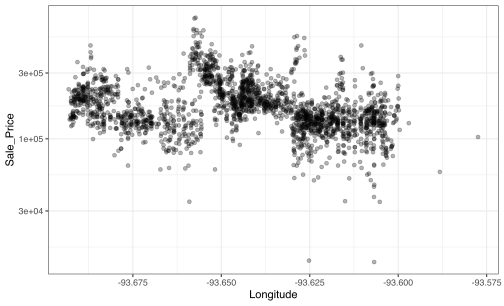
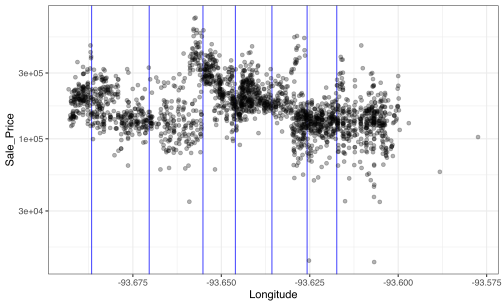

There is a new release of the [embed package](https://embed.tidymodels.org) on [CRAN](https://cran.r-project.org/package=embed). embed contains a number of recipe steps that can be used to represent predictors using a smaller set of artificial features. Some of these methods are _supervised_ (i.e., it uses the outcome data) and others are _unsupervised_ (the outcome is not considered). The recipes package already contains similar methods (e.g. principal component analysis, partial least squares, etc.). embed has more sophisticated method and these tend to have more significant package dependencies such as stan and tensorflow. 

The current roster of methods in the embed package are: 

 * _Entity embeddings_ where categorical predictors are decomposed into a set of smaller numeric features (supervised, [`step_embed()`](https://embed.tidymodels.org/reference/step_embed.html)).
 
 * _Effect encodings_ model categorical predictors against the outcome and the resulting coefficients are used as the numeric features (supervised, [`step_lencode_*()`](https://embed.tidymodels.org/reference/index.html)).
 
 * _Weight of evidence transformation_ that use measures of association for  categorical predictors and categorical outcomes to generate new features (supervised, [`step_woe()`](https://embed.tidymodels.org/reference/step_woe.html)).
 
 * _Uniform manifold approximation and projections_ (UMAP) estimate local, low-dimensional representations of numeric predictors (supervised or unsupervised, [`step_umap()`](https://embed.tidymodels.org/reference/step_umap.html)).
 
 * _Discretization methods_ of numeric predictors using tree-based methods (supervised, [`step_discretize_*()`](https://embed.tidymodels.org/reference/index.html)).

 * _Feature hashing_ creates dummy variables using hashing methods (unsupervised, [`step_feature_hash()`](https://embed.tidymodels.org/reference/step_feature_hash.html)).

The latter two sets of steps are only in this new version. Let's look at these two methods in detail. 

## Discretization

I am [not a huge fan](https://bookdown.org/max/FES/numeric-one-to-many.html#binning) of taking numeric data and re-encoding them as categorical predictors. There is mostly likely a loss of information by doing so and other methods, such as splines, are probably a better approach overall. However, I'm willing to admit that there might be some data sets where binning works best. 

The recipes package already includes `step_discretize()`. This is an unsupervised method that creates the bins using percentiles of the data (so that the new categories have about the same frequency). The new methods in embed use the outcome data (numeric or categorical) to determine the values of the bins as well as how many bins are required.  

Konrad Semsch contributed [`step_discretize_xgb()`](https://embed.tidymodels.org/reference/step_discretize_xgb.html)) which uses an xgboost model. An initial boosting model is created with a single numeric predictor and the unique splits across boosting iterations are used to discretize the predictor. Here's an example predictor from the Ames housing data: 


```r
library(tidymodels)
library(embed)
library(AmesHousing)

ames <- 
  make_ames() %>% 
  # Remove quality-related predictors
  dplyr::select(-matches("Qu"))

set.seed(4595)
data_split <- initial_split(ames, strata = "Sale_Price")
ames_train <- training(data_split)
ames_test  <- testing(data_split)

theme_set(theme_bw())

ggplot(ames_train, aes(x = Longitude, y = Sale_Price)) + 
  geom_point(alpha = 0.3) +
  scale_y_log10()
```



Because the Iowa State University is in the center of Ames, there are discontinuous relationships between the sale price of houses and longitude. There's a relationship here but it is nonlinear and complex. To discretize these data: 


```r
set.seed(525)
ames_rec <- 
  recipe(Sale_Price ~ ., data = ames_train) %>% 
  step_log(Sale_Price, base = 10) %>% 
  step_discretize_xgb(Longitude, outcome = "Sale_Price", id = "xgb") %>% 
  prep()
```

The `tidy()` method can be used to show the estimated breaks: 


```r
breaks <- 
  tidy(ames_rec, id = "xgb") %>% 
  pull(values)

breaks
```

```
## [1] -93.68667 -93.67038 -93.65519 -93.64602 -93.63570 -93.62575 -93.61737
```
The consequence of using `step_discretize_xgb()` is that the numeric predictor `Longitude` is converted to a factor with 8 levels: 


```r
bake(ames_rec, ames_test, Longitude)
```

```
## # A tibble: 731 x 1
##    Longitude      
##    <fct>          
##  1 [-93.63,-93.62)
##  2 [-93.63,-93.62)
##  3 [-93.65,-93.64)
##  4 [-93.64,-93.63)
##  5 [-93.64,-93.63)
##  6 [-93.64,-93.63)
##  7 [-93.64,-93.63)
##  8 [-93.66,-93.65)
##  9 [-93.66,-93.65)
## 10 [-93.66,-93.65)
## # … with 721 more rows
```

For the test set, here are the breaks: 


```r
ggplot(ames_train, aes(x = Longitude, y = Sale_Price)) + 
  geom_vline(xintercept = breaks, col = "blue", alpha = 0.7) + 
  geom_point(alpha = 0.3) +
  scale_y_log10()
```



`step_discretize_xgb()` and `step_discretize_cart()` contain arguments for the common tuning parameters (e.g. the number of breaks, tree depth, etc.) that can be optimized using the tune package. Also, it is possible that the tree model cannot find any informative splits of a predictor. In this case, a warning is issued and the predictor is not discretized. 

## Feature hashing

When converting a [categorical predictor to a numeric encoding](https://bookdown.org/max/FES/creating-dummy-variables-for-unordered-categories.html), the traditional approach is to make a collection of binary indicator variables. If the original data have `C` levels, the standard approach is to create `C - 1` new columns using the levels observed within the training set. A slightly different method is _one-hot encoding_ which creates the full set of `C` indicators. The important points for these methods are: 

 * The indicators can only be created for the levels in the training set. There is a 1:1 mapping between the levels and the indicator columns. 
 
 * A "new" category could also be issued in case future samples contain other levels. 

 * When `C` is very large, this approach is problematic since many indicators are created and many of these will be infrequently observed in the data. 
 
One alternative method for making indicator variables is [_feature hashing_](https://bookdown.org/max/FES/encoding-predictors-with-many-categories.html). This method uses the actual value of the levels to decide which indicator column that the sample should be mapped to. Also, the number of indicators can be less than `C`.  The math used in the background originate in cryptography and are [pretty interesting](https://en.wikipedia.org/wiki/Hash_function). 

Let's look again at the Ames data. The neighborhood predictor has 28 possible values. This is by no means large but it can be used to illustrate how this method works. Instead of creating 27 indicator columns, let's use 10 instead. 


```r
hash_rec <- 
  recipe(Sale_Price ~ Neighborhood, data = ames_train) %>% 
  # For illustration only, `preserve` is used to keep the original column. 
  step_feature_hash(Neighborhood, num_hash = 10, preserve = TRUE) %>% 
  prep()
```

There is no actual estimation used so far. When generating the values, the hashing function is used to create the indicators: 


```r
all_nhood <- 
  ames %>% 
  select(Neighborhood) %>% 
  distinct()
hashed <- bake(hash_rec, all_nhood, starts_with("Neighborhood"))
hashed
```

```
## # A tibble: 28 x 11
##    Neighborhood Neighborhood_ha… Neighborhood_ha… Neighborhood_ha…
##    <fct>                   <dbl>            <dbl>            <dbl>
##  1 North_Ames                  0                0                0
##  2 Gilbert                     0                0                0
##  3 Stone_Brook                 0                0                0
##  4 Northwest_A…                1                0                0
##  5 Somerset                    0                0                1
##  6 Briardale                   0                0                0
##  7 Northpark_V…                0                0                0
##  8 Northridge_…                0                0                0
##  9 Bloomington…                0                0                0
## 10 Northridge                  0                0                0
## # … with 18 more rows, and 7 more variables: Neighborhood_hash_04 <dbl>,
## #   Neighborhood_hash_05 <dbl>, Neighborhood_hash_06 <dbl>,
## #   Neighborhood_hash_07 <dbl>, Neighborhood_hash_08 <dbl>,
## #   Neighborhood_hash_09 <dbl>, Neighborhood_hash_10 <dbl>
```

How were neighborhoods mapped to indicators in these data? Each neighborhood only maps to a single row. However, unlike the traditional methods, multiple neighborhoods are likely to be mapped to the same indicator column:


```r
hashed %>%
  tidyr::pivot_longer(cols = c(contains("hash")),
                      names_to = "column",
                      values_to = "values") %>%
  group_by(column) %>%
  summarize(num_neighborhood = sum(values))
```

```
## # A tibble: 10 x 2
##    column               num_neighborhood
##    <chr>                           <dbl>
##  1 Neighborhood_hash_01                4
##  2 Neighborhood_hash_02                2
##  3 Neighborhood_hash_03                3
##  4 Neighborhood_hash_04                2
##  5 Neighborhood_hash_05                2
##  6 Neighborhood_hash_06                4
##  7 Neighborhood_hash_07                3
##  8 Neighborhood_hash_08                4
##  9 Neighborhood_hash_09                4
## 10 Neighborhood_hash_10                0
```

For this configuration, multiple neighborhoods are mapped to the same feature. In statistics, this is called _aliasing_ or _confounding_. While sometime required, confounding methods should generally alias different values to the same feature using some sort of optimality criterion. Feature hashing does not appear to be optimal in any way that is relevant to modeling. Also note in the output above that some hash features will have no indicators. It might be a good practice to follow this step with `step_zv()` to remove them. 

On the bright side, new neighborhoods can be easily mapped. For example: 

 * `Novigrad` would be mapped to column 1.
 * `Brokilon Forest` would be mapped to column 4. 
 * `Brokilon forest` would be mapped to column 9. 
 
As the last two examples show, the actual value of the factor level is used. Also note that, if a different number of features are created, the mapping will also change. 

This step requires the [keras](https://keras.rstudio.com/) R package along with a working [tensorflow](https://tensorflow.rstudio.com/installation/) installation.

## Hex logo

The embed package doesn't have a hex logo. If you would like to propose one, please [tweet at us](https://twitter.com/topepos) or [email](mailto:max@rstudio.com)! 

