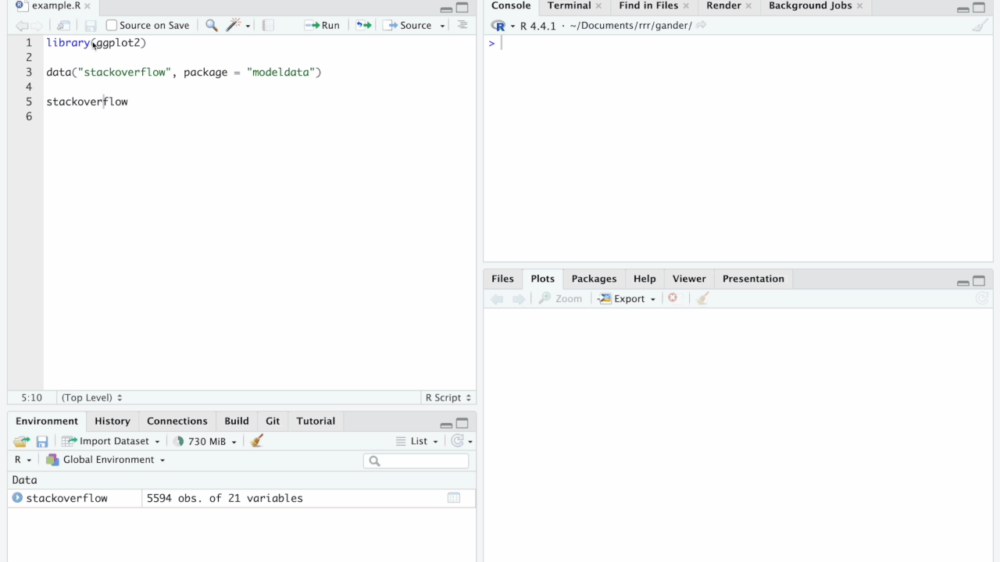

Twice a year, the tidyverse team sets a week aside for "spring cleaning," bringing all of our R packages up to snuff with the most current tooling and standardizing various bits of our development process. Some of these updates can happen by calling a single function, while others are much more involved. One of those more involved updates is updating erroring code, transitioning away from base R (e.g. `stop()`), rlang (e.g. `rlang::abort()`), [glue](https://glue.tidyverse.org/), and homegrown combinations of them. cli's new syntax is easier to work with as a developer and more visually pleasing as a user.

In some cases, transitioning is almost as simple as Finding + Replacing `rlang::abort()` to `cli::cli_abort()`:

```r
# before:
rlang::abort("`save_pred` can only be used if the initial results saved predictions.")

# after: 
cli::cli_abort("{.arg save_pred} can only be used if the initial results saved predictions.")
```

In others, there's a mess of ad-hoc pluralization, `paste0()`s, glue interpolations, and other assorted nonsense to sort through:

```r
# before:
extra_grid_params <- glue::single_quote(extra_grid_params)
extra_grid_params <- glue::glue_collapse(extra_grid_params, sep = ", ")

msg <- glue::glue(
  "The provided `grid` has the following parameter columns that have ",
  "not been marked for tuning by `tune()`: {extra_grid_params}."
)

rlang::abort(msg)

# after:
cli::cli_abort(
  "The provided {.arg grid} has parameter columns that have not been
   marked for tuning by {.fn tune}: {.val {extra_grid_params}}."
)
```

Total pain, especially with thousands upon thousands of error messages thrown across the tidyverse, r-lib, and tidymodels organizations.

The week before our most recent spring cleaning, I participated in an internal Posit LLM hackathon, where a small group of employees would familiarize with interfacing with LLMs via APIs and then set aside a day or two to build something to make their work easier. Heading into our spring cleaning and dreading the task of updating thousands of these calls, I decided to look into how effectively LLMs could help me convert this code. Thus was born [clipal](https://github.com/simonpcouch/clipal)^[Pronounced "c-l-i pal."], a (now-superseded) R package that allows users to select erroring code, press a keyboard shortcut, wait a moment, and watch the updated code be inlined in to the selection.

```{r}
#| label: clipal-gif
#| fig-alt: "A screencast of an RStudio session with an R file open in the source editor. 9 lines of ad-hoc erroring code are selected and, after a brief pause, replace with one call to `cli::cli_abort()`."
#| echo: false

```

clipal was a _huge_ boost for us in the most recent spring cleaning. Depending on the code being updated, these erroring calls used to take 30 seconds to a few minutes. With clipal, though, the model could usually get the updated code 80% or 90% of the way there in a couple seconds. Up to this point, irritated by autocomplete and frustrated by the friction of copying and pasting code and typing out the same bits of context into chats again and again, I had been relatively skeptical that LLMs could make me more productive. After using clipal for a week, though, I began to understand how seamlessly LLMs could automate the cumbersome and uninteresting parts of my work.

clipal itself is now superseded by pal, a more general solution to the problem that clipal solved. I've also written two additional packages like pal that solve two other classes of pal-like problems using similar tools, ensure and gander. In this post, I'll write a bit about how I've used a pair of tools in three experiments that have made me much more productive as an R developer.

## Prerequisites: ellmer and the RStudio API

While clipal is now superseded, the package that supersedes it and its other two descendants makes use of the same two tools: [ellmer](https://github.com/tidyverse/ellmer) and the [RStudio API](https://rstudio.github.io/rstudioapi/).

Last year, Hadley Wickham and Joe Cheng began work on ellmer, a package that aims to make it easy to use large language models in R. For folks that have tried to use LLM APIs through HTTP requests, or interfaced with existing tools that wrap them like langchain, ellmer is pretty incredible. R users can initialize a Chat object using a predictably named function:

```r
library(ellmer)

# to use a model like GPT-4o or GPT-4o-mini from OpenAI:
ch <- chat_openai()

# ...or a locally hosted ollama model:
ch <- chat_ollama()

# ...or Claude's Sonnet model:
ch <- chat_claude()
```

Then calling the output's `$chat()` method returns a character response:

```r
ch$chat("When was R created? Be brief.")
#> R was created in 1993 by Ross Ihaka and Robert Gentleman at 
#> the University of Auckland, New Zealand.
```

There's a whole lot more to ellmer, but this functionality alone was enough to make clipal happen. I could allow users to choose a Chat from whatever provider they prefer to power the addin and ellmer would take care of all of the details underneath the hood.

The other puzzle piece here was how to get that character vector directly into the file so that the user didn't have to copy and paste code from a chat interface into their document. The RStudio IDE supplies an API to interface with various bits of the RStudio UI through R code via the rstudioapi package. Notably, through R code, the package can read what's inside of the user's active selection and also write character vectors into that range. clipal could thus:

* When triggered, read what's inside of the selection using rstudioapi.
* Pass that selection contents to an LLM along with a system prompt describing how to convert R erroring code to use cli using ellmer. (If you're curious, the current draft of that prompt is [here](https://github.com/simonpcouch/pal/blob/1cd81736ee11cfaea1fd2466025dffcbdb845c3c/inst/prompts/cli-replace.md).)
* When the response is returned, replace the contents of the selection with the response using cli.

This approach of using ellmer and the rstudioapi has its ups and downs. As for the advantages:

* Our [Positron IDE](https://positron.posit.co/) has "shims" of the RStudio API, so whatever works in RStudio will also work in Positron. This means that the same shortcuts can be mapped to the same tool in either IDE and it will just work without me, as the developer, having to do anything.^[In reality, there are bugs and differences here and there, but the development effort to get these packages working in Positron was relatively minimal.]
* Since these packages are written in R, they have access to your R environment. This is quite the differentiator compared to the more language-agnostic tools out there—these packages can see the data frames you have loaded, the columns and column types in them, etc. When working with other tools for LLM code-assist that don't have this information, the friction of printing out variable information from my R environment and pasting it into whatever interface is so high that I don't even ask LLMs for help with tasks they're otherwise totally capable of.
* Using ellmer under the hood means that, once R users have set up model connections with ellmer, they can use the same configuration with any of these packages with minimal additional effort. So, clipal and the packages that followed it support whatever model providers their users want to use—OpenAI, Claude, local ollama models, and so on. If you can use it with ellmer, you can use it with these packages.

As for the disadvantages, there are all sorts of UI bummers about this approach. Above all, these packages write directly to your files. This is great in that it removes the need to copy and paste, and when the model's response is spot on, it's awesome. At the same time, if the model starts rambling in an `.R` file or you want to confirm some difference between your previous code and the new code, the fact that these packages just write right into your files can be a bit annoying. Many other inline LLM code-assist tools out there are based on diffs—they show you proposed changes and some UI element that allows you to accept them, reject them, or ask for revisions. This requires one more step between asking for an LLM to do something and the thing actually being done, but saves the pain of lots of undoing or manually retrieving what code used to look like to verify the model's work.

## pal {#sec-pal}


After using clipal during our spring cleaning, I approached another spring cleaning task for the week: updating testing code. testthat 3.0.0 was released in 2020, bringing with it numerous changes that were both huge quality of life improvements for package developers and also highly breaking changes. While some of the task of converting legacy unit testing code to testthat 3e is relatively straightforward, other components can be quite tedious. Could I do the same thing for updating to testthat 3e that I did for transitioning to cli? I sloppily threw together a sister package to clipal that would convert tests for errors to snapshot tests, disentangle nested expectations, and transition from deprecated functions like `⁠expect_known_*()`. ⁠(If you're interested, the current prompt for that functionality is [here](https://github.com/simonpcouch/pal/blob/1cd81736ee11cfaea1fd2466025dffcbdb845c3c/inst/prompts/testthat-replace.md).) That sister package was also a huge boost for me, but the package reused as-is almost every piece of code from clipal other than the prompt. Thus, I realized that the proper solution would provide all of this scaffolding to attach a prompt to a keyboard shortcut, but allow for an arbitrary set of prompts to help automate these wonky, cumbersome tasks.

The next week, [pal](https://simonpcouch.github.io/pal/) was born. The pal package ships with three prompts centered on package development: the cli pal and testthat pal mentioned previously, as well as the roxygen pal, which drafts minimal roxygen documentation based on a function definition. Here's what pal's interface looks like now:

```{r}
#| label: pal-gif
#| fig-alt: "Another RStudio screencast. This time, a 12-line function definition is iteratively revised as the user selects lines of code and selects an entry in a dropdown menu, after which a model streams new code in place. In addition to converting erroring code, the model also drafts roxygen documentation for a function."
#| echo: false
#| out.width: 100%

```

Users can add custom prompts for whatever tasks they please and they'll be included in the searchable dropdown shown above.

I've been super appreciative of all of the love the package has received already, and I'll be sending the package out to CRAN in the coming weeks.

## ensure {#sec-ensure}

While deciding on the initial set of prompts that pal would include, I really wanted to include some sort of "write unit tests for this function" pal. To really address this problem, though, requires violating two of pal's core assumptions:

* _All of the context that you need is in the selection and the prompt._ In the case of writing unit tests, it's actually pretty important to have other pieces of context. If a package provides some object type `potato`, in order to write tests for some function that takes `potato` as input, it's likely very important to know how potatoes are created and the kinds of properties they have. pal's sister package for writing unit tests, ensure, can thus "see" the rest of the file that you're working on, as well as context from neighboring files like other `.R` source files, the corresponding test file, and package vignettes, to learn about how to interface with the function arguments being tested.
* _The LLM's response can prefix, replace, or suffix the active selection in the same file._ In the case of writing unit tests for R, the place that tests actually ought to go is in a corresponding test file in `tests/testthat/`. Via the RStudio API, ensure can open up the corresponding test file and write to it rather than the source file where it was triggered from.^[This is one gap between the RStudio API and Positron's shims for it. The Positron shims currently don't allow for toggling between files, so ensure isn't available in Positron.]

```{r}
#| label: ensure-gif
#| fig-alt: "Another RStudio screencast. This time, the user selects around 20 lines of code situated in an R package and, after pressing a key command, the addin opens a corresponding test file and begins streaming unit testing code into the file. After the model completes streaming, the user runs the testing code and all tests pass."
#| echo: false
#| out.width: 100%

```

So far, I haven't spent as much time with ensure as I have with pal or gander, but I'll be revisiting the package and sending it off to CRAN in the coming weeks.

## gander {#sec-gander}

<a href="https://simonpcouch.github.io/gander/"></a>

pal really excels at things you do all the time. Providing custom prompts with lots of details about code syntax and your taste means that models will often provide code that's almost exactly what you'd write yourself. On its own, though, pal is incomplete as a toolkit for LLM code-assist. What about one-off requests that are specific to the environment that I'm working in or things I only do every once in a long while? It's nice to have a much more general tool that functions much more like a chat interface.

At the same time, working with usual chat interfaces is quite high-friction, so much so that you'll likely spend more time pasting in context from your files and R environmet than you would if you had just written the code yourself. There are all sorts of language-agnostic interfaces (or language-specific but not for R or RStudio) tools out there implementing this. You type some request with your cursor near some code, and then, in the backend, the tool assembles a bunch of context that will help the model respond more effectively. This is super helpful for many software engineering contexts, where most all of the context you need can be found in the contents of files. Data science differs a bit from software engineering here, though, in that the state of your R environment is just as important (or more so) than the contents of your files. For example, the lines of your files may show that you reference some data frame called `stackoverflow`, but what will _really_ help a model write R code to interface with that data frame is "seeing" it: what columns are in it, and what are their types and distributions? gander is a chat interface that allows models to see the data you're working with.

```{r}
#| label: gander-gif
#| fig-alt: "Another RStudio screencast. A script called example.R is open in the editor with lines library(ggplot2), data(stackoverflow), and stackoverflow. After highlighting the last line, the user triggers the addin and ask to plot the data in plain language, at which point code to plot the data using ggplot2 is streamed into the source file that uses the correct column names and a minimal style. The user iteratively calls the addin to refine the output."
#| echo: false
#| out.width: 100%

```

Behind the scenes, gander combines your selection (or lack thereof), inputted request, file type and contents, and R environment to dynamically assemble prompts to best enable models to tailor their responses to your R session. I use gander several times every day to turn 45-second tasks into 5-second ones and have been super stoked with how well-received it's been among R folks so far. Compared to pal and ensure, this package feels like a much more substantial lift for data scientists specifically (rather than package developers). In the coming weeks, I'll sand down some of its rough edges and send it off to CRAN.

## What's next? {#sec-whats-next}

For now, all of these packages only live on my GitHub profile. In the coming weeks, I plan to revisit each of them, squash a bunch of bugs, and send them off to CRAN.

That said, these packages are very much experimental. The user interface of writing directly to users' files very much limits how useful these tools can be, and I think that the kinds of improvements to interface I'm hoping for may only be possible via some backend other than the RStudio API. I'm looking forward to seeing what that could look like.
