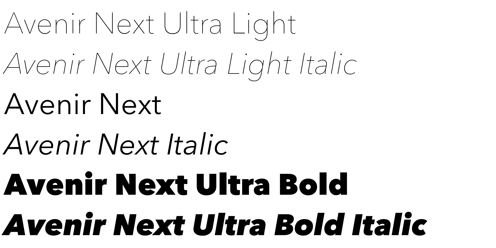
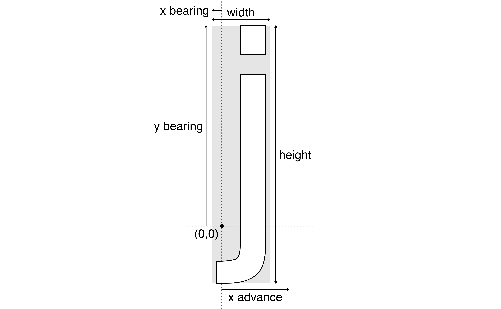
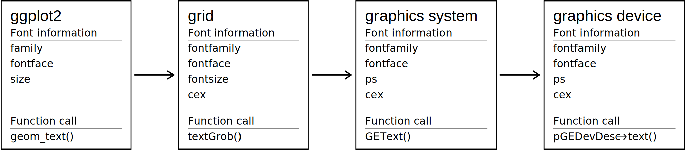
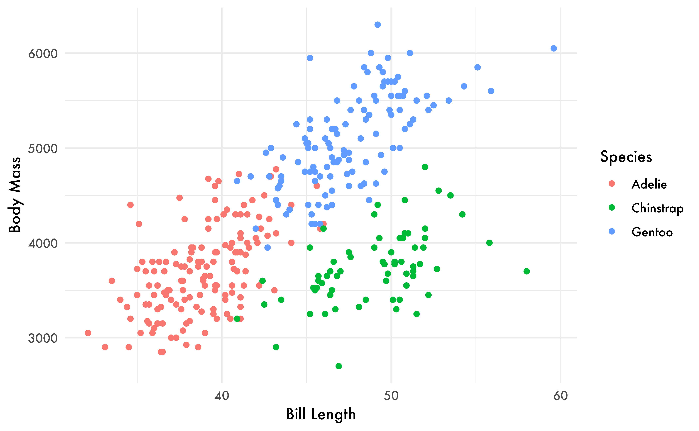

<style type='text/css'>
pre {
  text-wrap: nowrap;
  overflow-x: scroll;
}
figure {
  margin-top: 2em;
}
figcaption {
  text-align: center;
  margin-top: 1em;
}
table {
  max-width: 99%
}
</style>
<!--
TODO:
* [x] Look over / edit the post's title in the yaml
* [x] Edit (or delete) the description; note this appears in the Twitter card
* [x] Pick category and tags (see existing with [`hugodown::tidy_show_meta()`](https://rdrr.io/pkg/hugodown/man/use_tidy_post.html))
* [x] Find photo & update yaml metadata
* [x] Create `thumbnail-sq.jpg`; height and width should be equal
* [x] Create `thumbnail-wd.jpg`; width should be >5x height
* [x] [`hugodown::use_tidy_thumbnails()`](https://rdrr.io/pkg/hugodown/man/use_tidy_post.html)
* [x] Add intro sentence, e.g. the standard tagline for the package
* [x] [`usethis::use_tidy_thanks()`](https://usethis.r-lib.org/reference/use_tidy_thanks.html)
-->

(An updated version of this blog post will be available at [the systemfonts webpage](https://systemfonts.r-lib.org))

The purpose of this document is to give you the a thorough overview of fonts as it relates to their use in R. However, for this to be possible, it is first necessary to get an understanding of fonts and how they work in digital publishing in general. If you have a thorough understanding of digital typography you may skip to [the next section](#font-handling-in-r).

## Digital typography

Many books can be, and have been, written about the subject of typography. This is not meant to be an exhaustive deep dive into all areas of this vast subject. Rather, it is meant to give you just enough understanding of core concepts and terminology to appreciate how it all plays into using fonts in R.

### Typeface or font?

There is a good chance that you, like 99% of world, use *"font"* as the term describing "the look" of the letters you type. You may, perhaps, have heard the term *"typeface"* as well and thought it synonymous. This is in fact slightly wrong, and a great deal of typography snobbery has been dealt out on that account. It is a rather inconsequential mix-up for the most part, especially because 99% of the population wouldn't bat an eye if you use them interchangeably. However, the distinction between the two serves as a good starting point to talk about other terms in digital typography as well as the nature of font files, so let's dive in.

When most people use the word "font" or "font family", what they are actually describing is a typeface. A **typeface** is a style of lettering that forms a cohesive whole. As an example, consider the well-known "Helvetica" typeface. This name embraces many different weights (bold, normal, light) as well as slanted (italic) and upright. However, all of these variations are all as much Helvetica as the others - they are all part of the same typeface.

If a typeface is font, then what is a font? A **font** is a subset of a typeface, describing a particular variation of the typeface, i.e. the combination of typeface, weight, width, and slant that comes together to describe the specific subset of a typeface that is used. We typically give a specific combination of a name, like "bold" or "medium" or "italic", which we call the **font style**. In other words, the typeface plus a font style gives you a font. Be aware that the style name is at the discretion of the developer of the typeface. It is very common to see discrepancies between the style name and e.g. the weight reported by the font (e.g. Avenir Next Ultra Light is in reality a *thin* weight font).

<div class="highlight">

<div class="figure" style="text-align: center">


<p class="caption">
Different fonts from the Avenir Next typeface
</p>

</div>

</div>

In the rest of this document we will use the terms typeface and font with the meaning described above.

### Font files

Next, we need to talk about how typefaces are represented for use by computers. Font files record information on how to draw the individual glyphs (characters), but also instructions about how to draw sequences of glyphs like distance adjustments (kerning) and substitution rules (ligatures). Font files typically encode a single font but can encode a full typeface:

<div class="highlight">

<pre class='chroma'><code class='language-r' data-lang='r'><span><span class='nv'>typefaces</span> <span class='o'>&lt;-</span> <span class='nf'>systemfonts</span><span class='nf'>::</span><span class='nf'><a href='https://systemfonts.r-lib.org/reference/system_fonts.html'>system_fonts</a></span><span class='o'>(</span><span class='o'>)</span></span>
<span></span>
<span><span class='c'># Full typeface in one file</span></span>
<span><span class='nv'>typefaces</span><span class='o'>[</span><span class='nv'>typefaces</span><span class='o'>$</span><span class='nv'>family</span> <span class='o'>==</span> <span class='s'>"Helvetica"</span>, <span class='nf'><a href='https://rdrr.io/r/base/c.html'>c</a></span><span class='o'>(</span><span class='s'>"path"</span>, <span class='s'>"index"</span>, <span class='s'>"family"</span>, <span class='s'>"style"</span><span class='o'>)</span><span class='o'>]</span></span>
<span><span class='c'>#&gt; <span style='color: #555555;'># A tibble: 6 × 4</span></span></span>
<span><span class='c'>#&gt;   path                                index family    style        </span></span>
<span><span class='c'>#&gt;   <span style='color: #555555; font-style: italic;'>&lt;chr&gt;</span>                               <span style='color: #555555; font-style: italic;'>&lt;int&gt;</span> <span style='color: #555555; font-style: italic;'>&lt;chr&gt;</span>     <span style='color: #555555; font-style: italic;'>&lt;chr&gt;</span>        </span></span>
<span><span class='c'>#&gt; <span style='color: #555555;'>1</span> /System/Library/Fonts/Helvetica.ttc     2 Helvetica Oblique      </span></span>
<span><span class='c'>#&gt; <span style='color: #555555;'>2</span> /System/Library/Fonts/Helvetica.ttc     4 Helvetica Light        </span></span>
<span><span class='c'>#&gt; <span style='color: #555555;'>3</span> /System/Library/Fonts/Helvetica.ttc     5 Helvetica Light Oblique</span></span>
<span><span class='c'>#&gt; <span style='color: #555555;'>4</span> /System/Library/Fonts/Helvetica.ttc     1 Helvetica Bold         </span></span>
<span><span class='c'>#&gt; <span style='color: #555555;'>5</span> /System/Library/Fonts/Helvetica.ttc     3 Helvetica Bold Oblique </span></span>
<span><span class='c'>#&gt; <span style='color: #555555;'>6</span> /System/Library/Fonts/Helvetica.ttc     0 Helvetica Regular</span></span>
<span></span><span></span>
<span><span class='c'># One font per font file</span></span>
<span><span class='nv'>typefaces</span><span class='o'>[</span><span class='nv'>typefaces</span><span class='o'>$</span><span class='nv'>family</span> <span class='o'>==</span> <span class='s'>"Arial"</span>, <span class='nf'><a href='https://rdrr.io/r/base/c.html'>c</a></span><span class='o'>(</span><span class='s'>"path"</span>, <span class='s'>"index"</span>, <span class='s'>"family"</span>, <span class='s'>"style"</span><span class='o'>)</span><span class='o'>]</span></span>
<span><span class='c'>#&gt; <span style='color: #555555;'># A tibble: 4 × 4</span></span></span>
<span><span class='c'>#&gt;   path                                                     index family style      </span></span>
<span><span class='c'>#&gt;   <span style='color: #555555; font-style: italic;'>&lt;chr&gt;</span>                                                    <span style='color: #555555; font-style: italic;'>&lt;int&gt;</span> <span style='color: #555555; font-style: italic;'>&lt;chr&gt;</span>  <span style='color: #555555; font-style: italic;'>&lt;chr&gt;</span>      </span></span>
<span><span class='c'>#&gt; <span style='color: #555555;'>1</span> /System/Library/Fonts/Supplemental/Arial.ttf                 0 Arial  Regular    </span></span>
<span><span class='c'>#&gt; <span style='color: #555555;'>2</span> /System/Library/Fonts/Supplemental/Arial Bold.ttf            0 Arial  Bold       </span></span>
<span><span class='c'>#&gt; <span style='color: #555555;'>3</span> /System/Library/Fonts/Supplemental/Arial Bold Italic.ttf     0 Arial  Bold Italic</span></span>
<span><span class='c'>#&gt; <span style='color: #555555;'>4</span> /System/Library/Fonts/Supplemental/Arial Italic.ttf          0 Arial  Italic</span></span>
<span></span></code></pre>

</div>

Here, **family** gives the name of the typeface, and **style** the name of the font within that typeface.

It took a considerable number of tries before the world managed to nail the digitial representation of fonts, leading to a proliferation of file types. As an R user, there are three formats that are particularly improtant:

-   **TrueType** (ttf/ttc). Truetype is the baseline format that all modern formats stand on top of. It was developed by Apple in the '80s and became popular due to its great balance between size and quality. Fonts can be encoded, either as scalable paths, or as bitmaps of various sizes, the former generally being preferred as it allows for seamless scaling and small file size at the same time.

-   \*\* OpenType\*\* (otf/otc). OpenType was created by Microsoft and Adobe to improve upon TrueType. While TrueType was a great success, it the number of glyphs it could contain was limited and as was its support for selecting different features during [shaping](#text-shaping). OpenType resolved these issues, so if you want access to advanced typography features you'll need a font in OpenType format.

-   \*\* Web Open Font Format\*\* (woff/woff2). TrueType and OpenType tend to create large files. Since a large percentage of the text consumed today is delivered over the internet this creates a problem. WOFF resolves this problem by acting as a compression wrapper around TrueType/OpenType to reduce file sizes while also limiting the number of advanced features provided to those relevant to web fonts. The woff2 format is basically identical to woff except it uses the more efficient [brotli](https://en.wikipedia.org/wiki/Brotli) compression algorithm. WOFF was designed specifically to be delivered over the internet and support is still a bit limited outside of browsers.

While we have mainly talked about font files as containers for the shape of glyphs, they also carries a lot of other information needed for rendering text in a way pleasant for reading. Font level information recordsd a lot of stylistic information about typeface/font, statistics on the number of glyphs and how many different mappings between character encodings and glyphs it contains, and overall sizing information such as the maximum descend of the font, the position of an underline relative to the baseline etc. systemfonts provdies a convenient way to access this data from R:

<div class="highlight">

<pre class='chroma'><code class='language-r' data-lang='r'><span><span class='nf'>dplyr</span><span class='nf'>::</span><span class='nf'><a href='https://pillar.r-lib.org/reference/glimpse.html'>glimpse</a></span><span class='o'>(</span><span class='nf'>systemfonts</span><span class='nf'>::</span><span class='nf'><a href='https://systemfonts.r-lib.org/reference/font_info.html'>font_info</a></span><span class='o'>(</span>family <span class='o'>=</span> <span class='s'>"Helvetica"</span><span class='o'>)</span><span class='o'>)</span></span>
<span><span class='c'>#&gt; Rows: 1</span></span>
<span><span class='c'>#&gt; Columns: 24</span></span>
<span><span class='c'>#&gt; $ path               <span style='color: #555555; font-style: italic;'>&lt;chr&gt;</span> "/System/Library/Fonts/Helvetica.ttc"</span></span>
<span><span class='c'>#&gt; $ index              <span style='color: #555555; font-style: italic;'>&lt;int&gt;</span> 0</span></span>
<span><span class='c'>#&gt; $ family             <span style='color: #555555; font-style: italic;'>&lt;chr&gt;</span> "Helvetica"</span></span>
<span><span class='c'>#&gt; $ style              <span style='color: #555555; font-style: italic;'>&lt;chr&gt;</span> "Regular"</span></span>
<span><span class='c'>#&gt; $ italic             <span style='color: #555555; font-style: italic;'>&lt;lgl&gt;</span> FALSE</span></span>
<span><span class='c'>#&gt; $ bold               <span style='color: #555555; font-style: italic;'>&lt;lgl&gt;</span> FALSE</span></span>
<span><span class='c'>#&gt; $ monospace          <span style='color: #555555; font-style: italic;'>&lt;lgl&gt;</span> FALSE</span></span>
<span><span class='c'>#&gt; $ weight             <span style='color: #555555; font-style: italic;'>&lt;ord&gt;</span> normal</span></span>
<span><span class='c'>#&gt; $ width              <span style='color: #555555; font-style: italic;'>&lt;ord&gt;</span> normal</span></span>
<span><span class='c'>#&gt; $ kerning            <span style='color: #555555; font-style: italic;'>&lt;lgl&gt;</span> FALSE</span></span>
<span><span class='c'>#&gt; $ color              <span style='color: #555555; font-style: italic;'>&lt;lgl&gt;</span> FALSE</span></span>
<span><span class='c'>#&gt; $ scalable           <span style='color: #555555; font-style: italic;'>&lt;lgl&gt;</span> TRUE</span></span>
<span><span class='c'>#&gt; $ vertical           <span style='color: #555555; font-style: italic;'>&lt;lgl&gt;</span> FALSE</span></span>
<span><span class='c'>#&gt; $ n_glyphs           <span style='color: #555555; font-style: italic;'>&lt;int&gt;</span> 2252</span></span>
<span><span class='c'>#&gt; $ n_sizes            <span style='color: #555555; font-style: italic;'>&lt;int&gt;</span> 0</span></span>
<span><span class='c'>#&gt; $ n_charmaps         <span style='color: #555555; font-style: italic;'>&lt;int&gt;</span> 10</span></span>
<span><span class='c'>#&gt; $ bbox               <span style='color: #555555; font-style: italic;'>&lt;list&gt;</span> &lt;-11.406250, 17.343750, -5.765625, 13.453125&gt;</span></span>
<span><span class='c'>#&gt; $ max_ascend         <span style='color: #555555; font-style: italic;'>&lt;dbl&gt;</span> 9.234375</span></span>
<span><span class='c'>#&gt; $ max_descend        <span style='color: #555555; font-style: italic;'>&lt;dbl&gt;</span> -2.765625</span></span>
<span><span class='c'>#&gt; $ max_advance_width  <span style='color: #555555; font-style: italic;'>&lt;dbl&gt;</span> 18</span></span>
<span><span class='c'>#&gt; $ max_advance_height <span style='color: #555555; font-style: italic;'>&lt;dbl&gt;</span> 12</span></span>
<span><span class='c'>#&gt; $ lineheight         <span style='color: #555555; font-style: italic;'>&lt;dbl&gt;</span> 12</span></span>
<span><span class='c'>#&gt; $ underline_pos      <span style='color: #555555; font-style: italic;'>&lt;dbl&gt;</span> -1.203125</span></span>
<span><span class='c'>#&gt; $ underline_size     <span style='color: #555555; font-style: italic;'>&lt;dbl&gt;</span> 0.59375</span></span>
<span></span></code></pre>

</div>

As well as a bunch of information about individual glyphs, Further, for each glyph there is a range of information in addition to its shape:

<div class="highlight">

<pre class='chroma'><code class='language-r' data-lang='r'><span><span class='nf'>systemfonts</span><span class='nf'>::</span><span class='nf'><a href='https://systemfonts.r-lib.org/reference/glyph_info.html'>glyph_info</a></span><span class='o'>(</span><span class='s'>"j"</span>, family <span class='o'>=</span> <span class='s'>"Helvetica"</span>, size <span class='o'>=</span> <span class='m'>30</span><span class='o'>)</span></span>
<span><span class='c'>#&gt; <span style='color: #555555;'># A tibble: 1 × 9</span></span></span>
<span><span class='c'>#&gt;   glyph index width height x_bearing y_bearing x_advance y_advance bbox     </span></span>
<span><span class='c'>#&gt;   <span style='color: #555555; font-style: italic;'>&lt;chr&gt;</span> <span style='color: #555555; font-style: italic;'>&lt;int&gt;</span> <span style='color: #555555; font-style: italic;'>&lt;dbl&gt;</span>  <span style='color: #555555; font-style: italic;'>&lt;dbl&gt;</span>     <span style='color: #555555; font-style: italic;'>&lt;dbl&gt;</span>     <span style='color: #555555; font-style: italic;'>&lt;dbl&gt;</span>     <span style='color: #555555; font-style: italic;'>&lt;dbl&gt;</span>     <span style='color: #555555; font-style: italic;'>&lt;dbl&gt;</span> <span style='color: #555555; font-style: italic;'>&lt;list&gt;</span>   </span></span>
<span><span class='c'>#&gt; <span style='color: #555555;'>1</span> j        77     6     27        -<span style='color: #BB0000;'>1</span>        21         7         0 <span style='color: #555555;'>&lt;dbl [4]&gt;</span></span></span>
<span></span></code></pre>

</div>

These terms are more easily understood with a diagram:

<div class="highlight">



</div>

The `x_advance` in particular is important when rendering text because it tells you how far to move to the right before rendering the next glyph (ignoring for a bit the concept of kerning)

### Text shaping

The next important concept to understand is **text shaping**, which, in the simplest of terms, is to convert a succession of characters into sequence of glyphs along with their locations. Important here is the distinction between **characters**, the things you think of as letters, and **glyphs**, which is what the font will draw. For example, think of the character "f", which is often tricky to draw because the "hook" of the f can interfere with other characters. To solve this problem, many typefaces include **ligatures**, like "fi", which are used for specific pairs of characaters. Ligatures are extremely important for languages like Arabic.

Just a few of the challenges of text shaping include kerning, bidirectional text, and font substitution. **Kerning**, which controls the distance between specific pairs of characters. For example, you can put "VM" a little closer together but "OO" needs to be a little further apart. Kerning is an integral part of all modern text rendering and you will almost solemnly notice it when it is absent (or worse, [wrongly applied](https://www.fastcompany.com/91324550/kerning-on-pope-francis-tomb-is-a-travesty)).

Not every language writes text in the same direction, but regardless of your native script, you are likely to use arabic numerals which are always written left-to-right. This gives rise to the challenge of **bidirectional** (or bidi) text, which mixes text flowing in different directions. This imposes a whole new range of challenges!

Finally, you might request a character that a font doesn't contain. One way to deal with this is to render a glyph representing a missing glyph, usually an empty box or a question mark. But it's typically more useful to use the correct glyph from a different font. This is called **font fallback** and happens all the time for emojis, but can also happen when you suddenly change script without bothering to pick a new font. Font fallback is an imprecise science, typically relying on an operating system font that has a very large number of characters, but might look very different from your existing font.

Once you have determined the order and location of glyphs, you are still not done. Text often needs to be wrapped to fit into a specific width, it may need a specific justification, perhaps, indentation or tracking must be applied, etc. Thankfully, all of this is generally a matter of (often gnarly) math that you just have to get right. That is, all except text wrapping which should happen at the right boundaries, and may need to break up a word and inserting a hyphen etc.

Like I said, the pit of despair is bottomless...

## Font handling in R

You hopefully arrive at this section with an appreciation of the horrors that goes into rendering text. If not, maybe this [blog post](https://faultlore.com/blah/text-hates-you/) will convince you.

Are you still here? Good.

Now that you understand the basics of what goes into handling fonts and text, we can now discuss the details of fonts in R specifically.

### Fonts and text from a user perspective

The users perception of working with fonts in R is largely shaped by plots. This means using either base or grid graphics or one of the packages that have been build on top of it, like [ggplot2](https://ggplot2.tidyverse.org). While the choice of tool will affect *where* you specify the font to use, they generally agree on how to specify it.

<table style="width:99%;">
<colgroup>
<col style="width: 37%" />
<col style="width: 5%" />
<col style="width: 18%" />
<col style="width: 37%" />
</colgroup>
<thead>
<tr>
<th>Graphic system</th>
<th>Argument</th>
<th></th>
<th></th>
</tr>
</thead>
<tbody>
<tr>
<td></td>
<td><em>Typeface</em></td>
<td><em>Font</em></td>
<td><em>Size</em></td>
</tr>
<tr>
<td><p><strong>Base</strong></p>
<p><em>Arguments are passed to <code>par()</code> to set globally or directly to the call that renders text (e.g. <code>text()</code>)</em></p></td>
<td><code>family</code></td>
<td><code>font</code></td>
<td><code>cra</code> (pixels) or <code>cin</code> (inches) multiplied by <code>cex</code></td>
</tr>
<tr>
<td><p><strong>Grid</strong></p>
<p>Arguments are passed to the <code>gp</code> argument of relevant grobs using the <code>gpar()</code> constructor</p></td>
<td><code>fontfamily</code></td>
<td><code>fontface</code></td>
<td><code>fontsize</code> (points) multiplied by <code>cex</code></td>
</tr>
<tr>
<td><p><strong>ggplot2</strong></p>
<p>Arguments are set in <code>element_text()</code> to alter theme fonts or directly in the geom call to alter geom fonts</p></td>
<td><code>family</code></td>
<td><code>face</code> (in <code>element_text()</code>) or <code>fontface</code> (in geoms)</td>
<td><code>size</code> (points when used in <code>element_text()</code>, depends on the value of <code>size.unit</code> argument when used in geom)</td>
</tr>
</tbody>
</table>

From the table it is clear that in R *fontfamily*/*family* is used to describe the typeface, *font*/*fontface*/*face* is used to select a font from the typeface based on a limited number of styles. Size settings is just a plain mess.

The major limitation in the *fontface* (and friends) setting is that it takes a number, not a string, and you can only select from four options: `1`: plain, `2`: bold, `3`: italic, and `4`: bold-italic. This means, for example, that there's no way to select Futura Condensed Extra Bold. Another limitation is that it's not possible to specify any font variations such as using tabular numbers or stylistic ligatures.

### Fonts and text from a graphics device perspective

In R, a graphics device is the part responsible for doing the rendering you request and put it on your screen or in a file. When you call [`png()`](https://rdrr.io/r/grDevices/png.html) or [`ragg::agg_png()`](https://ragg.r-lib.org/reference/agg_png.html) you open up a graphics device that will receive all the plotting instructions from R. Both graphics devices will ultimately produce the same file type (PNG), but how they choose to handle and respond to the plotting instructions may differ (greatly). Nowhere is this difference more true than when it comes to text rendering.

After a user has made a call that renders some text, it is funneled through the graphic system (base or grid), handed off to the graphics engine, which ultimately asks the graphics device to render the text. From the perspective of the graphics device it is much the same information that the user provided which are presented to it. The [`text()`](https://rdrr.io/r/graphics/text.html) method of the device are given an array of characters, the typeface, the size in points, and an integer denoting if the style is regular, bold, italic, or bold-italic.

<figure>

<figcaption aria-hidden="true">Flow of font information through the R rendering stack</figcaption>
</figure>

This means that it is up to the graphics device to find the approprate font file (using the provided typeface and font style) and shape the text with all that that entails. This is a lot of work, which is why text is handled so inconsistently between graphics devices. Issues can range from not being able to find fonts installed on the computer, to not providing font fallback mechanisms, or even handling right-to-left text. It may also be that certain font file formats are not well supported so that e.g. color emojis are not rendered correctly.

There have been a number of efforts to resolve these problems over the years:

-   **extrafont**: Developed by Winston Chang, [extrafont](https://github.com/wch/extrafont) sought to mainly improve the situation for the [`pdf()`](https://rdrr.io/r/grDevices/pdf.html) device which generally only had access to the postscript fonts that comes with R. The package allows the [`pdf()`](https://rdrr.io/r/grDevices/pdf.html) device to get access to TrueType fonts installed on the computer, as well as provide means for embedding the font into the PDF so that it can be opened on systems where the font is not installed. (It also provides the capabilities to to the Windows [`png()`](https://rdrr.io/r/grDevices/png.html) device).

-   **sysfonts** and **showtext**. These packages are developed by Yixuan Qiu and provide support for system fonts to all graphics devices, by hijacking the [`text()`](https://rdrr.io/r/graphics/text.html) method of the graphics device to text text as polygons or raster images. This guarantees your plots will look the same on every device, but it doesn't do advanced text shaping, so there's no support for ligatures or font substituion. Additionally, it produces large files with inaccessible text when used to produce pdf and svg outputs.

-   **systemfonts** and **textshaping**. These packages are developed by me to provide a soup-to-nuts solution to text rendering for graphics devices. [systemfonts](https://systemfonts.r-lib.org) provides access to fonts installed on the system along with font fallback mechanisms, registration of non-system fonts, reading of font files etc. [textshaping](https://github.com/r-lib/textshaping) builds on top of systemfonts and provides a fully modern engine for shaping text. The functionality is exposed both at the R level and at the C level, so that graphics devices can directly access to font lookup and shaping.

We will fosus on systemfonts, because it's designed to give R a fully modern text rendering stack. That unfortunately is impossible to do without coordination with the graphics device, which means that to use all these features you need a supported graphics device. There are currently two options:

-   The [ragg](https://ragg.r-lib.org) package provides graphics devices for rendering raster graphics in a variety of formats (PNG, JPEG, TIFF) and uses systemfonts and textshaping extensively.
-   The [svglite](https://svglite.r-lib.org) package likewise provides a graphic device for rendering vector graphics to SVG using systemfonts and textshaping for text.

You might notice there's currently a big hole in this workflow: PDFs. This is something we plan to work on in the future.

## A systemfonts based workflow

With all that said, how do you actually use systemfonts to use custom fonts in your plots? First, you'll need to use ragg or svglite.

### Using ragg

While there is no way to unilaterally make [`ragg::agg_png()`](https://ragg.r-lib.org/reference/agg_png.html) everywhere, it's possible to get close:

-   Positron: recent versions automatically use ragg for the plot pane if it's installed.

-   RStudio IDE: set "AGG" as the backend under Global Options \> General \> Graphics.

-   [`ggplot2::ggsave()`](https://ggplot2.tidyverse.org/reference/ggsave.html): ragg will be automatically used for raster output if installed.

-   R Markdown and Quarto: you need to set the `dev` option to `"ragg_png"`. You can either do this with code:

    ``` r
    #| include: false
    knitr::opts_chunk$set(dev = "ragg_png")
    ```

    Or in Quarto, you can set it in the yaml metadata:

    ``` yaml
    ---
    title: "My Document"
    format: html
    knitr:
      opts_chunk:
        dev: "ragg_png"
    ---
    ```

If you want to use a font installed on your computer, you're done!

<div class="highlight">

<pre class='chroma'><code class='language-r' data-lang='r'><span><span class='nf'>grid</span><span class='nf'>::</span><span class='nf'><a href='https://rdrr.io/r/grid/grid.text.html'>grid.text</a></span><span class='o'>(</span></span>
<span>  <span class='s'>"FUTURA 🎉"</span>,</span>
<span>  gp <span class='o'>=</span> <span class='nf'>grid</span><span class='nf'>::</span><span class='nf'><a href='https://rdrr.io/r/grid/gpar.html'>gpar</a></span><span class='o'>(</span>fontfamily <span class='o'>=</span> <span class='s'>"Futura"</span>, fontface <span class='o'>=</span> <span class='m'>3</span>, fontsize <span class='o'>=</span> <span class='m'>30</span><span class='o'>)</span></span>
<span><span class='o'>)</span></span>
</code></pre>


</div>

Or, if using ggplot2

<div class="highlight">

<pre class='chroma'><code class='language-r' data-lang='r'><span><span class='nf'><a href='https://ggplot2.tidyverse.org/reference/ggplot.html'>ggplot</a></span><span class='o'>(</span><span class='nf'><a href='https://rdrr.io/r/stats/na.fail.html'>na.omit</a></span><span class='o'>(</span><span class='nv'>penguins</span><span class='o'>)</span><span class='o'>)</span> <span class='o'>+</span></span>
<span>  <span class='nf'><a href='https://ggplot2.tidyverse.org/reference/geom_point.html'>geom_point</a></span><span class='o'>(</span><span class='nf'><a href='https://ggplot2.tidyverse.org/reference/aes.html'>aes</a></span><span class='o'>(</span>x <span class='o'>=</span> <span class='nv'>bill_len</span>, y <span class='o'>=</span> <span class='nv'>body_mass</span>, colour <span class='o'>=</span> <span class='nv'>species</span><span class='o'>)</span><span class='o'>)</span> <span class='o'>+</span></span>
<span>  <span class='nf'><a href='https://ggplot2.tidyverse.org/reference/labs.html'>labs</a></span><span class='o'>(</span>x <span class='o'>=</span> <span class='s'>"Bill Length"</span>, y <span class='o'>=</span> <span class='s'>"Body Mass"</span>, colour <span class='o'>=</span> <span class='s'>"Species"</span><span class='o'>)</span> <span class='o'>+</span></span>
<span>  <span class='nf'><a href='https://ggplot2.tidyverse.org/reference/ggtheme.html'>theme_minimal</a></span><span class='o'>(</span>base_family <span class='o'>=</span> <span class='s'>"Futura"</span><span class='o'>)</span></span>
</code></pre>


</div>

If the results don't look as you expect, you can use various systemfonts helpers to diagnose the problem:

<div class="highlight">

<pre class='chroma'><code class='language-r' data-lang='r'><span><span class='nf'>systemfonts</span><span class='nf'>::</span><span class='nf'><a href='https://systemfonts.r-lib.org/reference/match_fonts.html'>match_fonts</a></span><span class='o'>(</span><span class='s'>"Futura"</span>, weight <span class='o'>=</span> <span class='s'>"bold"</span><span class='o'>)</span></span>
<span><span class='c'>#&gt; <span style='color: #555555;'># A tibble: 1 × 3</span></span></span>
<span><span class='c'>#&gt;   path                                          index features  </span></span>
<span><span class='c'>#&gt;   <span style='color: #555555; font-style: italic;'>&lt;chr&gt;</span>                                         <span style='color: #555555; font-style: italic;'>&lt;int&gt;</span> <span style='color: #555555; font-style: italic;'>&lt;list&gt;</span>    </span></span>
<span><span class='c'>#&gt; <span style='color: #555555;'>1</span> /System/Library/Fonts/Supplemental/Futura.ttc     2 <span style='color: #555555;'>&lt;font_ftr&gt;</span></span></span>
<span></span><span><span class='nf'>systemfonts</span><span class='nf'>::</span><span class='nf'><a href='https://systemfonts.r-lib.org/reference/font_fallback.html'>font_fallback</a></span><span class='o'>(</span><span class='s'>"🎉"</span>, family <span class='o'>=</span> <span class='s'>"Futura"</span>, weight <span class='o'>=</span> <span class='s'>"bold"</span><span class='o'>)</span></span>
<span><span class='c'>#&gt;                                          path index</span></span>
<span><span class='c'>#&gt; 1 /System/Library/Fonts/Apple Color Emoji.ttc     0</span></span>
<span></span></code></pre>

</div>

If you want to see all the fonts that are available for use, you can use [`systemfonts::system_fonts()`](https://systemfonts.r-lib.org/reference/system_fonts.html)

<div class="highlight">

<pre class='chroma'><code class='language-r' data-lang='r'><span><span class='nf'>systemfonts</span><span class='nf'>::</span><span class='nf'><a href='https://systemfonts.r-lib.org/reference/system_fonts.html'>system_fonts</a></span><span class='o'>(</span><span class='o'>)</span></span></code></pre>

</div>

<div class="highlight">

<pre class='chroma'><code class='language-r' data-lang='r'><span><span class='c'>#&gt; <span style='color: #555555;'># A tibble: 571 × 9</span></span></span>
<span><span class='c'>#&gt;    path                                                                            index name  family style weight width italic monospace</span></span>
<span><span class='c'>#&gt;    <span style='color: #555555; font-style: italic;'>&lt;chr&gt;</span>                                                                           <span style='color: #555555; font-style: italic;'>&lt;int&gt;</span> <span style='color: #555555; font-style: italic;'>&lt;chr&gt;</span> <span style='color: #555555; font-style: italic;'>&lt;chr&gt;</span>  <span style='color: #555555; font-style: italic;'>&lt;chr&gt;</span> <span style='color: #555555; font-style: italic;'>&lt;ord&gt;</span>  <span style='color: #555555; font-style: italic;'>&lt;ord&gt;</span> <span style='color: #555555; font-style: italic;'>&lt;lgl&gt;</span>  <span style='color: #555555; font-style: italic;'>&lt;lgl&gt;</span>    </span></span>
<span><span class='c'>#&gt; <span style='color: #555555;'> 1</span> /private/var/folders/l4/tvfrd0ps4dqdr2z7kvnl9xh40000gn/T/RtmpdjhErA/Rubik Dist…     0 Rubi… Rubik… Regu… normal norm… FALSE  FALSE    </span></span>
<span><span class='c'>#&gt; <span style='color: #555555;'> 2</span> /System/Library/Fonts/Supplemental/Rockwell.ttc                                     2 Rock… Rockw… Bold  bold   norm… FALSE  FALSE    </span></span>
<span><span class='c'>#&gt; <span style='color: #555555;'> 3</span> /System/Library/Fonts/Noteworthy.ttc                                                0 Note… Notew… Light normal norm… FALSE  FALSE    </span></span>
<span><span class='c'>#&gt; <span style='color: #555555;'> 4</span> /System/Library/Fonts/Supplemental/DevanagariMT.ttc                                 1 Deva… Devan… Bold  bold   norm… FALSE  FALSE    </span></span>
<span><span class='c'>#&gt; <span style='color: #555555;'> 5</span> /System/Library/Fonts/Supplemental/Kannada Sangam MN.ttc                            0 Kann… Kanna… Regu… normal norm… FALSE  FALSE    </span></span>
<span><span class='c'>#&gt; <span style='color: #555555;'> 6</span> /System/Library/Fonts/Supplemental/Verdana Bold.ttf                                 0 Verd… Verda… Bold  bold   norm… FALSE  FALSE    </span></span>
<span><span class='c'>#&gt; <span style='color: #555555;'> 7</span> /System/Library/Fonts/ArialHB.ttc                                                   8 Aria… Arial… Light light  norm… FALSE  FALSE    </span></span>
<span><span class='c'>#&gt; <span style='color: #555555;'> 8</span> /System/Library/Fonts/AppleSDGothicNeo.ttc                                         10 Appl… Apple… Thin  thin   norm… FALSE  FALSE    </span></span>
<span><span class='c'>#&gt; <span style='color: #555555;'> 9</span> /System/Library/Fonts/Supplemental/DecoTypeNaskh.ttc                                0 Deco… DecoT… Regu… normal norm… FALSE  FALSE    </span></span>
<span><span class='c'>#&gt; <span style='color: #555555;'>10</span> /System/Library/Fonts/Supplemental/Trebuchet MS Italic.ttf                          0 Treb… Trebu… Ital… normal norm… TRUE   FALSE    </span></span>
<span><span class='c'>#&gt; <span style='color: #555555;'># ℹ 561 more rows</span></span></span>
<span></span></code></pre>

</div>

### Extra font styles

As we discussed above, the R interface only allows you to select between four styles: plain, italic, bold, and bold-italic. If you want to use a thin font, you have no way of communicating this wish to the device. To overcome this, systemfonts provides `register_variant()` which allows you to register a font with a new typeface name. For example, to use the thin font from the Avenir Next typeface you can register it as follows:

<div class="highlight">

<pre class='chroma'><code class='language-r' data-lang='r'><span><span class='nf'>systemfonts</span><span class='nf'>::</span><span class='nf'><a href='https://systemfonts.r-lib.org/reference/register_variant.html'>register_variant</a></span><span class='o'>(</span></span>
<span>  name <span class='o'>=</span> <span class='s'>"Avenir Thin"</span>,</span>
<span>  family <span class='o'>=</span> <span class='s'>"Avenir Next"</span>,</span>
<span>  weight <span class='o'>=</span> <span class='s'>"thin"</span></span>
<span><span class='o'>)</span></span></code></pre>

</div>

Now you can use Avenir Thin where you would otherwise specify the typeface:

<div class="highlight">

<pre class='chroma'><code class='language-r' data-lang='r'><span><span class='nf'>grid</span><span class='nf'>::</span><span class='nf'><a href='https://rdrr.io/r/grid/grid.text.html'>grid.text</a></span><span class='o'>(</span></span>
<span>  <span class='s'>"Thin weight is soo classy"</span>,</span>
<span>  gp <span class='o'>=</span> <span class='nf'>grid</span><span class='nf'>::</span><span class='nf'><a href='https://rdrr.io/r/grid/gpar.html'>gpar</a></span><span class='o'>(</span>fontfamily <span class='o'>=</span> <span class='s'>"Avenir Thin"</span>, fontsize <span class='o'>=</span> <span class='m'>30</span><span class='o'>)</span></span>
<span><span class='o'>)</span></span>
</code></pre>


</div>

`register_variant()` also allows you to turn on font features otherwise hidden away:

<div class="highlight">

<pre class='chroma'><code class='language-r' data-lang='r'><span><span class='nf'>systemfonts</span><span class='nf'>::</span><span class='nf'><a href='https://systemfonts.r-lib.org/reference/register_variant.html'>register_variant</a></span><span class='o'>(</span></span>
<span>  name <span class='o'>=</span> <span class='s'>"Avenir Small Caps"</span>,</span>
<span>  family <span class='o'>=</span> <span class='s'>"Avenir Next"</span>,</span>
<span>  features <span class='o'>=</span> <span class='nf'>systemfonts</span><span class='nf'>::</span><span class='nf'><a href='https://systemfonts.r-lib.org/reference/font_feature.html'>font_feature</a></span><span class='o'>(</span></span>
<span>    letters <span class='o'>=</span> <span class='s'>"small_caps"</span></span>
<span>  <span class='o'>)</span></span>
<span><span class='o'>)</span></span>
<span><span class='nf'>grid</span><span class='nf'>::</span><span class='nf'><a href='https://rdrr.io/r/grid/grid.text.html'>grid.text</a></span><span class='o'>(</span></span>
<span>  <span class='s'>"All caps — Small caps"</span>,</span>
<span>  gp <span class='o'>=</span> <span class='nf'>grid</span><span class='nf'>::</span><span class='nf'><a href='https://rdrr.io/r/grid/gpar.html'>gpar</a></span><span class='o'>(</span>fontfamily <span class='o'>=</span> <span class='s'>"Avenir Small Caps"</span>, fontsize <span class='o'>=</span> <span class='m'>30</span><span class='o'>)</span></span>
<span><span class='o'>)</span></span>
</code></pre>


</div>

### Fonts from other places

Historically, systemfonts primary role was to access the font installed on your computer, the **system fonts**. But what if you're using a computer where you don't have the rights to install new fonts, or you don't want the hassle of installing a font just to use it for a single plot? That's the problem solved by `systemfonts::add_font()` which makes it easy to use a font based on a path. But in many cases you don't even need that as systemfont now scans `./fonts` and `~/fonts`. This means that you can put personal fonts in a fonts folder in your home directory, and project fonts in a fonts directory at the root of the project. This is a great way to ensure that specific fonts are available when you deploy some code to a server.

And you don't even need to leave R to populate these folders. [`systemfonts::get_from_google_fonts()`](https://systemfonts.r-lib.org/reference/web-fonts.html) will download and install a google font in `~/fonts`:

<div class="highlight">

<pre class='chroma'><code class='language-r' data-lang='r'><span><span class='nf'>systemfonts</span><span class='nf'>::</span><span class='nf'><a href='https://systemfonts.r-lib.org/reference/web-fonts.html'>get_from_google_fonts</a></span><span class='o'>(</span><span class='s'>"Barrio"</span><span class='o'>)</span></span>
<span></span>
<span><span class='nf'>grid</span><span class='nf'>::</span><span class='nf'><a href='https://rdrr.io/r/grid/grid.text.html'>grid.text</a></span><span class='o'>(</span></span>
<span>  <span class='s'>"A new font a day keeps Tufte away"</span>,</span>
<span>  gp <span class='o'>=</span> <span class='nf'>grid</span><span class='nf'>::</span><span class='nf'><a href='https://rdrr.io/r/grid/gpar.html'>gpar</a></span><span class='o'>(</span>fontfamily <span class='o'>=</span> <span class='s'>"Barrio"</span>, fontsize <span class='o'>=</span> <span class='m'>30</span><span class='o'>)</span></span>
<span><span class='o'>)</span></span>
</code></pre>


</div>

And if you want to make sure this code works for anyone using your code (regardless of whether or not they already have the font installed), you can use [`systemfonts::require_font()`](https://systemfonts.r-lib.org/reference/require_font.html). If the font isn't already installed, this function download it from one of the repositories it knows about. If it can't find it it will either throw an error (the default) or remap the name to another font so that plotting will still succeed.

<div class="highlight">

<pre class='chroma'><code class='language-r' data-lang='r'><span><span class='nf'>systemfonts</span><span class='nf'>::</span><span class='nf'><a href='https://systemfonts.r-lib.org/reference/require_font.html'>require_font</a></span><span class='o'>(</span><span class='s'>"Rubik Distressed"</span><span class='o'>)</span></span>
<span><span class='c'>#&gt; `Rubik Distressed` available at /private/var/folders/l4/tvfrd0ps4dqdr2z7kvnl9xh40000gn/T/RtmpdjhErA</span></span>
<span></span><span></span>
<span><span class='nf'>grid</span><span class='nf'>::</span><span class='nf'><a href='https://rdrr.io/r/grid/grid.text.html'>grid.text</a></span><span class='o'>(</span></span>
<span>  <span class='s'>"There are no bad fonts\nonly bad text"</span>,</span>
<span>  gp <span class='o'>=</span> <span class='nf'>grid</span><span class='nf'>::</span><span class='nf'><a href='https://rdrr.io/r/grid/gpar.html'>gpar</a></span><span class='o'>(</span>fontfamily <span class='o'>=</span> <span class='s'>"Rubik Distressed"</span>, fontsize <span class='o'>=</span> <span class='m'>30</span><span class='o'>)</span></span>
<span><span class='o'>)</span></span>
</code></pre>


</div>

By default, `require_font()` places new fonts in a temporary folder so it doesn't pollute your carefully curated collection of fonts.

### Font embedding in SVG

Font work a little differently in vector formats like SVG. These formats include the raw text and only render the font when you open the file. This makes for small, accessible files with crisp text at every every level of zoom. But it comes with a price: since the text is rendered when it's opened, it relies on the font in use being available on the viewer's computer. This obviously puts you at the mercy of their font selection, so if you want consistent outputs you'll need to **embed** the font.

In SVG, you can embed fonts using an `@import` statement in the stylesheet, and can point to a web resource so the SVG doesn't need to contain the entire font. systemfonts provides facilities to generate URLs for import statements and can provide them in a variety of formats:

<div class="highlight">

<pre class='chroma'><code class='language-r' data-lang='r'><span><span class='nf'>systemfonts</span><span class='nf'>::</span><span class='nf'><a href='https://systemfonts.r-lib.org/reference/fonts_as_import.html'>fonts_as_import</a></span><span class='o'>(</span><span class='s'>"Barrio"</span><span class='o'>)</span></span>
<span><span class='c'>#&gt; [1] "https://fonts.bunny.net/css2?family=Barrio&amp;display=swap"</span></span>
<span></span><span><span class='nf'>systemfonts</span><span class='nf'>::</span><span class='nf'><a href='https://systemfonts.r-lib.org/reference/fonts_as_import.html'>fonts_as_import</a></span><span class='o'>(</span><span class='s'>"Rubik Distressed"</span>, type <span class='o'>=</span> <span class='s'>"link"</span><span class='o'>)</span></span>
<span><span class='c'>#&gt; [1] "&lt;link rel=\"stylesheet\" href=\"https://fonts.bunny.net/css2?family=Rubik+Distressed&amp;display=swap\"/&gt;"</span></span>
<span></span></code></pre>

</div>

Further, if the font is not available from an online repository, it can embed the font data directly into the URL:

<div class="highlight">

<pre class='chroma'><code class='language-r' data-lang='r'><span><span class='nf'><a href='https://rdrr.io/r/base/substr.html'>substr</a></span><span class='o'>(</span><span class='nf'>systemfonts</span><span class='nf'>::</span><span class='nf'><a href='https://systemfonts.r-lib.org/reference/fonts_as_import.html'>fonts_as_import</a></span><span class='o'>(</span><span class='s'>"Chalkduster"</span><span class='o'>)</span>, <span class='m'>1</span>, <span class='m'>200</span><span class='o'>)</span></span>
<span><span class='c'>#&gt; [1] "data:text/css,@font-face%20%7B%0A%20%20font-family:%20%22Chalkduster%22;%0A%20%20src:%20url(data:font/ttf;charset=utf-8;base64,AAEAAAAMAIAAAwC4T1MvMmk8+wsAAAFIAAAAYGNtYXBJhgfNAAAEOAAACspnbHlmLDPYGwAAf"</span></span>
<span></span></code></pre>

</div>

svglite uses this feature to allow seamless font embedding with the `web_fonts` argument. It can take a URL as returned by `fonts_as_import()` or just the name of the typeface and the URL will automatically be resolved. Look at line 6 in the SVG generated below

<div class="highlight">

<pre class='chroma'><code class='language-r' data-lang='r'><span><span class='nv'>svg</span> <span class='o'>&lt;-</span> <span class='nf'>svglite</span><span class='nf'>::</span><span class='nf'><a href='https://svglite.r-lib.org/reference/svgstring.html'>svgstring</a></span><span class='o'>(</span>web_fonts <span class='o'>=</span> <span class='s'>"Barrio"</span><span class='o'>)</span></span>
<span><span class='nf'>grid</span><span class='nf'>::</span><span class='nf'><a href='https://rdrr.io/r/grid/grid.text.html'>grid.text</a></span><span class='o'>(</span><span class='s'>"Example"</span>, gp <span class='o'>=</span> <span class='nf'>grid</span><span class='nf'>::</span><span class='nf'><a href='https://rdrr.io/r/grid/gpar.html'>gpar</a></span><span class='o'>(</span>fontfamily <span class='o'>=</span> <span class='s'>"Barrio"</span><span class='o'>)</span><span class='o'>)</span></span>
<span><span class='nf'><a href='https://rdrr.io/r/base/invisible.html'>invisible</a></span><span class='o'>(</span><span class='nf'><a href='https://rdrr.io/r/grDevices/dev.html'>dev.off</a></span><span class='o'>(</span><span class='o'>)</span><span class='o'>)</span></span>
<span><span class='nf'><a href='https://rdrr.io/r/grDevices/cairo.html'>svg</a></span><span class='o'>(</span><span class='o'>)</span></span>
<span><span class='c'>#&gt; &lt;?xml version='1.0' encoding='UTF-8' ?&gt;</span></span>
<span><span class='c'>#&gt; &lt;svg xmlns='http://www.w3.org/2000/svg' xmlns:xlink='http://www.w3.org/1999/xlink' width='720.00pt' height='576.00pt' viewBox='0 0 720.00 576.00'&gt;</span></span>
<span><span class='c'>#&gt; &lt;g class='svglite'&gt;</span></span>
<span><span class='c'>#&gt; &lt;defs&gt;</span></span>
<span><span class='c'>#&gt;   &lt;style type='text/css'&gt;&lt;![CDATA[</span></span>
<span><span class='c'>#&gt;     @import url('https://fonts.bunny.net/css2?family=Barrio&amp;display=swap');</span></span>
<span><span class='c'>#&gt;     .svglite line, .svglite polyline, .svglite polygon, .svglite path, .svglite rect, .svglite circle &#123;</span></span>
<span><span class='c'>#&gt;       fill: none;</span></span>
<span><span class='c'>#&gt;       stroke: #000000;</span></span>
<span><span class='c'>#&gt;       stroke-linecap: round;</span></span>
<span><span class='c'>#&gt;       stroke-linejoin: round;</span></span>
<span><span class='c'>#&gt;       stroke-miterlimit: 10.00;</span></span>
<span><span class='c'>#&gt;     &#125;</span></span>
<span><span class='c'>#&gt;     .svglite text &#123;</span></span>
<span><span class='c'>#&gt;       white-space: pre;</span></span>
<span><span class='c'>#&gt;     &#125;</span></span>
<span><span class='c'>#&gt;     .svglite g.glyphgroup path &#123;</span></span>
<span><span class='c'>#&gt;       fill: inherit;</span></span>
<span><span class='c'>#&gt;       stroke: none;</span></span>
<span><span class='c'>#&gt;     &#125;</span></span>
<span><span class='c'>#&gt;   ]]&gt;&lt;/style&gt;</span></span>
<span><span class='c'>#&gt; &lt;/defs&gt;</span></span>
<span><span class='c'>#&gt; &lt;rect width='100%' height='100%' style='stroke: none; fill: #FFFFFF;'/&gt;</span></span>
<span><span class='c'>#&gt; &lt;defs&gt;</span></span>
<span><span class='c'>#&gt;   &lt;clipPath id='cpMC4wMHw3MjAuMDB8MC4wMHw1NzYuMDA='&gt;</span></span>
<span><span class='c'>#&gt;     &lt;rect x='0.00' y='0.00' width='720.00' height='576.00' /&gt;</span></span>
<span><span class='c'>#&gt;   &lt;/clipPath&gt;</span></span>
<span><span class='c'>#&gt; &lt;/defs&gt;</span></span>
<span><span class='c'>#&gt; &lt;g clip-path='url(#cpMC4wMHw3MjAuMDB8MC4wMHw1NzYuMDA=)'&gt;</span></span>
<span><span class='c'>#&gt; &lt;text x='360.00' y='292.32' text-anchor='middle' style='font-size: 12.00px; font-family: "Barrio";' textLength='48.12px' lengthAdjust='spacingAndGlyphs'&gt;Example&lt;/text&gt;</span></span>
<span><span class='c'>#&gt; &lt;/g&gt;</span></span>
<span><span class='c'>#&gt; &lt;/g&gt;</span></span>
<span><span class='c'>#&gt; &lt;/svg&gt;</span></span>
<span></span></code></pre>

</div>

## Want more?

This document has mainly focused on how to use the fonts you desire from within R. R has other limitations when it comes to text rendering specifically how to render text that consists of a mix of fonts. This has been solved by [marquee](https://marquee.r-lib.org) and the curious soul can continue there in order to up their skills in rendering text with R

<div class="highlight">

<pre class='chroma'><code class='language-r' data-lang='r'><span><span class='nf'>grid</span><span class='nf'>::</span><span class='nf'><a href='https://rdrr.io/r/grid/grid.draw.html'>grid.draw</a></span><span class='o'>(</span></span>
<span>  <span class='nf'>marquee</span><span class='nf'>::</span><span class='nf'><a href='https://marquee.r-lib.org/reference/marquee_grob.html'>marquee_grob</a></span><span class='o'>(</span></span>
<span>    <span class='s'>"_This_ **is** the &#123;.red end&#125;"</span>,</span>
<span>    <span class='nf'>marquee</span><span class='nf'>::</span><span class='nf'><a href='https://marquee.r-lib.org/reference/classic_style.html'>classic_style</a></span><span class='o'>(</span>base_size <span class='o'>=</span> <span class='m'>30</span><span class='o'>)</span></span>
<span>  <span class='o'>)</span></span>
<span><span class='o'>)</span></span>
</code></pre>


</div>

