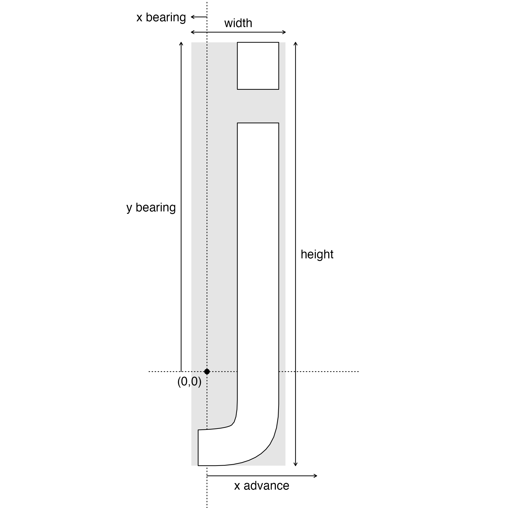

<style type='text/css'>
pre {
  text-wrap: nowrap;
  overflow-x: scroll;
}
</style>

<!--
TODO:
* [x] Look over / edit the post's title in the yaml
* [x] Edit (or delete) the description; note this appears in the Twitter card
* [x] Pick category and tags (see existing with `hugodown::tidy_show_meta()`)
* [x] Find photo & update yaml metadata
* [x] Create `thumbnail-sq.jpg`; height and width should be equal
* [x] Create `thumbnail-wd.jpg`; width should be >5x height
* [x] `hugodown::use_tidy_thumbnails()`
* [x] Add intro sentence, e.g. the standard tagline for the package
* [x] `usethis::use_tidy_thanks()`
-->


The purpose of this document is to give you the a thorough overview of fonts as it relates to their use in R. However, for this to be possible, it is first necessary to get an understanding of fonts and how they work in digital publishing in general. If you have a thorough understanding of digital typography you may skip to [the next section](#font-handling-in-r).

## Digital typography

Many books can be, and have been, written about the subject of typography. This is not meant to be an exhaustive deep dive into all areas of this vast subject. Rather, it is meant to give you just enough understanding of core concepts and terminology to appreciate how it all plays into using fonts in R.

### Typeface or font?

There is a good chance that you, like 99% of world, use *"font"* as the term describing "the look" of the letters you type. You may, perhaps, have heard the term *"typeface"* as well and thought it synonymous. This is in fact slightly wrong, and a great deal of typography snobbery has been dealt out on that account. It is a rather inconsequential mix-up for the most part, especially because 99% of the population wouldn't bat an eye if you use them interchangeably. However, the distinction between the two serves as a good starting point to talk about other terms in digital typography as well as the nature of font files, so let's dive in.

#### Typeface

When most people use the word "font" or "font family", what they are actually describing is a typeface. A typeface is a style of lettering that forms a cohesive whole. As an example, consider the well-known "Helvetica" typeface. This name embraces many different weights (bold, normal, light) as well as slanted (italic) and upright. However, all of these variations are all as much Helvetica as the others - they are all part of the same *typeface*.

#### Font

Well, if typeface is font, what is font then? A font is a subset of a typeface, describing a particular variation of the typeface. Back when printing involved hand lettering based on small metal molds for each glyph, the font described a particular set of metal bits for a typeface that goes together, that is, they had the same weight, width, slant, and size. In today's world of digital publishing it would be okay to remove size from the list of features that describe a font, since size now exist in a continuum rather than as discrete and fixed steps. However, the rest still apply: A font is the combination of typeface, weight, width, and slant that comes together to describe the specific subset of a typeface that is used.

Because font for so long has been used to describe the typeface a new word for what font actually means had to be made up. So, often you will see the term "font style" which is really just another term for what font really means.

In the rest of this document we will use the terms typeface and font with the meaning described above.

### Font files

With the advent of digital publishing it became necessary to encode the visual appearance of glyphs into a file. The file contains both information on how to draw the glyph, but also more complex information such as distance adjustments for pair of glyphs (kerning), substitution rules for collections of characters (ligatures) etc.

While font files often encodes a single font, they may encode a full typeface:


``` r
typefaces <- systemfonts::system_fonts()

# Full typeface in one file
typefaces[typefaces$family == "Helvetica", ]
#> # A tibble: 6 × 9
#>   path                                index name                   family    style         weight width  italic monospace
#>   <chr>                               <int> <chr>                  <chr>     <chr>         <ord>  <ord>  <lgl>  <lgl>    
#> 1 /System/Library/Fonts/Helvetica.ttc     2 Helvetica-Oblique      Helvetica Oblique       normal normal TRUE   FALSE    
#> 2 /System/Library/Fonts/Helvetica.ttc     4 Helvetica-Light        Helvetica Light         light  normal FALSE  FALSE    
#> 3 /System/Library/Fonts/Helvetica.ttc     5 Helvetica-LightOblique Helvetica Light Oblique light  normal TRUE   FALSE    
#> 4 /System/Library/Fonts/Helvetica.ttc     1 Helvetica-Bold         Helvetica Bold          bold   normal FALSE  FALSE    
#> 5 /System/Library/Fonts/Helvetica.ttc     3 Helvetica-BoldOblique  Helvetica Bold Oblique  bold   normal TRUE   FALSE    
#> 6 /System/Library/Fonts/Helvetica.ttc     0 Helvetica              Helvetica Regular       normal normal FALSE  FALSE

# One font per font file
typefaces[typefaces$family == "Arial", ]
#> # A tibble: 4 × 9
#>   path                                                     index name               family style       weight width  italic monospace
#>   <chr>                                                    <int> <chr>              <chr>  <chr>       <ord>  <ord>  <lgl>  <lgl>    
#> 1 /System/Library/Fonts/Supplemental/Arial.ttf                 0 ArialMT            Arial  Regular     normal normal FALSE  FALSE    
#> 2 /System/Library/Fonts/Supplemental/Arial Bold.ttf            0 Arial-BoldMT       Arial  Bold        bold   normal FALSE  FALSE    
#> 3 /System/Library/Fonts/Supplemental/Arial Bold Italic.ttf     0 Arial-BoldItalicMT Arial  Bold Italic bold   normal TRUE   FALSE    
#> 4 /System/Library/Fonts/Supplemental/Arial Italic.ttf          0 Arial-ItalicMT     Arial  Italic      normal normal TRUE   FALSE
```

Because a single file may contain multiple fonts, it is necessary to specify both the path to the font file, as well as an index into the file (second column in the outputs above) to uniquely identify a digital encoding of a font.

#### Font file formats

It may come as no surprise that the world did not nail the encoding format of fonts in the first try (or second, or third, or...). Part of this is simply because technologies evolve, but part of it is also various needs in various parts of digital publishing. In present days, as an R user, there are only a small selection of formats that are really relevant:

##### TrueType (ttf/ttc)

Truetype is the baseline format that all modern formats stand on top of. It was developed by Apple in the '80s and became popular due to its great balance between size and quality. Fonts can be encoded, either as scalable paths, or as bitmaps of various sizes, the former generally being preferred as it allows for seamless scaling and small file size at the same time. Truetype comes in two file formats, either .ttf which encode a single font, or .ttc which encode multiple fonts. The latter is mainly used on Apple computers.

##### OpenType (otf/otc)

OpenType is a format that was created by Microsoft and Adobe to improve upon TrueType. While TrueType had been a great success, it had limitations in terms of the number of glyphs it could contain, as well as support for selecting different features of the font during [shaping](#text-shaping), such as specific ligatures, or number styles. OpenType delivers on all of this, and if you want access to advanced typography features you'll need a font in OpenType format. As with TrueType, OpenType comes in two formats; one for single fonts (.otf) and one for multiple (.otc).

##### Web Open Font Format (woff/woff2)

Both TrueType and, even more so, OpenType, has the problem that file sizes tend to be quite large. OpenType in particular because it supports so many advanced features that may only be relevant for professional type setters. Since a large percentage of the text consumed today is delivered over the internet this large size tend to be a problem. Web Open Font was developed to address this. It basically acts as a compression wrapper around TrueType/OpenType to reduce file sizes while also limiting the number of advanced features provided to those relevant to web fonts. The woff2 format is basically identical to woff except it uses the more efficient [brotli](https://en.wikipedia.org/wiki/Brotli) compression algorithm.

Web Open Font was designed specifically to be delivered over the net for web sites and it is much less common to find these files installed on a computer. In fact, support for this format is also still a bit limited outside of web browsers.

#### Font file content

While we have mainly talked about font files as containers for the shape of glyphs, they also carries a lot of other information needed for rendering text in a way pleasant for reading. There is both font level information:


``` r
systemfonts::font_info(family = "Helvetica")
#> # A tibble: 1 × 24
#>   path          index family style italic bold  monospace weight width kerning color scalable vertical n_glyphs n_sizes n_charmaps bbox  max_ascend max_descend max_advance_width max_advance_height
#>   <chr>         <int> <chr>  <chr> <lgl>  <lgl> <lgl>     <ord>  <ord> <lgl>   <lgl> <lgl>    <lgl>       <int>   <int>      <int> <lis>      <dbl>       <dbl>             <dbl>              <dbl>
#> 1 /System/Libr…     0 Helve… Regu… FALSE  FALSE FALSE     normal norm… FALSE   FALSE TRUE     FALSE        2252       0         10 <dbl>       9.23       -2.77                18                 12
#> # ℹ 3 more variables: lineheight <dbl>, underline_pos <dbl>, underline_size <dbl>
```

This information both covers stylistic information about the typeface and font, statistics on the number of glyphs and how many different mappings between character encodings and glyphs it contains (in this day and age the only relevant mapping is from unicode to glyph), and overall sizing information such as the maximum descend of the font, the position of an underline relative to the baseline etc.

Further, for each glyph there is a range of information in addition to its shape:


``` r
systemfonts::glyph_info("j", family = "Helvetica", size = 30)
#> # A tibble: 1 × 9
#>   glyph index width height x_bearing y_bearing x_advance y_advance bbox     
#>   <chr> <int> <dbl>  <dbl>     <dbl>     <dbl>     <dbl>     <dbl> <list>   
#> 1 j        77     6     27        -1        21         7         0 <dbl [4]>
```

The meaning of these various measures can be seen in the below graph



The advancement in particular is important when rendering text because it tells you how far to move to the right before rendering the next glyph (ignoring for a bit the concept of kerning)

### Text shaping {#text-shaping}

Text shaping is, in the simplest of terms, to convert a succession of characters into a range of glyphs and their location. Behind this seemingly benign objective lies a bottomless pit of despair that has claimed hundreds of years of human labor. I will not go into too much detail but just give you a glimpse of the complications involved in the process.

#### Character != glyph

While it is easy to fall into the trap of thinking that characters are mapped one-to-one with glyphs, this is not the case. True, for many situations this holds, e.g. the character "f" is often represented by the glyph "f". But characters can merge or split into glyphs, completely destroying the mapping. The merging can happen if you have a diacritic following a character (e.g. "a" followed "´" ending up as the glyph á), or if two or more consecutive characters are merged into a combined glyph in the case of "f" followed by "i" ending up as the "fi" glyph. The latter is called ligature and is used both to improve the reading and provide stylistic bravado to rendering. For some scripts such as Arabic, ligatures are an integral part of the rendering and it is impossible to envision displaying it without. Apart from this, a font may provide multiple glyphs for a single character, with the choice being at the discretion of the user (an example is tabular numbers to ensure all digits have the same width).

So, the first part of shaping is to convert the characters that programmatically encode the text into glyphs that visually encode the text.

#### Glyphs attract and oppose

While the "x advance" measure tells you how far to progress in the x direction after rendering a glyph, this is not the full story. Some pairs of glyphs like to get a bit closer or a bit farther from each other to ensure that they visually look well spaced. This is the process called kerning. Kerning is an integral part of all modern text rendering and you will almost solemnly notice it when it is absent (or worse, wrongly applied)

[](https://xkcd.com/1015)

Kerning looks at the preceeding glyphs and modifies the start position for rendering based on that. It is completely based on glyph pairs and thus ignore any other information in the surrounding text.

#### Text flows in all directions

Depending on your location it can be easy to think that text universally flows from left to right. However, the directionality of text depends on the script you are using, and while the Latin script is left-to-right, many are not, e.g. Arabic. While handling text in a single script is simple enough, even if the direction is right-to-left, it gets a whole lot more complicated if the text is a mix of scripts with different directionality (bidirectional text).

When handling bidirectional text (and you never know if you are unless you investigate it), the first thing to do is to cut up the text into runs of the same directionality. That may seem easy enough if you can identify the script, but in reality it can be hard to define the boundary because some characters doesn't belong to a specific script, e.g. certain marks like period, or even emojis. You also need to figure out if there are multiple levels of embeddings, e.g. left-to-right text that include a run of right-to-left text which includes a run of left-to-right text. Once you've figured that out you need to find out if there are any line breaks inside an embedding because that will alter which part of the embedding come first. Once you've cut up the text into segments and arranged them in order that fits into one or more lines you can then progress to actually figure out the location of each glyph etc.

"But wait", you say. "How can I know if a line break appears in the middle of an embedding before I have figured out the position of the glyphs?". Well, you can't. There is a certain amount of back and forth happening during text shaping that you just have to live with.

#### Missing glyphs

It is not unheard of that you request a character from a font that it doesn't contain. One way to deal with this is to render a glyph representing a missing glyph, usually an empty box or a question mark inside of a rombe. While this is a fair approach, it does very little to communicate the content of the text being rendered. A better approach is to find an alternative font to use for the cases where where a glyph can't be found. This happens all the time when using emojis, but can also happen when you suddenly change script without bothering to pick a new font. The process of finding an alternative font is called font fallback and is, at best, an imprecise science. Usually the computer contains a selection of universal fonts that in unison covers the totality of the unicode standard and these are searched for a match. But finding a font that stylistically looks like it fits together with the font chosen by the user is a harder task and something that is seldom taken into account.

#### All the rest

Once you have determined the order and location of glyphs, you are still not done. Text often needs to be wrapped to fit into a specific width, it may need a specific justification, perhaps, indentation or tracking must be applied, etc. Thankfully, all of this is generally a matter of (often gnarly) math that you just have to get right. That is, all except text wrapping which should happen at the right boundaries, and may need to break up a word and inserting a hyphen etc.

Like I said, the pit of despair is bottomless...

## Font handling in R {#font-handling-in-r}

You hopefully arrive at this section with an appreciation of the horrors that goes into rendering text. If not, maybe this [blog post](https://faultlore.com/blah/text-hates-you/) will convince you.

Are you still here? Good.

While all of the above probably gave you a good understanding of what goes into handling fonts and text, you probably came here to learn how to deal with it in R specifically. Fear not. We will embark on that journey now.

### Fonts and text from a user perspective {#fonts-and-text-from-a-user-perspective}

The users perception of working with fonts in R is by and large shaped by how you use it to plot text. This means, using either base or grid graphics or one of the packages that have been build on top of it, like [ggplot2](https://ggplot2.tidyverse.org) or [lattice](https://cran.r-project.org/web/packages/lattice/index.html). While the choice of tool will affect *where* you specify the font to use, they generally agree on how to specify it:

#### Base graphics

Font settings are set, either globally with a call to `par()`, or directly when plotting text using `text()` or other calls that result in text being rendered. The relevant arguments are:

-   `family`: Provides the name of the typeface

-   `font`: Provides the style of the specific font from the typeface (`1`: plain, `2`: bold, `3`: italic, and `4`: bold-italic)

-   `cra`/`cin`: Default size of text specified in either pixels or inches

-   `cex`: A multiplication factor to the default size to determine the final size of the font

#### Grid graphics

In grid, all graphical parameters including font settings, are set using the `gpar()` function whose return value is assigned to the `gp` argument of relevant functions. The arguments in `gpar()` relevant to text rendering are:

-   `fontfamily`: Provides the name of the typeface

-   `fontface`: Provides the style of the specific font from the typeface (`1`: plain, `2`: bold, `3`: italic, and `4`: bold-italic)

-   `fontsize`: Provides the size of the font in points (1/72 inch)

-   `cex`: A multiplication factor to `fontsize` to determine the final size of the font

#### ggplot2

In ggplot2 there are two places you may apply font-related settings. As part of `theme()` using `element_text()`, controlling representation of non-data information such as titles, axis text, etc. And as part of `geom_text()` or other text rendering geoms (including annotation layers). Settings in `element_text()` relevant for fonts are:

-   `family`: Provides the name of the typeface

-   `face`: Provides the style of the specific font from the typeface (`1`: plain, `2`: bold, `3`: italic, and `4`: bold-italic)

-   `size`: Provides the size of the font in points (1/72 inch)

Settings in `geom_text()` and related geoms relevant for fonts are:

-   `family`: Provides the name of the typeface

-   `fontface`: Provides the style of the specific font from the typeface (`1`: plain, `2`: bold, `3`: italic, and `4`: bold-italic)

-   `size`: Provides the size of the font. Default unit is millimeters but may be changed with the `size.unit` argument. If this is set inside `aes()` then the values will first be scaled according to the size scale.

From this brief overview it is clear that in R *fontfamily*/*family* is used to describe the typeface, *font*/*fontface*/*face* is used to select a font from the typeface based on a limited number of styles. Size settings is just a plain mess.

The major limitation lies in the *fontface* (and friends) setting as it only allows you to select from a small range of weights and fully ignore different widths. As such, it is impossible to select Futura Condensed Extra Bold if you wish to use that font in your graphics.

Another limitation is that it is not possible to specify any font variations such as using tabular numbers or stylistic ligatures, though lack of such advanced text rendering features could be easily excused.

### Fonts and text from a graphics device perspective

After a user has made a call that renders some text, it is funneled through the graphic system (base or grid), handed off to the graphics engine, which ultimately asks the graphics device to render the text. From the perspective of the graphics device it is much the same information that the user provided which are presented to it. The `text()` method of the device are given an array of characters, the typeface, the size in points, whether or not it is italic, and whether or not it is bold.

This means that the graphics device not only has to know how to render the glyphs (which can be hard enough in itself). It also has to take the combination of typeface, bold, and italic and somehow find the right font file to use based on that *and* it then has to be able to shape the text [with all that that entails](#text-shaping). This is a huge ordeal and the complications of it is why text is handled so inconsistently between graphics devices. Issues can range from not being able to find fonts installed on the computer, to not providing font fallback mechanisms, or even handling right-to-left text. It may also be that certain font file formats are not well supported so that e.g. color emojis are not rendered correctly.

### Packages that helps with fonts

Over the years there have been a number of packages that tried to help the user get predictable output during plotting. This is a non-exhaustive overview:

#### extrafont

Developed by Winston Chang, [extrafont](https://github.com/wch/extrafont) sought to mainly improve the situation for the `pdf()` device which generally only had access to the postscript fonts that comes with R. The package allows the `pdf()` device to get access to TrueType fonts installed on the computer, as well as provide means for embedding the font into the PDF so that it can be opened on systems where the font is not installed. Further, it provides the same improved font detection facilities to the Windows `png()` device.

#### sysfonts / showtext

This set of packages are developed by Yixuan Qiu and provide support for system fonts (fonts installed on the computer) to all graphics devices. [sysfonts](https://github.com/yixuan/sysfonts) is a supporting package that provides access to installed fonts. [showtext](https://github.com/yixuan/showtext) works in a creative way by hijacking the `text()` method of the graphics device and renders the text as polygons or raster images it extract from the font files. It also supports using fonts from online repositories such as Google Fonts.

#### systemfonts / textshaping

This duo of packages by Thomas Lin Pedersen attempt to provide facilities for graphics devices to use so that the challenges of text rendering becomes as easy as possible. [systemfonts](https://systemfonts.r-lib.org) provides access to fonts installed on the system along with font fallback mechanisms, registration of non-system fonts, reading of font files etc. [textshaping](https://github.com/r-lib/textshaping) builds on top of systemfonts and provides a fully modern engine for shaping text. The functionality is exposed both at the R level and at the C level, so that graphics devices has direct access to font lookup and shaping.

The main limitation of systemfonts and textshaping is that the graphics device needs to use them for their facilities to be usable. The [ragg](https://ragg.r-lib.org) package provides graphics devices for rendering raster graphics in a variety of formats (PNG, JPEG, TIFF) and uses systemfonts and textshaping extensively. The [svglite](https://svglite.r-lib.org) package likewise provides a graphic device for rendering vector graphics to SVG using systemfonts and textshaping for text. Both of these packages are modern and powerful alternatives to the default graphics devices and are being actively maintained. As such, the only downside to a systemfonts and textshaping based font workflow is the lack of a PDF device that is build upon it.

### A font workflow based on systemfonts

While textshaping is integral to text rendering, it is not a package that users interact with (but it does all the heavy lifting for the graphics device). Because of this the focus of the remaining text will be on using systemfonts to manage fonts used in plotting. Since we are dealing with systemfonts it follows that a graphics device based on systemfonts must be used, ie. graphics devices from ragg or svglite.

#### Using ragg as default

While there is no way to unilaterally make `ragg::agg_png()` the default device across all aspects of R, it is possible to get close. If you use Positron as the IDE then recent versions will use `ragg::agg_png()` in the plotting pane if ragg is installed. For the RStudio IDE it requires you to set "AGG" as the backend under Global Options \> General \> Graphics. In both cases it is a matter of setting and forgetting and living a blissful existence ever after.

For users of ggplot2 who are fond of the `ggsave()` function for saving output, ragg will also be used for raster output if installed so there is also nothing additional to do there.

The only place you have to be continually mindful of using ragg is in RMarkdown / Quarto documents. Here you have to tell knitr to use ragg as the default device, either by using `knitr::opts_chunk$set(dev = "ragg_png")` in the first code block (works for both RMarkdown and Quarto) or by setting it in the YAML front matter (works only in Quarto) like so:

``` yaml
---
title: "My Document"
format: html
knitr:
  opts_chunk:
    dev: "ragg_png"
---
```

#### Relying on systemfonts

Once you are using a graphics device based on systemfonts there is nothing more to do in order to get access to fonts installed on your computer (you don't need to load systemfonts or anything). Provide the typeface to the `family`/`fontfamily` argument [depending on the graphics system you use](#fonts-and-text-from-a-user-perspective) and enjoy the show. If something seems off, you can use `systemfonts::match_fonts()` to see what font file systemfonts return based on the provided specification


``` r
systemfonts::match_fonts("Futura", weight = "bold")
#> # A tibble: 1 × 3
#>   path                                          index features  
#>   <chr>                                         <int> <list>    
#> 1 /System/Library/Fonts/Supplemental/Futura.ttc     2 <font_ftr>
```

Likewise you can see what font fallback will be provided for a specific string and font using `systemfonts::font_fallback()`


``` r
systemfonts::font_fallback("🤷‍♂️", family = "Futura", weight = "bold")
#>                                          path index
#> 1 /System/Library/Fonts/Apple Color Emoji.ttc     0
```

However, these functions are there mostly to satisfy your curiosity as it all happens automatically at the graphics device layer:


``` r
grid::grid.text(
  "FUTURA 🤷‍♂️",
  gp = grid::gpar(fontfamily = "Futura", fontface = 3, fontsize = 30)
)
```


If you want to get an overview of all the fonts available for use, you can use `systemfonts::system_fonts()`


``` r
systemfonts::system_fonts()
```


```
#> # A tibble: 570 × 9
#>    path                                                       index name                     family               style   weight width  italic monospace
#>    <chr>                                                      <int> <chr>                    <chr>                <chr>   <ord>  <ord>  <lgl>  <lgl>    
#>  1 /System/Library/Fonts/Supplemental/Rockwell.ttc                2 Rockwell-Bold            Rockwell             Bold    bold   normal FALSE  FALSE    
#>  2 /System/Library/Fonts/Noteworthy.ttc                           0 Noteworthy-Light         Noteworthy           Light   normal normal FALSE  FALSE    
#>  3 /System/Library/Fonts/Supplemental/DevanagariMT.ttc            1 DevanagariMT-Bold        Devanagari MT        Bold    bold   normal FALSE  FALSE    
#>  4 /System/Library/Fonts/Supplemental/Kannada Sangam MN.ttc       0 KannadaSangamMN          Kannada Sangam MN    Regular normal normal FALSE  FALSE    
#>  5 /System/Library/Fonts/Supplemental/Verdana Bold.ttf            0 Verdana-Bold             Verdana              Bold    bold   normal FALSE  FALSE    
#>  6 /System/Library/Fonts/ArialHB.ttc                              8 ArialHebrewScholar-Light Arial Hebrew Scholar Light   light  normal FALSE  FALSE    
#>  7 /System/Library/Fonts/AppleSDGothicNeo.ttc                    10 AppleSDGothicNeo-Thin    Apple SD Gothic Neo  Thin    thin   normal FALSE  FALSE    
#>  8 /System/Library/Fonts/Supplemental/DecoTypeNaskh.ttc           0 DecoTypeNaskh            DecoType Naskh       Regular normal normal FALSE  FALSE    
#>  9 /System/Library/Fonts/Supplemental/Trebuchet MS Italic.ttf     0 TrebuchetMS-Italic       Trebuchet MS         Italic  normal normal TRUE   FALSE    
#> 10 /System/Library/Fonts/Supplemental/Khmer MN.ttc                0 KhmerMN                  Khmer MN             Regular normal normal FALSE  FALSE    
#> # ℹ 560 more rows
```

#### Overcoming the limitations of R

As discussed above, the R interface presents limitations in terms of which fonts from a typeface can be selected. If you want to use a thin font — even if the graphics device is capable of looking it up — you have no way of communicating this wish to the device. To overcome this, systemfonts provides `register_variant()` which allows you to register variations of a typeface under a new name. To use the thin font from the Avenir Next typeface you can register it to the Avenir Thin name like so


``` r
systemfonts::register_variant(
  name = "Avenir Thin",
  family = "Avenir Next",
  weight = "thin"
)
```

You can now use Avenir Thin where you would otherwise specify the typeface


``` r
grid::grid.text(
  "Thin weight is soo classy",
  gp = grid::gpar(fontfamily = "Avenir Thin", fontsize = 30)
)
```


The above approach can likewise be used to get access to fonts with a different width than normal.

The last use of `register_variant()` is to turn on various font features otherwise hidden away from you in R


``` r
systemfonts::register_variant(
  name = "Avenir Small Caps",
  family = "Avenir Next",
  features = systemfonts::font_feature(
    letters = "small_caps"
  )
)
grid::grid.text(
  "All caps — Small caps",
  gp = grid::gpar(fontfamily = "Avenir Small Caps", fontsize = 30)
)
```


#### Fonts from other places

By default, systemfonts provides access to fonts installed on the computer it is executing on. This is usually, but not always, what you want and expect. You might be using a computer where you don't have the rights to install new fonts, or you might not want to go through the hassle of installing a font just to use it for this one plot.

If you want to let systemfonts know about other fonts not installed on your computer you can do so using `add_fonts()`. All it needs is the path to a font file, and all of the fonts present in that file will instantly become available for use. Further, when systemfonts is loaded (which will happen automatically if you use a graphics device dependent on it) it will scan `./fonts` and `~/fonts` and add any fonts it find in these two locations. This means that you can put personal fonts in a fonts folder in your home directory, or project specific fonts in a fonts directory at the root of the project and these fonts will automatically become available in R. This is a great way to ensure that specific fonts are available when you deploy some code to a server.

You don't even have to leave R to populate these folders. systemfonts support a range of online font repositories that can be downloaded from and they are by default placed in `~/fonts` so they are available next time you open R:


``` r
systemfonts::get_from_google_fonts("Barrio")

grid::grid.text(
  "A new font a day keeps Tufte away",
  gp = grid::gpar(fontfamily = "Barrio", fontsize = 30)
)
```


If you don't care about how and where, but just want to ensure that a particular font is available before plotting you can use `require_font()`. It will first look to see if the font is already available, and if not, try to download it from one of the repositories it knows about. If it can't find it it will either throw an error (the default) or remap the name to another font on the system so that plotting will still succeed


``` r
systemfonts::require_font("Barrio")
#> `Barrio` available at /Users/thomas/fonts
systemfonts::require_font("Rubik Distressed")
#> Trying Google Fonts...
#>  Found! Downloading font to /var/folders/l4/tvfrd0ps4dqdr2z7kvnl9xh40000gn/T//RtmpKs1EGR

grid::grid.text(
  "There are no bad fonts\nonly bad text",
  gp = grid::gpar(fontfamily = "Rubik Distressed", fontsize = 30)
)
```


By default, `require_font()` places new fonts in a temporary folder so it doesn't pollute your carefully curated collection of fonts.

### Font embedding

If you are using a vector format such as SVG, text is not drawn in the same way as in a raster format such as PNG. Instead the text is passed along and rendering is postponed to when you open the file. This both result in significantly smaller files as well as crisp text at every zoom level you can dream off. However, this comes with a price. Since the text is not rendered before it is opened it relies on the font in use being available on whatever computer is used to open the file with. To deal with this you can embed the font directly into the file so that it travels with the file and is available whenever it is opened.

For PDF the situation is a bit complicated and since no PDF device using systemfonts exist we are glossing over it now. For SVG, however, you can embed fonts using an `@import` statement in the stylesheet. This statement can point to an online location so that the actual font data doesn't have to be written to the file. systemfonts provides facilities to generate URLs for import statements and can provide them in a variety of formats:


``` r
systemfonts::fonts_as_import("Barrio")
#> [1] "https://fonts.bunny.net/css2?family=Barrio&display=swap"
systemfonts::fonts_as_import("Rubik Distressed", type = "link")
#> [1] "<link rel=\"stylesheet\" href=\"https://fonts.bunny.net/css2?family=Rubik+Distressed&display=swap\"/>"
```

Further, if the font is not available from an online repository, it can embed the font data directly into the URL


``` r
substr(systemfonts::fonts_as_import("Chalkduster"), 1, 200)
#> [1] "data:text/css,@font-face%20%7B%0A%20%20font-family:%20%22Chalkduster%22;%0A%20%20src:%20url(data:font/ttf;charset=utf-8;base64,AAEAAAAMAIAAAwC4T1MvMmk8+wsAAAFIAAAAYGNtYXBJhgfNAAAEOAAACspnbHlmLDPYGwAAf"
```

svglite uses this feature to allow seamless font embedding with the `web_fonts` argument. It can take a URL as returned by `fonts_as_import()` or just the name of the typeface and the URL will automatically be resolved. Look at line 6 in the SVG generated below


``` r
svg <- svglite::svgstring(web_fonts = "Barrio")
grid::grid.text("Example", gp = grid::gpar(fontfamily = "Barrio"))
invisible(dev.off())
svg()
#> <?xml version='1.0' encoding='UTF-8' ?>
#> <svg xmlns='http://www.w3.org/2000/svg' xmlns:xlink='http://www.w3.org/1999/xlink' width='720.00pt' height='576.00pt' viewBox='0 0 720.00 576.00'>
#> <g class='svglite'>
#> <defs>
#>   <style type='text/css'><![CDATA[
#>     @import url('https://fonts.bunny.net/css2?family=Barrio&display=swap');
#>     .svglite line, .svglite polyline, .svglite polygon, .svglite path, .svglite rect, .svglite circle {
#>       fill: none;
#>       stroke: #000000;
#>       stroke-linecap: round;
#>       stroke-linejoin: round;
#>       stroke-miterlimit: 10.00;
#>     }
#>     .svglite text {
#>       white-space: pre;
#>     }
#>     .svglite g.glyphgroup path {
#>       fill: inherit;
#>       stroke: none;
#>     }
#>   ]]></style>
#> </defs>
#> <rect width='100%' height='100%' style='stroke: none; fill: #FFFFFF;'/>
#> <defs>
#>   <clipPath id='cpMC4wMHw3MjAuMDB8MC4wMHw1NzYuMDA='>
#>     <rect x='0.00' y='0.00' width='720.00' height='576.00' />
#>   </clipPath>
#> </defs>
#> <g clip-path='url(#cpMC4wMHw3MjAuMDB8MC4wMHw1NzYuMDA=)'>
#> <text x='360.00' y='292.32' text-anchor='middle' style='font-size: 12.00px; font-family: "Barrio";' textLength='48.12px' lengthAdjust='spacingAndGlyphs'>Example</text>
#> </g>
#> </g>
#> </svg>
```

## Want more?

This document has mainly focused on how to use the fonts you desire from within R. R has other limitations when it comes to text rendering specifically how to render text that consists of a mix of fonts. This has been solved by [marquee](https://marquee.r-lib.org) and the curious soul can continue there in order to up their skills in rendering text with R


``` r
grid::grid.draw(
  marquee::marquee_grob(
    "_This_ **is** the {.red end}",
    marquee::classic_style(base_size = 30)
  )
)
```


