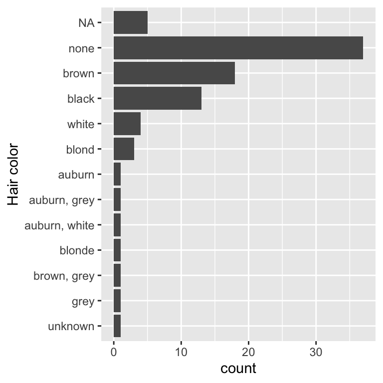
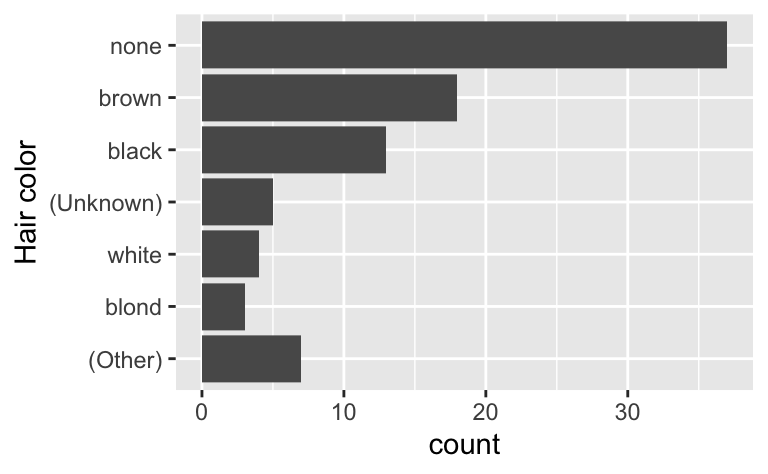

<!--
TODO:
* [x] Look over / edit the post's title in the yaml
* [x] Edit (or delete) the description; note this appears in the Twitter card
* [x] Pick category and tags (see existing with [`hugodown::tidy_show_meta()`](https://rdrr.io/pkg/hugodown/man/use_tidy_post.html))
* [x] Find photo & update yaml metadata
* [x] Create `thumbnail-sq.jpg`; height and width should be equal
* [x] Create `thumbnail-wd.jpg`; width should be >5x height
* [x] [`hugodown::use_tidy_thumbnails()`](https://rdrr.io/pkg/hugodown/man/use_tidy_post.html)
* [x] Add intro sentence, e.g. the standard tagline for the package
* [ ] [`usethis::use_tidy_thanks()`](https://usethis.r-lib.org/reference/use_tidy_thanks.html)
-->

We're so happy to announce the release of [forcats](https://forcats.tidyverse.org) 1.0.0. The goal of the forcats package is to provide a suite of tools that solve common problems with factors, including changing the order of levels or the values.

You can install it from CRAN with:

<pre class='chroma'><code class='language-r' data-lang='r'><a href='https://rdrr.io/r/utils/install.packages.html'>install.packages</a>("forcats")</code></pre>

While this is the 1.0.0 release of forcats, this version number is mainly to signal that we think forcats is stable, and that we don't anticipate any major changes in the future. This blog post will outline the only major new feature in this version: better tools for dealing with the two ways that missing values can be represented in factors. As usual, you can see a full list of changes in the [release notes](https://github.com/tidyverse/forcats/releases/tag/v1.0.0).

<pre class='chroma'><code class='language-r' data-lang='r'><a href='https://rdrr.io/r/base/library.html'>library</a>(<a href='https://forcats.tidyverse.org/'>forcats</a>)</code></pre>

## `NA` in levels vs `NA` in values

There are two ways to represent a missing value in a factor:

-   You can include it in the values of the factor; it does not appear in the levels and [`is.na()`](https://rdrr.io/r/base/NA.html) reports it as missing. This is how missing values are encoded by default:

    

    <pre class='chroma'><code class='language-r' data-lang='r'>f1 &lt;- <a href='https://rdrr.io/r/base/factor.html'>factor</a>(<a href='https://rdrr.io/r/base/c.html'>c</a>("x", "y", NA, NA, "x"))
    <a href='https://rdrr.io/r/base/levels.html'>levels</a>(f1)
    #&gt; [1] "x" "y"
    <a href='https://rdrr.io/r/base/NA.html'>is.na</a>(f1)
    #&gt; [1] FALSE FALSE  TRUE  TRUE FALSE
    </code></pre>

    

-   You can include it in the levels of the factor, thus [`is.na()`](https://rdrr.io/r/base/NA.html) does not report it as missing. This requires a little more work to create, because, by default, [`factor()`](https://rdrr.io/r/base/factor.html) uses `exclude = NA`, meaning that missing values are not included in the levels. You can force `NA` to be included by setting `exclude = NULL`:

    

    <pre class='chroma'><code class='language-r' data-lang='r'>f2 &lt;- <a href='https://rdrr.io/r/base/factor.html'>factor</a>(<a href='https://rdrr.io/r/base/c.html'>c</a>("x", "y", NA, NA, "x"), exclude = NULL)
    <a href='https://rdrr.io/r/base/levels.html'>levels</a>(f2)
    #&gt; [1] "x" "y" NA
    <a href='https://rdrr.io/r/base/NA.html'>is.na</a>(f2)
    #&gt; [1] FALSE FALSE FALSE FALSE FALSE
    </code></pre>

    

You can see the difference a little more clearly by looking at the underlying integer values of the factor:

<pre class='chroma'><code class='language-r' data-lang='r'><a href='https://rdrr.io/r/base/integer.html'>as.integer</a>(f1)
#&gt; [1]  1  2 NA NA  1
<a href='https://rdrr.io/r/base/integer.html'>as.integer</a>(f2)
#&gt; [1] 1 2 3 3 1
</code></pre>

When the `NA` is stored in the levels, there's no missing value in the underlying integer values, because the value of level 3 is `NA`.

`NA`s in the values tend to be best for data analysis, because [`is.na()`](https://rdrr.io/r/base/NA.html) works as you'd expect. `NA`s in the levels are useful if you need to control where missing values are shown in a table or a plot. To make it easier to switch between these forms, forcats now comes [`fct_na_value_to_level()`](https://forcats.tidyverse.org/reference/fct_na_value_to_level.html) and [`fct_na_level_to_value()`](https://forcats.tidyverse.org/reference/fct_na_value_to_level.html).

Here's a practical example of why it matters. In the plot below, I've attempted to use [`fct_infreq()`](https://forcats.tidyverse.org/reference/fct_inorder.html) to reorder the levels of the factor so that the highest frequency levels are at the top of the bar chart:

<pre class='chroma'><code class='language-r' data-lang='r'><a href='https://rdrr.io/r/base/library.html'>library</a>(<a href='https://ggplot2.tidyverse.org'>ggplot2</a>)
<a href='https://rdrr.io/r/base/library.html'>library</a>(<a href='https://dplyr.tidyverse.org'>dplyr</a>, warn.conflicts = FALSE)

<a href='https://ggplot2.tidyverse.org/reference/ggplot.html'>ggplot</a>(starwars, <a href='https://ggplot2.tidyverse.org/reference/aes.html'>aes</a>(y = <a href='https://forcats.tidyverse.org/reference/fct_rev.html'>fct_rev</a>(<a href='https://forcats.tidyverse.org/reference/fct_inorder.html'>fct_infreq</a>(hair_color)))) + 
  <a href='https://ggplot2.tidyverse.org/reference/geom_bar.html'>geom_bar</a>() + 
  <a href='https://ggplot2.tidyverse.org/reference/labs.html'>labs</a>(y = "Hair color")
</code></pre>

Unfortunately, however, because the `NA`s are stored in the values, [`fct_infreq()`](https://forcats.tidyverse.org/reference/fct_inorder.html) has no ability to affect them, so they appear in their default position, after all the other values (it might not be obvious that that they're after the other values here, but remember in plots y values have their smallest values at the bottom and highest values at the top).

We can make [`fct_infreq()`](https://forcats.tidyverse.org/reference/fct_inorder.html) do what we want by moving the `NA` from the values to the levels:

<pre class='chroma'><code class='language-r' data-lang='r'><a href='https://ggplot2.tidyverse.org/reference/ggplot.html'>ggplot</a>(starwars, <a href='https://ggplot2.tidyverse.org/reference/aes.html'>aes</a>(y = <a href='https://forcats.tidyverse.org/reference/fct_rev.html'>fct_rev</a>(<a href='https://forcats.tidyverse.org/reference/fct_inorder.html'>fct_infreq</a>(<a href='https://forcats.tidyverse.org/reference/fct_na_value_to_level.html'>fct_na_value_to_level</a>(hair_color))))) + 
  <a href='https://ggplot2.tidyverse.org/reference/geom_bar.html'>geom_bar</a>() + 
  <a href='https://ggplot2.tidyverse.org/reference/labs.html'>labs</a>(y = "Hair color")
</code></pre>

That code is getting a little verbose so lets pull it out into a separate dplyr step and pull the factor transformation in to its own mini pipeline:

<pre class='chroma'><code class='language-r' data-lang='r'>starwars |&gt; 
  <a href='https://dplyr.tidyverse.org/reference/mutate.html'>mutate</a>(
    hair_color = hair_color |&gt; 
      <a href='https://forcats.tidyverse.org/reference/fct_na_value_to_level.html'>fct_na_value_to_level</a>() |&gt; 
      <a href='https://forcats.tidyverse.org/reference/fct_inorder.html'>fct_infreq</a>() |&gt; 
      <a href='https://forcats.tidyverse.org/reference/fct_rev.html'>fct_rev</a>()
  ) |&gt; 
  <a href='https://ggplot2.tidyverse.org/reference/ggplot.html'>ggplot</a>(<a href='https://ggplot2.tidyverse.org/reference/aes.html'>aes</a>(y = hair_color)) + 
  <a href='https://ggplot2.tidyverse.org/reference/geom_bar.html'>geom_bar</a>() + 
  <a href='https://ggplot2.tidyverse.org/reference/labs.html'>labs</a>(y = "Hair color")
</code></pre>

This structure makes it easier to make other adjustments. For example, the code below uses a more informative label for the missing level and lumps together the colours with less than 2 observations. I've left the (Other) category as a bar at the end, but if I wanted to I could cause it to sort in frequency order by flipping the order of [`fct_infreq()`](https://forcats.tidyverse.org/reference/fct_inorder.html) and [`fct_lump_min()`](https://forcats.tidyverse.org/reference/fct_lump.html) .

<pre class='chroma'><code class='language-r' data-lang='r'>starwars |&gt; 
  <a href='https://dplyr.tidyverse.org/reference/mutate.html'>mutate</a>(
    hair_color = hair_color |&gt; 
      <a href='https://forcats.tidyverse.org/reference/fct_na_value_to_level.html'>fct_na_value_to_level</a>("(Unknown)") |&gt; 
      <a href='https://forcats.tidyverse.org/reference/fct_inorder.html'>fct_infreq</a>() |&gt; 
      <a href='https://forcats.tidyverse.org/reference/fct_lump.html'>fct_lump_min</a>(2, other_level = "(Other)") |&gt; 
      <a href='https://forcats.tidyverse.org/reference/fct_rev.html'>fct_rev</a>() 
  ) |&gt; 
  <a href='https://ggplot2.tidyverse.org/reference/ggplot.html'>ggplot</a>(<a href='https://ggplot2.tidyverse.org/reference/aes.html'>aes</a>(y = hair_color)) + 
  <a href='https://ggplot2.tidyverse.org/reference/geom_bar.html'>geom_bar</a>() + 
  <a href='https://ggplot2.tidyverse.org/reference/labs.html'>labs</a>(y = "Hair color")
</code></pre>

Looking closely at what got lumped together made me realise that there's an existing "Unknown" level that should probably be represented as a missing value. One way to fix that is with [`fct_na_level_to_value()`](https://forcats.tidyverse.org/reference/fct_na_value_to_level.html):

<pre class='chroma'><code class='language-r' data-lang='r'>starwars |&gt; 
  <a href='https://dplyr.tidyverse.org/reference/mutate.html'>mutate</a>(
    hair_color = hair_color |&gt; 
      <a href='https://forcats.tidyverse.org/reference/fct_na_value_to_level.html'>fct_na_level_to_value</a>("Unknown") |&gt; 
      <a href='https://forcats.tidyverse.org/reference/fct_na_value_to_level.html'>fct_na_value_to_level</a>("(Unknown)") |&gt; 
      <a href='https://forcats.tidyverse.org/reference/fct_inorder.html'>fct_infreq</a>() |&gt; 
      <a href='https://forcats.tidyverse.org/reference/fct_lump.html'>fct_lump_min</a>(2, other_level = "(Other)") |&gt; 
      <a href='https://forcats.tidyverse.org/reference/fct_rev.html'>fct_rev</a>() 
  ) |&gt; 
  <a href='https://ggplot2.tidyverse.org/reference/ggplot.html'>ggplot</a>(<a href='https://ggplot2.tidyverse.org/reference/aes.html'>aes</a>(y = hair_color)) + 
  <a href='https://ggplot2.tidyverse.org/reference/geom_bar.html'>geom_bar</a>() + 
  <a href='https://ggplot2.tidyverse.org/reference/labs.html'>labs</a>(y = "Hair color")
</code></pre>

## Acknowledgements

