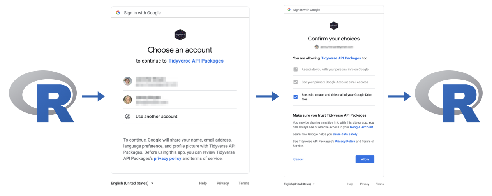

We're psyched to announce the release of [gargle](https://gargle.r-lib.org) 1.2.0.
gargle is meant to take some of the pain out of working with Google APIs and is mostly aimed at the *maintainers* of R packages that call Google APIs.

Packages that use gargle internally include [bigrquery](https://bigrquery.r-dbi.org), [gmailr](https://gmailr.r-lib.org), [googleAuthR](https://code.markedmondson.me/googleAuthR/), [googledrive](https://googledrive.tidyverse.org), and [googlesheets4](https://googlesheets4.tidyverse.org).
As a conservative lower bound, gargle facilitates more than 1.5 million requests per day and over 50 million requests per month.
Users of these packages, especially those who take an interest in the details around auth, may want to read on.

You can install gargle from CRAN with:

```{r, eval = FALSE}
install.packages("gargle")
```

I last blogged about gargle in [August 2019, around the release of v0.3.1](https://www.tidyverse.org/blog/2019/08/gargle-hello-world/).
There have been several releases since then and this post highlights important changes across all of them.

You can see a full list of changes in the [release notes](https://gargle.r-lib.org/news/index.html).

## Stewarding the cache of user tokens

Users who "just go with the flow" generally find themselves doing the [OAuth Dance](https://medium.com/typeforms-engineering-blog/the-beginners-guide-to-oauth-dancing-4b8f3666de10) in the browser:

```{r echo = FALSE, out.width = '100%', fig.cap = "Typical OAuth dance in the browser, when initiated from within R"}

```

Upon success, you see this message in the browser:

```
Authentication complete. Please close this page and return to R.
```

The dance concludes with gargle (or a wrapper package) in possession of a [Google user token](https://developers.google.com/identity/protocols/oauth2#installed).
This credential usually comes with an access token, which is valid for about an hour, and a more persistent refresh token, which can be used to get new access tokens in the future.
It is nice to store this refresh token somewhere, to reduce future friction for this user.
We'll refer to this "somewhere" as the *oauth token cache*.
You can get a cache "situation report" with `gargle::gargle_oauth_sitrep()`.

One of the original motivations for the gargle package was to depart from httr's behaviour around token caching, which defaults to the current working directory.[^1]
By default, gargle caches user tokens centrally, at the user level, and their keys or labels also convey which Google identity is associated with each token.
This reduces the chance of accidentally exposing tokens in projects that sync to remote servers (like DropBox or GitHub), increases the ability to reuse tokens across multiple R projects, and makes it easier to use multiple identities within a single project.

[^1]: The successor to httr is under development and, like gargle, it will also cache user tokens at the user level: <https://httr2.r-lib.org>.

Various incremental improvements have been made around gargle's token cache:

* The default cache location has moved, to better align with general conventions
  around where to cache user data. After upgrading gargle, don't be surprised
  if you see some messages about cache relocation.
* Token storage relies on serialized R objects and therefore is potentially
  sensitive to differences in R version and operating system between when a
  token is created and when it is (re)used. gargle is now able to recognize and
  cope with the most predictable and harmless effects of moving a token across
  time or space.
* gargle is quite conservative about using cached tokens and likes to have
  explicit permission from the user. However, this is in tension with the desire
  to make things "just work". Balancing these two goals is an ongoing effort:
  - In a non-interactive context, gargle will use a cached token, if it can
    find (at least) one, even if the user has not given explicit instructions.
    However, we complain noisily and urge the user to make their intent
    unambiguous in the code. This comes up, for example, when rendering an R
    Markdown document(`.Rmd`).
    
    ```{r, eval = FALSE}
    library(googledrive)
    
    drive_find(n_max = 1)
    #> ℹ Suitable tokens found in the cache, associated with these emails:
    #> • 'jane_personal@gmail.com'
    #> • 'jane_work@example.com'
    #>   Defaulting to the first email.
    #> ! Using an auto-discovered, cached token.
    #>   To suppress this message, modify your code or options to clearly consent to
    #>   the use of a cached token.
    #>   See gargle's "Non-interactive auth" vignette for more details:
    #>   <https://gargle.r-lib.org/articles/non-interactive-auth.html>
    ```
    
    One of several ways to suppress this scolding is to specify an email:
    
    ```{r, eval = FALSE}
    library(googledrive)
    
    drive_auth("jane_personal@gmail.com")
    
    drive_find(n_max = 1)
    #> # A tibble: 1 x 3
    #>   name                       id                                 drive_resource  
    #> * <chr>                      <chr>                              <list>          
    #> 1 useR2021-Instructions_for… 11T7_aYpSObAhUzjQU6EUCHmTFQ2s0wXK… <named list [32…
    ```
    
  - You can now identify the token you want to use with a domain-only glob-like
    pattern. This makes it possible to successfully execute code like this,
    non-interactively, on the machines of both `alice@example.com` and
    `bob@example.com`.
    
    ```{r, eval = FALSE}
    library(googledrive)
    
    # googledrive uses gargle for auth
    drive_auth(email = "*@example.com")
    ```

## Rolling the built-in OAuth client

User tokens created with gargle are the result of [the OAuth Dance mentioned above](#stewarding-the-cache-of-user-tokens), involving three parties: the user, Google, and an OAuth client (id and secret).
Each user or application potentially needs to set up their own OAuth client, in order to execute this flow.

A small set of packages maintained by the tidyverse team make use of a shared, built-in OAuth client, which helps new users get started quickly, without the need to create their own client in order to do "Hello, World!".
Only these specific packages are allowed to use this client and these packages do so according to a specific [privacy policy](https://www.tidyverse.org/google_privacy_policy/).
The "Tidyverse API Packages" are [bigrquery](https://bigrquery.r-dbi.org/), [googledrive](https://googledrive.tidyverse.org/), and [googlesheets4](https://googlesheets4.tidyverse.org/).[^2]

[^2]: gmailr is not included here, because the Gmail scopes are so sensitive that anyone wishing to work with Gmail programmatically really must set up their own OAuth client.

As of gargle v1.0.0, released in March 2021, we have rolled the "Tidyverse API Packages" client, i.e. we are using a new one.
Although we have not yet disabled the previous client, users should be prepared for it to stop working at any time.
We use nicknames to keep track of the built-in client; the new one is known as "tidyverse-clio", which is replacing the older "tidyverse-calliope".
You might see these nicknames in the output of `gargle::gargle_oauth_sitrep()`.

We anticipate disabling the older "tidyverse-calliope" client no later than December 31, 2021.
If a specific reason arises before then, we could disable it even sooner.
This will also be announced in a future, dedicated blog post.

When gargle encounters a token created with the old built-in client, the token is deleted from the cache.
So don't be surprised if you see some messages about cleaning out (and relocating) the cache, after you upgrade gargle.

You can expect to do the interactive OAuth dance to obtain new credentials, with the new client, stored in the new token cache, approximately once per wrapper package / API.
The consequence of credential rolling are also covered here:

* <https://gargle.r-lib.org/articles/troubleshooting.html#credential-rolling>

**If the rolling of the tidyverse OAuth client is highly disruptive to your workflow, consider this a wake-up call** that you should be using your own OAuth client or, quite possibly, an entirely different method of auth.
Our credential rolling will have no impact on users who use their own OAuth client or service account tokens.

As always, these articles explain how to take more control of auth:

* <https://gargle.r-lib.org/articles/get-api-credentials.html>
* <https://gargle.r-lib.org/articles/non-interactive-auth.html>

## Workload identity federation

Workload identity federation is a new (as of April 2021) keyless authentication mechanism offered by Google.
This allows applications running on a non-Google Cloud platform, such as AWS, to access Google Cloud resources without using a conventional service account token, eliminating the security problem posed by long-lived, powerful service account credential files.
Basically, instead of storing sensitive information in a file that must be managed with great care, the necessary secrets are obtained on-the-fly and exchanged for short-lived tokens, with very granular control over what actions are allowed.
There is a cost, of course, which is that this auth method requires substantial configuration on both the GCP and AWS sides.

`credentials_external_account()` is a new function that implements workload identity federation.
`credentials_external_account()` has been inserted into the default registry of credential-fetchers tried by `token_fetch()`, which makes it automatically available in packages that use gargle for auth, such as bigrquery. `credentials_app_default()` recognizes the JSON configuration for an external account and passes such a call along to `credentials_external_account()`.
This means that, when placed in one of the locations searched by the Application Default Credential strategy, an external account configuration file will be automatically discovered.

This new feature is still experimental and currently only supports AWS.
This blog post provides a good high-level introduction to workload identity federation:

* [Keyless API authentication—Better cloud security through workload identity federation, no service account keys necessary](https://cloud.google.com/blog/products/identity-security/enable-keyless-access-to-gcp-with-workload-identity-federation)

## Out of bound auth

The browser-based OAuth dance described above is, ironically, not fully available when you are using R inside a web browser, as is the case for RStudio Workbench, Server, and Cloud.
When working on these platforms, you need to use the **"out of bound" (oob)** auth flow, in which a token is made available for you to copy and paste into R.

gargle-using wrapper packages generally expose an argument to control this, e.g.:

```{r, eval = FALSE}
googledrive::drive_auth(..., use_oob = gargle::gargle_oob_default())
```

The problem is, lots of folks who need oob auth have never even heard of oob auth!
And, therefore, they don't know to request it.
This reality is something we can, and now do, anticipate.

Instead of possibly failing with an inscrutable error, `gargle::gargle_oob_default()` has gotten smarter about figuring out whether oob is needed:

* We now (try to) detect if we're running on RStudio Workbench, Server, or Cloud
  and, if so, `gargle_oob_default()` returns `TRUE` unconditionally.
* We honor the `"httr_oob_default"` option, when set, if the option
  `"gargle_oob_default"` is unset. Previously, we only consulted the gargle
  option, but it makes sense to honor httr's as well.

### Suggesting httpuv

The slick in-browser OAuth flow described at the start of the post -- i.e., the nicer *alternative* to oob auth -- requires the httpuv package.
Sometimes users who could enjoy this flow don't have httpuv installed and end up with the clunky oob auth flow, for no good reason.
This is a shame, as the experience is definitely inferior.

We've taken a few measures to encourage these folks to install httpuv and enjoy a happier auth life:

* Previously, httpuv was only indirectly suggested by gargle, via httr.
  gargle now lists httpuv in its own `Suggests` field.
* We encourage the installation of httpuv in interactive sessions, if we're
  about to initiate oob auth, when it seems like we don't have to.

## User interface

The user interface has gotten more stylish, thanks to the cli package (<https://cli.r-lib.org>).
This applies to informational messages, as well as to errors.

All errors thrown by gargle now route through `rlang::abort()`, providing better access to the backtrace and error data.
These errors have, at the very least, the `gargle_error` class and may also have additional subclasses.

### Verbosity

Since gargle is not a user-facing package, it has very little to say and only emits messages that end users *really* need to see.
But sometimes it is useful to get more information about gargle's activities, especially when trying to figure out why `token_fetch()` isn't working the way you expect.
In the past, we used the `"gargle_quiet"` option for this, which could be `TRUE` or `FALSE`.

The previous on/off switch has been deprecated in favor of the new `"gargle_verbosity"` option, which has three levels:

* `"debug"` is equivalent to the previous `gargle_quiet = FALSE`.
  Use for debugging and troubleshooting.
* `"info"` (the default) is basically equivalent to the previous
  `gargle_quiet = TRUE`.
* `"silent"` can be used to suppress all gargle messages. It has no previous
  equivalent.

There are a couple of helpers around verbosity:

* `gargle_verbosity()` reports the current verbosity level.
* `with_gargle_verbosity()` and `local_gargle_verbosity()` are
  [withr-style](https://withr.r-lib.org) functions that temporarily modify the
  verbosity level.

## Retries

gargle offers some Google-specific support for forming requests and handling responses, in addition to and separate from auth.

Not all wrapper packages use this functionality, but *googlesheets4 does*.
The [usage limits for the Sheets API](https://developers.google.com/sheets/api/reference/limits) are low enough that regular folks run up against them fairly often.
This aggravation is somewhat specific to Sheets, i.e. we don't see similar pain with the Drive and BigQuery APIs, which have much more generous limits.
When you hit the Sheets "per user" or "per project" limit, requests fail with the error code `429 RESOURCE_EXHAUSTED`.

Sidebar: As of July 2021, there is a limit of "500 requests per 100 seconds per project".
In the case of a user token, the "project" refers to the GCP project that owns the OAuth client.
Everyone who uses the built-in "Tidyverse API Packages" OAuth client is sharing this "per project" quota!
If you're hitting "per project" limits regularly and it upsets your workflow, the universe is telling you that it's time to configure your own OAuth client or use a different method of auth.
End of sidebar.

`gargle::request_retry()` is a drop-in substitute for `gargle::request_make()` that uses (modified) exponential backoff to retry requests that fail with error `429`.
`request_retry()` even has some special knowledge about Sheets-specific limits and, in some cases, will wait 100 seconds for the user's quota to reset.

The development version of googlesheets4 already uses `request_retry()`, which will be released to CRAN soon.

`request_retry()` will support error codes beyond `429` in the next gargle release.

## Acknowledgements

We'd like to thank everyone who has furthered the development of gargle, from v0.3.1 to v1.2.0, through their contributions in issues and pull requests:

[&#x0040;acroz](https://github.com/acroz), [&#x0040;akgold](https://github.com/akgold), [&#x0040;alanfalcaothe](https://github.com/alanfalcaothe), [&#x0040;atreibs](https://github.com/atreibs), [&#x0040;batpigandme](https://github.com/batpigandme), [&#x0040;biol75](https://github.com/biol75), [&#x0040;btrx-sreddy](https://github.com/btrx-sreddy), [&#x0040;craigcitro](https://github.com/craigcitro), [&#x0040;domsle](https://github.com/domsle), [&#x0040;ekarsten](https://github.com/ekarsten), [&#x0040;EricGoldsmith](https://github.com/EricGoldsmith), [&#x0040;FedericoTrifoglio](https://github.com/FedericoTrifoglio), [&#x0040;irfanalidv](https://github.com/irfanalidv), [&#x0040;jayBana](https://github.com/jayBana), [&#x0040;jcheng5](https://github.com/jcheng5), [&#x0040;jdtrat](https://github.com/jdtrat), [&#x0040;jennybc](https://github.com/jennybc), [&#x0040;jimhester](https://github.com/jimhester), [&#x0040;lionel-](https://github.com/lionel-), [&#x0040;maelle](https://github.com/maelle), [&#x0040;MarkEdmondson1234](https://github.com/MarkEdmondson1234), [&#x0040;michaelquinn32](https://github.com/michaelquinn32), [&#x0040;muschellij2](https://github.com/muschellij2), [&#x0040;ogola89](https://github.com/ogola89), [&#x0040;Ozan147](https://github.com/Ozan147), [&#x0040;petrbouchal](https://github.com/petrbouchal), [&#x0040;pofl](https://github.com/pofl), [&#x0040;py9mrg](https://github.com/py9mrg), [&#x0040;rensa](https://github.com/rensa), [&#x0040;samterfa](https://github.com/samterfa), [&#x0040;selesnow](https://github.com/selesnow), [&#x0040;tareefk](https://github.com/tareefk), [&#x0040;tstratopoulos](https://github.com/tstratopoulos), and [&#x0040;vimota](https://github.com/vimota).
