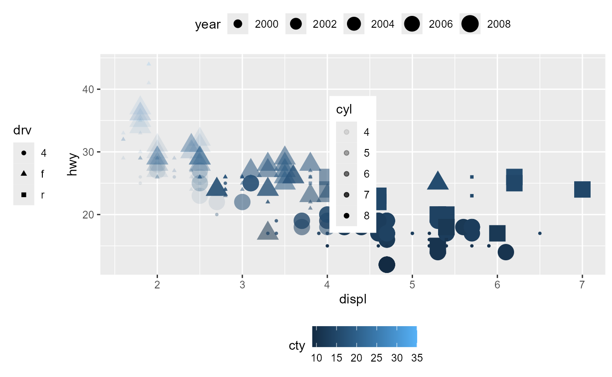
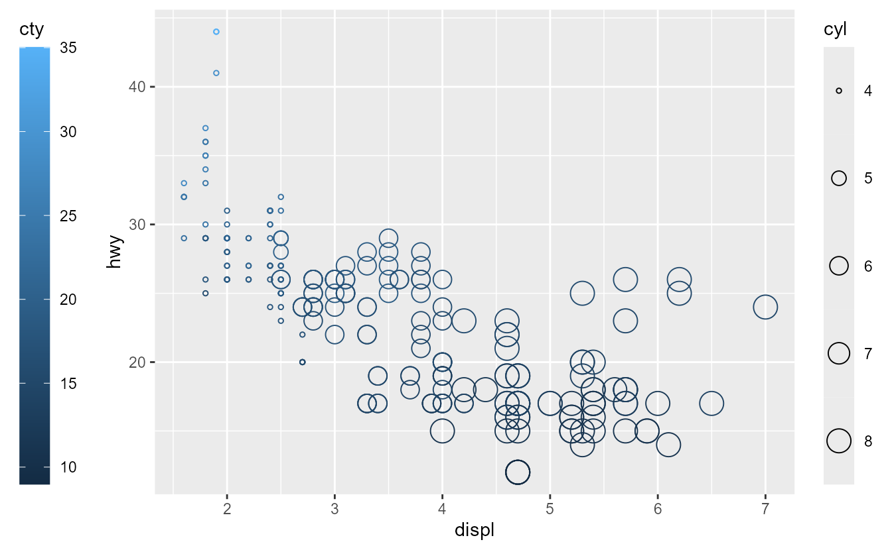
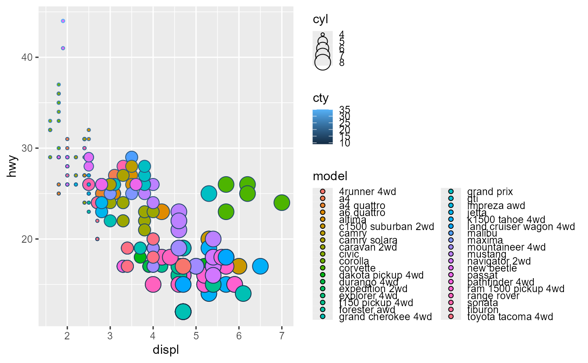

<!--
TODO:
* [x] Look over / edit the post's title in the yaml
* [x] Edit (or delete) the description; note this appears in the Twitter card
* [x] Pick category and tags (see existing with [`hugodown::tidy_show_meta()`](https://rdrr.io/pkg/hugodown/man/use_tidy_post.html))
* [x] Find photo & update yaml metadata
* [x] Create `thumbnail-sq.jpg`; height and width should be equal
* [x] Create `thumbnail-wd.jpg`; width should be >5x height
* [x] [`hugodown::use_tidy_thumbnails()`](https://rdrr.io/pkg/hugodown/man/use_tidy_post.html)
* [x] Add intro sentence, e.g. the standard tagline for the package
* [x] [`usethis::use_tidy_thanks()`](https://usethis.r-lib.org/reference/use_tidy_thanks.html)
-->

We're overjoyed to release [ggplot2](https://ggplot2.tidyverse.org) 3.5.0. This is the second blogpost outlining improvements to ggplot2's guide system, which underwent a large rewrite. Please find the [main post](#TODO:%20link) to read about other exciting changes.

Guides, like axes and legends, are visual representations of scales and allow observers to translate graphical properties of a plot into information. Guides were the last remaining system in ggplot2 that clung to the S3 system. The guide system have now been rewritten in ggproto, the object-oriented system that powers ggplot2's extension mechanism. Like geoms, stats, scales, facets and coords before it, guides officially become an extension point that lets developers implement their own guides. We will start off discussing the user-facing changes to guides and later veer into extension territory.

You can see a full list of changes in the [release notes](https://ggplot2.tidyverse.org/news/index.html).

<pre class='chroma'><code class='language-r' data-lang='r'><a href='https://rdrr.io/r/base/library.html'>library</a>(<a href='https://ggplot2.tidyverse.org'>ggplot2</a>)
<a href='https://rdrr.io/r/base/library.html'>library</a>(<a href='https://patchwork.data-imaginist.com'>patchwork</a>)</code></pre>

## General

One of the more visible user-facing changes is that guides no longer have style arguments. All of the style settings, like the 'frame' in colour bars or text positions, are controllable via the [`theme()`](https://ggplot2.tidyverse.org/reference/theme.html) function. This makes it easier to globally control the appearance of legends. To tweak the style of any individual guide, guides now have a `theme` argument that can set style elements. In the plot below, notice how the legend title settings affect both the colour bar and the legend, whereas the local options, like the red legend text, apply only to a single guide.

<pre class='chroma'><code class='language-r' data-lang='r'><a href='https://ggplot2.tidyverse.org/reference/ggplot.html'>ggplot</a>(mpg, <a href='https://ggplot2.tidyverse.org/reference/aes.html'>aes</a>(displ, hwy, shape = <a href='https://rdrr.io/r/base/factor.html'>factor</a>(cyl), colour = cty)) +
  <a href='https://ggplot2.tidyverse.org/reference/geom_point.html'>geom_point</a>() +
  # Styling individual guides
  <a href='https://ggplot2.tidyverse.org/reference/guides.html'>guides</a>(
    x = <a href='https://ggplot2.tidyverse.org/reference/guide_axis.html'>guide_axis</a>(theme = <a href='https://ggplot2.tidyverse.org/reference/theme.html'>theme</a>(axis.line = <a href='https://ggplot2.tidyverse.org/reference/element.html'>element_line</a>())),
    shape = 
      <a href='https://ggplot2.tidyverse.org/reference/guide_legend.html'>guide_legend</a>(theme = <a href='https://ggplot2.tidyverse.org/reference/theme.html'>theme</a>(legend.text = <a href='https://ggplot2.tidyverse.org/reference/element.html'>element_text</a>(colour = "red"))),
    colour =
      <a href='https://ggplot2.tidyverse.org/reference/guide_colourbar.html'>guide_colorbar</a>(theme = <a href='https://ggplot2.tidyverse.org/reference/theme.html'>theme</a>(legend.frame = <a href='https://ggplot2.tidyverse.org/reference/element.html'>element_rect</a>(colour = "red")))
  ) +
  # Styling guides globally
  <a href='https://ggplot2.tidyverse.org/reference/theme.html'>theme</a>(
    legend.title.position = "left",
    legend.title = <a href='https://ggplot2.tidyverse.org/reference/element.html'>element_text</a>(angle = 90, hjust = 0.5)
  )
</code></pre>

## Legends

For the purposes of this post, 'legend' will refer to all guides that are not axes. As the term 'legend' suggests, this includes [`guide_legend()`](https://ggplot2.tidyverse.org/reference/guide_legend.html) but also [`guide_colourbar()`](https://ggplot2.tidyverse.org/reference/guide_colourbar.html), [`guide_bins()`](https://ggplot2.tidyverse.org/reference/guide_bins.html) and [`guide_coloursteps()`](https://ggplot2.tidyverse.org/reference/guide_coloursteps.html). It explicitly excludes all types of axes.

### Position placement

Legend positions are no longer restricted to just a single side of the plot. By setting the `position` argument of guides, you can tailor which guides appears where in the plot. Guides that do not have a position set, like the 'drv' shape legend, follow the theme's `legend.position` setting.

<pre class='chroma'><code class='language-r' data-lang='r'>p &lt;- <a href='https://ggplot2.tidyverse.org/reference/ggplot.html'>ggplot</a>(mpg, <a href='https://ggplot2.tidyverse.org/reference/aes.html'>aes</a>(displ, hwy, shape = drv, colour = cty, size = year)) +
  <a href='https://ggplot2.tidyverse.org/reference/geom_point.html'>geom_point</a>(<a href='https://ggplot2.tidyverse.org/reference/aes.html'>aes</a>(alpha = cyl)) +
  <a href='https://ggplot2.tidyverse.org/reference/guides.html'>guides</a>(
    colour = <a href='https://ggplot2.tidyverse.org/reference/guide_colourbar.html'>guide_colourbar</a>(position = "bottom"),
    size   = <a href='https://ggplot2.tidyverse.org/reference/guide_legend.html'>guide_legend</a>(position = "top"),
    alpha  = <a href='https://ggplot2.tidyverse.org/reference/guide_legend.html'>guide_legend</a>(position = "inside")
  ) +
  <a href='https://ggplot2.tidyverse.org/reference/theme.html'>theme</a>(legend.position = "left")
p
</code></pre>

In the plot above, the legend for the 'cyl' variable is in the middle of the plot. In previous versions of ggplot2, you could set the `legend.position` to a coordinate to control the placement. However, doing this would change the default legend position, which is not always desirable. To cover such cases, there is now a specialised `legend.position.inside` argument that controls the positioning of legends with `position = "inside"` regardless of whether the position was specified in the theme or in the guide.

<pre class='chroma'><code class='language-r' data-lang='r'>p + <a href='https://ggplot2.tidyverse.org/reference/theme.html'>theme</a>(legend.position.inside = <a href='https://rdrr.io/r/base/c.html'>c</a>(0.7, 0.7))
</code></pre>

The justification of legends is controllable by using the `legend.justification.{position}` theme setting. Moreover, the top and bottom guides can be aligned to the plot rather than the panel by setting the `legend.location` argument. The main reason behind this is that you can then align the legends with the plot's title. By default, when `plot.title.position = "plot"`, left legends are already aligned. For this reason, the top and bottom guides are prioritised for the `legend.location` setting. Moreover, it avoids overlapping of legends in the corners if the justifications would dictate it.

<pre class='chroma'><code class='language-r' data-lang='r'>p + 
  <a href='https://ggplot2.tidyverse.org/reference/labs.html'>labs</a>(title = "Plot-aligned title") +
  <a href='https://ggplot2.tidyverse.org/reference/theme.html'>theme</a>(
    legend.margin = <a href='https://ggplot2.tidyverse.org/reference/element.html'>margin</a>(0, 0, 0, 0), # turned off for alignment
    legend.justification.top = "left",
    legend.justification.left = "top",
    legend.justification.bottom = "right",
    legend.justification.inside = <a href='https://rdrr.io/r/base/c.html'>c</a>(1, 1),
    legend.location = "plot",
    plot.title.position = "plot"
  )
</code></pre>

### Awareness

Legends are now more aware what discrete variables should be placed in which keys. By default, they now only draw keys for the layer which contain the relevant value. This saves one having to hassle with the `guide_legend(override.aes)` argument to get the keys to display just right. In the plot below, notice how the points and line have separate keys.

<pre class='chroma'><code class='language-r' data-lang='r'>p &lt;- <a href='https://ggplot2.tidyverse.org/reference/ggplot.html'>ggplot</a>(mpg, <a href='https://ggplot2.tidyverse.org/reference/aes.html'>aes</a>(displ, hwy)) +
  <a href='https://ggplot2.tidyverse.org/reference/scale_manual.html'>scale_alpha_manual</a>(values = <a href='https://rdrr.io/r/base/c.html'>c</a>(0.5, 1))
p +
  <a href='https://ggplot2.tidyverse.org/reference/geom_point.html'>geom_point</a>(<a href='https://ggplot2.tidyverse.org/reference/aes.html'>aes</a>(colour = "points", alpha = "points")) +
  <a href='https://ggplot2.tidyverse.org/reference/geom_path.html'>geom_line</a>(
    <a href='https://ggplot2.tidyverse.org/reference/aes.html'>aes</a>(colour = "line", alpha = "line"),
    stat = "smooth", formula = y ~ x, method = "lm"
  )
</code></pre>

To revert back to the old behaviour, you can set the `show.legend = TRUE` option in the layers. Like before, the `show.legend` argument can still be set in an aesthetic-specific way. Setting it to `TRUE` means 'always show', `FALSE` means 'never show' and `NA` means 'show if found'.

<pre class='chroma'><code class='language-r' data-lang='r'>p +
  <a href='https://ggplot2.tidyverse.org/reference/geom_point.html'>geom_point</a>(
    <a href='https://ggplot2.tidyverse.org/reference/aes.html'>aes</a>(colour = "points", alpha = "points"),
    show.legend = TRUE # always show
  ) +
  <a href='https://ggplot2.tidyverse.org/reference/geom_path.html'>geom_line</a>(
    <a href='https://ggplot2.tidyverse.org/reference/aes.html'>aes</a>(colour = "line", alpha = "line"),
    stat = "smooth", formula = y ~ x, method = "lm",
    show.legend = <a href='https://rdrr.io/r/base/c.html'>c</a>(colour = NA, alpha = TRUE) # always show in alpha
  )
</code></pre>

### Legend spacing

In this release, the way spacing in legends work has been reworked.

-   The `legend.spacing{.x/.y}` theme setting is now used to space different guides apart. Previously, it was also used to space legend keys apart; that is no longer the case.
-   Spacing legend key-label pairs apart is now controlled by the `legend.key.spacing{.x/.y}` theme setting.
-   Spacing the labels from the keys is now controlled by the label element's `margin` argument.

Because the legend spacing and margin options can be a bit bewildering, a small overview is added below. One setting not included in the overview is `legend.spacing.x`, which only applies when `legend.box = "horizontal"`. Which exact text margin is relevant for spacing apart keys and labels, or titles and the rest of the guide, depends on the `legend.text.position` and `legend.title.position` theme elements.

When the titles and keys don't have explicit margins, appropriate margins are added automatically depending on the position. However, if you override the margins, they will be interpreted literally.

<pre class='chroma'><code class='language-r' data-lang='r'><a href='https://ggplot2.tidyverse.org/reference/ggplot.html'>ggplot</a>(mpg, <a href='https://ggplot2.tidyverse.org/reference/aes.html'>aes</a>(displ, hwy, colour = class)) +
  <a href='https://ggplot2.tidyverse.org/reference/geom_point.html'>geom_point</a>() +
  <a href='https://ggplot2.tidyverse.org/reference/guides.html'>guides</a>(colour = <a href='https://ggplot2.tidyverse.org/reference/guide_legend.html'>guide_legend</a>(ncol = 2)) +
  <a href='https://ggplot2.tidyverse.org/reference/theme.html'>theme</a>(
    legend.key.spacing.x = <a href='https://rdrr.io/r/grid/unit.html'>unit</a>(10, "pt"),
    legend.key.spacing.y = <a href='https://rdrr.io/r/grid/unit.html'>unit</a>(20, "pt"),
    legend.text = <a href='https://ggplot2.tidyverse.org/reference/element.html'>element_text</a>(margin = <a href='https://ggplot2.tidyverse.org/reference/element.html'>margin</a>(l = 0)),
    legend.title = <a href='https://ggplot2.tidyverse.org/reference/element.html'>element_text</a>(margin = <a href='https://ggplot2.tidyverse.org/reference/element.html'>margin</a>(b = 20))
  )
</code></pre>

For all intents and purposes, colour bar/step and bins guides are treated as legend guides with just a single key-label pair. While the `legend.key.spacing` setting does not apply due to it being one single key, the other spacings and margins do apply equally.

<pre class='chroma'><code class='language-r' data-lang='r'><a href='https://ggplot2.tidyverse.org/reference/ggplot.html'>ggplot</a>(mpg, <a href='https://ggplot2.tidyverse.org/reference/aes.html'>aes</a>(displ, hwy, colour = cty)) +
  <a href='https://ggplot2.tidyverse.org/reference/geom_point.html'>geom_point</a>() +
  <a href='https://ggplot2.tidyverse.org/reference/theme.html'>theme</a>(
    legend.text  = <a href='https://ggplot2.tidyverse.org/reference/element.html'>element_text</a>(margin = <a href='https://ggplot2.tidyverse.org/reference/element.html'>margin</a>(l = 0)),
    legend.title = <a href='https://ggplot2.tidyverse.org/reference/element.html'>element_text</a>(margin = <a href='https://ggplot2.tidyverse.org/reference/element.html'>margin</a>(b = 20))
  )
</code></pre>

### Stretching

Another experimental tweak to legends, is that they can now have stretching keys (or bars). The option is still considered 'experimental' because there are some things that may go wrong. By setting the `legend.key{.height/.width}` theme argument as a `"null"` unit, legends can now expand to fill the available space.

<pre class='chroma'><code class='language-r' data-lang='r'>p &lt;- <a href='https://ggplot2.tidyverse.org/reference/ggplot.html'>ggplot</a>(mpg, <a href='https://ggplot2.tidyverse.org/reference/aes.html'>aes</a>(displ, hwy)) +
  <a href='https://ggplot2.tidyverse.org/reference/geom_point.html'>geom_point</a>(<a href='https://ggplot2.tidyverse.org/reference/aes.html'>aes</a>(colour = cty, size = cyl), shape = 21) +
  <a href='https://ggplot2.tidyverse.org/reference/theme.html'>theme</a>(legend.key.height = <a href='https://rdrr.io/r/grid/unit.html'>unit</a>(1, "null"))
p
</code></pre>

The term 'available space' is a tricky one. For starters, other legends placed in the same position take up space, as can be seen in the plot above. If your legend is the only legend in a position, more space is available and it stretches more. As you can see in the plot below, the legends are not aligned with the panel even when stretched. This is because the titles, margins and various spacings all take up space that is *not* available.

<pre class='chroma'><code class='language-r' data-lang='r'>p + <a href='https://ggplot2.tidyverse.org/reference/guides.html'>guides</a>(colour = <a href='https://ggplot2.tidyverse.org/reference/guide_colourbar.html'>guide_colourbar</a>(position = "left"))
</code></pre>

On the other hand, if one position is packed with legends, the keys may shrink instead of stretch. The keys can become too small to show the aesthetics properly. You can see in the example below that the size legend becomes cut-off due to small keys and text is spaced too closely to comfortably read.

<pre class='chroma'><code class='language-r' data-lang='r'>p + <a href='https://ggplot2.tidyverse.org/reference/aes.html'>aes</a>(fill = model)
</code></pre>

Another issue that may come up is that the 'available space' might be 0. Because the plot itself is also space-filling, setting null-heights for top/bottom positions or null-widths for left/right positions means there is no available space. This may result in the keys or bars becoming invisible. For the plot below, recall that we've set the `legend.key.height` setting to a null unit.

<pre class='chroma'><code class='language-r' data-lang='r'>p + <a href='https://ggplot2.tidyverse.org/reference/theme.html'>theme</a>(legend.position = "top")
</code></pre>

### Other improvements

We welcome a new type of legend: [`guide_custom()`](https://ggplot2.tidyverse.org/reference/guide_custom.html). It can be used to add any graphical object (grob) to a plot, like [`annotation_custom()`](https://ggplot2.tidyverse.org/reference/annotation_custom.html). There are a few differences though: it is positioned just like a legend and adds titles and margins. In some sense, this guide is 'special', as it is the only guide that does not directly reflect a scale. The downside is that it cannot read properties from the plot, but the upside is that it is very flexible. Be careful that if your grob does not have an absolute size, to set the `width` and `height` arguments.

<pre class='chroma'><code class='language-r' data-lang='r'>x &lt;- <a href='https://rdrr.io/r/base/c.html'>c</a>(0.5, 1, 1.5, 1.2, 1.5, 1, 0.5, 0.8, 1, 1.15, 2, 1.15, 1, 0.85, 0, 0.85)
y &lt;- <a href='https://rdrr.io/r/base/c.html'>c</a>(1.5, 1.2, 1.5, 1, 0.5, 0.8, 0.5, 1, 2, 1.15, 1, 0.85, 0, 0.85, 1, 1.15)

compass_rose &lt;- grid::<a href='https://rdrr.io/r/grid/grid.polygon.html'>polygonGrob</a>(
  x = <a href='https://rdrr.io/r/grid/unit.html'>unit</a>(x, "cm"), y = <a href='https://rdrr.io/r/grid/unit.html'>unit</a>(y, "cm"), id.lengths = <a href='https://rdrr.io/r/base/c.html'>c</a>(8, 8),
  gp = grid::<a href='https://rdrr.io/r/grid/gpar.html'>gpar</a>(fill = <a href='https://rdrr.io/r/base/c.html'>c</a>("grey50", "grey25"), col = NA)
)

nc &lt;- sf::<a href='https://r-spatial.github.io/sf/reference/st_read.html'>st_read</a>(<a href='https://rdrr.io/r/base/system.file.html'>system.file</a>("shape/nc.shp", package = "sf"), quiet = TRUE)
<a href='https://ggplot2.tidyverse.org/reference/ggplot.html'>ggplot</a>(nc) +
  <a href='https://ggplot2.tidyverse.org/reference/ggsf.html'>geom_sf</a>(<a href='https://ggplot2.tidyverse.org/reference/aes.html'>aes</a>(fill = AREA)) +
  <a href='https://ggplot2.tidyverse.org/reference/guides.html'>guides</a>(custom = <a href='https://ggplot2.tidyverse.org/reference/guide_custom.html'>guide_custom</a>(compass_rose, title = "compass"))
</code></pre>

In previous version of ggplot2, when legend titles are wider than the legends, the guide-title alignment was always left aligned. Now, the justification setting of the legend text determines the alignment: 1 is right or top aligned and 0 is left or bottom aligned.

<pre class='chroma'><code class='language-r' data-lang='r'><a href='https://ggplot2.tidyverse.org/reference/ggplot.html'>ggplot</a>(mpg, <a href='https://ggplot2.tidyverse.org/reference/aes.html'>aes</a>(displ, hwy, shape = <a href='https://rdrr.io/r/base/factor.html'>factor</a>(cyl), colour = drv)) +
  <a href='https://ggplot2.tidyverse.org/reference/geom_point.html'>geom_point</a>() +
  <a href='https://ggplot2.tidyverse.org/reference/guides.html'>guides</a>(
    shape = <a href='https://ggplot2.tidyverse.org/reference/guide_legend.html'>guide_legend</a>(
      title = "A title that is pretty long",
      theme = <a href='https://ggplot2.tidyverse.org/reference/theme.html'>theme</a>(legend.title = <a href='https://ggplot2.tidyverse.org/reference/element.html'>element_text</a>(hjust = 1))
    ),
    colour = <a href='https://ggplot2.tidyverse.org/reference/guide_legend.html'>guide_legend</a>(
      title = "Another long title",
      theme = <a href='https://ggplot2.tidyverse.org/reference/theme.html'>theme</a>(legend.title = <a href='https://ggplot2.tidyverse.org/reference/element.html'>element_text</a>(hjust = 0))
    )
  )
</code></pre>

## Axes

Axes refer to position guides that reflect x- and y-scales. In some non-Cartesian coordinate systems, they may reflect a theta or radius, a longitude or latitude. Classically, they display labelled tick marks at regular intervals. The most common axis, is the default [`guide_axis()`](https://ggplot2.tidyverse.org/reference/guide_axis.html).

### Improvements

A much requested expansion of axis capabilities is the ability to draw minor ticks. To draw minor ticks, you can use the `minor.ticks` argument of [`guide_axis()`](https://ggplot2.tidyverse.org/reference/guide_axis.html).

<pre class='chroma'><code class='language-r' data-lang='r'>p &lt;- <a href='https://ggplot2.tidyverse.org/reference/ggplot.html'>ggplot</a>(mpg, <a href='https://ggplot2.tidyverse.org/reference/aes.html'>aes</a>(displ, hwy)) +
  <a href='https://ggplot2.tidyverse.org/reference/geom_point.html'>geom_point</a>() +
  <a href='https://ggplot2.tidyverse.org/reference/guides.html'>guides</a>(
    x = <a href='https://ggplot2.tidyverse.org/reference/guide_axis.html'>guide_axis</a>(minor.ticks = TRUE),
    y = <a href='https://ggplot2.tidyverse.org/reference/guide_axis.html'>guide_axis</a>(minor.ticks = TRUE)
  )
p
</code></pre>

The minor ticks are unlabelled ticks and follow the `minor_breaks` provided to the scale. Their length is determined by the `axis.minor.ticks.length` and their positional children. The rest of their appearance is inherited from the major ticks, as can be seen in the plot below where the minor ticks on the y-axis are also blue. To tweak their style separately from the major ticks, the `axis.minor.ticks.{x.bottom/x.top/y.left/y.right}` setting can be used. Please note that there is *no* `axis.minor.ticks` setting without the position suffixes, as they inherit from the major ticks.

<pre class='chroma'><code class='language-r' data-lang='r'>p + <a href='https://ggplot2.tidyverse.org/reference/scale_continuous.html'>scale_x_continuous</a>(minor_breaks = scales::<a href='https://scales.r-lib.org/reference/breaks_width.html'>breaks_width</a>(0.2)) +
  <a href='https://ggplot2.tidyverse.org/reference/theme.html'>theme</a>(
    axis.ticks.length = <a href='https://rdrr.io/r/grid/unit.html'>unit</a>(5, "pt"),
    axis.minor.ticks.length = <a href='https://ggplot2.tidyverse.org/reference/element.html'>rel</a>(0.5),
    axis.minor.ticks.x.bottom = <a href='https://ggplot2.tidyverse.org/reference/element.html'>element_line</a>(colour = 'red'),
    axis.ticks.y = <a href='https://ggplot2.tidyverse.org/reference/element.html'>element_line</a>(colour = "blue")
  )
</code></pre>

Axes can now also be 'capped' at the upper and lower end. We hesitate to call this improvement 'new', as it has been a part of base R plotting since time immemorial. When axes are capped, the axis line will not be drawn up to the panel edge, but up to the first and last breaks. Unsurprisingly, this only affects plots where the axis line is not blank.

<pre class='chroma'><code class='language-r' data-lang='r'><a href='https://ggplot2.tidyverse.org/reference/ggplot.html'>ggplot</a>(mpg, <a href='https://ggplot2.tidyverse.org/reference/aes.html'>aes</a>(displ, hwy)) +
  <a href='https://ggplot2.tidyverse.org/reference/geom_point.html'>geom_point</a>() +
  <a href='https://ggplot2.tidyverse.org/reference/guides.html'>guides</a>(
    x = <a href='https://ggplot2.tidyverse.org/reference/guide_axis.html'>guide_axis</a>(cap = "both"), # Cap both ends
    y = <a href='https://ggplot2.tidyverse.org/reference/guide_axis.html'>guide_axis</a>(cap = "upper") # Cap the upper end
  ) +
  <a href='https://ggplot2.tidyverse.org/reference/theme.html'>theme</a>(axis.line = <a href='https://ggplot2.tidyverse.org/reference/element.html'>element_line</a>())
</code></pre>

### Logarithmic axes

A new axis for displaying logarithmic (and related) scales has been added: [`guide_axis_logticks()`](https://ggplot2.tidyverse.org/reference/guide_axis_logticks.html). This axis draws three types of tick marks at log10-spaced positions. The ticks positions are placed in the original, untransformed data-space, so the axis plays well with scale- and coord-transformations. To accommodate a series of logarithmic-like transformations, such as [`scales::transform_pseudo_log()`](https://scales.r-lib.org/reference/transform_log.html) or [`scales::transform_asinh()`](https://scales.r-lib.org/reference/transform_asinh.html), scales that include 0 in their limits have the ticks mirrored around 0.

<pre class='chroma'><code class='language-r' data-lang='r'>r &lt;- <a href='https://rdrr.io/r/base/seq.html'>seq</a>(0.001, 0.999, length.out = 100)
df &lt;- <a href='https://rdrr.io/r/base/data.frame.html'>data.frame</a>(
  x = <a href='https://rdrr.io/r/stats/Cauchy.html'>qcauchy</a>(r),
  y = <a href='https://rdrr.io/r/stats/Lognormal.html'>qlnorm</a>(r)
)

p &lt;- <a href='https://ggplot2.tidyverse.org/reference/ggplot.html'>ggplot</a>(df, <a href='https://ggplot2.tidyverse.org/reference/aes.html'>aes</a>(x, y)) +
  <a href='https://ggplot2.tidyverse.org/reference/geom_path.html'>geom_line</a>() +
  <a href='https://ggplot2.tidyverse.org/reference/coord_trans.html'>coord_trans</a>(y = "reverse") +
  <a href='https://ggplot2.tidyverse.org/reference/scale_continuous.html'>scale_y_continuous</a>(
    transform = "log10",
    breaks = <a href='https://rdrr.io/r/base/c.html'>c</a>(0.1, 1, 10),
    guide = <a href='https://ggplot2.tidyverse.org/reference/guide_axis_logticks.html'>guide_axis_logticks</a>(long = 2, mid = 1, short = 0.5)
  ) +
  <a href='https://ggplot2.tidyverse.org/reference/scale_continuous.html'>scale_x_continuous</a>(
    transform = "asinh",
    breaks = <a href='https://rdrr.io/r/base/c.html'>c</a>(-100, -10, -1, 0, 1, 10, 100),
    guide = "axis_logticks"
  )
p
</code></pre>

The log-ticks axis supersedes the earlier [`annotation_logticks()`](https://ggplot2.tidyverse.org/reference/annotation_logticks.html) function. Because it is implemented as an axis, it has minimal fuss with the placement of labels and is immune to the clipping options in the coord. To mirror [`annotation_logticks()`](https://ggplot2.tidyverse.org/reference/annotation_logticks.html) more closely, you can set a negative tick length in the theme.

<pre class='chroma'><code class='language-r' data-lang='r'>p + <a href='https://ggplot2.tidyverse.org/reference/theme.html'>theme</a>(axis.ticks.length = <a href='https://rdrr.io/r/grid/unit.html'>unit</a>(-2.25, "pt"))
</code></pre>

Indirectly related to guides, [`facet_wrap()`](https://ggplot2.tidyverse.org/reference/facet_wrap.html) and [`facet_grid()`](https://ggplot2.tidyverse.org/reference/facet_grid.html) now have extended options for how axes should be displayed in between panels. Previously, axes in between panels were only displayed when using `facet_wrap(scales = "free")`. That is still the case, but there are more options available for [`facet_grid()`](https://ggplot2.tidyverse.org/reference/facet_grid.html) and fixed scales. Using the `axes = "all"` option, all axes are displayed, including those in between panels. Using `axes = "all_x"` or `"all_y"`, you can narrow down which axes are displayed. In addition, you can choose whether or not to display the labels of those axes with the `axis.labels` argument.

<pre class='chroma'><code class='language-r' data-lang='r'>p &lt;- <a href='https://ggplot2.tidyverse.org/reference/ggplot.html'>ggplot</a>(mpg, <a href='https://ggplot2.tidyverse.org/reference/aes.html'>aes</a>(displ, hwy)) +
  <a href='https://ggplot2.tidyverse.org/reference/geom_point.html'>geom_point</a>()

p + <a href='https://ggplot2.tidyverse.org/reference/facet_grid.html'>facet_grid</a>(year ~ drv, axes = "all", axis.labels = "all_y")
</code></pre>

### Theta axes

The next new axis guide is [`guide_axis_theta()`](https://ggplot2.tidyverse.org/reference/guide_axis_theta.html). It is a highly specialised axis for use in combination with the new [`coord_radial()`](https://ggplot2.tidyverse.org/reference/coord_polar.html). Instead of using `x`, `y`, `x.sec` and `y.sec` as one would for Cartesian coordinates, the axes are specified for the `r`, `r.sec`, `theta` and `theta.sec` guides. Because the theta guides are not linear and require different drawing logic, they are implemented as separate guides. They support many features of linear axes, such as capping and minor ticks, but lack dodging or text justification. When setting the `angle` argument, text is placed relative to the angle of the coordinates, as can be seen for the inner theta guide. The theta guides adhere to the `{setting}.theta` styling, and radial guides to the `{setting}.r` styling.

<pre class='chroma'><code class='language-r' data-lang='r'><a href='https://ggplot2.tidyverse.org/reference/ggplot.html'>ggplot</a>(mpg, <a href='https://ggplot2.tidyverse.org/reference/aes.html'>aes</a>(displ, hwy)) +
  <a href='https://ggplot2.tidyverse.org/reference/geom_point.html'>geom_point</a>() +
  <a href='https://ggplot2.tidyverse.org/reference/coord_polar.html'>coord_radial</a>(start = 0.25 * pi, end = 1.75 * pi, inner.radius = 0.3) +
  <a href='https://ggplot2.tidyverse.org/reference/guides.html'>guides</a>(
    theta     = <a href='https://ggplot2.tidyverse.org/reference/guide_axis_theta.html'>guide_axis_theta</a>(cap = "both", minor.ticks = TRUE),
    theta.sec = <a href='https://ggplot2.tidyverse.org/reference/guide_axis_theta.html'>guide_axis_theta</a>(angle = 0),
    r     = <a href='https://ggplot2.tidyverse.org/reference/guide_axis.html'>guide_axis</a>(cap = "both", minor.ticks = TRUE),
    r.sec = <a href='https://ggplot2.tidyverse.org/reference/guide_axis.html'>guide_axis</a>(angle = 0)
  ) +
  <a href='https://ggplot2.tidyverse.org/reference/theme.html'>theme</a>(
    axis.line.theta = <a href='https://ggplot2.tidyverse.org/reference/element.html'>element_line</a>(colour = "blue"),
    axis.line.r     = <a href='https://ggplot2.tidyverse.org/reference/element.html'>element_line</a>(colour = "red")
  )
</code></pre>

### Stacked axes

The last new axis is technically not an axis, but a way to combine axes. [`guide_axis_stack()`](https://ggplot2.tidyverse.org/reference/guide_axis_stack.html) can take multiple other axes and combine them by placing them next to oneanother. The first axis is placed next to the panel and subsequent axes are placed further away from the panel. As mentioned [at the beginning](#general), every guide now has its own `theme` argument. This can be used to customise individual axes that are part of [`guide_axis_stack()`](https://ggplot2.tidyverse.org/reference/guide_axis_stack.html), or set common elements like the axis line in the plot below.

<pre class='chroma'><code class='language-r' data-lang='r'><a href='https://ggplot2.tidyverse.org/reference/ggplot.html'>ggplot</a>(mpg, <a href='https://ggplot2.tidyverse.org/reference/aes.html'>aes</a>(displ, hwy)) +
  <a href='https://ggplot2.tidyverse.org/reference/geom_point.html'>geom_point</a>() +
  <a href='https://ggplot2.tidyverse.org/reference/guides.html'>guides</a>(x = <a href='https://ggplot2.tidyverse.org/reference/guide_axis_stack.html'>guide_axis_stack</a>(
    # Typical axis
    "axis",
    # Inverted ticks with no text
    <a href='https://ggplot2.tidyverse.org/reference/guide_axis.html'>guide_axis</a>(theme = <a href='https://ggplot2.tidyverse.org/reference/theme.html'>theme</a>(
      axis.ticks.length.x = <a href='https://ggplot2.tidyverse.org/reference/element.html'>rel</a>(-1), 
      axis.text = <a href='https://ggplot2.tidyverse.org/reference/element.html'>element_blank</a>()
    )),
    # Just the line
    <a href='https://ggplot2.tidyverse.org/reference/guide_axis.html'>guide_axis</a>(theme = <a href='https://ggplot2.tidyverse.org/reference/theme.html'>theme</a>(
      axis.ticks = <a href='https://ggplot2.tidyverse.org/reference/element.html'>element_blank</a>(), 
      axis.text  = <a href='https://ggplot2.tidyverse.org/reference/element.html'>element_blank</a>()
    )),
    theme = <a href='https://ggplot2.tidyverse.org/reference/theme.html'>theme</a>(axis.line = <a href='https://ggplot2.tidyverse.org/reference/element.html'>element_line</a>())
  ))
</code></pre>

## Extending guides

Guides have been rewritten in the ggproto system of object oriented programming, like much of the other components of ggplot2. With this rewrite, guides are officially open for extensions and may be extended in much the same way geoms, stats, facets and coord can already.

Guides are closely related to scales and aesthetics, so an important part of guides is taken information from the scale and translating it to a graphic. The way guides typically carry information about a scale's breaks and labels is the `key` variable. You can glance at what the keys of a guide contain by using the [`get_guide_data()`](https://ggplot2.tidyverse.org/reference/get_guide_data.html) function. Typically, they carry the scale's mapped aesthetic, the hexadecimal colours in the example below, what those aesthetics represent in the `.value` column and how they should be labelled in the `.label` column.

<pre class='chroma'><code class='language-r' data-lang='r'>p &lt;- <a href='https://ggplot2.tidyverse.org/reference/ggplot.html'>ggplot</a>(mpg, <a href='https://ggplot2.tidyverse.org/reference/aes.html'>aes</a>(displ, hwy, colour = drv)) +
  <a href='https://ggplot2.tidyverse.org/reference/geom_point.html'>geom_point</a>() +
  <a href='https://ggplot2.tidyverse.org/reference/scale_colour_discrete.html'>scale_colour_discrete</a>(
    labels = <a href='https://rdrr.io/r/base/c.html'>c</a>("4-wheel drive", "front wheel drive", "rear wheel drive")
  )

<a href='https://ggplot2.tidyverse.org/reference/get_guide_data.html'>get_guide_data</a>(p, "colour")
#&gt;    colour .value            .label
#&gt; 1 #F8766D      4     4-wheel drive
#&gt; 2 #00BA38      f front wheel drive
#&gt; 3 #619CFF      r  rear wheel drive
</code></pre>

Let's now make a first guide extension by adjusting the guide's key. Axes are most straightforward to extend because they are the least complicated. We'll make an axis that accepts custom values for the guide's `key`. We begin by making a custom ggproto class that inherits from the axis guide. An important extension point is the `extract_key()` method, which determines how break information is transferred from the scale to the guide. In our class, we reject the scale's reality and substitute our own.

<pre class='chroma'><code class='language-r' data-lang='r'>GuideKey &lt;- <a href='https://ggplot2.tidyverse.org/reference/ggproto.html'>ggproto</a>(
  "Guide", GuideAxis,
  
  # Some parameters are required, so it is easiest to copy the base Guide's
  # parameters into our new parameters.
  # We add a new 'key' parameter for our own guide.
  params = <a href='https://rdrr.io/r/base/c.html'>c</a>(GuideAxis$params, <a href='https://rdrr.io/r/base/list.html'>list</a>(key = NULL)),
  
  # It is important for guides to have a mapped aesthetic with the correct name
  extract_key = function(scale, aesthetic, key, ...) &#123;
    key$aesthetic &lt;- scale$map(key$aesthetic)
    <a href='https://rdrr.io/r/base/names.html'>names</a>(key)[<a href='https://rdrr.io/r/base/names.html'>names</a>(key) == "aesthetic"] &lt;- aesthetic
    key
  &#125;
)</code></pre>

Now we can make a guide constructor that creates a custom key to pass along on. The [`new_guide()`](https://ggplot2.tidyverse.org/reference/new_guide.html) functions instantiates a new guide with the given parameters. This function automatically rejects any parameters that are not in the class' `params` field, so it is important to declare these.

<pre class='chroma'><code class='language-r' data-lang='r'>guide_key &lt;- function(
  aesthetic, value = aesthetic, label = <a href='https://rdrr.io/r/base/character.html'>as.character</a>(aesthetic),
  ...,
  # Standard guide arguments
  theme = NULL, title = <a href='https://ggplot2.tidyverse.org/reference/waiver.html'>waiver</a>(), order = 0, position = <a href='https://ggplot2.tidyverse.org/reference/waiver.html'>waiver</a>()
) &#123;
  
  key &lt;- <a href='https://rdrr.io/r/base/data.frame.html'>data.frame</a>(aesthetic, .value = value, .label = label, ...)
  
  <a href='https://ggplot2.tidyverse.org/reference/new_guide.html'>new_guide</a>(
    # Arguments passed on to the GuideKey$params field
    key = key, theme = theme, title = title, order = order, position = position,
    # Declare which aesthetics are supported
    available_aes = <a href='https://rdrr.io/r/base/c.html'>c</a>("x", "y"),
    # Set the guide class
    super = GuideKey
  )
&#125;</code></pre>

The key can now be used inside the [`guides()`](https://ggplot2.tidyverse.org/reference/guides.html) function or as the `guide` argument in a position scale.

<pre class='chroma'><code class='language-r' data-lang='r'><a href='https://ggplot2.tidyverse.org/reference/ggplot.html'>ggplot</a>(mpg, <a href='https://ggplot2.tidyverse.org/reference/aes.html'>aes</a>(displ, hwy)) +
  <a href='https://ggplot2.tidyverse.org/reference/geom_point.html'>geom_point</a>() +
  <a href='https://ggplot2.tidyverse.org/reference/scale_continuous.html'>scale_x_continuous</a>(
    guide = guide_key(aesthetic = 2:6 + 0.5)
  )
</code></pre>

If we are feeling more adventurous, we can also alter they way guides are drawn. The majority of drawing code is in the `Guide$build_*()` methods, which is all orchestrated by the `Guide$draw()` method. For derived guides, such as the custom key guide we're extending here, overriding a `Guide$build_*()` method should be sufficient. If you are writing a completely novel guide that does not resemble the structure of any existing guide, overriding the `Guide$draw()` method might be wise.

In this example, we are changing the way the labels are drawn, so we should edit the `Guide$build_labels()` method. We'll edit the method so that the labels are drawn with a `colour` set in the key. In addition to the `key` and `params` variable we've seen before, we now also have an `elements` variable, which is a list of precomputed theme elements. We can use the `elements$text` element to draw a graphical object (grob) in the style of axis text. Perhaps the most finicky thing about drawing guides is that a lot of settings depend on the guide's `position` parameter.

<pre class='chroma'><code class='language-r' data-lang='r'># Same as before
GuideKey &lt;- <a href='https://ggplot2.tidyverse.org/reference/ggproto.html'>ggproto</a>(
  "Guide", GuideAxis,
  params = <a href='https://rdrr.io/r/base/c.html'>c</a>(GuideAxis$params, <a href='https://rdrr.io/r/base/list.html'>list</a>(key = NULL)),
  extract_key = function(scale, aesthetic, key, ...) &#123;
    key$aesthetic &lt;- scale$map(key$aesthetic)
    <a href='https://rdrr.io/r/base/names.html'>names</a>(key)[<a href='https://rdrr.io/r/base/names.html'>names</a>(key) == "aesthetic"] &lt;- aesthetic
    key
  &#125;,
  
  # New method to draw labels
  build_labels = function(key, elements, params) &#123;
    position &lt;- params$position
    # Downstream code expects a list of labels
    <a href='https://rdrr.io/r/base/list.html'>list</a>(<a href='https://ggplot2.tidyverse.org/reference/element_grob.html'>element_grob</a>(
      elements$text,
      label = key$.label,
      x = <a href='https://rdrr.io/r/base/switch.html'>switch</a>(position, left = 1, right = 0, key$x),
      y = <a href='https://rdrr.io/r/base/switch.html'>switch</a>(position, top = 0, bottom = 1, key$y),
      margin_x = position <a href='https://rdrr.io/r/base/match.html'>%in%</a> <a href='https://rdrr.io/r/base/c.html'>c</a>("left", "right"),
      margin_y = position <a href='https://rdrr.io/r/base/match.html'>%in%</a> <a href='https://rdrr.io/r/base/c.html'>c</a>("top", "bottom"),
      colour = key$colour
    ))
  &#125;
)</code></pre>

Because we are incorporating the `...` argument to `guide_key()` in the key, adding a `colour` column to the key is straightforward. We can check that are guide looks correct in the different positions around the panel.

<pre class='chroma'><code class='language-r' data-lang='r'><a href='https://ggplot2.tidyverse.org/reference/ggplot.html'>ggplot</a>(mpg, <a href='https://ggplot2.tidyverse.org/reference/aes.html'>aes</a>(displ, hwy)) +
  <a href='https://ggplot2.tidyverse.org/reference/geom_point.html'>geom_point</a>() +
  <a href='https://ggplot2.tidyverse.org/reference/guides.html'>guides</a>(
    x = guide_key(
      aesthetic = 2:6 + 0.5,
      colour = <a href='https://rdrr.io/r/base/c.html'>c</a>("red", "grey", "red", "grey", "red")
    ),
    x.sec = guide_key(
      aesthetic = <a href='https://rdrr.io/r/base/c.html'>c</a>(2, 4, 6), 
      colour = <a href='https://rdrr.io/r/base/c.html'>c</a>("tomato", "limegreen", "dodgerblue")
    )
  )
</code></pre>

If you feel like trying out extending guides yourself, here are some exercises to consider:

-   Extend `guide_key()` to also pass on `family`, `face` and `size` aesthetics from the key to the labels.
-   Override the `GuideKey$build_ticks()` method to also pass on `colour` and `linewidth` settings to the tick marks. Looking at `Guide$build_ticks()` is a good starting point.
-   Compare `GuideKey$extract_key()` to `Guide$extract_key()`. What steps have been skimmed over in the example?

## Acknowledgements

A heartfelt thank you to all the people who have contributed their thoughts and code to the 3.5.0 release of ggplot2!

[@aarongraybill](https://github.com/aarongraybill), [@aphalo](https://github.com/aphalo), [@ashgreat](https://github.com/ashgreat), [@banbh](https://github.com/banbh), [@benimwolfspelz](https://github.com/benimwolfspelz), [@ccsarapas](https://github.com/ccsarapas), [@danielneilson](https://github.com/danielneilson), [@danli349](https://github.com/danli349), [@davidhodge931](https://github.com/davidhodge931), [@dieghernan](https://github.com/dieghernan), [@edent](https://github.com/edent), [@eliocamp](https://github.com/eliocamp), [@f2il-kieranmace](https://github.com/f2il-kieranmace), [@garyzhubc](https://github.com/garyzhubc), [@Generalized](https://github.com/Generalized), [@giadasp](https://github.com/giadasp), [@jan-glx](https://github.com/jan-glx), [@jimjam-slam](https://github.com/jimjam-slam), [@jtlandis](https://github.com/jtlandis), [@jttoivon](https://github.com/jttoivon), [@klin333](https://github.com/klin333), [@krlmlr](https://github.com/krlmlr), [@manjumc1975](https://github.com/manjumc1975), [@math-mcshane](https://github.com/math-mcshane), [@matthewjnield](https://github.com/matthewjnield), [@mjskay](https://github.com/mjskay), [@olivroy](https://github.com/olivroy), [@paulatn240](https://github.com/paulatn240), [@retodomax](https://github.com/retodomax), [@Rong-Zh](https://github.com/Rong-Zh), [@steveharoz](https://github.com/steveharoz), [@tbates](https://github.com/tbates), [@teunbrand](https://github.com/teunbrand), [@thomasp85](https://github.com/thomasp85), [@tjebo](https://github.com/tjebo), [@vnijs](https://github.com/vnijs), [@warnes](https://github.com/warnes), [@wbvguo](https://github.com/wbvguo), [@willgearty](https://github.com/willgearty), [@Yunuuuu](https://github.com/Yunuuuu), and [@yuw444](https://github.com/yuw444).

