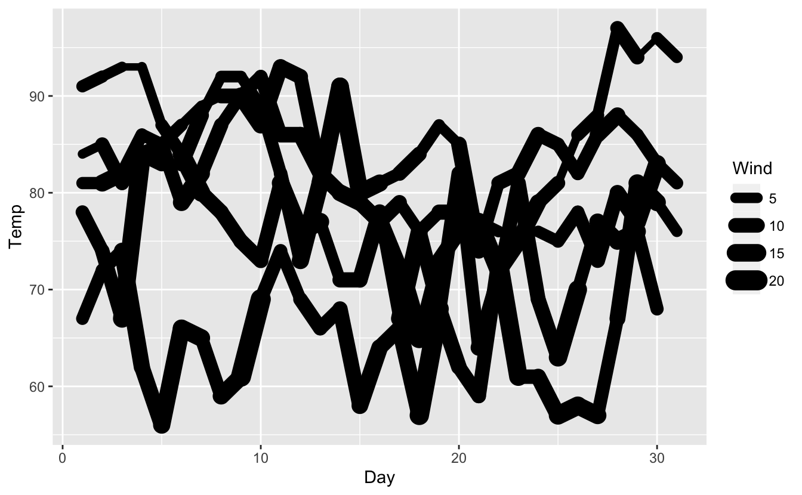
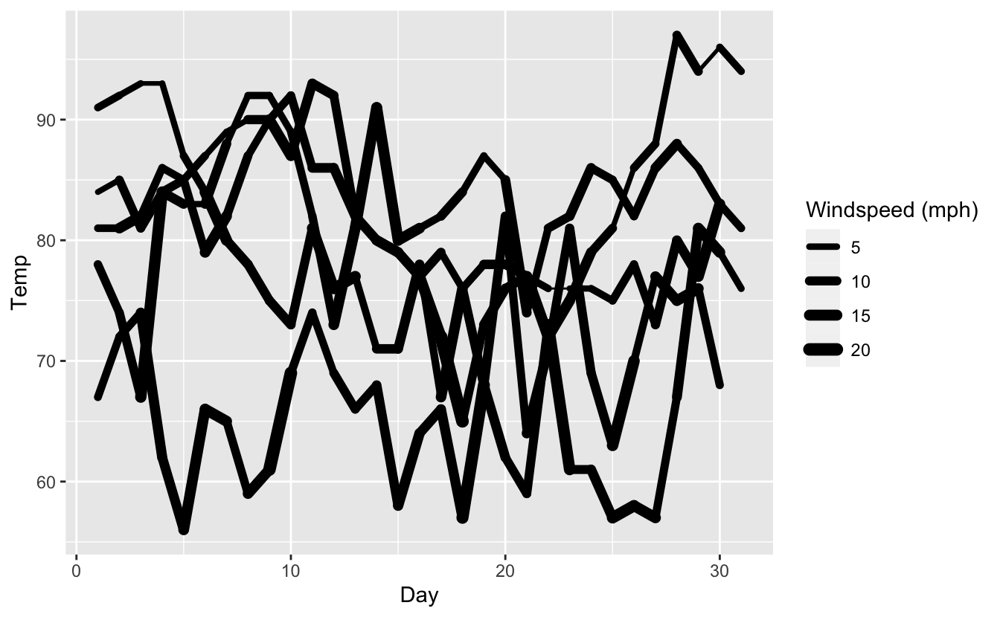
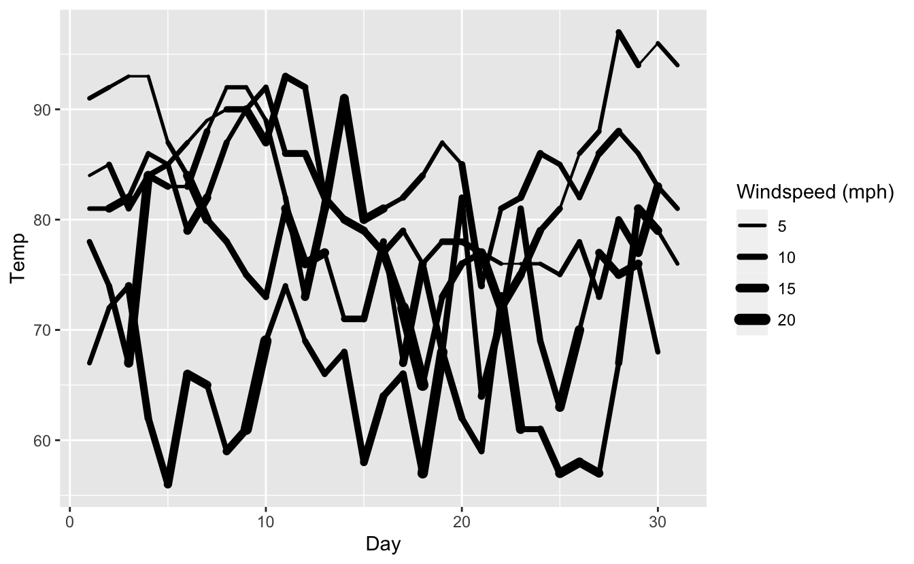
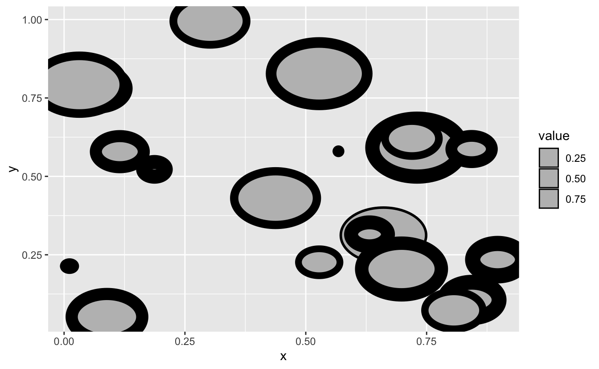
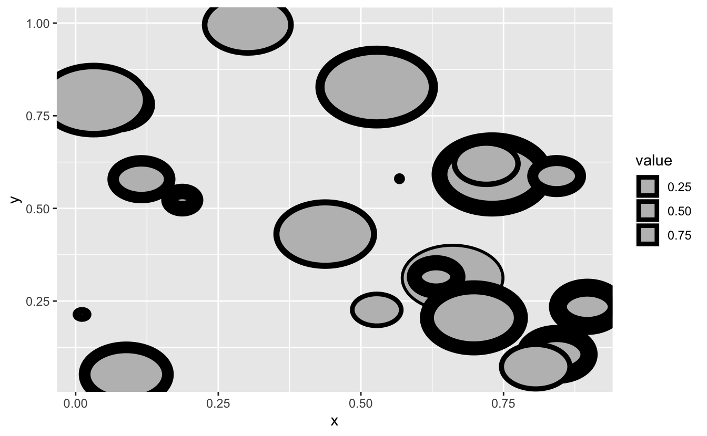
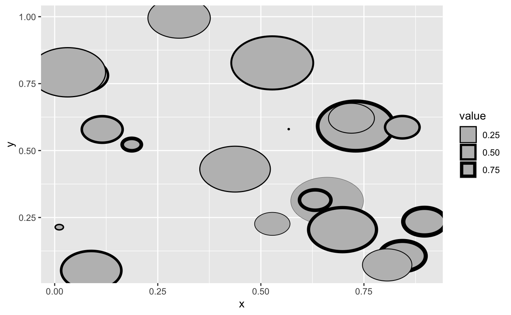

We are hard at work finishing the next release of ggplot2. While this release is mostly about internal changes, there are a few quite user visible changes as well. One of these upends the idea that the `size` aesthetic is responsible for *both* the sizing of point/text and the width of lines. With the next release we will have a `linewidth` aesthetic to take care of the latter, while `size` will continue handling the former.

There are many excellent reasons for this change, all of which will have to wait until the release post to be discussed. This blog post is for those that maintain an extension package for ggplot2 and are left wondering how they should respond to this --- if that is you, please read on!

## The way it works

Before going into technicalities we'll describe how it is intended to work. We are well aware that we can't just make a change that would instantly break everyone's code. So, we have gone to great length to make old code work as before while gently coercing users into adopting the news paradigm. For example, take a look at this piece of old code:

<pre class='chroma'><code class='language-r' data-lang='r'><a href='https://rdrr.io/r/base/library.html'>library</a>(<a href='https://ggplot2.tidyverse.org'>ggplot2</a>)

<a href='https://ggplot2.tidyverse.org/reference/ggplot.html'>ggplot</a>(airquality) + 
  <a href='https://ggplot2.tidyverse.org/reference/geom_path.html'>geom_line</a>(
    <a href='https://ggplot2.tidyverse.org/reference/aes.html'>aes</a>(x = Day, y = Temp, size = Wind, group = Month), 
    lineend = "round"
  )
#&gt; size aesthetic has been deprecated for use with lines as of ggplot2 3.4.0
#&gt; ℹ Please use linewidth aesthetic instead
#&gt; This message is displayed once every 8 hours.
</code></pre>

As you can see, ggplot2 detects the use of the `size` aesthetic and informs the user about the new `linewidth` aesthetic but otherwise proceeds as before, producing the expected plot. As expected, [`scale_size()`](https://ggplot2.tidyverse.org/reference/scale_size.html) also works in this situation:

<pre class='chroma'><code class='language-r' data-lang='r'><a href='https://ggplot2.tidyverse.org/reference/ggplot.html'>ggplot</a>(airquality) + 
  <a href='https://ggplot2.tidyverse.org/reference/geom_path.html'>geom_line</a>(
    <a href='https://ggplot2.tidyverse.org/reference/aes.html'>aes</a>(x = Day, y = Temp, size = Wind, group = Month), 
    lineend = "round"
  ) + 
  <a href='https://ggplot2.tidyverse.org/reference/scale_size.html'>scale_size</a>("Windspeed (mph)", range = <a href='https://rdrr.io/r/base/c.html'>c</a>(0.5, 3))
#&gt; size aesthetic has been deprecated for use with lines as of ggplot2 3.4.0
#&gt; ℹ Please use linewidth aesthetic instead
#&gt; This message is displayed once every 8 hours.
</code></pre>

but ultimately we of course wants users to migrate to the following code:

<pre class='chroma'><code class='language-r' data-lang='r'><a href='https://ggplot2.tidyverse.org/reference/ggplot.html'>ggplot</a>(airquality) + 
  <a href='https://ggplot2.tidyverse.org/reference/geom_path.html'>geom_line</a>(
    <a href='https://ggplot2.tidyverse.org/reference/aes.html'>aes</a>(x = Day, y = Temp, linewidth = Wind, group = Month), 
    lineend = "round"
  ) + 
  <a href='https://ggplot2.tidyverse.org/reference/scale_linewidth.html'>scale_linewidth</a>("Windspeed (mph)", range = <a href='https://rdrr.io/r/base/c.html'>c</a>(0.5, 3))
</code></pre>

> The last two plots are not equal because the `default` `linewidth` scale correctly use a linear transform instead of a square root transform

## How to adopt this

We have been able to add this automatic translation in a quite non-intrusive way which means that you as a package developer don't need to do that much to adapt to the new naming. To show this I'll create a geom drawing circles and then update it to using linewidth instead:

<pre class='chroma'><code class='language-r' data-lang='r'>GeomCircle &lt;- <a href='https://ggplot2.tidyverse.org/reference/ggproto.html'>ggproto</a>("GeomCircle", Geom,
  draw_panel = function(data, panel_params, coord) &#123;
    # Expand x, y, radius data to points along circle
    circle_data &lt;- <a href='https://rdrr.io/r/base/funprog.html'>Map</a>(function(x, y, r) &#123;
      radians &lt;- <a href='https://rdrr.io/r/base/seq.html'>seq</a>(0, 2*pi, length.out = 101)[-1]
      <a href='https://rdrr.io/r/base/data.frame.html'>data.frame</a>(
        x = <a href='https://rdrr.io/r/base/Trig.html'>cos</a>(radians) * r + x,
        y = <a href='https://rdrr.io/r/base/Trig.html'>sin</a>(radians) * r + y
      )
    &#125;, x = data$x, y = data$y, r = data$radius)
    
    circle_data &lt;- <a href='https://rdrr.io/r/base/do.call.html'>do.call</a>(rbind, circle_data)
    
    # Transform to viewport coords
    circle_data &lt;- coord$transform(circle_data, panel_params)
    
    # Draw as grob
    grid::<a href='https://rdrr.io/r/grid/grid.polygon.html'>polygonGrob</a>(
      x = circle_data$x,
      y = circle_data$y,
      id.lengths = <a href='https://rdrr.io/r/base/rep.html'>rep</a>(100, <a href='https://rdrr.io/r/base/nrow.html'>nrow</a>(data)),
      default.units = "native",
      gp = grid::<a href='https://rdrr.io/r/grid/gpar.html'>gpar</a>(
        col = data$colour,
        fill = data$fill,
        lwd = data$size * .pt,
        lty = data$linetype
      )
    )
  &#125;,
  required_aes = <a href='https://rdrr.io/r/base/c.html'>c</a>("x", "y", "radius"),
  default_aes = <a href='https://ggplot2.tidyverse.org/reference/aes.html'>aes</a>(
    colour = "black",
    fill = "grey",
    size = 0.5,
    linetype = 1,
    alpha = NA
  ),
  draw_key = draw_key_polygon
)

geom_circle &lt;- function(mapping = NULL, data = NULL, stat = "identity", 
                        position = "identity", ..., na.rm = FALSE, 
                        show.legend = NA, inherit.aes = TRUE) &#123;
  <a href='https://ggplot2.tidyverse.org/reference/layer.html'>layer</a>(
    data = data,
    mapping = mapping,
    stat = stat,
    geom = GeomCircle,
    position = position,
    show.legend = show.legend,
    inherit.aes = inherit.aes,
    params = <a href='https://rdrr.io/r/base/list.html'>list</a>(
      na.rm = na.rm,
      ...
    )
  )
&#125;</code></pre>

As a sanity check, let us check that this actually works:

<pre class='chroma'><code class='language-r' data-lang='r'>random_points &lt;- <a href='https://rdrr.io/r/base/data.frame.html'>data.frame</a>(
  x = <a href='https://rdrr.io/r/stats/Uniform.html'>runif</a>(20),
  y = <a href='https://rdrr.io/r/stats/Uniform.html'>runif</a>(20),
  radius = <a href='https://rdrr.io/r/stats/Uniform.html'>runif</a>(20, max = 0.1),
  value = <a href='https://rdrr.io/r/stats/Uniform.html'>runif</a>(20)
)

<a href='https://ggplot2.tidyverse.org/reference/ggplot.html'>ggplot</a>(random_points) + 
  geom_circle(<a href='https://ggplot2.tidyverse.org/reference/aes.html'>aes</a>(x = x, y = y, radius = radius, size = value))
</code></pre>

It seems to work as intended. As can be seen from the code above, the `size` aesthetics is not used much and is passed directly into `polygonGrob()`. It follows that updating the code to using linewidth is not a huge operation.

> There is nothing preventing you from keeping the code as is --- it will continue to work as always. However, your users may begin to feel a disconnect with the style as they adapt to the new `linewidth` aesthetic so it is highly recommended to make the proposed changes

### The fix

There are a few things you need to do to update the old code but they are all pretty benign. The changes are commented in the code below and will also be discussed afterwards

<pre class='chroma'><code class='language-r' data-lang='r'>GeomCircle &lt;- <a href='https://ggplot2.tidyverse.org/reference/ggproto.html'>ggproto</a>("GeomCircle", Geom,
  draw_panel = function(data, panel_params, coord) &#123;
    # Expand x, y, radius data to points along circle
    circle_data &lt;- <a href='https://rdrr.io/r/base/funprog.html'>Map</a>(function(x, y, r) &#123;
      radians &lt;- <a href='https://rdrr.io/r/base/seq.html'>seq</a>(0, 2*pi, length.out = 101)[-1]
      <a href='https://rdrr.io/r/base/data.frame.html'>data.frame</a>(
        x = <a href='https://rdrr.io/r/base/Trig.html'>cos</a>(radians) * r + x,
        y = <a href='https://rdrr.io/r/base/Trig.html'>sin</a>(radians) * r + y
      )
    &#125;, x = data$x, y = data$y, r = data$radius)
    
    circle_data &lt;- <a href='https://rdrr.io/r/base/do.call.html'>do.call</a>(rbind, circle_data)
    
    # Transform to viewport coords
    circle_data &lt;- coord$transform(circle_data, panel_params)
    
    # Draw as grob
    grid::<a href='https://rdrr.io/r/grid/grid.polygon.html'>polygonGrob</a>(
      x = circle_data$x,
      y = circle_data$y,
      id.lengths = <a href='https://rdrr.io/r/base/rep.html'>rep</a>(100, <a href='https://rdrr.io/r/base/nrow.html'>nrow</a>(data)),
      default.units = "native",
      gp = grid::<a href='https://rdrr.io/r/grid/gpar.html'>gpar</a>(
        col = data$colour,
        fill = data$fill,
        # Use linewidth or fall back to size in old ggplot2 versions
        lwd = (data$linewidth <a href='https://rlang.r-lib.org/reference/op-null-default.html'>%||%</a> data$size) * .pt,
        lty = data$linetype
      )
    )
  &#125;,
  required_aes = <a href='https://rdrr.io/r/base/c.html'>c</a>("x", "y", "radius"),
  default_aes = <a href='https://ggplot2.tidyverse.org/reference/aes.html'>aes</a>(
    colour = "black",
    fill = "grey",
    # Switch size to linewidth
    linewidth = 0.5,
    linetype = 1,
    alpha = NA
  ),
  draw_key = draw_key_polygon,
  # To allow using size in ggplot2 &lt; 3.4.0
  non_missing_aes = "size",
  
  # Tell ggplot2 to perform automatic renaming
  rename_size = TRUE
)</code></pre>

As we can see above, we need two changes and two additions to our implementation. First (but last in the code), we add `rename_size = TRUE` to our geom implementation. This instructs ggplot2 that this layer has a `size` aesthetic that should be converted automatically with a deprecation warning. Setting this to `TRUE` allows you to rest assured that as far as your code goes you can expect to have a `linewidth` aesthetic. Second, we updates the `default_aes` to use `linewidth` instead of `size`. Third, wherever we use `size` in our geom logic we instead use `linewidth %||% size`. The reason for the fallback is that if your package is used together with an older version of ggplot2 the `rename_size = TRUE` line has no effect and you need to fall back to `size` if that is what the user has specified. Fourth, we add `size` to the `non_missing_aes` field. As with the last point, this is only relevant for use with older versions of ggplot2 as it instructs the geom to not warn when `size` is used.

Let's try out the new implementation:

<pre class='chroma'><code class='language-r' data-lang='r'><a href='https://ggplot2.tidyverse.org/reference/ggplot.html'>ggplot</a>(random_points) + 
  geom_circle(<a href='https://ggplot2.tidyverse.org/reference/aes.html'>aes</a>(x = x, y = y, radius = radius, size = value))
#&gt; size aesthetic has been deprecated for use with lines as of ggplot2 3.4.0
#&gt; ℹ Please use linewidth aesthetic instead
#&gt; This message is displayed once every 8 hours.
</code></pre>

We see that we get the deprecation warning we know and that everything also renders as expected. Using the new naming also works, picks up the linear `linewidth` scale, and doesn't have a warning.

<pre class='chroma'><code class='language-r' data-lang='r'><a href='https://ggplot2.tidyverse.org/reference/ggplot.html'>ggplot</a>(random_points) + 
  geom_circle(<a href='https://ggplot2.tidyverse.org/reference/aes.html'>aes</a>(x = x, y = y, radius = radius, linewidth = value))
</code></pre>

The legend looks a bit wonky, but that is because the polygon key function caps the linewidth at a certain size relative to the size of the key. We can see that it works fine using a lower range:

<pre class='chroma'><code class='language-r' data-lang='r'><a href='https://ggplot2.tidyverse.org/reference/last_plot.html'>last_plot</a>() + <a href='https://ggplot2.tidyverse.org/reference/scale_linewidth.html'>scale_linewidth</a>(range = <a href='https://rdrr.io/r/base/c.html'>c</a>(0.1, 2))
</code></pre>

## FAQ

*I'm creating a geom as a subclass of one of the ggplot2 geoms that now uses `linewidth` --- what should I do?*

If your geom inherits from e.g. [`geom_polygon()`](https://ggplot2.tidyverse.org/reference/geom_polygon.html) which in the next version will begin using `linewidth` all you have to do is to update your code to refer to `linetype` instead of `size` if it uses that anywhere. Your geom will already inherit the correct `rename_size` value.

*I'm creating a stat --- should I do anything?*

Probably not. The only exception is if you set `size` in `default_aes` to a calculated value and the expectance is that the geom used with the stat will change to using `linewidth`. In such situations you should change the `default_aes` setting to use `linewidth` instead. We haven't had any such situations in the ggplot2 code base so the chance of this being relevant is pretty low.

*I'm creating a geom that uses `size` for both point sizing and line width --- how should I proceed?*

If you have a geom where `size` doubles for both point sizes and linewidth (an example from ggplot2 is [`geom_pointrange()`](https://ggplot2.tidyverse.org/reference/geom_linerange.html)) you shouldn't set `rename_size = TRUE` since `size` remains a valid aesthetic. However, you should add `linewidth` to `default_aes` and use this wherever in your code `size` was used for linewidth scaling before. Do note that this is a breaking change for your users since the same piece of code may no longer produce the same output.

