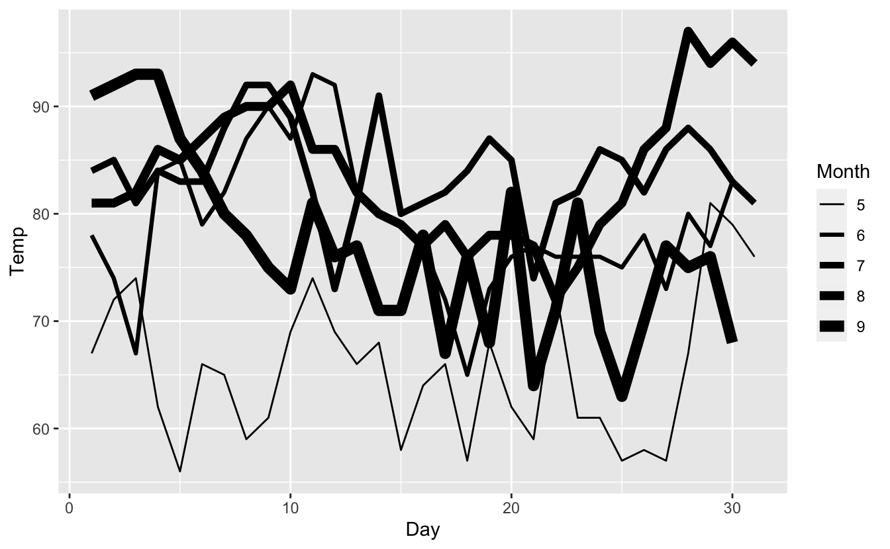
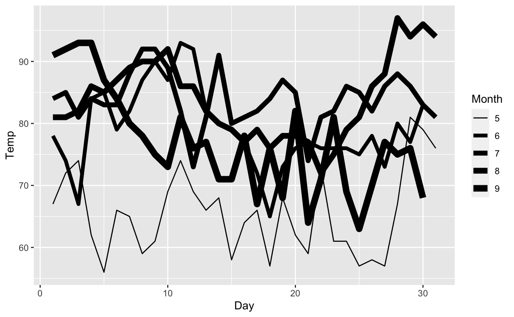
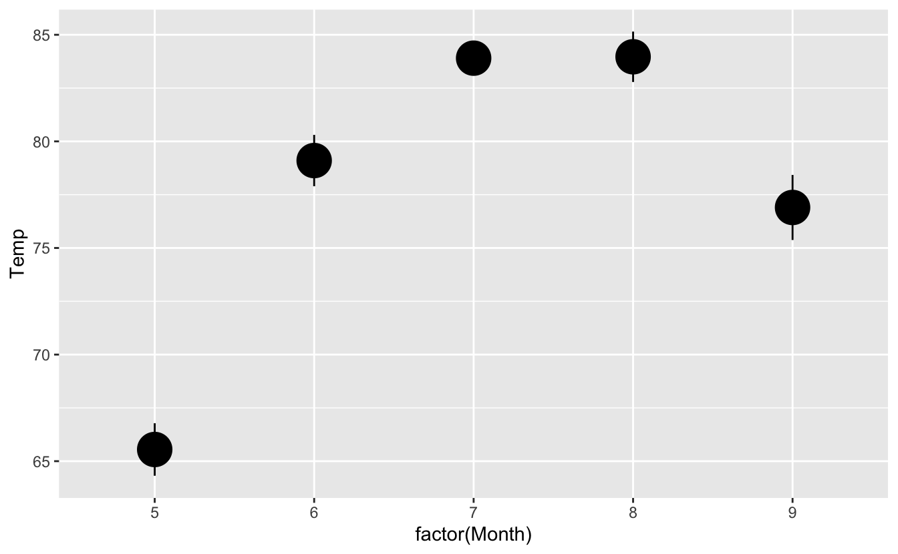
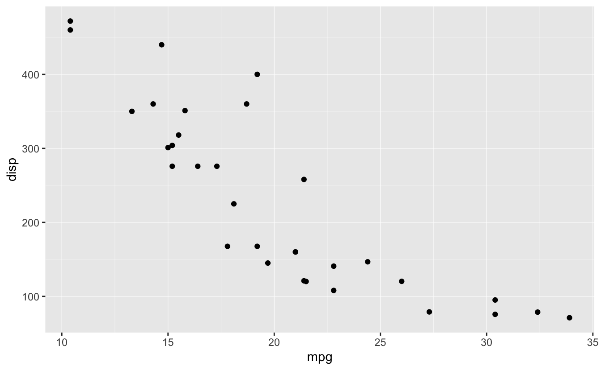
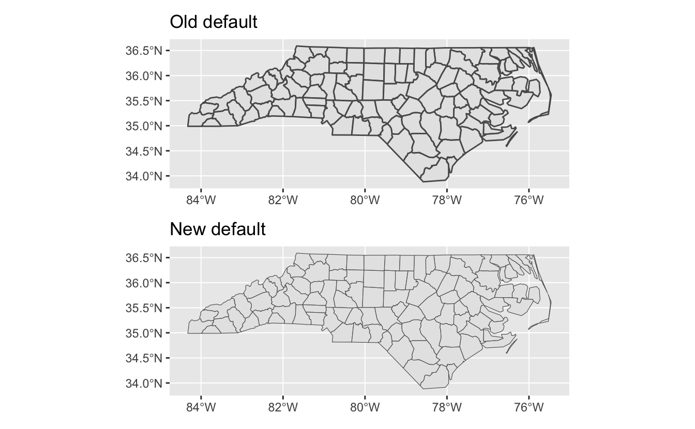
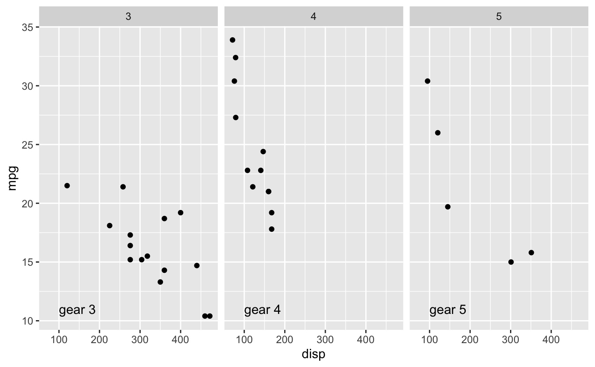
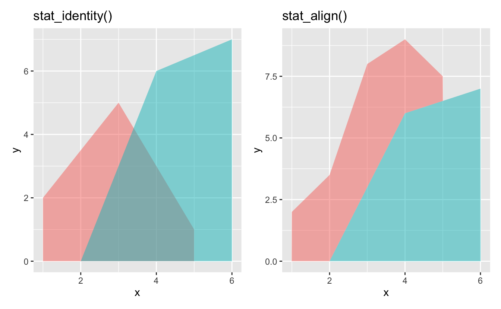
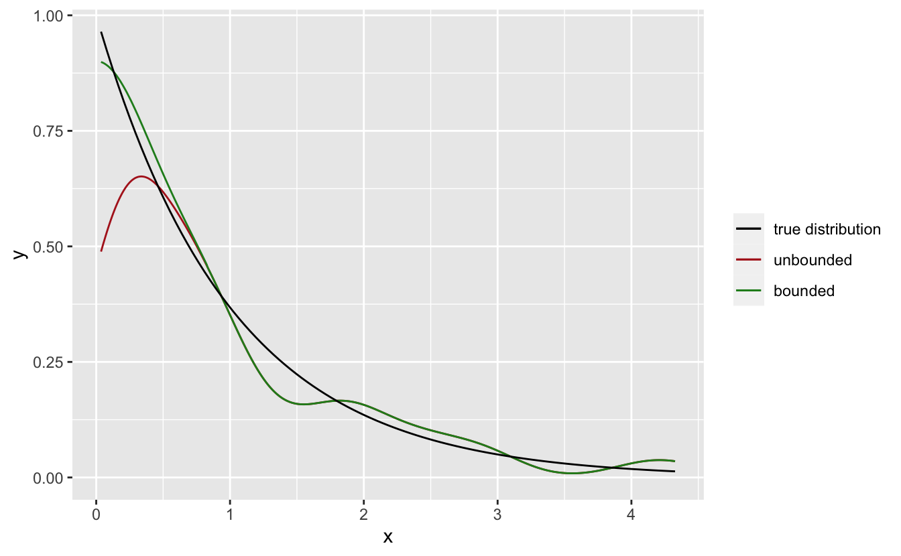
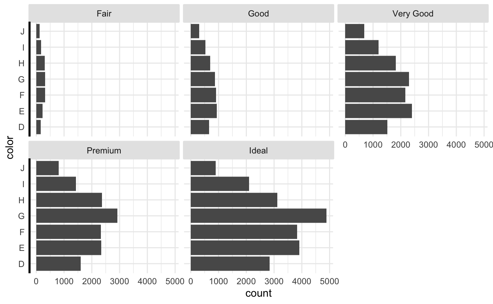

<!--
TODO:
* [ ] Look over / edit the post's title in the yaml
* [ ] Edit (or delete) the description; note this appears in the Twitter card
* [ ] Pick category and tags (see existing with [`hugodown::tidy_show_meta()`](https://rdrr.io/pkg/hugodown/man/use_tidy_post.html))
* [ ] Find photo & update yaml metadata
* [ ] Create `thumbnail-sq.jpg`; height and width should be equal
* [ ] Create `thumbnail-wd.jpg`; width should be >5x height
* [ ] [`hugodown::use_tidy_thumbnails()`](https://rdrr.io/pkg/hugodown/man/use_tidy_post.html)
* [ ] Add intro sentence, e.g. the standard tagline for the package
* [ ] [`usethis::use_tidy_thanks()`](https://usethis.r-lib.org/reference/use_tidy_thanks.html)
-->

We're so happy to announce the release of [ggplot2](https://ggplot2.tidyverse.org) 3.4.0 on CRAN. ggplot2 is a system for declaratively creating graphics, based on The Grammar of Graphics. You provide the data, tell ggplot2 how to map variables to aesthetics, what graphical primitives to use, and it takes care of the details. The new version can be installed from CRAN using `install.packages("ggplot2")`.

This release is not full of exciting new features. Instead we have focused on the internals, tightening up of the API, and improving the messaging, especially when it comes to errors and warnings. While the release also contains a few new features these other aspects are the stars of this release.

You can see a full list of changes in the [release notes](https://ggplot2.tidyverse.org/news/index.html)

<pre class='chroma'><code class='language-r' data-lang='r'><a href='https://rdrr.io/r/base/library.html'>library</a>(<a href='https://ggplot2.tidyverse.org'>ggplot2</a>)
<a href='https://rdrr.io/r/base/library.html'>library</a>(<a href='https://patchwork.data-imaginist.com'>patchwork</a>)
<a href='https://rdrr.io/r/base/library.html'>library</a>(<a href='https://dplyr.tidyverse.org'>dplyr</a>)</code></pre>

## Hello `linewidth`

Arguably the biggest user.visible change in this release is the introduction of a new fundamental aesthetic. From this release on, `linewidth` will take over sizing of the width of lines---something that was earlier handled by `size`. The reason for this change is that prior to this release `size` was used for two related, but different, properties: the size of points (and glyphs) and the width of lines. Since one is area based and one is length based they fundamentally needs different scaling and the default size scale has always catered to area sizing, using a square root transform. This conflation has also made it hard for composite geoms like [`geom_pointrange()`](https://ggplot2.tidyverse.org/reference/geom_linerange.html) to control the line width and point size separately.

There is not much to discuss when it comes to how to use this "feature", as it is a matter of switching out `size` with `linewidth` whenever you target stroke sizing:

<pre class='chroma'><code class='language-r' data-lang='r'><a href='https://ggplot2.tidyverse.org/reference/ggplot.html'>ggplot</a>(airquality) + 
  <a href='https://ggplot2.tidyverse.org/reference/geom_path.html'>geom_line</a>(<a href='https://ggplot2.tidyverse.org/reference/aes.html'>aes</a>(Day, Temp, linewidth = Month, group = Month)) + 
  <a href='https://ggplot2.tidyverse.org/reference/scale_linewidth.html'>scale_linewidth</a>(range = <a href='https://rdrr.io/r/base/c.html'>c</a>(0.5, 3))
</code></pre>

Now, changing such a fundamental thing when a package is as old and widely used as ggplot2 is no small undertaking, and I wish it had been done earlier, but better late than never. We have gone to great lengths to ensure that old code continues to work. For the most part using size will continue to behave like before:

<pre class='chroma'><code class='language-r' data-lang='r'><a href='https://ggplot2.tidyverse.org/reference/ggplot.html'>ggplot</a>(airquality) + 
  <a href='https://ggplot2.tidyverse.org/reference/geom_path.html'>geom_line</a>(<a href='https://ggplot2.tidyverse.org/reference/aes.html'>aes</a>(Day, Temp, size = Month, group = Month)) + 
  <a href='https://ggplot2.tidyverse.org/reference/scale_size.html'>scale_size</a>(range = <a href='https://rdrr.io/r/base/c.html'>c</a>(0.5, 3))
#&gt; Warning: Using `size` aesthetic for lines was deprecated in ggplot2 3.4.0.
#&gt; ℹ Please use `linewidth` instead.
</code></pre>

As you can see you get the expected plot but also gets a deprecation warning asking you to update your code. Comparing the two legends we can also see the discrepancy in scaling that we discussed above, showing a much more even progression with `linewidth`.

All of this should work with all the geoms provided by ggplot2 (and we have described [a clear upgrade path for extension developers to adopt this](https://www.tidyverse.org/blog/2022/08/ggplot2-3-4-0-size-to-linewidth/)), except for a few instances where `size` remains a valid aesthetic for the geom. In these cases you will not get a deprecation warning and your output may change in look when running old code. The two geoms this concerns are [`geom_pointrange()`](https://ggplot2.tidyverse.org/reference/geom_linerange.html) and [`geom_sf()`](https://ggplot2.tidyverse.org/reference/ggsf.html) which both continues to use `size` to scale points. Comparing the output from e.g. [`geom_pointrange()`](https://ggplot2.tidyverse.org/reference/geom_linerange.html) we can see how using `size` now only targets the point and not the line:

<pre class='chroma'><code class='language-r' data-lang='r'><a href='https://ggplot2.tidyverse.org/reference/ggplot.html'>ggplot</a>(airquality) + 
  <a href='https://ggplot2.tidyverse.org/reference/geom_linerange.html'>geom_pointrange</a>(<a href='https://ggplot2.tidyverse.org/reference/aes.html'>aes</a>(x = <a href='https://rdrr.io/r/base/factor.html'>factor</a>(Month), y = Temp), stat = "summary", size = 2)
#&gt; No summary function supplied, defaulting to `mean_se()`
</code></pre>

We recognize that introducing silent visual changes like this is not optimal but we weighted both sides and decided that it was better in the long run to rip the band-aid off and commit fully to the `linewidth` change in one release.

The switch to `linewidth` goes beyond aesthetics and should target every part of the API that have used `size` to target line width. This is mostly present in theming where [`element_rect()`](https://ggplot2.tidyverse.org/reference/element.html) and [`element_line()`](https://ggplot2.tidyverse.org/reference/element.html) now uses `linewidth` as argument instead of `size`. As above a deprecation warning will inform you of this change:

<pre class='chroma'><code class='language-r' data-lang='r'><a href='https://ggplot2.tidyverse.org/reference/ggplot.html'>ggplot</a>(mtcars) + 
  <a href='https://ggplot2.tidyverse.org/reference/geom_point.html'>geom_point</a>(<a href='https://ggplot2.tidyverse.org/reference/aes.html'>aes</a>(x = mpg, y = disp)) + 
  <a href='https://ggplot2.tidyverse.org/reference/theme.html'>theme</a>(panel.grid = <a href='https://ggplot2.tidyverse.org/reference/element.html'>element_line</a>(linewidth = 0.2))
</code></pre>

We have done our best to ensure that it is easy for our extension developers to follow the path laid out by ggplot2 when it comes to embracing the new aesthetic, but you will probably experience a period of discrepancy between some of your favorite extensions and ggplot2. I have full confidence that our amazing extension developers will adapt quickly so that period will probably be short.

### On the topic of line width

We have made a few other internal changes when it comes to line widths. The biggest of these are perhaps a new default for polygon line width in [`geom_sf()`](https://ggplot2.tidyverse.org/reference/ggsf.html). The change came about as we already had induced visual changes to old code due to the `linewidth` aesthetic introduction and based on feedback from the spatial community we saw that `size` was most often used to thin the polygon borders. The new default is 0.2 (down from 0.5) and hopefully strikes a nice balance:

<pre class='chroma'><code class='language-r' data-lang='r'>nc &lt;- sf::<a href='https://r-spatial.github.io/sf/reference/st_read.html'>st_read</a>(<a href='https://rdrr.io/r/base/system.file.html'>system.file</a>("shape/nc.shp", package = "sf"), quiet = TRUE)
p1 &lt;- <a href='https://ggplot2.tidyverse.org/reference/ggplot.html'>ggplot</a>(nc) +
  <a href='https://ggplot2.tidyverse.org/reference/ggsf.html'>geom_sf</a>(linewidth = 0.5) + 
  <a href='https://ggplot2.tidyverse.org/reference/labs.html'>ggtitle</a>("Old default")

p2 &lt;- <a href='https://ggplot2.tidyverse.org/reference/ggplot.html'>ggplot</a>(nc) +
  <a href='https://ggplot2.tidyverse.org/reference/ggsf.html'>geom_sf</a>() + 
  <a href='https://ggplot2.tidyverse.org/reference/labs.html'>ggtitle</a>("New default")

p1/p2
</code></pre>

More minor is a small fix we did to [`guide_colorbar()`](https://ggplot2.tidyverse.org/reference/guide_colourbar.html) where it was brought to our attention that the `ticks.linewidth` and `frame.linewidth` weren't given in the same unit as every other line width in ggplot2. This has been corrected and the default has been adjusted to retain the same look but if you have given these specifically in your code you are likely to notice a visual change.

## Other breaking changes

In the grab-bag of breaking changes we have now formally deprecated [`qplot()`](https://ggplot2.tidyverse.org/reference/qplot.html). It will continue to work as always but will be a bit noisy about it. Don't expect the function to disappear, but the deprecation signals that we don't intend to do further work on [`qplot()`](https://ggplot2.tidyverse.org/reference/qplot.html) to keep it current with new features etc. In the same vein, [`stat()`](https://ggplot2.tidyverse.org/reference/aes_eval.html) and `..var..` for marking aesthetics from stats are also formally deprecated in favor of [`after_stat()`](https://ggplot2.tidyverse.org/reference/aes_eval.html). Again, the result is that using these old APIs will be noisy but still work.

On the topic of [`after_stat()`](https://ggplot2.tidyverse.org/reference/aes_eval.html), the values and computations inside of it now use the un-transformed variables rather than the transformed ones. This is a bit esoteric and only applies to aesthetics that have had a scale transformation applied to them, so you may never notice.

Lastly, we have made a switch to using [`rlang::hash()`](https://rlang.r-lib.org/reference/hash.html) instead of [`digest::digest()`](https://rdrr.io/pkg/digest/man/digest.html) which may result in the automatic ordering of legends changing, again a pretty minor change. If you care about the ordering of the legends you can always take control of it using the `order` argument inside the different `guide_*()` constructors.

## Better errors

One of the most substantial changes in usability in this release is a complete rewrite of the errors and warnings. This goes deeper than changing wordings as the messaging is now based on the signal handling in the [cli](https://cli.r-lib.org) package that provides rich text formatting and better ways to guide the user to a resolution. Consider the following easy to make mistake of using the pipe instead of `+`:

<pre class='chroma'><code class='language-r' data-lang='r'><a href='https://ggplot2.tidyverse.org/reference/ggplot.html'>ggplot</a>(mtcars) |&gt; 
  <a href='https://ggplot2.tidyverse.org/reference/geom_point.html'>geom_point</a>(<a href='https://ggplot2.tidyverse.org/reference/aes.html'>aes</a>(mpg, disp))
#&gt; Error in `geom_point()`:
#&gt; ! `mapping` must be created by `aes()`
#&gt; ℹ Did you use `%&gt;%` or `|&gt;` instead of `+`?</code></pre>

As can be seen, the error now clearly states where it is happening, then tells you what is wrong, and lastly gives you a hint at what might be the solution.

However, this is not all. One of the biggest issues with error reporting in ggplot2 is that most code is evaluated during rendering, not when the API calls are made. Because of this it has been difficult to link a user error in a geom specification to the actual error message that arises. This could send the user on a treasure hunt to identify what to change in order to fix the code. With the changes in 3.4.0 we are now much better at directing the user to the right place in their code when errors in the rendering happens:

<pre class='chroma'><code class='language-r' data-lang='r'>huron &lt;- <a href='https://rdrr.io/r/base/data.frame.html'>data.frame</a>(year = 1875:1972, level = <a href='https://rdrr.io/r/base/vector.html'>as.vector</a>(LakeHuron))
<a href='https://ggplot2.tidyverse.org/reference/ggplot.html'>ggplot</a>(huron) +
  <a href='https://ggplot2.tidyverse.org/reference/geom_path.html'>geom_line</a>(<a href='https://ggplot2.tidyverse.org/reference/aes.html'>aes</a>(year, level)) + 
  <a href='https://ggplot2.tidyverse.org/reference/geom_ribbon.html'>geom_ribbon</a>(<a href='https://ggplot2.tidyverse.org/reference/aes.html'>aes</a>(year, xmin = level - 5, xmax = level + 5))
#&gt; Error in `geom_ribbon()`:
#&gt; ! Problem while setting up geom.
#&gt; ℹ Error occurred in the 2nd layer.
#&gt; Caused by error in `compute_geom_1()` at <a href='file:///Users/thomas/Dropbox/GitHub/ggplot2/R/ggproto.r'>ggplot2/R/ggproto.r:182:16</a>:
#&gt; ! `geom_ribbon()` requires the following missing aesthetics: ymin and
#&gt;   ymax or y</code></pre>

We can see that the error message correctly identifies the geom responsible for the layer, communicates during what part of the rendering it happened during, and points to the index of the layer in the case that multiple layers from the same geom have been used. Lastly it shows the original error that can help you with solving the issue.

Hopefully the changes goes a long way to make ggplot2 even more welcoming to new and seasoned users alike. However, this effort is never done and we continue to appreciate issues in the github repository pointing out unhelpful errors or warnings that arises so that we may improve it further.

## vctrs inside

The last part of the large housekeeping changes in this release is that ggplot2 finally embraces [vctrs](https://vctrs.r-lib.org) and uses it's functions internally primarily for binding data together. Apart from a nice bump in rendering speed it also means that we now better support data types built upon vctrs and subscribe to the more well-defined coercion rules that it provides. The last point is a double edged sword though, as your code may contain a diverse mix of data types in different layers that worked before but doesn't align with the strictness of vctrs. While we have gone to lengths to ensure that your code still works you will begin to see deprecation notices if you e.g. factor on a variable that is incompatible across layers:

<pre class='chroma'><code class='language-r' data-lang='r'>labels &lt;- <a href='https://rdrr.io/r/base/data.frame.html'>data.frame</a>(
  label = <a href='https://rdrr.io/r/base/paste.html'>paste</a>("gear", 3:5),
  gear = <a href='https://rdrr.io/r/base/character.html'>as.character</a>(3:5),
  x = 100,
  y = 11
)
<a href='https://ggplot2.tidyverse.org/reference/ggplot.html'>ggplot</a>(mtcars) + 
  <a href='https://ggplot2.tidyverse.org/reference/geom_point.html'>geom_point</a>(<a href='https://ggplot2.tidyverse.org/reference/aes.html'>aes</a>(disp, mpg)) + 
  <a href='https://ggplot2.tidyverse.org/reference/geom_text.html'>geom_text</a>(<a href='https://ggplot2.tidyverse.org/reference/aes.html'>aes</a>(x, y, label = label), labels, hjust = "left") + 
  <a href='https://ggplot2.tidyverse.org/reference/facet_wrap.html'>facet_wrap</a>(~gear)
#&gt; Warning: Combining variables of class &lt;numeric&gt; and &lt;character&gt; was deprecated in
#&gt; ggplot2 3.4.0.
#&gt; ℹ Please ensure your variables are compatible before plotting (location:
#&gt;   `combine_vars()`)
</code></pre>

While this may seem like an unnecessary annoyance we hope that you'll learn to appreciate that this strictness can save you from silent bugs where you end up combining variables that are basically incompatible.

## New features

While most of the focus has been on internal housekeeping in this release a few new features has also crept in, courtesy of our amazing contributors from the community:

### Bounded density estimation

[`geom_density()`](https://ggplot2.tidyverse.org/reference/geom_density.html) have gained a `bounds` argument allowing you to perform density estimation with bound correction. This can leads to might better edge estimates when bounds are known for a sample:

<pre class='chroma'><code class='language-r' data-lang='r'>data &lt;- <a href='https://rdrr.io/r/base/data.frame.html'>data.frame</a>(x = <a href='https://rdrr.io/r/stats/Exponential.html'>rexp</a>(100))
<a href='https://ggplot2.tidyverse.org/reference/ggplot.html'>ggplot</a>(data, <a href='https://ggplot2.tidyverse.org/reference/aes.html'>aes</a>(x)) +
  <a href='https://ggplot2.tidyverse.org/reference/geom_density.html'>geom_density</a>(<a href='https://ggplot2.tidyverse.org/reference/aes.html'>aes</a>(colour = "unbounded"), key_glyph = "path") +
  <a href='https://ggplot2.tidyverse.org/reference/geom_density.html'>geom_density</a>(<a href='https://ggplot2.tidyverse.org/reference/aes.html'>aes</a>(colour = "bounded"), bounds = <a href='https://rdrr.io/r/base/c.html'>c</a>(0, Inf), key_glyph = "path") +
  <a href='https://ggplot2.tidyverse.org/reference/geom_function.html'>stat_function</a>(<a href='https://ggplot2.tidyverse.org/reference/aes.html'>aes</a>(colour = "true distribution"), fun = dexp) + 
  <a href='https://ggplot2.tidyverse.org/reference/scale_manual.html'>scale_colour_manual</a>(
    name = NULL, 
    values = <a href='https://rdrr.io/r/base/c.html'>c</a>("black", "firebrick", "forestgreen"),
    breaks = <a href='https://rdrr.io/r/base/c.html'>c</a>("true distribution", "unbounded", "bounded")
  )
</code></pre>

### No clipping in facet strips

It is now possible to turn clipping in the facet strips off. For the most part the default works fine but in certain situations you'd like the strip text or the border to be seen in full. The new feature is a theme setting:

<pre class='chroma'><code class='language-r' data-lang='r'>p &lt;- <a href='https://ggplot2.tidyverse.org/reference/ggplot.html'>ggplot</a>(diamonds) + 
  <a href='https://ggplot2.tidyverse.org/reference/geom_bar.html'>geom_bar</a>(<a href='https://ggplot2.tidyverse.org/reference/aes.html'>aes</a>(y = color)) + 
  <a href='https://ggplot2.tidyverse.org/reference/facet_wrap.html'>facet_wrap</a>(~ cut) + 
  <a href='https://ggplot2.tidyverse.org/reference/ggtheme.html'>theme_minimal</a>() + 
  <a href='https://ggplot2.tidyverse.org/reference/theme.html'>theme</a>(
    strip.background = <a href='https://ggplot2.tidyverse.org/reference/element.html'>element_rect</a>("grey90", colour = "grey90", linewidth = 1),
    axis.line.y = <a href='https://ggplot2.tidyverse.org/reference/element.html'>element_line</a>(linewidth = 1)
  )
p
</code></pre>

In the (a bit contrived) theme above we see a jarring step between the strip background and the axis line because the border of the strip is clipped to the extent of the strip. We can fix this by turning off clipping:

<pre class='chroma'><code class='language-r' data-lang='r'>p + <a href='https://ggplot2.tidyverse.org/reference/theme.html'>theme</a>(strip.clip = "off")
</code></pre>

### Justification in `geom_bar()`/`geom_col()`

You can now specify how the bars in [`geom_bar()`](https://ggplot2.tidyverse.org/reference/geom_bar.html) should be justified with respect to the position on the axis they are tied to:

<pre class='chroma'><code class='language-r' data-lang='r'>mtcars_centered &lt;- <a href='https://dplyr.tidyverse.org/reference/mutate.html'>mutate</a>(mtcars, justification = "centered")
mtcars_left &lt;- <a href='https://dplyr.tidyverse.org/reference/mutate.html'>mutate</a>(mtcars, justification = "left aligned")
<a href='https://ggplot2.tidyverse.org/reference/ggplot.html'>ggplot</a>(mapping = <a href='https://ggplot2.tidyverse.org/reference/aes.html'>aes</a>(x = gear)) + 
  <a href='https://ggplot2.tidyverse.org/reference/geom_bar.html'>geom_bar</a>(data = mtcars_centered) + 
  <a href='https://ggplot2.tidyverse.org/reference/geom_bar.html'>geom_bar</a>(data = mtcars_left, just = 0) + 
  <a href='https://ggplot2.tidyverse.org/reference/facet_wrap.html'>facet_wrap</a>(~justification, ncol = 1)
</code></pre>

It goes without saying that you should only do this for good reasons because it goes against how people in general expect bar plots to behave, but for certain layout needs it can be a boon.

## Acknowledgements

As always, this release could not be possible without contributions from our amazing community. A huge thanks goes out to everyone who has helped made ggplot2 3.4.0 a reality:

[@92amartins](https://github.com/92amartins), [@acircleda](https://github.com/acircleda), [@AlgaeKat](https://github.com/AlgaeKat), [@andreaskuepfer](https://github.com/andreaskuepfer), [@angleik](https://github.com/angleik), [@aphalo](https://github.com/aphalo), [@artuurC](https://github.com/artuurC), [@asolisc](https://github.com/asolisc), [@baderstine](https://github.com/baderstine), [@basille](https://github.com/basille), [@bergsmat](https://github.com/bergsmat), [@bersbersbers](https://github.com/bersbersbers), [@billdenney](https://github.com/billdenney), [@brianmsm](https://github.com/brianmsm), [@brunomioto](https://github.com/brunomioto), [@bwiernik](https://github.com/bwiernik), [@capnrefsmmat](https://github.com/capnrefsmmat), [@clauswilke](https://github.com/clauswilke), [@cmartin](https://github.com/cmartin), [@ConchuirohAodha](https://github.com/ConchuirohAodha), [@corybrunson](https://github.com/corybrunson), [@DanChaltiel](https://github.com/DanChaltiel), [@DarioS](https://github.com/DarioS), [@Darxor](https://github.com/Darxor), [@davidchall](https://github.com/davidchall), [@davidhodge931](https://github.com/davidhodge931), [@dhrhzz](https://github.com/dhrhzz), [@DiegoJArg](https://github.com/DiegoJArg), [@DISOhda](https://github.com/DISOhda), [@drtoche](https://github.com/drtoche), [@Enterprise-J](https://github.com/Enterprise-J), [@ewallace](https://github.com/ewallace), [@gbrlrgrs](https://github.com/gbrlrgrs), [@ggrothendieck](https://github.com/ggrothendieck), [@GregorDall](https://github.com/GregorDall), [@hadley](https://github.com/hadley), [@henningpohl](https://github.com/henningpohl), [@Hugh-Mungo](https://github.com/Hugh-Mungo), [@IndrajeetPatil](https://github.com/IndrajeetPatil), [@JacobElder](https://github.com/JacobElder), [@jarauh](https://github.com/jarauh), [@javlon](https://github.com/javlon), [@jdonland](https://github.com/jdonland), [@jessexknight](https://github.com/jessexknight), [@jfunction](https://github.com/jfunction), [@JobNmadu](https://github.com/JobNmadu), [@JoFAM](https://github.com/JoFAM), [@jooyoungseo](https://github.com/jooyoungseo), [@jpquast](https://github.com/jpquast), [@jtlandis](https://github.com/jtlandis), [@junjunlab](https://github.com/junjunlab), [@jwhendy](https://github.com/jwhendy), [@kapsner](https://github.com/kapsner), [@KasperThystrup](https://github.com/KasperThystrup), [@kongdd](https://github.com/kongdd), [@LarryVincent](https://github.com/LarryVincent), [@leonjessen](https://github.com/leonjessen), [@Lisamrshhsr](https://github.com/Lisamrshhsr), [@llrs](https://github.com/llrs), [@LuisLauM](https://github.com/LuisLauM), [@lynn242](https://github.com/lynn242), [@makrez](https://github.com/makrez), [@MichaelChirico](https://github.com/MichaelChirico), [@michaelgrund](https://github.com/michaelgrund), [@mikeroswell](https://github.com/mikeroswell), [@mjsmith037](https://github.com/mjsmith037), [@moodymudskipper](https://github.com/moodymudskipper), [@mvanaman](https://github.com/mvanaman), [@netique](https://github.com/netique), [@nfancy](https://github.com/nfancy), [@ngreifer](https://github.com/ngreifer), [@nkehrein](https://github.com/nkehrein), [@olobiolo](https://github.com/olobiolo), [@orgadish](https://github.com/orgadish), [@pachadotdev](https://github.com/pachadotdev), [@padpadpadpad](https://github.com/padpadpadpad), [@paupaiz](https://github.com/paupaiz), [@ProfessorPeregrine](https://github.com/ProfessorPeregrine), [@PursuitOfDataScience](https://github.com/PursuitOfDataScience), [@rikudoukarthik](https://github.com/rikudoukarthik), [@rjake](https://github.com/rjake), [@rressler](https://github.com/rressler), [@SarenT](https://github.com/SarenT), [@Sebas256](https://github.com/Sebas256), [@shenzhenzth](https://github.com/shenzhenzth), [@skyroam](https://github.com/skyroam), [@stargorg](https://github.com/stargorg), [@stefanoborini](https://github.com/stefanoborini), [@steveharoz](https://github.com/steveharoz), [@stragu](https://github.com/stragu), [@szimmer](https://github.com/szimmer), [@tamas-ferenci](https://github.com/tamas-ferenci), [@teunbrand](https://github.com/teunbrand), [@tfjaeger](https://github.com/tfjaeger), [@thomasp85](https://github.com/thomasp85), [@thoolihan](https://github.com/thoolihan), [@tjebo](https://github.com/tjebo), [@topepo](https://github.com/topepo), [@trevorld](https://github.com/trevorld), [@tungttnguyen](https://github.com/tungttnguyen), [@twest820](https://github.com/twest820), [@waynerroper](https://github.com/waynerroper), [@willgearty](https://github.com/willgearty), [@wmacnair](https://github.com/wmacnair), [@wurli](https://github.com/wurli), [@yutannihilation](https://github.com/yutannihilation), and [@zeehio](https://github.com/zeehio).

