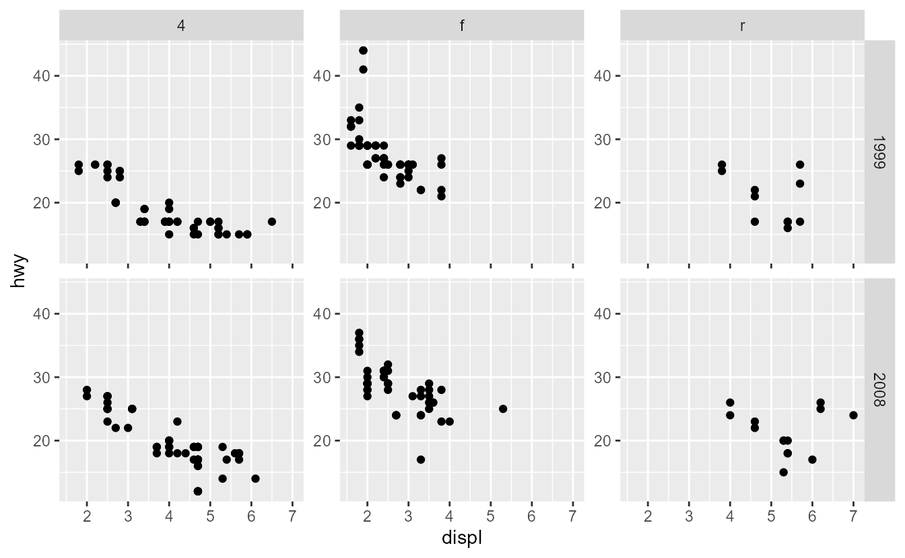

<!--
TODO:
* [x] Look over / edit the post's title in the yaml
* [x] Edit (or delete) the description; note this appears in the Twitter card
* [x] Pick category and tags (see existing with [`hugodown::tidy_show_meta()`](https://rdrr.io/pkg/hugodown/man/use_tidy_post.html))
* [x] Find photo & update yaml metadata
* [x] Create `thumbnail-sq.jpg`; height and width should be equal
* [x] Create `thumbnail-wd.jpg`; width should be >5x height
* [x] [`hugodown::use_tidy_thumbnails()`](https://rdrr.io/pkg/hugodown/man/use_tidy_post.html)
* [ ] Add intro sentence, e.g. the standard tagline for the package
* [ ] [`usethis::use_tidy_thanks()`](https://usethis.r-lib.org/reference/use_tidy_thanks.html)
-->

We are pleased to release [ggplot2](https://ggplot2.tidyverse.org) 3.5.0. This is one blogpost among several outlining changes to axes. Please find the [main release post](/blog/2024/02/ggplot2-3-5-0/) to read about other changes.

Axes, alongside [legends](/blog/2024/02/ggplot2-3-5-0-legends/), are visual representations of scales and allow observes to translate graphical properties of a plot into information. The innards of axes, like other guides, underwent a major overhaul with the guide system rewrite. Axes specifically are guides for positions and classically display labelled tick marks. In Cartesian coordinates, these are the x- and y-positions, but in non-Cartesian systems may reflect a theta, radius, longitude or latitude. In ggplot2, an axis is usually represented by the [`guide_axis()`](https://ggplot2.tidyverse.org/reference/guide_axis.html) function.

## Minor ticks

A much requested expansion of axis capabilities is the ability to draw minor ticks. To draw minor ticks, you can use the `minor.ticks` argument of [`guide_axis()`](https://ggplot2.tidyverse.org/reference/guide_axis.html).

<pre class='chroma'><code class='language-r' data-lang='r'><a href='https://rdrr.io/r/base/library.html'>library</a>(<a href='https://ggplot2.tidyverse.org'>ggplot2</a>)

p &lt;- <a href='https://ggplot2.tidyverse.org/reference/ggplot.html'>ggplot</a>(mpg, <a href='https://ggplot2.tidyverse.org/reference/aes.html'>aes</a>(displ, hwy)) +
  <a href='https://ggplot2.tidyverse.org/reference/geom_point.html'>geom_point</a>() +
  <a href='https://ggplot2.tidyverse.org/reference/guides.html'>guides</a>(
    x = <a href='https://ggplot2.tidyverse.org/reference/guide_axis.html'>guide_axis</a>(minor.ticks = TRUE),
    y = <a href='https://ggplot2.tidyverse.org/reference/guide_axis.html'>guide_axis</a>(minor.ticks = TRUE)
  )
p
</code></pre>

The minor ticks are unlabelled ticks and follow the `minor_breaks` provided to the scale. Their length is determined by the `axis.minor.ticks.length` and their positional children. The rest of their appearance is inherited from the major ticks, as can be seen in the plot below where the minor ticks on the y-axis are also blue. To tweak their style separately from the major ticks, the `axis.minor.ticks.{x.bottom/x.top/y.left/y.right}` setting can be used. Please note that there is *no* `axis.minor.ticks` setting without the position suffixes, as they inherit from the major ticks.

<pre class='chroma'><code class='language-r' data-lang='r'>p + <a href='https://ggplot2.tidyverse.org/reference/scale_continuous.html'>scale_x_continuous</a>(minor_breaks = scales::<a href='https://scales.r-lib.org/reference/breaks_width.html'>breaks_width</a>(0.2)) +
  <a href='https://ggplot2.tidyverse.org/reference/theme.html'>theme</a>(
    axis.ticks.length = <a href='https://rdrr.io/r/grid/unit.html'>unit</a>(5, "pt"),
    axis.minor.ticks.length = <a href='https://ggplot2.tidyverse.org/reference/element.html'>rel</a>(0.5),
    axis.minor.ticks.x.bottom = <a href='https://ggplot2.tidyverse.org/reference/element.html'>element_line</a>(colour = 'red'),
    axis.ticks.y = <a href='https://ggplot2.tidyverse.org/reference/element.html'>element_line</a>(colour = "blue")
  )
</code></pre>

## Capping

Axes can now also be 'capped' at the upper and lower end. We hesitate to call this improvement 'new', as it has been a part of base R plotting since time immemorial. When axes are capped, the axis line will not be drawn up to the panel edge, but up to the first and last breaks. Unsurprisingly, this only affects plots where the axis line is not blank.

<pre class='chroma'><code class='language-r' data-lang='r'><a href='https://ggplot2.tidyverse.org/reference/ggplot.html'>ggplot</a>(mpg, <a href='https://ggplot2.tidyverse.org/reference/aes.html'>aes</a>(displ, hwy)) +
  <a href='https://ggplot2.tidyverse.org/reference/geom_point.html'>geom_point</a>() +
  <a href='https://ggplot2.tidyverse.org/reference/guides.html'>guides</a>(
    x = <a href='https://ggplot2.tidyverse.org/reference/guide_axis.html'>guide_axis</a>(cap = "both"), # Cap both ends
    y = <a href='https://ggplot2.tidyverse.org/reference/guide_axis.html'>guide_axis</a>(cap = "upper") # Cap the upper end
  ) +
  <a href='https://ggplot2.tidyverse.org/reference/theme.html'>theme</a>(axis.line = <a href='https://ggplot2.tidyverse.org/reference/element.html'>element_line</a>())
</code></pre>

## Logarithmic axes

A new axis for displaying logarithmic (and related) scales has been added: [`guide_axis_logticks()`](https://ggplot2.tidyverse.org/reference/guide_axis_logticks.html). This axis draws three types of tick marks at log10-spaced positions. The ticks positions are placed in the original, untransformed data-space, so the axis plays well with scale- and coord-transformations. To accommodate a series of logarithmic-like transformations, such as [`scales::transform_pseudo_log()`](https://scales.r-lib.org/reference/transform_log.html) or [`scales::transform_asinh()`](https://scales.r-lib.org/reference/transform_asinh.html), scales that include 0 in their limits have the ticks mirrored around 0.

<pre class='chroma'><code class='language-r' data-lang='r'>r &lt;- <a href='https://rdrr.io/r/base/seq.html'>seq</a>(0.001, 0.999, length.out = 100)
df &lt;- <a href='https://rdrr.io/r/base/data.frame.html'>data.frame</a>(
  x = <a href='https://rdrr.io/r/stats/Cauchy.html'>qcauchy</a>(r),
  y = <a href='https://rdrr.io/r/stats/Lognormal.html'>qlnorm</a>(r)
)

p &lt;- <a href='https://ggplot2.tidyverse.org/reference/ggplot.html'>ggplot</a>(df, <a href='https://ggplot2.tidyverse.org/reference/aes.html'>aes</a>(x, y)) +
  <a href='https://ggplot2.tidyverse.org/reference/geom_path.html'>geom_line</a>() +
  <a href='https://ggplot2.tidyverse.org/reference/coord_trans.html'>coord_trans</a>(y = "reverse") +
  <a href='https://ggplot2.tidyverse.org/reference/scale_continuous.html'>scale_y_continuous</a>(
    transform = "log10",
    breaks = <a href='https://rdrr.io/r/base/c.html'>c</a>(0.1, 1, 10),
    guide = <a href='https://ggplot2.tidyverse.org/reference/guide_axis_logticks.html'>guide_axis_logticks</a>(long = 2, mid = 1, short = 0.5)
  ) +
  <a href='https://ggplot2.tidyverse.org/reference/scale_continuous.html'>scale_x_continuous</a>(
    transform = "asinh",
    breaks = <a href='https://rdrr.io/r/base/c.html'>c</a>(-100, -10, -1, 0, 1, 10, 100),
    guide = "axis_logticks"
  )
p
</code></pre>

The log-ticks axis supersedes the earlier [`annotation_logticks()`](https://ggplot2.tidyverse.org/reference/annotation_logticks.html) function. Because it is implemented as an axis, it has minimal fuss with the placement of labels and is immune to the clipping options in the coord. To mirror [`annotation_logticks()`](https://ggplot2.tidyverse.org/reference/annotation_logticks.html) more closely, you can set a negative tick length in the theme.

<pre class='chroma'><code class='language-r' data-lang='r'>p + <a href='https://ggplot2.tidyverse.org/reference/theme.html'>theme</a>(axis.ticks.length = <a href='https://rdrr.io/r/grid/unit.html'>unit</a>(-2.25, "pt"))
</code></pre>

## Stacked axes

The last new axis is technically not an axis, but a way to combine axis. [`guide_axis_stack()`](https://ggplot2.tidyverse.org/reference/guide_axis_stack.html) can take multiple other axes and combine them by placing them next to oneanother. On its own, the usefulness of stacking axes is pretty limited. However, when extensions start defining custom position guides, it is an easy way to mix-and-match axes from different extensions. The first axis is placed next to the panel and subsequent axes are placed further away from the panel. Axes, like legends, have acquired a `theme` argument that can be used to customise the display of individual axes.

<pre class='chroma'><code class='language-r' data-lang='r'><a href='https://ggplot2.tidyverse.org/reference/ggplot.html'>ggplot</a>(mpg, <a href='https://ggplot2.tidyverse.org/reference/aes.html'>aes</a>(displ, hwy)) +
  <a href='https://ggplot2.tidyverse.org/reference/geom_point.html'>geom_point</a>() +
  <a href='https://ggplot2.tidyverse.org/reference/guides.html'>guides</a>(x = <a href='https://ggplot2.tidyverse.org/reference/guide_axis_stack.html'>guide_axis_stack</a>(
    # Typical axis
    "axis",
    # Inverted ticks with no text
    <a href='https://ggplot2.tidyverse.org/reference/guide_axis.html'>guide_axis</a>(theme = <a href='https://ggplot2.tidyverse.org/reference/theme.html'>theme</a>(
      axis.ticks.length.x = <a href='https://ggplot2.tidyverse.org/reference/element.html'>rel</a>(-1), 
      axis.text = <a href='https://ggplot2.tidyverse.org/reference/element.html'>element_blank</a>()
    )),
    # Just the line
    <a href='https://ggplot2.tidyverse.org/reference/guide_axis.html'>guide_axis</a>(theme = <a href='https://ggplot2.tidyverse.org/reference/theme.html'>theme</a>(
      axis.ticks = <a href='https://ggplot2.tidyverse.org/reference/element.html'>element_blank</a>(), 
      axis.text  = <a href='https://ggplot2.tidyverse.org/reference/element.html'>element_blank</a>()
    )),
    theme = <a href='https://ggplot2.tidyverse.org/reference/theme.html'>theme</a>(axis.line = <a href='https://ggplot2.tidyverse.org/reference/element.html'>element_line</a>())
  ))
</code></pre>

## Display in facets

More of an indirect improvement to axes, is the ability of facets to tweak the appearance of inner axes when scales are fixed. This facilitates requirements in some journals that every panel should have labelled axes. [`facet_wrap()`](https://ggplot2.tidyverse.org/reference/facet_wrap.html) and [`facet_grid()`](https://ggplot2.tidyverse.org/reference/facet_grid.html) would previously only display axes in between panels when `scales = "free"` was set. This is still the case, but there are more options available for [`facet_grid()`](https://ggplot2.tidyverse.org/reference/facet_grid.html) and fixed scales. Using the `axes = "all"` option, all axes are displayed, including those in between panels. When using `axes = "all_x"` or `axes = "all_y"`, you can narrow down which axes are displayed.

<pre class='chroma'><code class='language-r' data-lang='r'>p &lt;- <a href='https://ggplot2.tidyverse.org/reference/ggplot.html'>ggplot</a>(mpg, <a href='https://ggplot2.tidyverse.org/reference/aes.html'>aes</a>(displ, hwy)) +
  <a href='https://ggplot2.tidyverse.org/reference/geom_point.html'>geom_point</a>()

p + <a href='https://ggplot2.tidyverse.org/reference/facet_grid.html'>facet_grid</a>(year ~ drv, axes = "all_y")
</code></pre>

In addition, you can choose to selectively suppress labels and only show ticks marks by using the `axis.labels` argument.

<pre class='chroma'><code class='language-r' data-lang='r'>p + <a href='https://ggplot2.tidyverse.org/reference/facet_grid.html'>facet_grid</a>(year ~ drv, axes = "all", axis.labels = "all_y")
</code></pre>

That wraps up the visible changes to axes for this post. To read about general changes, see the [main post](/blog/2024/02/ggplot2-3-5-0/). The changes to legends are covered in a [separate post](/blog/2024/02/ggplot2-3-5-0-legends/) and for the new polar coordinate system (and their axes) see the [last post](/blog/2024/02/ggplot2-3-5-0-coord-radial/).

