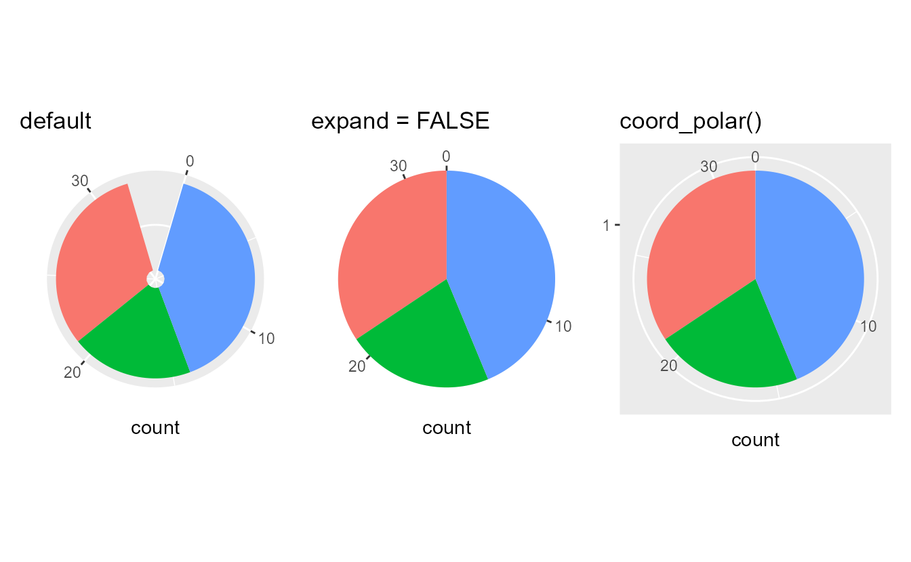
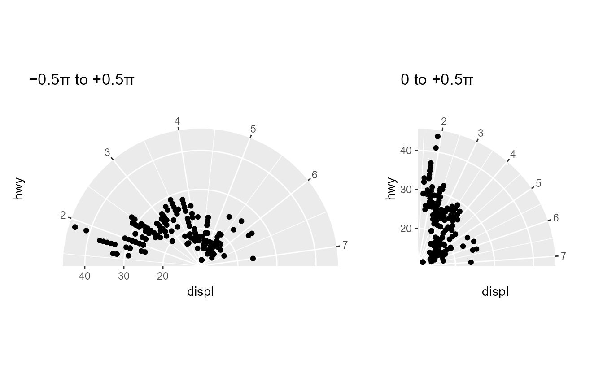
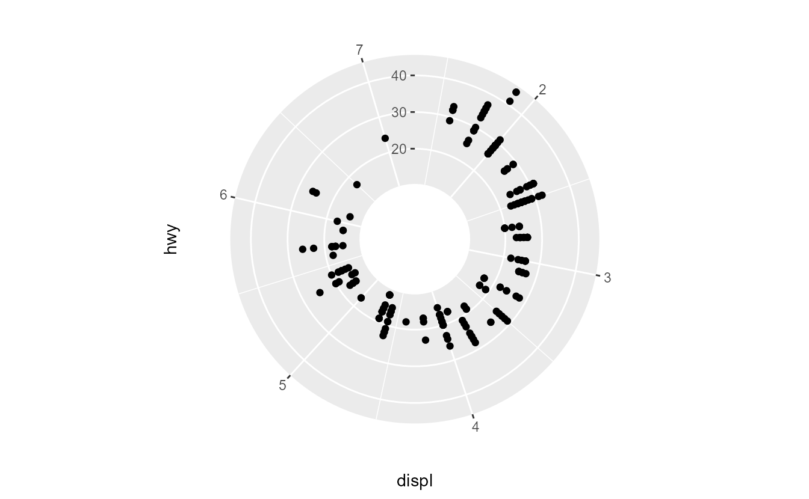
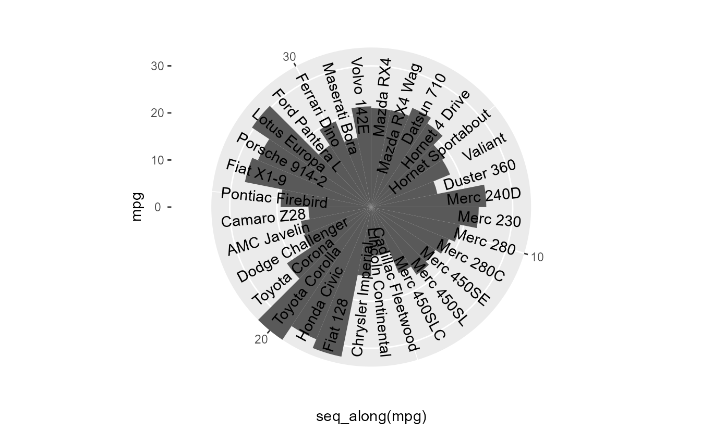
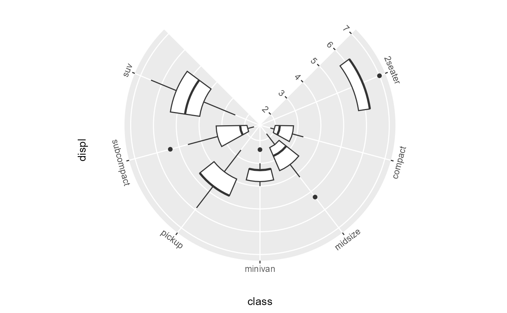
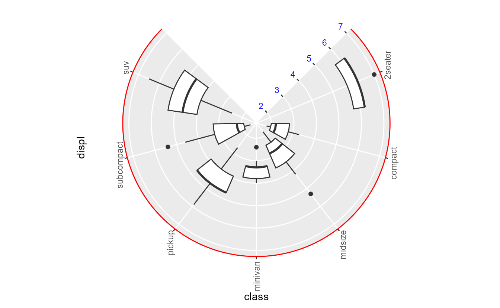

<!--
TODO:
* [x] Look over / edit the post's title in the yaml
* [x] Edit (or delete) the description; note this appears in the Twitter card
* [x] Pick category and tags (see existing with [`hugodown::tidy_show_meta()`](https://rdrr.io/pkg/hugodown/man/use_tidy_post.html))
* [x] Find photo & update yaml metadata
* [x] Create `thumbnail-sq.jpg`; height and width should be equal
* [x] Create `thumbnail-wd.jpg`; width should be >5x height
* [x] [`hugodown::use_tidy_thumbnails()`](https://rdrr.io/pkg/hugodown/man/use_tidy_post.html)
* [ ] Add intro sentence, e.g. the standard tagline for the package
* [ ] [`usethis::use_tidy_thanks()`](https://usethis.r-lib.org/reference/use_tidy_thanks.html)
-->

We are happy to announce the release of [ggplot2](https://ggplot2.tidyverse.org) 3.5.0. This is one blogpost among several outlining a new polar coordinate system. Please find the [main release post](/blog/2024/02/ggplot2-3-5-0/) to read about other exciting changes.

Polar coordinates are a good reminder of the flexibility of the Grammar of Graphics: pie charts are just bar charts with polar coordinates. While the tried and tested [`coord_polar()`](https://ggplot2.tidyverse.org/reference/coord_polar.html) has served well in the past to fulfill your pie chart needs, we felt it was due some modernisation. We realised we could not adapt [`coord_polar()`](https://ggplot2.tidyverse.org/reference/coord_polar.html) to fit with the [new guide system](/blog/2024/02/ggplot2-3-5-0/#guide-rewrite) without severely breaking existing plots, so [`coord_radial()`](https://ggplot2.tidyverse.org/reference/coord_polar.html) was born to give a facelift to the polar coordinate system in ggplot2.

Relative to [`coord_polar()`](https://ggplot2.tidyverse.org/reference/coord_polar.html), [`coord_radial()`](https://ggplot2.tidyverse.org/reference/coord_polar.html) can:

1.  Draw circle sectors instead of only full circles.
2.  Avoid data vanishing in the centre of the plot.
3.  Adjust text angles on the fly.
4.  Use the new guide system.

## An updated look

The first noticeable contrast with [`coord_polar()`](https://ggplot2.tidyverse.org/reference/coord_polar.html), is that [`coord_radial()`](https://ggplot2.tidyverse.org/reference/coord_polar.html) is not particularly suited to building pie charts. Instead, it uses the scale expansion conventions like [`coord_cartesian()`](https://ggplot2.tidyverse.org/reference/coord_cartesian.html). This makes sense for most chart types, but not pie charts. Nonetheless, you can use the `expand = FALSE` setting to use [`coord_radial()`](https://ggplot2.tidyverse.org/reference/coord_polar.html) for pie charts.

<pre class='chroma'><code class='language-r' data-lang='r'><a href='https://rdrr.io/r/base/library.html'>library</a>(<a href='https://ggplot2.tidyverse.org'>ggplot2</a>)
<a href='https://rdrr.io/r/base/library.html'>library</a>(<a href='https://patchwork.data-imaginist.com'>patchwork</a>)
<a href='https://rdrr.io/r/base/library.html'>library</a>(<a href='https://scales.r-lib.org'>scales</a>)

pie &lt;- <a href='https://ggplot2.tidyverse.org/reference/ggplot.html'>ggplot</a>(mtcars, <a href='https://ggplot2.tidyverse.org/reference/aes.html'>aes</a>(y = <a href='https://rdrr.io/r/base/factor.html'>factor</a>(1), fill = <a href='https://rdrr.io/r/base/factor.html'>factor</a>(cyl))) +
  <a href='https://ggplot2.tidyverse.org/reference/geom_bar.html'>geom_bar</a>(width = 1) +
  <a href='https://ggplot2.tidyverse.org/reference/scale_discrete.html'>scale_y_discrete</a>(guide = "none", name = NULL) +
  <a href='https://ggplot2.tidyverse.org/reference/guides.html'>guides</a>(fill = "none")
default   &lt;- pie + <a href='https://ggplot2.tidyverse.org/reference/coord_polar.html'>coord_radial</a>() + <a href='https://ggplot2.tidyverse.org/reference/labs.html'>ggtitle</a>("default")
no_expand &lt;- pie + <a href='https://ggplot2.tidyverse.org/reference/coord_polar.html'>coord_radial</a>(expand = FALSE) + <a href='https://ggplot2.tidyverse.org/reference/labs.html'>ggtitle</a>("expand = FALSE")
polar     &lt;- pie + <a href='https://ggplot2.tidyverse.org/reference/coord_polar.html'>coord_polar</a>() + <a href='https://ggplot2.tidyverse.org/reference/labs.html'>ggtitle</a>("coord_polar()")

default | no_expand | polar
</code></pre>

Some visual differences stand out in the plots above. In [`coord_radial()`](https://ggplot2.tidyverse.org/reference/coord_polar.html), the panel background covers the data area of the plot, not a rectangle. It also does not have a grid-line encircling the plot and instead uses tick marks to indicate values along the theta (angle) coordinate. You may also notice that [`coord_polar()`](https://ggplot2.tidyverse.org/reference/coord_polar.html) still draws the radius axis, despite instructions to use `guide = "none"`. That is the integration with the guide system that birthed [`coord_radial()`](https://ggplot2.tidyverse.org/reference/coord_polar.html).

## Partial polar plots

Another important difference is that [`coord_radial()`](https://ggplot2.tidyverse.org/reference/coord_polar.html) does not necessarily need to display a full circle. By setting the `start` and `end` arguments separately, you can now make a partial polar plot. This makes it much easier to make semi- or quarter-circle plots.

<pre class='chroma'><code class='language-r' data-lang='r'>p &lt;- <a href='https://ggplot2.tidyverse.org/reference/ggplot.html'>ggplot</a>(mpg, <a href='https://ggplot2.tidyverse.org/reference/aes.html'>aes</a>(displ, hwy)) +
  <a href='https://ggplot2.tidyverse.org/reference/geom_point.html'>geom_point</a>()

half &lt;- p + <a href='https://ggplot2.tidyverse.org/reference/coord_polar.html'>coord_radial</a>(start = -0.5 * pi, end = 0.5 * pi) +
  <a href='https://ggplot2.tidyverse.org/reference/labs.html'>ggtitle</a>("−0.5π to +0.5π")
quarter &lt;- p + <a href='https://ggplot2.tidyverse.org/reference/coord_polar.html'>coord_radial</a>(start = 0, end = 0.5 * pi) +
  <a href='https://ggplot2.tidyverse.org/reference/labs.html'>ggtitle</a>("0 to +0.5π")
half | quarter
</code></pre>

## Donuts

It was already possible to turn a pie-chart into a donut-chart with [`coord_polar()`](https://ggplot2.tidyverse.org/reference/coord_polar.html). This is made even easier in [`coord_radial()`](https://ggplot2.tidyverse.org/reference/coord_polar.html) by setting the `inner.radius` argument to make a donut hole. For most plots, this avoids crowding data points in the center of the plot: points with a widely different `theta` coordinate but similarly small `r` coordinate are placed further apart.

<pre class='chroma'><code class='language-r' data-lang='r'>p + <a href='https://ggplot2.tidyverse.org/reference/coord_polar.html'>coord_radial</a>(inner.radius = 0.3, r_axis_inside = TRUE)
</code></pre>

## Text annotations

A grievance we noticed about polar coordinates, is that it was cumbersome to rotate text annotations along with the `theta` coordinate. Calculating the correct angles for labels is pretty involved and usually changes from plot to plot depending on how many items need to be displayed. To remove some of this hassle [`coord_radial()`](https://ggplot2.tidyverse.org/reference/coord_polar.html) has a `rotate_angle` switch, that will line up the text's `angle` aesthetic with the theta coordinate. For text angles of 0 degrees, this will place text in a tangent orientation to the circle and for angles of 90 degrees, this places text along the radius, as in the plot below.

<pre class='chroma'><code class='language-r' data-lang='r'><a href='https://ggplot2.tidyverse.org/reference/ggplot.html'>ggplot</a>(mtcars, <a href='https://ggplot2.tidyverse.org/reference/aes.html'>aes</a>(<a href='https://rdrr.io/r/base/seq.html'>seq_along</a>(mpg), mpg)) +
  <a href='https://ggplot2.tidyverse.org/reference/geom_bar.html'>geom_col</a>(width = 1) +
  <a href='https://ggplot2.tidyverse.org/reference/geom_text.html'>geom_text</a>(
    <a href='https://ggplot2.tidyverse.org/reference/aes.html'>aes</a>(y = 32, label = <a href='https://rdrr.io/r/base/colnames.html'>rownames</a>(mtcars)),
    angle = 90, hjust = 1
  ) +
  <a href='https://ggplot2.tidyverse.org/reference/coord_polar.html'>coord_radial</a>(rotate_angle = TRUE, expand = FALSE)
</code></pre>

## Axes

Because the logic of drawing axes for polar coordinates is not the same as when axes are perfectly vertical or horizontal, we used the new guide system to build an axis specific to [`coord_radial()`](https://ggplot2.tidyverse.org/reference/coord_polar.html): the [`guide_axis_theta()`](https://ggplot2.tidyverse.org/reference/guide_axis_theta.html) axis. Guides for [`coord_radial()`](https://ggplot2.tidyverse.org/reference/coord_polar.html) can be set using `theta` and `r` name in the [`guides()`](https://ggplot2.tidyverse.org/reference/guides.html) function. While the `r` axis can be the regular [`guide_axis()`](https://ggplot2.tidyverse.org/reference/guide_axis.html), the `theta` axis uses the highly specialised [`guide_axis_theta()`](https://ggplot2.tidyverse.org/reference/guide_axis_theta.html). The theta axis shares many features with typical axes, like setting the text angle or the new `minor.ticks` and `cap` settings. More on these settings in the [axis blog](/blog/2024/02/ggplot2-3-5-0-axes/). As seen in previous plots, the default is to place text horizontally. One neat trick we've put into [`coord_radial()`](https://ggplot2.tidyverse.org/reference/coord_polar.html) is that we can set a *relative* text angle in the guides, such as in the plot below.

<pre class='chroma'><code class='language-r' data-lang='r'><a href='https://ggplot2.tidyverse.org/reference/ggplot.html'>ggplot</a>(mpg, <a href='https://ggplot2.tidyverse.org/reference/aes.html'>aes</a>(class, displ)) +
  <a href='https://ggplot2.tidyverse.org/reference/geom_boxplot.html'>geom_boxplot</a>() +
  <a href='https://ggplot2.tidyverse.org/reference/coord_polar.html'>coord_radial</a>(start = 0.25 * pi, end = 1.75 * pi) +
  <a href='https://ggplot2.tidyverse.org/reference/guides.html'>guides</a>(
    theta = <a href='https://ggplot2.tidyverse.org/reference/guide_axis_theta.html'>guide_axis_theta</a>(angle = 0),
    r     = <a href='https://ggplot2.tidyverse.org/reference/guide_axis.html'>guide_axis</a>(angle = 0)
  )
</code></pre>

The theme elements to style these axes have the `theta` or `r` position indication, so to change the the axis line, you use the `axis.line.theta` and `axis.line.r` arguments. The theme settings can also be used to set the *absolute* angle of text.

<pre class='chroma'><code class='language-r' data-lang='r'><a href='https://ggplot2.tidyverse.org/reference/ggplot.html'>ggplot</a>(mpg, <a href='https://ggplot2.tidyverse.org/reference/aes.html'>aes</a>(class, displ)) +
  <a href='https://ggplot2.tidyverse.org/reference/geom_boxplot.html'>geom_boxplot</a>() +
  <a href='https://ggplot2.tidyverse.org/reference/coord_polar.html'>coord_radial</a>(start = 0.25 * pi, end = 1.75 * pi) +
  <a href='https://ggplot2.tidyverse.org/reference/theme.html'>theme</a>(
    axis.line.theta = <a href='https://ggplot2.tidyverse.org/reference/element.html'>element_line</a>(colour = "red"),
    axis.text.theta = <a href='https://ggplot2.tidyverse.org/reference/element.html'>element_text</a>(angle = 90),
    axis.text.r     = <a href='https://ggplot2.tidyverse.org/reference/element.html'>element_text</a>(colour = "blue")
  )
</code></pre>

Lastly, there can also be secondary axes. We anticipate that this is practically never needed, as grid lines follow the primary axes and without them, it is very hard to read from axes in polar coordinates. However, if there is some reason for using secondary axes on polar coordinates, you can use the `theta.sec` and `r.sec` names in the [`guides()`](https://ggplot2.tidyverse.org/reference/guides.html) function to control the guides. Please note that a secondary theta axis is entirely useless when `inner.radius = 0` (the default). There are no separate theme options for secondary r/theta axes, but to style them separately from the primary axes, you can use the `theme` argument in the guide instead.

<pre class='chroma'><code class='language-r' data-lang='r'><a href='https://ggplot2.tidyverse.org/reference/ggplot.html'>ggplot</a>(pressure, <a href='https://ggplot2.tidyverse.org/reference/aes.html'>aes</a>(temperature, pressure)) +
  <a href='https://ggplot2.tidyverse.org/reference/geom_path.html'>geom_line</a>(colour = "blue") +
  <a href='https://ggplot2.tidyverse.org/reference/scale_continuous.html'>scale_x_continuous</a>(
    labels = <a href='https://scales.r-lib.org/reference/label_number.html'>label_number</a>(suffix = "°C"),
    sec.axis = <a href='https://ggplot2.tidyverse.org/reference/sec_axis.html'>sec_axis</a>(~ .x * 9/5 + 35, labels = <a href='https://scales.r-lib.org/reference/label_number.html'>label_number</a>(suffix = "°F"))
  ) +
  <a href='https://ggplot2.tidyverse.org/reference/scale_continuous.html'>scale_y_continuous</a>(
    labels = <a href='https://scales.r-lib.org/reference/label_number.html'>label_number</a>(suffix = " mmHg"),
    sec.axis = <a href='https://ggplot2.tidyverse.org/reference/sec_axis.html'>sec_axis</a>(~ .x * 0.133322, labels = <a href='https://scales.r-lib.org/reference/label_number.html'>label_number</a>(suffix = " kPa"))
  ) +
  <a href='https://ggplot2.tidyverse.org/reference/guides.html'>guides</a>(
    theta.sec = <a href='https://ggplot2.tidyverse.org/reference/guide_axis_theta.html'>guide_axis_theta</a>(theme = <a href='https://ggplot2.tidyverse.org/reference/theme.html'>theme</a>(axis.line.theta = <a href='https://ggplot2.tidyverse.org/reference/element.html'>element_line</a>())),
    r.sec = <a href='https://ggplot2.tidyverse.org/reference/guide_axis.html'>guide_axis</a>(theme = <a href='https://ggplot2.tidyverse.org/reference/theme.html'>theme</a>(axis.text.r = <a href='https://ggplot2.tidyverse.org/reference/element.html'>element_text</a>(colour = "red")))
  ) +
  <a href='https://ggplot2.tidyverse.org/reference/coord_polar.html'>coord_radial</a>(
    start = 0.25 * pi, end = 1.75 * pi,
    inner.radius = 0.3
  )
</code></pre>

