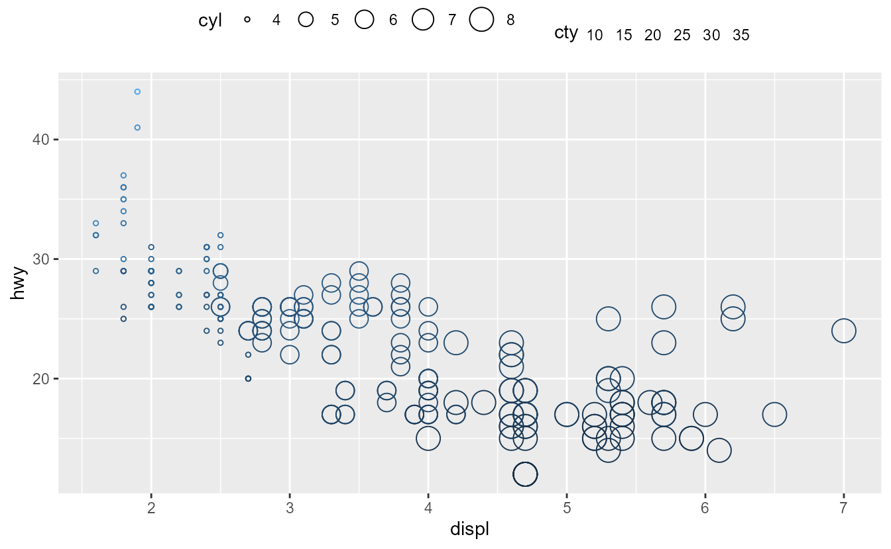

<!--
TODO:
* [x] Look over / edit the post's title in the yaml
* [x] Edit (or delete) the description; note this appears in the Twitter card
* [x] Pick category and tags (see existing with [`hugodown::tidy_show_meta()`](https://rdrr.io/pkg/hugodown/man/use_tidy_post.html))
* [x] Find photo & update yaml metadata
* [x] Create `thumbnail-sq.jpg`; height and width should be equal
* [x] Create `thumbnail-wd.jpg`; width should be >5x height
* [x] [`hugodown::use_tidy_thumbnails()`](https://rdrr.io/pkg/hugodown/man/use_tidy_post.html)
* [ ] Add intro sentence, e.g. the standard tagline for the package
* [ ] [`usethis::use_tidy_thanks()`](https://usethis.r-lib.org/reference/use_tidy_thanks.html)
-->

We are pleased to release [ggplot2](https://ggplot2.tidyverse.org) 3.5.0. This is one blogpost among several outlining changes to legend guides. Please find the [main release post](/blog/2024/02/ggplot2-3-5-0/) to read about other changes.

Legends, alongside [axes](/blog/2024/02/ggplot2-3-5-0-axes/), are visual representations of scales and allow observes to translate graphical properties of a plot into information. To no surprise, legends in ggplot2 comprise the guides called [`guide_legend()`](https://ggplot2.tidyverse.org/reference/guide_legend.html), but also [`guide_colourbar()`](https://ggplot2.tidyverse.org/reference/guide_colourbar.html), [`guide_coloursteps()`](https://ggplot2.tidyverse.org/reference/guide_coloursteps.html) and [`guide_bins()`](https://ggplot2.tidyverse.org/reference/guide_bins.html).

## Styling

One of the more user-visible changes is that these guides no longer have styling options. Or at least, they have been soft-deprecated: they continue to work for now, but are scheduled for removal. Gone are the days where there were 4 possible ways to set the horizontal justification of legend text in 5 different functions. There is only one way to style guides now, and that is by using [`theme()`](https://ggplot2.tidyverse.org/reference/theme.html). The [`theme()`](https://ggplot2.tidyverse.org/reference/theme.html) function has new arguments to control the appearance of legends, which makes it easier to globally control the appearance of legends. For example: `theme(legend.frame)` replaces `guide_colourbar(frame.colour, frame.linewidth, frame.linetype)` and `theme(legend.axis.line)` replaces `guide_bins(axis, axis.colour, axis.linewidth, axis.arrow)`. To allow for tweaking the style of any individual guide, the guide functions now have a `theme` argument that can accept a theme specific to that guide.

<pre class='chroma'><code class='language-r' data-lang='r'><a href='https://rdrr.io/r/base/library.html'>library</a>(<a href='https://ggplot2.tidyverse.org'>ggplot2</a>)

<a href='https://ggplot2.tidyverse.org/reference/ggplot.html'>ggplot</a>(mpg, <a href='https://ggplot2.tidyverse.org/reference/aes.html'>aes</a>(displ, hwy, shape = <a href='https://rdrr.io/r/base/factor.html'>factor</a>(cyl), colour = cty)) +
  <a href='https://ggplot2.tidyverse.org/reference/geom_point.html'>geom_point</a>() +
  # Styling individual guides
  <a href='https://ggplot2.tidyverse.org/reference/guides.html'>guides</a>(
    shape  = <a href='https://ggplot2.tidyverse.org/reference/guide_legend.html'>guide_legend</a>(theme = <a href='https://ggplot2.tidyverse.org/reference/theme.html'>theme</a>(legend.text = <a href='https://ggplot2.tidyverse.org/reference/element.html'>element_text</a>(colour = "red"))),
    colour = <a href='https://ggplot2.tidyverse.org/reference/guide_colourbar.html'>guide_colorbar</a>(theme = <a href='https://ggplot2.tidyverse.org/reference/theme.html'>theme</a>(legend.frame = <a href='https://ggplot2.tidyverse.org/reference/element.html'>element_rect</a>(colour = "red")))
  ) +
  # Styling guides globally
  <a href='https://ggplot2.tidyverse.org/reference/theme.html'>theme</a>(
    legend.title.position = "left",
    # Title justification is controlled by hjust/vjust in the element
    legend.title = <a href='https://ggplot2.tidyverse.org/reference/element.html'>element_text</a>(angle = 90, hjust = 0.5)
  )
</code></pre>

In the plot above, notice how the legend title settings affect both the colour bar and the legend, whereas the local options, like red legend text, only apply to a single guide.

## Awareness

Legends are now more aware what discrete variables should be placed in which keys. By default, they now only draw keys for the layer which contain the relevant value. This saves one having to hassle with the `guide_legend(override.aes)` argument to get the keys to display just right. In the plot below, notice how the points and line have separate keys.

<pre class='chroma'><code class='language-r' data-lang='r'>p &lt;- <a href='https://ggplot2.tidyverse.org/reference/ggplot.html'>ggplot</a>(mpg, <a href='https://ggplot2.tidyverse.org/reference/aes.html'>aes</a>(displ, hwy)) +
  <a href='https://ggplot2.tidyverse.org/reference/scale_manual.html'>scale_alpha_manual</a>(values = <a href='https://rdrr.io/r/base/c.html'>c</a>(0.5, 1))
p +
  <a href='https://ggplot2.tidyverse.org/reference/geom_point.html'>geom_point</a>(<a href='https://ggplot2.tidyverse.org/reference/aes.html'>aes</a>(colour = "points", alpha = "points")) +
  <a href='https://ggplot2.tidyverse.org/reference/geom_path.html'>geom_line</a>(
    <a href='https://ggplot2.tidyverse.org/reference/aes.html'>aes</a>(colour = "line", alpha = "line"),
    stat = "smooth", formula = y ~ x, method = "lm"
  )
</code></pre>

To revert back to the old behaviour, you can set the `show.legend = TRUE` option in the layers. Like before, the `show.legend` argument can still be set in an aesthetic-specific way. Setting it to `TRUE` means 'always show', `FALSE` means 'never show' and `NA` means 'show if found'.

<pre class='chroma'><code class='language-r' data-lang='r'>p +
  <a href='https://ggplot2.tidyverse.org/reference/geom_point.html'>geom_point</a>(
    <a href='https://ggplot2.tidyverse.org/reference/aes.html'>aes</a>(colour = "points", alpha = "points"),
    show.legend = TRUE # always show
  ) +
  <a href='https://ggplot2.tidyverse.org/reference/geom_path.html'>geom_line</a>(
    <a href='https://ggplot2.tidyverse.org/reference/aes.html'>aes</a>(colour = "line", alpha = "line"),
    stat = "smooth", formula = y ~ x, method = "lm",
    show.legend = <a href='https://rdrr.io/r/base/c.html'>c</a>(colour = NA, alpha = TRUE) # always show in alpha
  )
</code></pre>

## Placement

Legend positions are no longer restricted to just a single side of the plot. By setting the `position` argument of guides, you can tailor which guides appear where in the plot. Guides that do not have a position set, like the 'drv' shape legend below, follow the global theme's `legend.position` setting. If we suspend our belief in good data visualisation practice, we can showcase this as follows:

<pre class='chroma'><code class='language-r' data-lang='r'>p &lt;- <a href='https://ggplot2.tidyverse.org/reference/ggplot.html'>ggplot</a>(mpg, <a href='https://ggplot2.tidyverse.org/reference/aes.html'>aes</a>(displ, hwy, shape = drv, colour = cty, size = year)) +
  <a href='https://ggplot2.tidyverse.org/reference/geom_point.html'>geom_point</a>(<a href='https://ggplot2.tidyverse.org/reference/aes.html'>aes</a>(alpha = cyl)) +
  <a href='https://ggplot2.tidyverse.org/reference/guides.html'>guides</a>(
    colour = <a href='https://ggplot2.tidyverse.org/reference/guide_colourbar.html'>guide_colourbar</a>(position = "bottom"),
    size   = <a href='https://ggplot2.tidyverse.org/reference/guide_legend.html'>guide_legend</a>(position = "top"),
    alpha  = <a href='https://ggplot2.tidyverse.org/reference/guide_legend.html'>guide_legend</a>(position = "inside")
  ) +
  <a href='https://ggplot2.tidyverse.org/reference/theme.html'>theme</a>(legend.position = "left")
p
</code></pre>

In the plot above, the legend for the 'cyl' variable is in the middle of the plot. In previous versions of ggplot2, you could set the `legend.position` to a coordinate to control the placement. However, doing this would change the default legend position, which is not always desirable. To cover such cases, there is now a specialised `legend.position.inside` argument that controls the positioning of legends with `position = "inside"` regardless of whether the position was specified in the theme or in the guide.

<pre class='chroma'><code class='language-r' data-lang='r'>p + <a href='https://ggplot2.tidyverse.org/reference/theme.html'>theme</a>(legend.position.inside = <a href='https://rdrr.io/r/base/c.html'>c</a>(0.7, 0.7))
</code></pre>

The justification of legends is controllable by using the `legend.justification.{position}` theme setting. Moreover, the top and bottom guides can be aligned to the plot rather than the panel by setting the `legend.location` argument. The main reason behind this is that you can then align the legends with the plot's title. By default, when `plot.title.position = "plot"`, left legends are already aligned. For this reason, the top and bottom guides are prioritised for the `legend.location` setting. Moreover, it avoids overlapping of legends in the corners if the justifications would dictate it.

<pre class='chroma'><code class='language-r' data-lang='r'>p + 
  <a href='https://ggplot2.tidyverse.org/reference/labs.html'>labs</a>(title = "Plot-aligned title") +
  <a href='https://ggplot2.tidyverse.org/reference/theme.html'>theme</a>(
    legend.margin = <a href='https://ggplot2.tidyverse.org/reference/element.html'>margin</a>(0, 0, 0, 0), # turned off for alignment
    legend.justification.top = "left",
    legend.justification.left = "top",
    legend.justification.bottom = "right",
    legend.justification.inside = <a href='https://rdrr.io/r/base/c.html'>c</a>(1, 1),
    legend.location = "plot",
    plot.title.position = "plot"
  )
</code></pre>

## Spacing and margins

In this release, the way spacing in legends work has been reworked.

-   The `legend.spacing{.x/.y}` theme setting is now used to space different guides apart. Previously, it was also used to space legend keys apart; that is no longer the case.
-   Spacing legend key-label pairs apart is now controlled by the `legend.key.spacing{.x/.y}` theme setting.
-   Spacing the labels from the keys is now controlled by the label element's `margin` argument.

Because the legend spacing and margin options can be a bit bewildering, a small overview is added below. One setting not included in the overview is `legend.spacing.x`, which only applies when `legend.box = "horizontal"`. Which exact text margin is relevant for spacing apart keys and labels, or titles and the rest of the guide, depends on the `legend.text.position` and `legend.title.position` theme elements.

When the titles and keys don't have explicit margins, appropriate margins are added automatically depending on the text or title position. However, if you override the margins, they will be interpreted literally.

<pre class='chroma'><code class='language-r' data-lang='r'><a href='https://ggplot2.tidyverse.org/reference/ggplot.html'>ggplot</a>(mpg, <a href='https://ggplot2.tidyverse.org/reference/aes.html'>aes</a>(displ, hwy, colour = class)) +
  <a href='https://ggplot2.tidyverse.org/reference/geom_point.html'>geom_point</a>() +
  <a href='https://ggplot2.tidyverse.org/reference/guides.html'>guides</a>(colour = <a href='https://ggplot2.tidyverse.org/reference/guide_legend.html'>guide_legend</a>(ncol = 2)) +
  <a href='https://ggplot2.tidyverse.org/reference/theme.html'>theme</a>(
    legend.key.spacing.x = <a href='https://rdrr.io/r/grid/unit.html'>unit</a>(10, "pt"),
    legend.key.spacing.y = <a href='https://rdrr.io/r/grid/unit.html'>unit</a>(20, "pt"),
    legend.text = <a href='https://ggplot2.tidyverse.org/reference/element.html'>element_text</a>(margin = <a href='https://ggplot2.tidyverse.org/reference/element.html'>margin</a>(l = 0)),
    legend.title = <a href='https://ggplot2.tidyverse.org/reference/element.html'>element_text</a>(margin = <a href='https://ggplot2.tidyverse.org/reference/element.html'>margin</a>(b = 20))
  )
</code></pre>

For all intents and purposes, colour bar/step and bins guides are treated as legend guides with just a single key-label pair. While the `legend.key.spacing` setting does not apply due to it being one single key, the other spacings and margins do apply equally.

<pre class='chroma'><code class='language-r' data-lang='r'><a href='https://ggplot2.tidyverse.org/reference/ggplot.html'>ggplot</a>(mpg, <a href='https://ggplot2.tidyverse.org/reference/aes.html'>aes</a>(displ, hwy, colour = cty)) +
  <a href='https://ggplot2.tidyverse.org/reference/geom_point.html'>geom_point</a>() +
  <a href='https://ggplot2.tidyverse.org/reference/theme.html'>theme</a>(
    legend.text  = <a href='https://ggplot2.tidyverse.org/reference/element.html'>element_text</a>(margin = <a href='https://ggplot2.tidyverse.org/reference/element.html'>margin</a>(l = 0)),
    legend.title = <a href='https://ggplot2.tidyverse.org/reference/element.html'>element_text</a>(margin = <a href='https://ggplot2.tidyverse.org/reference/element.html'>margin</a>(b = 20))
  )
</code></pre>

## Stretching

Another experimental tweak to legends is that they can now have stretching keys (or bars). The option is still considered 'experimental' because there are some things that may go wrong. By setting the `legend.key{.height/.width}` theme argument as a `"null"` unit, legends can now expand to fill the available space.

<pre class='chroma'><code class='language-r' data-lang='r'>p &lt;- <a href='https://ggplot2.tidyverse.org/reference/ggplot.html'>ggplot</a>(mpg, <a href='https://ggplot2.tidyverse.org/reference/aes.html'>aes</a>(displ, hwy)) +
  <a href='https://ggplot2.tidyverse.org/reference/geom_point.html'>geom_point</a>(<a href='https://ggplot2.tidyverse.org/reference/aes.html'>aes</a>(colour = cty, size = cyl), shape = 21) +
  <a href='https://ggplot2.tidyverse.org/reference/theme.html'>theme</a>(legend.key.height = <a href='https://rdrr.io/r/grid/unit.html'>unit</a>(1, "null"))
p
</code></pre>

The term 'available space' is a tricky one. For starters, other legends placed in the same position take up space, as can be seen in the plot above. If your legend is the only legend in a position, more space is available and it stretches more. As you can see in the plot below, the legends are not aligned with the panel even when stretched. This is because the titles, margins and various spacings all take up space that is *not* available to stretch into.

<pre class='chroma'><code class='language-r' data-lang='r'>p + <a href='https://ggplot2.tidyverse.org/reference/guides.html'>guides</a>(colour = <a href='https://ggplot2.tidyverse.org/reference/guide_colourbar.html'>guide_colourbar</a>(position = "left"))
</code></pre>

On the other hand, if one position is packed with legends, the keys may shrink instead of stretch. The keys can become too small to show the aesthetics properly. You can see in the example below that the size legend becomes cut-off due to small keys and text is spaced too closely to comfortably read.

<pre class='chroma'><code class='language-r' data-lang='r'>p + <a href='https://ggplot2.tidyverse.org/reference/aes.html'>aes</a>(fill = model)
</code></pre>

Another issue that may come up is that the 'available space' might be 0. Because the plot itself is also space-filling, setting null-heights for top/bottom positions or null-widths for left/right positions means there is no available space. This may result in the keys or bars becoming invisible. For the plot below, recall that we've set the `legend.key.height` setting to a null unit.

<pre class='chroma'><code class='language-r' data-lang='r'>p + <a href='https://ggplot2.tidyverse.org/reference/theme.html'>theme</a>(legend.position = "top")
</code></pre>

## Other improvements

We welcome a new type of legend: [`guide_custom()`](https://ggplot2.tidyverse.org/reference/guide_custom.html). It can be used to add any graphical object (grob) to a plot, like [`annotation_custom()`](https://ggplot2.tidyverse.org/reference/annotation_custom.html). There are a few differences though: it is positioned just like a legend and adds titles and margins. In some sense, this guide is 'special', as it is the only guide that does not directly reflect a scale. The downside is that it cannot read properties from the plot, but the upside is that it is very flexible. Be careful when your grob does not have an absolute size, you should set the `width` and `height` arguments.

<pre class='chroma'><code class='language-r' data-lang='r'>x &lt;- <a href='https://rdrr.io/r/base/c.html'>c</a>(0.5, 1, 1.5, 1.2, 1.5, 1, 0.5, 0.8, 1, 1.15, 2, 1.15, 1, 0.85, 0, 0.85)
y &lt;- <a href='https://rdrr.io/r/base/c.html'>c</a>(1.5, 1.2, 1.5, 1, 0.5, 0.8, 0.5, 1, 2, 1.15, 1, 0.85, 0, 0.85, 1, 1.15)

compass_rose &lt;- grid::<a href='https://rdrr.io/r/grid/grid.polygon.html'>polygonGrob</a>(
  x = <a href='https://rdrr.io/r/grid/unit.html'>unit</a>(x, "cm"), y = <a href='https://rdrr.io/r/grid/unit.html'>unit</a>(y, "cm"), id.lengths = <a href='https://rdrr.io/r/base/c.html'>c</a>(8, 8),
  gp = grid::<a href='https://rdrr.io/r/grid/gpar.html'>gpar</a>(fill = <a href='https://rdrr.io/r/base/c.html'>c</a>("grey50", "grey25"), col = NA)
)

nc &lt;- sf::<a href='https://r-spatial.github.io/sf/reference/st_read.html'>st_read</a>(<a href='https://rdrr.io/r/base/system.file.html'>system.file</a>("shape/nc.shp", package = "sf"), quiet = TRUE)
<a href='https://ggplot2.tidyverse.org/reference/ggplot.html'>ggplot</a>(nc) +
  <a href='https://ggplot2.tidyverse.org/reference/ggsf.html'>geom_sf</a>(<a href='https://ggplot2.tidyverse.org/reference/aes.html'>aes</a>(fill = AREA)) +
  <a href='https://ggplot2.tidyverse.org/reference/guides.html'>guides</a>(custom = <a href='https://ggplot2.tidyverse.org/reference/guide_custom.html'>guide_custom</a>(compass_rose, title = "compass"))
</code></pre>

In previous version of ggplot2, when legend titles are wider than the legends, the guide-title alignment was always left aligned. Now, the justification setting of the legend text determines the alignment: 1 is right or top aligned and 0 is left or bottom aligned.

<pre class='chroma'><code class='language-r' data-lang='r'><a href='https://ggplot2.tidyverse.org/reference/ggplot.html'>ggplot</a>(mpg, <a href='https://ggplot2.tidyverse.org/reference/aes.html'>aes</a>(displ, hwy, shape = <a href='https://rdrr.io/r/base/factor.html'>factor</a>(cyl), colour = drv)) +
  <a href='https://ggplot2.tidyverse.org/reference/geom_point.html'>geom_point</a>() +
  <a href='https://ggplot2.tidyverse.org/reference/guides.html'>guides</a>(
    shape = <a href='https://ggplot2.tidyverse.org/reference/guide_legend.html'>guide_legend</a>(
      title = "A title that is pretty long",
      theme = <a href='https://ggplot2.tidyverse.org/reference/theme.html'>theme</a>(legend.title = <a href='https://ggplot2.tidyverse.org/reference/element.html'>element_text</a>(hjust = 1)),
      order = 1
    ),
    colour = <a href='https://ggplot2.tidyverse.org/reference/guide_legend.html'>guide_legend</a>(
      title = "Another long title",
      theme = <a href='https://ggplot2.tidyverse.org/reference/theme.html'>theme</a>(legend.title = <a href='https://ggplot2.tidyverse.org/reference/element.html'>element_text</a>(hjust = 0))
    )
  )
</code></pre>

