<!--
TODO:
* [x] Look over / edit the post's title in the yaml
* [x] Edit (or delete) the description; note this appears in the Twitter card
* [x] Pick category and tags (see existing with [`hugodown::tidy_show_meta()`](https://rdrr.io/pkg/hugodown/man/use_tidy_post.html))
* [x] Find photo & update yaml metadata
* [x] Create `thumbnail-sq.jpg`; height and width should be equal
* [x] Create `thumbnail-wd.jpg`; width should be >5x height
* [x] [`hugodown::use_tidy_thumbnails()`](https://rdrr.io/pkg/hugodown/man/use_tidy_post.html)
* [x] Add intro sentence, e.g. the standard tagline for the package
* [x] [`usethis::use_tidy_thanks()`](https://usethis.r-lib.org/reference/use_tidy_thanks.html)
-->

We're tickled pink to announce the release of [ggplot2](https://ggplot2.tidyverse.org) 3.5.0. ggplot2 is a system for declaratively creating graphics, based on The Grammar of Graphics. You provide the data, tell ggplot2 how to map variables to aesthetics, what graphical primitives to use, and it takes care of the details.

You can install it from CRAN with:

<pre class='chroma'><code class='language-r' data-lang='r'><a href='https://rdrr.io/r/utils/install.packages.html'>install.packages</a>("ggplot2")</code></pre>

This blog post will cover a bunch of new features included in the latest release. In addition to rewriting the guide system, we made progress supporting newer R graphics capabilities, re-purposed the use of [`I()`](https://rdrr.io/r/base/AsIs.html), and introduce an improved [polar coordinate](/blog/2024/02/ggplot2-3-5-0-coord-radial/) system, along with other improvements.

You can see a full list of changes in the [release notes](https://ggplot2.tidyverse.org/news/index.html)

<pre class='chroma'><code class='language-r' data-lang='r'><a href='https://rdrr.io/r/base/library.html'>library</a>(<a href='https://ggplot2.tidyverse.org'>ggplot2</a>)
<a href='https://rdrr.io/r/base/library.html'>library</a>(<a href='https://patchwork.data-imaginist.com'>patchwork</a>)
<a href='https://rdrr.io/r/base/library.html'>library</a>(grid)</code></pre>

## Guide rewrite

Axes and legends, collectively called guides, are an important component to plots, as they allow the translation of visual information back to data qualities. The extension mechanism of ggplot2 allows others to develop their own layers, facets, coords and scales through the ggproto object-oriented system. Finally, after years of being the only major system in ggplot2 still clinging to the S3 system, guides have been rewritten to use ggproto. With this rewrite, guides officially become an extension point that let developers implement their own guides. We have added a section to the [Extending ggplot2](https://ggplot2.tidyverse.org/articles/extending-ggplot2.html#creating-new-guides) vignette on how to develop a new guide.

Alongside the rewrite, we made a slew of improvements to guides along the way. As these are somewhat meaty and focused topics, we cover them in separate blog posts about [axes](/blog/2024/02/ggplot2-3-5-0-axes/) and [legends](/blog/2024/02/ggplot2-3-5-0-legends/). To give a bit of an overview for completeness, we'll briefly list major changes here:

1.  Guide styling now runs through [`theme()`](https://ggplot2.tidyverse.org/reference/theme.html). Guides themselves have `theme` arguments for individual customisation.
2.  Legends now show appropriate keys if data is present in layers.
3.  Legends can be placed at multiple positions in and around the plot.
4.  The spacing and margins in legends have been reworked.
5.  As an experimental feature, legends can now be stretched.
6.  A new legend [`guide_custom()`](https://ggplot2.tidyverse.org/reference/guide_custom.html) can display any graphical object.
7.  Axes have `minor.ticks` and `cap` options.
8.  There is a new logarithmic axis.
9.  There is a new axis for theta coordinates, covered in the [`coord_radial()`](https://ggplot2.tidyverse.org/reference/coord_polar.html) [post](/blog/2024/02/ggplot2-3-5-0-coord-radial/#axes).
10. There is a new stacking operation for multiple axes.
11. Facets have more options for displaying axes.

## Patterns and gradients

Patterns and gradients were first introduced in the {grid} package, which empowers ggplot2, in R 4.1.0 and were refined in R 4.2.0 to support multiple patterns and gradients. If your graphics device supported it, theme elements could already be set to patterns or gradients, even before this release.

> Note: On Windows machines, the default device in RStudio and in the knitr package is [`png()`](https://rdrr.io/r/grDevices/png.html), which does not support patterns. In RStudio, you can go to 'Tools \> Global Options \> General \> Graphics' and choose the 'ragg' or 'Cairo PNG' device from the dropdown menu to display patterns.

<pre class='chroma'><code class='language-r' data-lang='r'>gray_gradient &lt;- <a href='https://rdrr.io/r/grid/patterns.html'>linearGradient</a>(scales::<a href='https://scales.r-lib.org/reference/pal_grey.html'>pal_grey</a>()(10))

<a href='https://ggplot2.tidyverse.org/reference/ggplot.html'>ggplot</a>(mpg, <a href='https://ggplot2.tidyverse.org/reference/aes.html'>aes</a>(displ, hwy)) +
  <a href='https://ggplot2.tidyverse.org/reference/geom_point.html'>geom_point</a>() +
  <a href='https://ggplot2.tidyverse.org/reference/theme.html'>theme</a>(panel.background = <a href='https://ggplot2.tidyverse.org/reference/element.html'>element_rect</a>(fill = gray_gradient))
</code></pre>
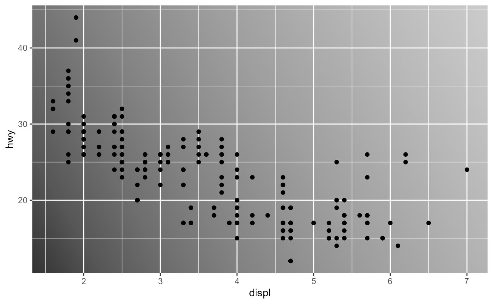

We are pleased to report that as of this release, patterns can be used as the `fill` aesthetic in most layers. To use a pattern, first build a gradient using {grid}'s [`linearGradient()`](https://rdrr.io/r/grid/patterns.html), [`radialGradient()`](https://rdrr.io/r/grid/patterns.html) functions, or a pattern using the [`pattern()`](https://rdrr.io/r/grid/patterns.html) function. Because handling patterns and gradients is very similar, we will treat gradients as if they were patterns: when we say 'pattern' in the text below, please mind that we mean patterns and gradients alike. These patterns can be passed to a layer as the `fill` aesthetic. Below, you can see two behaviours of the [`linearGradient()`](https://rdrr.io/r/grid/patterns.html) pattern, depending on its `group` argument. The pattern with `group = FALSE` will display the gradient in every rectangle and `group = TRUE` will apply the gradient to all rectangles together.

<pre class='chroma'><code class='language-r' data-lang='r'>colours &lt;- scales::<a href='https://scales.r-lib.org/reference/pal_viridis.html'>viridis_pal</a>()(10)
grad_ungroup &lt;- <a href='https://rdrr.io/r/grid/patterns.html'>linearGradient</a>(colours, group = FALSE)
grad_grouped &lt;- <a href='https://rdrr.io/r/grid/patterns.html'>linearGradient</a>(colours, group = TRUE)

ungroup &lt;- <a href='https://ggplot2.tidyverse.org/reference/ggplot.html'>ggplot</a>(mpg, <a href='https://ggplot2.tidyverse.org/reference/aes.html'>aes</a>(<a href='https://rdrr.io/r/base/factor.html'>factor</a>(cyl))) +
  <a href='https://ggplot2.tidyverse.org/reference/geom_bar.html'>geom_bar</a>(fill = grad_ungroup) +
  <a href='https://ggplot2.tidyverse.org/reference/labs.html'>labs</a>(title = "Ungrouped gradient")

grouped &lt;- <a href='https://ggplot2.tidyverse.org/reference/ggplot.html'>ggplot</a>(mpg, <a href='https://ggplot2.tidyverse.org/reference/aes.html'>aes</a>(<a href='https://rdrr.io/r/base/factor.html'>factor</a>(cyl))) +
  <a href='https://ggplot2.tidyverse.org/reference/geom_bar.html'>geom_bar</a>(fill = grad_grouped) +
  <a href='https://ggplot2.tidyverse.org/reference/labs.html'>labs</a>(title = "Grouped gradient")

ungroup | grouped
</code></pre>
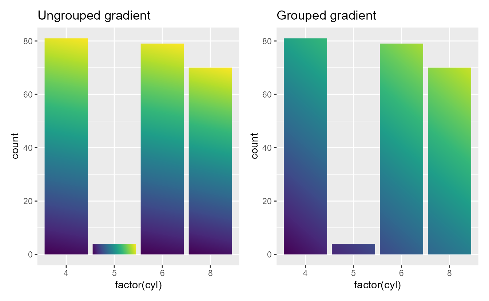

Besides passing a static pattern as the `fill` aesthetic, it is also possible to map values to patterns using [`scale_fill_manual()`](https://ggplot2.tidyverse.org/reference/scale_manual.html). To map values to patterns, pass a list of patterns to the `values` argument of the scale. When providing patterns as a list, the list can be a mix of patterns and plain colours, like `"limegreen"` in the plot below. We are excited that people may come up with nice pattern palettes that can be used in similar fashion.

<pre class='chroma'><code class='language-r' data-lang='r'>patterns &lt;- <a href='https://rdrr.io/r/base/list.html'>list</a>(
  <a href='https://rdrr.io/r/grid/patterns.html'>linearGradient</a>(colours, group = FALSE),
  "limegreen",
  <a href='https://rdrr.io/r/grid/patterns.html'>radialGradient</a>(colours, group = FALSE),
  <a href='https://rdrr.io/r/grid/patterns.html'>pattern</a>(
    <a href='https://rdrr.io/r/grid/grid.rect.html'>rectGrob</a>(x = <a href='https://rdrr.io/r/base/c.html'>c</a>(0.25, 0.75), y = <a href='https://rdrr.io/r/base/c.html'>c</a>(0.25, 0.75), width = 0.5, height = 0.5),
    width = <a href='https://rdrr.io/r/grid/unit.html'>unit</a>(5, "mm"), height = <a href='https://rdrr.io/r/grid/unit.html'>unit</a>(5, "mm"), extend = "repeat",
    gp = <a href='https://rdrr.io/r/grid/gpar.html'>gpar</a>(fill = "limegreen")
  )
)

<a href='https://ggplot2.tidyverse.org/reference/ggplot.html'>ggplot</a>(mpg, <a href='https://ggplot2.tidyverse.org/reference/aes.html'>aes</a>(<a href='https://rdrr.io/r/base/factor.html'>factor</a>(cyl), fill = <a href='https://rdrr.io/r/base/factor.html'>factor</a>(cyl))) +
  <a href='https://ggplot2.tidyverse.org/reference/geom_bar.html'>geom_bar</a>() +
  <a href='https://ggplot2.tidyverse.org/reference/scale_manual.html'>scale_fill_manual</a>(values = patterns)
</code></pre>
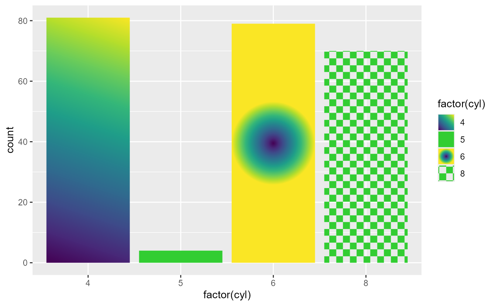

The largest obstacle we had to overcome to support gradients in ggplot2 was to apply the `alpha` aesthetic consistently to the patterns. The regular [`scales::alpha()`](https://scales.r-lib.org/reference/alpha.html) function does not work with patterns, so we implemented a new [`fill_alpha()`](https://ggplot2.tidyverse.org/reference/fill_alpha.html) function that applies the `alpha` aesthetic to the patterns. By switching out `fill = alpha(fill, alpha)` with `fill = fill_alpha(fill, alpha)` in the [`grid::gpar()`](https://rdrr.io/r/grid/gpar.html) function, extension developers can enable pattern fills in their own layer extensions.

The [`fill_alpha()`](https://ggplot2.tidyverse.org/reference/fill_alpha.html) function checks if the active device supports patterns and spits out a friendlier warning or error on demand. For extension developers that want to use newer graphics features, you can reuse the [`check_device()`](https://ggplot2.tidyverse.org/reference/check_device.html) function to check feature availability or throw messages in a similar fashion.

<pre class='chroma'><code class='language-r' data-lang='r'># The currently active device is the ragg::agg_png() device
<a href='https://ggplot2.tidyverse.org/reference/check_device.html'>check_device</a>(feature = "patterns", action = "test")
#&gt; [1] TRUE
<a href='https://ggplot2.tidyverse.org/reference/check_device.html'>check_device</a>(feature = "glyphs", action = "abort")
#&gt; Error:
#&gt; ! The agg_png device does not support typeset glyphs.
</code></pre>

## Ignoring scales

In this release, ggplot2 has changed how the plots interact with variables created with [`I()`](https://rdrr.io/r/base/AsIs.html) ('AsIs' variables). The change is somewhat subtle, so it takes a bit of explaining.

It *used to be* the case that 'AsIs' variables automatically added an identity scale to the plot. Identity scales in ggplot2 preserve the original input, without mapping or transforming them. For example, iif you give literal colour names as the `colour` aesthetic, the plot will use these exact colours.

<pre class='chroma'><code class='language-r' data-lang='r'><a href='https://rdrr.io/r/base/Random.html'>set.seed</a>(42)
my_colours &lt;- <a href='https://rdrr.io/r/base/sample.html'>sample</a>(<a href='https://rdrr.io/r/base/c.html'>c</a>("red", "green", "blue"), <a href='https://rdrr.io/r/base/nrow.html'>nrow</a>(mpg), replace = TRUE)

<a href='https://ggplot2.tidyverse.org/reference/ggplot.html'>ggplot</a>(mpg, <a href='https://ggplot2.tidyverse.org/reference/aes.html'>aes</a>(displ, hwy)) +
  <a href='https://ggplot2.tidyverse.org/reference/geom_point.html'>geom_point</a>(<a href='https://ggplot2.tidyverse.org/reference/aes.html'>aes</a>(colour = my_colours)) +
  <a href='https://ggplot2.tidyverse.org/reference/scale_identity.html'>scale_colour_identity</a>()
</code></pre>
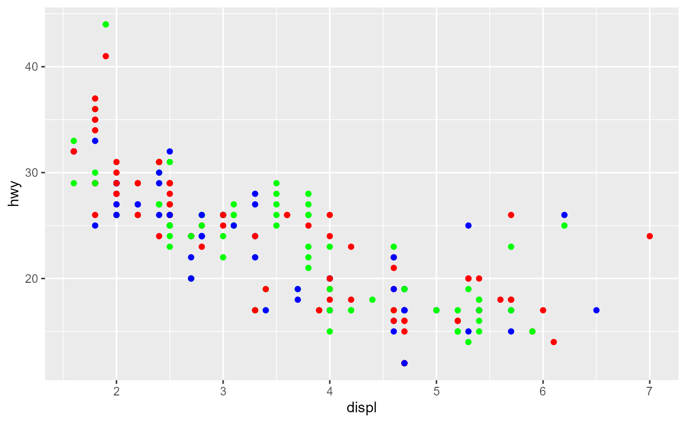

However, because identity scales *are* true scales, you cannot combine literal colours in one layer with mapped colours in the next. Trying to do so, will confront you with the 'unknown colour name' error.

<pre class='chroma'><code class='language-r' data-lang='r'><a href='https://ggplot2.tidyverse.org/reference/ggplot.html'>ggplot</a>(mpg, <a href='https://ggplot2.tidyverse.org/reference/aes.html'>aes</a>(displ, hwy)) +
  <a href='https://ggplot2.tidyverse.org/reference/geom_point.html'>geom_point</a>(<a href='https://ggplot2.tidyverse.org/reference/aes.html'>aes</a>(colour = drv), shape = 1, size = 5) +
  <a href='https://ggplot2.tidyverse.org/reference/geom_point.html'>geom_point</a>(<a href='https://ggplot2.tidyverse.org/reference/aes.html'>aes</a>(colour = my_colours)) +
  <a href='https://ggplot2.tidyverse.org/reference/scale_identity.html'>scale_colour_identity</a>()
#&gt; Error in `geom_point()`:
#&gt; ! Problem while converting geom to grob.
#&gt; ℹ Error occurred in the 1st layer.
#&gt; Caused by error:
#&gt; ! Unknown colour name: f
</code></pre>

In order to prevent such clashes between identity scales that map nothing and regular scales, we have changed how 'AsIs' variables interact with scales. Instead of adding an identity scale, 'AsIs' variables are now altogether *ignored* by the scale systems. On the surface, the new behaviour is very similar to the old one, in that for example literal colours are used. However, with 'AsIs' variables ignored, you can now freely combine layers with 'AsIs' input with layers that map input. If you need a legend for the literal variable, we recommend to use the identity scale mechanism instead.

<pre class='chroma'><code class='language-r' data-lang='r'><a href='https://ggplot2.tidyverse.org/reference/ggplot.html'>ggplot</a>(mpg, <a href='https://ggplot2.tidyverse.org/reference/aes.html'>aes</a>(displ, hwy)) +
  <a href='https://ggplot2.tidyverse.org/reference/geom_point.html'>geom_point</a>(<a href='https://ggplot2.tidyverse.org/reference/aes.html'>aes</a>(colour = drv), shape = 1, size = 5) +
  <a href='https://ggplot2.tidyverse.org/reference/geom_point.html'>geom_point</a>(<a href='https://ggplot2.tidyverse.org/reference/aes.html'>aes</a>(colour = <a href='https://rdrr.io/r/base/AsIs.html'>I</a>(my_colours)), show.legend = FALSE)
</code></pre>
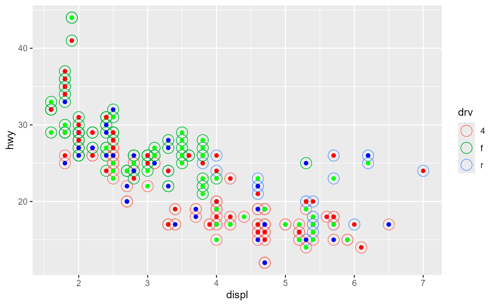

Perhaps more salient than avoid scale clashes, is that the same applies to the `x` and `y` position aesthetics. There has never been a `scale_x_identity()` or `scale_y_identity()` function, so what this means may be unexpected. Internally, scales transform every continuous variable to the 0-1 range before drawing the graphics. So too do 'AsIs' position aesthetics work: you can use numbers between 0 and 1 to set the position. These positions are relative to the plot's panel and this mechanism opens up a great way to add plot annotations that are independent of the data.

<pre class='chroma'><code class='language-r' data-lang='r'>t &lt;- <a href='https://rdrr.io/r/base/seq.html'>seq</a>(0, 2 * pi, length.out = 100)

<a href='https://ggplot2.tidyverse.org/reference/ggplot.html'>ggplot</a>(mpg, <a href='https://ggplot2.tidyverse.org/reference/aes.html'>aes</a>(displ, hwy)) +
  <a href='https://ggplot2.tidyverse.org/reference/geom_point.html'>geom_point</a>(colour = "grey50") +
  <a href='https://ggplot2.tidyverse.org/reference/annotate.html'>annotate</a>(
    "rect", 
    xmin = <a href='https://rdrr.io/r/base/AsIs.html'>I</a>(0.05), xmax = <a href='https://rdrr.io/r/base/AsIs.html'>I</a>(0.95),
    ymin = <a href='https://rdrr.io/r/base/AsIs.html'>I</a>(0.05), ymax = <a href='https://rdrr.io/r/base/AsIs.html'>I</a>(0.95),
    fill = NA, colour = "red"
  ) +
  <a href='https://ggplot2.tidyverse.org/reference/annotate.html'>annotate</a>(
    "path",
    x = <a href='https://rdrr.io/r/base/AsIs.html'>I</a>(<a href='https://rdrr.io/r/base/Trig.html'>cos</a>(t) / 2 + 0.5), y = <a href='https://rdrr.io/r/base/AsIs.html'>I</a>(<a href='https://rdrr.io/r/base/Trig.html'>sin</a>(t) / 2 + 0.5),
    colour = "blue"
  ) +
  <a href='https://ggplot2.tidyverse.org/reference/annotate.html'>annotate</a>(
    "text", 
    label = "Text in the middle",
    x = <a href='https://rdrr.io/r/base/AsIs.html'>I</a>(0.5), y = <a href='https://rdrr.io/r/base/AsIs.html'>I</a>(0.5),
    size = 8
  )
</code></pre>
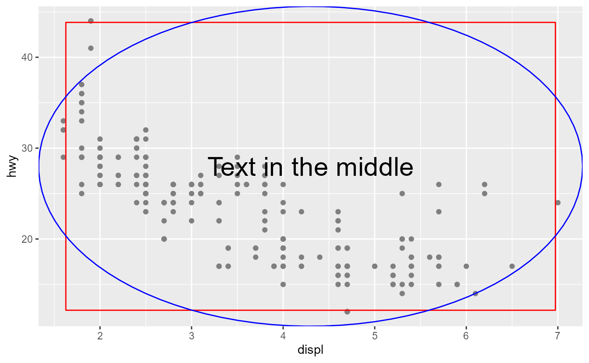

Please take note that discrete variables as 'AsIs' position aesthetic have no interpretation and will likely result in errors.

## Other improvements

Coordinating text sizes between the theme and [`geom_text()`](https://ggplot2.tidyverse.org/reference/geom_text.html)/[`geom_label()`](https://ggplot2.tidyverse.org/reference/geom_text.html) has been a hassle, since the theme uses text sizes in points (pt) and geoms use text size in millimetres. Now, one can control what the `size` aesthetic means for text, by setting the `size.unit` argument.

<pre class='chroma'><code class='language-r' data-lang='r'>p &lt;- <a href='https://ggplot2.tidyverse.org/reference/ggplot.html'>ggplot</a>(mtcars, <a href='https://ggplot2.tidyverse.org/reference/aes.html'>aes</a>(wt, mpg, label = <a href='https://rdrr.io/r/base/colnames.html'>rownames</a>(mtcars)))
p +
  <a href='https://ggplot2.tidyverse.org/reference/geom_text.html'>geom_text</a>(size = 10, size.unit = "pt") +
  <a href='https://ggplot2.tidyverse.org/reference/theme.html'>theme</a>(axis.text = <a href='https://ggplot2.tidyverse.org/reference/element.html'>element_text</a>(size = 10))
</code></pre>
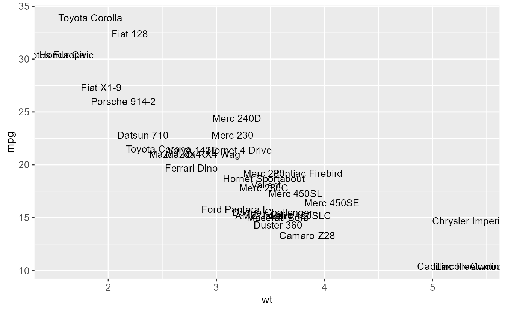

Two improvements have been made to [`geom_label()`](https://ggplot2.tidyverse.org/reference/geom_text.html). The first is that it now obeys an `angle` aesthetic.

<pre class='chroma'><code class='language-r' data-lang='r'>p + <a href='https://ggplot2.tidyverse.org/reference/geom_text.html'>geom_label</a>(<a href='https://ggplot2.tidyverse.org/reference/aes.html'>aes</a>(angle = <a href='https://rdrr.io/r/stats/Uniform.html'>runif</a>(<a href='https://rdrr.io/r/base/nrow.html'>nrow</a>(mtcars), -45, 45)))
</code></pre>
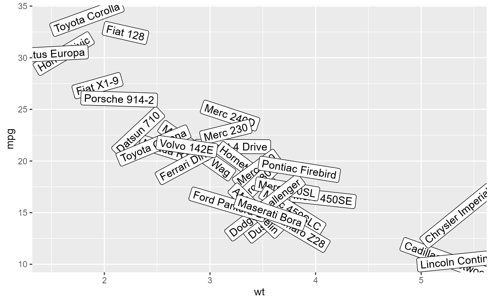

In addition, [`geom_label()`](https://ggplot2.tidyverse.org/reference/geom_text.html)'s `label.padding` argument can be controlled individually for every side of the text by using the [`margin()`](https://ggplot2.tidyverse.org/reference/element.html) function. The legend keys for labels has also changed to reflect the geom more accurately.

<pre class='chroma'><code class='language-r' data-lang='r'>p + <a href='https://ggplot2.tidyverse.org/reference/geom_text.html'>geom_label</a>(
  <a href='https://ggplot2.tidyverse.org/reference/aes.html'>aes</a>(colour = <a href='https://rdrr.io/r/base/factor.html'>factor</a>(cyl)), 
  label.padding = <a href='https://ggplot2.tidyverse.org/reference/element.html'>margin</a>(t = 2, r = 20, b = 1, l = 0)
)
</code></pre>
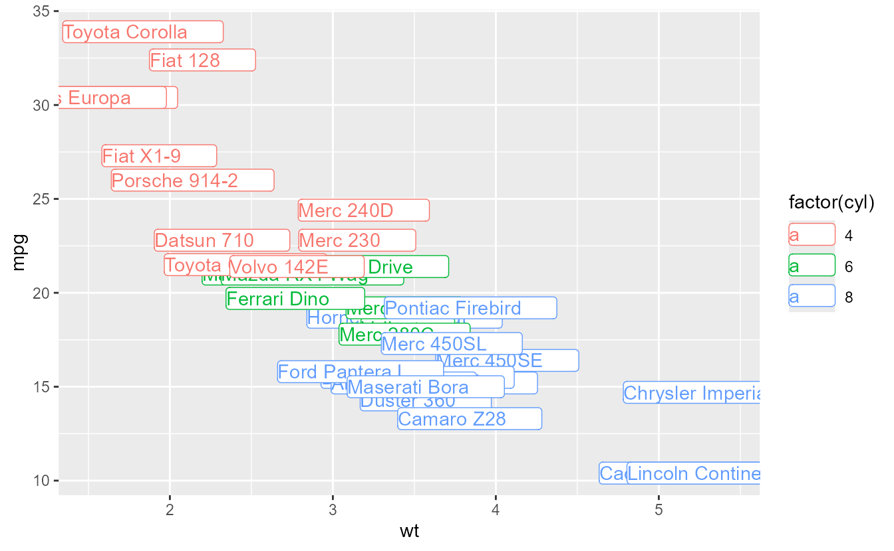

Like [`geom_density()`](https://ggplot2.tidyverse.org/reference/geom_density.html) before it, [`geom_violin()`](https://ggplot2.tidyverse.org/reference/geom_violin.html) now gains a `bounds` argument to restrict the range wherein density is estimated.

<pre class='chroma'><code class='language-r' data-lang='r'>df &lt;- <a href='https://rdrr.io/r/base/data.frame.html'>data.frame</a>(
  x = <a href='https://rdrr.io/r/base/c.html'>c</a>(<a href='https://rdrr.io/r/stats/Beta.html'>rbeta</a>(100, 0.5, 0.5), <a href='https://rdrr.io/r/stats/Beta.html'>rbeta</a>(100, 1, 1), <a href='https://rdrr.io/r/stats/Beta.html'>rbeta</a>(100, 2, 2)),
  group = <a href='https://rdrr.io/r/base/rep.html'>rep</a>(<a href='https://rdrr.io/r/base/c.html'>c</a>("A", "B", "C"), each = 100)
)

<a href='https://ggplot2.tidyverse.org/reference/ggplot.html'>ggplot</a>(df, <a href='https://ggplot2.tidyverse.org/reference/aes.html'>aes</a>(group, x)) +
  <a href='https://ggplot2.tidyverse.org/reference/geom_violin.html'>geom_violin</a>(bounds = <a href='https://rdrr.io/r/base/c.html'>c</a>(0, 1))
</code></pre>
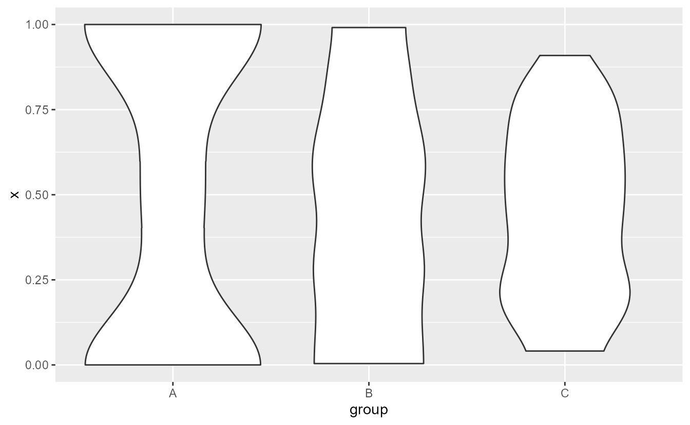

The [`geom_boxplot()`](https://ggplot2.tidyverse.org/reference/geom_boxplot.html) has acquired an option to remove (rather than hide) outliers. Setting `outliers = FALSE` removes outliers so that the plot limits do not take these into account. For hiding (and not removing) outliers, you can still set `outlier.shape = NA`. Also, it has gained a `staplewidth` argument that can be used to draw staples: horizontal lines at the end of the boxplot whiskers. The default, `staplewidth = 0`, will suppress the staples so your current box plots continue to look the same.

<pre class='chroma'><code class='language-r' data-lang='r'><a href='https://ggplot2.tidyverse.org/reference/ggplot.html'>ggplot</a>(diamonds, <a href='https://ggplot2.tidyverse.org/reference/aes.html'>aes</a>(cut, price)) +
  <a href='https://ggplot2.tidyverse.org/reference/geom_boxplot.html'>geom_boxplot</a>(outliers = FALSE, staplewidth = 0.5)
</code></pre>
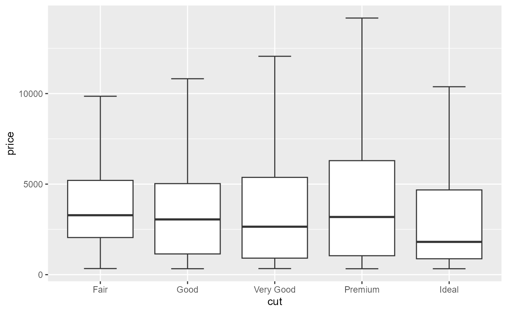

The scales functions now do a better job at reporting *which* scale has encountered an error.

<pre class='chroma'><code class='language-r' data-lang='r'><a href='https://ggplot2.tidyverse.org/reference/scale_brewer.html'>scale_colour_brewer</a>(breaks = 1:5, labels = 1:4)
#&gt; Error in `scale_colour_brewer()`:
#&gt; ! `breaks` and `labels` must have the same length.

<a href='https://ggplot2.tidyverse.org/reference/ggplot.html'>ggplot</a>(mpg, <a href='https://ggplot2.tidyverse.org/reference/aes.html'>aes</a>(class, displ)) +
  <a href='https://ggplot2.tidyverse.org/reference/geom_boxplot.html'>geom_boxplot</a>() +
  <a href='https://ggplot2.tidyverse.org/reference/scale_continuous.html'>scale_x_continuous</a>()
#&gt; Error in `scale_x_continuous()`:
#&gt; ! Discrete values supplied to continuous scale.
#&gt; ℹ Example values: "compact", "compact", "compact", "compact", and "compact"

<a href='https://ggplot2.tidyverse.org/reference/ggplot.html'>ggplot</a>(msleep, <a href='https://ggplot2.tidyverse.org/reference/aes.html'>aes</a>(bodywt - 1, brainwt)) +
  <a href='https://ggplot2.tidyverse.org/reference/geom_point.html'>geom_point</a>(na.rm = TRUE) +
  <a href='https://ggplot2.tidyverse.org/reference/scale_continuous.html'>scale_x_log10</a>()
#&gt; Warning in transformation$transform(x): NaNs produced
#&gt; Warning in scale_x_log10(): log-10 transformation introduced infinite values.
</code></pre>
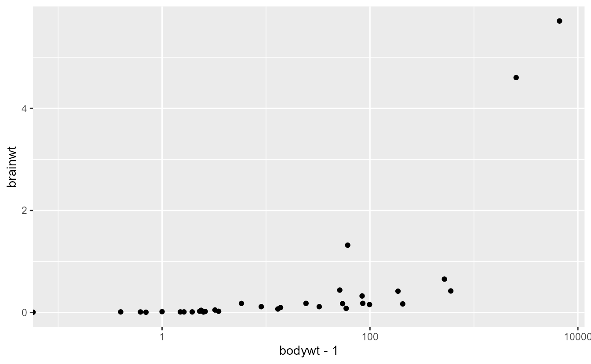

## Acknowledgements

Thank you to all people who have contributed issues, code and comments to this release:

[@92amartins](https://github.com/92amartins), [@a-torgovitsky](https://github.com/a-torgovitsky), [@aarongraybill](https://github.com/aarongraybill), [@aavogt](https://github.com/aavogt), [@agila5](https://github.com/agila5), [@ahcyip](https://github.com/ahcyip), [@AlexanderCasper](https://github.com/AlexanderCasper), [@alexkrohn](https://github.com/alexkrohn), [@alofting](https://github.com/alofting), [@andrewgustar](https://github.com/andrewgustar), [@antagomir](https://github.com/antagomir), [@aphalo](https://github.com/aphalo), [@Ari04T](https://github.com/Ari04T), [@AroneyS](https://github.com/AroneyS), [@Asa12138](https://github.com/Asa12138), [@ashgreat](https://github.com/ashgreat), [@averissimo](https://github.com/averissimo), [@bakerwm](https://github.com/bakerwm), [@balling-dev](https://github.com/balling-dev), [@banbh](https://github.com/banbh), [@barracuda156](https://github.com/barracuda156), [@BartJanvanRossum](https://github.com/BartJanvanRossum), [@beansrowning](https://github.com/beansrowning), [@benimwolfspelz](https://github.com/benimwolfspelz), [@bfordAIMS](https://github.com/bfordAIMS), [@bguiastr](https://github.com/bguiastr), [@bnicenboim](https://github.com/bnicenboim), [@BrianDiggs](https://github.com/BrianDiggs), [@bsgerber](https://github.com/bsgerber), [@burrapreeti](https://github.com/burrapreeti), [@bwiernik](https://github.com/bwiernik), [@ccsarapas](https://github.com/ccsarapas), [@CGlemser](https://github.com/CGlemser), [@chiajungTung](https://github.com/chiajungTung), [@chipsin87](https://github.com/chipsin87), [@cjvanlissa](https://github.com/cjvanlissa), [@CorradoLanera](https://github.com/CorradoLanera), [@danielneilson](https://github.com/danielneilson), [@danli349](https://github.com/danli349), [@DasHammett](https://github.com/DasHammett), [@davidhodge931](https://github.com/davidhodge931), [@DavisVaughan](https://github.com/DavisVaughan), [@dieghernan](https://github.com/dieghernan), [@Ductmonkey](https://github.com/Ductmonkey), [@edent](https://github.com/edent), [@Elham-adabi](https://github.com/Elham-adabi), [@ELICHOS](https://github.com/ELICHOS), [@eliocamp](https://github.com/eliocamp), [@ellisp](https://github.com/ellisp), [@emuise](https://github.com/emuise), [@erikdeluca](https://github.com/erikdeluca), [@f2il-kieranmace](https://github.com/f2il-kieranmace), [@FDylanT](https://github.com/FDylanT), [@fkohrt](https://github.com/fkohrt), [@francisbarton](https://github.com/francisbarton), [@fredcallaway](https://github.com/fredcallaway), [@frezza-metabolomics](https://github.com/frezza-metabolomics), [@GabrielHoffman](https://github.com/GabrielHoffman), [@gaospecial](https://github.com/gaospecial), [@garyzhubc](https://github.com/garyzhubc), [@gavinsimpson](https://github.com/gavinsimpson), [@Generalized](https://github.com/Generalized), [@ghost](https://github.com/ghost), [@giadasp](https://github.com/giadasp), [@GMSL1](https://github.com/GMSL1), [@grantmcdermott](https://github.com/grantmcdermott), [@hadley](https://github.com/hadley), [@hlynurhallgrims](https://github.com/hlynurhallgrims), [@holgerbrandl](https://github.com/holgerbrandl), [@hpages](https://github.com/hpages), [@HRodenhizer](https://github.com/HRodenhizer), [@hub-shale](https://github.com/hub-shale), [@hughjonesd](https://github.com/hughjonesd), [@ibuiltthis](https://github.com/ibuiltthis), [@ingewortel](https://github.com/ingewortel), [@isaacvock](https://github.com/isaacvock), [@Istalan](https://github.com/Istalan), [@istvankleijn](https://github.com/istvankleijn), [@jacobkasper](https://github.com/jacobkasper), [@jammainen](https://github.com/jammainen), [@jan-glx](https://github.com/jan-glx), [@JaredAllen2](https://github.com/JaredAllen2), [@jashapiro](https://github.com/jashapiro), [@jimjam-slam](https://github.com/jimjam-slam), [@jmuhlenkamp](https://github.com/jmuhlenkamp), [@jonspring](https://github.com/jonspring), [@JorisChau](https://github.com/JorisChau), [@joshhwuu](https://github.com/joshhwuu), [@jpeasari](https://github.com/jpeasari), [@jromanowska](https://github.com/jromanowska), [@jsacerot](https://github.com/jsacerot), [@jtlandis](https://github.com/jtlandis), [@jtr13](https://github.com/jtr13), [@jttoivon](https://github.com/jttoivon), [@karchern](https://github.com/karchern), [@klin333](https://github.com/klin333), [@kmavrommatis](https://github.com/kmavrommatis), [@kramerrs](https://github.com/kramerrs), [@krlmlr](https://github.com/krlmlr), [@kylebutts](https://github.com/kylebutts), [@larmarange](https://github.com/larmarange), [@latot](https://github.com/latot), [@lhami](https://github.com/lhami), [@liang09255](https://github.com/liang09255), [@linzi-sg](https://github.com/linzi-sg), [@lionel-](https://github.com/lionel-), [@lnarwhale](https://github.com/lnarwhale), [@manjumc1975](https://github.com/manjumc1975), [@mariadelmarq](https://github.com/mariadelmarq), [@matanhakim](https://github.com/matanhakim), [@math-mcshane](https://github.com/math-mcshane), [@mattgalbraith](https://github.com/mattgalbraith), [@matthewjnield](https://github.com/matthewjnield), [@mcwayrm](https://github.com/mcwayrm), [@melissagwolf](https://github.com/melissagwolf), [@MichaelChirico](https://github.com/MichaelChirico), [@MikkoVihtakari](https://github.com/MikkoVihtakari), [@MjelleLab](https://github.com/MjelleLab), [@mjskay](https://github.com/mjskay), [@mkoohafkan](https://github.com/mkoohafkan), [@mmokrejs](https://github.com/mmokrejs), [@modmost](https://github.com/modmost), [@moodymudskipper](https://github.com/moodymudskipper), [@morrisseyj](https://github.com/morrisseyj), [@mps9506](https://github.com/mps9506), [@Nh-code](https://github.com/Nh-code), [@njtierney](https://github.com/njtierney), [@oliviercailloux](https://github.com/oliviercailloux), [@olivroy](https://github.com/olivroy), [@otaviolovison](https://github.com/otaviolovison), [@pablobernabeu](https://github.com/pablobernabeu), [@paulatn240](https://github.com/paulatn240), [@phauchamps](https://github.com/phauchamps), [@quantixed](https://github.com/quantixed), [@ralmond](https://github.com/ralmond), [@ramiromagno](https://github.com/ramiromagno), [@reallzg](https://github.com/reallzg), [@retodomax](https://github.com/retodomax), [@robbiebatley](https://github.com/robbiebatley), [@Rong-Zh](https://github.com/Rong-Zh), [@rossellhayes](https://github.com/rossellhayes), [@RoyalTS](https://github.com/RoyalTS), [@rvalieris](https://github.com/rvalieris), [@s-andrews](https://github.com/s-andrews), [@s-elsheikh](https://github.com/s-elsheikh), [@schloerke](https://github.com/schloerke), [@Sckende](https://github.com/Sckende), [@sdmason](https://github.com/sdmason), [@sirallen](https://github.com/sirallen), [@slowkow](https://github.com/slowkow), [@spaette](https://github.com/spaette), [@steveharoz](https://github.com/steveharoz), [@sunroofgod](https://github.com/sunroofgod), [@szimmer](https://github.com/szimmer), [@tbates](https://github.com/tbates), [@teunbrand](https://github.com/teunbrand), [@tfjaeger](https://github.com/tfjaeger), [@thomasp85](https://github.com/thomasp85), [@TimBMK](https://github.com/TimBMK), [@TimTaylor](https://github.com/TimTaylor), [@tjebo](https://github.com/tjebo), [@trekonom](https://github.com/trekonom), [@tungttnguyen](https://github.com/tungttnguyen), [@twest820](https://github.com/twest820), [@UliSchopp](https://github.com/UliSchopp), [@vnijs](https://github.com/vnijs), [@warnes](https://github.com/warnes), [@wbvguo](https://github.com/wbvguo), [@willgearty](https://github.com/willgearty), [@Yann-C-INN](https://github.com/Yann-C-INN), [@yannk-lm](https://github.com/yannk-lm), [@Yunuuuu](https://github.com/Yunuuuu), [@yutannihilation](https://github.com/yutannihilation), [@yuw444](https://github.com/yuw444), [@zekiakyol](https://github.com/zekiakyol), and [@zhenglukai](https://github.com/zhenglukai).

