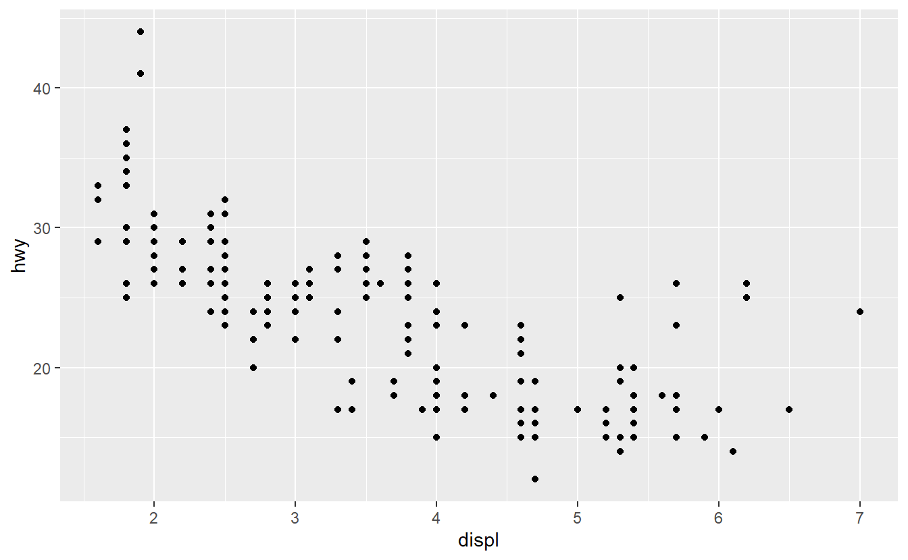
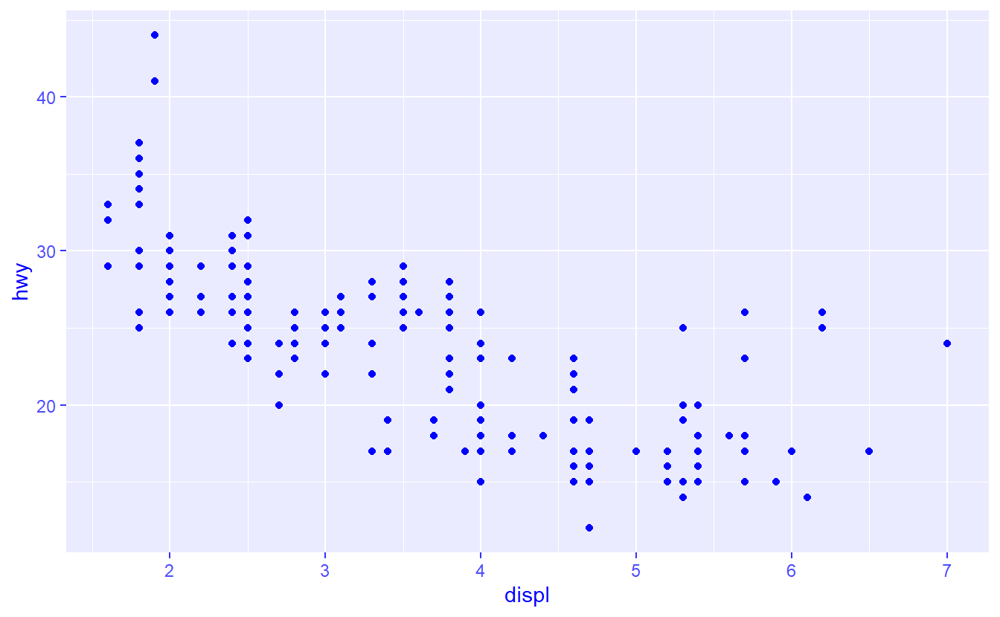
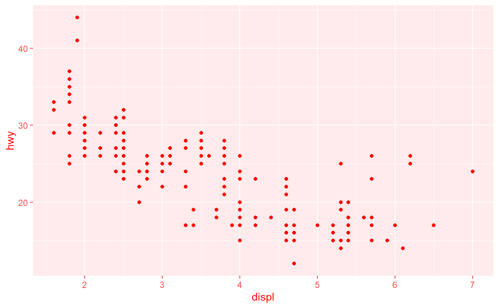

<!--
TODO:
* [x] Look over / edit the post's title in the yaml
* [x] Edit (or delete) the description; note this appears in the Twitter card
* [x] Pick category and tags (see existing with [`hugodown::tidy_show_meta()`](https://rdrr.io/pkg/hugodown/man/use_tidy_post.html))
* [x] Find photo & update yaml metadata
* [x] Create `thumbnail-sq.jpg`; height and width should be equal
* [x] Create `thumbnail-wd.jpg`; width should be >5x height
* [x] [`hugodown::use_tidy_thumbnails()`](https://rdrr.io/pkg/hugodown/man/use_tidy_post.html)
* [ ] Add intro sentence, e.g. the standard tagline for the package
* [ ] [`usethis::use_tidy_thanks()`](https://usethis.r-lib.org/reference/use_tidy_thanks.html)
-->

We are on the verge of releasing version 4.0.0 of the ggplot2 package. That is right: a new major version release! We only tend to do these when something fundamental changes in ggplot2. For example: ggplot2 2.0.0 brought the ggproto extension system and 3.0.0 switched to tidy evaluation. This time around, we're swapping out the S3 object oriented programming system for the newer S7 system. Because of this major change, we expect that some packages might break, despite our best efforts to minimise the implications of the switch. This here is a guide for package authors that might be affected by the changes. It details some changes in classes and functions that may affect downstream packages, and gives recommendations how broken parts might be repaired. If you don't maintain a package that depends on ggplot2, you can skip reading this guide and simply take away that there will be a release soon.

## Testing compatibility

If you are a package author that depends on ggplot2 and you want to know how your package might be affected, you can try the current development version from GitHub using the code below.

``` r
pak::pak("tidyverse/ggplot2")
```

It should also automatically install scales 1.4.0, which is needed for this release. One of the things to inspect first is the result of R CMD check on your package, with the development version of ggplot2 installed. It can be invoked by [`devtools::check()`](https://devtools.r-lib.org/reference/check.html). This is also the check CRAN runs on your package to keep tabs on whether your package continues to work. If you are lucky, it will happily report that there are no problems and you can stop reading this guide! If you are unlucky, it will list errors and warnings associated with running your package. It might be that your examples no longer work, test assumptions are no longer met or vignettes run amock. If you use visual snapshots from the vdiffr package, you may certainly expect (mostly harmless) imperceptible changes.

As you're still reading, I'm assuming there are problems to solve. The next step is determining who should fix these problems. We have tried to facilitate some backwards compatibility, but we also cannot anticipate every contingency. If something is broken with classes, generics, methods or object oriented programming in general, this guide describes problems and remedies. Because ggplot2 does not go back to S3, we hope that you will facilitate the migration to S7 in your code where appropriate. If there are other issues that pop up that you think might be best repaired in ggplot2, you can post an issue in the [issue tracker](https://github.com/tidyverse/ggplot2/issues).

That said, let's go through S7 a bit. [S7](https://rconsortium.github.io/S7/) is a newer object oriented programming system that is built on top of the older S3 system. It was build by a collaboration of developers from different parts in the R community, ranging from R Core, to Bioconductor to the tidyverse. It aims to succeed the simpler S3 and more complex S4 systems. Aside from simply modernising ggplot2, the migration to S7 also enables features that are hard to implement in S3, such as double dispatch. For years now, people have been asking for more control over how plots are declared at both sides of the `+` operator, which S7 will facilitate.

## Classes

The ggplot2 package uses a mixture of object oriented programming systems. One of these systems is the ggproto system that powers the extension mechanism and remains unchanged. The other system is S3 which has been supplanted by S7 in the recent ggplot2 update. You might notice this from the new S7 class objects that ggplot2 defines, like `class_ggplot` or `class_theme`.

<div class="highlight">

<pre class='chroma'><code class='language-r' data-lang='r'><span><span class='kr'><a href='https://rdrr.io/r/base/library.html'>library</a></span><span class='o'>(</span><span class='nv'><a href='https://ggplot2.tidyverse.org'>ggplot2</a></span><span class='o'>)</span></span>
<span><span class='nv'>class_ggplot</span></span>
<span><span class='c'>#&gt; &lt;ggplot2::ggplot&gt; class</span></span>
<span><span class='c'>#&gt; @ parent     : &lt;ggplot2::gg&gt;</span></span>
<span><span class='c'>#&gt; @ constructor: function(data, layers, scales, guides, mapping, theme, coordinates, facet, layout, labels, meta, plot_env) &#123;...&#125;</span></span>
<span><span class='c'>#&gt; @ validator  : &lt;NULL&gt;</span></span>
<span><span class='c'>#&gt; @ properties :</span></span>
<span><span class='c'>#&gt;  $ data       : &lt;ANY&gt;             </span></span>
<span><span class='c'>#&gt;  $ layers     : &lt;list&gt;            </span></span>
<span><span class='c'>#&gt;  $ scales     : S3&lt;ScalesList&gt;    </span></span>
<span><span class='c'>#&gt;  $ guides     : S3&lt;Guides&gt;        </span></span>
<span><span class='c'>#&gt;  $ mapping    : &lt;ggplot2::mapping&gt;</span></span>
<span><span class='c'>#&gt;  $ theme      : &lt;ggplot2::theme&gt;  </span></span>
<span><span class='c'>#&gt;  $ coordinates: S3&lt;Coord&gt;         </span></span>
<span><span class='c'>#&gt;  $ facet      : S3&lt;Facet&gt;         </span></span>
<span><span class='c'>#&gt;  $ layout     : S3&lt;Layout&gt;        </span></span>
<span><span class='c'>#&gt;  $ labels     : &lt;ggplot2::labels&gt; </span></span>
<span><span class='c'>#&gt;  $ meta       : &lt;list&gt;            </span></span>
<span><span class='c'>#&gt;  $ plot_env   : &lt;environment&gt;</span></span>
<span></span></code></pre>

</div>

### Properties

In prior incarnations, ggplot2 defined the ggplot class as a named list with the `"ggplot"` class attribute. Classes in S7 are more formal than in S3 and have properties which can have restricted classes. For example, in the ggplot class, the `data` property can be anything (because it will go through [`fortify()`](https://ggplot2.tidyverse.org/reference/fortify.html) to become a data frame), the `facet` property must be the `Facet` ggproto class, and the `theme` property must be an S7 theme object.

In contrast to S3, we cannot simply add new items to `ggplot` object [^1]. The way to add additional information to classes in S7 is to make a subclass with additional properties. For example, if we want to add colour information to a new plot, we can do the following:

<div class="highlight">

<pre class='chroma'><code class='language-r' data-lang='r'><span><span class='nv'>inked_ggplot</span> <span class='o'>&lt;-</span> <span class='nf'>S7</span><span class='nf'>::</span><span class='nf'><a href='https://rconsortium.github.io/S7/reference/new_class.html'>new_class</a></span><span class='o'>(</span></span>
<span>  name <span class='o'>=</span> <span class='s'>"inked_ggplot"</span>,</span>
<span>  parent <span class='o'>=</span> <span class='nv'>class_ggplot</span>, </span>
<span>  properties <span class='o'>=</span> <span class='nf'><a href='https://rdrr.io/r/base/list.html'>list</a></span><span class='o'>(</span>ink <span class='o'>=</span> <span class='nf'>S7</span><span class='nf'>::</span><span class='nv'><a href='https://rconsortium.github.io/S7/reference/base_classes.html'>class_character</a></span><span class='o'>)</span></span>
<span><span class='o'>)</span></span>
<span></span>
<span><span class='nv'>inked_ggplot</span></span>
<span><span class='c'>#&gt; &lt;inked_ggplot&gt; class</span></span>
<span><span class='c'>#&gt; @ parent     : &lt;ggplot2::ggplot&gt;</span></span>
<span><span class='c'>#&gt; @ constructor: function(data, layers, scales, guides, mapping, theme, coordinates, facet, layout, labels, meta, plot_env, ink) &#123;...&#125;</span></span>
<span><span class='c'>#&gt; @ validator  : &lt;NULL&gt;</span></span>
<span><span class='c'>#&gt; @ properties :</span></span>
<span><span class='c'>#&gt;  $ data       : &lt;ANY&gt;             </span></span>
<span><span class='c'>#&gt;  $ layers     : &lt;list&gt;            </span></span>
<span><span class='c'>#&gt;  $ scales     : S3&lt;ScalesList&gt;    </span></span>
<span><span class='c'>#&gt;  $ guides     : S3&lt;Guides&gt;        </span></span>
<span><span class='c'>#&gt;  $ mapping    : &lt;ggplot2::mapping&gt;</span></span>
<span><span class='c'>#&gt;  $ theme      : &lt;ggplot2::theme&gt;  </span></span>
<span><span class='c'>#&gt;  $ coordinates: S3&lt;Coord&gt;         </span></span>
<span><span class='c'>#&gt;  $ facet      : S3&lt;Facet&gt;         </span></span>
<span><span class='c'>#&gt;  $ layout     : S3&lt;Layout&gt;        </span></span>
<span><span class='c'>#&gt;  $ labels     : &lt;ggplot2::labels&gt; </span></span>
<span><span class='c'>#&gt;  $ meta       : &lt;list&gt;            </span></span>
<span><span class='c'>#&gt;  $ plot_env   : &lt;environment&gt;     </span></span>
<span><span class='c'>#&gt;  $ ink        : &lt;character&gt;</span></span>
<span></span></code></pre>

</div>

When you define a new class, the object you've assigned it to automatically becomes the class definition which comes with a free, standard constructor. This means that we can start building new plots with our subclass right away. Note that we haven't implemented any behaviour around the `ink` property (yet), so it will just print like a normal plot.

<div class="highlight">

<pre class='chroma'><code class='language-r' data-lang='r'><span><span class='nv'>my_plot</span> <span class='o'>&lt;-</span> <span class='nf'>inked_ggplot</span><span class='o'>(</span>data <span class='o'>=</span> <span class='nv'>mpg</span>, ink <span class='o'>=</span> <span class='s'>"red"</span><span class='o'>)</span> <span class='o'>+</span></span>
<span>  <span class='nf'><a href='https://ggplot2.tidyverse.org/reference/geom_point.html'>geom_point</a></span><span class='o'>(</span><span class='nf'><a href='https://ggplot2.tidyverse.org/reference/aes.html'>aes</a></span><span class='o'>(</span><span class='nv'>displ</span>, <span class='nv'>hwy</span><span class='o'>)</span><span class='o'>)</span></span>
<span><span class='nv'>my_plot</span></span>
</code></pre>


</div>

In contrast to S3, where you would change list-items by using `$`, in S7 you can use `@` to read and write properties. So if we want to change the stored `ink` colour, we can use:

<div class="highlight">

<pre class='chroma'><code class='language-r' data-lang='r'><span><span class='nv'>my_plot</span><span class='o'>@</span><span class='nv'>ink</span> <span class='o'>&lt;-</span> <span class='s'>"blue"</span></span></code></pre>

</div>

### Testing

In S3, the recommended way to test for the class of an object is to use a testing function. An example is [`is.factor()`](https://rdrr.io/r/base/factor.html) but it may be that such a testing function doesn't exist. In that case you can use [`inherits()`](https://rdrr.io/r/base/class.html). In S7, it is still recommended to use dedicating testing functions. However, if these are absent, you can use [`S7::S7_inherits()`](https://rconsortium.github.io/S7/reference/S7_inherits.html). If we wanted to write a testing function for our new class, we can do that as follows:

<div class="highlight">

<pre class='chroma'><code class='language-r' data-lang='r'><span><span class='nv'>is_inked_ggplot</span> <span class='o'>&lt;-</span> <span class='kr'>function</span><span class='o'>(</span><span class='nv'>x</span><span class='o'>)</span> <span class='nf'>S7</span><span class='nf'>::</span><span class='nf'><a href='https://rconsortium.github.io/S7/reference/S7_inherits.html'>S7_inherits</a></span><span class='o'>(</span><span class='nv'>x</span>, <span class='nv'>inked_ggplot</span><span class='o'>)</span></span>
<span></span>
<span><span class='c'># Is not our class</span></span>
<span><span class='nf'>is_inked_ggplot</span><span class='o'>(</span><span class='nf'><a href='https://ggplot2.tidyverse.org/reference/ggplot.html'>ggplot</a></span><span class='o'>(</span><span class='o'>)</span><span class='o'>)</span></span>
<span><span class='c'>#&gt; [1] FALSE</span></span>
<span></span><span></span>
<span><span class='c'># Is our class</span></span>
<span><span class='nf'>is_inked_ggplot</span><span class='o'>(</span><span class='nv'>my_plot</span><span class='o'>)</span></span>
<span><span class='c'>#&gt; [1] TRUE</span></span>
<span></span></code></pre>

</div>

### Overview

To give an overview of ggplot2's S7 classes, we include the table below. The table also lists the recommended way to test for the class.

<div class="highlight">

| Old S3 Class | New S7 Class | Testing functions |
|:---------------|:------------------|:-------------------------------------|
| "ggplot2" | class_ggplot | `is_ggplot(x)` |
| "ggplot_built" | class_ggplot_built | `S7::S7_inherits(x, class_ggplot_built)` |
| "labs" | class_labels | `S7::S7_inherits(x, class_labels)` |
| "uneval" | class_mapping | `is_mapping(x)` |
| "theme" | class_theme | `is_theme(x)` |
| "element_blank" | element_blank | `is_theme_element(x, "blank")` |
| "element_line" | element_line | `is_theme_element(x, "line")` |
| "element_rect" | element_rect | `is_theme_element(x, "rect")` |
| "element_text" | element_text | `is_theme_element(x, "text")` |
| NA | element_polygon | `is_theme_element(x, "polygon")` |
| NA | element_point | `is_theme_element(x, "point")` |
| NA | element_geom | `is_theme_element(x, "geom")` |

</div>

### Testing

It should be noted that the `is_*()` testing functions in ggplot2 already know about the S7-ness of the new classes. This is handy when it comes to test expectations, because the testing function can be used instead of the S3/S7 class expectations. Previously, you might have used [`testthat::expect_s3_class()`](https://testthat.r-lib.org/reference/inheritance-expectations.html), but it is better now to test with [`testthat::expect_s7_class()`](https://testthat.r-lib.org/reference/inheritance-expectations.html) or use an `is_*()` function instead.

<div class="highlight">

<pre class='chroma'><code class='language-r' data-lang='r'><span><span class='nf'>testthat</span><span class='nf'>::</span><span class='nf'><a href='https://testthat.r-lib.org/reference/test_that.html'>test_that</a></span><span class='o'>(</span></span>
<span>  <span class='s'>"the plot object has the ggplot class"</span>,</span>
<span>  <span class='o'>&#123;</span></span>
<span>    <span class='nv'>plot</span> <span class='o'>&lt;-</span> <span class='nf'><a href='https://ggplot2.tidyverse.org/reference/ggplot.html'>ggplot</a></span><span class='o'>(</span><span class='o'>)</span></span>
<span>    </span>
<span>    <span class='c'># Works regardless of S3 or S7</span></span>
<span>    <span class='nf'>testthat</span><span class='nf'>::</span><span class='nf'><a href='https://testthat.r-lib.org/reference/logical-expectations.html'>expect_true</a></span><span class='o'>(</span><span class='nf'><a href='https://ggplot2.tidyverse.org/reference/is_tests.html'>is_ggplot</a></span><span class='o'>(</span><span class='nv'>plot</span><span class='o'>)</span><span class='o'>)</span></span>
<span>    </span>
<span>    <span class='c'># This will become dysfunctional in the future.</span></span>
<span>    <span class='c'># Do not use this!</span></span>
<span>    <span class='nf'>testthat</span><span class='nf'>::</span><span class='nf'><a href='https://testthat.r-lib.org/reference/inheritance-expectations.html'>expect_s3_class</a></span><span class='o'>(</span><span class='nv'>plot</span>, <span class='s'>"ggplot"</span><span class='o'>)</span></span>
<span>    </span>
<span>    <span class='c'># This will work in the new version</span></span>
<span>    <span class='nf'>testthat</span><span class='nf'>::</span><span class='nf'><a href='https://testthat.r-lib.org/reference/inheritance-expectations.html'>expect_s7_class</a></span><span class='o'>(</span><span class='nv'>plot</span>, <span class='nv'>class_ggplot</span><span class='o'>)</span></span>
<span>  <span class='o'>&#125;</span></span>
<span><span class='o'>)</span></span>
<span><span class='c'>#&gt; <span style='color: #00BB00;'>Test passed</span> 🎉</span></span>
<span></span></code></pre>

</div>

The ggplot2 package manually appends the `"ggplot"` class for backwards compatibility reasons (likewise for `"theme"`). However, once this phases out, the [`testthat::expect_s3_class()`](https://testthat.r-lib.org/reference/inheritance-expectations.html) expectation will become untenable. It is also currently flawed, as it does not work for subclasses!

<div class="highlight">

<pre class='chroma'><code class='language-r' data-lang='r'><span><span class='nf'>testthat</span><span class='nf'>::</span><span class='nf'><a href='https://testthat.r-lib.org/reference/test_that.html'>test_that</a></span><span class='o'>(</span></span>
<span>  <span class='s'>"the inked plot has the ggplot class"</span>,</span>
<span>  <span class='o'>&#123;</span></span>
<span>    <span class='nv'>plot</span> <span class='o'>&lt;-</span> <span class='nf'>inked_ggplot</span><span class='o'>(</span><span class='o'>)</span></span>
<span>    <span class='nf'>testthat</span><span class='nf'>::</span><span class='nf'><a href='https://testthat.r-lib.org/reference/inheritance-expectations.html'>expect_s3_class</a></span><span class='o'>(</span><span class='nv'>plot</span>, <span class='s'>"ggplot"</span><span class='o'>)</span></span>
<span>  <span class='o'>&#125;</span></span>
<span><span class='o'>)</span></span>
<span><span class='c'>#&gt; ── <span style='color: #BBBB00; font-weight: bold;'>Failure</span><span style='font-weight: bold;'>: the inked plot has the ggplot class</span> ────────────────────────────────</span></span>
<span><span class='c'>#&gt; `plot` inherits from 'inked_ggplot'/'ggplot2::ggplot'/'ggplot2::gg'/'S7_object' not 'ggplot'.</span></span>
<span></span><span><span class='c'>#&gt; <span style='color: #BBBB00; font-weight: bold;'>Error</span><span style='font-weight: bold;'>:</span></span></span>
<span><span class='c'>#&gt; <span style='color: #BBBB00;'>!</span> Test failed</span></span>
<span></span></code></pre>

</div>

The advice herein is thus to use [`is_ggplot()`](https://ggplot2.tidyverse.org/reference/is_tests.html).

## Generics and methods

If you are new to object oriented programming in R, you might be unfamiliar with what the terms 'generic' and 'methods' mean. They are a form of 'polymorphism', that allow us to use a single function, called the 'generic' function, with different implementations for different classes (where one such implementation is called a 'method'). A well known generic is [`print()`](https://rdrr.io/r/base/print.html), which does different things for different classes. For example `print(1:10)` prints the numeric vector to the console, but `print(my_plot)` opens a graphics device and renders the plot.

### Your methods for ggplot's generics

The ggplot2 package also declares some generic functions and contains methods for these, most of which revolve around plot construction. The migration to S7 means that the generics and methods defined by ggplot2 also migrate.

It is also good to mention that when your package registers a method for one of ggplot2's generics, ggplot2's generic is called an 'external generic' from the point of view of your package. With S7, you should include [`S7::methods_register()`](https://rconsortium.github.io/S7/reference/methods_register.html) in your package's `.onLoad()` call.

While it is possible to define S7 methods for S3 generics, it is not possible to define S3 methods for S7 generics.

<div class="highlight">

<pre class='chroma'><code class='language-r' data-lang='r'><span><span class='c'># Declare an S7 generic</span></span>
<span><span class='nv'>apply_ink</span> <span class='o'>&lt;-</span> <span class='nf'>S7</span><span class='nf'>::</span><span class='nf'><a href='https://rconsortium.github.io/S7/reference/new_generic.html'>new_generic</a></span><span class='o'>(</span><span class='s'>"apply_ink"</span>, <span class='s'>"plot"</span><span class='o'>)</span></span>
<span></span>
<span><span class='c'># Attempt to implement an S3 method</span></span>
<span><span class='nv'>apply_ink.inked_ggplot</span> <span class='o'>&lt;-</span> <span class='kr'>function</span><span class='o'>(</span><span class='nv'>plot</span>, <span class='nv'>...</span><span class='o'>)</span> <span class='o'>&#123;</span></span>
<span>  <span class='c'># Edit plot to our liking</span></span>
<span>  <span class='nv'>plot</span><span class='o'>@</span><span class='nv'>theme</span> <span class='o'>&lt;-</span> <span class='nf'><a href='https://ggplot2.tidyverse.org/reference/ggtheme.html'>theme_gray</a></span><span class='o'>(</span>ink <span class='o'>=</span> <span class='nv'>plot</span><span class='o'>@</span><span class='nv'>ink</span><span class='o'>)</span> <span class='o'>+</span> <span class='nv'>plot</span><span class='o'>@</span><span class='nv'>theme</span></span>
<span>  <span class='nv'>plot</span></span>
<span><span class='o'>&#125;</span></span>
<span></span>
<span><span class='c'># Burn your fingers</span></span>
<span><span class='nf'>apply_ink</span><span class='o'>(</span><span class='nv'>my_plot</span><span class='o'>)</span></span>
<span><span class='c'>#&gt; Error: Can't find method for `apply_ink(&lt;inked_ggplot&gt;)`.</span></span>
<span></span></code></pre>

</div>

To allow for a smoother transition from S3 to S7, we plan to keep S3 generics around for another release cycle but will permanently disable them in the future in favour of the S7 generics. Here is an overview of which S7 generics supplant which S3 generics:

<div class="highlight">

| Old S3 Generic | New S7 Generic | Description |
|:--------------|:--------------|:------------------------------------------|
| [`ggplot_add()`](https://ggplot2.tidyverse.org/reference/update_ggplot.html) | [`update_ggplot()`](https://ggplot2.tidyverse.org/reference/update_ggplot.html) | Determines what happens when you `+` an object to a plot. |
| [`ggplot_build()`](https://ggplot2.tidyverse.org/reference/build_ggplot.html) | [`build_ggplot()`](https://ggplot2.tidyverse.org/reference/build_ggplot.html) | Processes data for display in a plot. |
| [`ggplot_gtable()`](https://ggplot2.tidyverse.org/reference/gtable_ggplot.html) | [`gtable_ggplot()`](https://ggplot2.tidyverse.org/reference/gtable_ggplot.html) | Renders a processed plot to a gtable object. |
| [`element_grob()`](https://ggplot2.tidyverse.org/reference/draw_element.html) | [`draw_element()`](https://ggplot2.tidyverse.org/reference/draw_element.html) | Renders a theme element. |

</div>

If your package implements methods for one of the old S3 generics, we recommend to replace these with S7 in a timely manner. An important difference between S3 and S7 is that S7 does not use [`NextMethod()`](https://rdrr.io/r/base/UseMethod.html) to magically invoke parental methods on children. Instead, you can use [`S7::super()`](https://rconsortium.github.io/S7/reference/super.html) to explicitly convert the subclass to a parent before invoking the generic again.

<div class="highlight">

<pre class='chroma'><code class='language-r' data-lang='r'><span><span class='nf'>S7</span><span class='nf'>::</span><span class='nf'><a href='https://rconsortium.github.io/S7/reference/method.html'>method</a></span><span class='o'>(</span><span class='nv'>build_ggplot</span>, <span class='nv'>inked_ggplot</span><span class='o'>)</span> <span class='o'>&lt;-</span> <span class='kr'>function</span><span class='o'>(</span><span class='nv'>plot</span>, <span class='nv'>...</span><span class='o'>)</span> <span class='o'>&#123;</span></span>
<span>  <span class='c'># Edit plot to our liking</span></span>
<span>  <span class='nv'>plot</span><span class='o'>@</span><span class='nv'>theme</span> <span class='o'>&lt;-</span> <span class='nf'><a href='https://ggplot2.tidyverse.org/reference/ggtheme.html'>theme_gray</a></span><span class='o'>(</span>ink <span class='o'>=</span> <span class='nv'>plot</span><span class='o'>@</span><span class='nv'>ink</span><span class='o'>)</span> <span class='o'>+</span> <span class='nv'>plot</span><span class='o'>@</span><span class='nv'>theme</span></span>
<span>  </span>
<span>  <span class='c'># Invoke next method</span></span>
<span>  <span class='nf'><a href='https://ggplot2.tidyverse.org/reference/build_ggplot.html'>build_ggplot</a></span><span class='o'>(</span><span class='nf'>S7</span><span class='nf'>::</span><span class='nf'><a href='https://rconsortium.github.io/S7/reference/super.html'>super</a></span><span class='o'>(</span><span class='nv'>plot</span>, to <span class='o'>=</span> <span class='nv'>class_ggplot</span><span class='o'>)</span>, <span class='nv'>...</span><span class='o'>)</span></span>
<span><span class='o'>&#125;</span></span>
<span></span>
<span><span class='nv'>my_plot</span></span>
</code></pre>


</div>

Just to show that the new property in our subclass works as expected:

<div class="highlight">

<pre class='chroma'><code class='language-r' data-lang='r'><span><span class='nv'>my_plot</span><span class='o'>@</span><span class='nv'>ink</span> <span class='o'>&lt;-</span> <span class='s'>"red"</span></span>
<span><span class='nv'>my_plot</span></span>
</code></pre>


</div>

### Your generics with methods for ggplot2's classes

Alternatively, it might be that you package has generic functions and methods that handle some of ggplot2's classes. The S7 system has its own way of handling class names, which means that S3 function name patterns of the form `{generic_name}.{class_name}` no longer invoke the correct method for S7 classes.

<div class="highlight">

<pre class='chroma'><code class='language-r' data-lang='r'><span><span class='c'># Declare S3 generic</span></span>
<span><span class='nv'>foo</span> <span class='o'>&lt;-</span> <span class='kr'>function</span><span class='o'>(</span><span class='nv'>x</span>, <span class='nv'>...</span><span class='o'>)</span> <span class='o'>&#123;</span></span>
<span>  <span class='kr'><a href='https://rdrr.io/r/base/UseMethod.html'>UseMethod</a></span><span class='o'>(</span><span class='s'>"foo"</span><span class='o'>)</span></span>
<span><span class='o'>&#125;</span></span>
<span></span>
<span><span class='c'># Implement S3 method</span></span>
<span><span class='nv'>foo.labels</span> <span class='o'>&lt;-</span> <span class='kr'>function</span><span class='o'>(</span><span class='nv'>x</span>, <span class='nv'>...</span><span class='o'>)</span> <span class='o'>&#123;</span></span>
<span>  <span class='nv'>x</span><span class='o'>[</span><span class='o'>]</span> <span class='o'>&lt;-</span> <span class='nf'><a href='https://rdrr.io/r/base/lapply.html'>lapply</a></span><span class='o'>(</span><span class='nv'>x</span>, <span class='nv'>toupper</span><span class='o'>)</span></span>
<span>  <span class='nv'>x</span></span>
<span><span class='o'>&#125;</span></span>
<span></span>
<span><span class='c'># Burn your fingers</span></span>
<span><span class='nf'>foo</span><span class='o'>(</span><span class='nf'><a href='https://ggplot2.tidyverse.org/reference/labs.html'>labs</a></span><span class='o'>(</span>colour <span class='o'>=</span> <span class='s'>"my lowercase title"</span><span class='o'>)</span><span class='o'>)</span></span>
<span><span class='c'>#&gt; Error in UseMethod("foo"): no applicable method for 'foo' applied to an object of class "c('ggplot2::labels', 'gg', 'S7_object')"</span></span>
<span></span></code></pre>

</div>

Please note that the [`ggplot()`](https://ggplot2.tidyverse.org/reference/ggplot.html) and [`theme()`](https://ggplot2.tidyverse.org/reference/theme.html) still produces objects with the `"ggplot"` and `"theme"` class for backwards compatibility, but this is scheduled to be removed in the future. The best remedy the dilemma with S3 would be to use [`S7::method()`](https://rconsortium.github.io/S7/reference/method.html), which also works for S3 generics.

<div class="highlight">

<pre class='chroma'><code class='language-r' data-lang='r'><span><span class='c'># Note that `foo()` is still an S3 generic</span></span>
<span><span class='nf'>S7</span><span class='nf'>::</span><span class='nf'><a href='https://rconsortium.github.io/S7/reference/method.html'>method</a></span><span class='o'>(</span><span class='nv'>foo</span>, <span class='nv'>class_labels</span><span class='o'>)</span> <span class='o'>&lt;-</span> <span class='kr'>function</span><span class='o'>(</span><span class='nv'>x</span>, <span class='nv'>...</span><span class='o'>)</span> <span class='o'>&#123;</span></span>
<span>  <span class='nv'>x</span><span class='o'>[</span><span class='o'>]</span> <span class='o'>&lt;-</span> <span class='nf'><a href='https://rdrr.io/r/base/lapply.html'>lapply</a></span><span class='o'>(</span><span class='nv'>x</span>, <span class='nv'>toupper</span><span class='o'>)</span></span>
<span>  <span class='nv'>x</span></span>
<span><span class='o'>&#125;</span></span>
<span></span>
<span><span class='c'># Note text has updated</span></span>
<span><span class='nf'>foo</span><span class='o'>(</span><span class='nf'><a href='https://ggplot2.tidyverse.org/reference/labs.html'>labs</a></span><span class='o'>(</span>colour <span class='o'>=</span> <span class='s'>"my lowercase title"</span><span class='o'>)</span><span class='o'>)</span></span>
<span><span class='c'>#&gt; &lt;ggplot2::labels&gt; List of 1</span></span>
<span><span class='c'>#&gt;  $ colour: chr "MY LOWERCASE TITLE"</span></span>
<span></span></code></pre>

</div>

If that is not an option, because you may not want to depend on S7, you can *currently* use a little hack. The hack is to prepend the S7 class prefix in the class name of the S3 method. This prefix is the name of the package that defines the class, followed by `::`.

<div class="highlight">

<pre class='chroma'><code class='language-r' data-lang='r'><span><span class='nv'>`foo.ggplot2::labels`</span> <span class='o'>&lt;-</span> <span class='kr'>function</span><span class='o'>(</span><span class='nv'>x</span>, <span class='nv'>...</span><span class='o'>)</span> <span class='o'>&#123;</span></span>
<span>  <span class='nv'>x</span><span class='o'>[</span><span class='o'>]</span> <span class='o'>&lt;-</span> <span class='nf'><a href='https://rdrr.io/r/base/lapply.html'>lapply</a></span><span class='o'>(</span><span class='nv'>x</span>, <span class='nv'>toupper</span><span class='o'>)</span></span>
<span>  <span class='nv'>x</span></span>
<span><span class='o'>&#125;</span></span></code></pre>

</div>

## Checklist

Because all of the above might be hard to parse in its entirety, here is a dainty checklist of common migration issues.

<input type= "checkbox"> Do I wrap a gglot class that should become an S7 class with extra properties?</input>

<input type= "checkbox"> Are there cases where [`inherits()`](https://rdrr.io/r/base/class.html) is used which should be replaced with test functions or [`S7::S7_inherits()`](https://rconsortium.github.io/S7/reference/S7_inherits.html)?</input>

<input type= "checkbox"> Do I edit objects with `$`, `[` or `[[` that were previously lists but are now properties to edit with `@`?</input>

<input type= "checkbox"> Are there tests that assume S3 classes, that should use [`testthat::expect_s7_class()`](https://testthat.r-lib.org/reference/inheritance-expectations.html) instead?</input>

<input type= "checkbox"> Do I implement methods for one of the S3 generics that should become S7 methods?</input>

<input type= "checkbox"> Do I have a generic that may need to facilitate methods for ggplot2's new S7 classes?</input>

<input type= "checkbox"> If I assume ggplot2's S7 classes in my code, do I need to bump the required ggplot2 version in the DESCRIPTION file?</input>

Thank you for reading, we hope that most of it was not necessary!

[^1]: This still 'works' for backwards compatibility reasons, but it will be phased out in the future, so it should be avoided.

