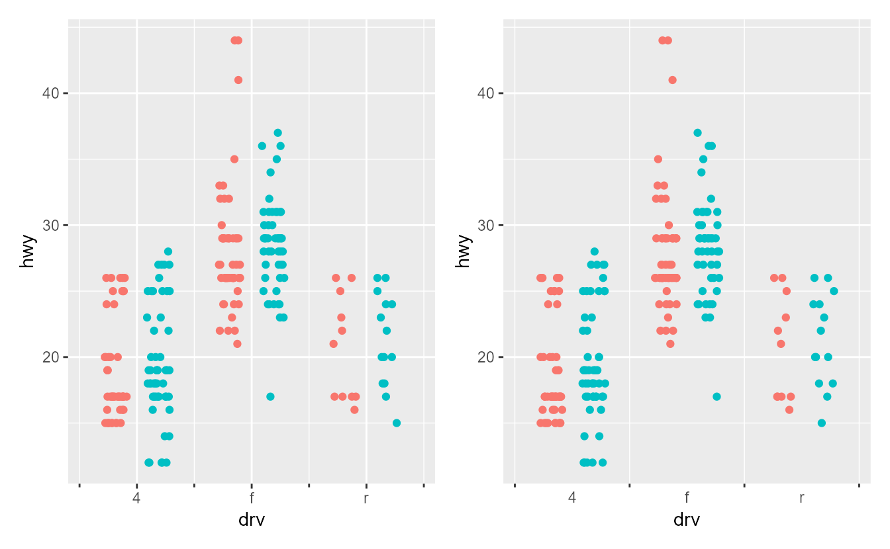
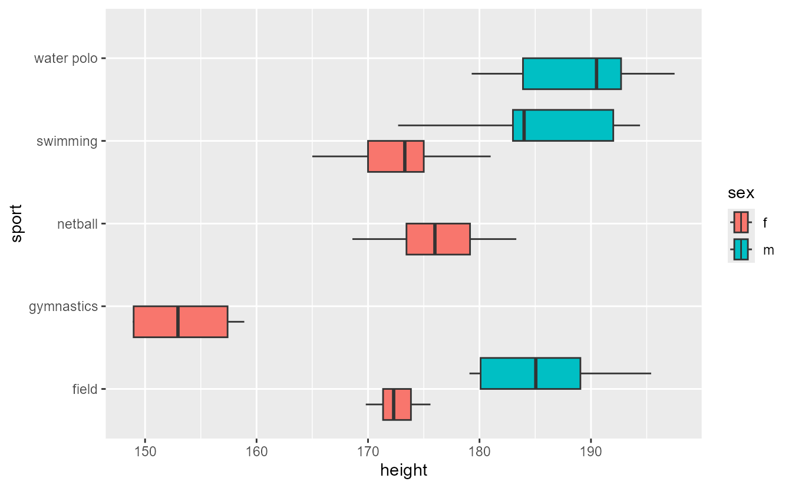

<!--
TODO:
* [x] Look over / edit the post's title in the yaml
* [x] Edit (or delete) the description; note this appears in the Twitter card
* [x] Pick category and tags (see existing with [`hugodown::tidy_show_meta()`](https://rdrr.io/pkg/hugodown/man/use_tidy_post.html))
* [x] Find photo & update yaml metadata
* [x] Create `thumbnail-sq.jpg`; height and width should be equal
* [x] Create `thumbnail-wd.jpg`; width should be >5x height
* [x] [`hugodown::use_tidy_thumbnails()`](https://rdrr.io/pkg/hugodown/man/use_tidy_post.html)
* [x] Add intro sentence, e.g. the standard tagline for the package
* [x] [`usethis::use_tidy_thanks()`](https://usethis.r-lib.org/reference/use_tidy_thanks.html)
-->

We're tickled pink to announce the release of [ggplot2](https://ggplot2.tidyverse.org) 4.0.0. ggplot2 is a system for declaratively creating graphics, based on The Grammar of Graphics. You provide the data, tell ggplot2 how to map variables to aesthetics, what graphical primitives to use, and it takes care of the details.

The new version can be installed from CRAN using:

<pre class='chroma'><code class='language-r' data-lang='r'><a href='https://rdrr.io/r/utils/install.packages.html'>install.packages</a>("ggplot2")</code></pre>

This is a substantial release meriting a new major version, and contains a series of changes from a rewrite of the object oriented system from S3 to S7, large new features to smaller quality of life improvements and bugfixes. It is also the 18th anniversary of ggplot2 which is cause for celebration! In this blog post, we will highlight the most salient new features that come with this release. You can see a full list of changes in the [release notes](https://ggplot2.tidyverse.org/news/index.html)

<pre class='chroma'><code class='language-r' data-lang='r'><a href='https://rdrr.io/r/base/library.html'>library</a>(<a href='https://ggplot2.tidyverse.org'>ggplot2</a>)
<a href='https://rdrr.io/r/base/library.html'>library</a>(<a href='https://patchwork.data-imaginist.com'>patchwork</a>)</code></pre>

## Adopting S7

In ggplot2, we use major version increments to indicate that something at the core of the package has changed. In this release, we have replaced many of ggplot2's S3 objects with S7 objects. Like S3 and S4, S7 is also an object oriented system that uses classes, generics and methods. S7 is a newer system that aims to strike a good balance between the flexibility of S3 and formality of S4.

Mostly, this change shouldn't be very noticeable when you're just using ggplot2 for building regular plots. At best, you may notice that we're more strictly enforcing types for certain arguments. For example, most ludicrous input is now rejected right away. This is due to how properties in S7 work, which get validated when a new object is instantiated.

<pre class='chroma'><code class='language-r' data-lang='r'><a href='https://ggplot2.tidyverse.org/reference/element.html'>element_text</a>(hjust = "foo")
#&gt; Error: &lt;ggplot2::element_text&gt; object properties are invalid:
#&gt; - @hjust must be &lt;NULL&gt;, &lt;integer&gt;, or &lt;double&gt;, not &lt;character&gt;
</code></pre>

However, it may require some adaptation on your end if you use ggplot2's innards in unusual ways. For extension builders, a major benefit of using S7 is that one can now use double dispatch. This is most important for the [`update_ggplot()`](https://ggplot2.tidyverse.org/reference/update_ggplot.html) function (the successor of [`ggplot_add()`](https://ggplot2.tidyverse.org/reference/update_ggplot.html)), which determines what happens when you `+` an object to a plot. Now with S7, you can control what happens not only for right-hand side objects (which is how it used to work in S3), but also for the left-hand side objects.

We have put various pieces of backwards compatibility in to not break many packages that assumed the S3 structures of ggplot2. For example, we still return the data property with `ggplot()$data`, whereas the S7 way of accessing this should be `ggplot()@data`. Expect these to be phased out over time in favour of S7. We are preparing another blog post to help migrating from S3 to S7 for ggplot2 related packages.

## Theme improvements

Themes in ggplot2 have long served the role of capturing any non-data aspects of styling plots. We have come to realise that the default look of layers, from what the default shape of points is to what the default colour palette is, are also not truly data-driven choices. The idea to put these defaults into themes has been around for a while and Dana Page Seidel did pioneering work implementing this as early as 2018. Now, years of waiting have come to fruition and we're proud to announce this new functionality.

### Ink and paper

The way layer defaults are now implemented differs slightly from typical aesthetics you know and love. Whereas layers aesthetics distinguish `colour` and `fill`, the theme defaults distinguish `ink` (foreground) and `paper` (background). A boxplot is unreadable without `colour`, but is perfectly interpretable without `fill`. In the boxplot case, the `ink` is thus clearly the `colour` whereas `paper` is the `fill`. In bar charts or histograms, the [proportional ink](https://clauswilke.com/dataviz/proportional-ink.html) principle prescribes that the `fill` aesthetic is considered foreground, and thus count as `ink`. To accommodate special cases, like lines in [`geom_smooth()`](https://ggplot2.tidyverse.org/reference/geom_smooth.html) or [`geom_contour()`](https://ggplot2.tidyverse.org/reference/geom_contour.html), we also added a third `accent` option. In short, the theme defaults have role-oriented settings that differ from the property-oriented settings in layers.

We've added these three options to all built-in complete themes. Not only propagate these automatically to the layer defaults, they are also used to style additional theme components. You may notice that the panel background colour is a blend between `paper` and `ink`, which is now how many elements are parametrised in complete themes.

<pre class='chroma'><code class='language-r' data-lang='r'><a href='https://ggplot2.tidyverse.org/reference/ggplot.html'>ggplot</a>(mpg, <a href='https://ggplot2.tidyverse.org/reference/aes.html'>aes</a>(displ, hwy)) +
  <a href='https://ggplot2.tidyverse.org/reference/geom_point.html'>geom_point</a>() +
  <a href='https://ggplot2.tidyverse.org/reference/geom_smooth.html'>geom_smooth</a>(method = "lm", formula = y ~ x) +
  <a href='https://ggplot2.tidyverse.org/reference/ggtheme.html'>theme_gray</a>(paper = "cornsilk", ink = "navy", accent = "tomato")
</code></pre>

If you're customising a theme, you can use the `theme(geom)` argument to set a collection of defaults. The new function [`element_geom()`](https://ggplot2.tidyverse.org/reference/element.html) can be used to set these properties. Additionally, if you want a layer to read the property from this theme element, you can use the [`from_theme()`](https://ggplot2.tidyverse.org/reference/aes_eval.html) function in the mapping to access these variables[^1].

<pre class='chroma'><code class='language-r' data-lang='r'><a href='https://ggplot2.tidyverse.org/reference/ggplot.html'>ggplot</a>(mpg, <a href='https://ggplot2.tidyverse.org/reference/aes.html'>aes</a>(class, displ)) +
  <a href='https://ggplot2.tidyverse.org/reference/geom_boxplot.html'>geom_boxplot</a>(<a href='https://ggplot2.tidyverse.org/reference/aes.html'>aes</a>(colour = <a href='https://ggplot2.tidyverse.org/reference/aes_eval.html'>from_theme</a>(accent))) +
  <a href='https://ggplot2.tidyverse.org/reference/theme.html'>theme</a>(
    geom = <a href='https://ggplot2.tidyverse.org/reference/element.html'>element_geom</a>(accent = "tomato", paper = "cornsilk")
  )
</code></pre>

A second conceptual difference in [`element_geom()`](https://ggplot2.tidyverse.org/reference/element.html) pertains the the use of lines. In one role, like in a line graph, the line represents the data directly. In a second role, a line serves as separation between two units. For example, you can display countries as polygons and the line connecting the vertices separate out places that are inside a country versus places that are outside that country. These two roles are captured in a `linewidth` and `linetype` pair and a `borderwidth` and `bordertype` pair.

<pre class='chroma'><code class='language-r' data-lang='r'><a href='https://ggplot2.tidyverse.org/reference/ggplot.html'>ggplot</a>(faithful, <a href='https://ggplot2.tidyverse.org/reference/aes.html'>aes</a>(waiting)) +
  <a href='https://ggplot2.tidyverse.org/reference/geom_histogram.html'>geom_histogram</a>(bins = 30, colour = "black") +
  <a href='https://ggplot2.tidyverse.org/reference/geom_histogram.html'>geom_freqpoly</a>(bins = 30) +
  <a href='https://ggplot2.tidyverse.org/reference/theme.html'>theme</a>(geom = <a href='https://ggplot2.tidyverse.org/reference/element.html'>element_geom</a>(
    bordertype = "dashed",
    borderwidth = 0.2,
    linewidth = 2,
    linetype = "solid"
  ))
</code></pre>

### Scales and palettes

In addition to the defaults for layers, default palettes are now also encapsulated in the theme. The relevant theme settings have the pattern `palette.{aesthetic}.{type}`, where `type` can be either discrete or continuous. This allows you to coordinate your colour palettes with the rest of the theme.

<pre class='chroma'><code class='language-r' data-lang='r'><a href='https://ggplot2.tidyverse.org/reference/ggplot.html'>ggplot</a>(mpg, <a href='https://ggplot2.tidyverse.org/reference/aes.html'>aes</a>(displ, hwy, shape = drv, colour = cty)) +
  <a href='https://ggplot2.tidyverse.org/reference/geom_point.html'>geom_point</a>() +
  <a href='https://ggplot2.tidyverse.org/reference/theme.html'>theme</a>(
    palette.colour.continuous = <a href='https://rdrr.io/r/base/c.html'>c</a>("chartreuse", "forestgreen"),
    palette.shape.discrete = <a href='https://rdrr.io/r/base/c.html'>c</a>("triangle", "triangle open", "triangle down open")
  )
</code></pre>

The way this works is that all defaults scales now have `palette = NULL` as their default. During plot building, any `NULL` palettes are replaced by those declared in the theme.

### Shortcuts

We like to introduce a new family of short cuts. Looking at code in the wild, we've come to realise that theme declarations are very often chaotic. The [`theme()`](https://ggplot2.tidyverse.org/reference/theme.html) functions has lots of arguments, long argument names (hello there, `axis.minor.ticks.length.x.bottom`!) and very little structure. To make themes a little bit more digestible, we've created the following helper functions:

-   [`theme_sub_axis()`](https://ggplot2.tidyverse.org/reference/subtheme.html)
    -   [`theme_sub_axis_x()`](https://ggplot2.tidyverse.org/reference/subtheme.html)
        -   [`theme_sub_axis_bottom()`](https://ggplot2.tidyverse.org/reference/subtheme.html)
        -   [`theme_sub_axis_top()`](https://ggplot2.tidyverse.org/reference/subtheme.html)
    -   [`theme_sub_axis_y()`](https://ggplot2.tidyverse.org/reference/subtheme.html)
        -   [`theme_sub_axis_left()`](https://ggplot2.tidyverse.org/reference/subtheme.html)
        -   [`theme_sub_axis_right()`](https://ggplot2.tidyverse.org/reference/subtheme.html)
-   [`theme_sub_legend()`](https://ggplot2.tidyverse.org/reference/subtheme.html)
-   [`theme_sub_panel()`](https://ggplot2.tidyverse.org/reference/subtheme.html)
-   [`theme_sub_plot()`](https://ggplot2.tidyverse.org/reference/subtheme.html)
-   [`theme_sub_strip()`](https://ggplot2.tidyverse.org/reference/subtheme.html)

These helper functions pass on their arguments to [`theme()`](https://ggplot2.tidyverse.org/reference/theme.html) after they've prepended a relevant prefix. For example, using `theme_sub_legend(justification)` will translate to `theme(legend.justification)`. When you have \>1 theme element to change in a cluster of settings, it quickly becomes less typing to enlist the relevant shortcut. As a bonus, your theme code will tend to self-organise and become somewhat more readable.

<pre class='chroma'><code class='language-r' data-lang='r'># Tired, verbose, chaotic
<a href='https://ggplot2.tidyverse.org/reference/theme.html'>theme</a>(
  panel.widths = <a href='https://rdrr.io/r/grid/unit.html'>unit</a>(5, "cm"),
  axis.ticks.x = <a href='https://ggplot2.tidyverse.org/reference/element.html'>element_line</a>(colour = "red"),
  axis.ticks.length.x = <a href='https://rdrr.io/r/grid/unit.html'>unit</a>(5, "mm"),
  panel.background = <a href='https://ggplot2.tidyverse.org/reference/element.html'>element_rect</a>(fill = NA),
  panel.spacing.x = <a href='https://rdrr.io/r/grid/unit.html'>unit</a>(5, "mm")
)

# Wired, terse, orderly
<a href='https://ggplot2.tidyverse.org/reference/subtheme.html'>theme_sub_axis_x</a>(
  ticks = <a href='https://ggplot2.tidyverse.org/reference/element.html'>element_line</a>(colour = "red"),
  ticks.length = <a href='https://rdrr.io/r/grid/unit.html'>unit</a>(5, "mm")
) +
<a href='https://ggplot2.tidyverse.org/reference/subtheme.html'>theme_sub_panel</a>(
  widths = <a href='https://rdrr.io/r/grid/unit.html'>unit</a>(5, "cm"),
  spacing.x = <a href='https://rdrr.io/r/grid/unit.html'>unit</a>(5, "mm"),
  background = <a href='https://ggplot2.tidyverse.org/reference/element.html'>element_rect</a>(fill = NA)
)</code></pre>

In addition to shortcuts for clusters of theme elements, we've also added a few variants to declare margins.

-   [`margin_auto()`](https://ggplot2.tidyverse.org/reference/element.html) sets the margins in a CSS-like fashion similar to the [`margin`](https://developer.mozilla.org/en-US/docs/Web/CSS/margin) and [`padding`](https://developer.mozilla.org/en-US/docs/Web/CSS/padding) property.
    -   `margin_auto(1)` sets all four sides at once. It expands to `margin(t = 1, r = 1, b = 1, l = 1)`.
    -   `margin_auto(1, 2)` sets horizontal and vertical sides. It expands to `margin(t = 1, r = 2, b = 1, l = 2)`.
    -   `margin_auto(1, 2, 3)` expands to `margin(t = 1, r = 2, b = 3, l = 2)`.
-   [`margin_part()`](https://ggplot2.tidyverse.org/reference/element.html) has `NA` units as default, which will get replaced when the theme gets resolved. It roughly equates to 'set some of the sides, keep others as they are'.

<pre class='chroma'><code class='language-r' data-lang='r'><a href='https://ggplot2.tidyverse.org/reference/merge_element.html'>merge_element</a>(
  <a href='https://ggplot2.tidyverse.org/reference/element.html'>margin_part</a>(r = 20), # child
  <a href='https://ggplot2.tidyverse.org/reference/element.html'>margin_auto</a>(10) # parent
)
#&gt; [1] 10points 20points 10points 10points
</code></pre>

### New settings

To coordinate (non-text) margins and spacings in a theme, we've introduced `spacing` and `margins` as new root elements in the theme. Other spacings and margins at the leaf elements inherit from (scale with) these root elements. To facilitate the different spacings in ggplot2, unit elements can now use [`rel()`](https://ggplot2.tidyverse.org/reference/element.html) to modify the inherited value. For example the default `axis.ticks.length` is now `rel(0.5)`, making the y-axis ticks 0.5 cm in the plot below. If we set the `axis.ticks.length.x` to `rel(2)`, it will double the value coming from `axis.ticks.length`, not double the value of `spacing`.

<pre class='chroma'><code class='language-r' data-lang='r'>p &lt;- <a href='https://ggplot2.tidyverse.org/reference/ggplot.html'>ggplot</a>(penguins, <a href='https://ggplot2.tidyverse.org/reference/aes.html'>aes</a>(bill_dep, bill_len, colour = species)) +
  <a href='https://ggplot2.tidyverse.org/reference/geom_point.html'>geom_point</a>(na.rm = TRUE)

p + <a href='https://ggplot2.tidyverse.org/reference/theme.html'>theme</a>(
  spacing = <a href='https://rdrr.io/r/grid/unit.html'>unit</a>(1, "cm"), 
  margins = <a href='https://ggplot2.tidyverse.org/reference/element.html'>margin_auto</a>(1, unit = "cm"),
  axis.ticks.length.x = <a href='https://ggplot2.tidyverse.org/reference/element.html'>rel</a>(2)
)
</code></pre>

We also made it easier to set plot sizes. Using the `panel.widths` and `panel.heights` arguments, you can control the sizes of the panels. This mechanism is distinct from using `ggsave(width, height)`, where the whole plot, including annotations such as axes and titles is included. There are two ways to use these arguments:

-   Give a vector of units: each one will be applied to a panel separately and the vector will be recycled to fit the number of panels.
-   Give a single unit: which sets the total panel area (including panel spacings and inner axes) to that size.

Naturally, if you only have a single panel, these approaches are identical. If you have multiple panels and you want to set individual panels all to the same size (as opposed to the total size), you can take advantage of the recycling and use a length 2 unit vector.

In the plots below, you can notice that the panels span a different width despite the units adding up to the same amount (9 cm). This is because the 'single unit' approach also includes the panel spacings, but not the 'separate units' approach.

<pre class='chroma'><code class='language-r' data-lang='r'>p1 &lt;- p + <a href='https://ggplot2.tidyverse.org/reference/facet_grid.html'>facet_grid</a>(~ island) +
  <a href='https://ggplot2.tidyverse.org/reference/labs.html'>labs</a>(title = "Separate units (per panel)") +
  # Using the new shortcut for panels
  <a href='https://ggplot2.tidyverse.org/reference/subtheme.html'>theme_sub_panel</a>(
    widths = <a href='https://rdrr.io/r/grid/unit.html'>unit</a>(<a href='https://rdrr.io/r/base/c.html'>c</a>(2, 3, 4), "cm"),
    heights = <a href='https://rdrr.io/r/grid/unit.html'>unit</a>(3, "cm")
  )

p2 &lt;- p + <a href='https://ggplot2.tidyverse.org/reference/facet_grid.html'>facet_grid</a>(~ island) +
  <a href='https://ggplot2.tidyverse.org/reference/labs.html'>labs</a>(title = "Single unit (all panels)") +
  <a href='https://ggplot2.tidyverse.org/reference/subtheme.html'>theme_sub_panel</a>(
    widths = <a href='https://rdrr.io/r/grid/unit.html'>unit</a>(9, "cm"),
    heights = <a href='https://rdrr.io/r/grid/unit.html'>unit</a>(3, "cm")
  )

p1 / p2
</code></pre>

## Labels

We have added new ways that a plot retrieves labels for your variables. It is an informal convention in several packages including gt, Hmisc, labelled and others to use the 'label' attribute to store human readable labels for vectors. Now ggplot2 joins this convention and uses the 'label' attribute as the default label for a variable if present.

<pre class='chroma'><code class='language-r' data-lang='r'># The penguins dataset was incorporated into base R 4.5
df &lt;- penguins

# Manually set label attributes.
# Other packages may offer better tooling than this.
<a href='https://rdrr.io/r/base/attr.html'>attr</a>(df$species, "label") &lt;- "Penguin Species"
<a href='https://rdrr.io/r/base/attr.html'>attr</a>(df$bill_dep, "label") &lt;- "Bill depth (mm)"
<a href='https://rdrr.io/r/base/attr.html'>attr</a>(df$bill_len, "label") &lt;- "Bill length (mm)"
<a href='https://rdrr.io/r/base/attr.html'>attr</a>(df$body_mass, "label") &lt;- "Body mass (g)"

<a href='https://ggplot2.tidyverse.org/reference/ggplot.html'>ggplot</a>(df, <a href='https://ggplot2.tidyverse.org/reference/aes.html'>aes</a>(bill_dep, bill_len, colour = <a href='https://rdrr.io/r/base/MathFun.html'>sqrt</a>(body_mass))) +
  <a href='https://ggplot2.tidyverse.org/reference/geom_point.html'>geom_point</a>(na.rm = TRUE)
</code></pre>

It has also been entrenched in some workflows to use a 'data dictionary' or codebook. For labelling purposes these dictionaries often contain column metadata that include labels or descriptions for variables (columns) in the dataset. To make it easier to work with column labels, we added the `labs(dictionary)` argument. It takes a named vector of labels, that can easily be generated from a data dictionary by [`setNames()`](https://rdrr.io/r/stats/setNames.html) or [`dplyr::pull()`](https://dplyr.tidyverse.org/reference/pull.html).

<pre class='chroma'><code class='language-r' data-lang='r'>dict &lt;- tibble::<a href='https://tibble.tidyverse.org/reference/tribble.html'>tribble</a>(
  ~var,    ~label,
  "species",  "Penguin Species",
  "bill_dep", "Bill depth (mm)",
  "bill_len", "Bill length (mm)",
  "body_mass", "Body mass (g)"
)

<a href='https://ggplot2.tidyverse.org/reference/ggplot.html'>ggplot</a>(penguins, <a href='https://ggplot2.tidyverse.org/reference/aes.html'>aes</a>(bill_dep, bill_len, colour = body_mass)) +
  <a href='https://ggplot2.tidyverse.org/reference/geom_point.html'>geom_point</a>(na.rm = TRUE) +
  # Or:
  # labs(dictionary = dplyr::pull(dict, label, name = var))
  <a href='https://ggplot2.tidyverse.org/reference/labs.html'>labs</a>(dictionary = <a href='https://rdrr.io/r/stats/setNames.html'>setNames</a>(dict$label, dict$var))
</code></pre>

One benefit to the label attributes or data dictionary approaches is that it is linked to your variables, not aesthetics. This means you can easily rearrange your aesthetics for a different plot, without having to painstakingly reorient the labels towards the correct aesthetics.

<pre class='chroma'><code class='language-r' data-lang='r'><a href='https://ggplot2.tidyverse.org/reference/get_last_plot.html'>last_plot</a>() +
  <a href='https://ggplot2.tidyverse.org/reference/aes.html'>aes</a>(body_mass, bill_len, colour = species)
</code></pre>

There are a few caveats to these label attributes and data dictionary approaches though:

-   If the aesthetic is not a pure variable name the label is not used. You can see this in the `sqrt(body_mass)` in the first example, which does not use the 'Body mass (g)' label. We assume when a variable is adjusted in this way, this would need to be reflected in the label itself. It would therefore be inappropriate to use the label of the unadjusted variable. Use of the [`.data`-pronoun](https://ggplot2.tidyverse.org/articles/ggplot2-in-packages.html#using-aes-and-vars-in-a-package-function) counts as a pure variable name for labelling purposes.
-   Some attributes are more stable than others, and it is not ggplot2's responsibility to babysit attributes. For example using `head(<data.frame>)` will typically drop attributes from atomic columns, whereas `head(<tibble>)` will not.

In addition, we're also allowing to use functions in all the places you can declare labels. The [`labs()`](https://ggplot2.tidyverse.org/reference/labs.html) function, scale names and guide titles now accept functions that take in the labels generated by the lower hierarchies and return amended labels. It should be spelled out that the hierarchy from lowest priority to highest priority is the following:

1.  The expression given in [`aes()`](https://ggplot2.tidyverse.org/reference/aes.html).
2.  The label attribute of the column.
3.  The entry in `labs(dictionary)`.
4.  The entry in `labs(<aesthetic> = <label>)`.
5.  The `scale_*(name)` argument.
6.  The `guide_*(title)` argument.

We can see this hierarchy in action in the plot below: the function in the axis guide transforms the input from the [`labs()`](https://ggplot2.tidyverse.org/reference/labs.html) function.

<pre class='chroma'><code class='language-r' data-lang='r'><a href='https://ggplot2.tidyverse.org/reference/ggplot.html'>ggplot</a>(penguins, <a href='https://ggplot2.tidyverse.org/reference/aes.html'>aes</a>(bill_dep, bill_len, colour = species)) +
  <a href='https://ggplot2.tidyverse.org/reference/geom_point.html'>geom_point</a>(na.rm = TRUE) +
  <a href='https://ggplot2.tidyverse.org/reference/scale_colour_discrete.html'>scale_colour_discrete</a>(name = toupper) +
  <a href='https://ggplot2.tidyverse.org/reference/guides.html'>guides</a>(x = <a href='https://ggplot2.tidyverse.org/reference/guide_axis.html'>guide_axis</a>(title = tools::<a href='https://rdrr.io/r/tools/toTitleCase.html'>toTitleCase</a>)) +
  <a href='https://ggplot2.tidyverse.org/reference/labs.html'>labs</a>(
    y = \(x) <a href='https://rdrr.io/r/base/paste.html'>paste0</a>(x, " variable"),
    x = "the label for the x variable"
  )
</code></pre>

In addition to the [`labs()`](https://ggplot2.tidyverse.org/reference/labs.html)-labels, we also made labelling the levels of discrete scales easier. When the scale's `breaks` are named, the scale's labels will adopt the break's names by default. This already was the case in continuous scales but now discrete scales have parity. A nice benefit of specifying labels this way is that they are directly linked to the breaks, which prevents the common mistake of specifying the `labels` argument without also setting the `breaks` argument, which may accidentally mismatch labels.

<pre class='chroma'><code class='language-r' data-lang='r'><a href='https://ggplot2.tidyverse.org/reference/ggplot.html'>ggplot</a>(penguins, <a href='https://ggplot2.tidyverse.org/reference/aes.html'>aes</a>(bill_dep, bill_len, colour = species)) +
  <a href='https://ggplot2.tidyverse.org/reference/geom_point.html'>geom_point</a>(na.rm = TRUE) +
  <a href='https://ggplot2.tidyverse.org/reference/scale_colour_discrete.html'>scale_colour_discrete</a>(
    breaks = <a href='https://rdrr.io/r/base/c.html'>c</a>(
      "Pygoscelis adeliae"     = "Adelie",
      "Pygoscelis papua"       = "Gentoo",
      "Pygoscelis antarcticus" = "Chinstrap"
    )
  )
</code></pre>

## Discrete scales

In this release we have tried to improve the 'freedom' afforded by discrete position scales. Previously, discrete values were always mapped to an integer sequence starting at 1 going up to the number of levels. Instead, we wanted to allow for different mappings that deviated from that pattern. While it is a bit foreign for position scales, ggplot2 already had a mechanism to assign alternate values to the levels of a scale: palettes! You can now use the `palette` argument like you would for non-position scales. It makes it easier to indicate any grouping structure along the axis, like separating the orange juice (OJ) groups from the vitamin C (VC) groups in the plot below.

<pre class='chroma'><code class='language-r' data-lang='r'><a href='https://ggplot2.tidyverse.org/reference/ggplot.html'>ggplot</a>(ToothGrowth, <a href='https://ggplot2.tidyverse.org/reference/aes.html'>aes</a>(<a href='https://rdrr.io/r/base/interaction.html'>interaction</a>(dose, supp, sep = "\n"), len)) +
  <a href='https://ggplot2.tidyverse.org/reference/geom_boxplot.html'>geom_boxplot</a>() +
  <a href='https://ggplot2.tidyverse.org/reference/scale_discrete.html'>scale_x_discrete</a>(
    palette = scales::<a href='https://scales.r-lib.org/reference/pal_manual.html'>pal_manual</a>(<a href='https://rdrr.io/r/base/c.html'>c</a>(1:3, 5:7))
  )
</code></pre>

A second improvement we made to the placement of discrete levels is that we give greater control over the continuous limits. The continuous limits of a discrete scale used to be an implementation detail that kept track of any 'additional space' layers were taking up, for example because they use a `width` parameter. Now, these can be declared directly, making it easier to synchronise limits across plots or even facets. In the plot below, we're using the `continuous.limits` argument to ensure that all the bars have the same width; regardless of how many levels the x scale has to accommodate.

<pre class='chroma'><code class='language-r' data-lang='r'>p1 &lt;- <a href='https://ggplot2.tidyverse.org/reference/ggplot.html'>ggplot</a>(mpg, <a href='https://ggplot2.tidyverse.org/reference/aes.html'>aes</a>(class)) +
  <a href='https://ggplot2.tidyverse.org/reference/geom_bar.html'>geom_bar</a>() +
  <a href='https://ggplot2.tidyverse.org/reference/facet_wrap.html'>facet_wrap</a>(~ drv, ncol = 1, scales = "free_x")

p2 &lt;- p1 + <a href='https://ggplot2.tidyverse.org/reference/scale_discrete.html'>scale_x_discrete</a>(continuous.limits = <a href='https://rdrr.io/r/base/c.html'>c</a>(1, 5))

(p1 + <a href='https://ggplot2.tidyverse.org/reference/labs.html'>labs</a>(title = "Free limits")) | 
(p2 + <a href='https://ggplot2.tidyverse.org/reference/labs.html'>labs</a>(title = "Fixed limits"))
</code></pre>

Also absent from discrete scales was the ability to set minor breaks. Admittedly, they are less useful than minor breaks in continuous scales. In contrast to discrete (major) `breaks`, `minor_breaks` uses numeric input instead, allowing you to fine-tune placement without being bound by the scale's levels. With a few of tweaks of the theme, you can conceivably use minor breaks to visually separate levels as an alternative to the centre-lines for major breaks.

<pre class='chroma'><code class='language-r' data-lang='r'>p1 &lt;- <a href='https://ggplot2.tidyverse.org/reference/ggplot.html'>ggplot</a>(mpg, <a href='https://ggplot2.tidyverse.org/reference/aes.html'>aes</a>(drv, hwy, colour = <a href='https://rdrr.io/r/base/factor.html'>factor</a>(year))) +
  <a href='https://ggplot2.tidyverse.org/reference/geom_point.html'>geom_point</a>(position = "jitterdodge") +
  <a href='https://ggplot2.tidyverse.org/reference/guides.html'>guides</a>(colour = "none") +
  <a href='https://ggplot2.tidyverse.org/reference/scale_discrete.html'>scale_x_discrete</a>(
    minor_breaks = scales::<a href='https://scales.r-lib.org/reference/breaks_width.html'>breaks_width</a>(1, offset = 0.5),
    # To show that the minor axis ticks take on these values
    guide = <a href='https://ggplot2.tidyverse.org/reference/guide_axis.html'>guide_axis</a>(minor.ticks = TRUE)
  )

p2 &lt;- p1 + 
  <a href='https://ggplot2.tidyverse.org/reference/theme.html'>theme</a>(panel.grid.major.x = <a href='https://ggplot2.tidyverse.org/reference/element.html'>element_blank</a>()) +
  <a href='https://ggplot2.tidyverse.org/reference/subtheme.html'>theme_sub_axis_bottom</a>(ticks = <a href='https://ggplot2.tidyverse.org/reference/element.html'>element_blank</a>(), minor.ticks = <a href='https://ggplot2.tidyverse.org/reference/element.html'>element_line</a>())

p1 | p2
</code></pre>

Discrete position scales now also have access to secondary axes. In contrast to continuous scales, discrete scales don't support transformations. So instead of [`sec_axis()`](https://ggplot2.tidyverse.org/reference/sec_axis.html), it is recommended to use [`dup_axis()`](https://ggplot2.tidyverse.org/reference/sec_axis.html). To allow for arbitrary positions for `dup_axis(breaks)`, these can take numeric values or one of the discrete levels. They are not truly useful to for showing two aligned datasets of different scales, but they can serve as annotations. For example, they can display some summary statistics about the groups.

<pre class='chroma'><code class='language-r' data-lang='r'><a href='https://ggplot2.tidyverse.org/reference/ggplot.html'>ggplot</a>(mpg, <a href='https://ggplot2.tidyverse.org/reference/aes.html'>aes</a>(class, cty)) +
  <a href='https://ggplot2.tidyverse.org/reference/geom_boxplot.html'>geom_boxplot</a>() +
  <a href='https://ggplot2.tidyverse.org/reference/scale_discrete.html'>scale_x_discrete</a>(
    sec.axis = <a href='https://ggplot2.tidyverse.org/reference/sec_axis.html'>dup_axis</a>(
      name = "Counts",
      # You can use numeric input for breaks
      breaks = <a href='https://rdrr.io/r/base/seq.html'>seq_len</a>(<a href='https://rdrr.io/r/base/length.html'>length</a>(<a href='https://rdrr.io/r/base/unique.html'>unique</a>(mpg$class))),
      # Watch out for the order of `table()` and your levels!
      labels = <a href='https://rdrr.io/r/base/paste.html'>paste0</a>("n = ", <a href='https://rdrr.io/r/base/table.html'>table</a>(mpg$class))
    )
  )
</code></pre>

## Position aesthetics

Layers consist of three components: stats, geoms and positions. While stats and geoms have their own aesthetics, like `weight` or `linewidth`, the position adjustments did not. In this release, positions can also declare their own statistics. You can map data to these aesthetics like you would for geom or stat aesthetics.

In [`position_nudge()`](https://ggplot2.tidyverse.org/reference/position_nudge.html) for example, we now have the `nudge_x` and `nudge_y` parameters as aesthetics. [^2] Two benefits are that we can now use expressions in [`aes()`](https://ggplot2.tidyverse.org/reference/aes.html) to declare these and they are vectorised. We use that advantage in the plot below where we use [`sign()`](https://rdrr.io/r/base/sign.html) in a divergent bar chart to determine the left-right direction of the nudge.

<pre class='chroma'><code class='language-r' data-lang='r'># Taken from:
# https://ourworldindata.org/grapher/share-electricity-coal?tab=table&amp;tableFilter=continents
coal &lt;- tibble::<a href='https://tibble.tidyverse.org/reference/tribble.html'>tribble</a>(
  ~continent,  ~pct_1985, ~pct_2024,
  "Africa",        53.87, 24.68,
  "Asia",          32.60, 51.19,
  "Europe",        32.84, 12.91,
  "North America", 48.93, 13.79,
  "South America",  2.91,  3.31,
  "Oceania",       58.75, 39.26
) |&gt;
  dplyr::<a href='https://dplyr.tidyverse.org/reference/mutate.html'>mutate</a>(pp_difference = pct_2024 - pct_1985)

<a href='https://ggplot2.tidyverse.org/reference/ggplot.html'>ggplot</a>(coal, <a href='https://ggplot2.tidyverse.org/reference/aes.html'>aes</a>(pp_difference, continent)) +
  <a href='https://ggplot2.tidyverse.org/reference/geom_bar.html'>geom_col</a>() +
  <a href='https://ggplot2.tidyverse.org/reference/geom_text.html'>geom_text</a>(
    <a href='https://ggplot2.tidyverse.org/reference/aes.html'>aes</a>(nudge_x = <a href='https://rdrr.io/r/base/sign.html'>sign</a>(pp_difference) * 3, 
        label = pp_difference)
  ) +
  <a href='https://ggplot2.tidyverse.org/reference/labs.html'>labs</a>(x = "Change in electricity generated by coal (pp)")
</code></pre>

A second position adjustment that has gotten its own aesthetic is [`position_dodge()`](https://ggplot2.tidyverse.org/reference/position_dodge.html). In the plot below, we see for sports where we do not have records for both 'sex = "f"' and 'sex = "m"' only one box is drawn just beneath the centre line. This is true for 'water polo' where we have no records for 'f', but also netball and gymnastics where there are no records for 'm'. For sports where there are records for both sexes, the "f" is depicted beneath the centre line and "m" is depicted above the centre line. Depending on your aesthetic sensibilities, this inconsistency can be a major pain.

<pre class='chroma'><code class='language-r' data-lang='r'>sports &lt;- <a href='https://rdrr.io/r/base/c.html'>c</a>("water polo", "swimming", "gymnastics", "field", "netball")
p &lt;- ggridges::<a href='https://wilkelab.org/ggridges/reference/Aus_athletes.html'>Aus_athletes</a> |&gt;
  dplyr::<a href='https://dplyr.tidyverse.org/reference/filter.html'>filter</a>(sport <a href='https://rdrr.io/r/base/match.html'>%in%</a> sports) |&gt;
  <a href='https://ggplot2.tidyverse.org/reference/ggplot.html'>ggplot</a>(<a href='https://ggplot2.tidyverse.org/reference/aes.html'>aes</a>(height, sport, fill = sex)) +
  <a href='https://ggplot2.tidyverse.org/reference/geom_boxplot.html'>geom_boxplot</a>(position = <a href='https://ggplot2.tidyverse.org/reference/position_dodge.html'>position_dodge</a>(preserve = "single"))

p
</code></pre>

The origin of this inconsistency is that ggplot2 doesn't have an understanding of groups other than that *they exist*. It doesn't know that groups are formed by `fill` and what levels populate this aesthetic. To break ggplot2's ignorance, we now have the `order` aesthetic for [`position_dodge()`](https://ggplot2.tidyverse.org/reference/position_dodge.html).

<pre class='chroma'><code class='language-r' data-lang='r'>p + <a href='https://ggplot2.tidyverse.org/reference/aes.html'>aes</a>(order = sex)
</code></pre>

Using that aesthetic to the position adjustment soothes the soul by putting all the right groups in the right places.

## Facets

### Wrapping directions

The [`facet_wrap()`](https://ggplot2.tidyverse.org/reference/facet_wrap.html) function has had two arguments controlling the layout: `dir` which can be `"h"` or `"v"`, and `as.table` with can be `TRUE` or `FALSE`. Together, these gave a total of 4 layout options. Arguably there are 8 sensible options in total though, so we were missing out on the layout. To simplify having to juggle two arguments for 4 options, we're now just using one argument (`dir`) for 8 options. The new options are all two letter codes using combinations of `t` (top), `r` (right), `b` (bottom) and `l` (left). The combination will tell you where the first facet level will be. Both `br` and `rb` will start in the bottom-right with the first facet. Then the order will tell you about the filling direction, where starting with `b` will fill bottom-to-top and starting with `r` will fill right-to-left.

<pre class='chroma'><code class='language-r' data-lang='r'>p &lt;- <a href='https://ggplot2.tidyverse.org/reference/ggplot.html'>ggplot</a>(mpg, <a href='https://ggplot2.tidyverse.org/reference/aes.html'>aes</a>(displ, hwy)) +
  <a href='https://ggplot2.tidyverse.org/reference/geom_point.html'>geom_point</a>()

p1 &lt;- p + 
  <a href='https://ggplot2.tidyverse.org/reference/facet_wrap.html'>facet_wrap</a>(~ vctrs::<a href='https://vctrs.r-lib.org/reference/vec_group.html'>vec_group_id</a>(class), dir = "br") +
  <a href='https://ggplot2.tidyverse.org/reference/labs.html'>labs</a>(title = "dir = 'br'")

p2 &lt;- p +
  <a href='https://ggplot2.tidyverse.org/reference/facet_wrap.html'>facet_wrap</a>(~ vctrs::<a href='https://vctrs.r-lib.org/reference/vec_group.html'>vec_group_id</a>(class), dir = "rb") +
  <a href='https://ggplot2.tidyverse.org/reference/labs.html'>labs</a>(title = "dir = 'rb'")

p1 | p2
</code></pre>

To cover all 8 options, we list them here:

-   `"lt"`: start in the top-left, start filling left-to-right.
-   `"tl"`: start in the top-left, start filling top-to-bottom.
-   `"lb"`: start in the bottom-left, start filling left-to-right.
-   `"bl"`: start in the bottom-left, start filling bottom-to-top.
-   `"rt"`: start in the top-right, start filling right-to-left.
-   `"tr"`: start in the top-right, start filling top-to-bottom.
-   `"rb"`: start in the bottom-right, start filling right-to-left.
-   `"br"` start in the bottom-right, start filling bottom-to-top.

### Free space in wrapping

The `facet_grid(space)` argument can ensure that panels are allocated space in proportion to their data range. This works because all data within a row share a y-axis, and data within a column share an x-axis. Historically, this argument did not have an equivalent in [`facet_wrap()`](https://ggplot2.tidyverse.org/reference/facet_wrap.html) because axes aren't shared. We realised that there is a narrow circumstance in which each column has a consistent axis, and this is when there is only one row. The inverse also holds true for rows when there is only one column. In this release, we've added `facet_wrap(space)` that sets the panel sizes in these circumstances.

<pre class='chroma'><code class='language-r' data-lang='r'><a href='https://ggplot2.tidyverse.org/reference/ggplot.html'>ggplot</a>(penguins, <a href='https://ggplot2.tidyverse.org/reference/aes.html'>aes</a>(bill_dep, bill_len, colour = species)) +
  <a href='https://ggplot2.tidyverse.org/reference/geom_point.html'>geom_point</a>(na.rm = TRUE) +
  <a href='https://ggplot2.tidyverse.org/reference/facet_wrap.html'>facet_wrap</a>(~ island, scales = "free_x", space = "free_x")
</code></pre>

We can note that the Dream and Torgersen islands have a narrower panel because they don't have the Gentoo penguin with low bill depths.

### Layer layout

We've added the argument `layer(layout)`, which can be used to give instructions to facets on how to handle the data. Generally speaking, facets or custom layouts are free to interpret instructions as they see fit, so it is not set in stone. Nonetheless, we've come up with the following interpretations for [`facet_wrap()`](https://ggplot2.tidyverse.org/reference/facet_wrap.html) and [`facet_grid()`](https://ggplot2.tidyverse.org/reference/facet_grid.html).

-   `layout = NULL` (the default) uses the faceting variables to assign data to a panel.
-   `layout = "fixed"` repeats the data for every panel and ignores faceting variables.
-   `layout = <integer>` assigns to data to a specific panel.

In addition, specifically for [`facet_grid()`](https://ggplot2.tidyverse.org/reference/facet_grid.html) the following options also apply:

-   `layout = "fixed_cols"` pools data for every column and repeats it within the column's panels.
-   `layout = "fixed_rows"` pools data for every row and repeats it within the row's panels.

<pre class='chroma'><code class='language-r' data-lang='r'><a href='https://ggplot2.tidyverse.org/reference/ggplot.html'>ggplot</a>(penguins, <a href='https://ggplot2.tidyverse.org/reference/aes.html'>aes</a>(bill_dep, bill_len)) +
  # Repeat within every row
  <a href='https://ggplot2.tidyverse.org/reference/geom_point.html'>geom_point</a>(na.rm = TRUE, colour = "grey", layout = "fixed_rows") +
  # Use facetting variables (default)
  <a href='https://ggplot2.tidyverse.org/reference/geom_point.html'>geom_point</a>(na.rm = TRUE, layout = NULL) +
  # Pick particular panel
  <a href='https://ggplot2.tidyverse.org/reference/annotate.html'>annotate</a>(
    "text", x = <a href='https://rdrr.io/r/base/AsIs.html'>I</a>(0.5), y = <a href='https://rdrr.io/r/base/AsIs.html'>I</a>(0.5),
    label = "Panel 6", layout = 6
  ) +
  <a href='https://ggplot2.tidyverse.org/reference/facet_grid.html'>facet_grid</a>(island ~ species)
</code></pre>

In previous incarnations of ggplot2, people went through some acrobatics to get data to repeat across panels. With these new options, this should be a walk in the park.

## Styling updates

### Boxplots

In [`geom_boxplot()`](https://ggplot2.tidyverse.org/reference/geom_boxplot.html), you may have become accustomed to all the different options for styling outliers like `outlier.colour` or `outlier.shape`. Now, we're also enabling styling the different parts of the boxplot: the median line, the box, the whiskers and the staples. You can assign different colours, line type or line width to these parts of the boxplot.

<pre class='chroma'><code class='language-r' data-lang='r'><a href='https://ggplot2.tidyverse.org/reference/ggplot.html'>ggplot</a>(mpg, <a href='https://ggplot2.tidyverse.org/reference/aes.html'>aes</a>(class, hwy, colour = class)) +
  <a href='https://ggplot2.tidyverse.org/reference/geom_boxplot.html'>geom_boxplot</a>(
    whisker.linetype = "dashed",
    box.colour = "black",
    median.linewidth = 2,
    staplewidth = 0.5, # show staple
    staple.colour = "grey50"
  ) +
  <a href='https://ggplot2.tidyverse.org/reference/guides.html'>guides</a>(colour = "none")
</code></pre>

For consistency, [`geom_crossbar()`](https://ggplot2.tidyverse.org/reference/geom_linerange.html) has been given the same treatment, but uses the `middle.*` prefix where [`geom_boxplot()`](https://ggplot2.tidyverse.org/reference/geom_boxplot.html) uses the `median.*` prefix. Because `middle.linewidth` and `median.linewidth` have taken over the role of `fatten` and are aligned with other graphical properties, the `fatten` argument is now deprecated.

### Violin & quantiles

It has been an inconvenience for some time that the quantile computation in violin layers was computed on the density data rather than the input data. To make the quantile computation more faithful to the real data, we had to properly delegate the responsibilities to the correct parts of the layer. The stat part of the layer is now in charge of calculating quantiles of the input data via the `stat_ydensity(quantiles)` arguments. By default, the quantiles are the 25th, 50th and 75th percentiles and are always computed. Whether these quantiles are also displayed, is under the purview of the geom part of the layer. We've taken a similar approach as boxplots shown above, in that we now have `quantile.colour`, `quantile.linetype` and `quantile.linewidth` arguments to style the quantile lines. Previously, quantiles were not displayed by default. To mirror that behaviour, we've set `quantile.linetype = 0` (blank, no line) by default. This means that to turn on the display of quantiles, you have to set a non-blank line type.

<pre class='chroma'><code class='language-r' data-lang='r'><a href='https://ggplot2.tidyverse.org/reference/ggplot.html'>ggplot</a>(mpg, <a href='https://ggplot2.tidyverse.org/reference/aes.html'>aes</a>(class, hwy, fill = class)) +
  <a href='https://ggplot2.tidyverse.org/reference/geom_violin.html'>geom_violin</a>(
    quantiles = <a href='https://rdrr.io/r/base/c.html'>c</a>(0.1, 0.9),
    quantile.linetype = 1
  ) +
  <a href='https://ggplot2.tidyverse.org/reference/guides.html'>guides</a>(fill = "none")
</code></pre>

### Labels

[`geom_label()`](https://ggplot2.tidyverse.org/reference/geom_text.html) also has new styling options. It now has a `linetype` and `linewidth` aesthetic, which can be mapped from the data. The `linewidth` aesthetic replaces the `label.size` argument, which used to determine the line width of the label border. In addition to the new aesthetics, [`geom_label()`](https://ggplot2.tidyverse.org/reference/geom_text.html) has two new arguments: `border.colour` and `text.colour` which set the colour for the border and text respectively. When these are set, it overrules the `colour` aesthetic for a part of the label. In the plot below, we fix the `text.colour` to black, so the `colour` aesthetic applies to the border, not the text.

<pre class='chroma'><code class='language-r' data-lang='r'><a href='https://ggplot2.tidyverse.org/reference/ggplot.html'>ggplot</a>(mtcars) +
  <a href='https://ggplot2.tidyverse.org/reference/aes.html'>aes</a>(
    wt, mpg,
    label = <a href='https://rdrr.io/r/base/colnames.html'>rownames</a>(mtcars),
    colour = <a href='https://rdrr.io/r/base/factor.html'>factor</a>(cyl),
    linetype = <a href='https://rdrr.io/r/base/factor.html'>factor</a>(vs),
    linewidth = <a href='https://rdrr.io/r/base/factor.html'>factor</a>(am)
  ) +
  <a href='https://ggplot2.tidyverse.org/reference/geom_text.html'>geom_label</a>(text.colour = "black") +
  <a href='https://ggplot2.tidyverse.org/reference/scale_manual.html'>scale_linewidth_manual</a>(values = <a href='https://rdrr.io/r/base/c.html'>c</a>(0.3, 0.6))
</code></pre>

### Area and ribbons

Both [`geom_area()`](https://ggplot2.tidyverse.org/reference/geom_ribbon.html) and [`geom_ribbon()`](https://ggplot2.tidyverse.org/reference/geom_ribbon.html) now allow a varying `fill` aesthetic within a group. Such a fill is displayed as a gradient, and therefore requires R 4.1.0+ and a compatible graphics device.

<pre class='chroma'><code class='language-r' data-lang='r'><a href='https://ggplot2.tidyverse.org/reference/ggplot.html'>ggplot</a>(economics, <a href='https://ggplot2.tidyverse.org/reference/aes.html'>aes</a>(date, unemploy)) +
  <a href='https://ggplot2.tidyverse.org/reference/geom_ribbon.html'>geom_area</a>(<a href='https://ggplot2.tidyverse.org/reference/aes.html'>aes</a>(fill = uempmed))
</code></pre>

## New stats

### Manual

Many ggplot extensions are based on stats, which allows you to perform arbitrary computations on data before handing it off the drawing functions. The new [`stat_manual()`](https://ggplot2.tidyverse.org/reference/stat_manual.html) aims to give you the same extension powers, but without doing the formal ritual of defining a class and constructor. You can provide it any function that both ingests and returns a data frame. It can create new aesthetics or modify pre-existing aesthetics as long as eventually the geom part of the layer has their required aesthetics. In the example below, we use [`stat_manual()`](https://ggplot2.tidyverse.org/reference/stat_manual.html) with a geom and a function, but also show you how to use a geom with `stat = "manual"`.

<pre class='chroma'><code class='language-r' data-lang='r'>make_centroids &lt;- function(df) &#123;
  <a href='https://rdrr.io/r/base/transform.html'>transform</a>(
    df,
    xend = <a href='https://rdrr.io/r/base/mean.html'>mean</a>(x, na.rm = TRUE),
    yend = <a href='https://rdrr.io/r/base/mean.html'>mean</a>(y, na.rm = TRUE)
  )
&#125;

make_hull &lt;- function(df) &#123;
  df &lt;- df[<a href='https://rdrr.io/r/stats/complete.cases.html'>complete.cases</a>(df), , drop = FALSE]
  hull &lt;- <a href='https://rdrr.io/r/grDevices/chull.html'>chull</a>(df$x, df$y)
  df[hull, , drop = FALSE]
&#125;

<a href='https://ggplot2.tidyverse.org/reference/ggplot.html'>ggplot</a>(penguins, <a href='https://ggplot2.tidyverse.org/reference/aes.html'>aes</a>(bill_len, bill_dep, colour = species)) + 
  <a href='https://ggplot2.tidyverse.org/reference/geom_point.html'>geom_point</a>(na.rm = TRUE) + 
  # As a stat, provide a geom
  <a href='https://ggplot2.tidyverse.org/reference/stat_manual.html'>stat_manual</a>(
    geom = "segment", # function creates new xend/yend for segment
    fun = make_centroids,
    linewidth = 0.2,
    na.rm = TRUE
  ) +
  # As a geom, provide the stat
  <a href='https://ggplot2.tidyverse.org/reference/geom_polygon.html'>geom_polygon</a>(
    stat = "manual",
    fun = make_hull,
    fill = NA,
    linetype = "dotted"
  )
</code></pre>

### Connection

It has come to our attention that generalisations of [`geom_step()`](https://ggplot2.tidyverse.org/reference/geom_path.html) have become commonplace in several extensions. Stairstep ribbons are used in Kaplan-Meier curves to indicate uncertainty. Stairstep area plots make for some great histograms. To this end, we're introducing [`stat_connect()`](https://ggplot2.tidyverse.org/reference/stat_connect.html), which can connect observations in a stairstep fashion without constraining a geom choice. In the plot, you can see it work on the `y`, `ymin` and `ymax` aesthetics indiscriminately with distinct geoms.

<pre class='chroma'><code class='language-r' data-lang='r'>eco &lt;- economics |&gt;
  dplyr::<a href='https://dplyr.tidyverse.org/reference/mutate.html'>mutate</a>(year = lubridate::<a href='https://lubridate.tidyverse.org/reference/year.html'>year</a>(date)) |&gt;
  dplyr::<a href='https://dplyr.tidyverse.org/reference/summarise.html'>summarise</a>(
    min = <a href='https://rdrr.io/r/base/Extremes.html'>min</a>(unemploy),
    max = <a href='https://rdrr.io/r/base/Extremes.html'>max</a>(unemploy),
    mid = <a href='https://rdrr.io/r/stats/median.html'>median</a>(unemploy),
    .by = year
  )

<a href='https://ggplot2.tidyverse.org/reference/ggplot.html'>ggplot</a>(eco, <a href='https://ggplot2.tidyverse.org/reference/aes.html'>aes</a>(year, y = mid, ymin = min, ymax = max)) +
  <a href='https://ggplot2.tidyverse.org/reference/geom_path.html'>geom_line</a>(stat = "connect") +
  <a href='https://ggplot2.tidyverse.org/reference/geom_ribbon.html'>geom_ribbon</a>(stat = "connect", alpha = 0.4)
</code></pre>

However, we aren't necessarily limited to stairstep connections. We can use a 2-column numeric matrix to sketch out other types of connections. For example if we use [`plogis()`](https://rdrr.io/r/stats/Logistic.html) to create a logistic transition, we can make 'bump chart'-like connections. Or you can use a zigzag pattern if silliness is your cup of tea.

<pre class='chroma'><code class='language-r' data-lang='r'>x &lt;- <a href='https://rdrr.io/r/base/seq.html'>seq</a>(0, 1, length.out = 20)[-1]
smooth &lt;- <a href='https://rdrr.io/r/base/cbind.html'>cbind</a>(x, scales::<a href='https://scales.r-lib.org/reference/rescale.html'>rescale</a>(<a href='https://rdrr.io/r/stats/Logistic.html'>plogis</a>(x, location = 0.5, scale = 0.1)))
zigzag &lt;- <a href='https://rdrr.io/r/base/cbind.html'>cbind</a>(<a href='https://rdrr.io/r/base/c.html'>c</a>(0.4, 0.6, 1), <a href='https://rdrr.io/r/base/c.html'>c</a>(0.75, 0.25, 1))

<a href='https://ggplot2.tidyverse.org/reference/ggplot.html'>ggplot</a>(<a href='https://rdrr.io/r/utils/head.html'>head</a>(eco, 10), <a href='https://ggplot2.tidyverse.org/reference/aes.html'>aes</a>(year, y = mid)) +
  <a href='https://ggplot2.tidyverse.org/reference/geom_point.html'>geom_point</a>() +
  <a href='https://ggplot2.tidyverse.org/reference/stat_connect.html'>stat_connect</a>(<a href='https://ggplot2.tidyverse.org/reference/aes.html'>aes</a>(colour = "smooth"), connection = smooth) +
  <a href='https://ggplot2.tidyverse.org/reference/stat_connect.html'>stat_connect</a>(<a href='https://ggplot2.tidyverse.org/reference/aes.html'>aes</a>(colour = "zigzag"), connection = zigzag)
</code></pre>

## Coord reversal

It has been possible to use reverse transformations for scales to flip a plot direction. You could even use [`scales::transform_compose()`](https://scales.r-lib.org/reference/transform_compose.html) to do, for example, a reversed log10 transformation to highlight the smallest p-values. However, the transformation approach has a few limitations, notably that discrete scales do not support transformations and not all coords obeyed transformed scales. You can't really combine `coord_sf() + scale_x_log10()` for example. To remedy this limitation, coords now have a `reverse` argument that can typically be `"none"`, `"x"`, `"y"` or `"xy"` that reverse some directions. If you are from the lands down under, you can now plot a map in your native orientation.

<pre class='chroma'><code class='language-r' data-lang='r'>world &lt;- sf::<a href='https://r-spatial.github.io/sf/reference/st_as_sf.html'>st_as_sf</a>(maps::<a href='https://rdrr.io/pkg/maps/man/map.html'>map</a>('world', plot = FALSE, fill = TRUE))

<a href='https://ggplot2.tidyverse.org/reference/ggplot.html'>ggplot</a>(world) +
  <a href='https://ggplot2.tidyverse.org/reference/ggsf.html'>geom_sf</a>() +
  <a href='https://ggplot2.tidyverse.org/reference/ggsf.html'>coord_sf</a>(reverse = "y")
</code></pre>

In [`coord_radial()`](https://ggplot2.tidyverse.org/reference/coord_radial.html), the `reverse` argument replaces the `direction` argument that only worked for the theta-direction. Contrary to many coords, `coord_radial(reverse)` takes `"none"`, `"theta"`, `"r"` and `"thetar"` instead of the x/y directions.

## Goodies for extensions

### Layers

If you've ever written a `Geom` class, chances are that you've danced with [`grid::gpar()`](https://rdrr.io/r/grid/gpar.html) and frowned at the use of `.pt` and `.stroke` and whatnot. We've made a wrapper for [`grid::gpar()`](https://rdrr.io/r/grid/gpar.html) that applies the ggplot2 interpretation of settings and translates them to grid settings. For example, `linewidth` (or the `lwd` grid setting) is interpreted in millimetres in ggplot2, whereas grid expects them in points. The [`gg_par()`](https://ggplot2.tidyverse.org/reference/gg_par.html) function helps these translations, protects against `NA`s in line types and strokes, removes 0-length vectors, and has additional logic for point strokes.

<pre class='chroma'><code class='language-r' data-lang='r'><a href='https://ggplot2.tidyverse.org/reference/gg_par.html'>gg_par</a>(lwd = 5)
#&gt; $lwd
#&gt; [1] 14.22638
grid::<a href='https://rdrr.io/r/grid/grid.convert.html'>convertUnit</a>(<a href='https://rdrr.io/r/grid/unit.html'>unit</a>(5, "mm"), "pt")
#&gt; [1] 14.2263779527559points
</code></pre>

For geom and stat extensions, the magic usually happens in the `Geom*` or `Stat*` classes and the constructor is simply boilerplate code used to populate a layer. To reduce the amount of boilerplate code, you can now use [`make_constructor()`](https://ggplot2.tidyverse.org/reference/make_constructor.html) on `Geom*` and `Stat*` classes. It produces a typical constructor function that adheres to several conventions, like exposing arguments to compute/drawing methods. To illustrate, notice how the following constructor for `GeomPath` includes arguments for `lineend` and `linejoin` automatically because they are arguments to the `GeomPath$draw_panel()` method.

<pre class='chroma'><code class='language-r' data-lang='r'>geom_foo &lt;- <a href='https://ggplot2.tidyverse.org/reference/make_constructor.html'>make_constructor</a>(GeomPath, position = "stack")
<a href='https://rdrr.io/r/base/print.html'>print</a>(geom_foo)
#&gt; function (mapping = NULL, data = NULL, stat = "identity", position = "stack", 
#&gt;     ..., arrow = NULL, arrow.fill = NULL, lineend = "butt", linejoin = "round", 
#&gt;     linemitre = 10, na.rm = FALSE, show.legend = NA, inherit.aes = TRUE) 
#&gt; &#123;
#&gt;     layer(mapping = mapping, data = data, geom = "path", stat = stat, 
#&gt;         position = position, show.legend = show.legend, inherit.aes = inherit.aes, 
#&gt;         params = list2(na.rm = na.rm, arrow = arrow, arrow.fill = arrow.fill, 
#&gt;             lineend = lineend, linejoin = linejoin, linemitre = linemitre, 
#&gt;             ...))
#&gt; &#125;
#&gt; &lt;environment: 0x000001fd14e4a118&gt;
</code></pre>

In addition, you can now also use the `#' @aesthetics <Geom/Stat/Position>` roxygen tag to automatically populate an 'Aesthetics' section of your documentation. The code below;

<pre class='chroma'><code class='language-r' data-lang='r'>GeomDummy &lt;- <a href='https://ggplot2.tidyverse.org/reference/ggproto.html'>ggproto</a>("GeomDummy", Geom, default_aes = <a href='https://ggplot2.tidyverse.org/reference/aes.html'>aes</a>(foo = "bar"))

#' &lt;rest of roxygen comments&gt;
#' @aesthetics GeomDummy
geom_foo &lt;- <a href='https://ggplot2.tidyverse.org/reference/make_constructor.html'>make_constructor</a>(GeomDummy)</code></pre>

will generate the following .Rd code:

    \section{Aesthetics}{

    \code{geom_dummy()} understands the following aesthetics. Required aesthetics are displayed in bold and defaults are displayed for optional aesthetics:
    \tabular{rll}{
      \tab \code{foo} \tab  \code{"bar"} \cr
      \tab \code{\link[ggplot2:aes_group_order]{group}} \tab  inferred \cr
    }

    Learn more about setting these aesthetics in \code{vignette("ggplot2-specs")}.
    }

### Themes

To replicate how themes are handled internally, you can now use [`complete_theme()`](https://ggplot2.tidyverse.org/reference/complete_theme.html). It fills in all missing elements and performs typical checks.

<pre class='chroma'><code class='language-r' data-lang='r'>my_theme &lt;- <a href='https://ggplot2.tidyverse.org/reference/theme.html'>theme</a>(plot.background = <a href='https://ggplot2.tidyverse.org/reference/element.html'>element_rect</a>(fill = NA))
<a href='https://rdrr.io/r/base/length.html'>length</a>(my_theme)
#&gt; [1] 1

completed &lt;- <a href='https://ggplot2.tidyverse.org/reference/complete_theme.html'>complete_theme</a>(my_theme)
<a href='https://rdrr.io/r/base/length.html'>length</a>(completed)
#&gt; [1] 144

# You should give rect elements to text settings
completed &lt;- <a href='https://ggplot2.tidyverse.org/reference/theme.html'>theme</a>(legend.text = <a href='https://ggplot2.tidyverse.org/reference/element.html'>element_rect</a>()) |&gt;
  <a href='https://ggplot2.tidyverse.org/reference/complete_theme.html'>complete_theme</a>()
#&gt; Error in `plot_theme()` at ggplot2/R/theme.R:649:3:
#&gt; ! Can't merge the `legend.text` theme element.
#&gt; Caused by error in `method(merge_element, list(ggplot2::element, class_any))`:
#&gt; ! Only elements of the same class can be merged.

# Unknown elements
completed &lt;- <a href='https://ggplot2.tidyverse.org/reference/theme.html'>theme</a>(foobar = 12) |&gt;
  <a href='https://ggplot2.tidyverse.org/reference/complete_theme.html'>complete_theme</a>()
#&gt; Warning in plot_theme(list(theme = theme), default = default): The `foobar` theme element is not defined in the element hierarchy.
</code></pre>

We're also introducing point and polygon theme elements. These aren't used in any of the base ggplot2 theme settings, but you can use them in extensions. The example below demonstrates registering new theme settings and that points and polygons follow inheritance and can be rendered.

<pre class='chroma'><code class='language-r' data-lang='r'># Let's say your package 'my_pkg' registers custom point/polygon elements
<a href='https://ggplot2.tidyverse.org/reference/register_theme_elements.html'>register_theme_elements</a>(
  my_pkg_point = <a href='https://ggplot2.tidyverse.org/reference/element.html'>element_point</a>(colour = "red"),
  my_pkg_polygon = <a href='https://ggplot2.tidyverse.org/reference/element.html'>element_polygon</a>(fill = NA),
  element_tree = <a href='https://rdrr.io/r/base/list.html'>list</a>(
    my_pkg_point = <a href='https://ggplot2.tidyverse.org/reference/register_theme_elements.html'>el_def</a>(element_point, inherit = "point"),
    my_pkg_polygon = <a href='https://ggplot2.tidyverse.org/reference/register_theme_elements.html'>el_def</a>(element_polygon, inherit = "polygon")
  )
)

# Which should inherit from the root point/polygon theme elements
my_theme &lt;- <a href='https://ggplot2.tidyverse.org/reference/theme.html'>theme</a>(
  point = <a href='https://ggplot2.tidyverse.org/reference/element.html'>element_point</a>(shape = 17),
  polygon = <a href='https://ggplot2.tidyverse.org/reference/element.html'>element_polygon</a>(linetype = "dotted")
) |&gt;
  <a href='https://ggplot2.tidyverse.org/reference/complete_theme.html'>complete_theme</a>()

# Rendering your elements
pts &lt;- <a href='https://ggplot2.tidyverse.org/reference/calc_element.html'>calc_element</a>("my_pkg_point", my_theme) |&gt;
  <a href='https://ggplot2.tidyverse.org/reference/element_grob.html'>element_grob</a>(
    x = <a href='https://rdrr.io/r/base/c.html'>c</a>(0.2, 0.5, 0.8),
    y = <a href='https://rdrr.io/r/base/c.html'>c</a>(0.8, 0.2, 0.5)
  )
poly &lt;- <a href='https://ggplot2.tidyverse.org/reference/calc_element.html'>calc_element</a>("my_pkg_polygon", my_theme) |&gt;
  <a href='https://ggplot2.tidyverse.org/reference/element_grob.html'>element_grob</a>(
    x = <a href='https://rdrr.io/r/base/c.html'>c</a>(0.1, 0.5, 0.9),
    y = <a href='https://rdrr.io/r/base/c.html'>c</a>(0.9, 0.1, 0.5)
  )

# Drawing the elements
grid::<a href='https://rdrr.io/r/grid/grid.newpage.html'>grid.newpage</a>()
grid::<a href='https://rdrr.io/r/grid/grid.draw.html'>grid.draw</a>(pts)
grid::<a href='https://rdrr.io/r/grid/grid.draw.html'>grid.draw</a>(poly)
</code></pre>

## Acknowledgements

Thank you to all the people who contributed their issues, code and comments to this release: [@83221n4ndr34](https://github.com/83221n4ndr34), [@Abiologist](https://github.com/Abiologist), [@acebulsk](https://github.com/acebulsk), [@adisarid](https://github.com/adisarid), [@agila5](https://github.com/agila5), [@agmurray](https://github.com/agmurray), [@agneeshbarua](https://github.com/agneeshbarua), [@aijordan](https://github.com/aijordan), [@amarjitsinghchandhial](https://github.com/amarjitsinghchandhial), [@amkilpatrick](https://github.com/amkilpatrick), [@amongoodtx](https://github.com/amongoodtx), [@Andtise](https://github.com/Andtise), [@andybeet](https://github.com/andybeet), [@antoine4ucsd](https://github.com/antoine4ucsd), [@aphalo](https://github.com/aphalo), [@aravind-j](https://github.com/aravind-j), [@arcresu](https://github.com/arcresu), [@arnaudgallou](https://github.com/arnaudgallou), [@assaron](https://github.com/assaron), [@baderstine](https://github.com/baderstine), [@BajczA475](https://github.com/BajczA475), [@bakaburg1](https://github.com/bakaburg1), [@BegoniaCampos](https://github.com/BegoniaCampos), [@benjaminhlina](https://github.com/benjaminhlina), [@billdenney](https://github.com/billdenney), [@binkleym](https://github.com/binkleym), [@bkohrn](https://github.com/bkohrn), [@bnprks](https://github.com/bnprks), [@botanize](https://github.com/botanize), [@Breeze-Hu](https://github.com/Breeze-Hu), [@brianmsm](https://github.com/brianmsm), [@brunomioto](https://github.com/brunomioto), [@btupper](https://github.com/btupper), [@bwu62](https://github.com/bwu62), [@carljpearson](https://github.com/carljpearson), [@catalamarti](https://github.com/catalamarti), [@cbrnr](https://github.com/cbrnr), [@ccani007](https://github.com/ccani007), [@ccsarapas](https://github.com/ccsarapas), [@cgoo4](https://github.com/cgoo4), [@clauswilke](https://github.com/clauswilke), [@Close-your-eyes](https://github.com/Close-your-eyes), [@collinberke](https://github.com/collinberke), [@const-ae](https://github.com/const-ae), [@dafxy](https://github.com/dafxy), [@DanChaltiel](https://github.com/DanChaltiel), [@danli349](https://github.com/danli349), [@dansmith01](https://github.com/dansmith01), [@daorui](https://github.com/daorui), [@david-romano](https://github.com/david-romano), [@davidhodge931](https://github.com/davidhodge931), [@dinosquash](https://github.com/dinosquash), [@dominicroye](https://github.com/dominicroye), [@dsconnell](https://github.com/dsconnell), [@EA-Ammar](https://github.com/EA-Ammar), [@EBukin](https://github.com/EBukin), [@elgabbas](https://github.com/elgabbas), [@eliocamp](https://github.com/eliocamp), [@elipousson](https://github.com/elipousson), [@erinnacland](https://github.com/erinnacland), [@etiennebacher](https://github.com/etiennebacher), [@EvaMaeRey](https://github.com/EvaMaeRey), [@evanmascitti](https://github.com/evanmascitti), [@eyayaw](https://github.com/eyayaw), [@fabian-s](https://github.com/fabian-s), [@fkohrt](https://github.com/fkohrt), [@FloLecorvaisier](https://github.com/FloLecorvaisier), [@fmarotta](https://github.com/fmarotta), [@Fugwaaaa](https://github.com/Fugwaaaa), [@fwunschel](https://github.com/fwunschel), [@g-pacheco](https://github.com/g-pacheco), [@gaborcsardi](https://github.com/gaborcsardi), [@gregorp](https://github.com/gregorp), [@guqicun](https://github.com/guqicun), [@hadley](https://github.com/hadley), [@heinonmatti](https://github.com/heinonmatti), [@heor-robyoung](https://github.com/heor-robyoung), [@herry23xet](https://github.com/herry23xet), [@HMU-WH](https://github.com/HMU-WH), [@HRodenhizer](https://github.com/HRodenhizer), [@hsiaoyi0504](https://github.com/hsiaoyi0504), [@Hy4m](https://github.com/Hy4m), [@IndrajeetPatil](https://github.com/IndrajeetPatil), [@jack-davison](https://github.com/jack-davison), [@JacobBumgarner](https://github.com/JacobBumgarner), [@JakubKomarek](https://github.com/JakubKomarek), [@jansim](https://github.com/jansim), [@japhir](https://github.com/japhir), [@jbengler](https://github.com/jbengler), [@jdonland](https://github.com/jdonland), [@jeraldnoble](https://github.com/jeraldnoble), [@Jigyasu4indp](https://github.com/Jigyasu4indp), [@jiw181](https://github.com/jiw181), [@jmbuhr](https://github.com/jmbuhr), [@JMeyer31](https://github.com/JMeyer31), [@jmgirard](https://github.com/jmgirard), [@jnolis](https://github.com/jnolis), [@joaopedrosusselbertogna](https://github.com/joaopedrosusselbertogna), [@johow](https://github.com/johow), [@jonocarroll](https://github.com/jonocarroll), [@jpquast](https://github.com/jpquast), [@JStorey42](https://github.com/JStorey42), [@JThomasWatson](https://github.com/JThomasWatson), [@julianbarg](https://github.com/julianbarg), [@julou](https://github.com/julou), [@junjunlab](https://github.com/junjunlab), [@JWiley](https://github.com/JWiley), [@kauedesousa](https://github.com/kauedesousa), [@kdarras](https://github.com/kdarras), [@kevinushey](https://github.com/kevinushey), [@kevinwolz](https://github.com/kevinwolz), [@kieran-mace](https://github.com/kieran-mace), [@kkellysci](https://github.com/kkellysci), [@kobetst](https://github.com/kobetst), [@koheiw](https://github.com/koheiw), [@krlmlr](https://github.com/krlmlr), [@KryeKuzhinieri](https://github.com/KryeKuzhinieri), [@kylebutts](https://github.com/kylebutts), [@laurabrianna](https://github.com/laurabrianna), [@lbenz730](https://github.com/lbenz730), [@lcpmgh](https://github.com/lcpmgh), [@lgaborini](https://github.com/lgaborini), [@lgibson7](https://github.com/lgibson7), [@LGraz](https://github.com/LGraz), [@llrs](https://github.com/llrs), [@louis-heraut](https://github.com/louis-heraut), [@ltierney](https://github.com/ltierney), [@Lucielclr](https://github.com/Lucielclr), [@luhann](https://github.com/luhann), [@m-muecke](https://github.com/m-muecke), [@marcelglueck](https://github.com/marcelglueck), [@margaret-colville](https://github.com/margaret-colville), [@markus-schaffer](https://github.com/markus-schaffer), [@Maschette](https://github.com/Maschette), [@MathiasAmbuehl](https://github.com/MathiasAmbuehl), [@MathieuYeche](https://github.com/MathieuYeche), [@mattansb](https://github.com/mattansb), [@MauricioCely](https://github.com/MauricioCely), [@MaxAtoms](https://github.com/MaxAtoms), [@mcol](https://github.com/mcol), [@mfoos](https://github.com/mfoos), [@MichaelChirico](https://github.com/MichaelChirico), [@MichelineCampbell](https://github.com/MichelineCampbell), [@mikmart](https://github.com/mikmart), [@misea](https://github.com/misea), [@mjskay](https://github.com/mjskay), [@mkoohafkan](https://github.com/mkoohafkan), [@mlaparie](https://github.com/mlaparie), [@MLopez-Ibanez](https://github.com/MLopez-Ibanez), [@mluerig](https://github.com/mluerig), [@mohammad-numan](https://github.com/mohammad-numan), [@MoREpro](https://github.com/MoREpro), [@mtrsl](https://github.com/mtrsl), [@muschellij2](https://github.com/muschellij2), [@mzavattaro](https://github.com/mzavattaro), [@nicholasdavies](https://github.com/nicholasdavies), [@njspix](https://github.com/njspix), [@nmercadeb](https://github.com/nmercadeb), [@noejn2](https://github.com/noejn2), [@npearlmu](https://github.com/npearlmu), [@Olivia-Box-Power](https://github.com/Olivia-Box-Power), [@olivroy](https://github.com/olivroy), [@oracle5th](https://github.com/oracle5th), [@oskard95](https://github.com/oskard95), [@palderman](https://github.com/palderman), [@PanfengZhang](https://github.com/PanfengZhang), [@paulfajour](https://github.com/paulfajour), [@PCEBrunaLab](https://github.com/PCEBrunaLab), [@petrbouchal](https://github.com/petrbouchal), [@pgmj](https://github.com/pgmj), [@phispu](https://github.com/phispu), [@PietrH](https://github.com/PietrH), [@pn317](https://github.com/pn317), [@ppoyk](https://github.com/ppoyk), [@pradosj](https://github.com/pradosj), [@psoldath](https://github.com/psoldath), [@py9mrg](https://github.com/py9mrg), [@qli84](https://github.com/qli84), [@randyzwitch](https://github.com/randyzwitch), [@raphaludwig](https://github.com/raphaludwig), [@RaynorJim](https://github.com/RaynorJim), [@rdboyes](https://github.com/rdboyes), [@reechawong](https://github.com/reechawong), [@rempsyc](https://github.com/rempsyc), [@rfgoldberg](https://github.com/rfgoldberg), [@rikivillalba](https://github.com/rikivillalba), [@rishabh-mp3](https://github.com/rishabh-mp3), [@RodDalBen](https://github.com/RodDalBen), [@rogerssam](https://github.com/rogerssam), [@rsh52](https://github.com/rsh52), [@rwilson8](https://github.com/rwilson8), [@salim-b](https://github.com/salim-b), [@sambtalcott](https://github.com/sambtalcott), [@samuel-marsh](https://github.com/samuel-marsh), [@schloerke](https://github.com/schloerke), [@schmittrjp](https://github.com/schmittrjp), [@sierrajohnson](https://github.com/sierrajohnson), [@smouksassi](https://github.com/smouksassi), [@stitam](https://github.com/stitam), [@stragu](https://github.com/stragu), [@strengejacke](https://github.com/strengejacke), [@sunta3iouxos](https://github.com/sunta3iouxos), [@szkabel](https://github.com/szkabel), [@taozhou2020](https://github.com/taozhou2020), [@tdhock](https://github.com/tdhock), [@telenskyt](https://github.com/telenskyt), [@teunbrand](https://github.com/teunbrand), [@the-Hull](https://github.com/the-Hull), [@thgsponer](https://github.com/thgsponer), [@thomasp85](https://github.com/thomasp85), [@ThomasSoeiro](https://github.com/ThomasSoeiro), [@Tiggax](https://github.com/Tiggax), [@tikkss](https://github.com/tikkss), [@TimTaylor](https://github.com/TimTaylor), [@tombishop1](https://github.com/tombishop1), [@tommmmi](https://github.com/tommmmi), [@totajuliusd](https://github.com/totajuliusd), [@trafficfan](https://github.com/trafficfan), [@tungttnguyen](https://github.com/tungttnguyen), [@tvatter](https://github.com/tvatter), [@twest820](https://github.com/twest820), [@ujtwr](https://github.com/ujtwr), [@venpopov](https://github.com/venpopov), [@vgregoire1](https://github.com/vgregoire1), [@victorcat4](https://github.com/victorcat4), [@victorfeagins](https://github.com/victorfeagins), [@vivekJax](https://github.com/vivekJax), [@wbvguo](https://github.com/wbvguo), [@willgearty](https://github.com/willgearty), [@williamlai2](https://github.com/williamlai2), [@withr](https://github.com/withr), [@wvictor14](https://github.com/wvictor14), [@XdahaX](https://github.com/XdahaX), [@yjunechoe](https://github.com/yjunechoe), [@yoshidk6](https://github.com/yoshidk6), [@YUCHENG-ZHAO](https://github.com/YUCHENG-ZHAO), [@Yunuuuu](https://github.com/Yunuuuu), [@yutannihilation](https://github.com/yutannihilation), [@yzz32](https://github.com/yzz32), [@zhengxiaoUVic](https://github.com/zhengxiaoUVic), and [@zjwinn](https://github.com/zjwinn).

[^1]: Normally, [`aes()`](https://ggplot2.tidyverse.org/reference/aes.html) is strictly used to map data instead of setting a fixed property. We diverge from this API for pragmatic reasons, not theoretical ones.

[^2]: Aesthetics of the position adjustment are not be confused with position aesthetics. Position aesthetics like `x` and `y` are transformed by a scale, whereas aesthetics of the position adjustment like `nudge_x` and `nudge_y` are not (akin to `width` and `height`).

