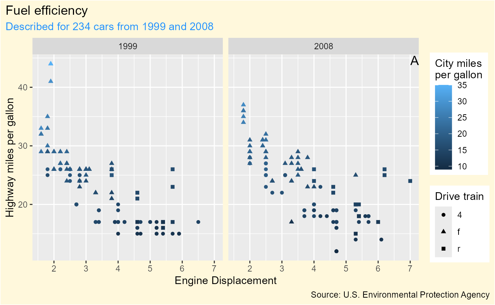
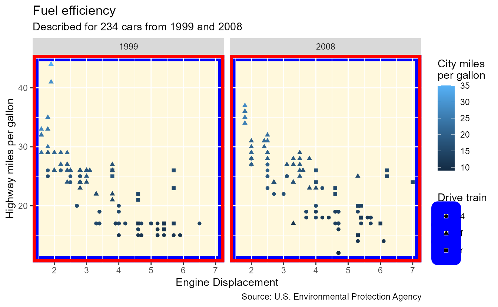

<!--
TODO:
* [ ] Look over / edit the post's title in the yaml
* [ ] Edit (or delete) the description; note this appears in the Twitter card
* [ ] Pick category and tags (see existing with [`hugodown::tidy_show_meta()`](https://rdrr.io/pkg/hugodown/man/use_tidy_post.html))
* [ ] Find photo & update yaml metadata
* [ ] Create `thumbnail-sq.jpg`; height and width should be equal
* [ ] Create `thumbnail-wd.jpg`; width should be >5x height
* [ ] [`hugodown::use_tidy_thumbnails()`](https://rdrr.io/pkg/hugodown/man/use_tidy_post.html)
* [ ] Add intro sentence, e.g. the standard tagline for the package
* [ ] [`usethis::use_tidy_thanks()`](https://usethis.r-lib.org/reference/use_tidy_thanks.html)
-->

## So you want to style your plot?

Diligently, you have read, cleaned and modelled your data. You have carefully crafted a plot that lets your data speak its story. Now it is time to polish. Now it is time to let your visualisation shine.

We will set out to illuminate how to set the stylistic finishing touches on your visualisations made with the ggplot2 package. The ggplot2 package has had a [recent release](https://www.tidyverse.org/blog/2025/09/ggplot2-4-0-0/) that included some relevant changes to styling plots. In ggplot2, the theme system is responsible for many non-data aspects of how your plot looks. It covers anything from panels, to axes, titles and legends. Here, we'll get started with digesting important parts of the theme system. We'll start with complete themes, get into theme elements followed by how these elements are used in various parts of the plot and finish off with some tips, including how to write your own theme functions. Before we begin discussing themes, let's make an example plot that can showcase many aspects.

<pre class='chroma'><code class='language-r' data-lang='r'><a href='https://rdrr.io/r/base/library.html'>library</a>(<a href='https://ggplot2.tidyverse.org'>ggplot2</a>)

p &lt;- <a href='https://ggplot2.tidyverse.org/reference/ggplot.html'>ggplot</a>(mpg, <a href='https://ggplot2.tidyverse.org/reference/aes.html'>aes</a>(displ, hwy, colour = cty, shape = drv)) +
  <a href='https://ggplot2.tidyverse.org/reference/geom_point.html'>geom_point</a>() +
  <a href='https://ggplot2.tidyverse.org/reference/facet_grid.html'>facet_grid</a>(~ year) +
  <a href='https://ggplot2.tidyverse.org/reference/labs.html'>labs</a>(
    title = "Fuel efficiency",
    subtitle = <a href='https://rdrr.io/r/base/paste.html'>paste0</a>("Described for ", <a href='https://rdrr.io/r/base/nrow.html'>nrow</a>(mpg), " cars from 1999 and 2008"),
    caption = "Source: U.S. Environmental Protection Agency",
    x = "Engine Displacement",
    y = "Highway miles per gallon",
    colour = "City miles\nper gallon",
    shape = "Drive train"
  )

p</code></pre>

<script type="application/json" data-for="htmlwidget-d98064058d21aab41c73">{"x":{"html":"<?xml version=\"1.0\" encoding=\"UTF-8\"?>\n<svg xmlns='http://www.w3.org/2000/svg' xmlns:xlink='http://www.w3.org/1999/xlink' class='ggiraph-svg' role='graphics-document' id='svg_55735f3a_43be_433d_b895_216b1a6034dd' viewBox='0 0 504 311.47'>\n <style><![CDATA[.hover_theme_svg_55735f3a_43be_433d_b895_216b1a6034dd[theme-id = \"plot.caption\"] { fill:red; }.hover_theme_svg_55735f3a_43be_433d_b895_216b1a6034dd[theme-id = \"plot.title\"] { fill:red; }.hover_theme_svg_55735f3a_43be_433d_b895_216b1a6034dd[theme-id = \"legend.text\"] { fill:red; }.hover_theme_svg_55735f3a_43be_433d_b895_216b1a6034dd[theme-id = \"legend.ticks\"] { stroke:red; }.hover_theme_svg_55735f3a_43be_433d_b895_216b1a6034dd[theme-id = \"legend.frame palette.colour.continuous\"] { stroke:red;fill:#FF888888; }.hover_theme_svg_55735f3a_43be_433d_b895_216b1a6034dd[theme-id = \"legend.box.background\"] { stroke:red;fill:#FFEEEE; }.hover_theme_svg_55735f3a_43be_433d_b895_216b1a6034dd[theme-id = \"axis.title.y.left\"] { fill:red; }.hover_theme_svg_55735f3a_43be_433d_b895_216b1a6034dd[theme-id = \"axis.ticks.y.left\"] { stroke:red; }.hover_theme_svg_55735f3a_43be_433d_b895_216b1a6034dd[theme-id = \"axis.text.y.left\"] { fill:red; }.hover_theme_svg_55735f3a_43be_433d_b895_216b1a6034dd[theme-id = \"legend.key\"] { stroke:red;fill:#FFCCCC; }.hover_theme_svg_55735f3a_43be_433d_b895_216b1a6034dd[theme-id = \"axis.title.x.bottom\"] { fill:red; }.hover_theme_svg_55735f3a_43be_433d_b895_216b1a6034dd[theme-id = \"panel.grid.major.x\"] { stroke:red; }.hover_data_svg_55735f3a_43be_433d_b895_216b1a6034dd[data-id = \"geom\"] { stroke:red;fill:red; }.hover_theme_svg_55735f3a_43be_433d_b895_216b1a6034dd[theme-id = \"plot.background\"] { stroke:red;fill:#FFEEEE; }.hover_theme_svg_55735f3a_43be_433d_b895_216b1a6034dd[theme-id = \"axis.ticks.x.bottom\"] { stroke:red; }.hover_theme_svg_55735f3a_43be_433d_b895_216b1a6034dd[theme-id = \"plot.subtitle\"] { fill:red; }.hover_theme_svg_55735f3a_43be_433d_b895_216b1a6034dd[theme-id = \"axis.line.x.bottom\"] { stroke:red; }.hover_theme_svg_55735f3a_43be_433d_b895_216b1a6034dd[theme-id = \"panel.background panel.border\"] { stroke:red;fill:#FFCCCC; }.hover_theme_svg_55735f3a_43be_433d_b895_216b1a6034dd[theme-id = \"panel.grid.minor.y\"] { stroke:red; }.hover_theme_svg_55735f3a_43be_433d_b895_216b1a6034dd[theme-id = \"panel.grid.minor.x\"] { stroke:red; }.hover_theme_svg_55735f3a_43be_433d_b895_216b1a6034dd[theme-id = \"legend.background\"] { stroke:red;fill:#FFEEEE; }.hover_theme_svg_55735f3a_43be_433d_b895_216b1a6034dd[theme-id = \"strip.background.x\"] { stroke:red;fill:#FF8888; }.hover_theme_svg_55735f3a_43be_433d_b895_216b1a6034dd[theme-id = \"axis.text.x.bottom\"] { fill:red; }.hover_theme_svg_55735f3a_43be_433d_b895_216b1a6034dd[theme-id = \"panel.grid.major.y\"] { stroke:red; }.hover_theme_svg_55735f3a_43be_433d_b895_216b1a6034dd[theme-id = \"strip.text.x.top\"] { fill:red; }.hover_key_svg_55735f3a_43be_433d_b895_216b1a6034dd[key-id = \"shape\"] { stroke:red;fill:red; }.hover_theme_svg_55735f3a_43be_433d_b895_216b1a6034dd[theme-id = \"legend.title\"] { fill:red; }.hover_theme_svg_55735f3a_43be_433d_b895_216b1a6034dd[theme-id = \"axis.line.y.left\"] { stroke:red; }]]><\/style>\n <defs id='svg_55735f3a_43be_433d_b895_216b1a6034dd_defs'>\n  <clipPath id='svg_55735f3a_43be_433d_b895_216b1a6034dd_c1'>\n   <rect x='0' y='0' width='504' height='311.47'/>\n  <\/clipPath>\n  <clipPath id='svg_55735f3a_43be_433d_b895_216b1a6034dd_c2'>\n   <rect x='33.14' y='55.77' width='193.93' height='210.58'/>\n  <\/clipPath>\n  <clipPath id='svg_55735f3a_43be_433d_b895_216b1a6034dd_c3'>\n   <rect x='232.54' y='55.77' width='193.93' height='210.58'/>\n  <\/clipPath>\n  <clipPath id='svg_55735f3a_43be_433d_b895_216b1a6034dd_c4'>\n   <rect x='33.14' y='38.85' width='193.93' height='16.92'/>\n  <\/clipPath>\n  <clipPath id='svg_55735f3a_43be_433d_b895_216b1a6034dd_c5'>\n   <rect x='232.54' y='38.85' width='193.93' height='16.92'/>\n  <\/clipPath>\n <\/defs>\n <g id='svg_55735f3a_43be_433d_b895_216b1a6034dd_rootg' class='ggiraph-svg-rootg'>\n  <g clip-path='url(#svg_55735f3a_43be_433d_b895_216b1a6034dd_c1)'>\n   <rect x='0' y='0' width='504' height='311.47' fill='#FFFFFF' fill-opacity='1' stroke='#FFFFFF' stroke-opacity='1' stroke-width='0.75' stroke-linejoin='round' stroke-linecap='round' class='ggiraph-svg-bg'/>\n   <rect id='svg_55735f3a_43be_433d_b895_216b1a6034dd_e1' x='0' y='0' width='504' height='311.47' fill='#FFFFFF' fill-opacity='1' stroke='#FFFFFF' stroke-opacity='1' stroke-width='1.07' stroke-linejoin='round' stroke-linecap='round' title='&amp;lt;code&amp;gt;plot.background&amp;lt;/code&amp;gt;' theme-id='plot.background'/>\n  <\/g>\n  <g clip-path='url(#svg_55735f3a_43be_433d_b895_216b1a6034dd_c2)'>\n   <rect id='svg_55735f3a_43be_433d_b895_216b1a6034dd_e2' x='33.14' y='55.77' width='193.93' height='210.58' fill='#EBEBEB' fill-opacity='1' stroke='none' title='&amp;lt;code&amp;gt;panel.background&amp;lt;br&amp;gt;panel.border&amp;lt;/code&amp;gt;' theme-id='panel.background&lt;br&gt;panel.border'/>\n   <polyline id='svg_55735f3a_43be_433d_b895_216b1a6034dd_e3' points='33.14,238.83 227.06,238.83' fill='none' stroke='#FFFFFF' stroke-opacity='1' stroke-width='0.53' stroke-linejoin='round' stroke-linecap='butt' title='&amp;lt;code&amp;gt;panel.grid.minor.y&amp;lt;/code&amp;gt;' theme-id='panel.grid.minor.y'/>\n   <polyline id='svg_55735f3a_43be_433d_b895_216b1a6034dd_e4' points='33.14,179.00 227.06,179.00' fill='none' stroke='#FFFFFF' stroke-opacity='1' stroke-width='0.53' stroke-linejoin='round' stroke-linecap='butt' title='&amp;lt;code&amp;gt;panel.grid.minor.y&amp;lt;/code&amp;gt;' theme-id='panel.grid.minor.y'/>\n   <polyline id='svg_55735f3a_43be_433d_b895_216b1a6034dd_e5' points='33.14,119.18 227.06,119.18' fill='none' stroke='#FFFFFF' stroke-opacity='1' stroke-width='0.53' stroke-linejoin='round' stroke-linecap='butt' title='&amp;lt;code&amp;gt;panel.grid.minor.y&amp;lt;/code&amp;gt;' theme-id='panel.grid.minor.y'/>\n   <polyline id='svg_55735f3a_43be_433d_b895_216b1a6034dd_e6' points='33.14,59.36 227.06,59.36' fill='none' stroke='#FFFFFF' stroke-opacity='1' stroke-width='0.53' stroke-linejoin='round' stroke-linecap='butt' title='&amp;lt;code&amp;gt;panel.grid.minor.y&amp;lt;/code&amp;gt;' theme-id='panel.grid.minor.y'/>\n   <polyline id='svg_55735f3a_43be_433d_b895_216b1a6034dd_e7' points='38.69,266.35 38.69,55.77' fill='none' stroke='#FFFFFF' stroke-opacity='1' stroke-width='0.53' stroke-linejoin='round' stroke-linecap='butt' title='&amp;lt;code&amp;gt;panel.grid.minor.x&amp;lt;/code&amp;gt;' theme-id='panel.grid.minor.x'/>\n   <polyline id='svg_55735f3a_43be_433d_b895_216b1a6034dd_e8' points='71.34,266.35 71.34,55.77' fill='none' stroke='#FFFFFF' stroke-opacity='1' stroke-width='0.53' stroke-linejoin='round' stroke-linecap='butt' title='&amp;lt;code&amp;gt;panel.grid.minor.x&amp;lt;/code&amp;gt;' theme-id='panel.grid.minor.x'/>\n   <polyline id='svg_55735f3a_43be_433d_b895_216b1a6034dd_e9' points='103.98,266.35 103.98,55.77' fill='none' stroke='#FFFFFF' stroke-opacity='1' stroke-width='0.53' stroke-linejoin='round' stroke-linecap='butt' title='&amp;lt;code&amp;gt;panel.grid.minor.x&amp;lt;/code&amp;gt;' theme-id='panel.grid.minor.x'/>\n   <polyline id='svg_55735f3a_43be_433d_b895_216b1a6034dd_e10' points='136.63,266.35 136.63,55.77' fill='none' stroke='#FFFFFF' stroke-opacity='1' stroke-width='0.53' stroke-linejoin='round' stroke-linecap='butt' title='&amp;lt;code&amp;gt;panel.grid.minor.x&amp;lt;/code&amp;gt;' theme-id='panel.grid.minor.x'/>\n   <polyline id='svg_55735f3a_43be_433d_b895_216b1a6034dd_e11' points='169.28,266.35 169.28,55.77' fill='none' stroke='#FFFFFF' stroke-opacity='1' stroke-width='0.53' stroke-linejoin='round' stroke-linecap='butt' title='&amp;lt;code&amp;gt;panel.grid.minor.x&amp;lt;/code&amp;gt;' theme-id='panel.grid.minor.x'/>\n   <polyline id='svg_55735f3a_43be_433d_b895_216b1a6034dd_e12' points='201.93,266.35 201.93,55.77' fill='none' stroke='#FFFFFF' stroke-opacity='1' stroke-width='0.53' stroke-linejoin='round' stroke-linecap='butt' title='&amp;lt;code&amp;gt;panel.grid.minor.x&amp;lt;/code&amp;gt;' theme-id='panel.grid.minor.x'/>\n   <polyline id='svg_55735f3a_43be_433d_b895_216b1a6034dd_e13' points='33.14,208.92 227.06,208.92' fill='none' stroke='#FFFFFF' stroke-opacity='1' stroke-width='1.07' stroke-linejoin='round' stroke-linecap='butt' title='&amp;lt;code&amp;gt;panel.grid.major.y&amp;lt;/code&amp;gt;' theme-id='panel.grid.major.y'/>\n   <polyline id='svg_55735f3a_43be_433d_b895_216b1a6034dd_e14' points='33.14,149.09 227.06,149.09' fill='none' stroke='#FFFFFF' stroke-opacity='1' stroke-width='1.07' stroke-linejoin='round' stroke-linecap='butt' title='&amp;lt;code&amp;gt;panel.grid.major.y&amp;lt;/code&amp;gt;' theme-id='panel.grid.major.y'/>\n   <polyline id='svg_55735f3a_43be_433d_b895_216b1a6034dd_e15' points='33.14,89.27 227.06,89.27' fill='none' stroke='#FFFFFF' stroke-opacity='1' stroke-width='1.07' stroke-linejoin='round' stroke-linecap='butt' title='&amp;lt;code&amp;gt;panel.grid.major.y&amp;lt;/code&amp;gt;' theme-id='panel.grid.major.y'/>\n   <polyline id='svg_55735f3a_43be_433d_b895_216b1a6034dd_e16' points='55.01,266.35 55.01,55.77' fill='none' stroke='#FFFFFF' stroke-opacity='1' stroke-width='1.07' stroke-linejoin='round' stroke-linecap='butt' title='&amp;lt;code&amp;gt;panel.grid.major.x&amp;lt;/code&amp;gt;' theme-id='panel.grid.major.x'/>\n   <polyline id='svg_55735f3a_43be_433d_b895_216b1a6034dd_e17' points='87.66,266.35 87.66,55.77' fill='none' stroke='#FFFFFF' stroke-opacity='1' stroke-width='1.07' stroke-linejoin='round' stroke-linecap='butt' title='&amp;lt;code&amp;gt;panel.grid.major.x&amp;lt;/code&amp;gt;' theme-id='panel.grid.major.x'/>\n   <polyline id='svg_55735f3a_43be_433d_b895_216b1a6034dd_e18' points='120.31,266.35 120.31,55.77' fill='none' stroke='#FFFFFF' stroke-opacity='1' stroke-width='1.07' stroke-linejoin='round' stroke-linecap='butt' title='&amp;lt;code&amp;gt;panel.grid.major.x&amp;lt;/code&amp;gt;' theme-id='panel.grid.major.x'/>\n   <polyline id='svg_55735f3a_43be_433d_b895_216b1a6034dd_e19' points='152.95,266.35 152.95,55.77' fill='none' stroke='#FFFFFF' stroke-opacity='1' stroke-width='1.07' stroke-linejoin='round' stroke-linecap='butt' title='&amp;lt;code&amp;gt;panel.grid.major.x&amp;lt;/code&amp;gt;' theme-id='panel.grid.major.x'/>\n   <polyline id='svg_55735f3a_43be_433d_b895_216b1a6034dd_e20' points='185.60,266.35 185.60,55.77' fill='none' stroke='#FFFFFF' stroke-opacity='1' stroke-width='1.07' stroke-linejoin='round' stroke-linecap='butt' title='&amp;lt;code&amp;gt;panel.grid.major.x&amp;lt;/code&amp;gt;' theme-id='panel.grid.major.x'/>\n   <polyline id='svg_55735f3a_43be_433d_b895_216b1a6034dd_e21' points='218.25,266.35 218.25,55.77' fill='none' stroke='#FFFFFF' stroke-opacity='1' stroke-width='1.07' stroke-linejoin='round' stroke-linecap='butt' title='&amp;lt;code&amp;gt;panel.grid.major.x&amp;lt;/code&amp;gt;' theme-id='panel.grid.major.x'/>\n   <polygon id='svg_55735f3a_43be_433d_b895_216b1a6034dd_e22' points='48.48,152.04 51.11,156.60 45.85,156.60' fill='#29567D' fill-opacity='1' stroke='none' data-id='geom' title='&amp;lt;code&amp;gt;geom&amp;lt;/code&amp;gt;'/>\n   <polygon id='svg_55735f3a_43be_433d_b895_216b1a6034dd_e23' points='48.48,152.04 51.11,156.60 45.85,156.60' fill='#306591' fill-opacity='1' stroke='none' data-id='geom' title='&amp;lt;code&amp;gt;geom&amp;lt;/code&amp;gt;'/>\n   <polygon id='svg_55735f3a_43be_433d_b895_216b1a6034dd_e24' points='81.13,169.98 83.76,174.54 78.50,174.54' fill='#244C6F' fill-opacity='1' stroke='none' data-id='geom' title='&amp;lt;code&amp;gt;geom&amp;lt;/code&amp;gt;'/>\n   <polygon id='svg_55735f3a_43be_433d_b895_216b1a6034dd_e25' points='81.13,169.98 83.76,174.54 78.50,174.54' fill='#29567D' fill-opacity='1' stroke='none' data-id='geom' title='&amp;lt;code&amp;gt;geom&amp;lt;/code&amp;gt;'/>\n   <circle id='svg_55735f3a_43be_433d_b895_216b1a6034dd_e26' cx='48.48' cy='173.02' r='1.47pt' fill='#29567D' fill-opacity='1' stroke='none' data-id='geom' title='&amp;lt;code&amp;gt;geom&amp;lt;/code&amp;gt;'/>\n   <circle id='svg_55735f3a_43be_433d_b895_216b1a6034dd_e27' cx='48.48' cy='179' r='1.47pt' fill='#244C6F' fill-opacity='1' stroke='none' data-id='geom' title='&amp;lt;code&amp;gt;geom&amp;lt;/code&amp;gt;'/>\n   <circle id='svg_55735f3a_43be_433d_b895_216b1a6034dd_e28' cx='81.13' cy='179' r='1.47pt' fill='#214769' fill-opacity='1' stroke='none' data-id='geom' title='&amp;lt;code&amp;gt;geom&amp;lt;/code&amp;gt;'/>\n   <circle id='svg_55735f3a_43be_433d_b895_216b1a6034dd_e29' cx='81.13' cy='179' r='1.47pt' fill='#265176' fill-opacity='1' stroke='none' data-id='geom' title='&amp;lt;code&amp;gt;geom&amp;lt;/code&amp;gt;'/>\n   <circle id='svg_55735f3a_43be_433d_b895_216b1a6034dd_e30' cx='81.13' cy='184.99' r='1.47pt' fill='#214769' fill-opacity='1' stroke='none' data-id='geom' title='&amp;lt;code&amp;gt;geom&amp;lt;/code&amp;gt;'/>\n   <polygon id='svg_55735f3a_43be_433d_b895_216b1a6034dd_e31' points='173.85,228.82 177.76,228.82 177.76,224.91 173.85,224.91' fill='#1C3D5C' fill-opacity='1' stroke='none' data-id='geom' title='&amp;lt;code&amp;gt;geom&amp;lt;/code&amp;gt;'/>\n   <polygon id='svg_55735f3a_43be_433d_b895_216b1a6034dd_e32' points='173.85,174.98 177.76,174.98 177.76,171.07 173.85,171.07' fill='#244C6F' fill-opacity='1' stroke='none' data-id='geom' title='&amp;lt;code&amp;gt;geom&amp;lt;/code&amp;gt;'/>\n   <polygon id='svg_55735f3a_43be_433d_b895_216b1a6034dd_e33' points='173.85,192.92 177.76,192.92 177.76,189.01 173.85,189.01' fill='#214769' fill-opacity='1' stroke='none' data-id='geom' title='&amp;lt;code&amp;gt;geom&amp;lt;/code&amp;gt;'/>\n   <circle id='svg_55735f3a_43be_433d_b895_216b1a6034dd_e34' cx='175.81' cy='238.83' r='1.47pt' fill='#18344F' fill-opacity='1' stroke='none' data-id='geom' title='&amp;lt;code&amp;gt;geom&amp;lt;/code&amp;gt;'/>\n   <circle id='svg_55735f3a_43be_433d_b895_216b1a6034dd_e35' cx='201.93' cy='226.86' r='1.47pt' fill='#1F4262' fill-opacity='1' stroke='none' data-id='geom' title='&amp;lt;code&amp;gt;geom&amp;lt;/code&amp;gt;'/>\n   <polygon id='svg_55735f3a_43be_433d_b895_216b1a6034dd_e36' points='68.07,164.00 70.70,168.56 65.44,168.56' fill='#2B5B83' fill-opacity='1' stroke='none' data-id='geom' title='&amp;lt;code&amp;gt;geom&amp;lt;/code&amp;gt;'/>\n   <polygon id='svg_55735f3a_43be_433d_b895_216b1a6034dd_e37' points='90.92,169.98 93.56,174.54 88.29,174.54' fill='#29567D' fill-opacity='1' stroke='none' data-id='geom' title='&amp;lt;code&amp;gt;geom&amp;lt;/code&amp;gt;'/>\n   <polygon id='svg_55735f3a_43be_433d_b895_216b1a6034dd_e38' points='68.07,181.95 70.70,186.51 65.44,186.51' fill='#29567D' fill-opacity='1' stroke='none' data-id='geom' title='&amp;lt;code&amp;gt;geom&amp;lt;/code&amp;gt;'/>\n   <polygon id='svg_55735f3a_43be_433d_b895_216b1a6034dd_e39' points='87.66,181.95 90.29,186.51 85.03,186.51' fill='#265176' fill-opacity='1' stroke='none' data-id='geom' title='&amp;lt;code&amp;gt;geom&amp;lt;/code&amp;gt;'/>\n   <polygon id='svg_55735f3a_43be_433d_b895_216b1a6034dd_e40' points='97.45,193.91 100.09,198.47 94.82,198.47' fill='#244C6F' fill-opacity='1' stroke='none' data-id='geom' title='&amp;lt;code&amp;gt;geom&amp;lt;/code&amp;gt;'/>\n   <polygon id='svg_55735f3a_43be_433d_b895_216b1a6034dd_e41' points='97.45,193.91 100.09,198.47 94.82,198.47' fill='#244C6F' fill-opacity='1' stroke='none' data-id='geom' title='&amp;lt;code&amp;gt;geom&amp;lt;/code&amp;gt;'/>\n   <polygon id='svg_55735f3a_43be_433d_b895_216b1a6034dd_e42' points='113.78,193.91 116.41,198.47 111.14,198.47' fill='#214769' fill-opacity='1' stroke='none' data-id='geom' title='&amp;lt;code&amp;gt;geom&amp;lt;/code&amp;gt;'/>\n   <polygon id='svg_55735f3a_43be_433d_b895_216b1a6034dd_e43' points='113.78,199.89 116.41,204.45 111.14,204.45' fill='#214769' fill-opacity='1' stroke='none' data-id='geom' title='&amp;lt;code&amp;gt;geom&amp;lt;/code&amp;gt;'/>\n   <circle id='svg_55735f3a_43be_433d_b895_216b1a6034dd_e44' cx='117.04' cy='226.86' r='1.47pt' fill='#1C3D5C' fill-opacity='1' stroke='none' data-id='geom' title='&amp;lt;code&amp;gt;geom&amp;lt;/code&amp;gt;'/>\n   <circle id='svg_55735f3a_43be_433d_b895_216b1a6034dd_e45' cx='117.04' cy='226.86' r='1.47pt' fill='#1F4262' fill-opacity='1' stroke='none' data-id='geom' title='&amp;lt;code&amp;gt;geom&amp;lt;/code&amp;gt;'/>\n   <circle id='svg_55735f3a_43be_433d_b895_216b1a6034dd_e46' cx='159.48' cy='226.86' r='1.47pt' fill='#18344F' fill-opacity='1' stroke='none' data-id='geom' title='&amp;lt;code&amp;gt;geom&amp;lt;/code&amp;gt;'/>\n   <circle id='svg_55735f3a_43be_433d_b895_216b1a6034dd_e47' cx='159.48' cy='238.83' r='1.47pt' fill='#18344F' fill-opacity='1' stroke='none' data-id='geom' title='&amp;lt;code&amp;gt;geom&amp;lt;/code&amp;gt;'/>\n   <circle id='svg_55735f3a_43be_433d_b895_216b1a6034dd_e48' cx='117.04' cy='226.86' r='1.47pt' fill='#1C3D5C' fill-opacity='1' stroke='none' data-id='geom' title='&amp;lt;code&amp;gt;geom&amp;lt;/code&amp;gt;'/>\n   <circle id='svg_55735f3a_43be_433d_b895_216b1a6034dd_e49' cx='159.48' cy='232.85' r='1.47pt' fill='#18344F' fill-opacity='1' stroke='none' data-id='geom' title='&amp;lt;code&amp;gt;geom&amp;lt;/code&amp;gt;'/>\n   <circle id='svg_55735f3a_43be_433d_b895_216b1a6034dd_e50' cx='182.34' cy='238.83' r='1.47pt' fill='#18344F' fill-opacity='1' stroke='none' data-id='geom' title='&amp;lt;code&amp;gt;geom&amp;lt;/code&amp;gt;'/>\n   <circle id='svg_55735f3a_43be_433d_b895_216b1a6034dd_e51' cx='159.48' cy='238.83' r='1.47pt' fill='#18344F' fill-opacity='1' stroke='none' data-id='geom' title='&amp;lt;code&amp;gt;geom&amp;lt;/code&amp;gt;'/>\n   <circle id='svg_55735f3a_43be_433d_b895_216b1a6034dd_e52' cx='159.48' cy='232.85' r='1.47pt' fill='#18344F' fill-opacity='1' stroke='none' data-id='geom' title='&amp;lt;code&amp;gt;geom&amp;lt;/code&amp;gt;'/>\n   <circle id='svg_55735f3a_43be_433d_b895_216b1a6034dd_e53' cx='182.34' cy='238.83' r='1.47pt' fill='#18344F' fill-opacity='1' stroke='none' data-id='geom' title='&amp;lt;code&amp;gt;geom&amp;lt;/code&amp;gt;'/>\n   <polygon id='svg_55735f3a_43be_433d_b895_216b1a6034dd_e54' points='137.94,228.82 141.85,228.82 141.85,224.91 137.94,224.91' fill='#18344F' fill-opacity='1' stroke='none' data-id='geom' title='&amp;lt;code&amp;gt;geom&amp;lt;/code&amp;gt;'/>\n   <polygon id='svg_55735f3a_43be_433d_b895_216b1a6034dd_e55' points='164.06,228.82 167.97,228.82 167.97,224.91 164.06,224.91' fill='#18344F' fill-opacity='1' stroke='none' data-id='geom' title='&amp;lt;code&amp;gt;geom&amp;lt;/code&amp;gt;'/>\n   <circle id='svg_55735f3a_43be_433d_b895_216b1a6034dd_e56' cx='120.31' cy='226.86' r='1.47pt' fill='#1F4262' fill-opacity='1' stroke='none' data-id='geom' title='&amp;lt;code&amp;gt;geom&amp;lt;/code&amp;gt;'/>\n   <circle id='svg_55735f3a_43be_433d_b895_216b1a6034dd_e57' cx='120.31' cy='214.9' r='1.47pt' fill='#214769' fill-opacity='1' stroke='none' data-id='geom' title='&amp;lt;code&amp;gt;geom&amp;lt;/code&amp;gt;'/>\n   <circle id='svg_55735f3a_43be_433d_b895_216b1a6034dd_e58' cx='120.31' cy='226.86' r='1.47pt' fill='#1F4262' fill-opacity='1' stroke='none' data-id='geom' title='&amp;lt;code&amp;gt;geom&amp;lt;/code&amp;gt;'/>\n   <circle id='svg_55735f3a_43be_433d_b895_216b1a6034dd_e59' cx='152.95' cy='226.86' r='1.47pt' fill='#1C3D5C' fill-opacity='1' stroke='none' data-id='geom' title='&amp;lt;code&amp;gt;geom&amp;lt;/code&amp;gt;'/>\n   <circle id='svg_55735f3a_43be_433d_b895_216b1a6034dd_e60' cx='126.84' cy='226.86' r='1.47pt' fill='#1F4262' fill-opacity='1' stroke='none' data-id='geom' title='&amp;lt;code&amp;gt;geom&amp;lt;/code&amp;gt;'/>\n   <circle id='svg_55735f3a_43be_433d_b895_216b1a6034dd_e61' cx='126.84' cy='226.86' r='1.47pt' fill='#1F4262' fill-opacity='1' stroke='none' data-id='geom' title='&amp;lt;code&amp;gt;geom&amp;lt;/code&amp;gt;'/>\n   <circle id='svg_55735f3a_43be_433d_b895_216b1a6034dd_e62' cx='139.9' cy='232.85' r='1.47pt' fill='#1C3D5C' fill-opacity='1' stroke='none' data-id='geom' title='&amp;lt;code&amp;gt;geom&amp;lt;/code&amp;gt;'/>\n   <circle id='svg_55735f3a_43be_433d_b895_216b1a6034dd_e63' cx='139.9' cy='232.85' r='1.47pt' fill='#1C3D5C' fill-opacity='1' stroke='none' data-id='geom' title='&amp;lt;code&amp;gt;geom&amp;lt;/code&amp;gt;'/>\n   <circle id='svg_55735f3a_43be_433d_b895_216b1a6034dd_e64' cx='166.01' cy='238.83' r='1.47pt' fill='#18344F' fill-opacity='1' stroke='none' data-id='geom' title='&amp;lt;code&amp;gt;geom&amp;lt;/code&amp;gt;'/>\n   <polygon id='svg_55735f3a_43be_433d_b895_216b1a6034dd_e65' points='111.82,174.98 115.73,174.98 115.73,171.07 111.82,171.07' fill='#29567D' fill-opacity='1' stroke='none' data-id='geom' title='&amp;lt;code&amp;gt;geom&amp;lt;/code&amp;gt;'/>\n   <polygon id='svg_55735f3a_43be_433d_b895_216b1a6034dd_e66' points='111.82,180.96 115.73,180.96 115.73,177.05 111.82,177.05' fill='#29567D' fill-opacity='1' stroke='none' data-id='geom' title='&amp;lt;code&amp;gt;geom&amp;lt;/code&amp;gt;'/>\n   <polygon id='svg_55735f3a_43be_433d_b895_216b1a6034dd_e67' points='137.94,204.89 141.85,204.89 141.85,200.98 137.94,200.98' fill='#214769' fill-opacity='1' stroke='none' data-id='geom' title='&amp;lt;code&amp;gt;geom&amp;lt;/code&amp;gt;'/>\n   <polygon id='svg_55735f3a_43be_433d_b895_216b1a6034dd_e68' points='137.94,198.91 141.85,198.91 141.85,195.00 137.94,195.00' fill='#214769' fill-opacity='1' stroke='none' data-id='geom' title='&amp;lt;code&amp;gt;geom&amp;lt;/code&amp;gt;'/>\n   <polygon id='svg_55735f3a_43be_433d_b895_216b1a6034dd_e69' points='41.95,128.11 44.59,132.67 39.32,132.67' fill='#438AC3' fill-opacity='1' stroke='none' data-id='geom' title='&amp;lt;code&amp;gt;geom&amp;lt;/code&amp;gt;'/>\n   <polygon id='svg_55735f3a_43be_433d_b895_216b1a6034dd_e70' points='41.95,134.09 44.59,138.65 39.32,138.65' fill='#3875A6' fill-opacity='1' stroke='none' data-id='geom' title='&amp;lt;code&amp;gt;geom&amp;lt;/code&amp;gt;'/>\n   <polygon id='svg_55735f3a_43be_433d_b895_216b1a6034dd_e71' points='41.95,134.09 44.59,138.65 39.32,138.65' fill='#3B7AAD' fill-opacity='1' stroke='none' data-id='geom' title='&amp;lt;code&amp;gt;geom&amp;lt;/code&amp;gt;'/>\n   <polygon id='svg_55735f3a_43be_433d_b895_216b1a6034dd_e72' points='41.95,152.04 44.59,156.60 39.32,156.60' fill='#356F9F' fill-opacity='1' stroke='none' data-id='geom' title='&amp;lt;code&amp;gt;geom&amp;lt;/code&amp;gt;'/>\n   <polygon id='svg_55735f3a_43be_433d_b895_216b1a6034dd_e73' points='41.95,134.09 44.59,138.65 39.32,138.65' fill='#3875A6' fill-opacity='1' stroke='none' data-id='geom' title='&amp;lt;code&amp;gt;geom&amp;lt;/code&amp;gt;'/>\n   <polygon id='svg_55735f3a_43be_433d_b895_216b1a6034dd_e74' points='68.07,169.98 70.70,174.54 65.44,174.54' fill='#29567D' fill-opacity='1' stroke='none' data-id='geom' title='&amp;lt;code&amp;gt;geom&amp;lt;/code&amp;gt;'/>\n   <polygon id='svg_55735f3a_43be_433d_b895_216b1a6034dd_e75' points='68.07,164.00 70.70,168.56 65.44,168.56' fill='#29567D' fill-opacity='1' stroke='none' data-id='geom' title='&amp;lt;code&amp;gt;geom&amp;lt;/code&amp;gt;'/>\n   <polygon id='svg_55735f3a_43be_433d_b895_216b1a6034dd_e76' points='71.34,169.98 73.97,174.54 68.70,174.54' fill='#29567D' fill-opacity='1' stroke='none' data-id='geom' title='&amp;lt;code&amp;gt;geom&amp;lt;/code&amp;gt;'/>\n   <polygon id='svg_55735f3a_43be_433d_b895_216b1a6034dd_e77' points='71.34,169.98 73.97,174.54 68.70,174.54' fill='#29567D' fill-opacity='1' stroke='none' data-id='geom' title='&amp;lt;code&amp;gt;geom&amp;lt;/code&amp;gt;'/>\n   <polygon id='svg_55735f3a_43be_433d_b895_216b1a6034dd_e78' points='55.01,169.98 57.64,174.54 52.38,174.54' fill='#2B5B83' fill-opacity='1' stroke='none' data-id='geom' title='&amp;lt;code&amp;gt;geom&amp;lt;/code&amp;gt;'/>\n   <polygon id='svg_55735f3a_43be_433d_b895_216b1a6034dd_e79' points='55.01,152.04 57.64,156.60 52.38,156.60' fill='#2B5B83' fill-opacity='1' stroke='none' data-id='geom' title='&amp;lt;code&amp;gt;geom&amp;lt;/code&amp;gt;'/>\n   <circle id='svg_55735f3a_43be_433d_b895_216b1a6034dd_e80' cx='120.31' cy='208.92' r='1.47pt' fill='#214769' fill-opacity='1' stroke='none' data-id='geom' title='&amp;lt;code&amp;gt;geom&amp;lt;/code&amp;gt;'/>\n   <circle id='svg_55735f3a_43be_433d_b895_216b1a6034dd_e81' cx='143.16' cy='226.86' r='1.47pt' fill='#1F4262' fill-opacity='1' stroke='none' data-id='geom' title='&amp;lt;code&amp;gt;geom&amp;lt;/code&amp;gt;'/>\n   <circle id='svg_55735f3a_43be_433d_b895_216b1a6034dd_e82' cx='120.31' cy='238.83' r='1.47pt' fill='#18344F' fill-opacity='1' stroke='none' data-id='geom' title='&amp;lt;code&amp;gt;geom&amp;lt;/code&amp;gt;'/>\n   <circle id='svg_55735f3a_43be_433d_b895_216b1a6034dd_e83' cx='139.9' cy='238.83' r='1.47pt' fill='#18344F' fill-opacity='1' stroke='none' data-id='geom' title='&amp;lt;code&amp;gt;geom&amp;lt;/code&amp;gt;'/>\n   <polygon id='svg_55735f3a_43be_433d_b895_216b1a6034dd_e84' points='164.06,228.82 167.97,228.82 167.97,224.91 164.06,224.91' fill='#18344F' fill-opacity='1' stroke='none' data-id='geom' title='&amp;lt;code&amp;gt;geom&amp;lt;/code&amp;gt;'/>\n   <polygon id='svg_55735f3a_43be_433d_b895_216b1a6034dd_e85' points='164.06,234.80 167.97,234.80 167.97,230.89 164.06,230.89' fill='#18344F' fill-opacity='1' stroke='none' data-id='geom' title='&amp;lt;code&amp;gt;geom&amp;lt;/code&amp;gt;'/>\n   <circle id='svg_55735f3a_43be_433d_b895_216b1a6034dd_e86' cx='120.31' cy='226.86' r='1.47pt' fill='#1F4262' fill-opacity='1' stroke='none' data-id='geom' title='&amp;lt;code&amp;gt;geom&amp;lt;/code&amp;gt;'/>\n   <circle id='svg_55735f3a_43be_433d_b895_216b1a6034dd_e87' cx='152.95' cy='226.86' r='1.47pt' fill='#1C3D5C' fill-opacity='1' stroke='none' data-id='geom' title='&amp;lt;code&amp;gt;geom&amp;lt;/code&amp;gt;'/>\n   <polygon id='svg_55735f3a_43be_433d_b895_216b1a6034dd_e88' points='68.07,152.04 70.70,156.60 65.44,156.60' fill='#306591' fill-opacity='1' stroke='none' data-id='geom' title='&amp;lt;code&amp;gt;geom&amp;lt;/code&amp;gt;'/>\n   <polygon id='svg_55735f3a_43be_433d_b895_216b1a6034dd_e89' points='68.07,164.00 70.70,168.56 65.44,168.56' fill='#2B5B83' fill-opacity='1' stroke='none' data-id='geom' title='&amp;lt;code&amp;gt;geom&amp;lt;/code&amp;gt;'/>\n   <polygon id='svg_55735f3a_43be_433d_b895_216b1a6034dd_e90' points='87.66,169.98 90.29,174.54 85.03,174.54' fill='#29567D' fill-opacity='1' stroke='none' data-id='geom' title='&amp;lt;code&amp;gt;geom&amp;lt;/code&amp;gt;'/>\n   <polygon id='svg_55735f3a_43be_433d_b895_216b1a6034dd_e91' points='87.66,175.96 90.29,180.52 85.03,180.52' fill='#2B5B83' fill-opacity='1' stroke='none' data-id='geom' title='&amp;lt;code&amp;gt;geom&amp;lt;/code&amp;gt;'/>\n   <circle id='svg_55735f3a_43be_433d_b895_216b1a6034dd_e92' cx='97.45' cy='226.86' r='1.47pt' fill='#1F4262' fill-opacity='1' stroke='none' data-id='geom' title='&amp;lt;code&amp;gt;geom&amp;lt;/code&amp;gt;'/>\n   <circle id='svg_55735f3a_43be_433d_b895_216b1a6034dd_e93' cx='97.45' cy='226.86' r='1.47pt' fill='#214769' fill-opacity='1' stroke='none' data-id='geom' title='&amp;lt;code&amp;gt;geom&amp;lt;/code&amp;gt;'/>\n   <polygon id='svg_55735f3a_43be_433d_b895_216b1a6034dd_e94' points='90.92,169.98 93.56,174.54 88.29,174.54' fill='#29567D' fill-opacity='1' stroke='none' data-id='geom' title='&amp;lt;code&amp;gt;geom&amp;lt;/code&amp;gt;'/>\n   <polygon id='svg_55735f3a_43be_433d_b895_216b1a6034dd_e95' points='113.78,169.98 116.41,174.54 111.14,174.54' fill='#244C6F' fill-opacity='1' stroke='none' data-id='geom' title='&amp;lt;code&amp;gt;geom&amp;lt;/code&amp;gt;'/>\n   <polygon id='svg_55735f3a_43be_433d_b895_216b1a6034dd_e96' points='113.78,164.00 116.41,168.56 111.14,168.56' fill='#265176' fill-opacity='1' stroke='none' data-id='geom' title='&amp;lt;code&amp;gt;geom&amp;lt;/code&amp;gt;'/>\n   <circle id='svg_55735f3a_43be_433d_b895_216b1a6034dd_e97' cx='71.34' cy='179' r='1.47pt' fill='#29567D' fill-opacity='1' stroke='none' data-id='geom' title='&amp;lt;code&amp;gt;geom&amp;lt;/code&amp;gt;'/>\n   <circle id='svg_55735f3a_43be_433d_b895_216b1a6034dd_e98' cx='71.34' cy='184.99' r='1.47pt' fill='#29567D' fill-opacity='1' stroke='none' data-id='geom' title='&amp;lt;code&amp;gt;geom&amp;lt;/code&amp;gt;'/>\n   <circle id='svg_55735f3a_43be_433d_b895_216b1a6034dd_e99' cx='61.54' cy='173.02' r='1.47pt' fill='#306591' fill-opacity='1' stroke='none' data-id='geom' title='&amp;lt;code&amp;gt;geom&amp;lt;/code&amp;gt;'/>\n   <circle id='svg_55735f3a_43be_433d_b895_216b1a6034dd_e100' cx='61.54' cy='173.02' r='1.47pt' fill='#2B5B83' fill-opacity='1' stroke='none' data-id='geom' title='&amp;lt;code&amp;gt;geom&amp;lt;/code&amp;gt;'/>\n   <circle id='svg_55735f3a_43be_433d_b895_216b1a6034dd_e101' cx='71.34' cy='173.02' r='1.47pt' fill='#2B5B83' fill-opacity='1' stroke='none' data-id='geom' title='&amp;lt;code&amp;gt;geom&amp;lt;/code&amp;gt;'/>\n   <circle id='svg_55735f3a_43be_433d_b895_216b1a6034dd_e102' cx='71.34' cy='173.02' r='1.47pt' fill='#2B5B83' fill-opacity='1' stroke='none' data-id='geom' title='&amp;lt;code&amp;gt;geom&amp;lt;/code&amp;gt;'/>\n   <circle id='svg_55735f3a_43be_433d_b895_216b1a6034dd_e103' cx='77.86' cy='208.92' r='1.47pt' fill='#214769' fill-opacity='1' stroke='none' data-id='geom' title='&amp;lt;code&amp;gt;geom&amp;lt;/code&amp;gt;'/>\n   <circle id='svg_55735f3a_43be_433d_b895_216b1a6034dd_e104' cx='77.86' cy='208.92' r='1.47pt' fill='#244C6F' fill-opacity='1' stroke='none' data-id='geom' title='&amp;lt;code&amp;gt;geom&amp;lt;/code&amp;gt;'/>\n   <circle id='svg_55735f3a_43be_433d_b895_216b1a6034dd_e105' cx='100.72' cy='214.9' r='1.47pt' fill='#214769' fill-opacity='1' stroke='none' data-id='geom' title='&amp;lt;code&amp;gt;geom&amp;lt;/code&amp;gt;'/>\n   <circle id='svg_55735f3a_43be_433d_b895_216b1a6034dd_e106' cx='100.72' cy='226.86' r='1.47pt' fill='#214769' fill-opacity='1' stroke='none' data-id='geom' title='&amp;lt;code&amp;gt;geom&amp;lt;/code&amp;gt;'/>\n   <polygon id='svg_55735f3a_43be_433d_b895_216b1a6034dd_e107' points='61.54,152.04 64.17,156.60 58.91,156.60' fill='#306591' fill-opacity='1' stroke='none' data-id='geom' title='&amp;lt;code&amp;gt;geom&amp;lt;/code&amp;gt;'/>\n   <polygon id='svg_55735f3a_43be_433d_b895_216b1a6034dd_e108' points='61.54,164.00 64.17,168.56 58.91,168.56' fill='#306591' fill-opacity='1' stroke='none' data-id='geom' title='&amp;lt;code&amp;gt;geom&amp;lt;/code&amp;gt;'/>\n   <polygon id='svg_55735f3a_43be_433d_b895_216b1a6034dd_e109' points='87.66,169.98 90.29,174.54 85.03,174.54' fill='#29567D' fill-opacity='1' stroke='none' data-id='geom' title='&amp;lt;code&amp;gt;geom&amp;lt;/code&amp;gt;'/>\n   <polygon id='svg_55735f3a_43be_433d_b895_216b1a6034dd_e110' points='87.66,169.98 90.29,174.54 85.03,174.54' fill='#29567D' fill-opacity='1' stroke='none' data-id='geom' title='&amp;lt;code&amp;gt;geom&amp;lt;/code&amp;gt;'/>\n   <polygon id='svg_55735f3a_43be_433d_b895_216b1a6034dd_e111' points='61.54,164.00 64.17,168.56 58.91,168.56' fill='#306591' fill-opacity='1' stroke='none' data-id='geom' title='&amp;lt;code&amp;gt;geom&amp;lt;/code&amp;gt;'/>\n   <polygon id='svg_55735f3a_43be_433d_b895_216b1a6034dd_e112' points='61.54,152.04 64.17,156.60 58.91,156.60' fill='#306591' fill-opacity='1' stroke='none' data-id='geom' title='&amp;lt;code&amp;gt;geom&amp;lt;/code&amp;gt;'/>\n   <polygon id='svg_55735f3a_43be_433d_b895_216b1a6034dd_e113' points='87.66,169.98 90.29,174.54 85.03,174.54' fill='#29567D' fill-opacity='1' stroke='none' data-id='geom' title='&amp;lt;code&amp;gt;geom&amp;lt;/code&amp;gt;'/>\n   <polygon id='svg_55735f3a_43be_433d_b895_216b1a6034dd_e114' points='87.66,169.98 90.29,174.54 85.03,174.54' fill='#29567D' fill-opacity='1' stroke='none' data-id='geom' title='&amp;lt;code&amp;gt;geom&amp;lt;/code&amp;gt;'/>\n   <polygon id='svg_55735f3a_43be_433d_b895_216b1a6034dd_e115' points='48.48,146.05 51.11,150.61 45.85,150.61' fill='#3875A6' fill-opacity='1' stroke='none' data-id='geom' title='&amp;lt;code&amp;gt;geom&amp;lt;/code&amp;gt;'/>\n   <polygon id='svg_55735f3a_43be_433d_b895_216b1a6034dd_e116' points='48.48,128.11 51.11,132.67 45.85,132.67' fill='#3875A6' fill-opacity='1' stroke='none' data-id='geom' title='&amp;lt;code&amp;gt;geom&amp;lt;/code&amp;gt;'/>\n   <polygon id='svg_55735f3a_43be_433d_b895_216b1a6034dd_e117' points='48.48,116.14 51.11,120.70 45.85,120.70' fill='#3D7FB4' fill-opacity='1' stroke='none' data-id='geom' title='&amp;lt;code&amp;gt;geom&amp;lt;/code&amp;gt;'/>\n   <circle id='svg_55735f3a_43be_433d_b895_216b1a6034dd_e118' cx='143.16' cy='238.83' r='1.47pt' fill='#18344F' fill-opacity='1' stroke='none' data-id='geom' title='&amp;lt;code&amp;gt;geom&amp;lt;/code&amp;gt;'/>\n   <circle id='svg_55735f3a_43be_433d_b895_216b1a6034dd_e119' cx='77.86' cy='208.92' r='1.47pt' fill='#214769' fill-opacity='1' stroke='none' data-id='geom' title='&amp;lt;code&amp;gt;geom&amp;lt;/code&amp;gt;'/>\n   <circle id='svg_55735f3a_43be_433d_b895_216b1a6034dd_e120' cx='77.86' cy='208.92' r='1.47pt' fill='#244C6F' fill-opacity='1' stroke='none' data-id='geom' title='&amp;lt;code&amp;gt;geom&amp;lt;/code&amp;gt;'/>\n   <circle id='svg_55735f3a_43be_433d_b895_216b1a6034dd_e121' cx='100.72' cy='226.86' r='1.47pt' fill='#214769' fill-opacity='1' stroke='none' data-id='geom' title='&amp;lt;code&amp;gt;geom&amp;lt;/code&amp;gt;'/>\n   <circle id='svg_55735f3a_43be_433d_b895_216b1a6034dd_e122' cx='100.72' cy='214.9' r='1.47pt' fill='#214769' fill-opacity='1' stroke='none' data-id='geom' title='&amp;lt;code&amp;gt;geom&amp;lt;/code&amp;gt;'/>\n   <polygon id='svg_55735f3a_43be_433d_b895_216b1a6034dd_e123' points='55.01,152.04 57.64,156.60 52.38,156.60' fill='#306591' fill-opacity='1' stroke='none' data-id='geom' title='&amp;lt;code&amp;gt;geom&amp;lt;/code&amp;gt;'/>\n   <polygon id='svg_55735f3a_43be_433d_b895_216b1a6034dd_e124' points='55.01,169.98 57.64,174.54 52.38,174.54' fill='#2B5B83' fill-opacity='1' stroke='none' data-id='geom' title='&amp;lt;code&amp;gt;geom&amp;lt;/code&amp;gt;'/>\n   <polygon id='svg_55735f3a_43be_433d_b895_216b1a6034dd_e125' points='81.13,181.95 83.76,186.51 78.50,186.51' fill='#265176' fill-opacity='1' stroke='none' data-id='geom' title='&amp;lt;code&amp;gt;geom&amp;lt;/code&amp;gt;'/>\n   <polygon id='svg_55735f3a_43be_433d_b895_216b1a6034dd_e126' points='51.75,62.30 54.38,66.86 49.11,66.86' fill='#50A6E8' fill-opacity='1' stroke='none' data-id='geom' title='&amp;lt;code&amp;gt;geom&amp;lt;/code&amp;gt;'/>\n   <polygon id='svg_55735f3a_43be_433d_b895_216b1a6034dd_e127' points='55.01,152.04 57.64,156.60 52.38,156.60' fill='#306591' fill-opacity='1' stroke='none' data-id='geom' title='&amp;lt;code&amp;gt;geom&amp;lt;/code&amp;gt;'/>\n   <polygon id='svg_55735f3a_43be_433d_b895_216b1a6034dd_e128' points='55.01,169.98 57.64,174.54 52.38,174.54' fill='#2B5B83' fill-opacity='1' stroke='none' data-id='geom' title='&amp;lt;code&amp;gt;geom&amp;lt;/code&amp;gt;'/>\n   <polygon id='svg_55735f3a_43be_433d_b895_216b1a6034dd_e129' points='81.13,187.93 83.76,192.49 78.50,192.49' fill='#244C6F' fill-opacity='1' stroke='none' data-id='geom' title='&amp;lt;code&amp;gt;geom&amp;lt;/code&amp;gt;'/>\n   <polygon id='svg_55735f3a_43be_433d_b895_216b1a6034dd_e130' points='81.13,181.95 83.76,186.51 78.50,186.51' fill='#265176' fill-opacity='1' stroke='none' data-id='geom' title='&amp;lt;code&amp;gt;geom&amp;lt;/code&amp;gt;'/>\n   <polygon id='svg_55735f3a_43be_433d_b895_216b1a6034dd_e131' points='51.75,62.30 54.38,66.86 49.11,66.86' fill='#56B1F7' fill-opacity='1' stroke='none' data-id='geom' title='&amp;lt;code&amp;gt;geom&amp;lt;/code&amp;gt;'/>\n   <polygon id='svg_55735f3a_43be_433d_b895_216b1a6034dd_e132' points='51.75,80.25 54.38,84.81 49.11,84.81' fill='#458FCA' fill-opacity='1' stroke='none' data-id='geom' title='&amp;lt;code&amp;gt;geom&amp;lt;/code&amp;gt;'/>\n   <polygon id='svg_55735f3a_43be_433d_b895_216b1a6034dd_e133' points='55.01,152.04 57.64,156.60 52.38,156.60' fill='#306591' fill-opacity='1' stroke='none' data-id='geom' title='&amp;lt;code&amp;gt;geom&amp;lt;/code&amp;gt;'/>\n   <polygon id='svg_55735f3a_43be_433d_b895_216b1a6034dd_e134' points='55.01,169.98 57.64,174.54 52.38,174.54' fill='#2B5B83' fill-opacity='1' stroke='none' data-id='geom' title='&amp;lt;code&amp;gt;geom&amp;lt;/code&amp;gt;'/>\n   <polygon id='svg_55735f3a_43be_433d_b895_216b1a6034dd_e135' points='48.48,152.04 51.11,156.60 45.85,156.60' fill='#306591' fill-opacity='1' stroke='none' data-id='geom' title='&amp;lt;code&amp;gt;geom&amp;lt;/code&amp;gt;'/>\n   <polygon id='svg_55735f3a_43be_433d_b895_216b1a6034dd_e136' points='48.48,152.04 51.11,156.60 45.85,156.60' fill='#29567D' fill-opacity='1' stroke='none' data-id='geom' title='&amp;lt;code&amp;gt;geom&amp;lt;/code&amp;gt;'/>\n   <polygon id='svg_55735f3a_43be_433d_b895_216b1a6034dd_e137' points='81.13,169.98 83.76,174.54 78.50,174.54' fill='#244C6F' fill-opacity='1' stroke='none' data-id='geom' title='&amp;lt;code&amp;gt;geom&amp;lt;/code&amp;gt;'/>\n   <polygon id='svg_55735f3a_43be_433d_b895_216b1a6034dd_e138' points='81.13,169.98 83.76,174.54 78.50,174.54' fill='#29567D' fill-opacity='1' stroke='none' data-id='geom' title='&amp;lt;code&amp;gt;geom&amp;lt;/code&amp;gt;'/>\n  <\/g>\n  <g clip-path='url(#svg_55735f3a_43be_433d_b895_216b1a6034dd_c3)'>\n   <rect id='svg_55735f3a_43be_433d_b895_216b1a6034dd_e139' x='232.54' y='55.77' width='193.93' height='210.58' fill='#EBEBEB' fill-opacity='1' stroke='none' title='&amp;lt;code&amp;gt;panel.background&amp;lt;br&amp;gt;panel.border&amp;lt;/code&amp;gt;' theme-id='panel.background&lt;br&gt;panel.border'/>\n   <polyline id='svg_55735f3a_43be_433d_b895_216b1a6034dd_e140' points='232.54,238.83 426.47,238.83' fill='none' stroke='#FFFFFF' stroke-opacity='1' stroke-width='0.53' stroke-linejoin='round' stroke-linecap='butt' title='&amp;lt;code&amp;gt;panel.grid.minor.y&amp;lt;/code&amp;gt;' theme-id='panel.grid.minor.y'/>\n   <polyline id='svg_55735f3a_43be_433d_b895_216b1a6034dd_e141' points='232.54,179.00 426.47,179.00' fill='none' stroke='#FFFFFF' stroke-opacity='1' stroke-width='0.53' stroke-linejoin='round' stroke-linecap='butt' title='&amp;lt;code&amp;gt;panel.grid.minor.y&amp;lt;/code&amp;gt;' theme-id='panel.grid.minor.y'/>\n   <polyline id='svg_55735f3a_43be_433d_b895_216b1a6034dd_e142' points='232.54,119.18 426.47,119.18' fill='none' stroke='#FFFFFF' stroke-opacity='1' stroke-width='0.53' stroke-linejoin='round' stroke-linecap='butt' title='&amp;lt;code&amp;gt;panel.grid.minor.y&amp;lt;/code&amp;gt;' theme-id='panel.grid.minor.y'/>\n   <polyline id='svg_55735f3a_43be_433d_b895_216b1a6034dd_e143' points='232.54,59.36 426.47,59.36' fill='none' stroke='#FFFFFF' stroke-opacity='1' stroke-width='0.53' stroke-linejoin='round' stroke-linecap='butt' title='&amp;lt;code&amp;gt;panel.grid.minor.y&amp;lt;/code&amp;gt;' theme-id='panel.grid.minor.y'/>\n   <polyline id='svg_55735f3a_43be_433d_b895_216b1a6034dd_e144' points='238.09,266.35 238.09,55.77' fill='none' stroke='#FFFFFF' stroke-opacity='1' stroke-width='0.53' stroke-linejoin='round' stroke-linecap='butt' title='&amp;lt;code&amp;gt;panel.grid.minor.x&amp;lt;/code&amp;gt;' theme-id='panel.grid.minor.x'/>\n   <polyline id='svg_55735f3a_43be_433d_b895_216b1a6034dd_e145' points='270.74,266.35 270.74,55.77' fill='none' stroke='#FFFFFF' stroke-opacity='1' stroke-width='0.53' stroke-linejoin='round' stroke-linecap='butt' title='&amp;lt;code&amp;gt;panel.grid.minor.x&amp;lt;/code&amp;gt;' theme-id='panel.grid.minor.x'/>\n   <polyline id='svg_55735f3a_43be_433d_b895_216b1a6034dd_e146' points='303.39,266.35 303.39,55.77' fill='none' stroke='#FFFFFF' stroke-opacity='1' stroke-width='0.53' stroke-linejoin='round' stroke-linecap='butt' title='&amp;lt;code&amp;gt;panel.grid.minor.x&amp;lt;/code&amp;gt;' theme-id='panel.grid.minor.x'/>\n   <polyline id='svg_55735f3a_43be_433d_b895_216b1a6034dd_e147' points='336.04,266.35 336.04,55.77' fill='none' stroke='#FFFFFF' stroke-opacity='1' stroke-width='0.53' stroke-linejoin='round' stroke-linecap='butt' title='&amp;lt;code&amp;gt;panel.grid.minor.x&amp;lt;/code&amp;gt;' theme-id='panel.grid.minor.x'/>\n   <polyline id='svg_55735f3a_43be_433d_b895_216b1a6034dd_e148' points='368.68,266.35 368.68,55.77' fill='none' stroke='#FFFFFF' stroke-opacity='1' stroke-width='0.53' stroke-linejoin='round' stroke-linecap='butt' title='&amp;lt;code&amp;gt;panel.grid.minor.x&amp;lt;/code&amp;gt;' theme-id='panel.grid.minor.x'/>\n   <polyline id='svg_55735f3a_43be_433d_b895_216b1a6034dd_e149' points='401.33,266.35 401.33,55.77' fill='none' stroke='#FFFFFF' stroke-opacity='1' stroke-width='0.53' stroke-linejoin='round' stroke-linecap='butt' title='&amp;lt;code&amp;gt;panel.grid.minor.x&amp;lt;/code&amp;gt;' theme-id='panel.grid.minor.x'/>\n   <polyline id='svg_55735f3a_43be_433d_b895_216b1a6034dd_e150' points='232.54,208.92 426.47,208.92' fill='none' stroke='#FFFFFF' stroke-opacity='1' stroke-width='1.07' stroke-linejoin='round' stroke-linecap='butt' title='&amp;lt;code&amp;gt;panel.grid.major.y&amp;lt;/code&amp;gt;' theme-id='panel.grid.major.y'/>\n   <polyline id='svg_55735f3a_43be_433d_b895_216b1a6034dd_e151' points='232.54,149.09 426.47,149.09' fill='none' stroke='#FFFFFF' stroke-opacity='1' stroke-width='1.07' stroke-linejoin='round' stroke-linecap='butt' title='&amp;lt;code&amp;gt;panel.grid.major.y&amp;lt;/code&amp;gt;' theme-id='panel.grid.major.y'/>\n   <polyline id='svg_55735f3a_43be_433d_b895_216b1a6034dd_e152' points='232.54,89.27 426.47,89.27' fill='none' stroke='#FFFFFF' stroke-opacity='1' stroke-width='1.07' stroke-linejoin='round' stroke-linecap='butt' title='&amp;lt;code&amp;gt;panel.grid.major.y&amp;lt;/code&amp;gt;' theme-id='panel.grid.major.y'/>\n   <polyline id='svg_55735f3a_43be_433d_b895_216b1a6034dd_e153' points='254.42,266.35 254.42,55.77' fill='none' stroke='#FFFFFF' stroke-opacity='1' stroke-width='1.07' stroke-linejoin='round' stroke-linecap='butt' title='&amp;lt;code&amp;gt;panel.grid.major.x&amp;lt;/code&amp;gt;' theme-id='panel.grid.major.x'/>\n   <polyline id='svg_55735f3a_43be_433d_b895_216b1a6034dd_e154' points='287.06,266.35 287.06,55.77' fill='none' stroke='#FFFFFF' stroke-opacity='1' stroke-width='1.07' stroke-linejoin='round' stroke-linecap='butt' title='&amp;lt;code&amp;gt;panel.grid.major.x&amp;lt;/code&amp;gt;' theme-id='panel.grid.major.x'/>\n   <polyline id='svg_55735f3a_43be_433d_b895_216b1a6034dd_e155' points='319.71,266.35 319.71,55.77' fill='none' stroke='#FFFFFF' stroke-opacity='1' stroke-width='1.07' stroke-linejoin='round' stroke-linecap='butt' title='&amp;lt;code&amp;gt;panel.grid.major.x&amp;lt;/code&amp;gt;' theme-id='panel.grid.major.x'/>\n   <polyline id='svg_55735f3a_43be_433d_b895_216b1a6034dd_e156' points='352.36,266.35 352.36,55.77' fill='none' stroke='#FFFFFF' stroke-opacity='1' stroke-width='1.07' stroke-linejoin='round' stroke-linecap='butt' title='&amp;lt;code&amp;gt;panel.grid.major.x&amp;lt;/code&amp;gt;' theme-id='panel.grid.major.x'/>\n   <polyline id='svg_55735f3a_43be_433d_b895_216b1a6034dd_e157' points='385.01,266.35 385.01,55.77' fill='none' stroke='#FFFFFF' stroke-opacity='1' stroke-width='1.07' stroke-linejoin='round' stroke-linecap='butt' title='&amp;lt;code&amp;gt;panel.grid.major.x&amp;lt;/code&amp;gt;' theme-id='panel.grid.major.x'/>\n   <polyline id='svg_55735f3a_43be_433d_b895_216b1a6034dd_e158' points='417.65,266.35 417.65,55.77' fill='none' stroke='#FFFFFF' stroke-opacity='1' stroke-width='1.07' stroke-linejoin='round' stroke-linecap='butt' title='&amp;lt;code&amp;gt;panel.grid.major.x&amp;lt;/code&amp;gt;' theme-id='panel.grid.major.x'/>\n   <polygon id='svg_55735f3a_43be_433d_b895_216b1a6034dd_e159' points='254.42,140.07 257.05,144.63 251.78,144.63' fill='#2E608A' fill-opacity='1' stroke='none' data-id='geom' title='&amp;lt;code&amp;gt;geom&amp;lt;/code&amp;gt;'/>\n   <polygon id='svg_55735f3a_43be_433d_b895_216b1a6034dd_e160' points='254.42,146.05 257.05,150.61 251.78,150.61' fill='#306591' fill-opacity='1' stroke='none' data-id='geom' title='&amp;lt;code&amp;gt;geom&amp;lt;/code&amp;gt;'/>\n   <polygon id='svg_55735f3a_43be_433d_b895_216b1a6034dd_e161' points='290.33,164.00 292.96,168.56 287.70,168.56' fill='#29567D' fill-opacity='1' stroke='none' data-id='geom' title='&amp;lt;code&amp;gt;geom&amp;lt;/code&amp;gt;'/>\n   <circle id='svg_55735f3a_43be_433d_b895_216b1a6034dd_e162' cx='254.42' cy='161.06' r='1.47pt' fill='#2E608A' fill-opacity='1' stroke='none' data-id='geom' title='&amp;lt;code&amp;gt;geom&amp;lt;/code&amp;gt;'/>\n   <circle id='svg_55735f3a_43be_433d_b895_216b1a6034dd_e163' cx='254.42' cy='167.04' r='1.47pt' fill='#2B5B83' fill-opacity='1' stroke='none' data-id='geom' title='&amp;lt;code&amp;gt;geom&amp;lt;/code&amp;gt;'/>\n   <circle id='svg_55735f3a_43be_433d_b895_216b1a6034dd_e164' cx='290.33' cy='179' r='1.47pt' fill='#265176' fill-opacity='1' stroke='none' data-id='geom' title='&amp;lt;code&amp;gt;geom&amp;lt;/code&amp;gt;'/>\n   <circle id='svg_55735f3a_43be_433d_b895_216b1a6034dd_e165' cx='290.33' cy='179' r='1.47pt' fill='#214769' fill-opacity='1' stroke='none' data-id='geom' title='&amp;lt;code&amp;gt;geom&amp;lt;/code&amp;gt;'/>\n   <circle id='svg_55735f3a_43be_433d_b895_216b1a6034dd_e166' cx='290.33' cy='179' r='1.47pt' fill='#265176' fill-opacity='1' stroke='none' data-id='geom' title='&amp;lt;code&amp;gt;geom&amp;lt;/code&amp;gt;'/>\n   <circle id='svg_55735f3a_43be_433d_b895_216b1a6034dd_e167' cx='326.24' cy='190.97' r='1.47pt' fill='#244C6F' fill-opacity='1' stroke='none' data-id='geom' title='&amp;lt;code&amp;gt;geom&amp;lt;/code&amp;gt;'/>\n   <polygon id='svg_55735f3a_43be_433d_b895_216b1a6034dd_e168' points='360.20,210.87 364.11,210.87 364.11,206.96 360.20,206.96' fill='#1F4262' fill-opacity='1' stroke='none' data-id='geom' title='&amp;lt;code&amp;gt;geom&amp;lt;/code&amp;gt;'/>\n   <polygon id='svg_55735f3a_43be_433d_b895_216b1a6034dd_e169' points='360.20,240.78 364.11,240.78 364.11,236.87 360.20,236.87' fill='#18344F' fill-opacity='1' stroke='none' data-id='geom' title='&amp;lt;code&amp;gt;geom&amp;lt;/code&amp;gt;'/>\n   <polygon id='svg_55735f3a_43be_433d_b895_216b1a6034dd_e170' points='360.20,210.87 364.11,210.87 364.11,206.96 360.20,206.96' fill='#1F4262' fill-opacity='1' stroke='none' data-id='geom' title='&amp;lt;code&amp;gt;geom&amp;lt;/code&amp;gt;'/>\n   <polygon id='svg_55735f3a_43be_433d_b895_216b1a6034dd_e171' points='383.05,228.82 386.96,228.82 386.96,224.91 383.05,224.91' fill='#1A3955' fill-opacity='1' stroke='none' data-id='geom' title='&amp;lt;code&amp;gt;geom&amp;lt;/code&amp;gt;'/>\n   <polygon id='svg_55735f3a_43be_433d_b895_216b1a6034dd_e172' points='389.58,174.98 393.49,174.98 393.49,171.07 389.58,171.07' fill='#244C6F' fill-opacity='1' stroke='none' data-id='geom' title='&amp;lt;code&amp;gt;geom&amp;lt;/code&amp;gt;'/>\n   <polygon id='svg_55735f3a_43be_433d_b895_216b1a6034dd_e173' points='389.58,180.96 393.49,180.96 393.49,177.05 389.58,177.05' fill='#214769' fill-opacity='1' stroke='none' data-id='geom' title='&amp;lt;code&amp;gt;geom&amp;lt;/code&amp;gt;'/>\n   <polygon id='svg_55735f3a_43be_433d_b895_216b1a6034dd_e174' points='415.70,186.94 419.61,186.94 419.61,183.03 415.70,183.03' fill='#214769' fill-opacity='1' stroke='none' data-id='geom' title='&amp;lt;code&amp;gt;geom&amp;lt;/code&amp;gt;'/>\n   <circle id='svg_55735f3a_43be_433d_b895_216b1a6034dd_e175' cx='362.15' cy='214.9' r='1.47pt' fill='#1F4262' fill-opacity='1' stroke='none' data-id='geom' title='&amp;lt;code&amp;gt;geom&amp;lt;/code&amp;gt;'/>\n   <circle id='svg_55735f3a_43be_433d_b895_216b1a6034dd_e176' cx='362.15' cy='244.81' r='1.47pt' fill='#18344F' fill-opacity='1' stroke='none' data-id='geom' title='&amp;lt;code&amp;gt;geom&amp;lt;/code&amp;gt;'/>\n   <polygon id='svg_55735f3a_43be_433d_b895_216b1a6034dd_e177' points='267.48,146.05 270.11,150.61 264.84,150.61' fill='#336A98' fill-opacity='1' stroke='none' data-id='geom' title='&amp;lt;code&amp;gt;geom&amp;lt;/code&amp;gt;'/>\n   <polygon id='svg_55735f3a_43be_433d_b895_216b1a6034dd_e178' points='303.39,152.04 306.02,156.60 300.76,156.60' fill='#29567D' fill-opacity='1' stroke='none' data-id='geom' title='&amp;lt;code&amp;gt;geom&amp;lt;/code&amp;gt;'/>\n   <polygon id='svg_55735f3a_43be_433d_b895_216b1a6034dd_e179' points='306.65,169.98 309.29,174.54 304.02,174.54' fill='#265176' fill-opacity='1' stroke='none' data-id='geom' title='&amp;lt;code&amp;gt;geom&amp;lt;/code&amp;gt;'/>\n   <polygon id='svg_55735f3a_43be_433d_b895_216b1a6034dd_e180' points='296.86,181.95 299.49,186.51 294.23,186.51' fill='#265176' fill-opacity='1' stroke='none' data-id='geom' title='&amp;lt;code&amp;gt;geom&amp;lt;/code&amp;gt;'/>\n   <polygon id='svg_55735f3a_43be_433d_b895_216b1a6034dd_e181' points='296.86,181.95 299.49,186.51 294.23,186.51' fill='#265176' fill-opacity='1' stroke='none' data-id='geom' title='&amp;lt;code&amp;gt;geom&amp;lt;/code&amp;gt;'/>\n   <polygon id='svg_55735f3a_43be_433d_b895_216b1a6034dd_e182' points='296.86,223.82 299.49,228.38 294.23,228.38' fill='#18344F' fill-opacity='1' stroke='none' data-id='geom' title='&amp;lt;code&amp;gt;geom&amp;lt;/code&amp;gt;'/>\n   <polygon id='svg_55735f3a_43be_433d_b895_216b1a6034dd_e183' points='313.18,187.93 315.82,192.49 310.55,192.49' fill='#244C6F' fill-opacity='1' stroke='none' data-id='geom' title='&amp;lt;code&amp;gt;geom&amp;lt;/code&amp;gt;'/>\n   <polygon id='svg_55735f3a_43be_433d_b895_216b1a6034dd_e184' points='319.71,187.93 322.34,192.49 317.08,192.49' fill='#244C6F' fill-opacity='1' stroke='none' data-id='geom' title='&amp;lt;code&amp;gt;geom&amp;lt;/code&amp;gt;'/>\n   <circle id='svg_55735f3a_43be_433d_b895_216b1a6034dd_e185' cx='309.92' cy='214.9' r='1.47pt' fill='#214769' fill-opacity='1' stroke='none' data-id='geom' title='&amp;lt;code&amp;gt;geom&amp;lt;/code&amp;gt;'/>\n   <circle id='svg_55735f3a_43be_433d_b895_216b1a6034dd_e186' cx='309.92' cy='220.88' r='1.47pt' fill='#1F4262' fill-opacity='1' stroke='none' data-id='geom' title='&amp;lt;code&amp;gt;geom&amp;lt;/code&amp;gt;'/>\n   <circle id='svg_55735f3a_43be_433d_b895_216b1a6034dd_e187' cx='342.57' cy='214.9' r='1.47pt' fill='#1F4262' fill-opacity='1' stroke='none' data-id='geom' title='&amp;lt;code&amp;gt;geom&amp;lt;/code&amp;gt;'/>\n   <circle id='svg_55735f3a_43be_433d_b895_216b1a6034dd_e188' cx='342.57' cy='214.9' r='1.47pt' fill='#1F4262' fill-opacity='1' stroke='none' data-id='geom' title='&amp;lt;code&amp;gt;geom&amp;lt;/code&amp;gt;'/>\n   <circle id='svg_55735f3a_43be_433d_b895_216b1a6034dd_e189' cx='342.57' cy='256.77' r='1.47pt' fill='#132B43' fill-opacity='1' stroke='none' data-id='geom' title='&amp;lt;code&amp;gt;geom&amp;lt;/code&amp;gt;'/>\n   <circle id='svg_55735f3a_43be_433d_b895_216b1a6034dd_e190' cx='342.57' cy='226.86' r='1.47pt' fill='#1C3D5C' fill-opacity='1' stroke='none' data-id='geom' title='&amp;lt;code&amp;gt;geom&amp;lt;/code&amp;gt;'/>\n   <circle id='svg_55735f3a_43be_433d_b895_216b1a6034dd_e191' cx='342.57' cy='256.77' r='1.47pt' fill='#132B43' fill-opacity='1' stroke='none' data-id='geom' title='&amp;lt;code&amp;gt;geom&amp;lt;/code&amp;gt;'/>\n   <circle id='svg_55735f3a_43be_433d_b895_216b1a6034dd_e192' cx='342.57' cy='226.86' r='1.47pt' fill='#1C3D5C' fill-opacity='1' stroke='none' data-id='geom' title='&amp;lt;code&amp;gt;geom&amp;lt;/code&amp;gt;'/>\n   <circle id='svg_55735f3a_43be_433d_b895_216b1a6034dd_e193' cx='375.21' cy='220.88' r='1.47pt' fill='#1C3D5C' fill-opacity='1' stroke='none' data-id='geom' title='&amp;lt;code&amp;gt;geom&amp;lt;/code&amp;gt;'/>\n   <circle id='svg_55735f3a_43be_433d_b895_216b1a6034dd_e194' cx='342.57' cy='232.85' r='1.47pt' fill='#1A3955' fill-opacity='1' stroke='none' data-id='geom' title='&amp;lt;code&amp;gt;geom&amp;lt;/code&amp;gt;'/>\n   <circle id='svg_55735f3a_43be_433d_b895_216b1a6034dd_e195' cx='342.57' cy='256.77' r='1.47pt' fill='#132B43' fill-opacity='1' stroke='none' data-id='geom' title='&amp;lt;code&amp;gt;geom&amp;lt;/code&amp;gt;'/>\n   <circle id='svg_55735f3a_43be_433d_b895_216b1a6034dd_e196' cx='342.57' cy='226.86' r='1.47pt' fill='#1C3D5C' fill-opacity='1' stroke='none' data-id='geom' title='&amp;lt;code&amp;gt;geom&amp;lt;/code&amp;gt;'/>\n   <circle id='svg_55735f3a_43be_433d_b895_216b1a6034dd_e197' cx='342.57' cy='226.86' r='1.47pt' fill='#1C3D5C' fill-opacity='1' stroke='none' data-id='geom' title='&amp;lt;code&amp;gt;geom&amp;lt;/code&amp;gt;'/>\n   <circle id='svg_55735f3a_43be_433d_b895_216b1a6034dd_e198' cx='342.57' cy='232.85' r='1.47pt' fill='#1A3955' fill-opacity='1' stroke='none' data-id='geom' title='&amp;lt;code&amp;gt;geom&amp;lt;/code&amp;gt;'/>\n   <circle id='svg_55735f3a_43be_433d_b895_216b1a6034dd_e199' cx='342.57' cy='256.77' r='1.47pt' fill='#132B43' fill-opacity='1' stroke='none' data-id='geom' title='&amp;lt;code&amp;gt;geom&amp;lt;/code&amp;gt;'/>\n   <circle id='svg_55735f3a_43be_433d_b895_216b1a6034dd_e200' cx='375.21' cy='226.86' r='1.47pt' fill='#1C3D5C' fill-opacity='1' stroke='none' data-id='geom' title='&amp;lt;code&amp;gt;geom&amp;lt;/code&amp;gt;'/>\n   <polygon id='svg_55735f3a_43be_433d_b895_216b1a6034dd_e201' points='363.46,222.84 367.37,222.84 367.37,218.93 363.46,218.93' fill='#1A3955' fill-opacity='1' stroke='none' data-id='geom' title='&amp;lt;code&amp;gt;geom&amp;lt;/code&amp;gt;'/>\n   <circle id='svg_55735f3a_43be_433d_b895_216b1a6034dd_e202' cx='319.71' cy='214.9' r='1.47pt' fill='#1C3D5C' fill-opacity='1' stroke='none' data-id='geom' title='&amp;lt;code&amp;gt;geom&amp;lt;/code&amp;gt;'/>\n   <circle id='svg_55735f3a_43be_433d_b895_216b1a6034dd_e203' cx='339.3' cy='214.9' r='1.47pt' fill='#1C3D5C' fill-opacity='1' stroke='none' data-id='geom' title='&amp;lt;code&amp;gt;geom&amp;lt;/code&amp;gt;'/>\n   <circle id='svg_55735f3a_43be_433d_b895_216b1a6034dd_e204' cx='339.3' cy='226.86' r='1.47pt' fill='#1C3D5C' fill-opacity='1' stroke='none' data-id='geom' title='&amp;lt;code&amp;gt;geom&amp;lt;/code&amp;gt;'/>\n   <circle id='svg_55735f3a_43be_433d_b895_216b1a6034dd_e205' cx='365.42' cy='226.86' r='1.47pt' fill='#1C3D5C' fill-opacity='1' stroke='none' data-id='geom' title='&amp;lt;code&amp;gt;geom&amp;lt;/code&amp;gt;'/>\n   <polygon id='svg_55735f3a_43be_433d_b895_216b1a6034dd_e206' points='317.76,174.98 321.67,174.98 321.67,171.07 317.76,171.07' fill='#265176' fill-opacity='1' stroke='none' data-id='geom' title='&amp;lt;code&amp;gt;geom&amp;lt;/code&amp;gt;'/>\n   <polygon id='svg_55735f3a_43be_433d_b895_216b1a6034dd_e207' points='317.76,186.94 321.67,186.94 321.67,183.03 317.76,183.03' fill='#244C6F' fill-opacity='1' stroke='none' data-id='geom' title='&amp;lt;code&amp;gt;geom&amp;lt;/code&amp;gt;'/>\n   <polygon id='svg_55735f3a_43be_433d_b895_216b1a6034dd_e208' points='337.35,192.92 341.26,192.92 341.26,189.01 337.35,189.01' fill='#214769' fill-opacity='1' stroke='none' data-id='geom' title='&amp;lt;code&amp;gt;geom&amp;lt;/code&amp;gt;'/>\n   <polygon id='svg_55735f3a_43be_433d_b895_216b1a6034dd_e209' points='337.35,198.91 341.26,198.91 341.26,195.00 337.35,195.00' fill='#214769' fill-opacity='1' stroke='none' data-id='geom' title='&amp;lt;code&amp;gt;geom&amp;lt;/code&amp;gt;'/>\n   <polygon id='svg_55735f3a_43be_433d_b895_216b1a6034dd_e210' points='363.46,210.87 367.37,210.87 367.37,206.96 363.46,206.96' fill='#1F4262' fill-opacity='1' stroke='none' data-id='geom' title='&amp;lt;code&amp;gt;geom&amp;lt;/code&amp;gt;'/>\n   <polygon id='svg_55735f3a_43be_433d_b895_216b1a6034dd_e211' points='247.89,122.12 250.52,126.68 245.25,126.68' fill='#3D7FB4' fill-opacity='1' stroke='none' data-id='geom' title='&amp;lt;code&amp;gt;geom&amp;lt;/code&amp;gt;'/>\n   <polygon id='svg_55735f3a_43be_433d_b895_216b1a6034dd_e212' points='247.89,110.16 250.52,114.72 245.25,114.72' fill='#3B7AAD' fill-opacity='1' stroke='none' data-id='geom' title='&amp;lt;code&amp;gt;geom&amp;lt;/code&amp;gt;'/>\n   <polygon id='svg_55735f3a_43be_433d_b895_216b1a6034dd_e213' points='247.89,110.16 250.52,114.72 245.25,114.72' fill='#3875A6' fill-opacity='1' stroke='none' data-id='geom' title='&amp;lt;code&amp;gt;geom&amp;lt;/code&amp;gt;'/>\n   <polygon id='svg_55735f3a_43be_433d_b895_216b1a6034dd_e214' points='254.42,152.04 257.05,156.60 251.78,156.60' fill='#306591' fill-opacity='1' stroke='none' data-id='geom' title='&amp;lt;code&amp;gt;geom&amp;lt;/code&amp;gt;'/>\n   <polygon id='svg_55735f3a_43be_433d_b895_216b1a6034dd_e215' points='267.48,146.05 270.11,150.61 264.84,150.61' fill='#306591' fill-opacity='1' stroke='none' data-id='geom' title='&amp;lt;code&amp;gt;geom&amp;lt;/code&amp;gt;'/>\n   <polygon id='svg_55735f3a_43be_433d_b895_216b1a6034dd_e216' points='267.48,140.07 270.11,144.63 264.84,144.63' fill='#306591' fill-opacity='1' stroke='none' data-id='geom' title='&amp;lt;code&amp;gt;geom&amp;lt;/code&amp;gt;'/>\n   <polygon id='svg_55735f3a_43be_433d_b895_216b1a6034dd_e217' points='296.86,158.02 299.49,162.58 294.23,162.58' fill='#2B5B83' fill-opacity='1' stroke='none' data-id='geom' title='&amp;lt;code&amp;gt;geom&amp;lt;/code&amp;gt;'/>\n   <polygon id='svg_55735f3a_43be_433d_b895_216b1a6034dd_e218' points='254.42,158.02 257.05,162.58 251.78,162.58' fill='#2E608A' fill-opacity='1' stroke='none' data-id='geom' title='&amp;lt;code&amp;gt;geom&amp;lt;/code&amp;gt;'/>\n   <polygon id='svg_55735f3a_43be_433d_b895_216b1a6034dd_e219' points='254.42,164.00 257.05,168.56 251.78,168.56' fill='#2E608A' fill-opacity='1' stroke='none' data-id='geom' title='&amp;lt;code&amp;gt;geom&amp;lt;/code&amp;gt;'/>\n   <polygon id='svg_55735f3a_43be_433d_b895_216b1a6034dd_e220' points='277.27,181.95 279.90,186.51 274.64,186.51' fill='#265176' fill-opacity='1' stroke='none' data-id='geom' title='&amp;lt;code&amp;gt;geom&amp;lt;/code&amp;gt;'/>\n   <polygon id='svg_55735f3a_43be_433d_b895_216b1a6034dd_e221' points='277.27,181.95 279.90,186.51 274.64,186.51' fill='#244C6F' fill-opacity='1' stroke='none' data-id='geom' title='&amp;lt;code&amp;gt;geom&amp;lt;/code&amp;gt;'/>\n   <polygon id='svg_55735f3a_43be_433d_b895_216b1a6034dd_e222' points='277.27,181.95 279.90,186.51 274.64,186.51' fill='#265176' fill-opacity='1' stroke='none' data-id='geom' title='&amp;lt;code&amp;gt;geom&amp;lt;/code&amp;gt;'/>\n   <circle id='svg_55735f3a_43be_433d_b895_216b1a6034dd_e223' cx='287.06' cy='196.95' r='1.47pt' fill='#265176' fill-opacity='1' stroke='none' data-id='geom' title='&amp;lt;code&amp;gt;geom&amp;lt;/code&amp;gt;'/>\n   <circle id='svg_55735f3a_43be_433d_b895_216b1a6034dd_e224' cx='309.92' cy='214.9' r='1.47pt' fill='#214769' fill-opacity='1' stroke='none' data-id='geom' title='&amp;lt;code&amp;gt;geom&amp;lt;/code&amp;gt;'/>\n   <circle id='svg_55735f3a_43be_433d_b895_216b1a6034dd_e225' cx='342.57' cy='256.77' r='1.47pt' fill='#132B43' fill-opacity='1' stroke='none' data-id='geom' title='&amp;lt;code&amp;gt;geom&amp;lt;/code&amp;gt;'/>\n   <circle id='svg_55735f3a_43be_433d_b895_216b1a6034dd_e226' cx='342.57' cy='214.9' r='1.47pt' fill='#1F4262' fill-opacity='1' stroke='none' data-id='geom' title='&amp;lt;code&amp;gt;geom&amp;lt;/code&amp;gt;'/>\n   <circle id='svg_55735f3a_43be_433d_b895_216b1a6034dd_e227' cx='375.21' cy='220.88' r='1.47pt' fill='#1C3D5C' fill-opacity='1' stroke='none' data-id='geom' title='&amp;lt;code&amp;gt;geom&amp;lt;/code&amp;gt;'/>\n   <circle id='svg_55735f3a_43be_433d_b895_216b1a6034dd_e228' cx='388.27' cy='244.81' r='1.47pt' fill='#18344F' fill-opacity='1' stroke='none' data-id='geom' title='&amp;lt;code&amp;gt;geom&amp;lt;/code&amp;gt;'/>\n   <circle id='svg_55735f3a_43be_433d_b895_216b1a6034dd_e229' cx='326.24' cy='220.88' r='1.47pt' fill='#1A3955' fill-opacity='1' stroke='none' data-id='geom' title='&amp;lt;code&amp;gt;geom&amp;lt;/code&amp;gt;'/>\n   <circle id='svg_55735f3a_43be_433d_b895_216b1a6034dd_e230' cx='332.77' cy='220.88' r='1.47pt' fill='#1A3955' fill-opacity='1' stroke='none' data-id='geom' title='&amp;lt;code&amp;gt;geom&amp;lt;/code&amp;gt;'/>\n   <polygon id='svg_55735f3a_43be_433d_b895_216b1a6034dd_e231' points='363.46,222.84 367.37,222.84 367.37,218.93 363.46,218.93' fill='#1A3955' fill-opacity='1' stroke='none' data-id='geom' title='&amp;lt;code&amp;gt;geom&amp;lt;/code&amp;gt;'/>\n   <circle id='svg_55735f3a_43be_433d_b895_216b1a6034dd_e232' cx='319.71' cy='214.9' r='1.47pt' fill='#1C3D5C' fill-opacity='1' stroke='none' data-id='geom' title='&amp;lt;code&amp;gt;geom&amp;lt;/code&amp;gt;'/>\n   <circle id='svg_55735f3a_43be_433d_b895_216b1a6034dd_e233' cx='339.3' cy='214.9' r='1.47pt' fill='#1C3D5C' fill-opacity='1' stroke='none' data-id='geom' title='&amp;lt;code&amp;gt;geom&amp;lt;/code&amp;gt;'/>\n   <polygon id='svg_55735f3a_43be_433d_b895_216b1a6034dd_e234' points='270.74,140.07 273.37,144.63 268.11,144.63' fill='#356F9F' fill-opacity='1' stroke='none' data-id='geom' title='&amp;lt;code&amp;gt;geom&amp;lt;/code&amp;gt;'/>\n   <polygon id='svg_55735f3a_43be_433d_b895_216b1a6034dd_e235' points='270.74,134.09 273.37,138.65 268.11,138.65' fill='#356F9F' fill-opacity='1' stroke='none' data-id='geom' title='&amp;lt;code&amp;gt;geom&amp;lt;/code&amp;gt;'/>\n   <polygon id='svg_55735f3a_43be_433d_b895_216b1a6034dd_e236' points='303.39,164.00 306.02,168.56 300.76,168.56' fill='#2B5B83' fill-opacity='1' stroke='none' data-id='geom' title='&amp;lt;code&amp;gt;geom&amp;lt;/code&amp;gt;'/>\n   <polygon id='svg_55735f3a_43be_433d_b895_216b1a6034dd_e237' points='303.39,169.98 306.02,174.54 300.76,174.54' fill='#2B5B83' fill-opacity='1' stroke='none' data-id='geom' title='&amp;lt;code&amp;gt;geom&amp;lt;/code&amp;gt;'/>\n   <polygon id='svg_55735f3a_43be_433d_b895_216b1a6034dd_e238' points='303.39,175.96 306.02,180.52 300.76,180.52' fill='#2B5B83' fill-opacity='1' stroke='none' data-id='geom' title='&amp;lt;code&amp;gt;geom&amp;lt;/code&amp;gt;'/>\n   <circle id='svg_55735f3a_43be_433d_b895_216b1a6034dd_e239' cx='319.71' cy='208.92' r='1.47pt' fill='#1F4262' fill-opacity='1' stroke='none' data-id='geom' title='&amp;lt;code&amp;gt;geom&amp;lt;/code&amp;gt;'/>\n   <circle id='svg_55735f3a_43be_433d_b895_216b1a6034dd_e240' cx='371.95' cy='220.88' r='1.47pt' fill='#1A3955' fill-opacity='1' stroke='none' data-id='geom' title='&amp;lt;code&amp;gt;geom&amp;lt;/code&amp;gt;'/>\n   <polygon id='svg_55735f3a_43be_433d_b895_216b1a6034dd_e241' points='313.18,158.02 315.82,162.58 310.55,162.58' fill='#29567D' fill-opacity='1' stroke='none' data-id='geom' title='&amp;lt;code&amp;gt;geom&amp;lt;/code&amp;gt;'/>\n   <polygon id='svg_55735f3a_43be_433d_b895_216b1a6034dd_e242' points='362.15,175.96 364.79,180.52 359.52,180.52' fill='#244C6F' fill-opacity='1' stroke='none' data-id='geom' title='&amp;lt;code&amp;gt;geom&amp;lt;/code&amp;gt;'/>\n   <circle id='svg_55735f3a_43be_433d_b895_216b1a6034dd_e243' cx='270.74' cy='167.04' r='1.47pt' fill='#2E608A' fill-opacity='1' stroke='none' data-id='geom' title='&amp;lt;code&amp;gt;geom&amp;lt;/code&amp;gt;'/>\n   <circle id='svg_55735f3a_43be_433d_b895_216b1a6034dd_e244' cx='270.74' cy='179' r='1.47pt' fill='#2B5B83' fill-opacity='1' stroke='none' data-id='geom' title='&amp;lt;code&amp;gt;geom&amp;lt;/code&amp;gt;'/>\n   <circle id='svg_55735f3a_43be_433d_b895_216b1a6034dd_e245' cx='270.74' cy='173.02' r='1.47pt' fill='#2E608A' fill-opacity='1' stroke='none' data-id='geom' title='&amp;lt;code&amp;gt;geom&amp;lt;/code&amp;gt;'/>\n   <circle id='svg_55735f3a_43be_433d_b895_216b1a6034dd_e246' cx='270.74' cy='190.97' r='1.47pt' fill='#29567D' fill-opacity='1' stroke='none' data-id='geom' title='&amp;lt;code&amp;gt;geom&amp;lt;/code&amp;gt;'/>\n   <circle id='svg_55735f3a_43be_433d_b895_216b1a6034dd_e247' cx='270.74' cy='179' r='1.47pt' fill='#2E608A' fill-opacity='1' stroke='none' data-id='geom' title='&amp;lt;code&amp;gt;geom&amp;lt;/code&amp;gt;'/>\n   <circle id='svg_55735f3a_43be_433d_b895_216b1a6034dd_e248' cx='270.74' cy='167.04' r='1.47pt' fill='#2E608A' fill-opacity='1' stroke='none' data-id='geom' title='&amp;lt;code&amp;gt;geom&amp;lt;/code&amp;gt;'/>\n   <circle id='svg_55735f3a_43be_433d_b895_216b1a6034dd_e249' cx='270.74' cy='179' r='1.47pt' fill='#2B5B83' fill-opacity='1' stroke='none' data-id='geom' title='&amp;lt;code&amp;gt;geom&amp;lt;/code&amp;gt;'/>\n   <circle id='svg_55735f3a_43be_433d_b895_216b1a6034dd_e250' cx='270.74' cy='167.04' r='1.47pt' fill='#2E608A' fill-opacity='1' stroke='none' data-id='geom' title='&amp;lt;code&amp;gt;geom&amp;lt;/code&amp;gt;'/>\n   <circle id='svg_55735f3a_43be_433d_b895_216b1a6034dd_e251' cx='319.71' cy='208.92' r='1.47pt' fill='#244C6F' fill-opacity='1' stroke='none' data-id='geom' title='&amp;lt;code&amp;gt;geom&amp;lt;/code&amp;gt;'/>\n   <circle id='svg_55735f3a_43be_433d_b895_216b1a6034dd_e252' cx='342.57' cy='226.86' r='1.47pt' fill='#1F4262' fill-opacity='1' stroke='none' data-id='geom' title='&amp;lt;code&amp;gt;geom&amp;lt;/code&amp;gt;'/>\n   <polygon id='svg_55735f3a_43be_433d_b895_216b1a6034dd_e253' points='267.48,140.07 270.11,144.63 264.84,144.63' fill='#306591' fill-opacity='1' stroke='none' data-id='geom' title='&amp;lt;code&amp;gt;geom&amp;lt;/code&amp;gt;'/>\n   <polygon id='svg_55735f3a_43be_433d_b895_216b1a6034dd_e254' points='267.48,140.07 270.11,144.63 264.84,144.63' fill='#306591' fill-opacity='1' stroke='none' data-id='geom' title='&amp;lt;code&amp;gt;geom&amp;lt;/code&amp;gt;'/>\n   <polygon id='svg_55735f3a_43be_433d_b895_216b1a6034dd_e255' points='303.39,158.02 306.02,162.58 300.76,162.58' fill='#2B5B83' fill-opacity='1' stroke='none' data-id='geom' title='&amp;lt;code&amp;gt;geom&amp;lt;/code&amp;gt;'/>\n   <polygon id='svg_55735f3a_43be_433d_b895_216b1a6034dd_e256' points='267.48,140.07 270.11,144.63 264.84,144.63' fill='#306591' fill-opacity='1' stroke='none' data-id='geom' title='&amp;lt;code&amp;gt;geom&amp;lt;/code&amp;gt;'/>\n   <polygon id='svg_55735f3a_43be_433d_b895_216b1a6034dd_e257' points='267.48,140.07 270.11,144.63 264.84,144.63' fill='#336A98' fill-opacity='1' stroke='none' data-id='geom' title='&amp;lt;code&amp;gt;geom&amp;lt;/code&amp;gt;'/>\n   <polygon id='svg_55735f3a_43be_433d_b895_216b1a6034dd_e258' points='296.86,164.00 299.49,168.56 294.23,168.56' fill='#29567D' fill-opacity='1' stroke='none' data-id='geom' title='&amp;lt;code&amp;gt;geom&amp;lt;/code&amp;gt;'/>\n   <polygon id='svg_55735f3a_43be_433d_b895_216b1a6034dd_e259' points='247.89,104.18 250.52,108.74 245.25,108.74' fill='#438AC3' fill-opacity='1' stroke='none' data-id='geom' title='&amp;lt;code&amp;gt;geom&amp;lt;/code&amp;gt;'/>\n   <polygon id='svg_55735f3a_43be_433d_b895_216b1a6034dd_e260' points='247.89,116.14 250.52,120.70 245.25,120.70' fill='#3D7FB4' fill-opacity='1' stroke='none' data-id='geom' title='&amp;lt;code&amp;gt;geom&amp;lt;/code&amp;gt;'/>\n   <circle id='svg_55735f3a_43be_433d_b895_216b1a6034dd_e261' cx='375.21' cy='220.88' r='1.47pt' fill='#1C3D5C' fill-opacity='1' stroke='none' data-id='geom' title='&amp;lt;code&amp;gt;geom&amp;lt;/code&amp;gt;'/>\n   <circle id='svg_55735f3a_43be_433d_b895_216b1a6034dd_e262' cx='277.27' cy='196.95' r='1.47pt' fill='#265176' fill-opacity='1' stroke='none' data-id='geom' title='&amp;lt;code&amp;gt;geom&amp;lt;/code&amp;gt;'/>\n   <circle id='svg_55735f3a_43be_433d_b895_216b1a6034dd_e263' cx='319.71' cy='220.88' r='1.47pt' fill='#214769' fill-opacity='1' stroke='none' data-id='geom' title='&amp;lt;code&amp;gt;geom&amp;lt;/code&amp;gt;'/>\n   <circle id='svg_55735f3a_43be_433d_b895_216b1a6034dd_e264' cx='319.71' cy='208.92' r='1.47pt' fill='#244C6F' fill-opacity='1' stroke='none' data-id='geom' title='&amp;lt;code&amp;gt;geom&amp;lt;/code&amp;gt;'/>\n   <polygon id='svg_55735f3a_43be_433d_b895_216b1a6034dd_e265' points='254.42,152.04 257.05,156.60 251.78,156.60' fill='#306591' fill-opacity='1' stroke='none' data-id='geom' title='&amp;lt;code&amp;gt;geom&amp;lt;/code&amp;gt;'/>\n   <polygon id='svg_55735f3a_43be_433d_b895_216b1a6034dd_e266' points='254.42,152.04 257.05,156.60 251.78,156.60' fill='#336A98' fill-opacity='1' stroke='none' data-id='geom' title='&amp;lt;code&amp;gt;geom&amp;lt;/code&amp;gt;'/>\n   <polygon id='svg_55735f3a_43be_433d_b895_216b1a6034dd_e267' points='254.42,152.04 257.05,156.60 251.78,156.60' fill='#336A98' fill-opacity='1' stroke='none' data-id='geom' title='&amp;lt;code&amp;gt;geom&amp;lt;/code&amp;gt;'/>\n   <polygon id='svg_55735f3a_43be_433d_b895_216b1a6034dd_e268' points='254.42,152.04 257.05,156.60 251.78,156.60' fill='#306591' fill-opacity='1' stroke='none' data-id='geom' title='&amp;lt;code&amp;gt;geom&amp;lt;/code&amp;gt;'/>\n   <polygon id='svg_55735f3a_43be_433d_b895_216b1a6034dd_e269' points='270.74,152.04 273.37,156.60 268.11,156.60' fill='#306591' fill-opacity='1' stroke='none' data-id='geom' title='&amp;lt;code&amp;gt;geom&amp;lt;/code&amp;gt;'/>\n   <polygon id='svg_55735f3a_43be_433d_b895_216b1a6034dd_e270' points='270.74,152.04 273.37,156.60 268.11,156.60' fill='#306591' fill-opacity='1' stroke='none' data-id='geom' title='&amp;lt;code&amp;gt;geom&amp;lt;/code&amp;gt;'/>\n   <polygon id='svg_55735f3a_43be_433d_b895_216b1a6034dd_e271' points='270.74,158.02 273.37,162.58 268.11,162.58' fill='#2E608A' fill-opacity='1' stroke='none' data-id='geom' title='&amp;lt;code&amp;gt;geom&amp;lt;/code&amp;gt;'/>\n   <polygon id='svg_55735f3a_43be_433d_b895_216b1a6034dd_e272' points='270.74,152.04 273.37,156.60 268.11,156.60' fill='#2E608A' fill-opacity='1' stroke='none' data-id='geom' title='&amp;lt;code&amp;gt;geom&amp;lt;/code&amp;gt;'/>\n   <polygon id='svg_55735f3a_43be_433d_b895_216b1a6034dd_e273' points='254.42,158.02 257.05,162.58 251.78,162.58' fill='#2B5B83' fill-opacity='1' stroke='none' data-id='geom' title='&amp;lt;code&amp;gt;geom&amp;lt;/code&amp;gt;'/>\n   <polygon id='svg_55735f3a_43be_433d_b895_216b1a6034dd_e274' points='254.42,152.04 257.05,156.60 251.78,156.60' fill='#306591' fill-opacity='1' stroke='none' data-id='geom' title='&amp;lt;code&amp;gt;geom&amp;lt;/code&amp;gt;'/>\n   <polygon id='svg_55735f3a_43be_433d_b895_216b1a6034dd_e275' points='306.65,169.98 309.29,174.54 304.02,174.54' fill='#265176' fill-opacity='1' stroke='none' data-id='geom' title='&amp;lt;code&amp;gt;geom&amp;lt;/code&amp;gt;'/>\n  <\/g>\n  <g clip-path='url(#svg_55735f3a_43be_433d_b895_216b1a6034dd_c4)'>\n   <rect id='svg_55735f3a_43be_433d_b895_216b1a6034dd_e276' x='33.14' y='38.85' width='193.93' height='16.92' fill='#D9D9D9' fill-opacity='1' stroke='none' title='&amp;lt;code&amp;gt;strip.background.x&amp;lt;/code&amp;gt;' theme-id='strip.background.x'/>\n   <text id='svg_55735f3a_43be_433d_b895_216b1a6034dd_e277' x='120.31' y='50.46' font-size='6.6pt' font-family='Arial' fill='#1A1A1A' fill-opacity='1' title='&amp;lt;code&amp;gt;strip.text.x.top&amp;lt;/code&amp;gt;' theme-id='strip.text.x.top'>1999<\/text>\n  <\/g>\n  <g clip-path='url(#svg_55735f3a_43be_433d_b895_216b1a6034dd_c5)'>\n   <rect id='svg_55735f3a_43be_433d_b895_216b1a6034dd_e278' x='232.54' y='38.85' width='193.93' height='16.92' fill='#D9D9D9' fill-opacity='1' stroke='none' title='&amp;lt;code&amp;gt;strip.background.x&amp;lt;/code&amp;gt;' theme-id='strip.background.x'/>\n   <text id='svg_55735f3a_43be_433d_b895_216b1a6034dd_e279' x='319.71' y='50.46' font-size='6.6pt' font-family='Arial' fill='#1A1A1A' fill-opacity='1' title='&amp;lt;code&amp;gt;strip.text.x.top&amp;lt;/code&amp;gt;' theme-id='strip.text.x.top'>2008<\/text>\n  <\/g>\n  <g clip-path='url(#svg_55735f3a_43be_433d_b895_216b1a6034dd_c1)'>\n   <polyline id='svg_55735f3a_43be_433d_b895_216b1a6034dd_e280' points='33.14,266.35 227.06,266.35' fill='none' stroke='none' title='&amp;lt;code&amp;gt;axis.line.x.bottom&amp;lt;/code&amp;gt;' theme-id='axis.line.x.bottom'/>\n   <polyline id='svg_55735f3a_43be_433d_b895_216b1a6034dd_e281' points='55.01,269.09 55.01,266.35' fill='none' stroke='#333333' stroke-opacity='1' stroke-width='1.07' stroke-linejoin='round' stroke-linecap='butt' title='&amp;lt;code&amp;gt;axis.ticks.x.bottom&amp;lt;/code&amp;gt;' theme-id='axis.ticks.x.bottom'/>\n   <polyline id='svg_55735f3a_43be_433d_b895_216b1a6034dd_e282' points='87.66,269.09 87.66,266.35' fill='none' stroke='#333333' stroke-opacity='1' stroke-width='1.07' stroke-linejoin='round' stroke-linecap='butt' title='&amp;lt;code&amp;gt;axis.ticks.x.bottom&amp;lt;/code&amp;gt;' theme-id='axis.ticks.x.bottom'/>\n   <polyline id='svg_55735f3a_43be_433d_b895_216b1a6034dd_e283' points='120.31,269.09 120.31,266.35' fill='none' stroke='#333333' stroke-opacity='1' stroke-width='1.07' stroke-linejoin='round' stroke-linecap='butt' title='&amp;lt;code&amp;gt;axis.ticks.x.bottom&amp;lt;/code&amp;gt;' theme-id='axis.ticks.x.bottom'/>\n   <polyline id='svg_55735f3a_43be_433d_b895_216b1a6034dd_e284' points='152.95,269.09 152.95,266.35' fill='none' stroke='#333333' stroke-opacity='1' stroke-width='1.07' stroke-linejoin='round' stroke-linecap='butt' title='&amp;lt;code&amp;gt;axis.ticks.x.bottom&amp;lt;/code&amp;gt;' theme-id='axis.ticks.x.bottom'/>\n   <polyline id='svg_55735f3a_43be_433d_b895_216b1a6034dd_e285' points='185.60,269.09 185.60,266.35' fill='none' stroke='#333333' stroke-opacity='1' stroke-width='1.07' stroke-linejoin='round' stroke-linecap='butt' title='&amp;lt;code&amp;gt;axis.ticks.x.bottom&amp;lt;/code&amp;gt;' theme-id='axis.ticks.x.bottom'/>\n   <polyline id='svg_55735f3a_43be_433d_b895_216b1a6034dd_e286' points='218.25,269.09 218.25,266.35' fill='none' stroke='#333333' stroke-opacity='1' stroke-width='1.07' stroke-linejoin='round' stroke-linecap='butt' title='&amp;lt;code&amp;gt;axis.ticks.x.bottom&amp;lt;/code&amp;gt;' theme-id='axis.ticks.x.bottom'/>\n   <text id='svg_55735f3a_43be_433d_b895_216b1a6034dd_e287' x='52.56' y='277.58' font-size='6.6pt' font-family='Arial' fill='#4D4D4D' fill-opacity='1' title='&amp;lt;code&amp;gt;axis.text.x.bottom&amp;lt;/code&amp;gt;' theme-id='axis.text.x.bottom'>2<\/text>\n   <text id='svg_55735f3a_43be_433d_b895_216b1a6034dd_e288' x='85.21' y='277.58' font-size='6.6pt' font-family='Arial' fill='#4D4D4D' fill-opacity='1' title='&amp;lt;code&amp;gt;axis.text.x.bottom&amp;lt;/code&amp;gt;' theme-id='axis.text.x.bottom'>3<\/text>\n   <text id='svg_55735f3a_43be_433d_b895_216b1a6034dd_e289' x='117.86' y='277.58' font-size='6.6pt' font-family='Arial' fill='#4D4D4D' fill-opacity='1' title='&amp;lt;code&amp;gt;axis.text.x.bottom&amp;lt;/code&amp;gt;' theme-id='axis.text.x.bottom'>4<\/text>\n   <text id='svg_55735f3a_43be_433d_b895_216b1a6034dd_e290' x='150.51' y='277.58' font-size='6.6pt' font-family='Arial' fill='#4D4D4D' fill-opacity='1' title='&amp;lt;code&amp;gt;axis.text.x.bottom&amp;lt;/code&amp;gt;' theme-id='axis.text.x.bottom'>5<\/text>\n   <text id='svg_55735f3a_43be_433d_b895_216b1a6034dd_e291' x='183.15' y='277.58' font-size='6.6pt' font-family='Arial' fill='#4D4D4D' fill-opacity='1' title='&amp;lt;code&amp;gt;axis.text.x.bottom&amp;lt;/code&amp;gt;' theme-id='axis.text.x.bottom'>6<\/text>\n   <text id='svg_55735f3a_43be_433d_b895_216b1a6034dd_e292' x='215.8' y='277.58' font-size='6.6pt' font-family='Arial' fill='#4D4D4D' fill-opacity='1' title='&amp;lt;code&amp;gt;axis.text.x.bottom&amp;lt;/code&amp;gt;' theme-id='axis.text.x.bottom'>7<\/text>\n   <polyline id='svg_55735f3a_43be_433d_b895_216b1a6034dd_e293' points='232.54,266.35 426.47,266.35' fill='none' stroke='none' title='&amp;lt;code&amp;gt;axis.line.x.bottom&amp;lt;/code&amp;gt;' theme-id='axis.line.x.bottom'/>\n   <polyline id='svg_55735f3a_43be_433d_b895_216b1a6034dd_e294' points='254.42,269.09 254.42,266.35' fill='none' stroke='#333333' stroke-opacity='1' stroke-width='1.07' stroke-linejoin='round' stroke-linecap='butt' title='&amp;lt;code&amp;gt;axis.ticks.x.bottom&amp;lt;/code&amp;gt;' theme-id='axis.ticks.x.bottom'/>\n   <polyline id='svg_55735f3a_43be_433d_b895_216b1a6034dd_e295' points='287.06,269.09 287.06,266.35' fill='none' stroke='#333333' stroke-opacity='1' stroke-width='1.07' stroke-linejoin='round' stroke-linecap='butt' title='&amp;lt;code&amp;gt;axis.ticks.x.bottom&amp;lt;/code&amp;gt;' theme-id='axis.ticks.x.bottom'/>\n   <polyline id='svg_55735f3a_43be_433d_b895_216b1a6034dd_e296' points='319.71,269.09 319.71,266.35' fill='none' stroke='#333333' stroke-opacity='1' stroke-width='1.07' stroke-linejoin='round' stroke-linecap='butt' title='&amp;lt;code&amp;gt;axis.ticks.x.bottom&amp;lt;/code&amp;gt;' theme-id='axis.ticks.x.bottom'/>\n   <polyline id='svg_55735f3a_43be_433d_b895_216b1a6034dd_e297' points='352.36,269.09 352.36,266.35' fill='none' stroke='#333333' stroke-opacity='1' stroke-width='1.07' stroke-linejoin='round' stroke-linecap='butt' title='&amp;lt;code&amp;gt;axis.ticks.x.bottom&amp;lt;/code&amp;gt;' theme-id='axis.ticks.x.bottom'/>\n   <polyline id='svg_55735f3a_43be_433d_b895_216b1a6034dd_e298' points='385.01,269.09 385.01,266.35' fill='none' stroke='#333333' stroke-opacity='1' stroke-width='1.07' stroke-linejoin='round' stroke-linecap='butt' title='&amp;lt;code&amp;gt;axis.ticks.x.bottom&amp;lt;/code&amp;gt;' theme-id='axis.ticks.x.bottom'/>\n   <polyline id='svg_55735f3a_43be_433d_b895_216b1a6034dd_e299' points='417.65,269.09 417.65,266.35' fill='none' stroke='#333333' stroke-opacity='1' stroke-width='1.07' stroke-linejoin='round' stroke-linecap='butt' title='&amp;lt;code&amp;gt;axis.ticks.x.bottom&amp;lt;/code&amp;gt;' theme-id='axis.ticks.x.bottom'/>\n   <text id='svg_55735f3a_43be_433d_b895_216b1a6034dd_e300' x='251.97' y='277.58' font-size='6.6pt' font-family='Arial' fill='#4D4D4D' fill-opacity='1' title='&amp;lt;code&amp;gt;axis.text.x.bottom&amp;lt;/code&amp;gt;' theme-id='axis.text.x.bottom'>2<\/text>\n   <text id='svg_55735f3a_43be_433d_b895_216b1a6034dd_e301' x='284.62' y='277.58' font-size='6.6pt' font-family='Arial' fill='#4D4D4D' fill-opacity='1' title='&amp;lt;code&amp;gt;axis.text.x.bottom&amp;lt;/code&amp;gt;' theme-id='axis.text.x.bottom'>3<\/text>\n   <text id='svg_55735f3a_43be_433d_b895_216b1a6034dd_e302' x='317.26' y='277.58' font-size='6.6pt' font-family='Arial' fill='#4D4D4D' fill-opacity='1' title='&amp;lt;code&amp;gt;axis.text.x.bottom&amp;lt;/code&amp;gt;' theme-id='axis.text.x.bottom'>4<\/text>\n   <text id='svg_55735f3a_43be_433d_b895_216b1a6034dd_e303' x='349.91' y='277.58' font-size='6.6pt' font-family='Arial' fill='#4D4D4D' fill-opacity='1' title='&amp;lt;code&amp;gt;axis.text.x.bottom&amp;lt;/code&amp;gt;' theme-id='axis.text.x.bottom'>5<\/text>\n   <text id='svg_55735f3a_43be_433d_b895_216b1a6034dd_e304' x='382.56' y='277.58' font-size='6.6pt' font-family='Arial' fill='#4D4D4D' fill-opacity='1' title='&amp;lt;code&amp;gt;axis.text.x.bottom&amp;lt;/code&amp;gt;' theme-id='axis.text.x.bottom'>6<\/text>\n   <text id='svg_55735f3a_43be_433d_b895_216b1a6034dd_e305' x='415.21' y='277.58' font-size='6.6pt' font-family='Arial' fill='#4D4D4D' fill-opacity='1' title='&amp;lt;code&amp;gt;axis.text.x.bottom&amp;lt;/code&amp;gt;' theme-id='axis.text.x.bottom'>7<\/text>\n   <polyline id='svg_55735f3a_43be_433d_b895_216b1a6034dd_e306' points='33.14,266.35 33.14,55.77' fill='none' stroke='none' title='&amp;lt;code&amp;gt;axis.line.y.left&amp;lt;/code&amp;gt;' theme-id='axis.line.y.left'/>\n   <text id='svg_55735f3a_43be_433d_b895_216b1a6034dd_e307' x='18.41' y='212.07' font-size='6.6pt' font-family='Arial' fill='#4D4D4D' fill-opacity='1' title='&amp;lt;code&amp;gt;axis.text.y.left&amp;lt;/code&amp;gt;' theme-id='axis.text.y.left'>20<\/text>\n   <text id='svg_55735f3a_43be_433d_b895_216b1a6034dd_e308' x='18.41' y='152.24' font-size='6.6pt' font-family='Arial' fill='#4D4D4D' fill-opacity='1' title='&amp;lt;code&amp;gt;axis.text.y.left&amp;lt;/code&amp;gt;' theme-id='axis.text.y.left'>30<\/text>\n   <text id='svg_55735f3a_43be_433d_b895_216b1a6034dd_e309' x='18.41' y='92.42' font-size='6.6pt' font-family='Arial' fill='#4D4D4D' fill-opacity='1' title='&amp;lt;code&amp;gt;axis.text.y.left&amp;lt;/code&amp;gt;' theme-id='axis.text.y.left'>40<\/text>\n   <polyline id='svg_55735f3a_43be_433d_b895_216b1a6034dd_e310' points='30.40,208.92 33.14,208.92' fill='none' stroke='#333333' stroke-opacity='1' stroke-width='1.07' stroke-linejoin='round' stroke-linecap='butt' title='&amp;lt;code&amp;gt;axis.ticks.y.left&amp;lt;/code&amp;gt;' theme-id='axis.ticks.y.left'/>\n   <polyline id='svg_55735f3a_43be_433d_b895_216b1a6034dd_e311' points='30.40,149.09 33.14,149.09' fill='none' stroke='#333333' stroke-opacity='1' stroke-width='1.07' stroke-linejoin='round' stroke-linecap='butt' title='&amp;lt;code&amp;gt;axis.ticks.y.left&amp;lt;/code&amp;gt;' theme-id='axis.ticks.y.left'/>\n   <polyline id='svg_55735f3a_43be_433d_b895_216b1a6034dd_e312' points='30.40,89.27 33.14,89.27' fill='none' stroke='#333333' stroke-opacity='1' stroke-width='1.07' stroke-linejoin='round' stroke-linecap='butt' title='&amp;lt;code&amp;gt;axis.ticks.y.left&amp;lt;/code&amp;gt;' theme-id='axis.ticks.y.left'/>\n   <text id='svg_55735f3a_43be_433d_b895_216b1a6034dd_e313' x='177.82' y='290.04' font-size='8.25pt' font-family='Arial' title='&amp;lt;code&amp;gt;axis.title.x.bottom&amp;lt;/code&amp;gt;' theme-id='axis.title.x.bottom'>Engine Displacement<\/text>\n   <text id='svg_55735f3a_43be_433d_b895_216b1a6034dd_e314' transform='translate(13.36,222.21) rotate(-90.00)' font-size='8.25pt' font-family='Arial' title='&amp;lt;code&amp;gt;axis.title.y.left&amp;lt;/code&amp;gt;' theme-id='axis.title.y.left'>Highway miles per gallon<\/text>\n   <rect id='svg_55735f3a_43be_433d_b895_216b1a6034dd_e315' x='437.43' y='53.88' width='61.09' height='214.35' fill='#FFFFFF' fill-opacity='1' stroke='none' title='&amp;lt;code&amp;gt;legend.box.background&amp;lt;/code&amp;gt;' theme-id='legend.box.background'/>\n   <rect id='svg_55735f3a_43be_433d_b895_216b1a6034dd_e316' x='437.43' y='53.88' width='59.29' height='124.91' fill='#FFFFFF' fill-opacity='1' stroke='none' title='&amp;lt;code&amp;gt;legend.background&amp;lt;/code&amp;gt;' theme-id='legend.background'/>\n   <text id='svg_55735f3a_43be_433d_b895_216b1a6034dd_e317' x='442.91' y='68.4' font-size='8.25pt' font-family='Arial' title='&amp;lt;code&amp;gt;legend.title&amp;lt;/code&amp;gt;' theme-id='legend.title'>City miles<\/text>\n   <text id='svg_55735f3a_43be_433d_b895_216b1a6034dd_e318' x='442.91' y='80.28' font-size='8.25pt' font-family='Arial' title='&amp;lt;code&amp;gt;legend.title&amp;lt;/code&amp;gt;' theme-id='legend.title'>per gallon<\/text>\n   <image x='442.91' y='86.92' width='17.28' height='86.4' preserveAspectRatio='none' xlink:href='data:image/png;base64,iVBORw0KGgoAAAANSUhEUgAAAAEAAAEsCAYAAAACUNnVAAAAmElEQVQ4ja2UQRLDMAgDd3hk/tnX5agcknFaCoa0vnkMCEnGsL12GQhDYDpPwoDrpBFlRDWi/9Wu6AHC9FkLYLrzlhD3oJ3mDvRHRYy7IC8A7bCK8gpWKYDzeQVArDcDyD2YAnSofZvzaOA6Q7Oahp/dmRuVTQ0xU5TGP2o8Waool1obVuv1q8qP9xPvg633XlGLDtfIhNUBcBeA5ss0BXMAAAAASUVORK5CYII=' xmlns:xlink='http://www.w3.org/1999/xlink'/>\n   <rect id='svg_55735f3a_43be_433d_b895_216b1a6034dd_e319' x='442.91' y='86.92' width='17.28' height='86.4' fill='none' stroke='none' title='&amp;lt;code&amp;gt;legend.frame&amp;lt;br&amp;gt;palette.colour.continuous&amp;lt;/code&amp;gt;' theme-id='legend.frame&lt;br&gt;palette.colour.continuous'/>\n   <polyline id='svg_55735f3a_43be_433d_b895_216b1a6034dd_e320' points='456.73,169.86 460.19,169.86' fill='none' stroke='#FFFFFF' stroke-opacity='1' stroke-width='0.37' stroke-linejoin='round' stroke-linecap='butt' title='&amp;lt;code&amp;gt;legend.ticks&amp;lt;/code&amp;gt;' theme-id='legend.ticks'/>\n   <polyline id='svg_55735f3a_43be_433d_b895_216b1a6034dd_e321' points='456.73,153.30 460.19,153.30' fill='none' stroke='#FFFFFF' stroke-opacity='1' stroke-width='0.37' stroke-linejoin='round' stroke-linecap='butt' title='&amp;lt;code&amp;gt;legend.ticks&amp;lt;/code&amp;gt;' theme-id='legend.ticks'/>\n   <polyline id='svg_55735f3a_43be_433d_b895_216b1a6034dd_e322' points='456.73,136.74 460.19,136.74' fill='none' stroke='#FFFFFF' stroke-opacity='1' stroke-width='0.37' stroke-linejoin='round' stroke-linecap='butt' title='&amp;lt;code&amp;gt;legend.ticks&amp;lt;/code&amp;gt;' theme-id='legend.ticks'/>\n   <polyline id='svg_55735f3a_43be_433d_b895_216b1a6034dd_e323' points='456.73,120.18 460.19,120.18' fill='none' stroke='#FFFFFF' stroke-opacity='1' stroke-width='0.37' stroke-linejoin='round' stroke-linecap='butt' title='&amp;lt;code&amp;gt;legend.ticks&amp;lt;/code&amp;gt;' theme-id='legend.ticks'/>\n   <polyline id='svg_55735f3a_43be_433d_b895_216b1a6034dd_e324' points='456.73,103.62 460.19,103.62' fill='none' stroke='#FFFFFF' stroke-opacity='1' stroke-width='0.37' stroke-linejoin='round' stroke-linecap='butt' title='&amp;lt;code&amp;gt;legend.ticks&amp;lt;/code&amp;gt;' theme-id='legend.ticks'/>\n   <polyline id='svg_55735f3a_43be_433d_b895_216b1a6034dd_e325' points='456.73,87.06 460.19,87.06' fill='none' stroke='#FFFFFF' stroke-opacity='1' stroke-width='0.37' stroke-linejoin='round' stroke-linecap='butt' title='&amp;lt;code&amp;gt;legend.ticks&amp;lt;/code&amp;gt;' theme-id='legend.ticks'/>\n   <polyline id='svg_55735f3a_43be_433d_b895_216b1a6034dd_e326' points='446.36,169.86 442.91,169.86' fill='none' stroke='#FFFFFF' stroke-opacity='1' stroke-width='0.37' stroke-linejoin='round' stroke-linecap='butt' title='&amp;lt;code&amp;gt;legend.ticks&amp;lt;/code&amp;gt;' theme-id='legend.ticks'/>\n   <polyline id='svg_55735f3a_43be_433d_b895_216b1a6034dd_e327' points='446.36,153.30 442.91,153.30' fill='none' stroke='#FFFFFF' stroke-opacity='1' stroke-width='0.37' stroke-linejoin='round' stroke-linecap='butt' title='&amp;lt;code&amp;gt;legend.ticks&amp;lt;/code&amp;gt;' theme-id='legend.ticks'/>\n   <polyline id='svg_55735f3a_43be_433d_b895_216b1a6034dd_e328' points='446.36,136.74 442.91,136.74' fill='none' stroke='#FFFFFF' stroke-opacity='1' stroke-width='0.37' stroke-linejoin='round' stroke-linecap='butt' title='&amp;lt;code&amp;gt;legend.ticks&amp;lt;/code&amp;gt;' theme-id='legend.ticks'/>\n   <polyline id='svg_55735f3a_43be_433d_b895_216b1a6034dd_e329' points='446.36,120.18 442.91,120.18' fill='none' stroke='#FFFFFF' stroke-opacity='1' stroke-width='0.37' stroke-linejoin='round' stroke-linecap='butt' title='&amp;lt;code&amp;gt;legend.ticks&amp;lt;/code&amp;gt;' theme-id='legend.ticks'/>\n   <polyline id='svg_55735f3a_43be_433d_b895_216b1a6034dd_e330' points='446.36,103.62 442.91,103.62' fill='none' stroke='#FFFFFF' stroke-opacity='1' stroke-width='0.37' stroke-linejoin='round' stroke-linecap='butt' title='&amp;lt;code&amp;gt;legend.ticks&amp;lt;/code&amp;gt;' theme-id='legend.ticks'/>\n   <polyline id='svg_55735f3a_43be_433d_b895_216b1a6034dd_e331' points='446.36,87.06 442.91,87.06' fill='none' stroke='#FFFFFF' stroke-opacity='1' stroke-width='0.37' stroke-linejoin='round' stroke-linecap='butt' title='&amp;lt;code&amp;gt;legend.ticks&amp;lt;/code&amp;gt;' theme-id='legend.ticks'/>\n   <text id='svg_55735f3a_43be_433d_b895_216b1a6034dd_e332' x='465.67' y='173.01' font-size='6.6pt' font-family='Arial' title='&amp;lt;code&amp;gt;legend.text&amp;lt;/code&amp;gt;' theme-id='legend.text'>10<\/text>\n   <text id='svg_55735f3a_43be_433d_b895_216b1a6034dd_e333' x='465.67' y='156.45' font-size='6.6pt' font-family='Arial' title='&amp;lt;code&amp;gt;legend.text&amp;lt;/code&amp;gt;' theme-id='legend.text'>15<\/text>\n   <text id='svg_55735f3a_43be_433d_b895_216b1a6034dd_e334' x='465.67' y='139.89' font-size='6.6pt' font-family='Arial' title='&amp;lt;code&amp;gt;legend.text&amp;lt;/code&amp;gt;' theme-id='legend.text'>20<\/text>\n   <text id='svg_55735f3a_43be_433d_b895_216b1a6034dd_e335' x='465.67' y='123.33' font-size='6.6pt' font-family='Arial' title='&amp;lt;code&amp;gt;legend.text&amp;lt;/code&amp;gt;' theme-id='legend.text'>25<\/text>\n   <text id='svg_55735f3a_43be_433d_b895_216b1a6034dd_e336' x='465.67' y='106.77' font-size='6.6pt' font-family='Arial' title='&amp;lt;code&amp;gt;legend.text&amp;lt;/code&amp;gt;' theme-id='legend.text'>30<\/text>\n   <text id='svg_55735f3a_43be_433d_b895_216b1a6034dd_e337' x='465.67' y='90.21' font-size='6.6pt' font-family='Arial' title='&amp;lt;code&amp;gt;legend.text&amp;lt;/code&amp;gt;' theme-id='legend.text'>35<\/text>\n   <rect id='svg_55735f3a_43be_433d_b895_216b1a6034dd_e338' x='437.43' y='189.76' width='61.09' height='78.47' fill='#FFFFFF' fill-opacity='1' stroke='none' title='&amp;lt;code&amp;gt;legend.background&amp;lt;/code&amp;gt;' theme-id='legend.background'/>\n   <text id='svg_55735f3a_43be_433d_b895_216b1a6034dd_e339' x='442.91' y='204.27' font-size='8.25pt' font-family='Arial' title='&amp;lt;code&amp;gt;legend.title&amp;lt;/code&amp;gt;' theme-id='legend.title'>Drive train<\/text>\n   <rect id='svg_55735f3a_43be_433d_b895_216b1a6034dd_e340' x='442.91' y='210.91' width='17.28' height='17.28' fill='#EBEBEB' fill-opacity='1' stroke='none' title='&amp;lt;code&amp;gt;legend.key&amp;lt;/code&amp;gt;' theme-id='legend.key'/>\n   <circle id='svg_55735f3a_43be_433d_b895_216b1a6034dd_e341' cx='451.55' cy='219.55' r='1.47pt' fill='#000000' fill-opacity='1' stroke='none' key-id='shape' title='&amp;lt;code&amp;gt;geom&amp;lt;br&amp;gt;palette.shape.discrete&amp;lt;/code&amp;gt;'/>\n   <rect id='svg_55735f3a_43be_433d_b895_216b1a6034dd_e342' x='442.91' y='228.19' width='17.28' height='17.28' fill='#EBEBEB' fill-opacity='1' stroke='none' title='&amp;lt;code&amp;gt;legend.key&amp;lt;/code&amp;gt;' theme-id='legend.key'/>\n   <polygon id='svg_55735f3a_43be_433d_b895_216b1a6034dd_e343' points='451.55,233.79 454.18,238.35 448.91,238.35' fill='#000000' fill-opacity='1' stroke='none' key-id='shape' title='&amp;lt;code&amp;gt;geom&amp;lt;br&amp;gt;palette.shape.discrete&amp;lt;/code&amp;gt;'/>\n   <rect id='svg_55735f3a_43be_433d_b895_216b1a6034dd_e344' x='442.91' y='245.47' width='17.28' height='17.28' fill='#EBEBEB' fill-opacity='1' stroke='none' title='&amp;lt;code&amp;gt;legend.key&amp;lt;/code&amp;gt;' theme-id='legend.key'/>\n   <polygon id='svg_55735f3a_43be_433d_b895_216b1a6034dd_e345' points='449.59,256.07 453.50,256.07 453.50,252.16 449.59,252.16' fill='#000000' fill-opacity='1' stroke='none' key-id='shape' title='&amp;lt;code&amp;gt;geom&amp;lt;br&amp;gt;palette.shape.discrete&amp;lt;/code&amp;gt;'/>\n   <text id='svg_55735f3a_43be_433d_b895_216b1a6034dd_e346' x='465.67' y='222.7' font-size='6.6pt' font-family='Arial' title='&amp;lt;code&amp;gt;legend.text&amp;lt;/code&amp;gt;' theme-id='legend.text'>4<\/text>\n   <text id='svg_55735f3a_43be_433d_b895_216b1a6034dd_e347' x='465.67' y='239.98' font-size='6.6pt' font-family='Arial' title='&amp;lt;code&amp;gt;legend.text&amp;lt;/code&amp;gt;' theme-id='legend.text'>f<\/text>\n   <text id='svg_55735f3a_43be_433d_b895_216b1a6034dd_e348' x='465.67' y='257.26' font-size='6.6pt' font-family='Arial' title='&amp;lt;code&amp;gt;legend.text&amp;lt;/code&amp;gt;' theme-id='legend.text'>r<\/text>\n   <text id='svg_55735f3a_43be_433d_b895_216b1a6034dd_e349' x='33.14' y='31.05' font-size='8.25pt' font-family='Arial' title='&amp;lt;code&amp;gt;plot.subtitle&amp;lt;/code&amp;gt;' theme-id='plot.subtitle'>Described for 234 cars from 1999 and 2008<\/text>\n   <text id='svg_55735f3a_43be_433d_b895_216b1a6034dd_e350' x='33.14' y='14.93' font-size='9.9pt' font-family='Arial' title='&amp;lt;code&amp;gt;plot.title&amp;lt;/code&amp;gt;' theme-id='plot.title'>Fuel efficiency<\/text>\n   <text id='svg_55735f3a_43be_433d_b895_216b1a6034dd_e351' x='244.47' y='304.14' font-size='6.6pt' font-family='Arial' title='&amp;lt;code&amp;gt;plot.caption&amp;lt;/code&amp;gt;' theme-id='plot.caption'>Source: U.S. Environmental Protection Agency<\/text>\n  <\/g>\n <\/g>\n<\/svg>","js":null,"uid":"svg_55735f3a_43be_433d_b895_216b1a6034dd","ratio":1.618122977346278,"settings":{"tooltip":{"css":".tooltip_SVGID_ { color:black;background-color:#F9F9F9;padding:0.3em;border-radius:0.3em;border:solid grey;border-width:1px; ; position:absolute;pointer-events:none;z-index:999;}","placement":"doc","opacity":0.9,"offx":10,"offy":0,"use_cursor_pos":true,"use_fill":false,"use_stroke":false,"delay_over":200,"delay_out":500},"hover":{"css":".hover_data_SVGID_ { fill:orange;stroke:black;cursor:pointer; }\ntext.hover_data_SVGID_ { stroke:none;fill:orange; }\ncircle.hover_data_SVGID_ { fill:orange;stroke:black; }\nline.hover_data_SVGID_, polyline.hover_data_SVGID_ { fill:none;stroke:orange; }\nrect.hover_data_SVGID_, polygon.hover_data_SVGID_, path.hover_data_SVGID_ { fill:orange;stroke:none; }\nimage.hover_data_SVGID_ { stroke:orange; }","reactive":true,"nearest_distance":null},"hover_inv":{"css":""},"hover_key":{"css":".hover_key_SVGID_ { fill:orange;stroke:black;cursor:pointer; }\ntext.hover_key_SVGID_ { stroke:none;fill:orange; }\ncircle.hover_key_SVGID_ { fill:orange;stroke:black; }\nline.hover_key_SVGID_, polyline.hover_key_SVGID_ { fill:none;stroke:orange; }\nrect.hover_key_SVGID_, polygon.hover_key_SVGID_, path.hover_key_SVGID_ { fill:orange;stroke:none; }\nimage.hover_key_SVGID_ { stroke:orange; }","reactive":true},"hover_theme":{"css":".hover_theme_SVGID_ { fill:orange;stroke:black;cursor:pointer; }\ntext.hover_theme_SVGID_ { stroke:none;fill:orange; }\ncircle.hover_theme_SVGID_ { fill:orange;stroke:black; }\nline.hover_theme_SVGID_, polyline.hover_theme_SVGID_ { fill:none;stroke:orange; }\nrect.hover_theme_SVGID_, polygon.hover_theme_SVGID_, path.hover_theme_SVGID_ { fill:orange;stroke:none; }\nimage.hover_theme_SVGID_ { stroke:orange; }","reactive":true},"select":{"css":".select_data_SVGID_ { fill:red;stroke:black;cursor:pointer; }\ntext.select_data_SVGID_ { stroke:none;fill:red; }\ncircle.select_data_SVGID_ { fill:red;stroke:black; }\nline.select_data_SVGID_, polyline.select_data_SVGID_ { fill:none;stroke:red; }\nrect.select_data_SVGID_, polygon.select_data_SVGID_, path.select_data_SVGID_ { fill:red;stroke:none; }\nimage.select_data_SVGID_ { stroke:red; }","type":"multiple","only_shiny":true,"selected":[]},"select_inv":{"css":""},"select_key":{"css":".select_key_SVGID_ { fill:red;stroke:black;cursor:pointer; }\ntext.select_key_SVGID_ { stroke:none;fill:red; }\ncircle.select_key_SVGID_ { fill:red;stroke:black; }\nline.select_key_SVGID_, polyline.select_key_SVGID_ { fill:none;stroke:red; }\nrect.select_key_SVGID_, polygon.select_key_SVGID_, path.select_key_SVGID_ { fill:red;stroke:none; }\nimage.select_key_SVGID_ { stroke:red; }","type":"single","only_shiny":true,"selected":[]},"select_theme":{"css":".select_theme_SVGID_ { fill:red;stroke:black;cursor:pointer; }\ntext.select_theme_SVGID_ { stroke:none;fill:red; }\ncircle.select_theme_SVGID_ { fill:red;stroke:black; }\nline.select_theme_SVGID_, polyline.select_theme_SVGID_ { fill:none;stroke:red; }\nrect.select_theme_SVGID_, polygon.select_theme_SVGID_, path.select_theme_SVGID_ { fill:red;stroke:none; }\nimage.select_theme_SVGID_ { stroke:red; }","type":"single","only_shiny":true,"selected":[]},"zoom":{"min":1,"max":1,"duration":300},"toolbar":{"position":"topright","pngname":"diagram","tooltips":null,"fixed":false,"hidden":"saveaspng","delay_over":200,"delay_out":500},"sizing":{"rescale":true,"width":1}}},"evals":[],"jsHooks":[]}</script>

If you haven't already accidentally triggered it, feel free to hover your mouse over the plot above. Hovering will tell you what theme element you are pointing at.

## What is a theme?

In ggplot, a theme is a list of descriptions for various parts of the plot. It is where you can set the size of your titles, the colours of your panels, the thickness of your grid lines and placement of your legends.

Themes are declared using the [`theme()`](https://ggplot2.tidyverse.org/reference/theme.html) function, which populates these descriptions called 'theme elements'. Some of these elements have a predefined set of properties and can be set using the element functions, like [`element_text()`](https://ggplot2.tidyverse.org/reference/element.html). Other theme elements can take simpler values like strings, numbers or units.

Some pre-arranged collections of elements can be found in complete themes, like the iconic [`theme_gray()`](https://ggplot2.tidyverse.org/reference/ggtheme.html). These are convenient ways to quickly swap out the complete look of a plot.

## Complete themes

Let's start big and work our way through the more nitty-gritty aspects of theming plots. The most thorough way to change the styling of a single plot is to swap out the complete theme. You can do this simply by adding one of the `theme_*()` functions, like [`theme_minimal()`](https://ggplot2.tidyverse.org/reference/ggtheme.html).

<pre class='chroma'><code class='language-r' data-lang='r'>p + <a href='https://ggplot2.tidyverse.org/reference/ggtheme.html'>theme_minimal</a>()
</code></pre>

### Built-in themes

The base ggplot2 package already comes with a series of 9 built-in complete themes. For the sake of completeness about complete themes, they are displayed in the fold-out sections below. You can peruse them at your leisure to help you pick one you might like.

<code>theme_grey()</code> (default)

<pre class='chroma'><code class='language-r' data-lang='r'>p + <a href='https://ggplot2.tidyverse.org/reference/ggtheme.html'>theme_grey</a>()
</code></pre>

<code>theme_bw()</code>

<pre class='chroma'><code class='language-r' data-lang='r'>p + <a href='https://ggplot2.tidyverse.org/reference/ggtheme.html'>theme_bw</a>()
</code></pre>

<code>theme_linedraw()</code>

<pre class='chroma'><code class='language-r' data-lang='r'>p + <a href='https://ggplot2.tidyverse.org/reference/ggtheme.html'>theme_linedraw</a>()
</code></pre>

<code>theme_light()</code>

<pre class='chroma'><code class='language-r' data-lang='r'>p + <a href='https://ggplot2.tidyverse.org/reference/ggtheme.html'>theme_light</a>()
</code></pre>

<code>theme_dark()</code>

<pre class='chroma'><code class='language-r' data-lang='r'>p + <a href='https://ggplot2.tidyverse.org/reference/ggtheme.html'>theme_dark</a>()
</code></pre>

<code>theme_minimal()</code>

<pre class='chroma'><code class='language-r' data-lang='r'>p + <a href='https://ggplot2.tidyverse.org/reference/ggtheme.html'>theme_minimal</a>()
</code></pre>

<code>theme_classic()</code>

<pre class='chroma'><code class='language-r' data-lang='r'>p + <a href='https://ggplot2.tidyverse.org/reference/ggtheme.html'>theme_classic</a>()
</code></pre>

<code>theme_void()</code>

<pre class='chroma'><code class='language-r' data-lang='r'>p + <a href='https://ggplot2.tidyverse.org/reference/ggtheme.html'>theme_void</a>()
</code></pre>

<code>theme_test()</code>

<pre class='chroma'><code class='language-r' data-lang='r'>p + <a href='https://ggplot2.tidyverse.org/reference/ggtheme.html'>theme_test</a>()
</code></pre>

### Additional themes

Some packages come with their own themes that you can add to your plots. For example the cowplot package has a theme that galvanises you to not use [labels that are too small](https://clauswilke.com/dataviz/small-axis-labels.html), and otherwise has a clean look.

<code>cowplot::theme_cowplot()</code>

<pre class='chroma'><code class='language-r' data-lang='r'>p + cowplot::<a href='https://wilkelab.org/cowplot/reference/theme_cowplot.html'>theme_cowplot</a>()
</code></pre>

The ggthemes package hosts themes that reflect other popular venues of data visualisation, such as the economist or FiveThirtyEight.

<code>ggthemes::theme_fivethirtyeight()</code>

<pre class='chroma'><code class='language-r' data-lang='r'>p + ggthemes::<a href='http://jrnold.github.io/ggthemes/reference/theme_fivethirtyeight.html'>theme_fivethirtyeight</a>()
</code></pre>

If the moods strikes you for a more playful plot, you can use the tvthemes package to style your plot according to TV shows!

<code>tvthemes::theme_simpsons()</code>

<pre class='chroma'><code class='language-r' data-lang='r'>p + tvthemes::<a href='https://rdrr.io/pkg/tvthemes/man/theme_simpsons.html'>theme_simpsons</a>()
</code></pre>

Aside from these packages that live on CRAN, there are also non-CRAN packages that come with complete themes. You can visit the [extension gallery](https://exts.ggplot2.tidyverse.org/gallery/) and filter on the 'themes' tag to find more packages.

### Tweaking complete themes

The complete themes have arguments that affect multiple components across the plot. Perhaps the most well known is the `base_size` argument that globally controls the size of theme elements, ranging from the text sizes, to line widths, and ---since recently--- even point sizes.

<pre class='chroma'><code class='language-r' data-lang='r'>p + <a href='https://ggplot2.tidyverse.org/reference/ggtheme.html'>theme_bw</a>(base_size = 8)
</code></pre>

A technique used to distinguish visual hierarchy is 'font pairing', meaning that you combine more than one font to convey visual hierarchy. In web design, it means displaying your headers different from your body text. In data visualisation, it can mean displaying your titles distinctly from labels. The most common pairing, and the default one baked into ggplot2, is to display titles larger than labels in the same typeface. Another popular choice is to use different weights, like 'bold' and 'plain'. It is now also easier to use different typefaces by pairing the `header_family` and the `base_family` fonts together. In the example below, we pair a serif font for headers and a sans-serif font for the rest.

<pre class='chroma'><code class='language-r' data-lang='r'>p + <a href='https://ggplot2.tidyverse.org/reference/ggtheme.html'>theme_bw</a>(base_family = "Roboto", header_family = "Roboto Slab")
</code></pre>

A recent addition to styling with complete themes are colour choices. The `ink` argument roughly amounts to the colour for all foreground elements, like text, lines and points. This is complemented by the `paper` argument, which affect background elements like the panels and plot background. Lastly, there is an `accent` argument which controls the display of a few specific layers, like [`geom_smooth()`](https://ggplot2.tidyverse.org/reference/geom_smooth.html) or [`geom_contour()`](https://ggplot2.tidyverse.org/reference/geom_contour.html). For some aspects of the plot, the `ink` and `paper` arguments are mixed to produce intermediate colours. As an example, when we use [`theme_bw()`](https://ggplot2.tidyverse.org/reference/ggtheme.html), the strip fill colour is a mix between the foreground and background to slightly lift this part from the background. The `ink` and `paper` arguments can also be used to quickly recolour a plot, or to convert a plot to 'dark mode' by using a light `ink` and dark `paper`.

<pre class='chroma'><code class='language-r' data-lang='r'>p + 
  # Turning off these aesthetics to prevent grouping
  <a href='https://ggplot2.tidyverse.org/reference/aes.html'>aes</a>(shape = NULL, colour = NULL) +
  <a href='https://ggplot2.tidyverse.org/reference/geom_smooth.html'>geom_smooth</a>(method = "lm", formula = y ~ x) +
  <a href='https://ggplot2.tidyverse.org/reference/ggtheme.html'>theme_bw</a>(
    ink = "#BBBBBB", 
    paper = "#333333", 
    accent = "red"
  )
</code></pre>

## Theme elements

Rather than swapping out complete themes in one fell swoop, themes can also be tweaked to various degrees. In ggplot2, themes are a collection of theme elements, where an element describes a property, or set of properties, for a part of the theme.

### Element functions

The documentation in `?theme()` will tell you what type of input each theme element will expect. Some theme elements just expect scalar values and not collections of properties. You can simply set these in the theme directly. For example, we all know that the golden ratio is the best ratio, so we can use it in our plot as follows:

<pre class='chroma'><code class='language-r' data-lang='r'>phi &lt;- (1 + <a href='https://rdrr.io/r/base/MathFun.html'>sqrt</a>(5)) / 2
p + <a href='https://ggplot2.tidyverse.org/reference/theme.html'>theme</a>(aspect.ratio = phi)
</code></pre>

In the cases where a cohesive set of properties serves as a theme element, ggplot2 has `element_*()` functions. One of the simpler elements is [`element_line()`](https://ggplot2.tidyverse.org/reference/element.html) and we can declare a new set of line properties as follows:

<pre class='chroma'><code class='language-r' data-lang='r'>red_line &lt;- <a href='https://ggplot2.tidyverse.org/reference/element.html'>element_line</a>(colour = "red", linewidth = 2)
red_line
#&gt; &lt;ggplot2::element_line&gt;
#&gt;  @ colour       : chr "red"
#&gt;  @ linewidth    : num 2
#&gt;  @ linetype     : NULL
#&gt;  @ lineend      : NULL
#&gt;  @ linejoin     : NULL
#&gt;  @ arrow        : logi FALSE
#&gt;  @ arrow.fill   : chr "red"
#&gt;  @ inherit.blank: logi FALSE
</code></pre>

These elements can then be given to the [`theme()`](https://ggplot2.tidyverse.org/reference/theme.html) function to assign these properties to a specific part of the theme, like the `axis.line` in this example.

<pre class='chroma'><code class='language-r' data-lang='r'>p + <a href='https://ggplot2.tidyverse.org/reference/theme.html'>theme</a>(axis.line = red_line)
</code></pre>

Below is an overview of elements and some common places where they are used:

| Element             | Description                                       |
|:--------------------|:--------------------------------------------------|
| [`element_blank()`](https://ggplot2.tidyverse.org/reference/element.html)   | Indicator to skip drawing an element.             |
| [`element_line()`](https://ggplot2.tidyverse.org/reference/element.html)    | Used for axis lines, grid lines and tick marks.   |
| [`element_rect()`](https://ggplot2.tidyverse.org/reference/element.html)    | Used for (panel) backgrounds, borders and strips. |
| [`element_text()`](https://ggplot2.tidyverse.org/reference/element.html)    | Used for (sub)titles, labels, captions.           |
| [`element_geom()`](https://ggplot2.tidyverse.org/reference/element.html)    | Used to set default properties of layers.         |
| [`element_polygon()`](https://ggplot2.tidyverse.org/reference/element.html) | Not used, but provided for reasons of extension.  |
| [`element_point()`](https://ggplot2.tidyverse.org/reference/element.html)   | Not used, but provided for reasons of extension.  |

In addition to these elements in ggplot2, extension packages can also define custom elements. Generally speaking, these elements are variants of the elements listed above and often have slightly different properties and are rendered differently. For example [`marquee::element_marquee()`](https://marquee.r-lib.org/reference/element_marquee.html) is a subclass of [`element_text()`](https://ggplot2.tidyverse.org/reference/element.html), but interprets the provided text as markdown. It applies some formatting like `**` for bold, or allows for custom spans like `{.red ...}`. Another example is [`ggh4x::element_part_rect()`](https://teunbrand.github.io/ggh4x/reference/element_part_rect.html) that can draw a subset of rectangle borders.

<pre class='chroma'><code class='language-r' data-lang='r'>p +
  <a href='https://ggplot2.tidyverse.org/reference/labs.html'>labs</a>(title = "**Fuel** &#123;.red efficiency&#125;") +
  <a href='https://ggplot2.tidyverse.org/reference/theme.html'>theme</a>(
    plot.title = marquee::<a href='https://marquee.r-lib.org/reference/element_marquee.html'>element_marquee</a>(),
    strip.background = ggh4x::<a href='https://teunbrand.github.io/ggh4x/reference/element_part_rect.html'>element_part_rect</a>(colour = "black", side = "b")
  )
</code></pre>

### Hierarchy and inheritance

Most theme elements are hierarchical. At the root, they are broadly applicable and change large parts of the plot. At leaves, they are very specific and allow fine grained control. Travelling from roots to leaves, properties of theme elements are inherited from parent to child. Some inheritance is very direct, where leaves directly inherit from roots (for example `legend.text`). Other times, inheritance is more arduous, like for `axis.minor.ticks.y.left`: it inherits from `axis.ticks.y.left`, which inherits from `axis.ticks.y`, which inherits from `axis.ticks`, which finally inherits from `line`. Most often, elements only have a single parent, but there are subtle exceptions.

In the example below we set the root `text` element to red text. This is applied (almost) universally to all text in the plot. We also set the font of the leaf `legend.text` element. We see that not only has the legend text font changed, but it is red as well because of the root `text` element.

<pre class='chroma'><code class='language-r' data-lang='r'>p + <a href='https://ggplot2.tidyverse.org/reference/theme.html'>theme</a>(
  # A root element
  text = <a href='https://ggplot2.tidyverse.org/reference/element.html'>element_text</a>(colour = "red"),
  # A leaf element
  legend.text = <a href='https://ggplot2.tidyverse.org/reference/element.html'>element_text</a>(family = "impact")
)
</code></pre>

However, the keen eye spots that the strip text and axis text are *not* red. This is because in the line of succession, an ancestor declared a different colour property for the text, which overrules the colour property descending from the root `text` element. In these specific cases, the deviating ancestors are `axis.text` and `strip.text`.

When we inspect the contents of a theme element, we may find that the elements are `NULL`. This is simply an indicator that this element will inherit from its ancestor *in toto*. Another possibility is that some properties of an element are `NULL`. A `NULL` property means that the property will be inherited from the parent. When we truly want to know what properties are taken to display a theme element, we can use the [`calc_element()`](https://ggplot2.tidyverse.org/reference/calc_element.html) function to resolve the inheritance and populate all the fields.

<pre class='chroma'><code class='language-r' data-lang='r'># Will inherit entirely from parent
<a href='https://ggplot2.tidyverse.org/reference/ggtheme.html'>theme_gray</a>()$axis.ticks.x.bottom
#&gt; NULL

# The element is incomplete
<a href='https://ggplot2.tidyverse.org/reference/ggtheme.html'>theme_gray</a>()$axis.ticks
#&gt; &lt;ggplot2::element_line&gt;
#&gt;  @ colour       : chr "#333333FF"
#&gt;  @ linewidth    : NULL
#&gt;  @ linetype     : NULL
#&gt;  @ lineend      : NULL
#&gt;  @ linejoin     : NULL
#&gt;  @ arrow        : logi FALSE
#&gt;  @ arrow.fill   : chr "#333333FF"
#&gt;  @ inherit.blank: logi TRUE

# Proper way to access the properties of an element
<a href='https://ggplot2.tidyverse.org/reference/calc_element.html'>calc_element</a>("axis.ticks.x.bottom", <a href='https://ggplot2.tidyverse.org/reference/ggtheme.html'>theme_gray</a>())
#&gt; &lt;ggplot2::element_line&gt;
#&gt;  @ colour       : chr "#333333FF"
#&gt;  @ linewidth    : num 0.5
#&gt;  @ linetype     : num 1
#&gt;  @ lineend      : chr "butt"
#&gt;  @ linejoin     : chr "round"
#&gt;  @ arrow        : logi FALSE
#&gt;  @ arrow.fill   : chr "#333333FF"
#&gt;  @ inherit.blank: logi TRUE
</code></pre>

The [`?theme`](https://ggplot2.tidyverse.org/reference/theme.html) documentation often tells you how the elements inherit and [`calc_element()`](https://ggplot2.tidyverse.org/reference/calc_element.html) will resolve it for you. If, for some reason, you need programmatic access to the inheritance tree, you can use [`get_element_tree()`](https://ggplot2.tidyverse.org/reference/register_theme_elements.html). Let's say you want to find out exactly which elements have multiple parents. The resulting object is the internal structure ggplot2 uses to resolve inheritance and has an `inherit` field for every element that discerns its direct parent.

<pre class='chroma'><code class='language-r' data-lang='r'>tree &lt;- <a href='https://ggplot2.tidyverse.org/reference/register_theme_elements.html'>get_element_tree</a>()
tree$axis.line.x.bottom$inherit
#&gt; [1] "axis.line.x"
</code></pre>

## Anatomy of a theme

The [`theme()`](https://ggplot2.tidyverse.org/reference/theme.html) function has a lot of arguments and can be a bit overwhelming to parse in one take. At the time of writing, it has 147 arguments and `...` is obfuscating additional options. Because we like structure rather than chaos, let us try to digest the [`theme()`](https://ggplot2.tidyverse.org/reference/theme.html) function one bite at a time. Much of the theme has been divided over parts in the `theme_sub_*()` family of functions. This family are just simple shortcuts. For example the `theme_sub_axis(title)` argument, populates the `axis.title` element.

<pre class='chroma'><code class='language-r' data-lang='r'><a href='https://ggplot2.tidyverse.org/reference/subtheme.html'>theme_sub_axis</a>(title = <a href='https://ggplot2.tidyverse.org/reference/element.html'>element_blank</a>())
#&gt; &lt;theme&gt; List of 1
#&gt;  $ axis.title: &lt;ggplot2::element_blank&gt;
#&gt;  @ complete: logi FALSE
#&gt;  @ validate: logi TRUE
</code></pre>

If you're redefining a series of related settings, it can be beneficial to use the `theme_sub_*()`. One benefit is brevity. For example, if you want to tweak the left y-axis a lot, it can be terser to use `theme_sub_axis_left(title, text, ticks)` rather than `theme(axis.title.y.left, axis.text.y.left, axis.ticks.y.left)`. The second benefit is that it helps organising your theme, preserving a shred of sanity while hatching your plots.

### Whole plot

There are a series of mostly textual theme elements that mostly display outside the plot itself. Using the [`theme_sub_plot()`](https://ggplot2.tidyverse.org/reference/subtheme.html) function, we can omit the `plot` prefix in the settings. We can us it to control the background, as well as the titles, caption and tag text and their placement. In the plot below, we're tweaking these settings to show the scope. Note that the text (except for the tag) is now aligned across the plot as a whole, rather than aligned with the panels.

<pre class='chroma'><code class='language-r' data-lang='r'>p + 
  <a href='https://ggplot2.tidyverse.org/reference/labs.html'>labs</a>(tag = "A") +
  <a href='https://ggplot2.tidyverse.org/reference/subtheme.html'>theme_sub_plot</a>(
    # Adjust the background colour
    background = <a href='https://ggplot2.tidyverse.org/reference/element.html'>element_rect</a>(fill = "cornsilk"),
    
    # Align title and subtitle to plot instead of panels
    title = <a href='https://ggplot2.tidyverse.org/reference/element.html'>element_text</a>(hjust = 0), # default,
    subtitle = <a href='https://ggplot2.tidyverse.org/reference/element.html'>element_text</a>(colour = "dodgerblue"),
    title.position = "plot", 
    
    # Align caption to plot instead of panels
    caption = <a href='https://ggplot2.tidyverse.org/reference/element.html'>element_text</a>(hjust = 1), # default
    caption.position = "plot",
    
    # Place the tag in the top right of the panels instead of top left of plot
    tag.position = "topright",
    tag.location = "panel"
  )
</code></pre>

### Panels

An important aspect of the panels are the grid lines. The grid lines follow the major and minor breaks of the scale, which is also the major distinction in how they are displayed. The next distinction is whether the lines are horizontal and mark breaks vertically (`y`) or the lines are vertical and mark breaks horizontally (`x`).

<pre class='chroma'><code class='language-r' data-lang='r'>p + 
  <a href='https://ggplot2.tidyverse.org/reference/subtheme.html'>theme_sub_panel</a>(
    # Extra space between panels
    spacing.x = <a href='https://rdrr.io/r/grid/unit.html'>unit</a>(1, "cm"),
    
    # Tweaking all the grid elements
    grid = <a href='https://ggplot2.tidyverse.org/reference/element.html'>element_line</a>(colour = "grey80"),
    
    # Turning off the minor grid elements
    grid.minor = <a href='https://ggplot2.tidyverse.org/reference/element.html'>element_blank</a>(),
    
    # Tweak the major x/y lines separately
    grid.major.x = <a href='https://ggplot2.tidyverse.org/reference/element.html'>element_line</a>(linetype = "dotted"),
    grid.major.y = <a href='https://ggplot2.tidyverse.org/reference/element.html'>element_line</a>(colour = "white")
  )
</code></pre>

Besides grid lines, also the border and the background are important for the panel styling. They can be confusing because they are similar, but not identical. Notably, the panel background is underneath the data (unless `ontop = TRUE`), while the panel border is on top of the panel. You can see this in the plot below, because the white grid lines are visible over the blue background, but not over the red border.

<pre class='chroma'><code class='language-r' data-lang='r'>p +
  <a href='https://ggplot2.tidyverse.org/reference/subtheme.html'>theme_sub_panel</a>(
    background = <a href='https://ggplot2.tidyverse.org/reference/element.html'>element_rect</a>(fill = "cornsilk", colour = "blue", linewidth = 6),
    border     = <a href='https://ggplot2.tidyverse.org/reference/element.html'>element_rect</a>(colour = "red", linewidth = 3, fill = "black"),
  )
</code></pre>

Both the background and the border are clipped by the coordinate systems clipping setting, e.g. `coord_cartesian(clip)`. It should also be noted that any `fill` property set on the border is ignored. Moreover, the legend key background takes on the appearance of the panel background by default, which is why the 'Drive train' legend is affected too.

A recent improvement is also that we can set the panel size via the theme. The `panel.widths` and `panel.heights` arguments take a unit (vector) and set the panels to this size. If you are trying to coordinate panel sizes with [`ggsave()`](https://ggplot2.tidyverse.org/reference/ggsave.html), please mind that other plot components, like axes, titles and legends also take up additional space. If you have more than one panel in the vertical or horizontal direction, you can use a vector of units as demonstrated below for `widths`.

<pre class='chroma'><code class='language-r' data-lang='r'>p + 
  <a href='https://ggplot2.tidyverse.org/reference/subtheme.html'>theme_sub_panel</a>(
    widths = <a href='https://rdrr.io/r/grid/unit.html'>unit</a>(<a href='https://rdrr.io/r/base/c.html'>c</a>(3, 5), "cm"),
    heights = <a href='https://rdrr.io/r/grid/unit.html'>unit</a>(4, "cm")
  )
</code></pre>

It is also possible to set the total size of panels. In the example above we can use `widths = unit(c(3, 3), "cm")` to have each panel be 3 centimetres wide, separated by a gap determined by the `panel.spacing.x` setting. If we instead had used `widths = unit(6, "cm")` each panel would be smaller than 3 centimetres because the `panel.spacing.x` is included.

### Strips

The display text in strips is formatted by the `labeller` argument in the facets. Styling this piece of text can be done with the [`theme_sub_strip()`](https://ggplot2.tidyverse.org/reference/subtheme.html) function, which replaces the `strip` prefix in [`theme()`](https://ggplot2.tidyverse.org/reference/theme.html). Similar to axes, strips also have positional variants with `background.x` and `background.y` specifying the backgrounds for horizontal and vertical strips specifically.

The text even has specific `text.x.bottom`, `text.x.top`, `text.y.left` and `text.y.right` variants. This allows text on the left to be rotated 90°, while text on the right is rotated -90°, which gives the sense that the text faces the panels. Out of principle, you could force the `text.x.bottom` to be rotated 180° to achieve the same sense for horizontal text, but you may find out why readability trumps consistency.

Another important distinction is the `placement` option, which affects how strips are displayed when they clash with axes. This author personally thinks that `placement = "outside"` is the wiser choice 99% of the time. When strips are displayed outside of axes, the `switch.pad.grid`/`switch.pad.wrap` elements control the spacing.

<pre class='chroma'><code class='language-r' data-lang='r'># We're including a labeller to showcase formatting
my_labeller &lt;- <a href='https://ggplot2.tidyverse.org/reference/as_labeller.html'>as_labeller</a>(<a href='https://rdrr.io/r/base/c.html'>c</a>(`1999` = "The Nineties", `2008` = "The Noughties", 
                             V = "Vertical Strip"))
p + 
  # Using a dummy strip for the vertical direction
  <a href='https://ggplot2.tidyverse.org/reference/facet_grid.html'>facet_grid</a>("V" ~ year, labeller = my_labeller, switch = "x") +
  <a href='https://ggplot2.tidyverse.org/reference/subtheme.html'>theme_sub_strip</a>(
    # All strip backgrounds
    background = <a href='https://ggplot2.tidyverse.org/reference/element.html'>element_rect</a>(fill = "cornsilk"),
    # Specifically the horizontal strips
    background.x = <a href='https://ggplot2.tidyverse.org/reference/element.html'>element_rect</a>(colour = "black", linewidth = 1),
    # Tweak text, specifically for the bottom strip
    text.x.bottom = <a href='https://ggplot2.tidyverse.org/reference/element.html'>element_text</a>(size = 16),
    
    placement = "outside",
    # Spacing in between axes and strips. Note that it doesn't affect the 
    # vertical strip that doesn't have an axis.
    switch.pad.grid = <a href='https://rdrr.io/r/grid/unit.html'>unit</a>(1, "cm"),
    clip = "off"
  )
</code></pre>

The `clip = "on"` setting is the default and causes the strip border to be flush with the panel borders. By turning the clipping off, the strip border bleeds out, but it also allows text to exceed the boundaries.

### Axes

Perhaps the most involved theme elements are the axis elements. They have the longest chain of inheritance of all elements and have variants for every side of the plot.

Let's start from the top and work our way down. The [`theme_sub_axis()`](https://ggplot2.tidyverse.org/reference/subtheme.html) function lets you tweak all the axes at once. Note that the axis line now appears in the left and bottom axes.

<pre class='chroma'><code class='language-r' data-lang='r'># Turn on all lines
p + <a href='https://ggplot2.tidyverse.org/reference/subtheme.html'>theme_sub_axis</a>(line = <a href='https://ggplot2.tidyverse.org/reference/element.html'>element_line</a>())
</code></pre>

To control the directions separately, you can use the [`theme_sub_axis_x()`](https://ggplot2.tidyverse.org/reference/subtheme.html) and [`theme_sub_axis_y()`](https://ggplot2.tidyverse.org/reference/subtheme.html) functions.

<pre class='chroma'><code class='language-r' data-lang='r'>p +
  # Turn on horizontal line
  <a href='https://ggplot2.tidyverse.org/reference/subtheme.html'>theme_sub_axis_x</a>(line = <a href='https://ggplot2.tidyverse.org/reference/element.html'>element_line</a>()) +
  # Turn off ticks for vertical
  <a href='https://ggplot2.tidyverse.org/reference/subtheme.html'>theme_sub_axis_y</a>(ticks = <a href='https://ggplot2.tidyverse.org/reference/element.html'>element_blank</a>())
</code></pre>

If you are dealing with secondary axes, or you have placed your primary axes in unorthodox positions, you might find use in the even more granular `theme_sub_axis_*()` functions for the top, left, bottom and right positions.

<pre class='chroma'><code class='language-r' data-lang='r'>p +
  # Extra axes
  <a href='https://ggplot2.tidyverse.org/reference/guides.html'>guides</a>(x.sec = "axis", y.sec = "axis") +
  # Turning off ticks
  <a href='https://ggplot2.tidyverse.org/reference/subtheme.html'>theme_sub_axis_bottom</a>(ticks = <a href='https://ggplot2.tidyverse.org/reference/element.html'>element_blank</a>()) +
  # Extra long, coloured ticks
  <a href='https://ggplot2.tidyverse.org/reference/subtheme.html'>theme_sub_axis_top</a>(
    ticks.length = <a href='https://rdrr.io/r/grid/unit.html'>unit</a>(5, "mm"),
    ticks = <a href='https://ggplot2.tidyverse.org/reference/element.html'>element_line</a>(colour = "red")
  ) +
  # Extra spacing
  <a href='https://ggplot2.tidyverse.org/reference/subtheme.html'>theme_sub_axis_left</a>(text = <a href='https://ggplot2.tidyverse.org/reference/element.html'>element_text</a>(margin = <a href='https://ggplot2.tidyverse.org/reference/element.html'>margin_auto</a>(10))) +
  # Turning on the axis line
  <a href='https://ggplot2.tidyverse.org/reference/subtheme.html'>theme_sub_axis_right</a>(line = <a href='https://ggplot2.tidyverse.org/reference/element.html'>element_line</a>())
</code></pre>

In addition to being globally controlled by the theme, axes are guides that can also be locally controlled by their `guide_axis(theme)` argument. The same theme elements apply, but they are accessed from the local theme that masks the global theme. Note that besides from the colour changing, there is now also an axis line because the local [`theme_classic()`](https://ggplot2.tidyverse.org/reference/ggtheme.html) draws axis lines.

<pre class='chroma'><code class='language-r' data-lang='r'>red_axis &lt;- <a href='https://ggplot2.tidyverse.org/reference/guide_axis.html'>guide_axis</a>(theme = <a href='https://ggplot2.tidyverse.org/reference/ggtheme.html'>theme_classic</a>(ink = "red"))
p + <a href='https://ggplot2.tidyverse.org/reference/guides.html'>guides</a>(x = red_axis)
</code></pre>

### Legend

While the legend inheritance is typically straightforward, it can be a challenge to get these right. To chop this problem in smaller pieces, we can separate the so called 'guide box' from the legend guides themselves.

#### Guide box

The guide box is a container for guides and is responsible for the placement and arrangement of its contents.

<pre class='chroma'><code class='language-r' data-lang='r'>p + 
  <a href='https://ggplot2.tidyverse.org/reference/subtheme.html'>theme_sub_legend</a>(
    # Showing the box
    box.background = <a href='https://ggplot2.tidyverse.org/reference/element.html'>element_rect</a>(fill = "cornsilk"),
    
    # Put legends on the left
    position = "left",
    
    # Arrange legends horizontally
    box = "horizontal",
    
    # Align to legend box to top
    justification = "top",
    # location = "plot",
    # But align legends within the box at the bottom
    box.just = "bottom",
    
    # Spacings and margins
    box.margin = <a href='https://ggplot2.tidyverse.org/reference/element.html'>margin_auto</a>(5),
    box.spacing = <a href='https://rdrr.io/r/grid/unit.html'>unit</a>(1, "cm")
  )
</code></pre>

Legend boxes can be split up by manually specifying the `position` argument in guides. You cannot tweak every box setting for every position independently. However, the boxes can be justified individually.

<pre class='chroma'><code class='language-r' data-lang='r'>p +
  <a href='https://ggplot2.tidyverse.org/reference/guides.html'>guides</a>(shape = <a href='https://ggplot2.tidyverse.org/reference/guide_legend.html'>guide_legend</a>(position = "left")) +
  <a href='https://ggplot2.tidyverse.org/reference/subtheme.html'>theme_sub_legend</a>(
    # Showing the boxes
    box.background = <a href='https://ggplot2.tidyverse.org/reference/element.html'>element_rect</a>(fill = "cornsilk"),
    box.margin = <a href='https://ggplot2.tidyverse.org/reference/element.html'>margin_auto</a>(5),
    
    # Tweaking the justification per position
    justification.left = "top",
    justification.right = "bottom"
  )
</code></pre>

#### General legend guides

Moving on from guide boxes to the guides themselves; There are some theme settings that (almost) universally affect any guides, regardless of [`guide_legend()`](https://ggplot2.tidyverse.org/reference/guide_legend.html), [`guide_colourbar()`](https://ggplot2.tidyverse.org/reference/guide_colourbar.html), or [`guide_bins()`](https://ggplot2.tidyverse.org/reference/guide_bins.html). These settings pertain to the legend background, margins, labels and titles and their placement and key sizes.

<pre class='chroma'><code class='language-r' data-lang='r'>p +
  <a href='https://ggplot2.tidyverse.org/reference/subtheme.html'>theme_sub_legend</a>(
    # Give guides a wider background
    background = <a href='https://ggplot2.tidyverse.org/reference/element.html'>element_rect</a>(fill = "cornsilk"),
    margin = <a href='https://ggplot2.tidyverse.org/reference/element.html'>margin_auto</a>(5, unit = "mm"),
    
    # Display legend titles to the right of the guide
    title = <a href='https://ggplot2.tidyverse.org/reference/element.html'>element_text</a>(angle = 270),
    title.position = "right",
    
    # Display red labels to the left of the keys
    text = <a href='https://ggplot2.tidyverse.org/reference/element.html'>element_text</a>(colour = "red"),
    text.position = "left",
    
    # Set smaller keys
    key.width = <a href='https://rdrr.io/r/grid/unit.html'>unit</a>(5, "mm"),
    key.height = <a href='https://rdrr.io/r/grid/unit.html'>unit</a>(5, "mm")
  )
</code></pre>

#### Legend guide

There are also settings that affect [`guide_legend()`](https://ggplot2.tidyverse.org/reference/guide_legend.html) but not [`guide_colourbar()`](https://ggplot2.tidyverse.org/reference/guide_colourbar.html). Most of these have to do with the arrangement of keys, like their spacing, justification or fill order (by row or column). The `legend.key.justification` setting only matters when the text size exceeds the key size. If we remove that setting from the plot below, the keys will fill up to fit the space.

<pre class='chroma'><code class='language-r' data-lang='r'>p + 
  # Set two columns and long label text
  <a href='https://ggplot2.tidyverse.org/reference/scale_shape.html'>scale_shape_discrete</a>(
    labels = <a href='https://rdrr.io/r/base/c.html'>c</a>("4\nwheel\ndrive", "front\nwheel\ndrive", "rear\nwheel\ndrive"),
    guide = <a href='https://ggplot2.tidyverse.org/reference/guide_legend.html'>guide_legend</a>(ncol = 2)
  ) +
  <a href='https://ggplot2.tidyverse.org/reference/subtheme.html'>theme_sub_legend</a>(
    # Fill items in grid in a row-wise fashion
    byrow = TRUE,
    # Increase spacing between keys
    key.spacing.y = <a href='https://rdrr.io/r/grid/unit.html'>unit</a>(5, "mm"),
    key.spacing.x = <a href='https://rdrr.io/r/grid/unit.html'>unit</a>(5, "mm"),
    # Top-align keys with text
    key.justification = "top"
  )
</code></pre>

#### Colourbar guide

Likewise, there are also settings specific to [`guide_colourbar()`](https://ggplot2.tidyverse.org/reference/guide_colourbar.html). Generally, you can see it as a legend guide with a single elongated key. This elongation has special behaviour in that the default is 5 times the original key size. If you need to set the size directly without special behaviour, you can use the `guide_colourbar(theme)` argument. Aside from the special size behaviour, we can also set the colourbar frame and ticks.

<pre class='chroma'><code class='language-r' data-lang='r'>p +
  # Using a local guide theme to directly set the size
  <a href='https://ggplot2.tidyverse.org/reference/guides.html'>guides</a>(colour = <a href='https://ggplot2.tidyverse.org/reference/guide_colourbar.html'>guide_colourbar</a>(theme = <a href='https://ggplot2.tidyverse.org/reference/theme.html'>theme</a>(legend.key.height = <a href='https://rdrr.io/r/grid/unit.html'>unit</a>(5, "cm")))) +
  <a href='https://ggplot2.tidyverse.org/reference/subtheme.html'>theme_sub_legend</a>(
    frame = <a href='https://ggplot2.tidyverse.org/reference/element.html'>element_rect</a>(colour = "red"),
    # Long blue ticks
    ticks = <a href='https://ggplot2.tidyverse.org/reference/element.html'>element_line</a>(colour = "blue"),
    ticks.length = <a href='https://rdrr.io/r/grid/unit.html'>unit</a>(-5, "mm"),
    # Adapt margins to accommodate longer ticks
    text = <a href='https://ggplot2.tidyverse.org/reference/element.html'>element_text</a>(margin = <a href='https://ggplot2.tidyverse.org/reference/element.html'>margin</a>(l = 6, unit = "mm")),
    margin = <a href='https://ggplot2.tidyverse.org/reference/element.html'>margin</a>(l = 6, unit = "mm")
  )
</code></pre>

A trick you can pull to have legends eat up all the available real estate, is to give them `"null"`-unit size. Below, that trick stretches the colourbar across the full width of the plot.

<pre class='chroma'><code class='language-r' data-lang='r'>p +
  <a href='https://ggplot2.tidyverse.org/reference/guides.html'>guides</a>(colour = <a href='https://ggplot2.tidyverse.org/reference/guide_colourbar.html'>guide_colourbar</a>(
    theme = <a href='https://ggplot2.tidyverse.org/reference/subtheme.html'>theme_sub_legend</a>(
      key.width = <a href='https://rdrr.io/r/grid/unit.html'>unit</a>(1, "null"),
      title.position = "top",
      margin = <a href='https://ggplot2.tidyverse.org/reference/element.html'>margin_auto</a>(NA, 0) # remove left/right margins
    ),
    position = "bottom"
  ))
</code></pre>

#### Binned legend

A binned legend acts as a hybrid between a typical legend guide and a colourbar. It depicts a discretised continuous (binned) legend, by properly displaying separate glyphs, but also displaying an axis with ticks at bin breaks.

<pre class='chroma'><code class='language-r' data-lang='r'>p +
  <a href='https://ggplot2.tidyverse.org/reference/guides.html'>guides</a>(colour = "bins") +
  <a href='https://ggplot2.tidyverse.org/reference/subtheme.html'>theme_sub_legend</a>(
    axis.line = <a href='https://ggplot2.tidyverse.org/reference/element.html'>element_line</a>("red"),
    ticks = <a href='https://ggplot2.tidyverse.org/reference/element.html'>element_line</a>("blue")
  )
</code></pre>

### Layers

Since recently we can also set default choices for layer aesthetics via the theme. We briefly saw this foreshadowed in the 'tweaking complete themes' section. But you can have more granular control over layers as well, without affecting the entirety of the theme.

#### Introducing the 'geom' element

The new theme element powering all this is the `geom` argument. It takes the return value of the [`element_geom()`](https://ggplot2.tidyverse.org/reference/element.html) function to control the default graphical properties of layers.

<pre class='chroma'><code class='language-r' data-lang='r'>p + 
  # Turn off grouping
  <a href='https://ggplot2.tidyverse.org/reference/aes.html'>aes</a>(colour = NULL, shape = NULL) +
  <a href='https://ggplot2.tidyverse.org/reference/geom_smooth.html'>geom_smooth</a>(formula = y ~ x, method = "lm") +
  <a href='https://ggplot2.tidyverse.org/reference/theme.html'>theme</a>(
    geom = <a href='https://ggplot2.tidyverse.org/reference/element.html'>element_geom</a>(
      ink = "tomato",
      paper = "dodgerblue",
      accent = "forestgreen"
    )
  )
</code></pre>

The [`element_geom()`](https://ggplot2.tidyverse.org/reference/element.html) function has a number of properties that we're about to describe. Just like other `element_*()` function, it returns an object with properties, most of which are `NULL` by default. These `NULL` properties will get filled in when the plot is built.

<pre class='chroma'><code class='language-r' data-lang='r'><a href='https://ggplot2.tidyverse.org/reference/element.html'>element_geom</a>()
#&gt; &lt;ggplot2::element_geom&gt;
#&gt;  @ ink        : NULL
#&gt;  @ paper      : NULL
#&gt;  @ accent     : NULL
#&gt;  @ linewidth  : NULL
#&gt;  @ borderwidth: NULL
#&gt;  @ linetype   : NULL
#&gt;  @ bordertype : NULL
#&gt;  @ family     : NULL
#&gt;  @ fontsize   : NULL
#&gt;  @ pointsize  : NULL
#&gt;  @ pointshape : NULL
#&gt;  @ colour     : NULL
#&gt;  @ fill       : NULL
</code></pre>

##### Colours

There are 5 colour related settings. In the plot above, we've already met three of them.

-   `ink` is the foreground colour.
-   `paper` is the background colour. It is often used in a mixture with `ink` to dull the foreground and coordinate with the rest of the theme. You can see for example that the ribbon part of [`geom_smooth()`](https://ggplot2.tidyverse.org/reference/geom_smooth.html) is a bit purple-ish due to the mixture of reddish `ink` and bluish `paper`.
-   `accent` is a speciality colour pick that only a few geoms use as default. These are [`geom_contour()`](https://ggplot2.tidyverse.org/reference/geom_contour.html), [`geom_quantile()`](https://ggplot2.tidyverse.org/reference/geom_quantile.html) and [`geom_smooth()`](https://ggplot2.tidyverse.org/reference/geom_smooth.html).

The remaining two are well known to anyone who has worked with ggplot2 before: `colour` and `fill`. These two overrule any `ink`/`paper`/`accent` setting to directly set colour and fill without any mixing. For example, notice that the ribbon is a (semitransparent) purple, rather than a mixture with green paper.

<pre class='chroma'><code class='language-r' data-lang='r'><a href='https://ggplot2.tidyverse.org/reference/get_last_plot.html'>last_plot</a>() +
  <a href='https://ggplot2.tidyverse.org/reference/theme.html'>theme</a>(geom = <a href='https://ggplot2.tidyverse.org/reference/element.html'>element_geom</a>(
    fill = "purple",
    colour = "orange",
    paper = "green" # Ignored
  ))
</code></pre>

##### Lines

There are also 4 different line settings. You may already be familiar with `linewidth` and `linetype` setting how wide lines are, and how they are drawn respectively. Additionally, we're now also using `borderwidth` and `bordertype` to denote these settings for closed shapes that can be filled, like the rectangles below.

<pre class='chroma'><code class='language-r' data-lang='r'><a href='https://ggplot2.tidyverse.org/reference/ggplot.html'>ggplot</a>(faithful, <a href='https://ggplot2.tidyverse.org/reference/aes.html'>aes</a>(eruptions)) +
  <a href='https://ggplot2.tidyverse.org/reference/geom_histogram.html'>geom_histogram</a>(<a href='https://ggplot2.tidyverse.org/reference/aes.html'>aes</a>(y = <a href='https://ggplot2.tidyverse.org/reference/aes_eval.html'>after_stat</a>(density)), bins = 30, colour = "black") +
  <a href='https://ggplot2.tidyverse.org/reference/geom_path.html'>geom_line</a>(stat = "density") +
  <a href='https://ggplot2.tidyverse.org/reference/theme.html'>theme</a>(
    geom = <a href='https://ggplot2.tidyverse.org/reference/element.html'>element_geom</a>(
      # Applies to the bars
      borderwidth = 0.5,
      bordertype = "dashed",
      # Applies to the line
      linewidth = 4,
      linetype = "solid"
    )
  )
</code></pre>

##### Points and text

The four remaining settings pertains to text and points. Respectively `fontsize` and `pointsize` control the size. `pointshape` and `family` control the shape and font family.

<pre class='chroma'><code class='language-r' data-lang='r'><a href='https://ggplot2.tidyverse.org/reference/ggplot.html'>ggplot</a>(mtcars, <a href='https://ggplot2.tidyverse.org/reference/aes.html'>aes</a>(mpg, disp, label = <a href='https://rdrr.io/r/base/colnames.html'>rownames</a>(mtcars))) +
  <a href='https://ggplot2.tidyverse.org/reference/geom_point.html'>geom_point</a>() +
  <a href='https://ggplot2.tidyverse.org/reference/geom_text.html'>geom_label</a>(nudge_x = 0.25, hjust = 0) +
  <a href='https://ggplot2.tidyverse.org/reference/theme.html'>theme</a>(
    geom = <a href='https://ggplot2.tidyverse.org/reference/element.html'>element_geom</a>(
      # Point settings
      pointsize = 8,
      pointshape = "←",
      
      # Text settings
      fontsize = 8,
      family = "Ink Free"
    )
  )
</code></pre>

##### Micro-managing layers

Aside from globally affecting every layer via `theme(geom)`, you can also fine-tune the appearance of individual geometry types. Whereas we envision `element_geom(ink, paper)` as the global 'aura' of a plot, the `element_geom(colour, fill)` is intended for tailoring specific geom types. We can add theme elements for specific geoms by replacing the snake_case layer function name by dot.case argument name. This works for layers that have an equivalent Geom ggproto class, which is the case for all geoms in ggplot2.

<pre class='chroma'><code class='language-r' data-lang='r'><a href='https://ggplot2.tidyverse.org/reference/ggplot.html'>ggplot</a>(mpg, <a href='https://ggplot2.tidyverse.org/reference/aes.html'>aes</a>(class, displ)) +
  <a href='https://ggplot2.tidyverse.org/reference/geom_boxplot.html'>geom_boxplot</a>(outliers = FALSE) +
  <a href='https://ggplot2.tidyverse.org/reference/geom_jitter.html'>geom_jitter</a>() +
  <a href='https://ggplot2.tidyverse.org/reference/theme.html'>theme</a>(
    geom.point   = <a href='https://ggplot2.tidyverse.org/reference/element.html'>element_geom</a>(colour = "dodgerblue"),
    geom.boxplot = <a href='https://ggplot2.tidyverse.org/reference/element.html'>element_geom</a>(fill = "orchid", colour = "turquoise")
  )
</code></pre>

##### Macro-managing layers

There are now various options for how to change non-data parts of layers, and it can be a bit tricky to determine when you should use what option. Essentially, this is a 2-by-2 table covering the option of which layers to set (single, all) and when it is used (local, global).

-   If you want to change the look of a single layer in a single plot, you can just use the static (unmapped) aesthetics in a layer. For example: `geom_point(colour = "blue")`.

-   If you want to change the look of a single layer in all plots, you can use [`update_theme()`](https://ggplot2.tidyverse.org/reference/get_theme.html) to globally set a new (micro-managed) option. For example: `update_theme(geom.point = element_geom(colour = "blue"))`. You can also use the `element_geom(ink, paper)` settings but for single layers it may be more direct to use `element_geom(colour, fill)` instead. We no longer recommend, and even discourage (!) using [`update_geom_defaults()`](https://ggplot2.tidyverse.org/reference/update_defaults.html) for this purpose.

-   If you want to change the look of all layers in a single plot, you can use the `theme(geom)` argument and add it to a plot. For example: `theme(geom = element_geom(ink = "blue"))`.

-   If you want to change the look of all layers in all plots, you can also use [`update_theme()`](https://ggplot2.tidyverse.org/reference/get_theme.html) to globally set the `geom` option. For example: `update_theme(geom = element_geom(ink = "blue"))`. Alternatively, you can also coordinate the entire theme by using for example `set_theme(theme_gray(ink = "blue"))`.

##### Access from layers

Up to now, we've mostly described how to use the theme to instruct layers, but we can also instruct layers to lookup things from the theme too. Using the [`from_theme()`](https://ggplot2.tidyverse.org/reference/aes_eval.html) function in aesthetics allows you to use expressions with the variables present in [`element_geom()`](https://ggplot2.tidyverse.org/reference/element.html). For example, if you want to use a darker variant of the `accent` colour instead of `ink`, you might want to write your mapping as follows:

<pre class='chroma'><code class='language-r' data-lang='r'>p + <a href='https://ggplot2.tidyverse.org/reference/aes.html'>aes</a>(colour = <a href='https://ggplot2.tidyverse.org/reference/aes_eval.html'>from_theme</a>(scales::<a href='https://scales.r-lib.org/reference/colour_manip.html'>col_darker</a>(accent, 20)))
</code></pre>

#### Palettes

In addition to controlling the default aesthetics from the theme, you can also control the default palettes from the theme. The palette theme settings all follow the following pattern, separated by dots: `palette`, aesthetic, type. The `type` can be either `continuous` or `discrete`. If you're using the default binned scale, it takes the continuous palette. For example, if we want to change the default `shape` and `colour` palettes, we can declare that as follows:

<pre class='chroma'><code class='language-r' data-lang='r'>p + <a href='https://ggplot2.tidyverse.org/reference/theme.html'>theme</a>(
  palette.shape.discrete = <a href='https://rdrr.io/r/base/c.html'>c</a>("plus", "triangle", "diamond"),
  palette.colour.continuous = <a href='https://rdrr.io/r/base/c.html'>c</a>("maroon", "hotpink", "white")
)
</code></pre>

The values of these palette theme elements are passed down to [`scales::as_discrete_pal()`](https://scales.r-lib.org/reference/new_continuous_palette.html) and [`scales::as_continuous_pal()`](https://scales.r-lib.org/reference/new_continuous_palette.html) for discrete and continuous scales respectively.

### Theme elements in extensions

Aside from extensions providing whole, complete themes, extensions may also define new theme elements. You can sometimes see these in facets, coords or guide extensions. With these wide use-cases, we cannot really describe these as much as just acknowledge they exist. For example, the ggforce package has a zoom element that controls the appearance of zooming indicators.

<pre class='chroma'><code class='language-r' data-lang='r'>p + ggforce::<a href='https://ggforce.data-imaginist.com/reference/facet_zoom.html'>facet_zoom</a>(ylim = <a href='https://rdrr.io/r/base/c.html'>c</a>(20, 30), xlim = <a href='https://rdrr.io/r/base/c.html'>c</a>(3, 4)) +
  <a href='https://ggplot2.tidyverse.org/reference/theme.html'>theme</a>(zoom = <a href='https://ggplot2.tidyverse.org/reference/element.html'>element_rect</a>(colour = "red", linewidth = 0.2, fill = NA))
</code></pre>

If you are writing your own extension and need to compute a bespoke element from the theme, you can use [`register_theme_elements()`](https://ggplot2.tidyverse.org/reference/register_theme_elements.html) to ensure ggplot2 knows about your element and can use it in [`calc_element()`](https://ggplot2.tidyverse.org/reference/calc_element.html).

<pre class='chroma'><code class='language-r' data-lang='r'># A custom element comes up empty
<a href='https://ggplot2.tidyverse.org/reference/calc_element.html'>calc_element</a>("my_element", <a href='https://ggplot2.tidyverse.org/reference/complete_theme.html'>complete_theme</a>())
#&gt; NULL

# Register element
<a href='https://ggplot2.tidyverse.org/reference/register_theme_elements.html'>register_theme_elements</a>(
  my_element = <a href='https://ggplot2.tidyverse.org/reference/element.html'>element_rect</a>(),
  element_tree = <a href='https://rdrr.io/r/base/list.html'>list</a>(
    my_element = <a href='https://ggplot2.tidyverse.org/reference/register_theme_elements.html'>el_def</a>(
      class = "element_rect", # Must be a rect element
      inherit = "rect" # Get settings from theme(rect)
    )
  )
)

# Now custom element can be computed
<a href='https://ggplot2.tidyverse.org/reference/calc_element.html'>calc_element</a>("my_element", <a href='https://ggplot2.tidyverse.org/reference/complete_theme.html'>complete_theme</a>())
#&gt; &lt;ggplot2::element_rect&gt;
#&gt;  @ fill         : chr "white"
#&gt;  @ colour       : chr "black"
#&gt;  @ linewidth    : num 0.5
#&gt;  @ linetype     : num 1
#&gt;  @ linejoin     : chr "round"
#&gt;  @ inherit.blank: logi TRUE
</code></pre>

## Writing your own theme

When you are writing your own theme there are a few things to keep in mind. A guiding principle is to write your themes such that it is robust to upstream changes. Not only can ggplot2 add, deprecate or reroute elements, also theme elements used by extensions should be accommodated.

#### 1. Use a function

First, this principle means that you should write your theme as a function. Writing your theme as a function ensures it can be rebuild. This is opposed to assigning a theme object to a variable in your package's namespace ---or heaven forbid--- save it as a file, If you assign your theme object to a variable in your namespace, the object will get compiled into your code and can cause build time warnings or errors if an element function or argument get updated.

<pre class='chroma'><code class='language-r' data-lang='r'>my_theme &lt;- function(...) &#123;&#125;</code></pre>

#### 2. Use a base theme

Secondly, it is good practise to start your own theme as a function that calls a complete theme function as its base. It ensures that when ggplot2 adds new elements that belong in complete themes, your theme also remains complete.

<pre class='chroma'><code class='language-r' data-lang='r'>my_theme &lt;- function(...) &#123;
  <a href='https://ggplot2.tidyverse.org/reference/ggtheme.html'>theme_gray</a>(...)
&#125;</code></pre>

### 3. Use `theme()` to add elements

Third, you should use [`theme()`](https://ggplot2.tidyverse.org/reference/theme.html) to add new elements to the base. While it is technically possible to assign additional elements by sub-assignment (`$<-`), we strong advice against this. Using [`theme()`](https://ggplot2.tidyverse.org/reference/theme.html) ensures that any deprecated arguments are redirected to an appropriate place.

<pre class='chroma'><code class='language-r' data-lang='r'># Do *not* do the following!
my_fragile_theme &lt;- function(...) &#123;
  t &lt;- <a href='https://ggplot2.tidyverse.org/reference/ggtheme.html'>theme_gray</a>(...)
  t$legend.text &lt;- <a href='https://ggplot2.tidyverse.org/reference/element.html'>element_text</a>() # BAD
  t
&#125;</code></pre>

You can use `+ theme()` or `%+replace% theme()`, where `+` merges elements and `%+replace%` replaces elements by completely removing old settings. If you use `%+replace%` for a root element, like `text` or `line`, you should take care that every property has non-null values.

<pre class='chroma'><code class='language-r' data-lang='r'>my_theme &lt;- function(...) &#123;
  <a href='https://ggplot2.tidyverse.org/reference/ggtheme.html'>theme_gray</a>(...) <a href='https://ggplot2.tidyverse.org/reference/get_theme.html'>%+replace%</a>
    <a href='https://ggplot2.tidyverse.org/reference/theme.html'>theme</a>(
      # Because we're replacing, we should fully define root elements
      text = <a href='https://ggplot2.tidyverse.org/reference/element.html'>element_text</a>(
        family = "", face = "plain", colour = "red", size = 11, 
        hjust = 0.5, vjust = 0.5, angle = 0, lineheight = 1, margin = <a href='https://ggplot2.tidyverse.org/reference/element.html'>margin</a>()
      ),
      # Non-root elements can be partially defined
      legend.text = <a href='https://ggplot2.tidyverse.org/reference/element.html'>element_text</a>(colour = "blue")
    ) +
    # Here we're updating the root line element with `+`, instead of replacing it
    <a href='https://ggplot2.tidyverse.org/reference/theme.html'>theme</a>(line = <a href='https://ggplot2.tidyverse.org/reference/element.html'>element_line</a>(linetype = "dotted"))
&#125;

p + my_theme()
</code></pre>

#### 4. Caching themes

We mentioned in 1. that you shouldn't assign a theme object to a variable in your namespace. However, you may want to reuse a theme without having to reconstruct it every time because you may never need to change arguments in your package. The solution we recommend for this use case, is to cache your theme when your package is loaded. It ensures that we observe all the formalities of building a theme, with all the protections this offers, but we need to do this only once per session.

<pre class='chroma'><code class='language-r' data-lang='r'># Create a variable for your future theme
cached_theme &lt;- NULL

# In your .onLoad function, construct the theme
.onLoad &lt;- function(libname, pkgname) &#123;
  cached_theme &lt;&lt;- my_theme()
&#125;

# In your package's functions, you can now use the cached theme
my_plotting_function &lt;- function() &#123;
  <a href='https://ggplot2.tidyverse.org/reference/ggplot.html'>ggplot</a>(mpg, <a href='https://ggplot2.tidyverse.org/reference/aes.html'>aes</a>(displ, hwy)) +
    <a href='https://ggplot2.tidyverse.org/reference/geom_point.html'>geom_point</a>() +
    cached_theme
&#125;

# Simulate loading
.onLoad()

# Works!
my_plotting_function()
</code></pre>

## Tips and tricks

### Global theme

Are you also used to writing entire booklets of theme settings at every plot? Do your fingers tire of typing `panel.background = element_blank()` dozens of times in a script? Worry no more! Set your theme settings to permanent today by using the one-time offer of [`set_theme()`](https://ggplot2.tidyverse.org/reference/get_theme.html)!

<pre class='chroma'><code class='language-r' data-lang='r'>my_theme &lt;- function(...) &#123;
  <a href='https://ggplot2.tidyverse.org/reference/ggtheme.html'>theme_gray</a>() +
    <a href='https://ggplot2.tidyverse.org/reference/theme.html'>theme</a>(
      panel.background = <a href='https://ggplot2.tidyverse.org/reference/element.html'>element_blank</a>(),
      panel.grid = <a href='https://ggplot2.tidyverse.org/reference/element.html'>element_line</a>(colour = "grey95"),
      palette.colour.continuous = "viridis"
    )
&#125;

<a href='https://ggplot2.tidyverse.org/reference/get_theme.html'>set_theme</a>(my_theme())

# Global goodness galore!
p
</code></pre>

To undo any globally set theme, you can use [`reset_theme_settings()`](https://ggplot2.tidyverse.org/reference/register_theme_elements.html).

### Fonts

Setting the typography of your plots is important and discussed more thoroughly in [this blog post](https://www.tidyverse.org/blog/2025/05/fonts-in-r/). Here we're simply giving the suggestion to use the [`systemfonts::require_font()`](https://systemfonts.r-lib.org/reference/require_font.html) when you are writing theme functions that include special fonts. It will not cover font behaviour for every graphics device, but it will for devices that use [systemfonts](https://systemfonts.r-lib.org/) for finding fonts, like [ragg](https://ragg.r-lib.org/) and [svglite](https://svglite.r-lib.org/).

<pre class='chroma'><code class='language-r' data-lang='r'>my_theme &lt;- function(header_family = "Impact", ...) &#123;
  systemfonts::<a href='https://systemfonts.r-lib.org/reference/require_font.html'>require_font</a>(header_family)
  <a href='https://ggplot2.tidyverse.org/reference/ggtheme.html'>theme_gray</a>(header_family = header_family, ...)
&#125;

p + my_theme()
</code></pre>

### Bundling theme settings

Not every theme needs to be a complete theme. You can write partial themes that bundle together related settings to achieve an effect you want. For example, here are some settings that left-aligns the title and legend at the top of a plot.

<pre class='chroma'><code class='language-r' data-lang='r'>upper_legend &lt;- function() &#123;
  <a href='https://ggplot2.tidyverse.org/reference/theme.html'>theme</a>(
    plot.title.position = "plot",
    legend.location = "plot",
    legend.position = "top",
    legend.justification.top = "left",
    legend.title.position = "top",
    legend.margin = <a href='https://ggplot2.tidyverse.org/reference/element.html'>margin_part</a>(l = 0)
  )
&#125;

p +
  <a href='https://ggplot2.tidyverse.org/reference/aes.html'>aes</a>(colour = NULL) +
  upper_legend()
</code></pre>

Another example for bottom placement of colour bars:

<pre class='chroma'><code class='language-r' data-lang='r'>bottom_colourbar &lt;- function() &#123;
  <a href='https://ggplot2.tidyverse.org/reference/subtheme.html'>theme_sub_legend</a>(
    position = "bottom",
    title.position = "top",
    justification.bottom = "left",
    # Stretch bar across width of panels
    key.width = <a href='https://rdrr.io/r/grid/unit.html'>unit</a>(1, "null"), 
    margin = <a href='https://ggplot2.tidyverse.org/reference/element.html'>margin_part</a>(l = 0, r = 0)
  )
&#125;

p + 
  <a href='https://ggplot2.tidyverse.org/reference/aes.html'>aes</a>(shape = NULL) +
  bottom_colourbar()
</code></pre>

If you don't mind venturing outside the grammar for a brisk stroll, you can also bundle theme settings together with other components. For example, in a bar chart you may wish to suppress vertical grid lines and not expand the y-axis at the bottom.

<pre class='chroma'><code class='language-r' data-lang='r'>barchart_settings &lt;- function() &#123;
  <a href='https://rdrr.io/r/base/list.html'>list</a>(
    <a href='https://ggplot2.tidyverse.org/reference/theme.html'>theme</a>(panel.grid.major.x = <a href='https://ggplot2.tidyverse.org/reference/element.html'>element_blank</a>()),
    <a href='https://ggplot2.tidyverse.org/reference/coord_cartesian.html'>coord_cartesian</a>(expand = <a href='https://rdrr.io/r/base/c.html'>c</a>(bottom = FALSE))
  )
&#125;

<a href='https://ggplot2.tidyverse.org/reference/ggplot.html'>ggplot</a>(mpg, <a href='https://ggplot2.tidyverse.org/reference/aes.html'>aes</a>(class)) +
  <a href='https://ggplot2.tidyverse.org/reference/geom_bar.html'>geom_bar</a>() +
  barchart_settings()
</code></pre>

The point here is not to make an exhaustive list of all useful bundles, it is to highlight that it possible to create reusable chunks of theme.

### Pattern rectangles

Did you know that `element_rect(fill)` can be a grid pattern? You can use it to place images in the panel background, which can be neat for branding.

<pre class='chroma'><code class='language-r' data-lang='r'>pattern &lt;- "https://raw.githubusercontent.com/tidyverse/ggplot2/refs/heads/main/man/figures/logo.png" |&gt; 
  magick::<a href='https://docs.ropensci.org/magick/reference/editing.html'>image_read</a>() |&gt;
  grid::<a href='https://rdrr.io/r/grid/grid.raster.html'>rasterGrob</a>(
    x = 0.8, y = 0.8,
    width = <a href='https://rdrr.io/r/grid/unit.html'>unit</a>(0.2, "snpc"), 
    height = <a href='https://rdrr.io/r/grid/unit.html'>unit</a>(0.23, "snpc"), 
  ) |&gt;
  grid::<a href='https://rdrr.io/r/grid/patterns.html'>pattern</a>(extend = "none")

p + 
  <a href='https://ggplot2.tidyverse.org/reference/theme.html'>theme</a>(
    panel.background = <a href='https://ggplot2.tidyverse.org/reference/element.html'>element_rect</a>(fill = pattern),
    # legend.key inherits from panel background, so we tweak it
    legend.key = <a href='https://ggplot2.tidyverse.org/reference/element.html'>element_blank</a>(),
    # make grid semitransparent to lay over pattern
    panel.grid = <a href='https://ggplot2.tidyverse.org/reference/element.html'>element_line</a>(colour = <a href='https://scales.r-lib.org/reference/alpha.html'>alpha</a>("black", 0.05))
  )
</code></pre>

## Finally

This article has been light on advice on how you should or should not use themes. Mostly, this is to encourage experimentation. Don't be afraid to put in a personal twist. Make mistakes. Discover why a theme does or doesn't work for a plot. If you cannot be bothered, there are [extension packages](https://exts.ggplot2.tidyverse.org/gallery/) that offer plenty of options. The [tidytuesday](https://github.com/rfordatascience/tidytuesday) project has spawned a rich source of varied plotting code, including themes people use. If you like a tidytuesday plot, find the source code and see how the sausage is made. Find whatever theme works for you and your plots.

