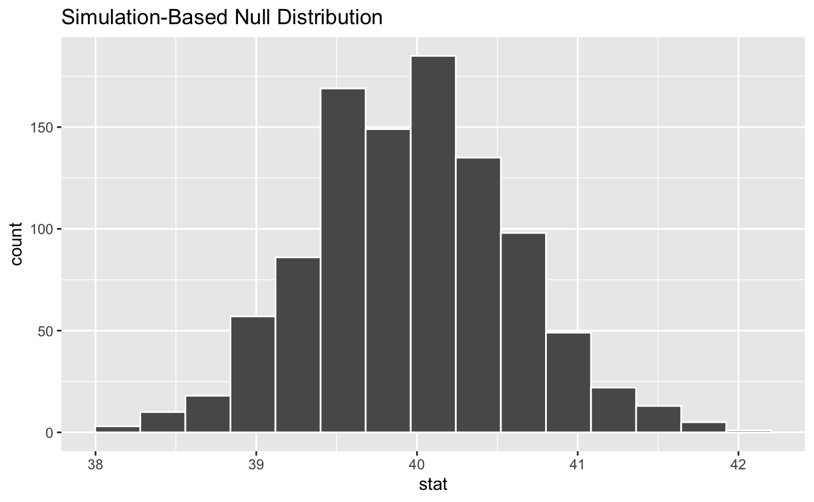
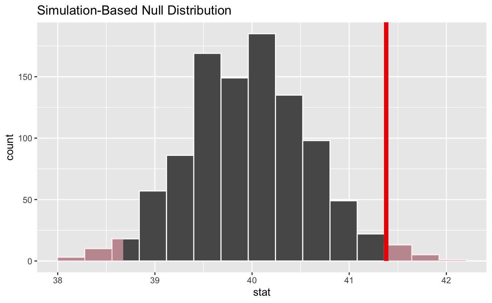

<!--
TODO:
* [x] Look over / edit the post's title in the yaml
* [x] Edit (or delete) the description; note this appears in the Twitter card
* [x] Pick category and tags (see existing with [`hugodown::tidy_show_meta()`](https://rdrr.io/pkg/hugodown/man/use_tidy_post.html))
* [x] Find photo & update yaml metadata
* [ ] Create `thumbnail-sq.jpg`; height and width should be equal
* [ ] Create `thumbnail-wd.jpg`; width should be >5x height
* [ ] [`hugodown::use_tidy_thumbnails()`](https://rdrr.io/pkg/hugodown/man/use_tidy_post.html)
* [x] Add intro sentence, e.g. the standard tagline for the package
* [x] [`usethis::use_tidy_thanks()`](https://usethis.r-lib.org/reference/use_tidy_thanks.html)
-->

We're super excited announce the release of [infer](https://infer.tidymodels.org/) 1.0.0. infer is a package for statistical inference that implements an expressive statistical grammar that coheres with the tidyverse design framework. Rather than providing methods for specific statistical tests, this package consolidates the principles that are shared among common hypothesis tests into a set of four main verbs (functions), supplemented with many utilities to visualize and extract value from their outputs.

You can install it from CRAN with:

<pre class='chroma'><code class='language-r' data-lang='r'><a href='https://rdrr.io/r/utils/install.packages.html'>install.packages</a>("infer")</code></pre>

This release includes a number of major changes and new features. However, the infer package has been on CRAN since 2017, and we haven't written about the package on the tidyverse blog before. Thus, I'll start out by demonstrating the basics of the package. After, I'll highlight some of the more neat features introduced in this version of the package. You can find a full list of changes in version 1.0.0 of the package in the [release notes](https://github.com/tidymodels/infer/releases/tag/v1.0.0).

<pre class='chroma'><code class='language-r' data-lang='r'><a href='https://rdrr.io/r/base/library.html'>library</a>(<a href='https://github.com/tidymodels/infer'>infer</a>)</code></pre>

## Getting to Know infer

Regardless of the hypothesis test in question, an analyst asks the same kind of question when conducting statistical inference: is the effect/difference in the observed data real, or due to random chance? To answer this question, the analyst begins by assuming that the effect in the observed data was simply due to random chance, and calls this assumption the *null hypothesis*. (In reality, they might not believe in the null hypothesis at all---the null hypothesis is in opposition to the *alternate hypothesis*, which supposes that the effect present in the observed data is actually due to the fact that "something is going on.") The analyst then calculates a *test statistic* from the data that describes the observed effect. They can use this test statistic to calculate a *p-value* via juxtaposition with a *null distribution*, giving the probability that the observed data could come about if the null hypothesis were true. If this probability is below some pre-defined *significance level* $\alpha$, then the analyst can reject the null hypothesis.

The workflow of this package is designed around this idea. Starting out with some dataset,

-   [`specify()`](https://infer.tidymodels.org/reference/specify.html) allows the analyst to specify the variable, or relationship between variables, that they're interested in.
-   [`hypothesize()`](https://infer.tidymodels.org/reference/hypothesize.html) allows the analyst to declare the null hypothesis.
-   [`generate()`](https://infer.tidymodels.org/reference/generate.html) allows the analyst to generate data reflecting the null hypothesis.
-   [`calculate()`](https://infer.tidymodels.org/reference/calculate.html) allows the analyst to calculate summary statistics, either from
    -   the observed data, to form the observed test statistic.
    -   data [`generate()`](https://infer.tidymodels.org/reference/generate.html)d to reflect the null hypothesis, to form the randomization-based null distribution of test statistics.

As such, the ultimate output of an infer pipeline using these four functions is generally an *observed statistic* or *null distribution* of test statistics. These four functions are thus supplemented with many utilities to visualize and extract value from their outputs.

-   [`visualize()`](https://infer.tidymodels.org/reference/visualize.html) plots the *null distribution* of test statistics
    -   [`shade_p_value()`](https://infer.tidymodels.org/reference/shade_p_value.html) situates the observed statistic in the null distribution, shading the region as or more extreme
    -   [`shade_confidence_interval()`](https://infer.tidymodels.org/reference/shade_confidence_interval.html) situates the confidence interval region in the null distribution, shading the region with the bounds
-   `get_p_value` calculates a p-value via the juxtaposition of the test statistic and null distribution
-   `get_confidence_interval` calculates a confidence interval via the juxtaposition of the test statistic and null distribution

Throughout this post, we make use of `gss`, a dataset supplied by `infer` containing a sample of 500 observations of 11 variables from the *General Social Survey*.

<pre class='chroma'><code class='language-r' data-lang='r'># load in the dataset
<a href='https://rdrr.io/r/utils/data.html'>data</a>(gss)

# take a look at its structure
<a href='https://rdrr.io/r/utils/str.html'>str</a>(gss)
#&gt; tibble [500 × 11] (S3: tbl_df/tbl/data.frame)
#&gt;  $ year   : num [1:500] 2014 1994 1998 1996 1994 ...
#&gt;  $ age    : num [1:500] 36 34 24 42 31 32 48 36 30 33 ...
#&gt;  $ sex    : Factor w/ 2 levels "male","female": 1 2 1 1 1 2 2 2 2 2 ...
#&gt;  $ college: Factor w/ 2 levels "no degree","degree": 2 1 2 1 2 1 1 2 2 1 ...
#&gt;  $ partyid: Factor w/ 5 levels "dem","ind","rep",..: 2 3 2 2 3 3 1 2 3 1 ...
#&gt;  $ hompop : num [1:500] 3 4 1 4 2 4 2 1 5 2 ...
#&gt;  $ hours  : num [1:500] 50 31 40 40 40 53 32 20 40 40 ...
#&gt;  $ income : Ord.factor w/ 12 levels "lt $1000"&lt;"$1000 to 2999"&lt;..: 12 11 12 12 12 12 12 12 12 10 ...
#&gt;  $ class  : Factor w/ 6 levels "lower class",..: 3 2 2 2 3 3 2 3 3 2 ...
#&gt;  $ finrela: Factor w/ 6 levels "far below average",..: 2 2 2 4 4 3 2 4 3 1 ...
#&gt;  $ weight : num [1:500] 0.896 1.083 0.55 1.086 1.083 ...</code></pre>

Each row is an individual survey response, containing some basic demographic information on the respondent as well as some additional variables. See [`?gss`](https://infer.tidymodels.org/reference/gss.html) for more information on the variables included and their source. Note that this data (and our examples on it) are for demonstration purposes only, and will not necessarily provide accurate estimates unless weighted properly. For these examples, let's suppose that this dataset is a representative sample of a population we want to learn about: American adults.

### specify(): Specifying Response (and Explanatory) Variables

The `specify` function can be used to specify which of the variables in the dataset you're interested in. If you're only interested in, say, the `age` of the respondents, you might write:

<pre class='chroma'><code class='language-r' data-lang='r'>gss %&gt;%
  <a href='https://infer.tidymodels.org/reference/specify.html'>specify</a>(response = age)
#&gt; Response: age (numeric)
#&gt; # A tibble: 500 x 1
#&gt;      age
#&gt;    &lt;dbl&gt;
#&gt;  1    36
#&gt;  2    34
#&gt;  3    24
#&gt;  4    42
#&gt;  5    31
#&gt;  6    32
#&gt;  7    48
#&gt;  8    36
#&gt;  9    30
#&gt; 10    33
#&gt; # … with 490 more rows</code></pre>

On the front-end, the output of `specify` just looks like it selects off the columns in the dataframe that you've specified. Checking the class of this object, though:

<pre class='chroma'><code class='language-r' data-lang='r'>gss %&gt;%
  <a href='https://infer.tidymodels.org/reference/specify.html'>specify</a>(response = age) %&gt;%
  <a href='https://rdrr.io/r/base/class.html'>class</a>()
#&gt; [1] "infer"      "tbl_df"     "tbl"        "data.frame"</code></pre>

We can see that the `infer` class has been appended on top of the dataframe classes--this new class stores some extra metadata.

If you're interested in two variables--`age` and `partyid`, for example--you can `specify` their relationship in one of two (equivalent) ways:

<pre class='chroma'><code class='language-r' data-lang='r'># as a formula
gss %&gt;%
  <a href='https://infer.tidymodels.org/reference/specify.html'>specify</a>(age ~ partyid)
#&gt; Response: age (numeric)
#&gt; Explanatory: partyid (factor)
#&gt; # A tibble: 500 x 2
#&gt;      age partyid
#&gt;    &lt;dbl&gt; &lt;fct&gt;  
#&gt;  1    36 ind    
#&gt;  2    34 rep    
#&gt;  3    24 ind    
#&gt;  4    42 ind    
#&gt;  5    31 rep    
#&gt;  6    32 rep    
#&gt;  7    48 dem    
#&gt;  8    36 ind    
#&gt;  9    30 rep    
#&gt; 10    33 dem    
#&gt; # … with 490 more rows

# with the named arguments
gss %&gt;%
  <a href='https://infer.tidymodels.org/reference/specify.html'>specify</a>(response = age, explanatory = partyid)
#&gt; Response: age (numeric)
#&gt; Explanatory: partyid (factor)
#&gt; # A tibble: 500 x 2
#&gt;      age partyid
#&gt;    &lt;dbl&gt; &lt;fct&gt;  
#&gt;  1    36 ind    
#&gt;  2    34 rep    
#&gt;  3    24 ind    
#&gt;  4    42 ind    
#&gt;  5    31 rep    
#&gt;  6    32 rep    
#&gt;  7    48 dem    
#&gt;  8    36 ind    
#&gt;  9    30 rep    
#&gt; 10    33 dem    
#&gt; # … with 490 more rows</code></pre>

If you're doing inference on one proportion or a difference in proportions, you will need to use the `success` argument to specify which level of your `response` variable is a success. For instance, if you're interested in the proportion of the population with a college degree, you might use the following code:

<pre class='chroma'><code class='language-r' data-lang='r'># specifying for inference on proportions
gss %&gt;%
  <a href='https://infer.tidymodels.org/reference/specify.html'>specify</a>(response = college, success = "degree")
#&gt; Response: college (factor)
#&gt; # A tibble: 500 x 1
#&gt;    college  
#&gt;    &lt;fct&gt;    
#&gt;  1 degree   
#&gt;  2 no degree
#&gt;  3 degree   
#&gt;  4 no degree
#&gt;  5 degree   
#&gt;  6 no degree
#&gt;  7 no degree
#&gt;  8 degree   
#&gt;  9 degree   
#&gt; 10 no degree
#&gt; # … with 490 more rows</code></pre>

### hypothesize(): Declaring the Null Hypothesis

The next step in the `infer` pipeline is often to declare a null hypothesis using [`hypothesize()`](https://infer.tidymodels.org/reference/hypothesize.html). The first step is to supply one of "independence" or "point" to the `null` argument. If your null hypothesis assumes independence between two variables, then this is all you need to supply to [`hypothesize()`](https://infer.tidymodels.org/reference/hypothesize.html):

<pre class='chroma'><code class='language-r' data-lang='r'>gss %&gt;%
  <a href='https://infer.tidymodels.org/reference/specify.html'>specify</a>(college ~ partyid, success = "degree") %&gt;%
  <a href='https://infer.tidymodels.org/reference/hypothesize.html'>hypothesize</a>(null = "independence")
#&gt; Response: college (factor)
#&gt; Explanatory: partyid (factor)
#&gt; Null Hypothesis: independence
#&gt; # A tibble: 500 x 2
#&gt;    college   partyid
#&gt;    &lt;fct&gt;     &lt;fct&gt;  
#&gt;  1 degree    ind    
#&gt;  2 no degree rep    
#&gt;  3 degree    ind    
#&gt;  4 no degree ind    
#&gt;  5 degree    rep    
#&gt;  6 no degree rep    
#&gt;  7 no degree dem    
#&gt;  8 degree    ind    
#&gt;  9 degree    rep    
#&gt; 10 no degree dem    
#&gt; # … with 490 more rows</code></pre>

If you're doing inference on a point estimate, you will also need to provide one of `p` (the true proportion of successes, between 0 and 1), `mu` (the true mean), `med` (the true median), or `sigma` (the true standard deviation). For instance, if the null hypothesis is that the mean number of hours worked per week in our population is 40, we would write:

<pre class='chroma'><code class='language-r' data-lang='r'>gss %&gt;%
  <a href='https://infer.tidymodels.org/reference/specify.html'>specify</a>(response = hours) %&gt;%
  <a href='https://infer.tidymodels.org/reference/hypothesize.html'>hypothesize</a>(null = "point", mu = 40)
#&gt; Response: hours (numeric)
#&gt; Null Hypothesis: point
#&gt; # A tibble: 500 x 1
#&gt;    hours
#&gt;    &lt;dbl&gt;
#&gt;  1    50
#&gt;  2    31
#&gt;  3    40
#&gt;  4    40
#&gt;  5    40
#&gt;  6    53
#&gt;  7    32
#&gt;  8    20
#&gt;  9    40
#&gt; 10    40
#&gt; # … with 490 more rows</code></pre>

Again, from the front-end, the dataframe outputted from [`hypothesize()`](https://infer.tidymodels.org/reference/hypothesize.html) looks almost exactly the same as it did when it came out of [`specify()`](https://infer.tidymodels.org/reference/specify.html), but `infer` now "knows" your null hypothesis.

### generate(): Generating the Null Distribution

Once we've asserted our null hypothesis using [`hypothesize()`](https://infer.tidymodels.org/reference/hypothesize.html), we can construct a null distribution based on this hypothesis. We can do this using one of several methods, supplied in the `type` argument:

-   `bootstrap`: A bootstrap sample will be drawn for each replicate, where a sample of size equal to the input sample size is drawn (with replacement) from the input sample data.  
-   `permute`: For each replicate, each input value will be randomly reassigned (without replacement) to a new output value in the sample.  
-   `simulate`: A value will be sampled from a theoretical distribution with parameters specified in [`hypothesize()`](https://infer.tidymodels.org/reference/hypothesize.html) for each replicate. (This option is currently only applicable for testing point estimates.)

Continuing on with our example above, about the average number of hours worked a week, we might write:

<pre class='chroma'><code class='language-r' data-lang='r'>gss %&gt;%
  <a href='https://infer.tidymodels.org/reference/specify.html'>specify</a>(response = hours) %&gt;%
  <a href='https://infer.tidymodels.org/reference/hypothesize.html'>hypothesize</a>(null = "point", mu = 40) %&gt;%
  <a href='https://infer.tidymodels.org/reference/generate.html'>generate</a>(reps = 1000, type = "bootstrap")
#&gt; Response: hours (numeric)
#&gt; Null Hypothesis: point
#&gt; # A tibble: 500,000 x 2
#&gt; # Groups:   replicate [1,000]
#&gt;    replicate hours
#&gt;        &lt;int&gt; &lt;dbl&gt;
#&gt;  1         1  17.6
#&gt;  2         1  18.6
#&gt;  3         1  38.6
#&gt;  4         1  38.6
#&gt;  5         1  23.6
#&gt;  6         1  38.6
#&gt;  7         1  43.6
#&gt;  8         1  41.6
#&gt;  9         1  86.6
#&gt; 10         1  43.6
#&gt; # … with 499,990 more rows</code></pre>

In the above example, we take 1000 bootstrap samples to form our null distribution.

To generate a null distribution for the independence of two variables, we could also randomly reshuffle the pairings of explanatory and response variables to break any existing association. For instance, to generate 1000 replicates that can be used to create a null distribution under the assumption that political party affiliation is not affected by age:

<pre class='chroma'><code class='language-r' data-lang='r'>gss %&gt;%
  <a href='https://infer.tidymodels.org/reference/specify.html'>specify</a>(partyid ~ age) %&gt;%
  <a href='https://infer.tidymodels.org/reference/hypothesize.html'>hypothesize</a>(null = "independence") %&gt;%
  <a href='https://infer.tidymodels.org/reference/generate.html'>generate</a>(reps = 1000, type = "permute")
#&gt; Response: partyid (factor)
#&gt; Explanatory: age (numeric)
#&gt; Null Hypothesis: independence
#&gt; # A tibble: 500,000 x 3
#&gt; # Groups:   replicate [1,000]
#&gt;    partyid   age replicate
#&gt;    &lt;fct&gt;   &lt;dbl&gt;     &lt;int&gt;
#&gt;  1 dem        36         1
#&gt;  2 rep        34         1
#&gt;  3 ind        24         1
#&gt;  4 dem        42         1
#&gt;  5 dem        31         1
#&gt;  6 ind        32         1
#&gt;  7 ind        48         1
#&gt;  8 ind        36         1
#&gt;  9 dem        30         1
#&gt; 10 ind        33         1
#&gt; # … with 499,990 more rows</code></pre>

### calculate(): Calculating Summary Statistics

Depending on whether you're carrying out computation-based inference or theory-based inference, you will either supply [`calculate()`](https://infer.tidymodels.org/reference/calculate.html) with the output of [`generate()`](https://infer.tidymodels.org/reference/generate.html) or `hypothesize`, respectively. The function, for one, takes in a `stat` argument, which is currently one of "mean", "median", "sum", "sd", "prop", "count", "diff in means", "diff in medians", "diff in props", "Chisq", "F", "t", "z", "slope", or "correlation". For example, continuing our example above to calculate the null distribution of mean hours worked per week:

<pre class='chroma'><code class='language-r' data-lang='r'>gss %&gt;%
  <a href='https://infer.tidymodels.org/reference/specify.html'>specify</a>(response = hours) %&gt;%
  <a href='https://infer.tidymodels.org/reference/hypothesize.html'>hypothesize</a>(null = "point", mu = 40) %&gt;%
  <a href='https://infer.tidymodels.org/reference/generate.html'>generate</a>(reps = 1000, type = "bootstrap") %&gt;%
  <a href='https://infer.tidymodels.org/reference/calculate.html'>calculate</a>(stat = "mean")
#&gt; # A tibble: 1,000 x 2
#&gt;    replicate  stat
#&gt;        &lt;int&gt; &lt;dbl&gt;
#&gt;  1         1  38.8
#&gt;  2         2  39.6
#&gt;  3         3  39.4
#&gt;  4         4  39.7
#&gt;  5         5  40.0
#&gt;  6         6  40.3
#&gt;  7         7  40.6
#&gt;  8         8  39.9
#&gt;  9         9  40.4
#&gt; 10        10  39.8
#&gt; # … with 990 more rows</code></pre>

The output of [`calculate()`](https://infer.tidymodels.org/reference/calculate.html) here shows us the sample statistic (in this case, the mean) for each of our 1000 replicates. If you're carrying out inference on differences in means, medians, or proportions, or t and z statistics, you will need to supply an `order` argument, giving the order in which the explanatory variables should be subtracted. For instance, to find the difference in mean age of those that have a college degree and those that don't, we might write:

<pre class='chroma'><code class='language-r' data-lang='r'>gss %&gt;%
  <a href='https://infer.tidymodels.org/reference/specify.html'>specify</a>(age ~ college) %&gt;%
  <a href='https://infer.tidymodels.org/reference/hypothesize.html'>hypothesize</a>(null = "independence") %&gt;%
  <a href='https://infer.tidymodels.org/reference/generate.html'>generate</a>(reps = 1000, type = "permute") %&gt;%
  <a href='https://infer.tidymodels.org/reference/calculate.html'>calculate</a>("diff in means", order = <a href='https://rdrr.io/r/base/c.html'>c</a>("degree", "no degree"))
#&gt; # A tibble: 1,000 x 2
#&gt;    replicate   stat
#&gt;        &lt;int&gt;  &lt;dbl&gt;
#&gt;  1         1  1.06 
#&gt;  2         2  0.377
#&gt;  3         3 -0.461
#&gt;  4         4 -1.33 
#&gt;  5         5  0.985
#&gt;  6         6 -0.690
#&gt;  7         7  0.244
#&gt;  8         8  2.35 
#&gt;  9         9 -1.02 
#&gt; 10        10  0.350
#&gt; # … with 990 more rows</code></pre>

### Other Utilities

`infer` also offers several utilities to extract the meaning out of summary statistics and null distributions---the package provides functions to visualize where a statistic is relative to a distribution (with [`visualize()`](https://infer.tidymodels.org/reference/visualize.html)), calculate p-values (with [`get_p_value()`](https://infer.tidymodels.org/reference/get_p_value.html)), and calculate confidence intervals (with [`get_confidence_interval()`](https://infer.tidymodels.org/reference/get_confidence_interval.html)).

To illustrate, we'll go back to the example of determining whether the mean number of hours worked per week is 40 hours.

<pre class='chroma'><code class='language-r' data-lang='r'># find the point estimate
point_estimate &lt;- gss %&gt;%
  <a href='https://infer.tidymodels.org/reference/specify.html'>specify</a>(response = hours) %&gt;%
  <a href='https://infer.tidymodels.org/reference/calculate.html'>calculate</a>(stat = "mean")

# generate a null distribution
null_dist &lt;- gss %&gt;%
  <a href='https://infer.tidymodels.org/reference/specify.html'>specify</a>(response = hours) %&gt;%
  <a href='https://infer.tidymodels.org/reference/hypothesize.html'>hypothesize</a>(null = "point", mu = 40) %&gt;%
  <a href='https://infer.tidymodels.org/reference/generate.html'>generate</a>(reps = 1000, type = "bootstrap") %&gt;%
  <a href='https://infer.tidymodels.org/reference/calculate.html'>calculate</a>(stat = "mean")</code></pre>

Our point estimate 41.382 seems *pretty* close to 40, but a little bit different. We might wonder if this difference is just due to random chance, or if the mean number of hours worked per week in the population really isn't 40.

We could initially just visualize the null distribution.

<pre class='chroma'><code class='language-r' data-lang='r'>null_dist %&gt;%
  <a href='https://infer.tidymodels.org/reference/visualize.html'>visualize</a>()
</code></pre>

Where does our sample's observed statistic lie on this distribution? We can use the `obs_stat` argument to specify this.

<pre class='chroma'><code class='language-r' data-lang='r'>null_dist %&gt;%
  <a href='https://infer.tidymodels.org/reference/visualize.html'>visualize</a>() +
  <a href='https://infer.tidymodels.org/reference/shade_p_value.html'>shade_p_value</a>(obs_stat = point_estimate, direction = "two-sided")
</code></pre>

Notice that `infer` has also shaded the regions of the null distribution that are as (or more) extreme than our observed statistic. (Also, note that we now use the [`+`](https://rdrr.io/r/base/Arithmetic.html) operator to apply the `shade_p_value` function. This is because `visualize` outputs a plot object from `ggplot2` instead of a data frame, and the [`+`](https://rdrr.io/r/base/Arithmetic.html) operator is needed to add the p-value layer to the plot object.) The red bar looks like it's slightly far out on the right tail of the null distribution, so observing a sample mean of 41.382 hours would be somewhat unlikely if the mean was actually 40 hours. How unlikely, though?

<pre class='chroma'><code class='language-r' data-lang='r'># get a two-tailed p-value
p_value &lt;- null_dist %&gt;%
  <a href='https://infer.tidymodels.org/reference/get_p_value.html'>get_p_value</a>(obs_stat = point_estimate, direction = "two-sided")

p_value
#&gt; # A tibble: 1 x 1
#&gt;   p_value
#&gt;     &lt;dbl&gt;
#&gt; 1   0.036</code></pre>

It looks like the p-value is 0.036, which is pretty small---if the true mean number of hours worked per week was actually 40, the probability of our sample mean being this far (1.382 hours) from 40 would be 0.036. This may or may not be statistically significantly different, depending on the significance level $\alpha$ you decided on *before* you ran this analysis. If you had set $\alpha = .05$, then this difference would be statistically significant, but if you had set $\alpha = .01$, then it would not be.

To get a confidence interval around our estimate, we can write:

<pre class='chroma'><code class='language-r' data-lang='r'># start with the null distribution
null_dist %&gt;%
  # calculate the confidence interval around the point estimate
  <a href='https://infer.tidymodels.org/reference/get_confidence_interval.html'>get_confidence_interval</a>(point_estimate = point_estimate,
                          # at the 95% confidence level
                          level = .95,
                          # using the standard error
                          type = "se")
#&gt; # A tibble: 1 x 2
#&gt;   lower_ci upper_ci
#&gt;      &lt;dbl&gt;    &lt;dbl&gt;
#&gt; 1     40.1     42.7</code></pre>

As you can see, 40 hours per week is not contained in this interval, which aligns with our previous conclusion that this finding is significant at the confidence level $\alpha = .05$.

## What's New?

### Support for multiple regression

The 2016 "Guidelines for Assessment and Instruction in Statistics Education" \[1\] state that, in introductory statistics courses, "\[s\]tudents should gain experience with how statistical models, including multivariable models, are used." In line with this recommendation, we introduce support for randomization-based inference with multiple explanatory variables via a new `fit.infer` core verb.

If passed an `infer` object, the method will parse a formula out of the `formula` or `response` and `explanatory` arguments, and pass both it and `data` to a [`stats::glm`](https://rdrr.io/r/stats/glm.html) call.

<pre class='chroma'><code class='language-r' data-lang='r'>gss %&gt;%
  <a href='https://infer.tidymodels.org/reference/specify.html'>specify</a>(hours ~ age + college) %&gt;%
  <a href='https://generics.r-lib.org/reference/fit.html'>fit</a>()
#&gt; # A tibble: 3 x 2
#&gt;   term          estimate
#&gt;   &lt;chr&gt;            &lt;dbl&gt;
#&gt; 1 intercept     40.6    
#&gt; 2 age            0.00596
#&gt; 3 collegedegree  1.53</code></pre>

Note that the function returns the model coefficients as `estimate` rather than their associated `t`-statistics as `stat`.

If passed a [`generate()`](https://infer.tidymodels.org/reference/generate.html)d object, the model will be fitted to each replicate.

<pre class='chroma'><code class='language-r' data-lang='r'>gss %&gt;%
  <a href='https://infer.tidymodels.org/reference/specify.html'>specify</a>(hours ~ age + college) %&gt;%
  <a href='https://infer.tidymodels.org/reference/hypothesize.html'>hypothesize</a>(null = "independence") %&gt;%
  <a href='https://infer.tidymodels.org/reference/generate.html'>generate</a>(reps = 100, type = "permute") %&gt;%
  <a href='https://generics.r-lib.org/reference/fit.html'>fit</a>()
#&gt; # A tibble: 300 x 3
#&gt; # Groups:   replicate [100]
#&gt;    replicate term          estimate
#&gt;        &lt;int&gt; &lt;chr&gt;            &lt;dbl&gt;
#&gt;  1         1 intercept      40.1   
#&gt;  2         1 age             0.0158
#&gt;  3         1 collegedegree   1.89  
#&gt;  4         2 intercept      38.6   
#&gt;  5         2 age             0.0615
#&gt;  6         2 collegedegree   0.890 
#&gt;  7         3 intercept      40.9   
#&gt;  8         3 age             0.0228
#&gt;  9         3 collegedegree  -1.22  
#&gt; 10         4 intercept      38.9   
#&gt; # … with 290 more rows</code></pre>

If `type = "permute"`, a set of unquoted column names in the data to permute (independently of each other) can be passed via the `cols` argument to `generate`. It defaults to only the response variable.

<pre class='chroma'><code class='language-r' data-lang='r'>gss %&gt;%
  <a href='https://infer.tidymodels.org/reference/specify.html'>specify</a>(hours ~ age + college) %&gt;%
  <a href='https://infer.tidymodels.org/reference/hypothesize.html'>hypothesize</a>(null = "independence") %&gt;%
  <a href='https://infer.tidymodels.org/reference/generate.html'>generate</a>(reps = 100, type = "permute", cols = <a href='https://rdrr.io/r/base/c.html'>c</a>(age, college)) %&gt;%
  <a href='https://generics.r-lib.org/reference/fit.html'>fit</a>()
#&gt; # A tibble: 300 x 3
#&gt; # Groups:   replicate [100]
#&gt;    replicate term          estimate
#&gt;        &lt;int&gt; &lt;chr&gt;            &lt;dbl&gt;
#&gt;  1         1 intercept     36.3    
#&gt;  2         1 age            0.118  
#&gt;  3         1 collegedegree  0.888  
#&gt;  4         2 intercept     40.9    
#&gt;  5         2 age           -0.00613
#&gt;  6         2 collegedegree  2.02   
#&gt;  7         3 intercept     38.3    
#&gt;  8         3 age            0.0751 
#&gt;  9         3 collegedegree  0.0964 
#&gt; 10         4 intercept     43.1    
#&gt; # … with 290 more rows</code></pre>

This feature allows for more detailed exploration of the effect of disrupting the correlation structure among explanatory variables on outputted model coefficients.

Each of the auxillary functions [`get_p_value()`](https://infer.tidymodels.org/reference/get_p_value.html), [`get_confidence_interval()`](https://infer.tidymodels.org/reference/get_confidence_interval.html), [`visualize()`](https://infer.tidymodels.org/reference/visualize.html), [`shade_p_value()`](https://infer.tidymodels.org/reference/shade_p_value.html), and [`shade_confidence_interval()`](https://infer.tidymodels.org/reference/shade_confidence_interval.html) have methods to handle [`fit()`](https://generics.r-lib.org/reference/fit.html) output! See their help-files for example usage.

### Behavioral consistency

Another major change to the package in this release is a set of standards for behavorial consistency of [`calculate()`](https://infer.tidymodels.org/reference/calculate.html). Namely, the package will now

-   supply a consistent error when the supplied `stat` argument isn't well-defined for the variables [`specify()`](https://infer.tidymodels.org/reference/specify.html)d

<pre class='chroma'><code class='language-r' data-lang='r'>gss %&gt;%
  <a href='https://infer.tidymodels.org/reference/specify.html'>specify</a>(response = hours) %&gt;%
  <a href='https://infer.tidymodels.org/reference/calculate.html'>calculate</a>(stat = "diff in means")
#&gt; Error: A difference in means is not well-defined for a numeric response variable (hours) and no explanatory variable.</code></pre>

or

<pre class='chroma'><code class='language-r' data-lang='r'>gss %&gt;%
  <a href='https://infer.tidymodels.org/reference/specify.html'>specify</a>(college ~ partyid, success = "degree") %&gt;%
  <a href='https://infer.tidymodels.org/reference/calculate.html'>calculate</a>(stat = "diff in props")
#&gt; Dropping unused factor levels DK from the supplied explanatory variable 'partyid'.
#&gt; Error: A difference in proportions is not well-defined for a dichotomous categorical response variable (college) and a multinomial categorical explanatory variable (partyid).</code></pre>

-   supply a consistent message when the user supplies unneeded information via [`hypothesize()`](https://infer.tidymodels.org/reference/hypothesize.html) to [`calculate()`](https://infer.tidymodels.org/reference/calculate.html) an observed statistic

<pre class='chroma'><code class='language-r' data-lang='r'># supply mu = 40 when it's not needed
gss %&gt;%
  <a href='https://infer.tidymodels.org/reference/specify.html'>specify</a>(response = hours) %&gt;%
  <a href='https://infer.tidymodels.org/reference/hypothesize.html'>hypothesize</a>(null = "point", mu = 40) %&gt;%
  <a href='https://infer.tidymodels.org/reference/calculate.html'>calculate</a>(stat = "mean")
#&gt; Message: The point null hypothesis `mu = 40` does not inform calculation of the observed statistic (a mean) and will be ignored.
#&gt; # A tibble: 1 x 1
#&gt;    stat
#&gt;   &lt;dbl&gt;
#&gt; 1  41.4</code></pre>

and

-   supply a consistent warning and assume a reasonable null value when the user does not supply sufficient information to calculate an observed statistic

<pre class='chroma'><code class='language-r' data-lang='r'># don't hypothesize `p` when it's needed
gss %&gt;%
    <a href='https://infer.tidymodels.org/reference/specify.html'>specify</a>(response = sex, success = "female") %&gt;%
    <a href='https://infer.tidymodels.org/reference/calculate.html'>calculate</a>(stat = "z")
#&gt; Warning: A z statistic requires a null hypothesis to calculate the observed statistic. 
#&gt; Output assumes the following null value: `p = .5`.
#&gt; # A tibble: 1 x 1
#&gt;    stat
#&gt;   &lt;dbl&gt;
#&gt; 1 -1.16</code></pre>

or

<pre class='chroma'><code class='language-r' data-lang='r'># don't hypothesize `p` when it's needed
gss %&gt;%
  <a href='https://infer.tidymodels.org/reference/specify.html'>specify</a>(response = partyid) %&gt;%
  <a href='https://infer.tidymodels.org/reference/calculate.html'>calculate</a>(stat = "Chisq")
#&gt; Dropping unused factor levels DK from the supplied response variable 'partyid'.
#&gt; Warning: A chi-square statistic requires a null hypothesis to calculate the observed statistic. 
#&gt; Output assumes the following null values: `p = c(dem = 0.2, ind = 0.2, rep = 0.2, other = 0.2, DK = 0.2)`.
#&gt; # A tibble: 1 x 1
#&gt;    stat
#&gt;   &lt;dbl&gt;
#&gt; 1  334.</code></pre>

This behavorial consistency also allowed for the implementation of [`observe()`](https://infer.tidymodels.org/reference/observe.html), a wrapper function around [`specify()`](https://infer.tidymodels.org/reference/specify.html), [`hypothesize()`](https://infer.tidymodels.org/reference/hypothesize.html), and [`calculate()`](https://infer.tidymodels.org/reference/calculate.html), to calculate observed statistics. The function provides a shorthand alternative to calculating observed statistics from data:

<pre class='chroma'><code class='language-r' data-lang='r'># calculating the observed mean number of hours worked per week
gss %&gt;%
  <a href='https://infer.tidymodels.org/reference/observe.html'>observe</a>(hours ~ NULL, stat = "mean")
#&gt; # A tibble: 1 x 1
#&gt;    stat
#&gt;   &lt;dbl&gt;
#&gt; 1  41.4

# equivalently, calculating the same statistic with the core verbs
gss %&gt;%
  <a href='https://infer.tidymodels.org/reference/specify.html'>specify</a>(response = hours) %&gt;%
  <a href='https://infer.tidymodels.org/reference/calculate.html'>calculate</a>(stat = "mean")
#&gt; # A tibble: 1 x 1
#&gt;    stat
#&gt;   &lt;dbl&gt;
#&gt; 1  41.4

# calculating a t statistic for hypothesized mu = 40 hours worked/week
gss %&gt;%
  <a href='https://infer.tidymodels.org/reference/observe.html'>observe</a>(hours ~ NULL, stat = "t", null = "point", mu = 40)
#&gt; # A tibble: 1 x 1
#&gt;    stat
#&gt;   &lt;dbl&gt;
#&gt; 1  2.09

# equivalently, calculating the same statistic with the core verbs
gss %&gt;%
  <a href='https://infer.tidymodels.org/reference/specify.html'>specify</a>(response = hours) %&gt;%
  <a href='https://infer.tidymodels.org/reference/hypothesize.html'>hypothesize</a>(null = "point", mu = 40) %&gt;%
  <a href='https://infer.tidymodels.org/reference/calculate.html'>calculate</a>(stat = "t")
#&gt; # A tibble: 1 x 1
#&gt;    stat
#&gt;   &lt;dbl&gt;
#&gt; 1  2.09</code></pre>

We don't anticipate that any of these changes are "breaking" in the sense that code that previously worked will continue to, though it may now message or warn in a way that it did not used to or error with a different (and hopefully more informative) message.

## Acknowledgements

This release was made possible with financial support from RStudio and the Reed College Mathematics Department. Thanks to [@aarora79](https://github.com/aarora79), [@acpguedes](https://github.com/acpguedes), [@AlbertRapp](https://github.com/AlbertRapp), [@alexpghayes](https://github.com/alexpghayes), [@aloy](https://github.com/aloy), [@AmeliaMN](https://github.com/AmeliaMN), [@andrewpbray](https://github.com/andrewpbray), [@apreshill](https://github.com/apreshill), [@atheobold](https://github.com/atheobold), [@beanumber](https://github.com/beanumber), [@bigdataman2015](https://github.com/bigdataman2015), [@bragks](https://github.com/bragks), [@brendanhcullen](https://github.com/brendanhcullen), [@CarlssonLeo](https://github.com/CarlssonLeo), [@ChalkboardSonata](https://github.com/ChalkboardSonata), [@chriscardillo](https://github.com/chriscardillo), [@clauswilke](https://github.com/clauswilke), [@congdanh8391](https://github.com/congdanh8391), [@corinne-riddell](https://github.com/corinne-riddell), [@cristianvaldez](https://github.com/cristianvaldez), [@daranzolin](https://github.com/daranzolin), [@davidbaniadam](https://github.com/davidbaniadam), [@davidhodge931](https://github.com/davidhodge931), [@doug-friedman](https://github.com/doug-friedman), [@dshelldhillon](https://github.com/dshelldhillon), [@dsolito](https://github.com/dsolito), [@echasnovski](https://github.com/echasnovski), [@EllaKaye](https://github.com/EllaKaye), [@enricochavez](https://github.com/enricochavez), [@gdbassett](https://github.com/gdbassett), [@ghost](https://github.com/ghost), [@GitHunter0](https://github.com/GitHunter0), [@hardin47](https://github.com/hardin47), [@hfrick](https://github.com/hfrick), [@higgi13425](https://github.com/higgi13425), [@instantkaffee](https://github.com/instantkaffee), [@ismayc](https://github.com/ismayc), [@jbourak](https://github.com/jbourak), [@jcvall](https://github.com/jcvall), [@jimrothstein](https://github.com/jimrothstein), [@kennethban](https://github.com/kennethban), [@m-berkes](https://github.com/m-berkes), [@mikelove](https://github.com/mikelove), [@mine-cetinkaya-rundel](https://github.com/mine-cetinkaya-rundel), [@Minhasshazu](https://github.com/Minhasshazu), [@msberends](https://github.com/msberends), [@mt-edwards](https://github.com/mt-edwards), [@muschellij2](https://github.com/muschellij2), [@nfultz](https://github.com/nfultz), [@nicholasjhorton](https://github.com/nicholasjhorton), [@PirateGrunt](https://github.com/PirateGrunt), [@PsychlytxTD](https://github.com/PsychlytxTD), [@richierocks](https://github.com/richierocks), [@romainfrancois](https://github.com/romainfrancois), [@rpruim](https://github.com/rpruim), [@rudeboybert](https://github.com/rudeboybert), [@rundel](https://github.com/rundel), [@sastoudt](https://github.com/sastoudt), [@sbibauw](https://github.com/sbibauw), [@sckott](https://github.com/sckott), [@simonpcouch](https://github.com/simonpcouch), [@THargreaves](https://github.com/THargreaves), [@topepo](https://github.com/topepo), [@torockel](https://github.com/torockel), [@ttimbers](https://github.com/ttimbers), [@vikram-rawat](https://github.com/vikram-rawat), [@vladimirvrabely](https://github.com/vladimirvrabely), and [@xiaochi-liu](https://github.com/xiaochi-liu) for their contributions to the package.

