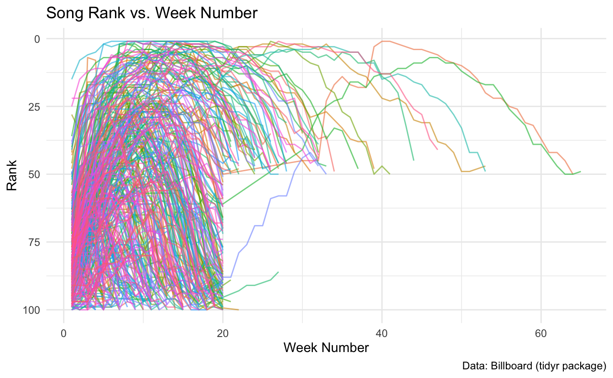
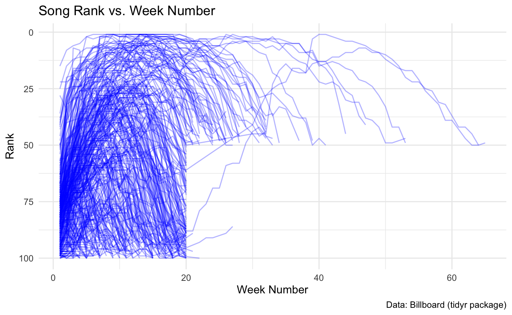

<!--
TODO:
* [ ] Look over / edit the post's title in the yaml
* [ ] Edit (or delete) the description; note this appears in the Twitter card
* [ ] Pick category and tags (see existing with [`hugodown::tidy_show_meta()`](https://rdrr.io/pkg/hugodown/man/use_tidy_post.html))
* [ ] Find photo & update yaml metadata
* [ ] Create `thumbnail-sq.jpg`; height and width should be equal
* [ ] Create `thumbnail-wd.jpg`; width should be >5x height
* [ ] [`hugodown::use_tidy_thumbnails()`](https://rdrr.io/pkg/hugodown/man/use_tidy_post.html)
* [ ] Add intro sentence, e.g. the standard tagline for the package
* [ ] [`usethis::use_tidy_thanks()`](https://usethis.r-lib.org/reference/use_tidy_thanks.html)
-->

As an educator who teaches data science with R, I have LOTS of opinions about using artificial intelligence (AI) tools when learning R. But I will keep this post the use of generative AI tools, like Chat GPT, in learning R, and specifically learning to do data science with R and the tidyverse.[^1]

I'll first walk you through three case studies that demonstrate what asking for help from a generative AI tool looks like. Then, I'll wrap up the post with some tips and good practices for getting the most out of help provided by these tools in the context of writing tidyverse code.

Before we get started, though, it's important to note that knowledge bases of Large Language Models (LLMs) that underlie popular generative AI tools are private and lack transparency. There are important societal concerns about the fairness of equitable access to these tools. It's unclear how developers or users of these models can be held accountable. Additionally, there is an environmental impact to using these tools.

## The experience

### Case study 1: Reshaping and plotting

The first case study features an example on reshaping and plotting the `billboard` data frame and it's directly out of [R for Data Science](https://r4ds.hadley.nz/). In fact, it's [worked out in the book](https://r4ds.hadley.nz/data-tidy.html#sec-billboard). Here is the initial prompt:

> Use the billboard dataset in the tidyr package to create a visualization of rank vs. week number for each song in the dataset.

And the following is what [Chat GPT](https://chatgpt.com/) by Open AI suggests as the first answer.

> The `billboard` dataset from the tidyr package contains weekly rankings of songs on the Billboard charts. Here's how you can visualize the rank vs. week number for each song in the dataset using R:

<pre class='chroma'><code class='language-r' data-lang='r'># Load required libraries
<a href='https://rdrr.io/r/base/library.html'>library</a>(<a href='https://tidyr.tidyverse.org'>tidyr</a>)
<a href='https://rdrr.io/r/base/library.html'>library</a>(<a href='https://ggplot2.tidyverse.org'>ggplot2</a>)
<a href='https://rdrr.io/r/base/library.html'>library</a>(<a href='https://dplyr.tidyverse.org'>dplyr</a>)

# Load the billboard dataset
<a href='https://rdrr.io/r/utils/data.html'>data</a>("billboard")

# Prepare the data for visualization
billboard_long &lt;- billboard |&gt;
  <a href='https://tidyr.tidyverse.org/reference/pivot_longer.html'>pivot_longer</a>(
    cols = <a href='https://tidyselect.r-lib.org/reference/starts_with.html'>starts_with</a>("wk"),
    names_to = "week",
    values_to = "rank",
    names_prefix = "wk",
    values_drop_na = TRUE
  )

# Convert week to a numeric value
billboard_long$week &lt;- <a href='https://rdrr.io/r/base/numeric.html'>as.numeric</a>(billboard_long$week)

# Create the visualization
<a href='https://ggplot2.tidyverse.org/reference/ggplot.html'>ggplot</a>(billboard_long, <a href='https://ggplot2.tidyverse.org/reference/aes.html'>aes</a>(x = week, y = rank, group = track, color = track)) +
  <a href='https://ggplot2.tidyverse.org/reference/geom_path.html'>geom_line</a>(show.legend = FALSE, alpha = 0.6) +
  <a href='https://ggplot2.tidyverse.org/reference/scale_continuous.html'>scale_y_reverse</a>() +  # Reverse the y-axis since rank 1 is the top position
  <a href='https://ggplot2.tidyverse.org/reference/labs.html'>labs</a>(
    title = "Song Rank vs. Week Number",
    x = "Week Number",
    y = "Rank",
    caption = "Data: Billboard (tidyr package)"
  ) +
  <a href='https://ggplot2.tidyverse.org/reference/ggtheme.html'>theme_minimal</a>()
</code></pre>

Chat GPT also provides a neat explanation of the code:

> **Explanation**
>
> 1.  Pivoting the Data: The `billboard` dataset is in wide format, with week columns (`wk1`, `wk2`, etc.). We use [`pivot_longer()`](https://tidyr.tidyverse.org/reference/pivot_longer.html) to reshape it into a long format with week and rank columns.
> 2.  Rank vs. Week Plot: Each song's weekly rankings are connected with lines ([`geom_line()`](https://ggplot2.tidyverse.org/reference/geom_path.html)), and we reverse the y-axis since rank 1 is the best.
> 3.  Grouping by Track: The group aesthetic ensures lines are drawn separately for each song.
>
> **Output**
>
> This will create a line plot where each line represents a song's rank progression over weeks. The y-axis is reversed to reflect higher rankings at the top.

There are a few things about this answer that are promising:

-   The response is a tidyverse approach.
-   It uses [`pivot_longer()`](https://tidyr.tidyverse.org/reference/pivot_longer.html) as opposed to the superseded alternative [`gather()`](https://tidyr.tidyverse.org/reference/gather.html).
-   The plot features a reversed y-axis, [just like in the book](https://r4ds.hadley.nz/data-tidy.html#fig-billboard-ranks)

However, the resulting plot doesn't show exactly what the prompt asked for -- the lines are colored by `track`, which produces a busy plot that is difficult to interpret. While this is not ideal, it's something a new learner can easily spot and ask Chat GPT for a follow up correcting it. For example, a subsequent prompt like the following fixes this issue:

> Can you redraw the plot without coloring each line by track?

You can see this in action at <https://chatgpt.com/share/678f1dee-4af0-8000-befe-6df0a8d70fba>, in the second prompt. Here is the updated code suggested by Chat GPT:

<pre class='chroma'><code class='language-r' data-lang='r'># Create the visualization without coloring by track
<a href='https://ggplot2.tidyverse.org/reference/ggplot.html'>ggplot</a>(billboard_long, <a href='https://ggplot2.tidyverse.org/reference/aes.html'>aes</a>(x = week, y = rank, group = track)) +
  <a href='https://ggplot2.tidyverse.org/reference/geom_path.html'>geom_line</a>(alpha = 0.3, color = "blue") +
  <a href='https://ggplot2.tidyverse.org/reference/scale_continuous.html'>scale_y_reverse</a>() +  # Reverse the y-axis since rank 1 is the top position
  <a href='https://ggplot2.tidyverse.org/reference/labs.html'>labs</a>(
    title = "Song Rank vs. Week Number",
    x = "Week Number",
    y = "Rank",
    caption = "Data: Billboard (tidyr package)"
  ) +
  <a href='https://ggplot2.tidyverse.org/reference/ggtheme.html'>theme_minimal</a>()
</code></pre>

Note, however, that the only change wasn't omitting the `color = track` aesthetic mapping. The `alpha` level is also changed (from 0.6 to 0.3) without a justification for that change and the lines are colored `"blue"`. None of these are *bad* or *wrong* choices, but they can be confusing for new learners. Similarly, using [`theme_minimal()`](https://ggplot2.tidyverse.org/reference/ggtheme.html) is not a bad or wrong choice either[^2], but it's not *necessary*, but this might not be obvious to a new learner.

Furthermore, while Chat GPT "solves" the problem, a thorough code review reveals a number of not-so-great things about the answer that can be confusing for new learners or promote poor coding practices:

-   The code loads packages that are not necessary: tidyr and ggplot2 packages are sufficient for this code, we don't also need dplyr. Additionally, learners coming from R for Data Science likely expect [`library(tidyverse)`](https://tidyverse.tidyverse.org) in analysis code, instead of loading the packages individualy.
-   There is no need to load the `billboard` dataset, it's available to use once the tidyr package is loaded. Additionally, quotes are not needed, `data(billboard)` also works.
-   The code mixes up tidyverse and base R styles:
    -   Changing the type of `week` to numeric can be done in a [`mutate()`](https://dplyr.tidyverse.org/reference/mutate.html) statement with the tidyverse, which would then warrant loading the dplyr package.
    -   This can also be done within [`pivot_longer()`](https://tidyr.tidyverse.org/reference/pivot_longer.html) with the `names_transform` argument.

All of these are addressable with further prompts, as I've done at <https://chatgpt.com/share/678f1dee-4af0-8000-befe-6df0a8d70fba>, in the last two prompts. But doing so requires being able to identify these issues and explicitly asking for corrections. In practice, I wouldn't have asked Chat GPT to correct everything for me, I would have stopped after the first suggestion, which was a pretty good starting point, and made the improvements myself. However, a new learner might assume (and based on my experience seeing lots of near learner code, *does* assume) the first answer is the *right* and *good* or *best* answer since (1) it looks reasonable and (2) it works, sort of.

Furthermore, requesting improvements in subsequent calls can result in surprising changes that the user hasn't asked for. We saw an example of this above, in updating the alpha level. Similarly, in <https://chatgpt.com/share/678f1dee-4af0-8000-befe-6df0a8d70fba> you can see that asking Chat GPT to not load the packages individually but to use [`library(tidyverse)`](https://tidyverse.tidyverse.org) instead results in this change as well as not loading the data with a [`data()`](https://rdrr.io/r/utils/data.html) call and adding a data transformation step with [`mutate()`](https://dplyr.tidyverse.org/reference/mutate.html) to convert `week` to numeric:

<pre class='chroma'><code class='language-r' data-lang='r'># Load the tidyverse package
<a href='https://rdrr.io/r/base/library.html'>library</a>(<a href='https://tidyverse.tidyverse.org'>tidyverse</a>)

# Load the billboard dataset and prepare the data
billboard_long &lt;- billboard |&gt;
  <a href='https://tidyr.tidyverse.org/reference/pivot_longer.html'>pivot_longer</a>(
    cols = <a href='https://tidyselect.r-lib.org/reference/starts_with.html'>starts_with</a>("wk"),
    names_to = "week",
    values_to = "rank",
    names_prefix = "wk",
    values_drop_na = TRUE
  ) |&gt;
  <a href='https://dplyr.tidyverse.org/reference/mutate.html'>mutate</a>(week = <a href='https://rdrr.io/r/base/numeric.html'>as.numeric</a>(week))  # Convert week to numeric</code></pre>

Both of these are welcome changes, but it can be surprising to a new learner why they're combined with updating the [`library()`](https://rdrr.io/r/base/library.html) call. This is happening because with each call Chat GPT is "trying again" -- it's not just editing the previous answer but it's regenerating an answer with additional context.

### Case study 2: Data cleaning

The next example is a lot more vague as it's a task that, if someone asked me for help, I would reply with "Can you share the data with me?", but Chat GPT happily generates an answer. That's probably one of the reasons why people love these tools, they never respond to a question with another question, at least not in my experience.

Below is the prompt for this case study. I'll provide it with no background first so you can read it as the AI tool would "read" it without any background.

> Another variable that needs some cleaning up is `membership_status`. Currently it should either be `NA` or contain some text that says "Select ... to register for this group". Recode this variable to say `"Closed"` if the current value is `NA` or `"Open"` otherwise. Save the resulting dataset with this new variables as `clubs`, i.e., overwrite the original data frame. Then, display the first 10 rows of the dataset, moving `membership_status` to the beginning of the dataset to make sure it appears in the output in your rendered document.

This time, let's try [Claude](https://claude.ai/) by Anthropic. Below is the first response:

> I'll help you clean up the membership_status variable. Let's break this down into steps:

<pre class='chroma'><code class='language-r' data-lang='r'># Recode membership_status to "Closed" if NA, "Open" otherwise
clubs$membership_status &lt;- <a href='https://rdrr.io/r/base/ifelse.html'>ifelse</a>(<a href='https://rdrr.io/r/base/NA.html'>is.na</a>(clubs$membership_status), "Closed", "Open")

# Reorder columns to put membership_status first
clubs &lt;- clubs[, <a href='https://rdrr.io/r/base/c.html'>c</a>("membership_status", <a href='https://generics.r-lib.org/reference/setops.html'>setdiff</a>(<a href='https://rdrr.io/r/base/names.html'>names</a>(clubs), "membership_status"))]

# Display first 10 rows
<a href='https://rdrr.io/r/utils/head.html'>head</a>(clubs, 10)</code></pre>

> This code will:
>
> -   Use [`ifelse()`](https://rdrr.io/r/base/ifelse.html) to recode the variable based on whether it's NA
> -   Reorder the columns to put membership_status first
> -   Show the first 10 rows of the modified dataset
>
> Would you like me to explain any part of this solution in more detail?

I like the offer to explain more at the end! However, the suggested code does not use the tidyverse. In fact, it's perhaps surprising that it uses R, this could very well have been a task for Python or anoher language commonly used for data science problems.

Let's try again:

> Can you suggest an answer that uses the tidyverse instead of base R?

And here is the result:

> Here's how to accomplish the same tasks using tidyverse functions:

<pre class='chroma'><code class='language-r' data-lang='r'>clubs &lt;- clubs <a href='https://magrittr.tidyverse.org/reference/pipe.html'>%&gt;%</a>
  <a href='https://dplyr.tidyverse.org/reference/mutate.html'>mutate</a>(membership_status = <a href='https://dplyr.tidyverse.org/reference/if_else.html'>if_else</a>(<a href='https://rdrr.io/r/base/NA.html'>is.na</a>(membership_status), 
                                   "Closed", 
                                   "Open")) <a href='https://magrittr.tidyverse.org/reference/pipe.html'>%&gt;%</a>
  <a href='https://dplyr.tidyverse.org/reference/relocate.html'>relocate</a>(membership_status)

clubs <a href='https://magrittr.tidyverse.org/reference/pipe.html'>%&gt;%</a> 
  <a href='https://rdrr.io/r/utils/head.html'>head</a>(10)</code></pre>

> This tidyverse solution:
>
> -   Uses mutate() with [`if_else()`](https://dplyr.tidyverse.org/reference/if_else.html) to recode the variable
> -   Uses relocate() to move membership_status to the front
> -   Shows the first 10 rows using head()
>
> The tidyverse version is more readable and follows the principle of chaining operations with the pipe operator (`%>%`). [`if_else()`](https://dplyr.tidyverse.org/reference/if_else.html) is the tidyverse equivalent of base R's [`ifelse()`](https://rdrr.io/r/base/ifelse.html), with stricter type checking.
>
> Would you like me to explain any of these functions in more detail?

We're getting there! For new learners of the tidyverse, there are still a few aspects of this code that might be misleading:

-   It doesn't use the base pipe operator (`|>`), which is the pipe operator used in R for Data Science.
-   Line breaks and indentation does not follow [tidyverse style guidelines](https://style.tidyverse.org/pipes.html#long-lines), which suggest that if the arguments to a function don't all fit on one line, each argument should go on its own line.
-   If `clubs` is a tibble, printing it will only display the first 10 rows anyway, so there's no need for the [`head()`](https://rdrr.io/r/utils/head.html) call.

Once again, it's possible to ask the tool to make these updates. Claude doesn't provide a sharing link for the conversation, but I've saved it at <https://gist.github.com/mine-cetinkaya-rundel/c74dc7c5f2a27a846574edd063988431>. Even with vague prompts like "If clubs is a tibble, it'll only print out the first 10 rows anyway," it does exactly what we would want it to do, resulting in the following:

<pre class='chroma'><code class='language-r' data-lang='r'>clubs &lt;- clubs |&gt;
  <a href='https://dplyr.tidyverse.org/reference/mutate.html'>mutate</a>(membership_status = <a href='https://dplyr.tidyverse.org/reference/if_else.html'>if_else</a>(<a href='https://rdrr.io/r/base/NA.html'>is.na</a>(membership_status), "Closed", "Open")) |&gt;
  <a href='https://dplyr.tidyverse.org/reference/relocate.html'>relocate</a>(membership_status)

clubs</code></pre>

The operative word here being "want". Once again, someone with enough experience with R and the tidyverse would not explicitly ask for these improvements; they would just make them themselves and carry on. But someone who is just learning the tidyverse would likely stop much earlier. In my experience, many new learners stop after the very first prompt, which looks unfamiliar, and hence potentially intimidating. For learners of the tidyverse, the simple "Can you do this with the tidyverse?" can be a very useful prompt improvement that gets them majority of the way there.

### Case study 3: Web scraping

For the third and last example we'll try scraping some data from the web, specifically some [structured North Carolina weather data](https://www.usclimatedata.com/climate/durham/north-carolina/united-states/usnc0192). For this example, I've used [perplexity.ai](https://www.perplexity.ai/).

My first prompt was:

> Write code for scraping data from <https://www.usclimatedata.com/climate/durham/north-carolina/united-states/usnc0192>.

This resulted in an answer using Python, BeautifulSoup, and pandas. So I followed up with:

> Use R instead.

This resulted in the following.

<pre class='chroma'><code class='language-r' data-lang='r'># Load required libraries
<a href='https://rdrr.io/r/base/library.html'>library</a>(<a href='https://rvest.tidyverse.org/'>rvest</a>)
#&gt; 
#&gt; Attaching package: 'rvest'
#&gt; The following object is masked from 'package:readr':
#&gt; 
#&gt;     guess_encoding
<a href='https://rdrr.io/r/base/library.html'>library</a>(<a href='https://dplyr.tidyverse.org'>dplyr</a>)

# Define the URL for Durham, North Carolina climate data
url &lt;- "https://www.usclimatedata.com/climate/durham/north-carolina/united-states/usnc0192"

# Read the HTML content from the website
webpage &lt;- <a href='http://xml2.r-lib.org/reference/read_xml.html'>read_html</a>(url)

# Extract the table containing climate data
climate_table &lt;- webpage <a href='https://magrittr.tidyverse.org/reference/pipe.html'>%&gt;%</a>
  <a href='https://rvest.tidyverse.org/reference/rename.html'>html_nodes</a>("table") <a href='https://magrittr.tidyverse.org/reference/pipe.html'>%&gt;%</a>
  .[[1]] <a href='https://magrittr.tidyverse.org/reference/pipe.html'>%&gt;%</a> # Assuming the first table contains the relevant data
  <a href='https://rvest.tidyverse.org/reference/html_table.html'>html_table</a>(fill = TRUE)

# Convert the table to a data frame
climate_data &lt;- <a href='https://rdrr.io/r/base/as.data.frame.html'>as.data.frame</a>(climate_table)

# Display the scraped data
<a href='https://rdrr.io/r/base/print.html'>print</a>(climate_data)
#&gt;                                              JanJa FebFe MarMa AprAp MayMa
#&gt; 1             Average high in ºF Av. high Hi 49.00  53.0 62.00 71.00 79.00
#&gt; 2               Average low in ºF Av. low Lo 28.00  29.0 37.00 46.00 56.00
#&gt; 3 Av. precipitation in inch Av. precip. Pre.  4.45   3.7  4.69  3.43  4.61
#&gt;   JunJu
#&gt; 1 85.00
#&gt; 2 65.00
#&gt; 3  4.02
</code></pre>

Additionally, the suggestion included optional code for writing the data to CSV even though it wasn't part of the prompt, though also not bad practice either when scraping data from the web.

<pre class='chroma'><code class='language-r' data-lang='r'># Optional: Save the data to a CSV file
<a href='https://rdrr.io/r/utils/write.table.html'>write.csv</a>(climate_data, "durham_climate_data.csv", row.names = FALSE)</code></pre>

First, this code doesn't give us what we want:

<pre class='chroma'><code class='language-r' data-lang='r'>climate_data
#&gt;                                              JanJa FebFe MarMa AprAp MayMa
#&gt; 1             Average high in ºF Av. high Hi 49.00  53.0 62.00 71.00 79.00
#&gt; 2               Average low in ºF Av. low Lo 28.00  29.0 37.00 46.00 56.00
#&gt; 3 Av. precipitation in inch Av. precip. Pre.  4.45   3.7  4.69  3.43  4.61
#&gt;   JunJu
#&gt; 1 85.00
#&gt; 2 65.00
#&gt; 3  4.02
</code></pre>

We only have the first six months (the first table) and the formatting is not great, especially for the column names. Additionally, this doesn't look like a tidy data frame -- a better organization would be months in rows and temperatures in columns. Let's follow up with a better articulated prompt:

> Update the code to scrape data for all months from both of the tables on the website and organizing the data with months as rows and temperature types as columns.

Here is the updated suggestion:

<pre class='chroma'><code class='language-r' data-lang='r'><a href='https://rdrr.io/r/base/library.html'>library</a>(<a href='https://rvest.tidyverse.org/'>rvest</a>)
<a href='https://rdrr.io/r/base/library.html'>library</a>(<a href='https://dplyr.tidyverse.org'>dplyr</a>)
<a href='https://rdrr.io/r/base/library.html'>library</a>(<a href='https://tidyr.tidyverse.org'>tidyr</a>)

url &lt;- "https://www.usclimatedata.com/climate/durham/north-carolina/united-states/usnc0192"

# Read HTML content
webpage &lt;- <a href='http://xml2.r-lib.org/reference/read_xml.html'>read_html</a>(url)

# Extract all tables
climate_tables &lt;- webpage <a href='https://magrittr.tidyverse.org/reference/pipe.html'>%&gt;%</a>
  <a href='https://rvest.tidyverse.org/reference/rename.html'>html_nodes</a>("table") <a href='https://magrittr.tidyverse.org/reference/pipe.html'>%&gt;%</a>
  <a href='https://rvest.tidyverse.org/reference/html_table.html'>html_table</a>(header = TRUE, fill = TRUE)

# Check if we have at least 2 tables
if(<a href='https://rdrr.io/r/base/length.html'>length</a>(climate_tables) &gt;= 2) &#123;
  # Process first table (Average High Temperatures)
  high_temp &lt;- climate_tables[[1]] <a href='https://magrittr.tidyverse.org/reference/pipe.html'>%&gt;%</a>
    <a href='https://dplyr.tidyverse.org/reference/select.html'>select</a>(Month = 1, High = 2) <a href='https://magrittr.tidyverse.org/reference/pipe.html'>%&gt;%</a>
    <a href='https://dplyr.tidyverse.org/reference/mutate.html'>mutate</a>(High = <a href='https://rdrr.io/r/base/numeric.html'>as.numeric</a>(<a href='https://rdrr.io/r/base/grep.html'>gsub</a>("[^0-9.]", "", High)))
  
  # Process second table (Average Low Temperatures)
  low_temp &lt;- climate_tables[[2]] <a href='https://magrittr.tidyverse.org/reference/pipe.html'>%&gt;%</a>
    <a href='https://dplyr.tidyverse.org/reference/select.html'>select</a>(Month = 1, Low = 2) <a href='https://magrittr.tidyverse.org/reference/pipe.html'>%&gt;%</a> 
    <a href='https://dplyr.tidyverse.org/reference/mutate.html'>mutate</a>(Low = <a href='https://rdrr.io/r/base/numeric.html'>as.numeric</a>(<a href='https://rdrr.io/r/base/grep.html'>gsub</a>("[^0-9.]", "", Low)))
  
  # Combine and organize data
  combined_data &lt;- high_temp <a href='https://magrittr.tidyverse.org/reference/pipe.html'>%&gt;%</a>
    <a href='https://dplyr.tidyverse.org/reference/mutate-joins.html'>full_join</a>(low_temp, by = "Month") <a href='https://magrittr.tidyverse.org/reference/pipe.html'>%&gt;%</a>
    <a href='https://dplyr.tidyverse.org/reference/arrange.html'>arrange</a>(<a href='https://rdrr.io/r/base/factor.html'>factor</a>(Month, levels = month.name))
  
  # Display cleaned data
  <a href='https://rdrr.io/r/base/print.html'>print</a>(combined_data)
  
  # Save to CSV
  <a href='https://rdrr.io/r/utils/write.table.html'>write.csv</a>(combined_data, "durham_temperatures.csv", row.names = FALSE)
&#125; else &#123;
  <a href='https://rdrr.io/r/base/stop.html'>stop</a>("Required tables not found - website structure may have changed")
&#125;
#&gt; # A tibble: 3 × 3
#&gt;   Month                                       High   Low
#&gt;   &lt;chr&gt;                                      &lt;dbl&gt; &lt;dbl&gt;
#&gt; 1 Average high in ºF Av. high Hi             49    89   
#&gt; 2 Average low in ºF Av. low Lo               28    70   
#&gt; 3 Av. precipitation in inch Av. precip. Pre.  4.45  3.94
</code></pre>

<pre class='chroma'><code class='language-r' data-lang='r'>#&gt; [1] TRUE
</code></pre>

There is a lot going on here, especially for a new learner, and the result is ultimately not what we want:

<pre class='chroma'><code class='language-r' data-lang='r'>combined_data
#&gt; # A tibble: 3 × 3
#&gt;   Month                                       High   Low
#&gt;   &lt;chr&gt;                                      &lt;dbl&gt; &lt;dbl&gt;
#&gt; 1 Average high in ºF Av. high Hi             49    89   
#&gt; 2 Average low in ºF Av. low Lo               28    70   
#&gt; 3 Av. precipitation in inch Av. precip. Pre.  4.45  3.94
</code></pre>

Let's try one more time, following up with this prompt:

> This is not what I wanted. First scrape the data from the two tables for months January to June and July to December. Then put them together. Then reshape the data to have months as rows and temperature types as columns.

<pre class='chroma'><code class='language-r' data-lang='r'><a href='https://rdrr.io/r/base/library.html'>library</a>(<a href='https://rvest.tidyverse.org/'>rvest</a>)
<a href='https://rdrr.io/r/base/library.html'>library</a>(<a href='https://dplyr.tidyverse.org'>dplyr</a>)
<a href='https://rdrr.io/r/base/library.html'>library</a>(<a href='https://tidyr.tidyverse.org'>tidyr</a>)

url &lt;- "https://www.usclimatedata.com/climate/durham/north-carolina/united-states/usnc0192"
webpage &lt;- <a href='http://xml2.r-lib.org/reference/read_xml.html'>read_html</a>(url)

# Extract all climate tables (4 tables total)
all_tables &lt;- webpage <a href='https://magrittr.tidyverse.org/reference/pipe.html'>%&gt;%</a> 
  <a href='https://rvest.tidyverse.org/reference/rename.html'>html_nodes</a>("table.climate-table") <a href='https://magrittr.tidyverse.org/reference/pipe.html'>%&gt;%</a> 
  <a href='https://rvest.tidyverse.org/reference/html_table.html'>html_table</a>(header = TRUE)

# Process temperature data from first two tables (Jan-Jun and Jul-Dec)
high_temp &lt;- <a href='https://dplyr.tidyverse.org/reference/bind_rows.html'>bind_rows</a>(
  all_tables[[1]] <a href='https://magrittr.tidyverse.org/reference/pipe.html'>%&gt;%</a> <a href='https://dplyr.tidyverse.org/reference/select.html'>select</a>(Month = 1, High = 2),
  all_tables[[2]] <a href='https://magrittr.tidyverse.org/reference/pipe.html'>%&gt;%</a> <a href='https://dplyr.tidyverse.org/reference/select.html'>select</a>(Month = 1, High = 2)
) <a href='https://magrittr.tidyverse.org/reference/pipe.html'>%&gt;%</a> <a href='https://dplyr.tidyverse.org/reference/mutate.html'>mutate</a>(High = <a href='https://rdrr.io/r/base/numeric.html'>as.numeric</a>(<a href='https://rdrr.io/r/base/grep.html'>gsub</a>("°F", "", High)))
#&gt; Error in all_tables[[1]]: subscript out of bounds

low_temp &lt;- <a href='https://dplyr.tidyverse.org/reference/bind_rows.html'>bind_rows</a>(
  all_tables[[3]] <a href='https://magrittr.tidyverse.org/reference/pipe.html'>%&gt;%</a> <a href='https://dplyr.tidyverse.org/reference/select.html'>select</a>(Month = 1, Low = 2),
  all_tables[[4]] <a href='https://magrittr.tidyverse.org/reference/pipe.html'>%&gt;%</a> <a href='https://dplyr.tidyverse.org/reference/select.html'>select</a>(Month = 1, Low = 2)
) <a href='https://magrittr.tidyverse.org/reference/pipe.html'>%&gt;%</a> <a href='https://dplyr.tidyverse.org/reference/mutate.html'>mutate</a>(Low = <a href='https://rdrr.io/r/base/numeric.html'>as.numeric</a>(<a href='https://rdrr.io/r/base/grep.html'>gsub</a>("°F", "", Low)))
#&gt; Error in all_tables[[3]]: subscript out of bounds

# Combine and format final dataset
climate_data &lt;- high_temp <a href='https://magrittr.tidyverse.org/reference/pipe.html'>%&gt;%</a> 
  <a href='https://dplyr.tidyverse.org/reference/mutate-joins.html'>left_join</a>(low_temp, by = "Month") <a href='https://magrittr.tidyverse.org/reference/pipe.html'>%&gt;%</a> 
  <a href='https://dplyr.tidyverse.org/reference/mutate.html'>mutate</a>(Month = <a href='https://rdrr.io/r/base/factor.html'>factor</a>(Month, levels = month.name)) <a href='https://magrittr.tidyverse.org/reference/pipe.html'>%&gt;%</a> 
  <a href='https://dplyr.tidyverse.org/reference/arrange.html'>arrange</a>(Month) <a href='https://magrittr.tidyverse.org/reference/pipe.html'>%&gt;%</a> 
  <a href='https://dplyr.tidyverse.org/reference/select.html'>select</a>(Month, High, Low)

# Display formatted results
<a href='https://rdrr.io/r/base/print.html'>print</a>(climate_data)
#&gt; # A tibble: 3 × 3
#&gt;   Month  High   Low
#&gt;   &lt;fct&gt; &lt;dbl&gt; &lt;dbl&gt;
#&gt; 1 NA    49    89   
#&gt; 2 NA    28    70   
#&gt; 3 NA     4.45  3.94
</code></pre>

Unfortunately this gives an error. However, the presentation in the answer from Perplexity makes it seem like the data were scraped successfully since a table with rows as months and columns as temperature types is included in the explanation:

           Month High Low
    1    January   50  30
    2   February   54  32
    3      March   63  39
    4      April   72  47
    5        May   79  56
    6       June   85  64
    7       July   89  69
    8     August   87  68
    9  September   81  60
    10   October   72  49
    11  November   63  39
    12  December   54  32

I'm not sure how these data were extracted, but we know it's not with the R code provided above. The values are also not correct (e.g., high and low in January should be 49 and 28, instead), so it's completely unclear where they're coming from. You can follow along with this thread at <https://www.perplexity.ai/search/write-code-for-scraping-data-f-6kRnwLDTTpe8vItl08Bo3g>. I tried a few more prompts and finally gave up. While the other two tasks were much more straightforward, the web scraping task seems to be more difficult for this tool. I should note that I used different services for each task, and the lack of success in this last one might be due to that as well.

Ultimately, though, as the complexity of the task increases, it (understandably) gets more difficult to get to straightforward and new-learner-friendly answers with simple prompts.

## Tips and good practices

I'll wrap up this post with some tips and good practices for using AI tools for (tidyverse) code generation. But first, a disclaimer -- this landscape is changing super quickly. Today's good practices might not be the best approaches for tomorrow. However, the following have held true over the last year so there's a good chance they will remain relevant for some time into the future.

1.  **Provide context and engineer prompts:** This might be obvious, but it should be stated. Providing context, even something as simple as "use R" or "use tidyverse" can go a long way in getting a semi-successful first suggestion. Then, continue engineering the prompt until you achieve the results you need, being more articulate about what you want at each step. This is easier said than done, though, for new learners. If you don't know what the right answer should look like, it's much harder to be articulate in your prompt to get to that answer. On the other hand, if you do know what the right answer should look like, you might be more likely to just write the code yourself, instead of coaching the AI tool to get there.

2.  **Check for errors:** This also seems obvious -- you should run the code the tool suggests and check for errors. If the code gives an error, this is easy to catch and potentially easy to address. However, sometimes the code suggests arguments that don't exist that R might silently ignore. These might be unneeded arguments or a needed argument but not used properly due to how it's called or the value it's set to. Such errors are more difficult to identify, particularly in functions you might not be familiar with.

3.  **Run the code it gives you, line-by-line, even if the code is in a pipeline:** Tidyverse data transformation pipelines and ggplot layers are easy to run at once, with the code doing many things with one execution prompt, compared to Base R code where you execute each line of code separately. The scaffolded nature of these pipelines are very nice for keeping all steps associated with a task together and not generating unnecessary interim objects along the way. However, it requires self-discipline to inspect the code line-by-line as opposed to just inspecting the final output. For example, I regularly encounter unnecessary `group()`/[`ungroup()`](https://dplyr.tidyverse.org/reference/group_by.html)s or [`select()`](https://dplyr.tidyverse.org/reference/select.html)s steps get injected into pipelines. Identifying these requires running the pipeline code line-by-line, and then you can remove or modify them to simplify your answer. My recommendation would be to approach the working with AI tools for code generation with an "I'm trying to learn how to do this" attitude. It's then natural to investigate and interact with each step of the answer. If you approach it with a "Solve this for me" attitude, it's a lot harder to be critical of seemingly functioning and seemingly good enough code.

4.  **Improve code smell:** While I don't have empirical evidence for this, I believe for humans, taste for good code develops faster than ability. For LLMs, this is the opposite. These tools will happily barf out code that runs without regard to cohesive syntax, avoiding redundancies, etc. Therefore, it's essential to "clean up" the suggested code to improve its "code smell". Below are some steps I regularly use:

    -   Remove redundant library calls.
    -   Use `pkg::function()` syntax only as needed and consistently.
    -   Avoid mixing and matching base R and tidyverse syntax (e.g., in one step finding mean in a [`summarize()`](https://dplyr.tidyverse.org/reference/summarise.html) call and in another step as mean of a vector, `mean(df$var)`.
    -   Remove unnecessary [`print()`](https://rdrr.io/r/base/print.html) statements.[^3]

5.  **Stuck? Start a new chat:** Each new prompt in a chat/thread is evaluated within the context of previous prompts in that thread. If you're stuck and not getting to a good answer after modifying your prompt a few times, start fresh with a new chat/thread instead.

6.  **Use code completion tools sparingly if you're a new user:** Code completion tools, like [GitHub Copilot](https://github.com/features/copilot), can be huge productivity boosters. But, especially for new learners, they can also be huge distractions as they tend to take action before the user is able to complete a thought in their head. My recommendation for new learners would be to avoid these tools altogether until they get a little faster at going from idea to code by themselves, or at a minimum until they feel like they can consistently write high quality prompts that generate the desired code on the first try. And my recommendation for anyone using code completion tools is to experiment with wait time between prompt and code generation and set a time that works for well for themselves. In my experience, the default wait time can be too short, resulting in code being generated before I can finish writing my prompt or reviewing the prompt I write.[^4]

7.  **Use AI tools for help with getting help:** So far the focus of this post has been on generating code to accomplish certain data science tasks. Perhaps the most important, and most difficult, data science task is asking good questions when you're stuck troubleshooting. And it usually requires or is greatly helped by creating a minimum reproducible example and using tools like [reprex](https://reprex.tidyverse.org/). This often starts with creating a small dataset with certain features, and AI tools can be pretty useful for generating such toy examples.

[^1]: And maybe a future post on teaching R in the age of AI!

[^2]: In fact, it's my preferred ggplot2 theme!

[^3]: I've never seen as many [`print()`](https://rdrr.io/r/base/print.html) statements in R code as I have over the last year of reading code from hundreds of students who use AI tools to generate code for their assignments with varying levels of success! I don't know why these tools love [`print()`](https://rdrr.io/r/base/print.html) statements!

[^4]: For example, in RStudio, go to Tools \> Global Options \> select Copilot from the left menu and adjust "Show code suggestions after keyboard idle (ms)".

