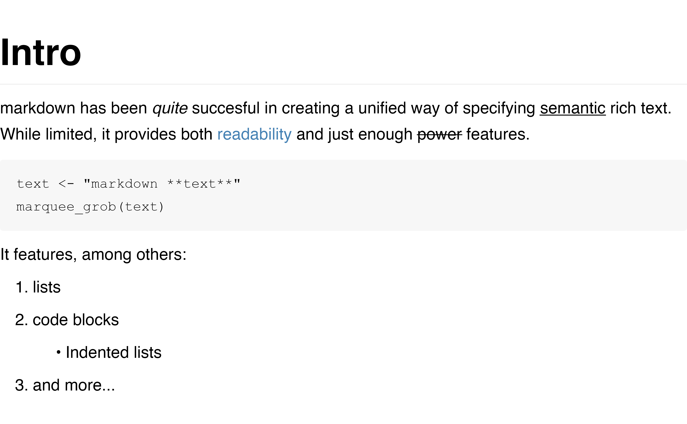
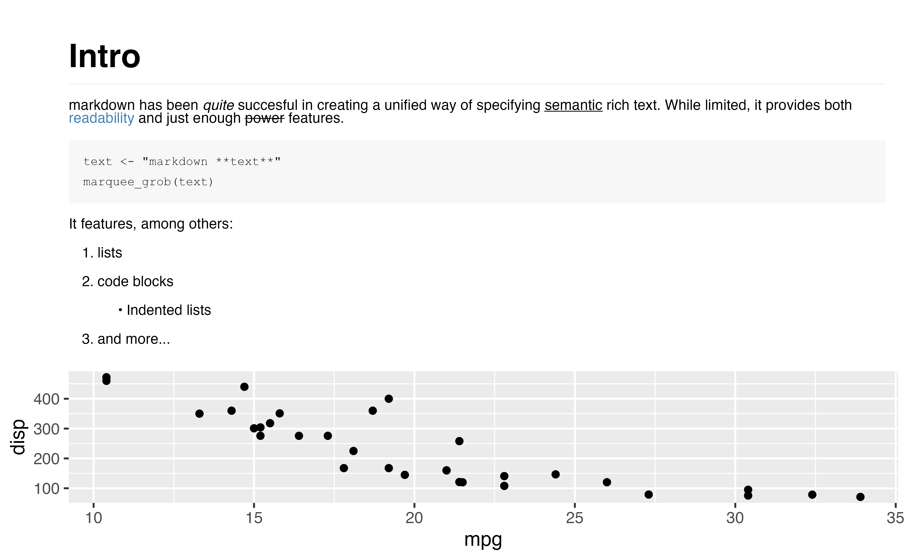

<!--
TODO:
* [x] Look over / edit the post's title in the yaml
* [x] Edit (or delete) the description; note this appears in the Twitter card
* [x] Pick category and tags (see existing with [`hugodown::tidy_show_meta()`](https://rdrr.io/pkg/hugodown/man/use_tidy_post.html))
* [x] Find photo & update yaml metadata
* [x] Create `thumbnail-sq.jpg`; height and width should be equal
* [x] Create `thumbnail-wd.jpg`; width should be >5x height
* [x] [`hugodown::use_tidy_thumbnails()`](https://rdrr.io/pkg/hugodown/man/use_tidy_post.html)
* [ ] Add intro sentence, e.g. the standard tagline for the package
* [-] [`usethis::use_tidy_thanks()`](https://usethis.r-lib.org/reference/use_tidy_thanks.html)
-->

I am super excited to announce the initial release of [marquee](https://marquee.r-lib.org), a markdown parser and renderer for R graphics that allows native rich text formatting of text in graphics created with grid (which includes ggplot2 and lattice).

The inception of this package goes all the way back to 2017

<blockquote class="twitter-tweet">

May I present: Text wrapping of theme elements in <a href="https://twitter.com/hashtag/ggplot2?src=hash&amp;ref_src=twsrc%5Etfw">#ggplot2</a> with the new (experimental) element_textbox in <a href="https://twitter.com/hashtag/ggforce?src=hash&amp;ref_src=twsrc%5Etfw">#ggforce</a><a href="https://twitter.com/hashtag/rstats?src=hash&amp;ref_src=twsrc%5Etfw">#rstats</a> <a href="https://twitter.com/hashtag/dataviz?src=hash&amp;ref_src=twsrc%5Etfw">#dataviz</a> <a href="https://t.co/JJMLcuTBqx">pic.twitter.com/JJMLcuTBqx</a>

--- Thomas Lin Pedersen (@thomasp85) <a href="https://twitter.com/thomasp85/status/816967301014634497?ref_src=twsrc%5Etfw">January 5, 2017</a>

</blockquote>

(yeah...) where I developed an experimental feature for ggforce that allowed automatic text wrapping in [`element_text()`](https://ggplot2.tidyverse.org/reference/element.html). Years passed, slowly improving the text rendering capabilities in R until we are finally at a point in the toolchain where something like marquee can deliver on my initial plans.

If this has you intrigued you can install it from CRAN with:

<pre class='chroma'><code class='language-r' data-lang='r'><a href='https://rdrr.io/r/utils/install.packages.html'>install.packages</a>("marquee")</code></pre>

This blog post will go through the features of marquee, along with discussing some of its current limitations, all of which are hopefully transient.

<pre class='chroma'><code class='language-r' data-lang='r'><a href='https://rdrr.io/r/base/library.html'>library</a>(<a href='https://marquee.r-lib.org'>marquee</a>)</code></pre>

## An example

Since the use of markdown is second-hand nature for most people at this point, there shouldn't be much surprise in what marquee is capable off, so let's start with an example to show the main use:

<pre class='chroma'><code class='language-r' data-lang='r'>md_text &lt;- 
"# Intro
markdown has been *quite* succesful in creating a unified way of specifying 
_semantic_ rich text. While limited, it provides both &#123;.yellow readability&#125; and
just enough ~power~ features.

    text &lt;- \"markdown **text**\"
    marquee_grob(text)

It features, among others:

1. lists

2. code blocks

   * Indented lists
   
3. and more...
"

grid::<a href='https://rdrr.io/r/grid/grid.draw.html'>grid.draw</a>(<a href='https://marquee.r-lib.org/reference/marquee_grob.html'>marquee_grob</a>(md_text))
</code></pre>

The above illustrates a couple of things. First and foremost, that markdown works in very unsurprising ways and you get what you type. In fact, the full CommonMark syntax is supported along with extensions for underline and strikethrough. Further, it shows that marquee provides its own extension for specifying custom span elements in the form of the `{.class <text>}` syntax. The renderer is clever in interpreting the class so that if it corresponds to a colour name, the colour is automatically applied to the text. Lastly, it shows that the default styling of markdown closely follows the look you've come to expect from markdown rendered to HTML.

## Use in ggplot2

The number of people using this directly in grid is probably small. It is more likely that you access the functionality of marquee through higher level functions. Marquee provides two such functions aimed at making it easy to use marquee in ggplot2. The aim is to eventually move these into ggplot2 proper, but while we are in the initial phase of development they will stay in this package.

### `geom_marquee()`

The first function is (obviously) a geom. It is intended as a stand-in replacement for both [`geom_text()`](https://ggplot2.tidyverse.org/reference/geom_text.html) and [`geom_label()`](https://ggplot2.tidyverse.org/reference/geom_text.html). As with [`marquee_grob()`](https://marquee.r-lib.org/reference/marquee_grob.html) it works very unsurprisingly:

<pre class='chroma'><code class='language-r' data-lang='r'><a href='https://rdrr.io/r/base/library.html'>library</a>(<a href='https://ggplot2.tidyverse.org'>ggplot2</a>)
# Add styling around the first word
red_bold_names &lt;- <a href='https://rdrr.io/r/base/grep.html'>sub</a>("(\\w+)", "&#123;.red **\\1**&#125;", <a href='https://rdrr.io/r/base/colnames.html'>rownames</a>(mtcars))

<a href='https://ggplot2.tidyverse.org/reference/ggplot.html'>ggplot</a>(mtcars) + 
  <a href='https://marquee.r-lib.org/reference/geom_marquee.html'>geom_marquee</a>(<a href='https://ggplot2.tidyverse.org/reference/aes.html'>aes</a>(x = mpg, y = disp, label = red_bold_names))
</code></pre>

Apart from standard, but markdown-aware, [`geom_text()`](https://ggplot2.tidyverse.org/reference/geom_text.html) behaviour, the geom also gains a `width` aesthetic that allows you to turn on automatic soft wrapping of the text. In addition to this it gains a `style` aesthetic to finely control the style (more about styling below)

### `element_marquee()`

The second obvious use for marquee in ggplot2 is in formatting text elements. [`element_marquee()`](https://marquee.r-lib.org/reference/element_marquee.html) is a replacement for [`element_text()`](https://ggplot2.tidyverse.org/reference/element.html) that does just that.

<pre class='chroma'><code class='language-r' data-lang='r'><a href='https://ggplot2.tidyverse.org/reference/ggplot.html'>ggplot</a>(mtcars) + 
  <a href='https://ggplot2.tidyverse.org/reference/geom_point.html'>geom_point</a>(<a href='https://ggplot2.tidyverse.org/reference/aes.html'>aes</a>(x = mpg, y = disp)) + 
  <a href='https://ggplot2.tidyverse.org/reference/labs.html'>ggtitle</a>(md_text) + 
  <a href='https://ggplot2.tidyverse.org/reference/theme.html'>theme</a>(plot.title = <a href='https://marquee.r-lib.org/reference/element_marquee.html'>element_marquee</a>(size = 8, width = <a href='https://rdrr.io/r/grid/unit.html'>unit</a>(16, "cm")))
</code></pre>

## Styling

As alluded to above, marquee comes with a styling API that is reminiscent of CSS but completely its own. In some sense it takes the "simplicity over power" approach from markdown and applies it to styling.

In marquee, each element type (e.g. a code block) has its own style. This style can be incomplete in which case it inherits the remaining specifications from the parent element in the document. As an example, the `em` element has the following default style `style(italic = TRUE)`, that is, take whatever style is currently in effect but set the text to italic. This is basically how CSS works as well, but CSS allows so much more which clutters both the API and implementation if all you ever want to do is format rich text.

Apart from the direct inheritance of the marquee styling, it is also possible to use relative inheritance for numeric specifications (e.g. `lineheight = relative(2)` to double the current lineheight) or set sizes based on the current or root element font size (using [`em()`](https://marquee.r-lib.org/reference/style_helpers.html) and [`rem()`](https://marquee.r-lib.org/reference/style_helpers.html) respectively). Lastly, you can also mark a specification as "non-inheritable" using [`skip_inherit()`](https://marquee.r-lib.org/reference/style_helpers.html) in which case the inheritance moves up one level.

Marquee ships with a single style set ([`classic_style()`](https://marquee.r-lib.org/reference/classic_style.html)) and you can make your own, either by modifying this, or building your own from scratch. If you choose the latter route make sure that the base element is a complete style - everything beyond that is optional.

<pre class='chroma'><code class='language-r' data-lang='r'># Create a style set with no styling beyond the base settings
no_style &lt;- <a href='https://marquee.r-lib.org/reference/style_set.html'>style_set</a>(base = <a href='https://marquee.r-lib.org/reference/style.html'>base_style</a>())

grid::<a href='https://rdrr.io/r/grid/grid.draw.html'>grid.draw</a>(<a href='https://marquee.r-lib.org/reference/marquee_grob.html'>marquee_grob</a>(md_text, no_style))
</code></pre>

As we see, all discerning styling have been stripped from the rendering above. All, except for the custom coloured element. As discussed previously, marquee understand custom spans named after colours and doesn't require a specific styling of these to be provided. However, if you do provide a style, that takes precedence:

<pre class='chroma'><code class='language-r' data-lang='r'>confusing_style &lt;- <a href='https://marquee.r-lib.org/reference/classic_style.html'>classic_style</a>() |&gt; 
  <a href='https://marquee.r-lib.org/reference/style_set.html'>modify_style</a>("yellow", <a href='https://marquee.r-lib.org/reference/style.html'>style</a>(color = "red"))

grid::<a href='https://rdrr.io/r/grid/grid.draw.html'>grid.draw</a>(<a href='https://marquee.r-lib.org/reference/marquee_grob.html'>marquee_grob</a>(md_text, confusing_style))
</code></pre>

## Images

Markdown (famously) supports adding images through the `` syntax. Since marquee supports the full CommonMark spec, this is of course also supported. The only limitation is that the "alt text" is ignored since hovering tool-tips or screen-readers are not supported for the output types that marquee renders to.

If an image is placed on a line of its own it will be rendered to fit the line height of the line. If it is placed by itself on its own line it will span the width available:

<pre class='chroma'><code class='language-r' data-lang='r'>logo &lt;- <a href='https://rdrr.io/r/base/system.file.html'>system.file</a>("help", "figures", "logo.png", package = "marquee")
header_img &lt;- "thumbnail-wd.jpg"

md_img &lt;- 
"# About marquee 

Both PNG (above), JPEG (below), and SVG (not shown) are supported

The above image is treated like a block element
"

md_img &lt;- <a href='https://marquee.r-lib.org/reference/marquee_glue.html'>marquee_glue</a>(md_img)

grid::<a href='https://rdrr.io/r/grid/grid.draw.html'>grid.draw</a>(<a href='https://marquee.r-lib.org/reference/marquee_grob.html'>marquee_grob</a>(md_img))
</code></pre>

Apart from showing support for images we also introduce a new function above, [`marquee_glue()`](https://marquee.r-lib.org/reference/marquee_glue.html). It is a function that works very much like [`glue::glue()`](https://glue.tidyverse.org/reference/glue.html) and performs text interpolation. However, this variant understands the custom span syntax of marquee so that these will not be treated as interpolation sites. Further, it turns off the `#` interpretation as a comment character as this interferes with the markdown header syntax.

All of the above is pretty standard markdown and since I prefixed this whole blog post with "full markdown support" it shouldn't come as a big surprise. However, marquee has one last trick up its sleeve: R graphics interpolation. Quite simply, if you, instead of providing a path to a file, provide the name of an R variable holding a graphic object, this will be included as an image. Here's how it works:

<pre class='chroma'><code class='language-r' data-lang='r'>plot &lt;- <a href='https://ggplot2.tidyverse.org/reference/ggplot.html'>ggplot</a>(mtcars) + 
  <a href='https://ggplot2.tidyverse.org/reference/geom_point.html'>geom_point</a>(<a href='https://ggplot2.tidyverse.org/reference/aes.html'>aes</a>(mpg, disp)) + 
  <a href='https://ggplot2.tidyverse.org/reference/geom_point.html'>geom_point</a>(<a href='https://ggplot2.tidyverse.org/reference/aes.html'>aes</a>(mpg, disp), mtcars[1,], colour = "red", size = 3)

point &lt;- grid::<a href='https://rdrr.io/r/grid/grid.points.html'>pointsGrob</a>(x = 0.5, y = 0.5, pch = 19, gp = grid::<a href='https://rdrr.io/r/grid/gpar.html'>gpar</a>(col = "red"))

md_plots &lt;- 
"# Plots
In the plot below, the red dot () shows the Mazda RX4

"

grid::<a href='https://rdrr.io/r/grid/grid.draw.html'>grid.draw</a>(<a href='https://marquee.r-lib.org/reference/marquee_grob.html'>marquee_grob</a>(md_plots))
</code></pre>

## Limitations

Marquee's biggest limitation is its reliance on very new features in the graphics engine. The rendering will *not* work on anything before R 4.3, but even then it requires the graphics device to support a range of new features, most importantly the new glyph specification introduced in R 4.3. While several graphics devices do support the required features, most notably those powered by Cairo as well as all devices in ragg, many do not. The default Windows graphics device continues to lag behind and the default on macOS, while supporting glyphs, can crash in some situations bringing the whole R session down with it (this is still being investigated). So we are in no doubt threading the frontier here. All of this is set to resolve itself (maybe except for the default Windows device) as time passes.

A limitation of great interest to me is the lack of support in svglite. svglite is build on a core idea of post-editability and thus wants all its text to be selectable and editable when opened in a capable program such as Adobe Illustrator. However, the graphics engine API that powers the new capabilities does not really allow this and I'm still figuring out how to reconcile it. It will eventually be solved though.

Lastly, while not really part of HTML syntax directly, many people rely on HTML inside markdown documents to solve layout and styling tasks that markdown doesn't support. The way it works is that markdown passes the HTML through unmodified and then the HTML is parsed by the HTML renderer (often the browser) used to display the rendered markdown document. This makes it seem like understanding HTML is part of markdown, while it's really not. The reason I'm going through all this explanation is to say that marquee has no understanding of HTML and will not render it as expected. While some HTML tags and CSS settings have clear counterparts in markdown and the marquee styling system it is much better to have a clear "no-support" over an arbitrary limited support. [`marquee_grob()`](https://marquee.r-lib.org/reference/marquee_grob.html)/[`marquee_parse()`](https://marquee.r-lib.org/reference/marquee_parse.html) have an argument (`ignore_html`) that controls whether HTML are outright removed from the output (default), or if it is included verbatim.

## Acknowledgements

Marquee is the latest in a stream of advancements when it comes to text rendering and font support in R. It builds on top of my work with [systemfonts](https://systemfonts.r-lib.org/index.html), [textshaping](https://github.com/r-lib/textshaping), and [ragg](https://ragg.r-lib.org/index.html), but also pays great debt to Paul Murrell's work on adding a new, more low level API for text rendering to grid and the graphics engine. Lastly, Claus Wilke's work on [gridtext](https://wilkelab.org/gridtext/) and [ggtext](https://wilkelab.org/ggtext/) showed the power and need for rich text support in R and filled a gap until the technical foundation for marquee was build out.

