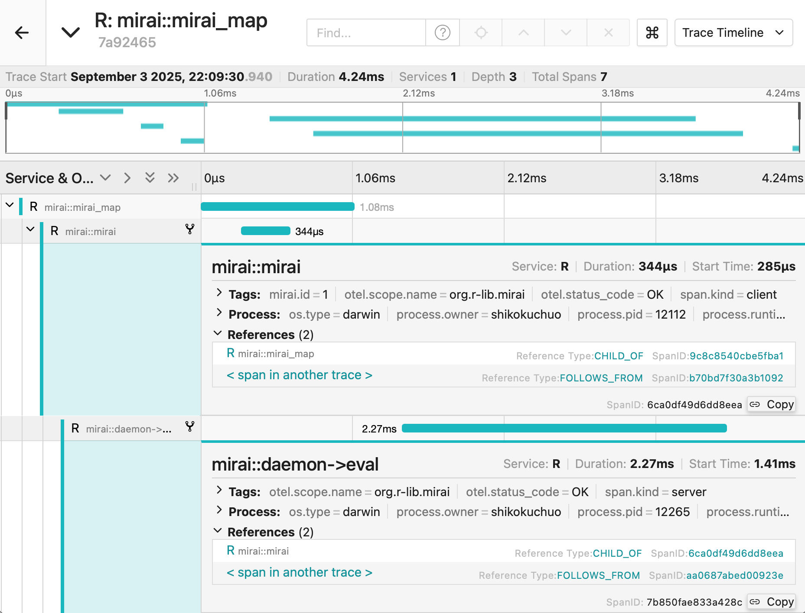

<!--
TODO:
* [x] Look over / edit the post's title in the yaml
* [x] Edit (or delete) the description; note this appears in the Twitter card
* [x] Pick category and tags (see existing with [`hugodown::tidy_show_meta()`](https://rdrr.io/pkg/hugodown/man/use_tidy_post.html))
* [x] Find photo & update yaml metadata
* [x] Create `thumbnail-sq.jpg`; height and width should be equal
* [x] Create `thumbnail-wd.jpg`; width should be >5x height
* [x] [`hugodown::use_tidy_thumbnails()`](https://rdrr.io/pkg/hugodown/man/use_tidy_post.html)
* [x] Add intro sentence, e.g. the standard tagline for the package
* [x] [`usethis::use_tidy_thanks()`](https://usethis.r-lib.org/reference/use_tidy_thanks.html)
-->

We're excited to announce [mirai](https://mirai.r-lib.org) 2.5.0, bringing production-grade async computing to R. This milestone release delivers enhanced observability, reproducible RNG, and the quality-of-life improvements that make mirai the foundation for parallel computing across the R ecosystem.

You can install it from CRAN with:

<div class="highlight">

<pre class='chroma'><code class='language-r' data-lang='r'><span><span class='nf'><a href='https://rdrr.io/r/utils/install.packages.html'>install.packages</a></span><span class='o'>(</span><span class='s'>"mirai"</span><span class='o'>)</span></span></code></pre>

</div>

This release packs in almost twice as many [changes](https://mirai.r-lib.org/news/index.html) as usual - we've gone all out in delivering a round of fixes and improvements to make your use of mirai even smoother!

## Introduction

mirai (Japanese for 'future') provides a clean, modern approach to parallel computing in R. Built on current communication technologies, it delivers extreme performance through professional-grade scheduling and an event-driven architecture.

It continues to evolve as the foundation for asynchronous and parallel computing across the R ecosystem, powering everything from Shiny applications to HPC (high-performance computing) workloads.

<div class="highlight">

<pre class='chroma'><code class='language-r' data-lang='r'><span><span class='kr'><a href='https://rdrr.io/r/base/library.html'>library</a></span><span class='o'>(</span><span class='nv'><a href='https://mirai.r-lib.org'>mirai</a></span><span class='o'>)</span></span>
<span></span>
<span><span class='c'># Set up persistent background processes</span></span>
<span><span class='nf'><a href='https://mirai.r-lib.org/reference/daemons.html'>daemons</a></span><span class='o'>(</span><span class='m'>4</span><span class='o'>)</span></span>
<span></span>
<span><span class='c'># Async evaluation - non-blocking</span></span>
<span><span class='nv'>m</span> <span class='o'>&lt;-</span> <span class='nf'><a href='https://mirai.r-lib.org/reference/mirai.html'>mirai</a></span><span class='o'>(</span><span class='o'>&#123;</span></span>
<span>  <span class='nf'><a href='https://rdrr.io/r/base/Sys.sleep.html'>Sys.sleep</a></span><span class='o'>(</span><span class='m'>1</span><span class='o'>)</span></span>
<span>  <span class='m'>100</span> <span class='o'>+</span> <span class='m'>42</span></span>
<span><span class='o'>&#125;</span><span class='o'>)</span></span>
<span><span class='nv'>m</span></span>
<span><span class='c'>#&gt; &lt; mirai [] &gt;</span></span>
<span></span><span></span>
<span><span class='c'># Results are available when ready</span></span>
<span><span class='nv'>m</span><span class='o'>[</span><span class='o'>]</span></span>
<span><span class='c'>#&gt; [1] 142</span></span>
<span></span><span></span>
<span><span class='c'># Shut down persistent background processes</span></span>
<span><span class='nf'><a href='https://mirai.r-lib.org/reference/daemons.html'>daemons</a></span><span class='o'>(</span><span class='m'>0</span><span class='o'>)</span></span></code></pre>

</div>

## What makes mirai unique?

### Modern networking foundation

mirai represents a fundamental shift in R's parallel computing landscape, architected on professional-grade networking technologies:

- **nanonext/NNG**: built on [nanonext](https://nanonext.r-lib.org), R's binding to Nanomsg Next Generation, a high-performance messaging library designed for distributed systems
- **Optimal transport protocols**: choice of IPC (inter-process communication), TCP/IP, and secure TLS connections
- **Event-driven architecture**: non-blocking, zero-latency promises that eliminate the polling overhead common in other solutions

This modern foundation enables mirai to scale to millions of tasks across thousands of connections, while delivering up to 1,000x greater efficiency and responsiveness compared to alternatives.

### Production-first design

mirai is engineered for production environments from the ground up:

- **Clear evaluation model**: clean environment separation with explicit object passing eliminates common parallel processing pitfalls
- **Robustness and transparency**: from no hidden state in options or environment variables, and minimizing complexity
- **Enterprise monitoring**: OpenTelemetry integration for production-grade observability

### Deploy everywhere architecture

Enabled by mirai's modular system of compute profiles:

- Connect to different sets of daemons (persistent parallel processes) independently
- Set up parallelism on your laptop, on a local server, and on an HPC cluster - all at the same time
- Distribute compute to the most suitable resource for the job

Example:

<div class="highlight">

<pre class='chroma'><code class='language-r' data-lang='r'><span><span class='c'># Local parallelism</span></span>
<span><span class='nf'><a href='https://mirai.r-lib.org/reference/daemons.html'>daemons</a></span><span class='o'>(</span><span class='m'>4</span>, .compute <span class='o'>=</span> <span class='s'>"local"</span><span class='o'>)</span></span>
<span></span>
<span><span class='c'># Multi-server deployment</span></span>
<span><span class='nv'>ssh_cfg</span> <span class='o'>&lt;-</span> <span class='nf'><a href='https://mirai.r-lib.org/reference/ssh_config.html'>ssh_config</a></span><span class='o'>(</span><span class='nf'><a href='https://rdrr.io/r/base/c.html'>c</a></span><span class='o'>(</span><span class='s'>"ssh://server1"</span>, <span class='s'>"ssh://server2"</span>, <span class='s'>"ssh://server3"</span><span class='o'>)</span><span class='o'>)</span></span>
<span><span class='nf'><a href='https://mirai.r-lib.org/reference/daemons.html'>daemons</a></span><span class='o'>(</span>url <span class='o'>=</span> <span class='nf'><a href='https://mirai.r-lib.org/reference/host_url.html'>host_url</a></span><span class='o'>(</span><span class='o'>)</span>, remote <span class='o'>=</span> <span class='nv'>ssh_cfg</span>, .compute <span class='o'>=</span> <span class='s'>"server"</span><span class='o'>)</span></span>
<span></span>
<span><span class='c'># HPC cluster deployment</span></span>
<span><span class='nv'>hpc_cfg</span> <span class='o'>&lt;-</span> <span class='nf'><a href='https://mirai.r-lib.org/reference/cluster_config.html'>cluster_config</a></span><span class='o'>(</span>options <span class='o'>=</span> <span class='s'>"#SBATCH --partition=gpu"</span><span class='o'>)</span></span>
<span><span class='nf'><a href='https://mirai.r-lib.org/reference/daemons.html'>daemons</a></span><span class='o'>(</span><span class='m'>100</span>, url <span class='o'>=</span> <span class='nf'><a href='https://mirai.r-lib.org/reference/host_url.html'>host_url</a></span><span class='o'>(</span><span class='o'>)</span>, remote <span class='o'>=</span> <span class='nv'>hpc_cfg</span>, .compute <span class='o'>=</span> <span class='s'>"cluster"</span><span class='o'>)</span></span>
<span></span>
<span><span class='c'># Switch between compute profiles seamlessly</span></span>
<span><span class='nv'>result1</span> <span class='o'>&lt;-</span> <span class='nf'><a href='https://mirai.r-lib.org/reference/mirai.html'>mirai</a></span><span class='o'>(</span><span class='nf'>slow_task</span><span class='o'>(</span><span class='o'>)</span>, .compute <span class='o'>=</span> <span class='s'>"local"</span><span class='o'>)</span></span>
<span><span class='nv'>result2</span> <span class='o'>&lt;-</span> <span class='nf'><a href='https://mirai.r-lib.org/reference/mirai.html'>mirai</a></span><span class='o'>(</span><span class='nf'>long_task</span><span class='o'>(</span><span class='o'>)</span>, .compute <span class='o'>=</span> <span class='s'>"server"</span><span class='o'>)</span></span>
<span><span class='nv'>result3</span> <span class='o'>&lt;-</span> <span class='nf'><a href='https://mirai.r-lib.org/reference/mirai.html'>mirai</a></span><span class='o'>(</span><span class='nf'>heavy_computation</span><span class='o'>(</span><span class='o'>)</span>, .compute <span class='o'>=</span> <span class='s'>"cluster"</span><span class='o'>)</span></span></code></pre>

</div>

For further details on using mirai in HPC environments, please refer to our last [blog post for mirai 2.4.0](https://shikokuchuo.net/posts/27-mirai-240/), where we introduced our cluster launcher [`cluster_config()`](https://mirai.r-lib.org/reference/cluster_config.html).

## New in mirai 2.5.0

### OpenTelemetry integration

We're absolutely delighted to unveil: complete observability of mirai requests through OpenTelemetry traces. This is a core feature that completes the final pillar in mirai's 'built for production' design philosophy.

When tracing is enabled via the otelsdk package, you can monitor the entire lifecycle of your async computations, from creation through to evaluation, making it easier to debug and optimize performance in production environments. This is especially powerful when used in conjunction with other otel-enabled packages (like an upcoming Shiny release), providing end-to-end observability across your entire application stack.

<figure>

<figcaption aria-hidden="true"><em>Illustrative span structure shown in a Jaeger collector UI</em></figcaption>
</figure>

### Reproducible parallel RNG

We're equally delighted to announce reproducible parallel random number generation. Developed in consultation with our tidymodels colleagues and core members of the mlr team, this is a great example of the R community pulling together to implement crucial infrastructure.

Technically this feature has been around since the recent 2.4.1 release, but it solves a long-standing challenge in parallel computing in R. We hope that by announcing it here, it's put to good use for reproducible science.

mirai has long used L'Ecuyer-CMRG streams (since prior to v1.0) for statistically-sound parallel RNG. Streams essentially cut into the RNG's period (a very long sequence of pseudo-random numbers) at intervals that are far apart from each other that they do not in practice overlap. This ensures that statistical results obtained from parallel computations remain correct and valid.

Previously, we only offered the following option, matching the behaviour of base R's parallel package:

**Default behaviour (`seed = NULL`)**: Creates independent streams for each daemon, ensuring statistical validity but not numerical reproducibility between runs.

Now, we offer the following option as well:

**Reproducible mode (`seed = integer`)**: Creates a stream for each [`mirai()`](https://mirai.r-lib.org/reference/mirai.html) call rather than each daemon, guaranteeing identical results across runs regardless of the number of daemons used.

<div class="highlight">

<pre class='chroma'><code class='language-r' data-lang='r'><span><span class='c'># Always provides identical results:</span></span>
<span></span>
<span><span class='nf'><a href='https://rdrr.io/r/base/with.html'>with</a></span><span class='o'>(</span></span>
<span>  <span class='nf'><a href='https://mirai.r-lib.org/reference/daemons.html'>daemons</a></span><span class='o'>(</span><span class='m'>3</span>, seed <span class='o'>=</span> <span class='m'>1234L</span><span class='o'>)</span>,</span>
<span>  <span class='nf'><a href='https://mirai.r-lib.org/reference/mirai_map.html'>mirai_map</a></span><span class='o'>(</span><span class='m'>1</span><span class='o'>:</span><span class='m'>3</span>, <span class='nv'>rnorm</span>, .args <span class='o'>=</span> <span class='nf'><a href='https://rdrr.io/r/base/list.html'>list</a></span><span class='o'>(</span>mean <span class='o'>=</span> <span class='m'>20</span>, sd <span class='o'>=</span> <span class='m'>2</span><span class='o'>)</span><span class='o'>)</span><span class='o'>[</span><span class='o'>]</span></span>
<span><span class='o'>)</span></span>
<span><span class='c'>#&gt; [[1]]</span></span>
<span><span class='c'>#&gt; [1] 19.86409</span></span>
<span><span class='c'>#&gt; </span></span>
<span><span class='c'>#&gt; [[2]]</span></span>
<span><span class='c'>#&gt; [1] 19.55834 22.30159</span></span>
<span><span class='c'>#&gt; </span></span>
<span><span class='c'>#&gt; [[3]]</span></span>
<span><span class='c'>#&gt; [1] 20.62193 23.06144 19.61896</span></span>
<span></span></code></pre>

</div>

### User interface improvements

New scoped helper functions [`with_daemons()`](https://mirai.r-lib.org/reference/with_daemons.html) and [`local_daemons()`](https://mirai.r-lib.org/reference/with_daemons.html) make working with compute profiles much more convenient by allowing the temporary switching of contexts:

``` r
# Work with specific compute profiles
with_daemons("gpu", {
  result <- mirai(gpu_intensive_task())
})

# Local version for use inside functions
async_gpu_intensive_task <- function() {
  local_daemons("gpu")
  mirai(gpu_intensive_task())
}
```

The [`daemons()`](https://mirai.r-lib.org/reference/daemons.html) function has been redesigned to be more ergonomic. Creating new daemons automatically resets existing ones (no more manual `daemons(0)` calls):

``` r
# Old approach
daemons(0)  # Had to reset first
daemons(4)

# New approach - automatic reset
daemons(4)  # Just works, resets if needed
```

### Developer features

A new function [`info()`](https://mirai.r-lib.org/reference/info.html) provides a more succinct alternative to [`status()`](https://mirai.r-lib.org/reference/status.html) for reporting key statistics. This is now optimized and available for programmatic use.

<div class="highlight">

<pre class='chroma'><code class='language-r' data-lang='r'><span><span class='nf'><a href='https://mirai.r-lib.org/reference/info.html'>info</a></span><span class='o'>(</span><span class='o'>)</span></span>
<span><span class='c'>#&gt; connections  cumulative    awaiting   executing   completed </span></span>
<span><span class='c'>#&gt;           4           4           8           4           2</span></span></code></pre>

</div>

## Powering the R ecosystem

mirai has rapidly become the foundation for async computing across the R ecosystem:

**Core infrastructure:**

- **R**: first official alternative communications backend (R 4.5+)
- **purrr**: powers parallel map in this core tidyverse package
- **Shiny**: primary async backend with ExtendedTask support
- **plumber2**: built-in async evaluator for web APIs
- **tidymodels**: parallel ML workflows and hyperparameter tuning
- **targets**: HPC workflows via crew (mirai-based distributed launcher)

**Data formats:**

- **torch**: seamless tensor operations across processes
- **Arrow & Polars**: native columnar data format support

From Shiny apps to scientific research, mirai now powers parallel computing across virtually every domain in R - making it the *de facto* standard for modern async computing.

## Looking forward

mirai 2.5.0 represents a step forward in bringing high-performance, production-ready async computing to the R community. With its growing ecosystem integrations, we're laser-focused on continuing to push the boundaries on performance and reliability.

We see mirai's role in enabling R to be used in previously-unthinkable contexts and widening its appeal, both within data science but also in scientific computing more broadly.

Whether you're building interactive Shiny applications, running large-scale data analysis pipelines, or deploying models across HPC infrastructure, mirai provides the robust, scalable foundation you need.

Ready to get started? Check out the comprehensive guides and examples at <https://mirai.r-lib.org>, or dive right in with `install.packages("mirai")`.

## Acknowledgements

We extend our gratitude to the R community for their continued feedback and contributions. Special thanks to all contributors who helped shape this release through feature requests, bug reports, and code contributions: [@agilly](https://github.com/agilly), [@D3SL](https://github.com/D3SL), [@DavZim](https://github.com/DavZim), [@dipterix](https://github.com/dipterix), [@eliocamp](https://github.com/eliocamp), [@erydit](https://github.com/erydit), [@karangattu](https://github.com/karangattu), [@louisaslett](https://github.com/louisaslett), [@mikkmart](https://github.com/mikkmart), [@sebffischer](https://github.com/sebffischer), [@shikokuchuo](https://github.com/shikokuchuo), and [@wlandau](https://github.com/wlandau).

