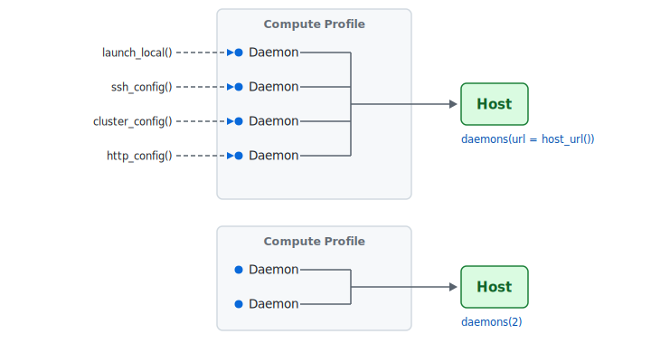
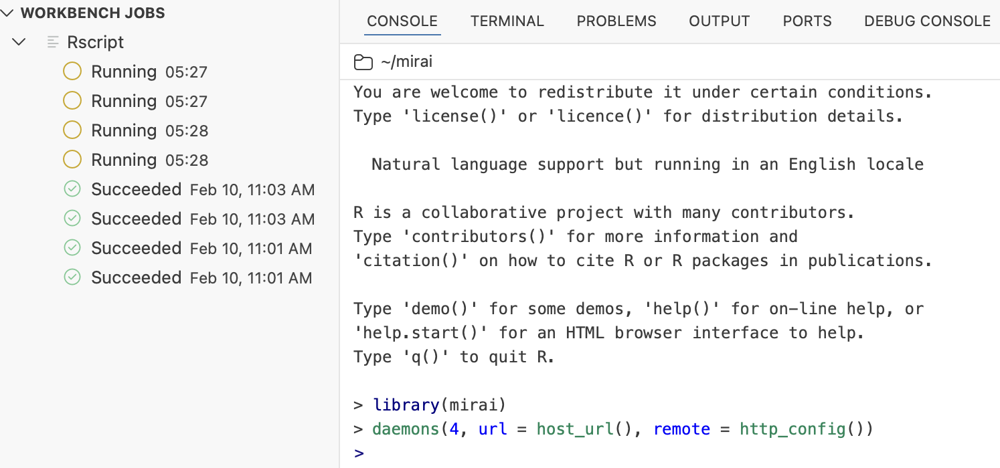

[mirai](https://mirai.r-lib.org) 2.6.0 is now on CRAN. mirai is R's framework for parallel and asynchronous computing. If you're fitting models, running simulations, or building Shiny apps, mirai lets you spread that work across multiple processes -- locally or on remote infrastructure.

With this release, it bridges the gap between your laptop and enterprise infrastructure -- the same code you prototype locally now deploys to Posit Workbench or any cloud HTTP API, with a single function call.

You can install it from CRAN with:

``` r
install.packages("mirai")
```

The flagship feature for this release is the HTTP launcher for deploying daemons to cloud and enterprise platforms. This release also brings a C-level dispatcher for minimal task dispatch overhead, [`race_mirai()`](https://mirai.r-lib.org/reference/race_mirai.html) for process-as-completed patterns, synchronous mode for debugging, and daemon synchronization for remote deployments. You can see a full list of changes in the [release notes](https://mirai.r-lib.org/news/#mirai-260).

## How mirai works

If you've ever waited for a loop to finish fitting models, processing files, or calling APIs, mirai can help. Any task that's repeated independently across items is a candidate for parallel execution.

The [previous release post](/blog/2025/09/mirai-2-5-0/) covered mirai's design philosophy in detail. Here's a brief overview for readers encountering mirai for the first time.

<div class="highlight">

<pre class='chroma'><code class='language-r' data-lang='r'><span><span class='kr'><a href='https://rdrr.io/r/base/library.html'>library</a></span><span class='o'>(</span><span class='nv'><a href='https://mirai.r-lib.org'>mirai</a></span><span class='o'>)</span></span>
<span><span class='c'># Set up 4 background processes</span></span>
<span><span class='nf'><a href='https://mirai.r-lib.org/reference/daemons.html'>daemons</a></span><span class='o'>(</span><span class='m'>4</span><span class='o'>)</span></span>
<span></span>
<span><span class='c'># Send work -- non-blocking, returns immediately</span></span>
<span><span class='nv'>m</span> <span class='o'>&lt;-</span> <span class='nf'><a href='https://mirai.r-lib.org/reference/mirai.html'>mirai</a></span><span class='o'>(</span><span class='o'>&#123;</span></span>
<span>  <span class='nf'><a href='https://rdrr.io/r/base/Sys.sleep.html'>Sys.sleep</a></span><span class='o'>(</span><span class='m'>1</span><span class='o'>)</span></span>
<span>  <span class='m'>100</span> <span class='o'>+</span> <span class='m'>42</span></span>
<span><span class='o'>&#125;</span><span class='o'>)</span></span>
<span><span class='nv'>m</span></span>
<span><span class='c'>#&gt; &lt; mirai [] &gt;</span></span>
<span></span><span></span>
<span><span class='c'># Collect the result when ready</span></span>
<span><span class='nv'>m</span><span class='o'>[</span><span class='o'>]</span></span>
<span><span class='c'>#&gt; [1] 142</span></span>
<span></span><span></span>
<span><span class='c'># Shut down</span></span>
<span><span class='nf'><a href='https://mirai.r-lib.org/reference/daemons.html'>daemons</a></span><span class='o'>(</span><span class='m'>0</span><span class='o'>)</span></span></code></pre>

</div>

That's mirai in a nutshell: [`daemons()`](https://mirai.r-lib.org/reference/daemons.html) to set up workers, [`mirai()`](https://mirai.r-lib.org/reference/mirai.html) to send work, `[]` to collect results. Everything else builds on this.

In mirai's hub architecture, the host session listens at a URL and *daemons* -- background R processes that do the actual work -- connect to it. You send tasks with [`mirai()`](https://mirai.r-lib.org/reference/mirai.html), and the dispatcher routes them to available daemons in first-in, first-out (FIFO) order.

This design enables dynamic scaling: daemons can connect and disconnect at any time without disrupting the host. Add capacity when you need it, release it when you don't.



A single compute profile can mix daemons launched by different methods, and you can run multiple profiles simultaneously to direct different tasks to different resources. The basic syntax for each deployment method:

| Deploy to | Setup |
|--------------------------------------------|----------------------------|
| Local | `daemons(4)` |
| Remote (SSH) | `daemons(url = host_url(), remote = ssh_config(...))` |
| HPC cluster (Slurm, SGE, PBS, LSF) | `daemons(url = host_url(), remote = cluster_config())` |
| HTTP API / Posit Workbench | `daemons(url = host_url(), remote = http_config())` |

Change one line and your local prototype runs on a Slurm cluster. Change it again and it runs on Posit Workbench. Your analysis code stays identical.

## The async foundation for the modern R stack

mirai has become the convergence point for asynchronous and parallel computing across the R ecosystem.

It is the [recommended async backend](https://rstudio.github.io/promises/articles/promises_04_mirai.html) for [Shiny](https://shiny.posit.co/) -- if you're building production Shiny apps, you should be using mirai. It is the *only* async backend for the next-generation [plumber2](https://plumber2.posit.co/) -- if you're building APIs with plumber2, you're already using mirai.

It is the parallel backend for [purrr](https://purrr.tidyverse.org/) -- if you use `map()`, mirai is how you make it parallel. Wrap your function in [`in_parallel()`](https://purrr.tidyverse.org/reference/in_parallel.html), set up daemons, and your map calls run across all of them:

``` r
library(purrr)
daemons(4)
models <- split(mtcars, mtcars$cyl) |>
  map(in_parallel(\(x) lm(mpg ~ wt + hp, data = x)))
daemons(0)
```

It powers [targets](https://docs.ropensci.org/targets/) -- the pipeline orchestration tool for reproducible analysis. And most recently, [ragnar](https://ragnar.tidyverse.org/) -- the Tidyverse package for retrieval-augmented generation (RAG) -- adopted mirai for its parallel processing.

As an [official alternative communications backend](https://stat.ethz.ch/R-manual/R-devel/library/parallel/html/makeCluster.html) for R's `parallel` package, mirai underpins workflows from interactive web applications to pipeline orchestration to AI-powered document processing.

Learn mirai, and you've learned the async primitive that powers the modern R stack. The same two concepts -- [`daemons()`](https://mirai.r-lib.org/reference/daemons.html) to set up workers, [`mirai()`](https://mirai.r-lib.org/reference/mirai.html) to send work -- are all you need to keep a Shiny app responsive or run async tasks in production.

## HTTP launcher

This release extends the "deploy everywhere" principle with [`http_config()`](https://mirai.r-lib.org/reference/http_config.html), a new remote launch configuration that deploys daemons via HTTP API calls -- any platform with an HTTP API for launching jobs.

### Posit Workbench

Many organizations use [Posit Workbench](https://posit.co/products/enterprise/workbench/) to run research and data science at scale. mirai now integrates directly with it.[^1] Call [`http_config()`](https://mirai.r-lib.org/reference/http_config.html) with no arguments and it auto-configures using the Workbench environment:

``` r
daemons(n = 4, url = host_url(), remote = http_config())
```

That's it. Four daemons launch as Workbench jobs, connect back to your session, and you can start sending work to them.

<figure>

<figcaption aria-hidden="true">Posit Workbench session showing launched mirai daemons</figcaption>
</figure>

Here's what that looks like in practice: you're developing a model in your Workbench session. Fitting it locally is slow. Add that line, and those fits fan out across four Workbench-managed compute jobs. When you're done, `daemons(0)` releases them. No YAML, no job scripts, no leaving your R session -- resource allocation, access control, and job lifecycle are all handled by the platform.

If you've been bitten by expired tokens in long-running sessions, [`http_config()`](https://mirai.r-lib.org/reference/http_config.html) is designed to prevent that. Under the hood, it stores *functions* rather than static values for credentials and endpoint URLs. These functions are called at the moment daemons actually launch, so session cookies and API tokens are always fresh -- even if you created the configuration hours earlier.

See the mirai vignette for [troubleshooting](https://mirai.r-lib.org/articles/v01-reference.html#troubleshooting) remote launches.

### Custom APIs

The HTTP launcher works with any HTTP API, not just Workbench. Supply your own endpoint, authentication, and request body:

``` r
daemons(
  n = 2,
  url = host_url(),
  remote = http_config(
    url = "https://api.example.com/launch",
    method = "POST",
    token = function() Sys.getenv("MY_API_KEY"),
    data = '{"command": "%s"}'
  )
)
```

The `"%s"` placeholder in `data` is where mirai inserts the daemon launch command at launch time. Each argument can be a plain value or a function -- use functions for anything that changes between launches (tokens, cookies, dynamic URLs).

This opens up a wide range of deployment targets: Kubernetes job APIs, other cloud container services, or any internal job scheduler with an HTTP interface. If you can launch a process with an HTTP call, mirai can use it.

## C-level dispatcher

The overhead of distributing your tasks is now negligible. In a [`mirai_map()`](https://mirai.r-lib.org/reference/mirai_map.html) over thousands of items, what you measure is the time of your actual computation, not the framework -- per-task dispatch overhead is now in the tens of microseconds, where existing R parallelism solutions typically operate in the millisecond range.

Under the hood, the dispatcher -- the process that sits between your session and the daemons, routing tasks to available workers -- has been re-implemented entirely in C code within [nanonext](https://nanonext.r-lib.org). This eliminates the R interpreter overhead that remained, while the dispatcher continues to be event-driven and consume zero CPU when idle.

This also removes the bottleneck when coordinating large numbers of daemons, which matters directly for the kind of scaled-out deployments that the HTTP launcher enables -- dozens of Workbench jobs or cloud instances all connecting to a single dispatcher. The two features are designed to work together: deploy broadly, dispatch efficiently. mirai is built to scale from 2 cores on your laptop to 200 across a cluster, without the framework slowing you down.

## `race_mirai()`

[`race_mirai()`](https://mirai.r-lib.org/reference/race_mirai.html) lets you process results as they arrive, rather than waiting for the slowest task. Suppose you're fitting 10 models with different hyperparameters in parallel -- some converge quickly, others take much longer. Without [`race_mirai()`](https://mirai.r-lib.org/reference/race_mirai.html), you wait for the slowest fit to complete before seeing any results. With it, you can inspect or save each model the instant it finishes -- updating a progress display, freeing memory, or deciding whether to continue the remaining fits at all.

[`race_mirai()`](https://mirai.r-lib.org/reference/race_mirai.html) returns the integer *index* of the first resolved mirai. This makes the "process as completed" pattern clean and efficient:

``` r
daemons(4)

# Launch 10 model fits in parallel
fits <- lapply(param_grid, function(p) mirai(fit_model(data, p), data = data, p = p))

# Process each result as soon as it's ready
remaining <- fits
while (length(remaining) > 0) {
  idx <- race_mirai(remaining)
  cat("Finished model with params:", remaining[[idx]]$data$p, "\n")
  remaining <- remaining[-idx]
}

daemons(0)
```

Send off a batch of tasks, then process results in the order they finish -- no polling, no wasted time waiting on the slowest one. If any mirai is already resolved when you call [`race_mirai()`](https://mirai.r-lib.org/reference/race_mirai.html), it returns immediately. This pattern applies whenever tasks have variable completion times -- parallel model fits, API calls, simulations, or any batch where you want to stream results as they land.

## Synchronous mode

When tasks don't behave as expected, you need a way to inspect them interactively.

Without synchronous mode, errors in a mirai return as `miraiError` objects -- you can see that something went wrong, but you can't step through the code to find out why. The task ran in a separate process, and by the time you see the error, that process has moved on.

`daemons(sync = TRUE)`, introduced in 2.5.1, solves this. It runs everything in the current process -- no background processes, no networking -- just sequential execution. You can use [`browser()`](https://rdrr.io/r/base/browser.html) and other interactive debugging tools directly:

``` r
daemons(sync = TRUE)
mirai(
  {
    browser()
    mypkg::some_complex_function(x)
  },
  x = my_data
)
```

You can scope synchronous mode to a specific compute profile, isolating the problematic task for inspection while the rest of your pipeline keeps running in parallel.

## Daemon synchronization with `everywhere()`

[`everywhere()`](https://mirai.r-lib.org/reference/everywhere.html) runs setup operations on all daemons -- loading packages, sourcing scripts, or preparing datasets -- so they're ready before you send work.

When launching remote daemons -- via SSH, HPC schedulers, or the new HTTP launcher -- there's an inherent delay between requesting a daemon and that daemon being ready to accept work. The new `.min` argument ensures that setup has completed on at least that many daemons before returning:

``` r
daemons(n = 8, url = host_url(), remote = http_config())

# Wait until all 8 daemons are connected before continuing
everywhere(library(mypackage), .min = 8)

# Now send work once all daemons are ready
mp <- mirai_map(tasks, process)
```

This creates a synchronization point, ensuring your pipeline doesn't start sending work before all daemons are ready. It's especially useful for remote deployments where connection times are unpredictable.

## Minor improvements and fixes

- `miraiError` objects now have [`conditionCall()`](https://rdrr.io/r/base/conditions.html) and [`conditionMessage()`](https://rdrr.io/r/base/conditions.html) methods, making them easier to use with R's standard condition handling.
- The default exit behavior for daemons has been updated with a 200ms grace period before forceful termination, which allows OpenTelemetry disconnection events to be traced.
- OpenTelemetry span names and attributes have been revised to better follow semantic conventions.
- [`daemons()`](https://mirai.r-lib.org/reference/daemons.html) now properly validates that `url` is a character value where supplied.
- Fixed a bug where repeated mirai cancellation could sometimes cause a daemon to exit prematurely.

## Try it now

``` r
install.packages("mirai")
library(mirai)

daemons(4)
system.time(mirai_map(1:4, \(x) Sys.sleep(1))[])
#>    user  system elapsed
#>   0.000   0.001   1.003
daemons(0)
```

Four one-second tasks, one second of wall time. If those were four model fits that each took a minute, you'd go from four minutes down to one -- and if you needed more power, switching to Workbench or a Slurm cluster is a one-line change. Visit [mirai.r-lib.org](https://mirai.r-lib.org) for the full documentation.

## Acknowledgements

A big thank you to all the folks who helped make this release happen:

[@agilly](https://github.com/agilly), [@aimundo](https://github.com/aimundo), [@barnabasharris](https://github.com/barnabasharris), [@beevabeeva](https://github.com/beevabeeva), [@boshek](https://github.com/boshek), [@eliocamp](https://github.com/eliocamp), [@jan-swissre](https://github.com/jan-swissre), [@jeroenjanssens](https://github.com/jeroenjanssens), [@kentqin-cve](https://github.com/kentqin-cve), [@mcol](https://github.com/mcol), [@michaelmayer2](https://github.com/michaelmayer2), [@pmac0451](https://github.com/pmac0451), [@r2evans](https://github.com/r2evans), [@shikokuchuo](https://github.com/shikokuchuo), [@t-kalinowski](https://github.com/t-kalinowski), [@VincentGuyader](https://github.com/VincentGuyader), [@wlandau](https://github.com/wlandau), and [@xwanner](https://github.com/xwanner).

[^1]: Requires Posit Workbench version 2026.01 or later, which enables launcher authentication using the session cookie.

