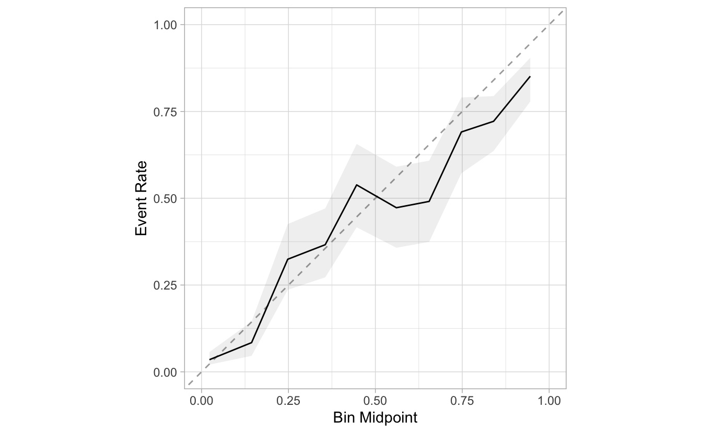
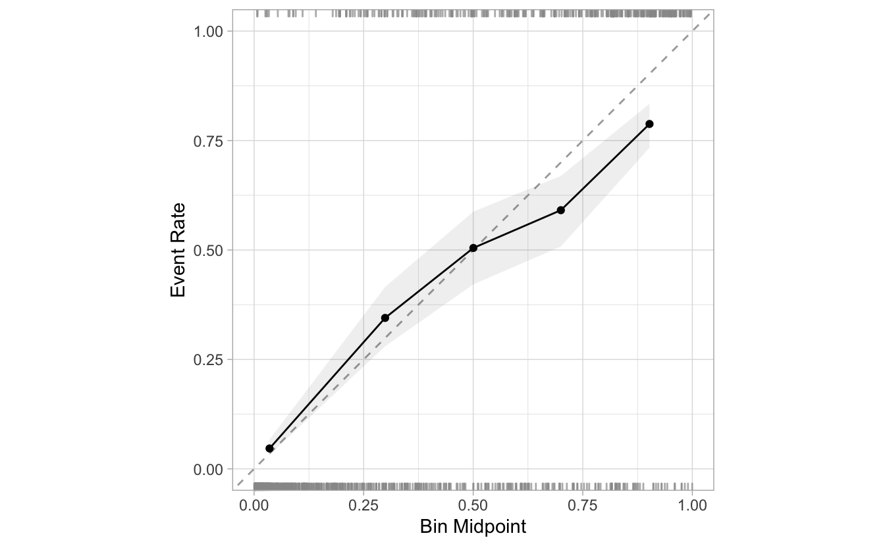
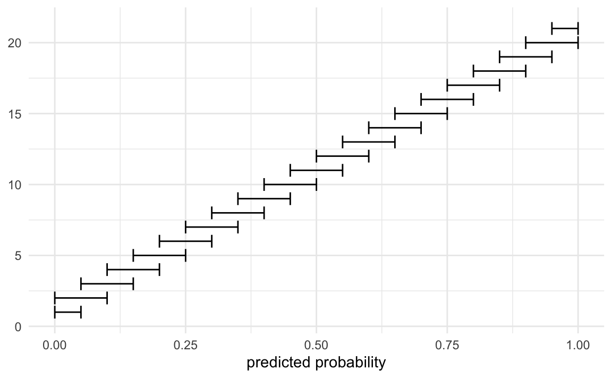
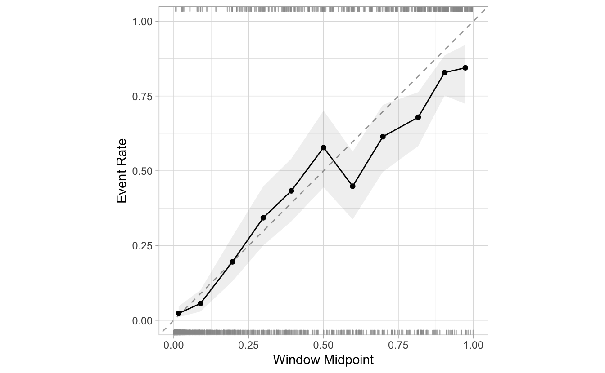
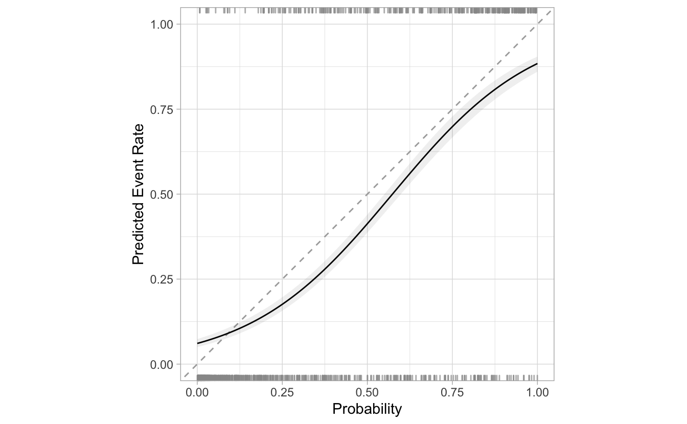
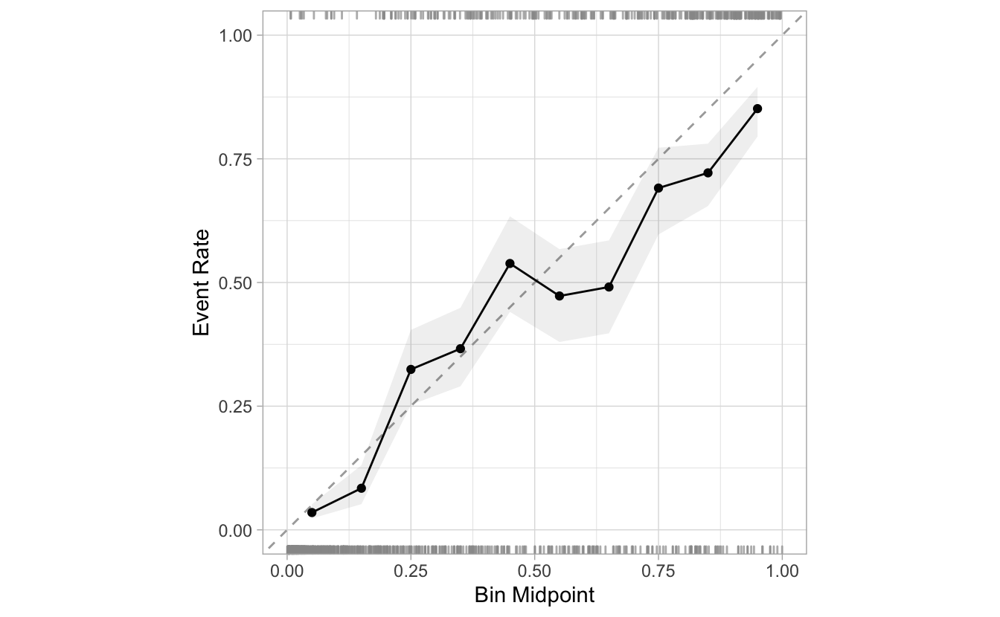
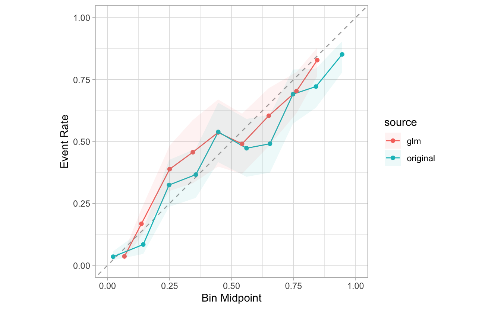
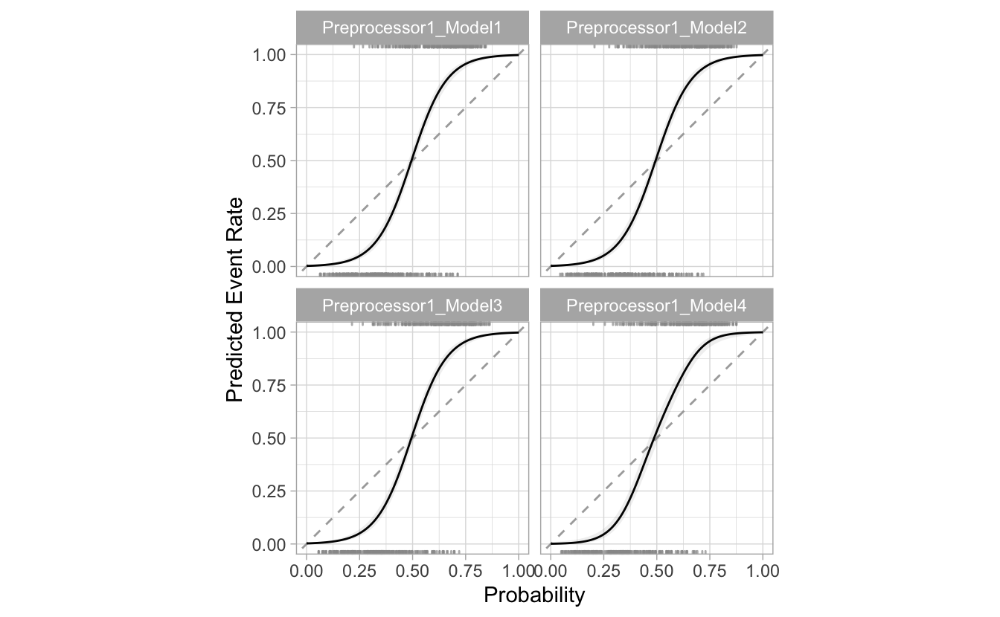

<!--
TODO:
* [ ] Look over / edit the post's title in the yaml
* [ ] Edit (or delete) the description; note this appears in the Twitter card
* [ ] Pick category and tags (see existing with [`hugodown::tidy_show_meta()`](https://rdrr.io/pkg/hugodown/man/use_tidy_post.html))
* [ ] Find photo & update yaml metadata
* [ ] Create `thumbnail-sq.jpg`; height and width should be equal
* [ ] Create `thumbnail-wd.jpg`; width should be >5x height
* [ ] [`hugodown::use_tidy_thumbnails()`](https://rdrr.io/pkg/hugodown/man/use_tidy_post.html)
* [ ] Add intro sentence, e.g. the standard tagline for the package
* [ ] [`usethis::use_tidy_thanks()`](https://usethis.r-lib.org/reference/use_tidy_thanks.html)
-->

I am very excited to introduce work currently underway. We are looking to create early awareness, and to receive feedback from the community. That is why the enhancements discussed here are not yet in CRAN.

## Model Calibration

*The goal of Model Calibration is to improve the accuracy of predictions.* It does this by adjusting the prediction's probabilities. Meaning that the predicted outcome may change based on the established threshold.

For example, a prediction could say that it is 60% certain of a result of "Yes". But, after applying the calibration, the new probability is now 45%. If the threshold is set to 50%, the new predicted outcome is now set to "No".

There are two main components to Model Calibration:

-   **Diagnosis** - Figuring out how well the original, and calibrated probabilities perform
-   **Remediation** - Calculating, and applying the calibration

## The plan

As with everything in machine learning, there are several options to consider when calibrating a model. Through the new features in the Tidymodels packages, we aspire to make those options as easily accessible as possible.

Our plan is to implement Model Calibration in two phases: The first phase will focus on binary models, and the second phase will focus on multi-class models.

The first batch of enhancements are now available in the development version of `probably`. The enhancements are centered around plotting functions meant for **diagnosing** the prediction's performance. These are more commonly known as **Calibration Plots**.

## Setup

If you wish to try out the new features, install the development version of `probably`

<pre class='chroma'><code class='language-r' data-lang='r'>remotes::<a href='https://remotes.r-lib.org/reference/install_github.html'>install_github</a>("tidymodels/probably")</code></pre>

To start, we will load the `probably` and `dplyr` packages into our R session.

<pre class='chroma'><code class='language-r' data-lang='r'><a href='https://rdrr.io/r/base/library.html'>library</a>(<a href='https://github.com/tidymodels/probably/'>probably</a>)
<a href='https://rdrr.io/r/base/library.html'>library</a>(<a href='https://dplyr.tidyverse.org'>dplyr</a>)</code></pre>

`probably` comes with a few data sets. For most of the examples in this post, we will use `segment_logistic`. It is an example data set that contains predictions, and their probabilities.

<pre class='chroma'><code class='language-r' data-lang='r'>segment_logistic
#&gt; # A tibble: 1,010 × 3
#&gt;    .pred_poor .pred_good Class
#&gt;  *      &lt;dbl&gt;      &lt;dbl&gt; &lt;fct&gt;
#&gt;  1    0.986      0.0142  poor 
#&gt;  2    0.897      0.103   poor 
#&gt;  3    0.118      0.882   good 
#&gt;  4    0.102      0.898   good 
#&gt;  5    0.991      0.00914 poor 
#&gt;  6    0.633      0.367   good 
#&gt;  7    0.770      0.230   good 
#&gt;  8    0.00842    0.992   good 
#&gt;  9    0.995      0.00458 poor 
#&gt; 10    0.765      0.235   poor 
#&gt; # … with 1,000 more rows</code></pre>

## Breaks (Bins)

<pre class='chroma'><code class='language-r' data-lang='r'>segment_logistic <a href='https://magrittr.tidyverse.org/reference/pipe.html'>%&gt;%</a> 
  <a href='https://probably.tidymodels.org/reference/cal_plot_breaks.html'>cal_plot_breaks</a>(Class, .pred_good)
</code></pre>

<pre class='chroma'><code class='language-r' data-lang='r'>segment_logistic <a href='https://magrittr.tidyverse.org/reference/pipe.html'>%&gt;%</a> 
  <a href='https://probably.tidymodels.org/reference/cal_plot_breaks.html'>cal_plot_breaks</a>(Class, .pred_good, num_breaks = 5)
</code></pre>

## Logistic

<pre class='chroma'><code class='language-r' data-lang='r'>segment_logistic <a href='https://magrittr.tidyverse.org/reference/pipe.html'>%&gt;%</a> 
  <a href='https://probably.tidymodels.org/reference/cal_plot_breaks.html'>cal_plot_logistic</a>(Class, .pred_good)
</code></pre>

<pre class='chroma'><code class='language-r' data-lang='r'>segment_logistic <a href='https://magrittr.tidyverse.org/reference/pipe.html'>%&gt;%</a> 
  <a href='https://probably.tidymodels.org/reference/cal_plot_breaks.html'>cal_plot_logistic</a>(Class, .pred_good, smooth = FALSE)
</code></pre>

## Windowed

<pre class='chroma'><code class='language-r' data-lang='r'>segment_logistic <a href='https://magrittr.tidyverse.org/reference/pipe.html'>%&gt;%</a> 
  <a href='https://probably.tidymodels.org/reference/cal_plot_breaks.html'>cal_plot_windowed</a>(Class, .pred_good)
</code></pre>

<pre class='chroma'><code class='language-r' data-lang='r'>segment_logistic <a href='https://magrittr.tidyverse.org/reference/pipe.html'>%&gt;%</a> 
  <a href='https://probably.tidymodels.org/reference/cal_plot_breaks.html'>cal_plot_windowed</a>(Class, .pred_good, step_size = 0.1)
</code></pre>

## Additional options

<pre class='chroma'><code class='language-r' data-lang='r'>segment_logistic <a href='https://magrittr.tidyverse.org/reference/pipe.html'>%&gt;%</a> 
  <a href='https://probably.tidymodels.org/reference/cal_plot_breaks.html'>cal_plot_breaks</a>(Class, .pred_good, conf_level = 0.8)
</code></pre>

<pre class='chroma'><code class='language-r' data-lang='r'>segment_logistic <a href='https://magrittr.tidyverse.org/reference/pipe.html'>%&gt;%</a> 
  <a href='https://probably.tidymodels.org/reference/cal_plot_breaks.html'>cal_plot_windowed</a>(Class, .pred_good, include_points = FALSE)
</code></pre>

## `tune` results

<pre class='chroma'><code class='language-r' data-lang='r'><a href='https://rdrr.io/r/base/library.html'>library</a>(<a href='https://tidymodels.tidymodels.org'>tidymodels</a>)

<a href='https://rdrr.io/r/base/Random.html'>set.seed</a>(111)

sim_data &lt;- sim_classification(500)

rec &lt;- recipe(class ~ ., data = sim_data) <a href='https://magrittr.tidyverse.org/reference/pipe.html'>%&gt;%</a>
  step_ns(linear_01, deg_free = tune("linear_01"))

tuned_model &lt;- tune_grid(
  object = set_engine(logistic_reg(), "glm"),
  preprocessor = rec,
  resamples = vfold_cv(sim_data, v = 2, repeats = 3),
  control = control_resamples(save_pred = TRUE)
)</code></pre>

<pre class='chroma'><code class='language-r' data-lang='r'>tuned_model <a href='https://magrittr.tidyverse.org/reference/pipe.html'>%&gt;%</a> 
  <a href='https://probably.tidymodels.org/reference/cal_plot_breaks.html'>cal_plot_breaks</a>()</code></pre>

## Getting ready for the next stage

<pre class='chroma'><code class='language-r' data-lang='r'>model &lt;- <a href='https://rdrr.io/r/stats/glm.html'>glm</a>(Class ~ .pred_good, segment_logistic, family = "binomial")

preds &lt;- <a href='https://rdrr.io/r/stats/predict.html'>predict</a>(model, segment_logistic, type = "response")
  
combined &lt;- <a href='https://dplyr.tidyverse.org/reference/bind.html'>bind_rows</a>(
  <a href='https://dplyr.tidyverse.org/reference/mutate.html'>mutate</a>(segment_logistic, source = "original"), 
  <a href='https://dplyr.tidyverse.org/reference/mutate.html'>mutate</a>(segment_logistic, .pred_good = 1 - preds, source = "glm")
  )

combined 
#&gt; # A tibble: 2,020 × 4
#&gt;    .pred_poor .pred_good Class source  
#&gt;         &lt;dbl&gt;      &lt;dbl&gt; &lt;fct&gt; &lt;chr&gt;   
#&gt;  1    0.986      0.0142  poor  original
#&gt;  2    0.897      0.103   poor  original
#&gt;  3    0.118      0.882   good  original
#&gt;  4    0.102      0.898   good  original
#&gt;  5    0.991      0.00914 poor  original
#&gt;  6    0.633      0.367   good  original
#&gt;  7    0.770      0.230   good  original
#&gt;  8    0.00842    0.992   good  original
#&gt;  9    0.995      0.00458 poor  original
#&gt; 10    0.765      0.235   poor  original
#&gt; # … with 2,010 more rows</code></pre>

<pre class='chroma'><code class='language-r' data-lang='r'>combined <a href='https://magrittr.tidyverse.org/reference/pipe.html'>%&gt;%</a>
  <a href='https://dplyr.tidyverse.org/reference/group_by.html'>group_by</a>(source) <a href='https://magrittr.tidyverse.org/reference/pipe.html'>%&gt;%</a>
  <a href='https://probably.tidymodels.org/reference/cal_plot_breaks.html'>cal_plot_breaks</a>(Class, .pred_good)
</code></pre>

<pre class='chroma'><code class='language-r' data-lang='r'>combined <a href='https://magrittr.tidyverse.org/reference/pipe.html'>%&gt;%</a> 
  <a href='https://dplyr.tidyverse.org/reference/group_by.html'>group_by</a>(source) <a href='https://magrittr.tidyverse.org/reference/pipe.html'>%&gt;%</a> 
  <a href='https://probably.tidymodels.org/reference/cal_plot_breaks.html'>cal_plot_breaks</a>(Class, .pred_good)
</code></pre>

