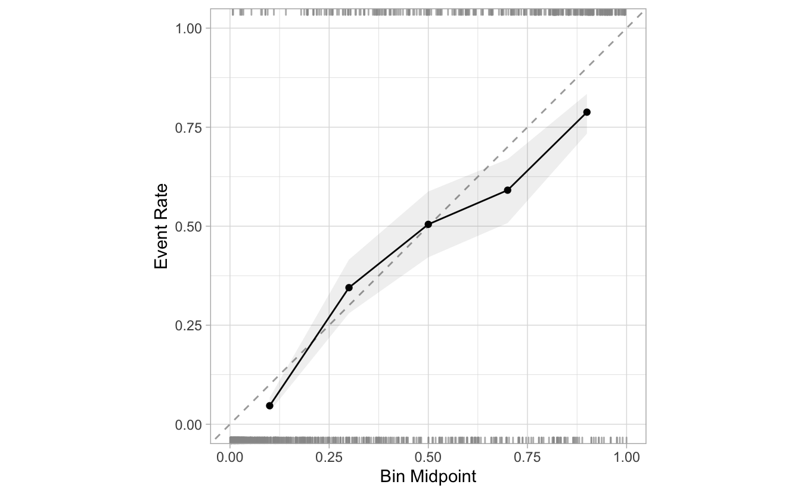
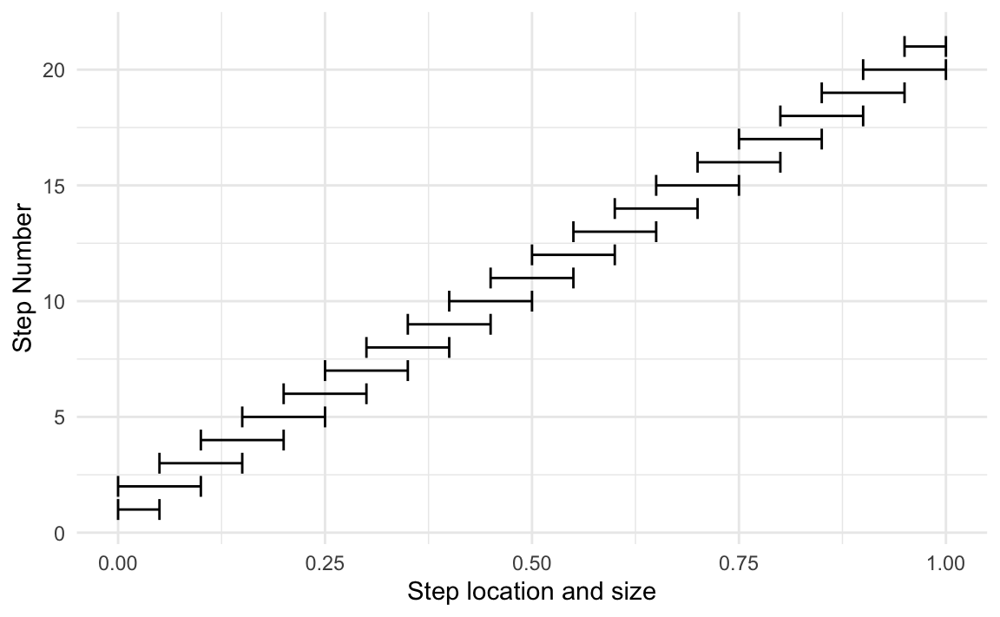
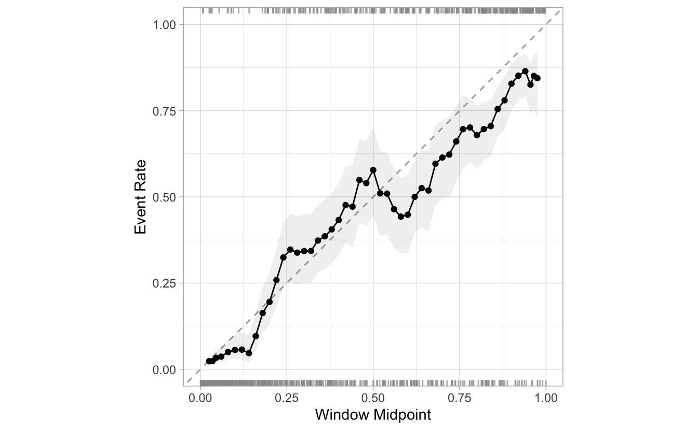
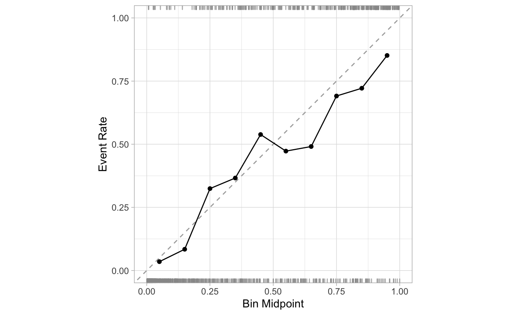
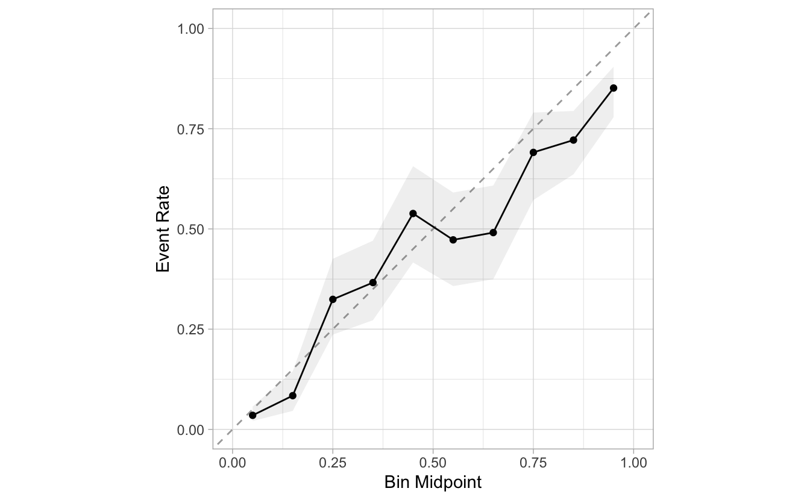
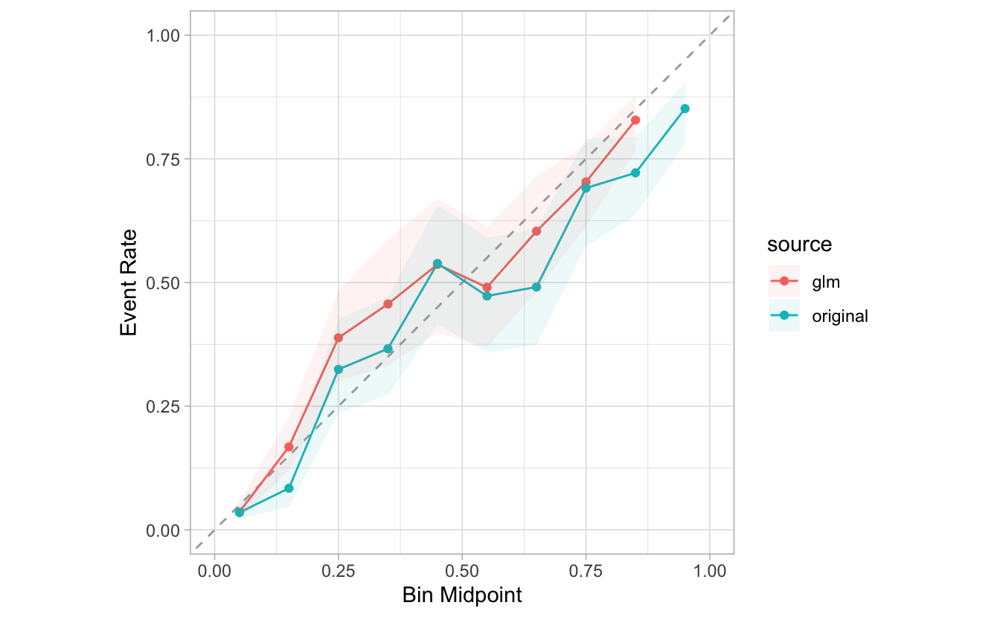
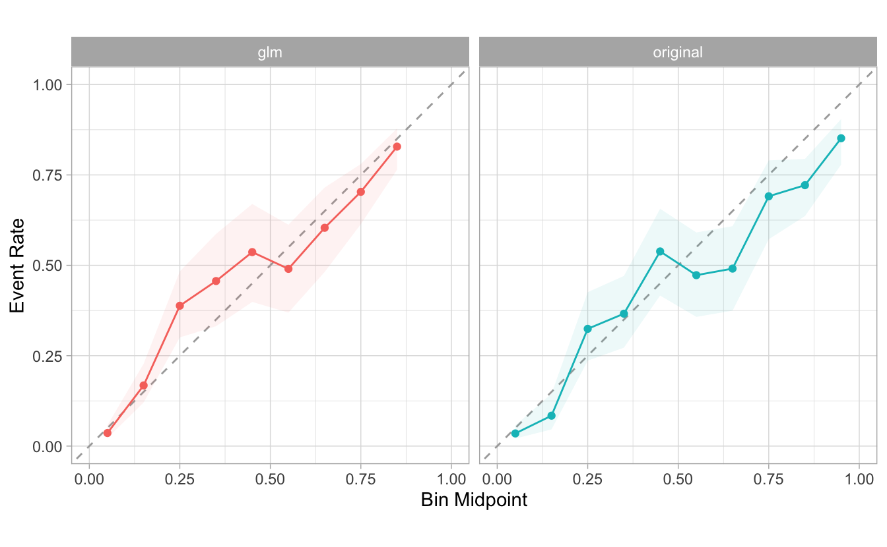

<!--
TODO:
* [ ] Look over / edit the post's title in the yaml
* [ ] Edit (or delete) the description; note this appears in the Twitter card
* [ ] Pick category and tags (see existing with [`hugodown::tidy_show_meta()`](https://rdrr.io/pkg/hugodown/man/use_tidy_post.html))
* [ ] Find photo & update yaml metadata
* [ ] Create `thumbnail-sq.jpg`; height and width should be equal
* [ ] Create `thumbnail-wd.jpg`; width should be >5x height
* [ ] [`hugodown::use_tidy_thumbnails()`](https://rdrr.io/pkg/hugodown/man/use_tidy_post.html)
* [ ] Add intro sentence, e.g. the standard tagline for the package
* [ ] [`usethis::use_tidy_thanks()`](https://usethis.r-lib.org/reference/use_tidy_thanks.html)
-->

I am very excited to introduce work currently underway. We are looking to create early awareness, and to receive feedback from the community. That is why the enhancements discussed here are not yet in CRAN. As probably inferred by the title and description, the work centers around bringing Model Calibration to Tidymodels.

Even though the article is meant to introduce new package functionality. We also have the goal of introducing Model Calibration conceptually. We want to provide sufficient background for those who may not be familiar with Model Calibration. If you are already familiar with this technique, feel free to skip to the [Setup](#setup) section to get started.

## Model Calibration

*The goal of Model Calibration is to improve the accuracy of predictions.* It does this by adjusting the prediction's probabilities. Meaning that the predicted outcome may change based on the established threshold.

For example, a prediction could say that it is 60% certain of a result of "Yes". But, after applying the calibration, the new probability is now 45%. If the threshold is set to 50%, the new predicted outcome is now set to "No".

There are two main components to Model Calibration:

-   **Diagnosis** - Figuring out how well the original, and calibrated probabilities perform
-   **Remediation** - Calculating, and applying the calibration

## The plan

As with everything in machine learning, there are several options to consider when calibrating a model. Through the new features in the Tidymodels packages, we aspire to make those options as easily accessible as possible.

Our plan is to implement Model Calibration in two phases: The first phase will focus on binary models, and the second phase will focus on multi-class models.

The first batch of enhancements are now available in the development version of `probably`. The enhancements are centered around plotting functions meant for **diagnosing** the prediction's performance. These are more commonly known as **Calibration Plots**.

## Calibration plots

The idea behind a Calibration Plot is that if we group the predictions based on their probability, then we should see an percentage of events [^1] that match such probability.

For example, if we group all of the predictions with 10% probability. We should expect that about 10% of the those in the group are indeed events. We should also expect about 20% of those with 20% probability to be events, and so forth.

The Calibration Plot for the ideal model will essentially be perfect incline line that start at 0,0 and ends in 1,1. But, as with everything in real life, there is really no model that can accomplish this. Sometimes the model will predict a 10% probability, and no event is found. Which means that those probabilities should be adjusted down to 0.

Here is an example of the new Calibration Plots in `probably`. We will discuss the particulars of the functions in the next section. For now, we are simply introducing what the plot would look like:

In the case of this model, in can see that the group in the about 40% probability (Bin Midpoint) actually has about 60% event rate. If we were to calibrate our model, and increase the probability for those, then these could change the predicted outcome, assuming that the threshold is set for 50%. On the other hand, those with 55% - 60% probability, seem have an event rate under 50%. Those could also be calibrated to change the prediction, if again, the threshold is set to 50%.

That is the power of calibrating probabilities. The trick is knowing where to calibrate, and which direction to adjust (up or down).

## Setup

To try out the new calibration plots, install the development version of `probably`:

<pre class='chroma'><code class='language-r' data-lang='r'>remotes::<a href='https://remotes.r-lib.org/reference/install_github.html'>install_github</a>("tidymodels/probably")</code></pre>

If you would like to follow along, load the `probably` and `dplyr` packages into you R session.

<pre class='chroma'><code class='language-r' data-lang='r'><a href='https://rdrr.io/r/base/library.html'>library</a>(<a href='https://github.com/tidymodels/probably/'>probably</a>)
<a href='https://rdrr.io/r/base/library.html'>library</a>(<a href='https://dplyr.tidyverse.org'>dplyr</a>)</code></pre>

`probably` comes with a few data sets. For most of the examples in this post, we will use `segment_logistic`. It is an example data set that contains predictions, and their probabilities. `Class` contains the outcome of "good" and "poor", `.pred_good` contains the probability that the event is "good".

<pre class='chroma'><code class='language-r' data-lang='r'>segment_logistic
#&gt; # A tibble: 1,010 × 3
#&gt;    .pred_poor .pred_good Class
#&gt;  *      &lt;dbl&gt;      &lt;dbl&gt; &lt;fct&gt;
#&gt;  1    0.986      0.0142  poor 
#&gt;  2    0.897      0.103   poor 
#&gt;  3    0.118      0.882   good 
#&gt;  4    0.102      0.898   good 
#&gt;  5    0.991      0.00914 poor 
#&gt;  6    0.633      0.367   good 
#&gt;  7    0.770      0.230   good 
#&gt;  8    0.00842    0.992   good 
#&gt;  9    0.995      0.00458 poor 
#&gt; 10    0.765      0.235   poor 
#&gt; # … with 1,000 more rows</code></pre>

## Binned plot

On smaller data sets, it is a challenging to obtain an accurate *event rate* for a given probability. For example, if there are 5 predictions with a 50% probability, and 3 of those are events, the plot would show a 60% event rate. This comparison would not be appropriate because there are no enough predictions to really determine how close to 50% the model really is.

The most common approach to plotting the performance, is to group the probabilities into bins, or buckets. Usually, the data is split into 10 discrete buckets, from 0 to 1 (0 - 100%). The *event rate* and the *median of the probabilities* is calculated for each bin.

In `probably`, binned calibration plots can be created using [`cal_plot_breaks()`](https://probably.tidymodels.org/reference/cal_plot_breaks.html). It expects a data set, and the un-quoted variable names that contains the events (`truth`), and the probabilities (`estimate`). For the example here, we pass the `segment_logistic` data set, and use `Class` and `.pred_good` as the arguments. By default, this function will create a calibration plot with 10 buckets (breaks):

<pre class='chroma'><code class='language-r' data-lang='r'>segment_logistic <a href='https://magrittr.tidyverse.org/reference/pipe.html'>%&gt;%</a> 
  <a href='https://probably.tidymodels.org/reference/cal_plot_breaks.html'>cal_plot_breaks</a>(Class, .pred_good)
</code></pre>

The number of bins in [`cal_plot_breaks()`](https://probably.tidymodels.org/reference/cal_plot_breaks.html) can be adjusted using `num_breaks`. Here is an example of what the plot looks like if we reduce the bins from 10, to 5:

<pre class='chroma'><code class='language-r' data-lang='r'>segment_logistic <a href='https://magrittr.tidyverse.org/reference/pipe.html'>%&gt;%</a> 
  <a href='https://probably.tidymodels.org/reference/cal_plot_breaks.html'>cal_plot_breaks</a>(Class, .pred_good, num_breaks = 5 )
</code></pre>

## Windowed

Another approach is to use overlapping ranges, or windows. We can calculate the midpoint and the event rate for each of the windows. And because we are plotting the median for each window, even though the ranges overlap, the midpoints will not. This method reduces the risk of any discrete bin over or under estimating the event rate.

There are two variables that control the windows. The **step size**, controls the frequency of the windows. If we set a step size of 5%, will create a new window every 5% probability (5%, 10%, 15%... etc). The second argument is **window size**. This defines how big the the window is. If it is set to %10, then a given step will overlap halfway into the previous step, as well as the next step. Here is a visual representation of this specific scenario:

In `probably`, the [`cal_plot_windowed()`](https://probably.tidymodels.org/reference/cal_plot_breaks.html) function provides this functionality. The default step size is 0.05, and can be changed via the `step_size` argument. The default window size is 0.1, and can be changed via the `window_size` argument.

<pre class='chroma'><code class='language-r' data-lang='r'>segment_logistic <a href='https://magrittr.tidyverse.org/reference/pipe.html'>%&gt;%</a> 
  <a href='https://probably.tidymodels.org/reference/cal_plot_breaks.html'>cal_plot_windowed</a>(Class, .pred_good)
</code></pre>

Here is an example of reducing the `step_size` from 0.05, to 0.02. There are more than double the windows:

<pre class='chroma'><code class='language-r' data-lang='r'>segment_logistic <a href='https://magrittr.tidyverse.org/reference/pipe.html'>%&gt;%</a> 
  <a href='https://probably.tidymodels.org/reference/cal_plot_breaks.html'>cal_plot_windowed</a>(Class, .pred_good, step_size = 0.02)
</code></pre>

## Logistic

Another way to visualize the performance is to fit a regression model of the events against the probabilities. This is helpful because it avoids the use of pre-determined groupings. Another difference, is that we are not plotting midpoints of actual results, but rather predictions based on those results.

The [`cal_plot_logistic()`](https://probably.tidymodels.org/reference/cal_plot_breaks.html) provides this functionality. By default, it uses a logistic spline model, provided by the `mgcv` package. The idea is to visualize a smooth line based on the predictions:

<pre class='chroma'><code class='language-r' data-lang='r'>segment_logistic <a href='https://magrittr.tidyverse.org/reference/pipe.html'>%&gt;%</a> 
  <a href='https://probably.tidymodels.org/reference/cal_plot_breaks.html'>cal_plot_logistic</a>(Class, .pred_good)
</code></pre>

If smoothing is not needed, a more straightforward logistic model can be used to fit the probabilities. By setting the `smooth` argument to `FALSE`, will make the function switch to the results from a [`glm()`](https://rdrr.io/r/stats/glm.html) model as the base of the visualization.

<pre class='chroma'><code class='language-r' data-lang='r'>segment_logistic <a href='https://magrittr.tidyverse.org/reference/pipe.html'>%&gt;%</a> 
  <a href='https://probably.tidymodels.org/reference/cal_plot_breaks.html'>cal_plot_logistic</a>(Class, .pred_good, smooth = FALSE)
</code></pre>

## Additional options and features

### Intervals

The confidence intervals are visualized using the gray ribbon. The default interval is 0.9, but can be changed using the `conf_level` argument.

<pre class='chroma'><code class='language-r' data-lang='r'>segment_logistic <a href='https://magrittr.tidyverse.org/reference/pipe.html'>%&gt;%</a> 
  <a href='https://probably.tidymodels.org/reference/cal_plot_breaks.html'>cal_plot_breaks</a>(Class, .pred_good, conf_level = 0.8)
</code></pre>

If desired, the intervals can be removed by setting the `include_ribbon` argument to `FALSE`.

<pre class='chroma'><code class='language-r' data-lang='r'>segment_logistic <a href='https://magrittr.tidyverse.org/reference/pipe.html'>%&gt;%</a> 
  <a href='https://probably.tidymodels.org/reference/cal_plot_breaks.html'>cal_plot_breaks</a>(Class, .pred_good, include_ribbon = FALSE)
</code></pre>

### Rugs

By default, the calibration plots include a RUGs layer at the top and at the bottom of the visualization. They are meant to give us an idea of the density of events, versus the density of non-events as the probabilities progress from 0 to 1.

This can layer can be removed by setting `include_rug` to `FALSE`:

<pre class='chroma'><code class='language-r' data-lang='r'>segment_logistic <a href='https://magrittr.tidyverse.org/reference/pipe.html'>%&gt;%</a> 
  <a href='https://probably.tidymodels.org/reference/cal_plot_breaks.html'>cal_plot_breaks</a>(Class, .pred_good, include_rug = FALSE) 
</code></pre>

## Integration with `tune`

The calibration plots in `probably` support `tune_results` objects. The functions read the metadata from the `tune` object, and the `truth` and `estimate` arguments automatically.

To showcase this feature, we will tune a model based on simulated data. In order for the calibration plot to work, the predictions need to be collected. This is done by setting `save_pred` to `TRUE`.

<pre class='chroma'><code class='language-r' data-lang='r'><a href='https://rdrr.io/r/base/library.html'>library</a>(<a href='https://tidymodels.tidymodels.org'>tidymodels</a>)

<a href='https://rdrr.io/r/base/Random.html'>set.seed</a>(111)

sim_data &lt;- sim_classification(500)

rec &lt;- recipe(class ~ ., data = sim_data) <a href='https://magrittr.tidyverse.org/reference/pipe.html'>%&gt;%</a>
  step_ns(linear_01, deg_free = tune("linear_01"))

tuned_model &lt;- tune_grid(
  object = set_engine(logistic_reg(), "glm"),
  preprocessor = rec,
  resamples = vfold_cv(sim_data, v = 2, repeats = 3),
  
  # Important: `saved_pred` has to be set to TRUE in order for 
  #the plotting to be possible
  
  control = control_resamples(save_pred = TRUE)
)

tuned_model</code></pre>

The plotting functions will automatically collect the predictions. Each of the pre-processing groups will be plotted individually in its own facet.

<pre class='chroma'><code class='language-r' data-lang='r'>tuned_model <a href='https://magrittr.tidyverse.org/reference/pipe.html'>%&gt;%</a> 
  <a href='https://probably.tidymodels.org/reference/cal_plot_breaks.html'>cal_plot_breaks</a>()</code></pre>

## Preparing for the next stage

As mentioned in the outset of this post, the goal is to also provide a way to calibrate the model, and to apply the calibration to future predictions. We have made sure that the plotting functions are ready now to accept multiple probability sets.

In this post, we will showcase that functionality by "manually" creating a quick calibration model, we we can use it to compare to the original probabilities. We will need both of them to be on the same data frame, and to have a way of distinguishing the original probabilities from the calibrated probabilities. In this case we will create a variable called `source`:

<pre class='chroma'><code class='language-r' data-lang='r'>model &lt;- <a href='https://rdrr.io/r/stats/glm.html'>glm</a>(Class ~ .pred_good, segment_logistic, family = "binomial")

preds &lt;- <a href='https://rdrr.io/r/stats/predict.html'>predict</a>(model, segment_logistic, type = "response")
  
combined &lt;- <a href='https://dplyr.tidyverse.org/reference/bind.html'>bind_rows</a>(
  <a href='https://dplyr.tidyverse.org/reference/mutate.html'>mutate</a>(segment_logistic, source = "original"), 
  <a href='https://dplyr.tidyverse.org/reference/mutate.html'>mutate</a>(segment_logistic, .pred_good = 1 - preds, source = "glm")
  )

combined 
#&gt; # A tibble: 2,020 × 4
#&gt;    .pred_poor .pred_good Class source  
#&gt;         &lt;dbl&gt;      &lt;dbl&gt; &lt;fct&gt; &lt;chr&gt;   
#&gt;  1    0.986      0.0142  poor  original
#&gt;  2    0.897      0.103   poor  original
#&gt;  3    0.118      0.882   good  original
#&gt;  4    0.102      0.898   good  original
#&gt;  5    0.991      0.00914 poor  original
#&gt;  6    0.633      0.367   good  original
#&gt;  7    0.770      0.230   good  original
#&gt;  8    0.00842    0.992   good  original
#&gt;  9    0.995      0.00458 poor  original
#&gt; 10    0.765      0.235   poor  original
#&gt; # … with 2,010 more rows</code></pre>

The new plot functions support `dplyr` groupings. So, to overlay the two groups, we just need to pass `source` to [`group_by()`](https://dplyr.tidyverse.org/reference/group_by.html):

<pre class='chroma'><code class='language-r' data-lang='r'>combined <a href='https://magrittr.tidyverse.org/reference/pipe.html'>%&gt;%</a>
  <a href='https://dplyr.tidyverse.org/reference/group_by.html'>group_by</a>(source) <a href='https://magrittr.tidyverse.org/reference/pipe.html'>%&gt;%</a>
  <a href='https://probably.tidymodels.org/reference/cal_plot_breaks.html'>cal_plot_breaks</a>(Class, .pred_good)
</code></pre>

If we would like to plot them side by side, we can add [`facet_wrap()`](https://ggplot2.tidyverse.org/reference/facet_wrap.html) as an additional step of the plot:

<pre class='chroma'><code class='language-r' data-lang='r'><a href='https://rdrr.io/r/base/library.html'>library</a>(<a href='https://ggplot2.tidyverse.org'>ggplot2</a>)

combined <a href='https://magrittr.tidyverse.org/reference/pipe.html'>%&gt;%</a> 
  <a href='https://dplyr.tidyverse.org/reference/group_by.html'>group_by</a>(source) <a href='https://magrittr.tidyverse.org/reference/pipe.html'>%&gt;%</a> 
  <a href='https://probably.tidymodels.org/reference/cal_plot_breaks.html'>cal_plot_breaks</a>(Class, .pred_good) +
  <a href='https://ggplot2.tidyverse.org/reference/facet_wrap.html'>facet_wrap</a>(~source) +
  <a href='https://ggplot2.tidyverse.org/reference/theme.html'>theme</a>(legend.position = "none")
</code></pre>

Our goal in the future is to provide calibration functions that create the models, and provide an easy way to visualize.

## Conclusion

As mentioned at the top of this post. We look forward to your feedback as you try out these features, and read about our plans for the new future. If you wish to send us your thoughts, feel free to open an issue in `probably`'s GitHub repo here: <https://github.com/tidymodels/probably/issues>.

[^1]: We can think of an **event** as the outcome that is being tracked by the probability. For example, in a model predicting "heads" or "tails", and we want to calibrate the probability for "tails", then the **event** is when the column containing the outcome, has the value of "tails".

