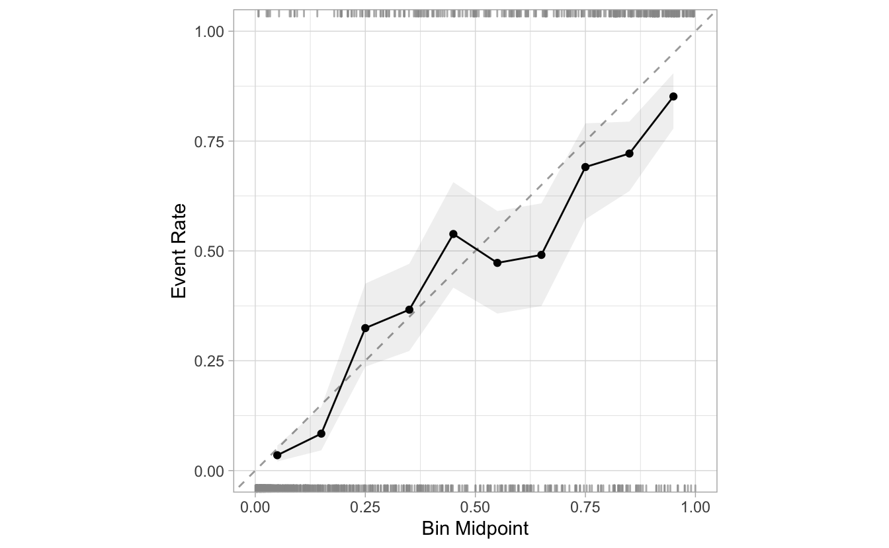

<!--
TODO:
* [ ] Look over / edit the post's title in the yaml
* [ ] Edit (or delete) the description; note this appears in the Twitter card
* [ ] Pick category and tags (see existing with [`hugodown::tidy_show_meta()`](https://rdrr.io/pkg/hugodown/man/use_tidy_post.html))
* [ ] Find photo & update yaml metadata
* [ ] Create `thumbnail-sq.jpg`; height and width should be equal
* [ ] Create `thumbnail-wd.jpg`; width should be >5x height
* [ ] [`hugodown::use_tidy_thumbnails()`](https://rdrr.io/pkg/hugodown/man/use_tidy_post.html)
* [ ] Add intro sentence, e.g. the standard tagline for the package
* [ ] [`usethis::use_tidy_thanks()`](https://usethis.r-lib.org/reference/use_tidy_thanks.html)
-->

I am very excited to introduce the work currently underway. These changes are not yet in the CRAN versions of the packages. We opted to write this post to create early awareness, and to recieve feedback from the community. For Model Calibration, the main driver will be the `probably` package, but there is an upcoming update to `yardstick` that will also apply to the calibration process.

<pre class='chroma'><code class='language-r' data-lang='r'>remotes::<a href='https://remotes.r-lib.org/reference/install_github.html'>install_github</a>("tidymodels/probably")</code></pre>

<pre class='chroma'><code class='language-r' data-lang='r'><a href='https://rdrr.io/r/base/library.html'>library</a>(<a href='https://github.com/tidymodels/probably/'>probably</a>)
<a href='https://rdrr.io/r/base/library.html'>library</a>(<a href='https://dplyr.tidyverse.org'>dplyr</a>)</code></pre>

<pre class='chroma'><code class='language-r' data-lang='r'>segment_logistic
#&gt; # A tibble: 1,010 × 3
#&gt;    .pred_poor .pred_good Class
#&gt;  *      &lt;dbl&gt;      &lt;dbl&gt; &lt;fct&gt;
#&gt;  1    0.986      0.0142  poor 
#&gt;  2    0.897      0.103   poor 
#&gt;  3    0.118      0.882   good 
#&gt;  4    0.102      0.898   good 
#&gt;  5    0.991      0.00914 poor 
#&gt;  6    0.633      0.367   good 
#&gt;  7    0.770      0.230   good 
#&gt;  8    0.00842    0.992   good 
#&gt;  9    0.995      0.00458 poor 
#&gt; 10    0.765      0.235   poor 
#&gt; # … with 1,000 more rows</code></pre>

## Breaks (Bins)

<pre class='chroma'><code class='language-r' data-lang='r'>segment_logistic <a href='https://magrittr.tidyverse.org/reference/pipe.html'>%&gt;%</a> 
  <a href='https://probably.tidymodels.org/reference/cal_plot_breaks.html'>cal_plot_breaks</a>(Class, .pred_good)
</code></pre>

<pre class='chroma'><code class='language-r' data-lang='r'>segment_logistic <a href='https://magrittr.tidyverse.org/reference/pipe.html'>%&gt;%</a> 
  <a href='https://probably.tidymodels.org/reference/cal_plot_breaks.html'>cal_plot_breaks</a>(Class, .pred_good, num_breaks = 5)
</code></pre>

## Logistic

<pre class='chroma'><code class='language-r' data-lang='r'>segment_logistic <a href='https://magrittr.tidyverse.org/reference/pipe.html'>%&gt;%</a> 
  <a href='https://probably.tidymodels.org/reference/cal_plot_breaks.html'>cal_plot_logistic</a>(Class, .pred_good)
</code></pre>

<pre class='chroma'><code class='language-r' data-lang='r'>segment_logistic <a href='https://magrittr.tidyverse.org/reference/pipe.html'>%&gt;%</a> 
  <a href='https://probably.tidymodels.org/reference/cal_plot_breaks.html'>cal_plot_logistic</a>(Class, .pred_good, smooth = FALSE)
</code></pre>

## Windowed

<pre class='chroma'><code class='language-r' data-lang='r'>segment_logistic <a href='https://magrittr.tidyverse.org/reference/pipe.html'>%&gt;%</a> 
  <a href='https://probably.tidymodels.org/reference/cal_plot_breaks.html'>cal_plot_windowed</a>(Class, .pred_good)
</code></pre>

<pre class='chroma'><code class='language-r' data-lang='r'>segment_logistic <a href='https://magrittr.tidyverse.org/reference/pipe.html'>%&gt;%</a> 
  <a href='https://probably.tidymodels.org/reference/cal_plot_breaks.html'>cal_plot_windowed</a>(Class, .pred_good, step_size = 0.1)
</code></pre>

## Additional options

<pre class='chroma'><code class='language-r' data-lang='r'>segment_logistic <a href='https://magrittr.tidyverse.org/reference/pipe.html'>%&gt;%</a> 
  <a href='https://probably.tidymodels.org/reference/cal_plot_breaks.html'>cal_plot_breaks</a>(Class, .pred_good, conf_level = 0.8)
</code></pre>

<pre class='chroma'><code class='language-r' data-lang='r'>segment_logistic <a href='https://magrittr.tidyverse.org/reference/pipe.html'>%&gt;%</a> 
  <a href='https://probably.tidymodels.org/reference/cal_plot_breaks.html'>cal_plot_windowed</a>(Class, .pred_good, include_points = FALSE)
</code></pre>

## `tune` results

<pre class='chroma'><code class='language-r' data-lang='r'><a href='https://rdrr.io/r/base/Random.html'>set.seed</a>(111)

sim_data &lt;- sim_classification(500)

rec &lt;- recipe(class ~ ., data = sim_data) <a href='https://magrittr.tidyverse.org/reference/pipe.html'>%&gt;%</a>
  step_ns(linear_01, deg_free = tune("linear_01"))

tuned_model &lt;- tune_grid(
  object = set_engine(logistic_reg(), "glm"),
  preprocessor = rec,
  resamples = vfold_cv(sim_data, v = 2, repeats = 3),
  control = control_resamples(save_pred = TRUE)
)</code></pre>

<pre class='chroma'><code class='language-r' data-lang='r'>tuned_model <a href='https://magrittr.tidyverse.org/reference/pipe.html'>%&gt;%</a> 
  <a href='https://probably.tidymodels.org/reference/cal_plot_breaks.html'>cal_plot_breaks</a>()
</code></pre>

