I'm extremely pleased to present the culmination of several years of work on font rendering, spanning the [systemfonts](https://github.com/r-lib/systemfonts), [textshaping](https://github.com/r-lib/textshaping), and [ragg](https://ragg.r-lib.org) packages. These releases complete our efforts to create a high-quality, performant raster graphics device that works comparably on every operating system.

The result of the latest work is that font rendering in the ragg graphics devices now just works, regardless of what you throw at it.

This includes:

1.  Support for non-Latin scripts including Right-to-Left (RtL) scripts.
2.  Support for OpenType features such as ligatures, glyph substitutions, etc.
3.  Support for color fonts
4.  Support for font fallback

All of the above comes in addition to the fact that ragg is able to use all of your installed fonts.

The tl;dr of it is that all areas mentioned above now has full support in ragg out of the box, but I'd invite you to read on to learn how it works, how to control it, and what it all means for you as a user.

### Using ragg

-   ragg can be used directly in the same way as the build-in devices, such as [`png()`](https://rdrr.io/r/grDevices/png.html), [`jpeg()`](https://rdrr.io/r/grDevices/png.html), and [`tiff()`](https://rdrr.io/r/grDevices/png.html), by opening the device, running some code that renders graphics, and closing it again when done using [`dev.off()`](https://rdrr.io/r/grDevices/dev.html). The devices in ragg are prefixed with `agg_` and named by the file format they produce (e.g. [`agg_png()`](https://ragg.r-lib.org/reference/agg_png.html)).

-   You can use ragg with [`ggsave()`](https://ggplot2.tidyverse.org/reference/ggsave.html) by passing the device function to the `device` argument (e.g. [`ggsave(device = agg_tiff)`](https://ggplot2.tidyverse.org/reference/ggsave.html)).

-   You can tell RStudio to use ragg in the *Plots* pane be setting the backend to `AGG` under *Global Options &gt; General &gt; Graphics*.

-   ragg can be used when knitting Rmarkdown files by setting `dev="ragg_png"` in the code chunk options

Read more about using ragg in the previous release blog posts: [0.2.0](https://www.tidyverse.org/blog/2020/05/updates-to-ragg-and-systemfonts/) and [0.1.0](https://www.tidyverse.org/blog/2019/07/ragg-0-1-0/)

### Graphical tl;dr;

With the new version of ragg you'll be able to render plots such as this and expect it to simply work:

<pre class='chroma'><code class='language-r' data-lang='r'><a href='https://rdrr.io/r/base/library.html'>library</a>(<a href='http://ggplot2.tidyverse.org'>ggplot2</a>)
city_names &lt;- <a href='https://rdrr.io/r/base/c.html'>c</a>(
  "Tokyo (東京)",
  "Yokohama (横浜)",
  "Osaka (大阪市)",
  "Nagoya (名古屋市)",
  "Sapporo (札幌市)",
  "Kobe (神戸市)",
  "Kyoto (京都市)",
  "Fukuoka (福岡市)",
  "Kawasaki (川崎市)",
  "Saitama (さいたま市)"
)
main_cities &lt;- <a href='https://rdrr.io/r/base/data.frame.html'>data.frame</a>(
  name = city_names,
  lat = <a href='https://rdrr.io/r/base/c.html'>c</a>(35.690, 35.444, 34.694, 35.183, 43.067, 
          34.69, 35.012, 33.583, 35.517, 35.861),
  lon = <a href='https://rdrr.io/r/base/c.html'>c</a>(139.692, 139.638, 135.502, 136.9, 141.35, 
          135.196, 135.768, 130.4, 139.7, 139.646)
)
japan &lt;- rnaturalearth::<a href='https://rdrr.io/pkg/rnaturalearth/man/ne_countries.html'>ne_countries</a>(
  scale = 10, 
  country = "Japan", 
  returnclass = "sf"
)
<a href='https://ggplot2.tidyverse.org/reference/ggplot.html'>ggplot</a>() + 
  <a href='https://ggplot2.tidyverse.org/reference/ggsf.html'>geom_sf</a>(
    data = japan, 
    fill = "forestgreen", 
    colour = "grey10", 
    size = 0.2
  ) + 
  ggrepel::<a href='https://rdrr.io/pkg/ggrepel/man/geom_text_repel.html'>geom_label_repel</a>(
    <a href='https://ggplot2.tidyverse.org/reference/aes.html'>aes</a>(lon, lat, label = name), 
    data = main_cities,
    fill = "#FFFFFF88",
    box.padding = <a href='https://rdrr.io/r/grid/unit.html'>unit</a>(5, "mm")
  ) + 
  <a href='https://ggplot2.tidyverse.org/reference/geom_point.html'>geom_point</a>(<a href='https://ggplot2.tidyverse.org/reference/aes.html'>aes</a>(lon, lat), main_cities) +
  <a href='https://ggplot2.tidyverse.org/reference/labs.html'>ggtitle</a>(
    "Location of largest cities in Japan (日本) 🇯🇵"
  ) +
  <a href='https://ggplot2.tidyverse.org/reference/ggtheme.html'>theme_void</a>() + 
  <a href='https://ggplot2.tidyverse.org/reference/theme.html'>theme</a>(panel.background = <a href='https://ggplot2.tidyverse.org/reference/element.html'>element_rect</a>("steelblue"),
        plot.title = <a href='https://ggplot2.tidyverse.org/reference/element.html'>element_text</a>(margin = <a href='https://ggplot2.tidyverse.org/reference/element.html'>margin</a>(5, 0, 5, 0)))

</code></pre>
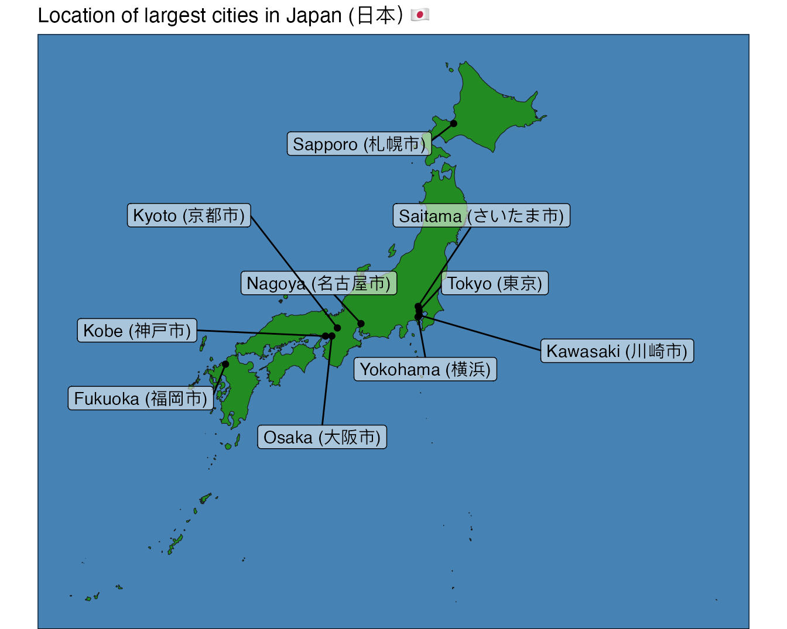

Pay note to the effortless mix of text in English and Japanese, along with emoji in the title. If this has piqued your interest, read on!

Advanced script support
-----------------------

English, the lingua franca of programming, has tended to dominate everything related to text within programming, ranging from encoding to rendering. This has made the Latin script, used in most of the Western world, the best (or often only) supported script in many text rendering pipelines. This has been true in the R world where the built-in graphic devices have struggled to display other scripts (the only exception being Cairo devices on Linux). It is about time (overdue, really!) that the graphics system in R becomes more inclusive of which languages can be used. It is thus with great joy that I announce that ragg finally supports all scripts.

### Right-to-Left scripts

To start off we will look at a sample of different scripts (Arabic, Hebrew, and Sindhi) that pose a challenge because they are written from right to left:

<pre class='chroma'><code class='language-r' data-lang='r'>arabic_text &lt;- "هذا مكتوب باللغة العربية"
hebrew_text &lt;- "זה כתוב בעברית"
sindhi_text &lt;- "هي سنڌيءَ ۾ لکيو ويو آهي"

p &lt;- <a href='https://ggplot2.tidyverse.org/reference/ggplot.html'>ggplot</a>() + 
  <a href='https://ggplot2.tidyverse.org/reference/geom_text.html'>geom_text</a>(
    <a href='https://ggplot2.tidyverse.org/reference/aes.html'>aes</a>(x = 0, y = 3:1, label = <a href='https://rdrr.io/r/base/c.html'>c</a>(arabic_text, hebrew_text, sindhi_text)), 
    family = "Arial"
  ) + 
  <a href='https://ggplot2.tidyverse.org/reference/expand_limits.html'>expand_limits</a>(y = <a href='https://rdrr.io/r/base/c.html'>c</a>(0, 4))

preview_devices(p, "rtl_example")
</code></pre>

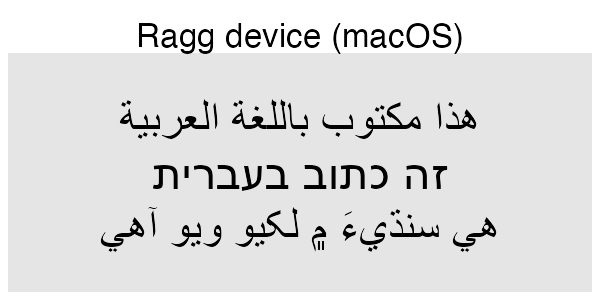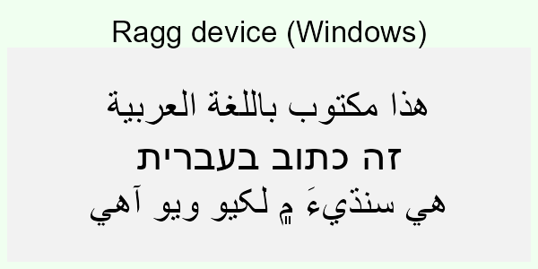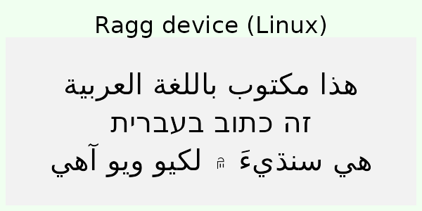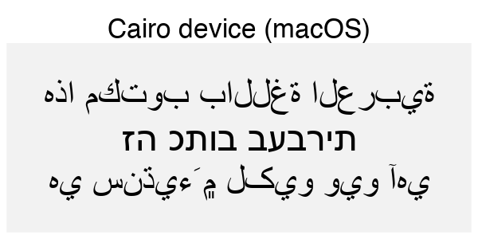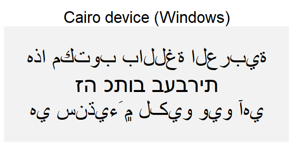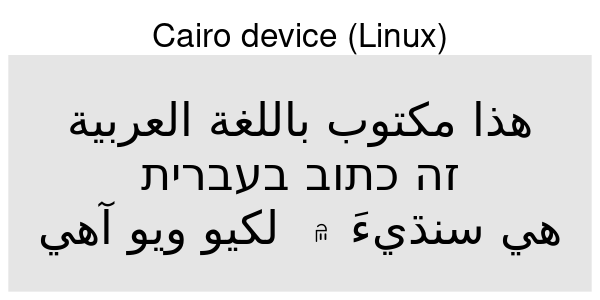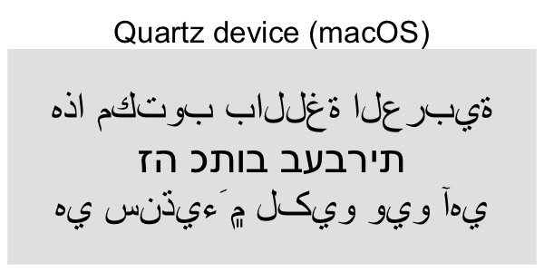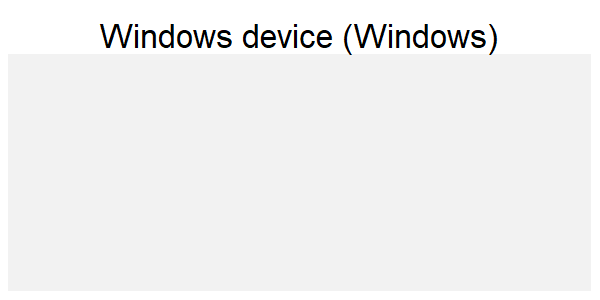

If you're not familiar with the languages above it can be hard to see what is right and what is wrong. You may, however, look at how the text in the code is rendered in the browser and compare that to the device rendering. If you do that you can see that the Hebrew script is rendered in the wrong direction for all the non-ragg devices (except Cairo on Linux). For the Arabic and Sindhi it's even harder to see what's wrong because the text looks fundamentally different. That's because both Arabic and Sindhi rely extensively on text substitution rules and ligatures; the way a letter is written depends critically on what letters it is next to. Still, by comparing to the browser rendering you can see that the same devices failing on the Hebrew script fail here as well.

The Cairo device on Linux handles this task well, as we have noted above. How come this works, but only on one OS? Cairo is built in to most Linux distributions and is designed to work with Pango, the library that linux uses to layout text. R's Cairo graphics device bundles Cairo on all platforms, but doesn't include Pango, due to the challenges of building it on other operating systems.

### Bidirectional text

What happens if you combine right-to-left and left-to-right text in the same sentence? The string needs to be split into pieces that each consist of text running in one direction, laid out individually, and then combined back together

<pre class='chroma'><code class='language-r' data-lang='r'>bidi_text &lt;- "The Hebrew (עִברִית) script\nis right-to-left"

p &lt;- <a href='https://ggplot2.tidyverse.org/reference/ggplot.html'>ggplot</a>() + 
  <a href='https://ggplot2.tidyverse.org/reference/geom_text.html'>geom_text</a>(
    <a href='https://ggplot2.tidyverse.org/reference/aes.html'>aes</a>(x = 0, y = 0, label = bidi_text), 
    family = "Arial"
  )

preview_devices(p, "bidi_example")
</code></pre>

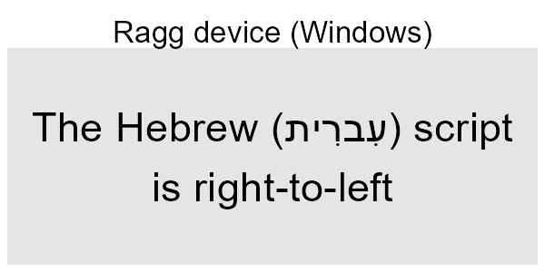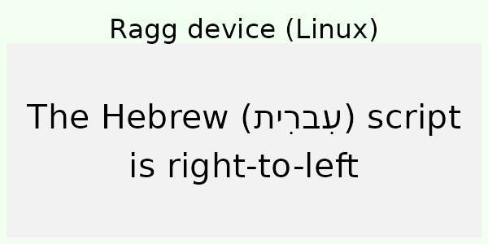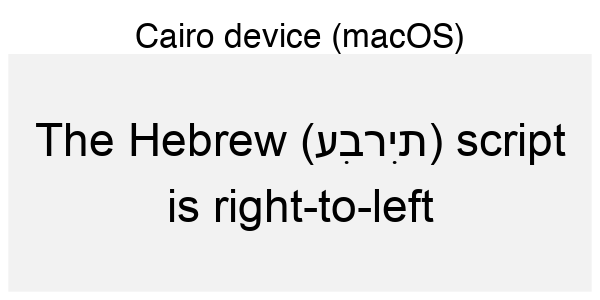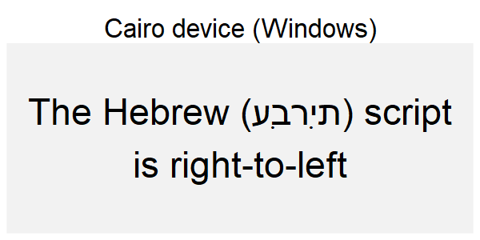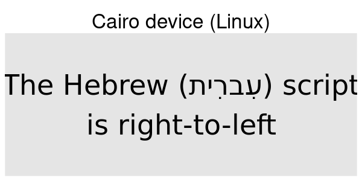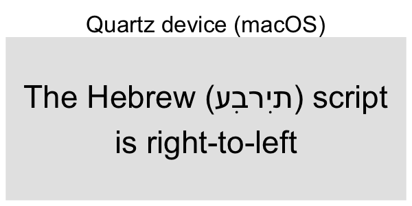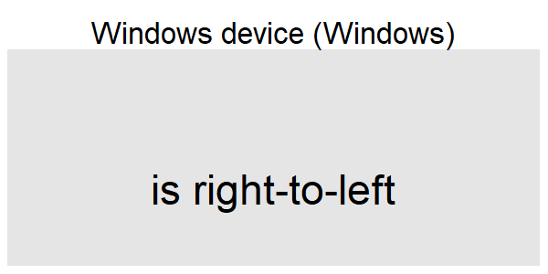

Given that most devices struggle with RtL scripts, it's not surprising that they also fail when mixed. Again the exception is ragg, and Cairo on Linux.

Advanced font feature support
-----------------------------

A part of supporting some of the non-Latin scripts described above is to have support for ligatures (substituting multiple glyphs with a single new glyph). While ligatures is a requirement for the correct rendering of some scripts it is also an optional feature of fonts in general in order to support different text variations. More generally, the OpenType font format describes a long range of features, many optional, that defines specific glyph substitutions (both one-to-one and many-to-one) or position adjustments that can be turned on or off and will affect the look of the final rendered text. Some of these features are turned on automatically for specific scripts (e.g. required ligatures for Arabic), while others are left for the user to turn on at their discretion (e.g. tabular numerics). As part of the work to add support for non-Latin scripts the infrastructure to support all OpenType features was build. This, of course, requires that the font in use supports the requested feature.

Some fonts, like the popular [Fira Code](https://github.com/tonsky/FiraCode) programming font, use ligatures as a main part of their appeal. These now work as expected with ragg:

<pre class='chroma'><code class='language-r' data-lang='r'>code &lt;- "x &lt;- y != z"
logo &lt;- "twitter"
p &lt;- <a href='https://ggplot2.tidyverse.org/reference/ggplot.html'>ggplot</a>() + 
  <a href='https://ggplot2.tidyverse.org/reference/geom_text.html'>geom_text</a>(
    <a href='https://ggplot2.tidyverse.org/reference/aes.html'>aes</a>(x = 0, y = 2, label = code), 
    family = "Fira Code"
  ) + 
  <a href='https://ggplot2.tidyverse.org/reference/geom_text.html'>geom_text</a>(
    <a href='https://ggplot2.tidyverse.org/reference/aes.html'>aes</a>(x = 0, y = 1, label = logo), 
    family = "Font Awesome 5 brands"
  ) + 
  <a href='https://ggplot2.tidyverse.org/reference/expand_limits.html'>expand_limits</a>(y = <a href='https://rdrr.io/r/base/c.html'>c</a>(0, 3))

preview_devices(p, "def_features")
</code></pre>

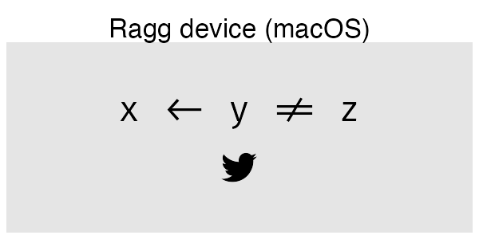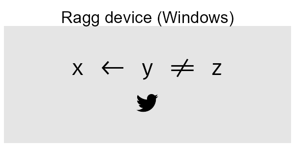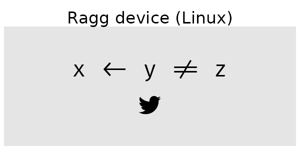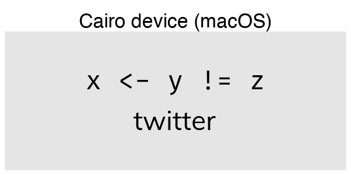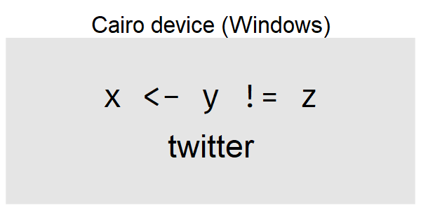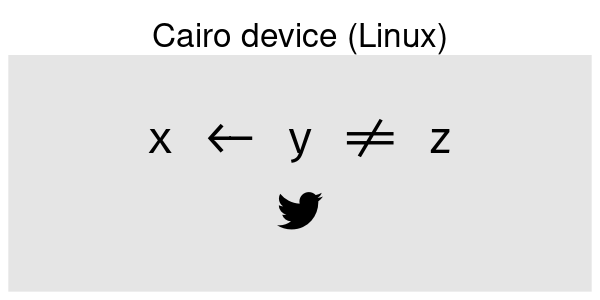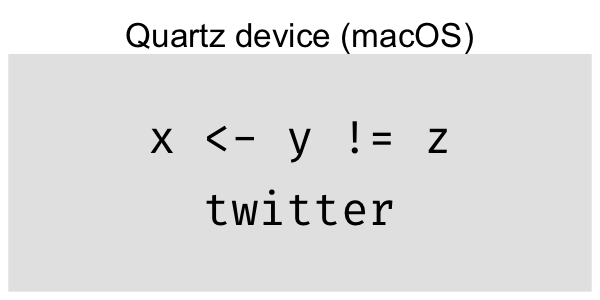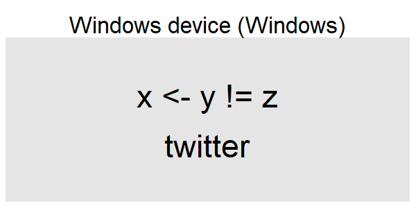

But what about non-default features? The capabilities of the graphic engine in R presents a problem here. There is very little information that the user is able to sent along with the text to be plotted, apart from location and font (**bold** and *italic* on/off is the extend of it). So, having a device with support for advanced OpenType features in and off itself is nearly useless as there is no way to specify in your plot code that you want to turn a feature on or off.

To work around this limitation, systemfonts now allows you to register font variants, providing a custom name that you can use to refer to a font with certain features enabled:

<pre class='chroma'><code class='language-r' data-lang='r'><a href='https://rdrr.io/r/base/library.html'>library</a>(<a href='https://github.com/r-lib/systemfonts'>systemfonts</a>)
<a href='https://rdrr.io/pkg/systemfonts/man/register_variant.html'>register_variant</a>(
  name = "Montserrat Extreme", 
  family = "Montserrat", 
  weight = "semibold",
  features = <a href='https://rdrr.io/pkg/systemfonts/man/font_feature.html'>font_feature</a>(ligatures = "discretionary", letters = "stylistic")
)
</code></pre>

The code above creates a new font based on Montserrat using a light weight and turning on standard ligatures and stylistic letter substitution. Now, in your text plotting code all you have to do is specify `"Montserrat Extreme"` as the font family and the features and weights will be used. This only works with ragg, because none of the other devices are build on top of systemfonts, so don't know how to access the registered font:

<pre class='chroma'><code class='language-r' data-lang='r'><a href='https://ggplot2.tidyverse.org/reference/ggplot.html'>ggplot</a>() + 
  <a href='https://ggplot2.tidyverse.org/reference/geom_text.html'>geom_text</a>(
    <a href='https://ggplot2.tidyverse.org/reference/aes.html'>aes</a>(x = 0, y = 1, label = "This text should definitely differ"),
    family = "Montserrat",
    size = 6
  ) + 
  <a href='https://ggplot2.tidyverse.org/reference/geom_text.html'>geom_text</a>(
    <a href='https://ggplot2.tidyverse.org/reference/aes.html'>aes</a>(x = 0, y = 0, label = "This text should definitely differ"),
    family = "Montserrat Extreme",
    size = 6
  ) + 
  <a href='https://ggplot2.tidyverse.org/reference/expand_limits.html'>expand_limits</a>(y = <a href='https://rdrr.io/r/base/c.html'>c</a>(-1, 2))

</code></pre>
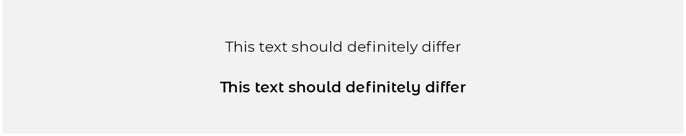

We can see that by using this font registration we gain access to weights other than normal and bold, but also to glyph substitutions such as the "Th" ligature, and the stylistic variations seen with the "t", "f", "l", and "e" glyphs.

While a lot of the optional OpenType features are mainly of interest to achieve a specific stylistic look of the rendered text, some have more importance for data visualizations, such as those related to how numbers are displayed. It is both possible to force even-width numbers, as well as correct display of fractional numbers (using `font_feature(numbers = c("tabular", "fractions")`) using OpenType as long as the font supports it, so it is definitely something to look into when you want to add that final polish to your visualization.

Color fonts
-----------

A recent (in font technology terms) development is the availability of color fonts, i.e. fonts where the glyphs have designated colors. This development is largely driven by the ubiquity of emojis in modern text, and while it may seem that emojis have been around forever, it is recent enough that the world has yet to converge to a single standard for color fonts. The system emoji font on macOS, Windows, and Linux all uses different font technologies for storing the color glyphs, ranging from storing a single bitmap, to storing each glyph as an SVG. This, unsurprisingly, complicates things. To add insult to injury, emojis often gets rendered slightly larger than the surrounding text and with a slightly lowered baseline in a very OS-specific way (this does not apply to all color fonts; only emojis).

Why am I telling you this? Well, honestly it is mostly to make you appreciate the labor that went into the fact that color fonts (and by extension, emojis) now just works:

<pre class='chroma'><code class='language-r' data-lang='r'>emojis &lt;- "👩🏾‍💻🔥📊"

p &lt;- <a href='https://ggplot2.tidyverse.org/reference/ggplot.html'>ggplot</a>() + 
  <a href='https://ggplot2.tidyverse.org/reference/geom_text.html'>geom_label</a>(
    <a href='https://ggplot2.tidyverse.org/reference/aes.html'>aes</a>(x = 0, y = 0, label = emojis), 
    family = "Apple Color Emoji"
  )

preview_devices(p, "emoji")
</code></pre>

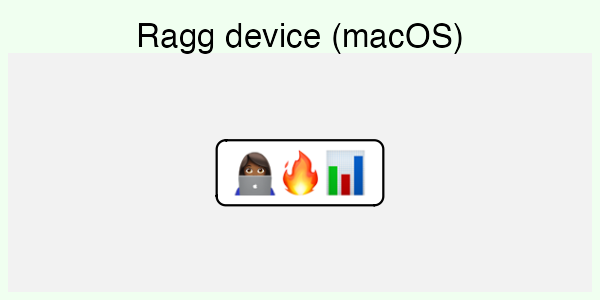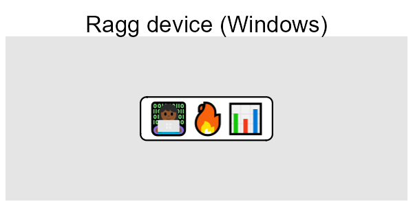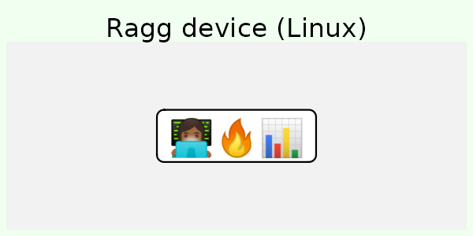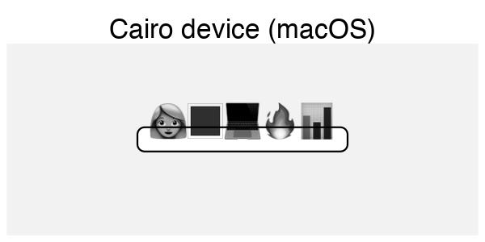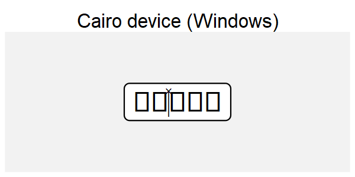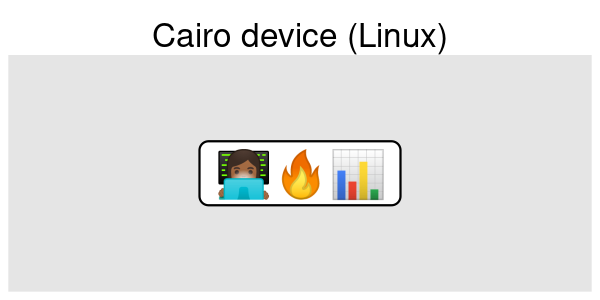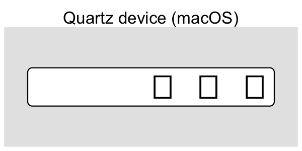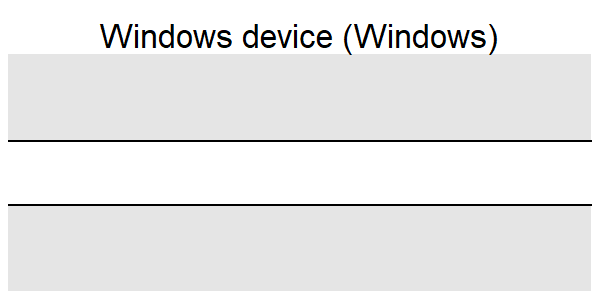

As one can see the failures range from not being able to render anything, to rendering in monochrome. Further, it appears as if the devices have trouble figuring out the dimensions of the glyphs. One additional wrinkle is that while Cairo on macOS is capable of rendering in monochrome, it fails to get the correct emoji. This is because emojis relies heavily on ligatures, and the "dark-skinned woman at a computer" emoji is actually a ligature of the "woman", "dark skin" and "computer" emojis.

Font fallback
-------------

In all of the above examples we have been very mindful in setting the font-face to a font that contains all the glyphs we need. This is not always practical, especially when you want to mix emoji and regular text. It is also an absolute requirement when mixing Latin and CJK (Chinese, Japanese, and Korean) text as it is infeasible to include all CJK glyphs in a single font. However, we are used to things just working at the system level. No matter the font it seems that a glyph is always displayed in e.g. browsers and text editors. This is because the OS is employing font fallback, which is the act of figuring out an alternative font to use when a glyph is not present in the chosen font. Wouldn't it be great if we could have that in a graphic device? Well, now we do!

<pre class='chroma'><code class='language-r' data-lang='r'>fallback_text &lt;- "This is English, この文は日本語です 🚀"

p &lt;- <a href='https://ggplot2.tidyverse.org/reference/ggplot.html'>ggplot</a>() + 
  <a href='https://ggplot2.tidyverse.org/reference/geom_text.html'>geom_text</a>(<a href='https://ggplot2.tidyverse.org/reference/aes.html'>aes</a>(x = 0, y = 0, label = fallback_text), size = 2.5)

preview_devices(p, "fallback")
</code></pre>

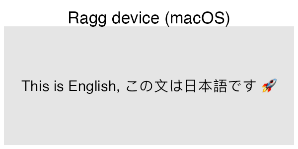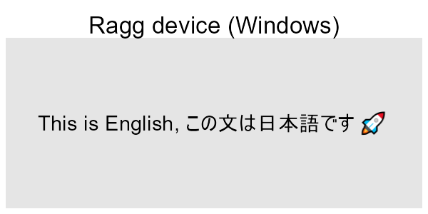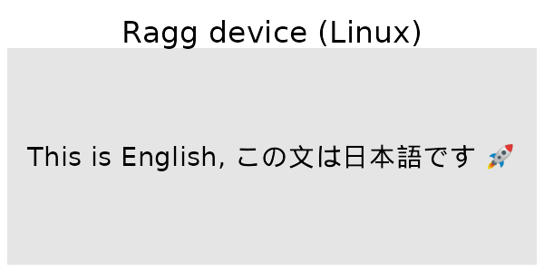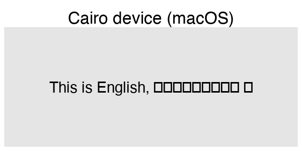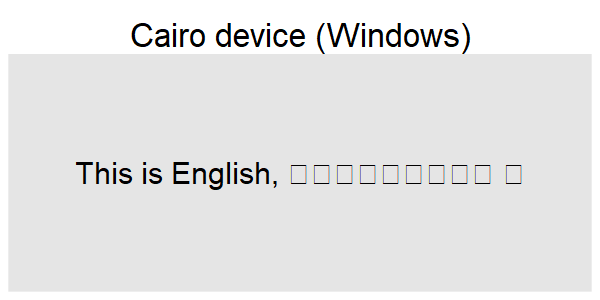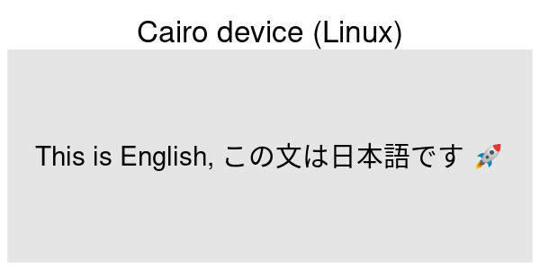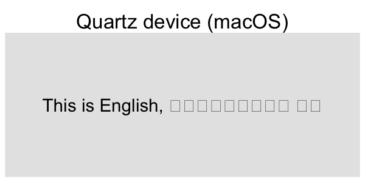

The bottom line is that with ragg, you now don't need to think about missing glyphs in any font you choose (unless you request a character that is not covered by any font on your system).

Where's the catch
-----------------

Most of what we have shown today simply works automagically and may (depending on your prior frustrations with script support in R) seem too good to be true. Is there any catch? Not really. systemfonts, textshaping, and ragg try to be as smart as possible about text shaping and only take additional action if required. Further everything is heavily cached, so the impact on performance is negligible.

There is something missing though, which we haven't touched upon. Not all scripts are LtR or RtL. A few, especially Asian scripts, are top-to-bottom. Top-to-bottom scripts are sadly not yet supported. This is not due to any limitation in the underlying shaping technology, but due to limitations in the R graphic engine, which assumes horizontal text in key places of the API. This means that until the graphic engine is updated it is outside the grasp of graphic devices to support vertical text. Hopefully, this is an area that will improve in the future.

Wrapping up
-----------

I hope you'll appreciate the new features being described here. I'd like to thank everyone who have helped validate the text rendering on Twitter. A special thank goes out to Behdad Esfahbod (<a href="http://behdad.org" class="uri">http://behdad.org</a>) for his work on HarfBuzz, Fribidi, and almost everything else underlying modern font rendering. He has been especially gracious in his help and support.

