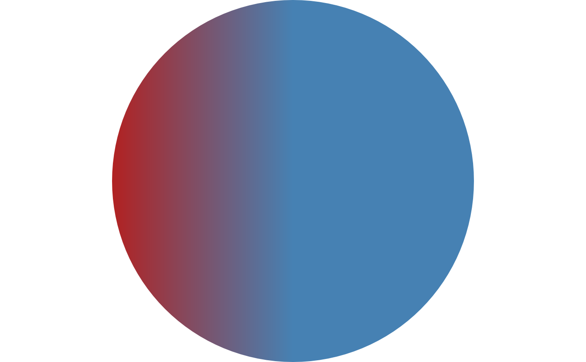
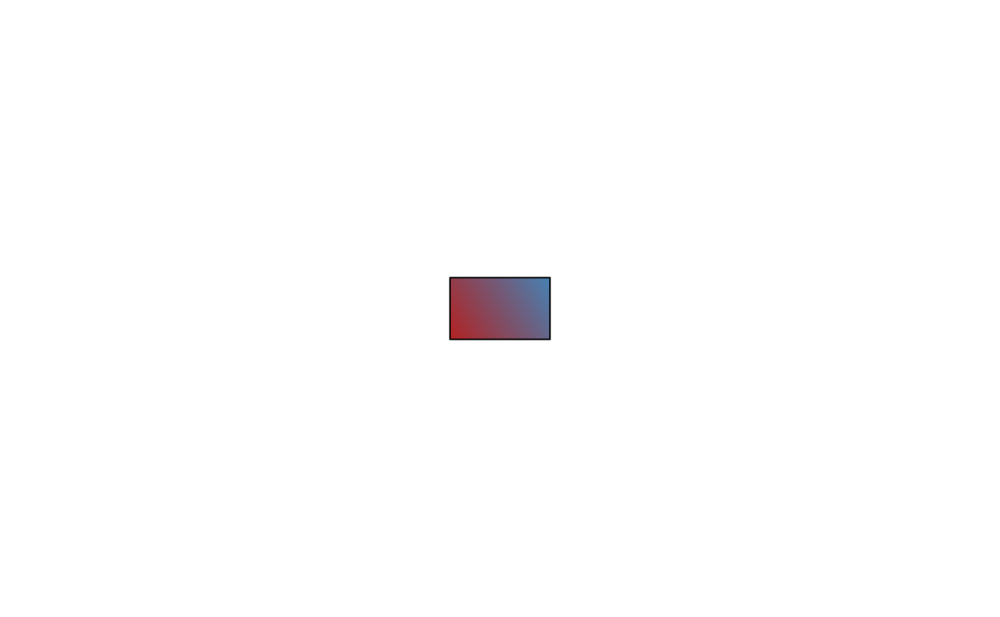
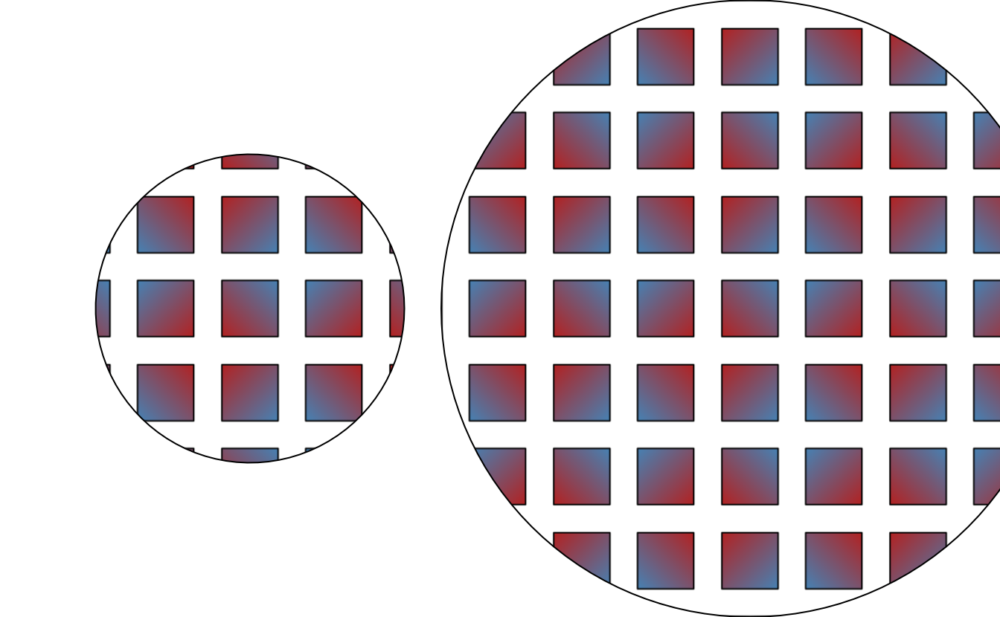
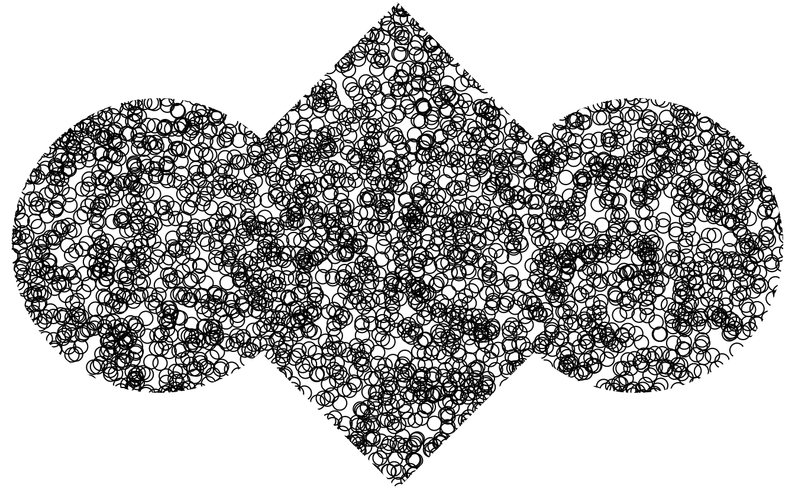
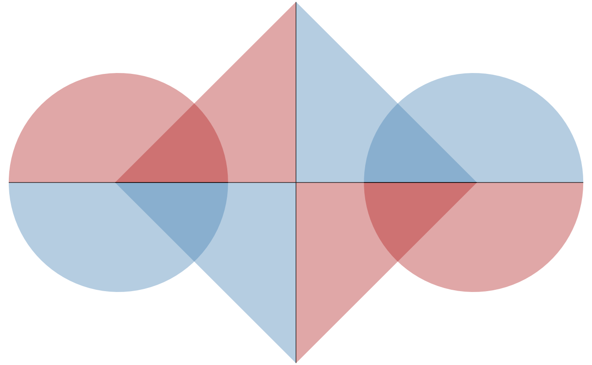

<!--
TODO:
* [ ] Look over / edit the post's title in the yaml
* [ ] Edit (or delete) the description; note this appears in the Twitter card
* [ ] Pick category and tags (see existing with [`hugodown::tidy_show_meta()`](https://rdrr.io/pkg/hugodown/man/use_tidy_post.html))
* [ ] Find photo & update yaml metadata
* [ ] Create `thumbnail-sq.jpg`; height and width should be equal
* [ ] Create `thumbnail-wd.jpg`; width should be >5x height
* [ ] [`hugodown::use_tidy_thumbnails()`](https://rdrr.io/pkg/hugodown/man/use_tidy_post.html)
* [ ] Add intro sentence, e.g. the standard tagline for the package
* [ ] [`usethis::use_tidy_thanks()`](https://usethis.r-lib.org/reference/use_tidy_thanks.html)
-->

The release of ragg 1.2 and svglite 2.1 bought support for some exciting new graphics engine features that was added with R 4.1 by Paul Murrell from R Core. This post will dive into these new features as well as discuss what the future might hold for the R graphics engine.

If you want to follow along on your own computer you can install the latest versions of ragg and svglite from CRAN

<pre class='chroma'><code class='language-r' data-lang='r'><a href='https://rdrr.io/r/utils/install.packages.html'>install.packages</a>("ragg")
<a href='https://rdrr.io/r/utils/install.packages.html'>install.packages</a>("svglite")</code></pre>

The post will rarely make any specific call-outs to ragg or svglite, as these are simply the packages that facilitate what is now possible with R graphics.

## What is the graphics engine, really?

At this point you might still be stuck thinking about what on earth I mean when I say *R graphics engine*. As a user, you are unlikely to ever engage in the finer points about the different abstractions in R graphics, but since we are here and I somehow caught your attention we might as well indulge in the finer points of the graphics implementation.

While you may mainly be familiar with ggplot2 and perhaps a variety of graphics devices for getting your visualization into the correct file format, these two sits at opposite ends of a fairly elaborate graphics pipeline. ggplot2 is a high(er) level plotting package that allows you to express your data visualization intent through a structured grammar. Graphics devices such as ragg and svglite are low-level packages that translate simple graphics instructions into a given file format. In between these two poles we have a two additional abstractions that helps translate between the extremes.

### Graphic systems

R currently sports two different systems, one colloquially known as *base* graphics (implemented in the graphics package), and one called *grid* graphics (implemented in the grid package). If you call [`plot()`](https://rdrr.io/r/graphics/plot.default.html) you are most likely to end up using the base graphics system, while grid is used as the basis for e.g. ggplot2. The two systems are largely silos, though effort has been made to allow users to embed base graphics into grid graphics. In RStudio we are mainly invested in the grid graphics system since it powers ggplot2, but by and large, this is all an implementation detail that the user shouldn't care too much about. There might come other graphic systems in the future, and other ways of drawing things on screen or to files also exist outside of the R graphics pipeline (e.g. rgl which allows you to create 3D graphics using an OpenGL/WebGL interface).

### The graphics engine

What unites base and grid graphics and sets them apart from e.g. rgl is that they both call into the same low level C API provided by R. This API is what is called the graphics engine. The graphics engine is responsible for communicating with the graphics devices while also providing a selected range of utility functionality common for both base and grid graphics. It is because of this abstraction that graphics in R is largely decoupled from how it is outputted, be it on screen, in a file, or directly to a printer.

While it sounds nice and neat when it is all laid out like this, the current structure and division has grown out over many years and the boundary between the graphic systems, the graphics engine, and the graphic devices are grey. Still, the design is much more mature than what we see in other languages and as graphics/data-viz developers in R we are pretty spoiled compared to our peers in other languages --- perhaps without really knowing it.

## A fragmented future

With the division of responsibility described above, there are many points in the pipeline that may impose limitations in functionality. The graphic system might not provide the higher-level API to use functionality in the graphics engine, or a graphic device might not provide support for instructions coming in from the graphics engine. While this has mainly been a hypothetical situation prior to R 4.1, it is now the new reality. As users, this is most apparent in the choice of graphic device. After all, you don't expect the graphic system to be capable of something outside of its API, simply because new features were announced for the graphics device. However, if a graphic device lack support you may end up being surprised at what it renders.

When it comes to graphic systems you can expect that grid will be the first, perhaps only, system that ends up supporting new features in the graphics engine. Part of the reason for that is that the grid API is more powerful in general and as new and more complex graphic powers are exposed it can be easiest to make them fit into the most expressive API. This is definitely the case for the latest batch of new features, but I also expect it to be the case going forward. Just because a functionality is exposed in grid, doesn't mean that it can easily be handled in e.g. ggplot2. I'll address what the new features may mean for the future of ggplot2 in the end of the post.

For graphic devices the water is more muddled. Not all devices are under active development and those devices are unlikely to add support for new features. Further, it may be that a graphics device writes to a format, or uses a library, that do not support a new feature provided by the graphics engine. The bottom line is that we can expect an increased fragmentation of the graphics devices in R in terms of which will be up to specs with the latest graphics engine features. It appears that the cairo based devices along with the pdf device from grDevices can be expected to stay current. On our end, we will do our best to make sure that our graphic device packages (currently ragg and svglite) will stay on top of any new additions to the graphics engine.

## The new features

OK, so we've talked a lot about some new features without ever going into details with what they are. If you've never felt constrained by the capabilities of the graphics in R you may be forgiven for thinking that this is all a big fuzz over nothing. You may be right, but new capabilities will often allow the ecosystem to evolve in new and unexpected ways to the benefit of all.

### Gradients

While gradients have been a part of R graphics for a while, they have always relied on some hack - most often cutting the line or polygon in smaller bits and coloring these with color sampled from a gradient. However, now gradients are supported at the device level, meaning that the pixel color as calculated based on a gradient function. For now, the functionality is limited to fills, so if you want to draw a gradient line you still have to cut it up into small segments.

Gradients can be created with the [`linearGradient()`](https://rdrr.io/r/grid/patterns.html) and [`radialGradient()`](https://rdrr.io/r/grid/patterns.html) which can be assigned to the fill of a grob:

<pre class='chroma'><code class='language-r' data-lang='r'><a href='https://rdrr.io/r/base/library.html'>library</a>(grid)
<a href='https://rdrr.io/r/grid/grid.circle.html'>grid.circle</a>(
  gp = <a href='https://rdrr.io/r/grid/gpar.html'>gpar</a>(
    fill = <a href='https://rdrr.io/r/grid/patterns.html'>linearGradient</a>(
      <a href='https://rdrr.io/r/base/c.html'>c</a>("firebrick", "steelblue", "forestgreen"),
      stops = <a href='https://rdrr.io/r/base/c.html'>c</a>(0, 0.7, 1)
    ),
    col = NA
  )
)
</code></pre>

<pre class='chroma'><code class='language-r' data-lang='r'><a href='https://rdrr.io/r/grid/grid.circle.html'>grid.circle</a>(
  gp = <a href='https://rdrr.io/r/grid/gpar.html'>gpar</a>(
    fill = <a href='https://rdrr.io/r/grid/patterns.html'>radialGradient</a>(
      <a href='https://rdrr.io/r/base/c.html'>c</a>("white", "steelblue"),
      cx1 = 0.8,
      cy1 = 0.8
    ),
    col = NA
  )
)
</code></pre>

At the basic level, both of the constructors takes a vector of colors. Optionally you can provide a vector of stops that define where along the span of the gradient each color is placed. Each gradient type also lets you specify where in the graphic the gradient runs between. For a linear gradient you provide the x and y position of the start and end of the gradient, for a radial gradient you provide the center and radius of the start and end circle. Lastly, you can also tell it how it should behave outside of the given range using the `extend` argument:

<pre class='chroma'><code class='language-r' data-lang='r'><a href='https://rdrr.io/r/grid/grid.circle.html'>grid.circle</a>(
  gp = <a href='https://rdrr.io/r/grid/gpar.html'>gpar</a>(
    fill = <a href='https://rdrr.io/r/grid/patterns.html'>linearGradient</a>(
      <a href='https://rdrr.io/r/base/c.html'>c</a>("firebrick", "steelblue"),
      x1 = 0, y1 = 0, x2 = 0.5, y2 = 0,
      extend = "repeat"
    ),
    col = NA
  )
)
</code></pre>

<pre class='chroma'><code class='language-r' data-lang='r'><a href='https://rdrr.io/r/grid/grid.circle.html'>grid.circle</a>(
  gp = <a href='https://rdrr.io/r/grid/gpar.html'>gpar</a>(
    fill = <a href='https://rdrr.io/r/grid/patterns.html'>linearGradient</a>(
      <a href='https://rdrr.io/r/base/c.html'>c</a>("firebrick", "steelblue"),
      x1 = 0, y1 = 0, x2 = 0.5, y2 = 0,
      extend = "pad"
    ),
    col = NA
  )
)
</code></pre>

One thing to note is that the extend of the gradient is given relative to the bounding box of the grob being drawn. We could move the circle above around and the gradient would follow along with it.

### Patterns

Like gradients, patterns are a new type of fill made possible in grid through the new features in the graphic engine. Patterns are crazy powerful in that they can be *any* grob you can imagine. The grob itself can consist of other grobs and these grobs could have patterned fill as well (or gradient fills for that matter).

<pre class='chroma'><code class='language-r' data-lang='r'>gradient_rec &lt;- <a href='https://rdrr.io/r/grid/grid.rect.html'>rectGrob</a>(
  width = 0.1, 
  height = 0.1, 
  gp = <a href='https://rdrr.io/r/grid/gpar.html'>gpar</a>(fill = <a href='https://rdrr.io/r/grid/patterns.html'>linearGradient</a>(<a href='https://rdrr.io/r/base/c.html'>c</a>("firebrick", "steelblue")))
)
<a href='https://rdrr.io/r/grid/grid.draw.html'>grid.draw</a>(gradient_rec)
</code></pre>

<pre class='chroma'><code class='language-r' data-lang='r'><a href='https://rdrr.io/r/grid/grid.circle.html'>grid.circle</a>(
  gp = <a href='https://rdrr.io/r/grid/gpar.html'>gpar</a>(fill = <a href='https://rdrr.io/r/grid/patterns.html'>pattern</a>(gradient_rec, width = 0.15, height = 0.15, extend = "reflect"))
)
</code></pre>

Understanding the sizing of the grob used for the pattern can take some getting used to. Basically the pattern is drawn relative to the grob. The `width` and `height` argument in the [`pattern()`](https://rdrr.io/r/grid/patterns.html) call is then used to define a region of the grob that will be used as a pattern. You can thus not scale the pattern grob using the `width` and `height` argument in [`pattern()`](https://rdrr.io/r/grid/patterns.html). This can be seen below

<pre class='chroma'><code class='language-r' data-lang='r'><a href='https://rdrr.io/r/grid/grid.circle.html'>grid.circle</a>(
  gp = <a href='https://rdrr.io/r/grid/gpar.html'>gpar</a>(fill = <a href='https://rdrr.io/r/grid/patterns.html'>pattern</a>(gradient_rec, width = 0.35, height = 0.35, extend = "reflect"))
)
</code></pre>

As we see we are just defining a larger (empty) region from our rect grob, effectively adding more space between each rectangle, rather than creating larger rectangles. This also means that the pattern scales with the grob:

<pre class='chroma'><code class='language-r' data-lang='r'>pat &lt;- <a href='https://rdrr.io/r/grid/patterns.html'>pattern</a>(
  gradient_rec, 
  width = 0.15, 
  height = 0.15, 
  extend = "reflect"
)
<a href='https://rdrr.io/r/grid/grid.circle.html'>grid.circle</a>(
  x = 0.25, r = 0.25,
  gp = <a href='https://rdrr.io/r/grid/gpar.html'>gpar</a>(fill = pat)
)
<a href='https://rdrr.io/r/grid/grid.circle.html'>grid.circle</a>(
  x = 0.75, r = 0.5,
  gp = <a href='https://rdrr.io/r/grid/gpar.html'>gpar</a>(fill = pat)
)
</code></pre>

In order to ensure the same scaling of pattern is used across separate grobs, be sure to use absolute units when defining the pattern grob as well as the region:

<pre class='chroma'><code class='language-r' data-lang='r'>gradient_rec &lt;- <a href='https://rdrr.io/r/grid/grid.rect.html'>rectGrob</a>(
  width = <a href='https://rdrr.io/r/grid/unit.html'>unit</a>(1, "cm"), 
  height = <a href='https://rdrr.io/r/grid/unit.html'>unit</a>(1, "cm"), 
  gp = <a href='https://rdrr.io/r/grid/gpar.html'>gpar</a>(fill = <a href='https://rdrr.io/r/grid/patterns.html'>linearGradient</a>(<a href='https://rdrr.io/r/base/c.html'>c</a>("firebrick", "steelblue")))
)
pat &lt;- <a href='https://rdrr.io/r/grid/patterns.html'>pattern</a>(
  gradient_rec, 
  width = <a href='https://rdrr.io/r/grid/unit.html'>unit</a>(1.5, "cm"), 
  height = <a href='https://rdrr.io/r/grid/unit.html'>unit</a>(1.5, "cm"), 
  extend = "reflect"
)
<a href='https://rdrr.io/r/grid/grid.circle.html'>grid.circle</a>(
  x = 0.25, r = 0.25,
  gp = <a href='https://rdrr.io/r/grid/gpar.html'>gpar</a>(fill = pat)
)
<a href='https://rdrr.io/r/grid/grid.circle.html'>grid.circle</a>(
  x = 0.75, r = 0.5,
  gp = <a href='https://rdrr.io/r/grid/gpar.html'>gpar</a>(fill = pat)
)
</code></pre>

As you can see, patterns can take some getting used to, but this is mainly because the API covers such a span of functionality in terms of sizing etc.

### Arbitrary clipping paths

Clipping is an integral part of graphics. You set up a region in your canvas and only this region will get drawn to. Up until now the graphics engine has supported clipping, but only of rectangular, axis-aligned regions. Now, however, any grob can be used to define a clipping region. This is done at the viewport level, where the `clip` argument now can take a grob in addition to the standard `"on"`/`"off"` values.

<pre class='chroma'><code class='language-r' data-lang='r'>clip_path &lt;- <a href='https://rdrr.io/r/grid/grid.text.html'>textGrob</a>("Clipping", gp = <a href='https://rdrr.io/r/grid/gpar.html'>gpar</a>(fontface = "bold", fontsize = 100))
<a href='https://rdrr.io/r/grid/grid.points.html'>grid.points</a>(
  x = <a href='https://rdrr.io/r/stats/Uniform.html'>runif</a>(5000), 
  y = <a href='https://rdrr.io/r/stats/Uniform.html'>runif</a>(5000), 
  default.units = 'npc',
  vp = <a href='https://rdrr.io/r/grid/viewport.html'>viewport</a>(clip = clip_path)
)
</code></pre>

Clipping is not only possible with single grobs. By combining grobs in a gList you can making the clipping region arbitrary complex:

<pre class='chroma'><code class='language-r' data-lang='r'>circle &lt;- <a href='https://rdrr.io/r/grid/grid.circle.html'>circleGrob</a>(x = <a href='https://rdrr.io/r/base/c.html'>c</a>(0.2, 0.8), r = 0.3)
rect &lt;- <a href='https://rdrr.io/r/grid/grid.rect.html'>rectGrob</a>(
  width = <a href='https://rdrr.io/r/grid/unit.html'>unit</a>(0.7, 'snpc'), 
  height = <a href='https://rdrr.io/r/grid/unit.html'>unit</a>(0.7, 'snpc'), 
  vp = <a href='https://rdrr.io/r/grid/viewport.html'>viewport</a>(angle = 45)
)
clip_path &lt;- <a href='https://rdrr.io/r/grid/grid.grob.html'>gTree</a>(children = <a href='https://rdrr.io/r/grid/grid.grob.html'>gList</a>(circle, rect))
<a href='https://rdrr.io/r/grid/grid.points.html'>grid.points</a>(
  x = <a href='https://rdrr.io/r/stats/Uniform.html'>runif</a>(5000), 
  y = <a href='https://rdrr.io/r/stats/Uniform.html'>runif</a>(5000), 
  default.units = 'npc',
  vp = <a href='https://rdrr.io/r/grid/viewport.html'>viewport</a>(clip = clip_path)
)
</code></pre>

While the user interface for clipping paths are easy enough to understand, it should be noted that there may be slight differences between devices as to which grob types can be used. Most notably, the use of text grobs for defining clipping paths is not something that will work for every device (but do work in ragg).

### Alpha masks

The last feature added to the graphics engine in this round is the ability of viewports to have an alpha mask assigned. When a mask is present, the grobs being drawn will apply the opacity of the mask. Note that this is different than a luminosity mask that uses the lightness of the mask as the alpha value. A mask can be any grob you want, or a collection of multiples:

<pre class='chroma'><code class='language-r' data-lang='r'>circle &lt;- <a href='https://rdrr.io/r/grid/grid.circle.html'>circleGrob</a>(
  x = <a href='https://rdrr.io/r/base/c.html'>c</a>(0.2, 0.8), 
  r = 0.3
)
rect &lt;- <a href='https://rdrr.io/r/grid/grid.rect.html'>rectGrob</a>(
  width = <a href='https://rdrr.io/r/grid/unit.html'>unit</a>(0.7, 'snpc'), 
  height = <a href='https://rdrr.io/r/grid/unit.html'>unit</a>(0.7, 'snpc'), 
  vp = <a href='https://rdrr.io/r/grid/viewport.html'>viewport</a>(angle = 45)
)
mask &lt;- <a href='https://rdrr.io/r/grid/grid.grob.html'>gTree</a>(children = <a href='https://rdrr.io/r/grid/grid.grob.html'>gList</a>(circle, rect), gp = <a href='https://rdrr.io/r/grid/gpar.html'>gpar</a>(fill = "#00000066", col = NA))
<a href='https://rdrr.io/r/grid/grid.rect.html'>grid.rect</a>(
  x = <a href='https://rdrr.io/r/base/c.html'>c</a>(0.25, 0.25, 0.75, 0.75), 
  y = <a href='https://rdrr.io/r/base/c.html'>c</a>(0.25, 0.75, 0.75, 0.25), 
  width = 0.5,
  height = 0.5,
  gp = <a href='https://rdrr.io/r/grid/gpar.html'>gpar</a>(fill = <a href='https://rdrr.io/r/base/c.html'>c</a>("steelblue", "firebrick")),
  vp = <a href='https://rdrr.io/r/grid/viewport.html'>viewport</a>(mask = mask)
)
</code></pre>

As we see above, the areas in the mask where nothing is drawn have an opacity of 0, meaning that whatever is being drawn by the rectangle grob in these areas will be invisible. We also see that opacity is compounded by overlaying shapes as the areas covered both by the circle and the square in the mask has a higher opacity.

## Future features

It is of course dangerous to promise what the future brings. However, I do know of a few features adjacent to what have been discussed above that might make sense to know about.

When it comes to clipping paths there is currently a lack of way to describe how multiple shapes are combined, since the fill rule is implicitly "winding" and you have no control over the direction the graphic device trace circles and rectangles. Work is already being done to let you control this from grid so it will become easier to e.g. punch out holes in a clipping path by overlaying two grobs.

As noted in the discussion about masks, only alpha masks are currently possible. However, producing an exact transparency through compounded shapes can be tough because of the way opacity combines. In the future there will also be support for luminosity masks and this should greatly improve the user experience of this feature in my opinion.

Still, the main takeaway from all of the above is that the graphic engine is once again a living breathing code-base with big user-facing features on the horizon.

## The ggplot2 implications

While ggplot2 is using grid underneath it's grammar API, these features are generally not directly available in ggplot2. This is because most of these features are not directly applicable to the current API. Both gradient and patterns are obvious candidates for extensions of the ggplot2 API, but for now the grid API doesn't support a vector of patterns/gradients. Once this limitation is removed (it is in the works), we will need to figure out how scaling of these more flexible fill types should work. The starting point is of course to allow mapping from one data-value to a predefined pattern/gradient, but it would be interesting to think about how to map data-values to features of the pattern/gradient, e.g. have the gradient defined by two or more columns that all maps to different colors.

As for path clipping we could imagine that geoms could take a clipping grob, but it is not obvious how this grob should be constructed in a manner consistent with the grammar. The same goes for masks. Maybe most of this work should be relegated to [ggfx](https://ggfx.data-imaginist.com) which have an extended API that seems better suited to masks and arbitrary clipping.

## Acknowledgement

I'd like to extent a huge thanks to Paul Murrell for continuing to support and improve the graphics API in R and for his willingness to answer questions during the implementation of the new features in ragg and svglite.

