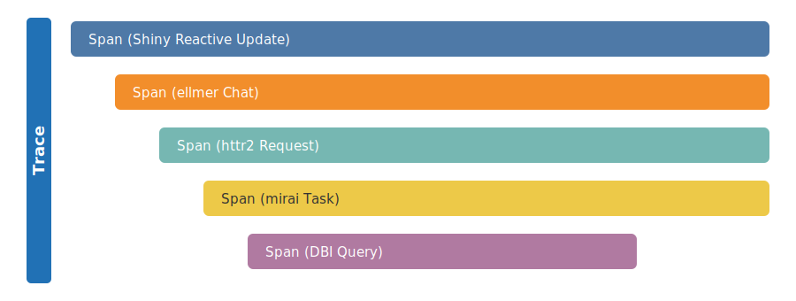
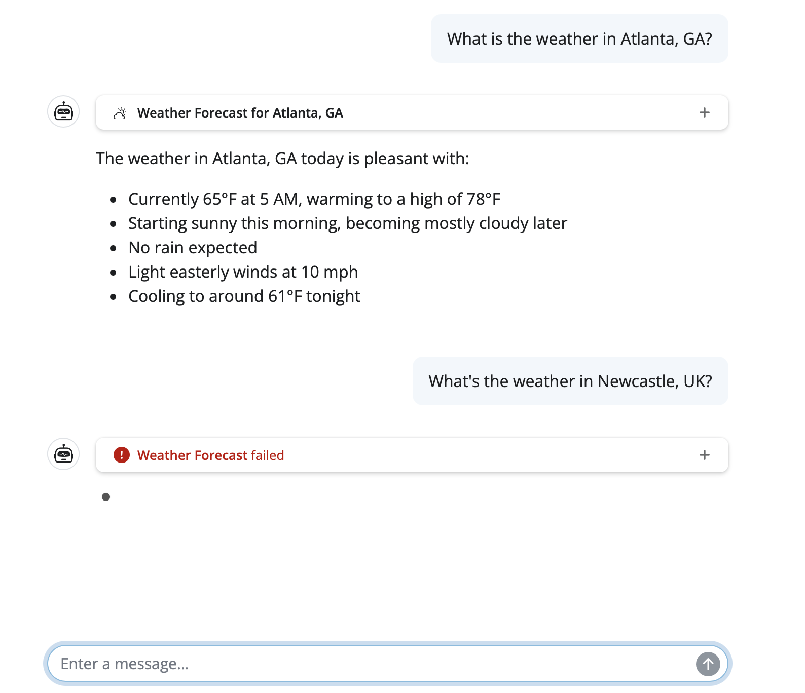

<!--
TODO:
* [x] Look over / edit the post's title in the yaml
* [x] Edit (or delete) the description; note this appears in the Twitter card
* [x] Pick category and tags (see existing with [`hugodown::tidy_show_meta()`](https://rdrr.io/pkg/hugodown/man/use_tidy_post.html))
* [x] Find photo & update yaml metadata
* [x] Create `thumbnail-sq.jpg`; height and width should be equal
* [x] Create `thumbnail-wd.jpg`; width should be >5x height
* [x] [`hugodown::use_tidy_thumbnails()`](https://rdrr.io/pkg/hugodown/man/use_tidy_post.html)
* [x] Add intro sentence, e.g. the standard tagline for the package
* [ ] [`usethis::use_tidy_thanks()`](https://usethis.r-lib.org/reference/use_tidy_thanks.html)
-->

We're bringing [OpenTelemetry](https://opentelemetry.io/) to R. As a Posit-wide initiative across our open source packages, we've instrumented the most widely-used R packages for production workloads -- [Shiny](https://shiny.posit.co/), [plumber2](https://plumber2.posit.co/), [mirai](https://mirai.r-lib.org), [httr2](https://httr2.r-lib.org), [ellmer](https://ellmer.tidyverse.org), [knitr](https://yihui.org/knitr/), [testthat](https://testthat.r-lib.org), and [DBI](https://dbi.r-lib.org) -- so that you can add observability to your R applications with **no code changes**. Just set a few environment variables and you get traces, logs, and metrics flowing to the backend of your choice.

This is part of our commitment to R in production. As R applications scale -- more users, more processes, more machines -- you need tools to understand what's happening across your entire system. OpenTelemetry is that tool, and it's now available to the R community.

## What is OpenTelemetry?

[OpenTelemetry](https://opentelemetry.io/) (OTel) is a vendor-neutral, open source observability framework backed by the [Cloud Native Computing Foundation](https://www.cncf.io/). It defines a standard for collecting telemetry data:

- **Traces** follow a request as it moves through your system, showing exactly which functions ran, in what order, and how long each took.
- **Metrics** capture numerical measurements over time -- things like request counts, response latencies, or memory usage.
- **Logs** record detailed events as they happen, providing context when you need to investigate a specific moment.

The instrumented packages described in this post focus on traces, which provide the most immediate value for understanding production behavior.
Metrics and logs are available for you to add to your own application code via the [otel](https://otel.r-lib.org) package.

OpenTelemetry has broad industry support across languages and platforms. It's already the standard in the Python, Java, JavaScript, and Go ecosystems. Now it's available for R.

## Why observability matters for R in production

When you're developing interactively in RStudio or Positron, debugging is straightforward -- you can step through code, inspect objects, and add print statements. But when your R code runs in production -- a Shiny app serving hundreds of users, a plumber2 API handling thousands of requests, a batch pipeline running across a cluster -- the picture changes.

The core concept in OpenTelemetry is a **trace**: the full path of a request through your system. Each trace is made up of **spans** -- individual units of work with a name and a duration. Spans nest inside each other, so you can see not just *what* happened, but *how* each operation led to the next:



This structure gives you four things that are hard to get any other way:

- **Performance**: Which part of a request is slow? Span durations pinpoint exactly where time is spent -- and nesting reveals unnecessary overhead.
- **Errors**: In development and testing, you know where errors are -- you wrote the test, you control the inputs. In production, errors surface far from their root cause, across process boundaries and async operations, triggered by conditions you never anticipated. Traces show you the full chain of real operations that led to each failure, in the context where it actually happened.
- **Centralized view**: When your application extends across multiple R processes or machines -- a Shiny app with mirai workers, or a plumber2 API behind a load balancer -- traces are aggregated into a single view across all of them.
- **Real-time monitoring**: OTel is designed to be left on in production, not just enabled during testing or staging. With low overhead and built-in safety guarantees, it runs continuously so you see what's happening right now, not after the fact. Dashboards and alerts built on telemetry data let you catch problems as they emerge, not when users report them.

## Instrumented packages

We've worked across teams to add OpenTelemetry instrumentation to the R packages where it matters most:

| Package | Version | What it traces |
|:--------|:--------|:---------------|
| [Shiny](https://shiny.posit.co/) | ≥ 1.12.0 | Session lifecycle, reactive updates, reactive expressions, background tasks |
| [plumber2](https://plumber2.posit.co/) | ≥ 0.2.0 | API request handling, routing, endpoint execution |
| [mirai](https://mirai.r-lib.org) | ≥ 2.5.0 | Task dispatch, daemon execution, results |
| [httr2](https://httr2.r-lib.org) | ≥ 1.2.2 | HTTP requests and responses |
| [ellmer](https://ellmer.tidyverse.org) | ≥ 0.5.0 | LLM API calls, tool execution, token usage |
| [knitr](https://yihui.org/knitr/) | ≥ 1.51 | Document rendering, chunk evaluation |
| [testthat](https://testthat.r-lib.org) | ≥ 3.3.2 | Test execution |
| [DBI](https://dbi.r-lib.org) | ≥ 1.3.0 | Database queries and connections |

Together, these packages cover the most common production R workloads: web applications, APIs, parallel computing, HTTP clients, AI/LLM tools, report rendering pipelines, CI test runs, and database access. Because the instrumentation is built into the packages themselves, you benefit from it automatically -- no wrapper functions, no manual modifications to existing code, no extra work on your part. If you already have a Shiny app or plumber2 API, your app will generate traces as soon as you enable OpenTelemetry. Your application code stays exactly as it is.

## Seeing it in action

To make this concrete, let's look at a Shiny chat app built with [shinychat](https://github.com/posit-dev/shinychat) and [ellmer](https://ellmer.tidyverse.org) that fetches weather forecasts. It uses mirai for async execution and httr2 for weather API requests.


A user asks about the weather in Atlanta and Newcastle:



With OpenTelemetry enabled, every step is captured automatically. Here are the traces from those two queries:


The trace reveals the full chain of operations from user input through to the HTTP request, across process boundaries, with no manual logging. The nesting shows how each step triggered the next, and the durations show exactly where time was spent.

The second query failed. Without tracing, you'd see an error in your logs and start investigating. Here, the failure is immediately visible -- the red span pinpoints where it occurred and the surrounding context shows why. In a production system with many concurrent users, that's the difference between minutes and seconds of debugging.

## Getting started

Getting started requires two packages and a few environment variables. No changes to your application code.

Here's how the pieces fit together: the instrumented R packages generate telemetry data as they run. The [otel](https://otel.r-lib.org) package provides the API that captures this data. The [otelsdk](https://otelsdk.r-lib.org) package collects and exports this data over HTTP to a **backend** -- a service that stores your traces and provides a web dashboard where you can search, filter, and visualize them (like the trace screenshots above).

### Step 1: Install the packages

```r
install.packages(c("otel", "otelsdk"))
```

The otel package is lightweight with no compiled code and no dependencies, so it adds minimal overhead to your project. The otelsdk package handles the collection and export, and requires a C++ compiler to install.

### Step 2: Choose a backend

OpenTelemetry is vendor-neutral, so you can send your data to any compatible backend:

- **Cloud services**: [Logfire](https://logfire.pydantic.dev/), [Grafana Cloud](https://grafana.com/products/cloud/), [Langfuse](https://langfuse.com/)
- **Self-hosted**: [Jaeger](https://www.jaegertracing.io/), [Zipkin](https://zipkin.io/), [Prometheus](https://prometheus.io/)

You can also use a local [OpenTelemetry Collector](https://opentelemetry.io/docs/collector/) as a proxy, so no telemetry data ever leaves your network. The collector can then forward data to any backend, or you can inspect it locally.

Each backend will give you an endpoint URL and an authentication token.

### Step 3: Set environment variables

Add these to your `.Renviron` file (use `usethis::edit_r_environ()` to open it), replacing the endpoint and token with the values from your chosen backend. This example uses [Logfire](https://logfire.pydantic.dev/), which offers a free tier to get started:

```
OTEL_TRACES_EXPORTER="http"
OTEL_EXPORTER_OTLP_ENDPOINT="https://logfire-eu.pydantic.dev"
OTEL_EXPORTER_OTLP_HEADERS="Authorization=<YOUR-WRITE-TOKEN>"
```

If you're deploying content to Posit Connect, refer to [how to set environment variables on Posit Connect](https://docs.posit.co/connect/user/content-settings/#content-vars).

### Step 4: Run your app

That's it. Restart R, then run your Shiny app, plumber2 API, or any code that uses the instrumented packages. Traces will flow to your backend automatically. Open your backend's web dashboard to see them -- you'll see a view like the trace screenshots shown above, with each span representing an operation in your application.

You can verify that tracing is active at any time:

```r
otel::is_tracing_enabled()
#> [1] TRUE
```

Importantly, OpenTelemetry is designed to be safe in production. If anything goes wrong in the telemetry code itself, it will never crash your application -- errors are silently suppressed so your app keeps running. You can set `OTEL_ENV="dev"` during development to surface these errors instead.

## Zero-code instrumentation

Beyond the packages that ship with built-in instrumentation, otel supports **zero-code instrumentation** for any R package. Set the `OTEL_R_INSTRUMENT_PKGS` environment variable to a comma-separated list of package names, and otel will automatically create spans for their exported functions:

```
OTEL_R_INSTRUMENT_PKGS=dplyr,tidyr
```

You can also fine-tune which functions are instrumented using include and exclude filters:

```
OTEL_R_INSTRUMENT_PKGS_DPLYR_INCLUDE=mutate,filter,select
```

This is useful for adding visibility to any package in your stack, even those without built-in OTel support. See the [otel documentation](https://otel.r-lib.org/reference/zci.html) for full details.

## Configuration options

The otelsdk package is configured entirely through environment variables, following OpenTelemetry conventions:

| Variable | Purpose |
|:---------|:--------|
| `OTEL_TRACES_EXPORTER` | Exporter type for traces (e.g. `"http"`) |
| `OTEL_LOGS_EXPORTER` | Exporter type for logs |
| `OTEL_METRICS_EXPORTER` | Exporter type for metrics |
| `OTEL_EXPORTER_OTLP_ENDPOINT` | URL of the OTLP-compatible backend |
| `OTEL_EXPORTER_OTLP_HEADERS` | Authentication headers for the backend |
| `OTEL_R_INSTRUMENT_PKGS` | Packages for zero-code instrumentation |
| `OTEL_R_EMIT_SCOPES` | Restrict telemetry to specific packages |
| `OTEL_R_SUPPRESS_SCOPES` | Exclude specific packages from telemetry |
| `OTEL_ENV` | Set to `"dev"` for development mode with error reporting |

See the [otel environment variables reference](https://otel.r-lib.org/reference/environmentvariables.html) for the complete list.

## Looking ahead

With instrumentation built into the packages that R users already rely on, observability becomes something you can turn on, not something you have to build.

We're continuing to expand and refine OTel support across the ecosystem. If you'd like to learn more:

- [otel package documentation](https://otel.r-lib.org) -- the instrumentation API
- [otelsdk package documentation](https://otelsdk.r-lib.org) -- the SDK for collecting and exporting telemetry
- [Shiny 1.12 OTel blog post](https://shiny.posit.co/blog/posts/shiny-r-1.12/) -- deep dive into Shiny's OpenTelemetry support
- [OpenTelemetry project](https://opentelemetry.io/) -- the upstream standard

We're excited about what this opens up for the R community. Whether you're running a Shiny dashboard for a small team, a plumber2 API serving thousands of requests, or a data pipeline distributed across a cluster -- you now have the tools to see exactly what's happening, in real time, with no code changes required.
