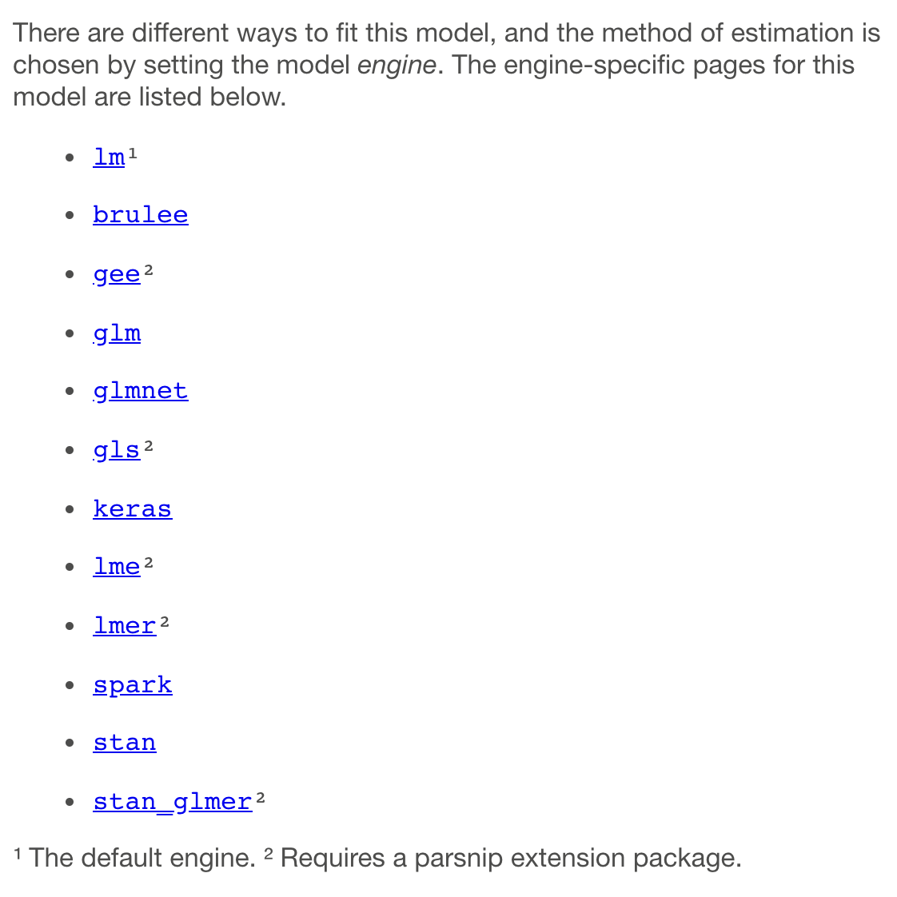

<!--
TODO:
* [x] Look over / edit the post's title in the yaml
* [x] Edit (or delete) the description; note this appears in the Twitter card
* [x] Pick category and tags (see existing with `hugodown::tidy_show_meta()`)
* [x] Find photo & update yaml metadata
* [x] Create `thumbnail-sq.jpg`; height and width should be equal
* [x] Create `thumbnail-wd.jpg`; width should be >5x height
* [x] `hugodown::use_tidy_thumbnails()`
* [x] Add intro sentence, e.g. the standard tagline for the package
* [x] `usethis::use_tidy_thanks()`
-->

We're delighted to announce the release of [parsnip](https://parsnip.tidymodels.org/) 0.2.1. parsnip is a unified modeling interface for tidymodels. 

This release of parsnip precipitated releases of our parsnip extension packages: baguette, discrim, plsmod, poissonreg, and rules. It also allowed us to release an additional package called multilevelmod (see the section below). We've kept CRAN busy! 

You can see a full list of recent parsnip changes in the [release notes](https://parsnip.tidymodels.org/news/index.html). 
You can install the entire set from CRAN with:

```{r, eval = FALSE}
install.packages("parsnip")
install.packages("baguette")
install.packages("discrim")
install.packages("multilevelmod")
install.packages("plsmod")
install.packages("poissonreg")
install.packages("rules")
```

Let's look at a summary of the changes, which are almost entirely in parsnip, before looking at multilevelmod.


## Major changes to parsnip

There are a lot of improvements in this version of parsnip. The main changes are described below.

### More documentation improvements

A [previous version of parsnip](https://www.tidyverse.org/blog/2021/07/tidymodels-july-2021/#better-model-documentation) added a nice feature where the help package for each model showed the engines that are available. One confusing aspect of this was that the list depended on what packages that were loaded. It also didn't tell users what engines are _possible_.

Now, parsnip shows all of the known engines and labels which require extension packages. Here's a screenshot of what you get with `?linear_reg`: 

```{r engines, echo = FALSE, fig.align='center', out.width="80%"}

```

This will not change within a version of parsnip; we'll update each list with each release. 

### BART

We've added a model function for the excellent Bayesian Additive Regression Trees (BART) approach and an engine for the [dbarts](https://github.com/vdorie/dbarts) package. The model is an ensemble of trees that is assembled using Bayesian estimation methods. It typically has very good predictive performance and is also able to generate estimates of the predictive posterior variance, and prediction intervals. 

A good overview of this model is: _Bayesian Additive Regression Trees: A Review and Look Forward_ ([pdf](https://par.nsf.gov/servlets/purl/10181031)). 

### New engines

Within parsnip, a `"glm"` engine was added for linear regression. An engine vale of `"brulee"` was added for linear, logistic, and multinomial regression as well as for neural networks. The brulee package is a new, and is for fitting models using torch (look for a blog post soon on this package). 

As discussed below, the multilevelmod package adds a lot more engines for linear(ish) models, such as [`"gee"`](https://parsnip.tidymodels.org/reference/details_linear_reg_gee.html), [`"gls"`](https://parsnip.tidymodels.org/reference/details_linear_reg_gls.html), [`"lme"`](https://parsnip.tidymodels.org/reference/details_linear_reg_lme.html), [`"lmer"`](https://parsnip.tidymodels.org/reference/details_linear_reg_lmer.html), and [`"stan_glmer"`](https://parsnip.tidymodels.org/reference/details_linear_reg_stan_glmer.html). There are similar engines for logistic and Poisson regression. 


## multilevelmod

This package has been simmering for a while on GitHub. Its engines are useful for fitting a variety of models that go by a litany of different names: mixed effects models, random coefficient models, variance component models, hierarchical linear models, and so on. 

One aspect of these models is that they mostly work with the formula method, which specifies both the model terms and also which of these are "random effects". 

As an example, let's look at the measurement system analysis (MSA) data in the package. In these data, 56 separate items were measured twice using a laboratory test. The lab would like to understand how noisy their data are and if different samples can be distinguished from one another. Here's a plot of the data:  

```{r data-plot, fig.align='center', fig.width=9, fig.height=4, dev = "svg"}
library(ggplot2)
library(parsnip)
library(multilevelmod)

data(msa_data)

msa_data %>% 
  ggplot() + 
  aes(x = reorder(id, value), y = value, col = replicate, pch = replicate) + 
  geom_point(alpha = 1/2, cex = 3) + 
  labs(x = NULL, y = "lab result") +
  theme_bw() + 
  theme(
    axis.text.x = element_text(angle = 90), 
    legend.position = "top"
  )
```


With this data set, the goal is to estimate how much of the variation in the lab test is due to the different samples (as it should be since they are different) or measurement noise. The latter term could be associated with day-to-day differences, people-to-people differences etc. It might also be irreducible noise. In any case, we'd like to get estimates of these two sources of variation. 

A straightforward way to estimate this is to use a repeated measurements model that considers the samples to be randomly selected from a population that are independent from one another. We can add a random intercept term that is different for each sample. From this, the sample-to-sample variance can be computed.

There are a lot of packages that can do this but we'll use the lme4 package:

```{r}
msa_model <- 
  linear_reg() %>% 
  set_engine("lmer") %>% 
  # The formula has (1|id) which means that each sample (=id) should
  # have a different intercept (=1)
  fit(value ~ (1|id), data = msa_data)
msa_model
```

We can see from this output that the sample-to-sample variance is `0.6397^2 = 0.40921` which gives a percental of the total variance of:

```{r}
0.6397 ^ 2 / (0.6397 ^ 2 + 0.2618 ^ 2) * 100
```

Pretty good!

There is a lot more that can be done with these models in terms of prediction and inference. If you are interested in more about multilevelmod, take a look at the [Get Started](https://multilevelmod.tidymodels.org/articles/multilevelmod.html) vignette. 

## Acknowledgements

We'd like to thank all of the contributors to these packages since their last releases: [&#x0040;asshah4](https://github.com/asshah4), [&#x0040;batpigandme](https://github.com/batpigandme), [&#x0040;bshor](https://github.com/bshor), [&#x0040;cimentadaj](https://github.com/cimentadaj), [&#x0040;daaronr](https://github.com/daaronr), [&#x0040;davestr2](https://github.com/davestr2), [&#x0040;DavisVaughan](https://github.com/DavisVaughan), [&#x0040;deschen1](https://github.com/deschen1), [&#x0040;dfalbel](https://github.com/dfalbel), [&#x0040;dietrichson](https://github.com/dietrichson), [&#x0040;edgararuiz](https://github.com/edgararuiz), [&#x0040;EmilHvitfeldt](https://github.com/EmilHvitfeldt), [&#x0040;fabrice-rossi](https://github.com/fabrice-rossi), [&#x0040;frequena](https://github.com/frequena), [&#x0040;ghost](https://github.com/ghost), [&#x0040;gmcmacran](https://github.com/gmcmacran), [&#x0040;hfrick](https://github.com/hfrick), [&#x0040;JB304245](https://github.com/JB304245), [&#x0040;Jeffrothschild](https://github.com/Jeffrothschild), [&#x0040;jennybc](https://github.com/jennybc), [&#x0040;jonthegeek](https://github.com/jonthegeek), [&#x0040;josefortou](https://github.com/josefortou), [&#x0040;juliasilge](https://github.com/juliasilge), [&#x0040;kcarnold](https://github.com/kcarnold), [&#x0040;maspotts](https://github.com/maspotts), [&#x0040;mattwarkentin](https://github.com/mattwarkentin), [&#x0040;meenakshi-kushwaha](https://github.com/meenakshi-kushwaha), [&#x0040;miepstei](https://github.com/miepstei), [&#x0040;mmp3](https://github.com/mmp3), [&#x0040;NickCH-K](https://github.com/NickCH-K), [&#x0040;nikhilpathiyil](https://github.com/nikhilpathiyil), [&#x0040;nvelden](https://github.com/nvelden), [&#x0040;p-lemercier](https://github.com/p-lemercier), [&#x0040;psads-git](https://github.com/psads-git), [&#x0040;RaymondBalise](https://github.com/RaymondBalise), [&#x0040;rmflight](https://github.com/rmflight), [&#x0040;saadaslam](https://github.com/saadaslam), [&#x0040;Shafi2016](https://github.com/Shafi2016), [&#x0040;shuckle16](https://github.com/shuckle16), [&#x0040;sitendug](https://github.com/sitendug), [&#x0040;ssh352](https://github.com/ssh352), [&#x0040;stephenhillphd](https://github.com/stephenhillphd), [&#x0040;stevenpawley](https://github.com/stevenpawley), [&#x0040;Steviey](https://github.com/Steviey), [&#x0040;t-kalinowski](https://github.com/t-kalinowski), [&#x0040;t-neumann](https://github.com/t-neumann), [&#x0040;tiagomaie](https://github.com/tiagomaie), [&#x0040;topepo](https://github.com/topepo), [&#x0040;tsengj](https://github.com/tsengj), [&#x0040;ttrodrigz](https://github.com/ttrodrigz), [&#x0040;wdkeyzer](https://github.com/wdkeyzer), [&#x0040;yitao-li](https://github.com/yitao-li), [&#x0040;zenggyu](https://github.com/zenggyu)
