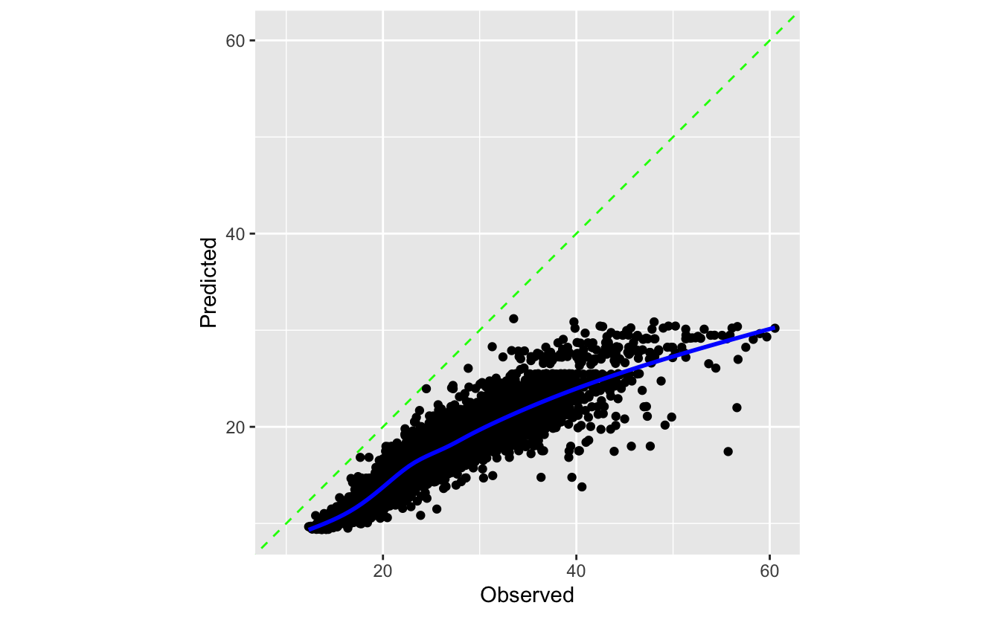
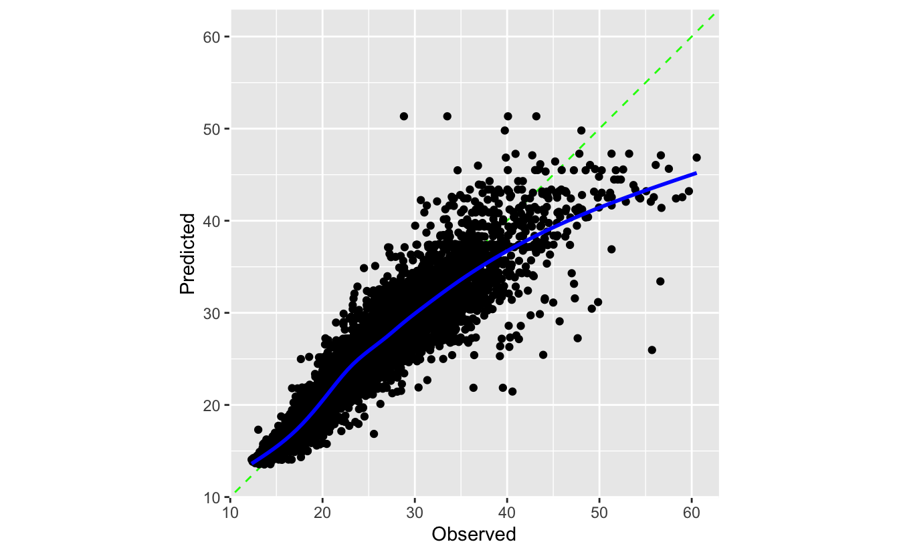

We're bristling with elation to share about a set of upcoming features for postprocessing with tidymodels. Postprocessors refine predictions outputted from machine learning models to improve predictive performance or better satisfy distributional limitations. The developmental versions of many tidymodels core packages include changes to support postprocessors, and we're ready to share about our work and hear the community's thoughts on our progress so far.

Postprocessing support with tidymodels hasn't yet made it to CRAN, but you can install the needed versions of tidymodels packages with the following code.

<pre class='chroma'><code class='language-r' data-lang='r'>pak::<a href='https://pak.r-lib.org/reference/pak.html'>pak</a>(
  <a href='https://rdrr.io/r/base/paste.html'>paste0</a>(
    "tidymodels/",
    <a href='https://rdrr.io/r/base/c.html'>c</a>("tune", "workflows", "rsample", "tailor")
  )
)</code></pre>

Now, we load packages with those developmental versions installed.

<pre class='chroma'><code class='language-r' data-lang='r'><a href='https://rdrr.io/r/base/library.html'>library</a>(<a href='https://tidymodels.tidymodels.org'>tidymodels</a>)
<a href='https://rdrr.io/r/base/library.html'>library</a>(<a href='https://github.com/tidymodels/probably'>probably</a>)
<a href='https://rdrr.io/r/base/library.html'>library</a>(<a href='https://github.com/tidymodels/tailor'>tailor</a>)</code></pre>

Existing tidymodels users might have spotted something funky already; who is this tailor character?

## Meet tailor👋

The tailor package introduces tailor objects, which compose iterative adjustments to model predictions. tailor is to postprocessing as recipes is to preprocessing; applying your mental model of recipes to tailor should get you a good bit of the way there.

| Tool | Applied to\... | Initialize with\... | Composes\... | Train with\... | Predict with\... |
|------------|------------|------------|------------|------------|------------|
| recipes | Training data | `recipe()` | `step_*()`s | `prep()` | `bake()` |
| tailor | Model predictions | [`tailor()`](https://tailor.tidymodels.org/reference/tailor.html) | `adjust_*()`ments | [`fit()`](https://generics.r-lib.org/reference/fit.html) | [`predict()`](https://rdrr.io/r/stats/predict.html) |

First, users can initialize a tailor object with [`tailor()`](https://tailor.tidymodels.org/reference/tailor.html).

<pre class='chroma'><code class='language-r' data-lang='r'><a href='https://tailor.tidymodels.org/reference/tailor.html'>tailor</a>()
#&gt; 
#&gt; ── tailor ──────────────────────────────────────────────────────────────────────
#&gt; A postprocessor with 0 adjustments.
</code></pre>

Tailors compose "adjustments," analogous to steps from the recipes package.

<pre class='chroma'><code class='language-r' data-lang='r'><a href='https://tailor.tidymodels.org/reference/tailor.html'>tailor</a>() <a href='https://magrittr.tidyverse.org/reference/pipe.html'>%&gt;%</a>
  <a href='https://tailor.tidymodels.org/reference/adjust_probability_threshold.html'>adjust_probability_threshold</a>(threshold = .7)
#&gt; 
#&gt; ── tailor ──────────────────────────────────────────────────────────────────────
#&gt; A binary postprocessor with 1 adjustment:
#&gt; 
#&gt; • Adjust probability threshold to 0.7.
</code></pre>

As an example, we'll apply this tailor to the `two_class_example` data made available after loading tidymodels.

<pre class='chroma'><code class='language-r' data-lang='r'><a href='https://rdrr.io/r/utils/head.html'>head</a>(two_class_example)
#&gt;    truth      Class1       Class2 predicted
#&gt; 1 Class2 0.003589243 0.9964107574    Class2
#&gt; 2 Class1 0.678621054 0.3213789460    Class1
#&gt; 3 Class2 0.110893522 0.8891064779    Class2
#&gt; 4 Class1 0.735161703 0.2648382969    Class1
#&gt; 5 Class2 0.016239960 0.9837600397    Class2
#&gt; 6 Class1 0.999275071 0.0007249286    Class1
</code></pre>

This data gives the true value of an outcome variable `truth` as well as predicted probabilities (`Class1` and `Class2`). The hard class predictions, in predicted, are `"Class1"` if the probability assigned to `"Class1"` is above .5, and `"Class2"` otherwise.

The model predicts `"Class1"` more often than it does `"Class2"`.

<pre class='chroma'><code class='language-r' data-lang='r'>two_class_example <a href='https://magrittr.tidyverse.org/reference/pipe.html'>%&gt;%</a> count(predicted)
#&gt;   predicted   n
#&gt; 1    Class1 277
#&gt; 2    Class2 223
</code></pre>

If we wanted the model to predict `"Class2"` more often, we could increase the probability threshold assigned to `"Class1"` above which the hard class prediction will be `"Class1"`. In the tailor package, this adjustment is implemented in [`adjust_probability_threshold()`](https://tailor.tidymodels.org/reference/adjust_probability_threshold.html), which can be situated in a tailor object.

<pre class='chroma'><code class='language-r' data-lang='r'>tlr &lt;-
  <a href='https://tailor.tidymodels.org/reference/tailor.html'>tailor</a>() <a href='https://magrittr.tidyverse.org/reference/pipe.html'>%&gt;%</a>
  <a href='https://tailor.tidymodels.org/reference/adjust_probability_threshold.html'>adjust_probability_threshold</a>(threshold = .7)

tlr
#&gt; 
#&gt; ── tailor ──────────────────────────────────────────────────────────────────────
#&gt; A binary postprocessor with 1 adjustment:
#&gt; 
#&gt; • Adjust probability threshold to 0.7.
</code></pre>

tailors must be fitted before they can predict on new data. For adjustments like [`adjust_probability_threshold()`](https://tailor.tidymodels.org/reference/adjust_probability_threshold.html), there's no training that actually happens at the [`fit()`](https://generics.r-lib.org/reference/fit.html) step besides recording the name and type of relevant variables. For other adjustments, like numeric calibration with [`adjust_numeric_calibration()`](https://tailor.tidymodels.org/reference/adjust_numeric_calibration.html), parameters are actually estimated at the [`fit()`](https://generics.r-lib.org/reference/fit.html) step and separate data should be used to train the postprocessor and evaluate its performance. More on this in [Tailors in context](#tailors-in-context).

In this case, though, we can [`fit()`](https://generics.r-lib.org/reference/fit.html) on the whole dataset. The resulting object is still a tailor, but is now flagged as trained.

<pre class='chroma'><code class='language-r' data-lang='r'>tlr_trained &lt;- <a href='https://generics.r-lib.org/reference/fit.html'>fit</a>(
  tlr,
  two_class_example,
  outcome = <a href='https://rdrr.io/r/base/c.html'>c</a>(truth),
  estimate = <a href='https://rdrr.io/r/base/c.html'>c</a>(predicted),
  probabilities = <a href='https://rdrr.io/r/base/c.html'>c</a>(Class1, Class2)
)

tlr_trained
#&gt; 
#&gt; ── tailor ──────────────────────────────────────────────────────────────────────
#&gt; A binary postprocessor with 1 adjustment:
#&gt; 
#&gt; • Adjust probability threshold to 0.7. [trained]
</code></pre>

When used with a model [workflow](https://workflows.tidymodels.org) via [`add_tailor()`](https://workflows.tidymodels.org/dev/reference/add_tailor.html), the arguments to [`fit()`](https://generics.r-lib.org/reference/fit.html) a tailor will be set automatically. Generally, as in recipes, we recommend that users add tailors to model workflows for training and prediction rather than using them standalone for greater ease of use and to prevent data leakage, but tailors are totally functional by themselves, too.

Now, when passed new data, the trained tailor will determine the outputted class based on whether the probability assigned to the level `"Class1"` is above `.7`, resulting in more predictions of `"Class2"` than before.

<pre class='chroma'><code class='language-r' data-lang='r'><a href='https://rdrr.io/r/stats/predict.html'>predict</a>(tlr_trained, two_class_example) <a href='https://magrittr.tidyverse.org/reference/pipe.html'>%&gt;%</a> count(predicted)
#&gt; # A tibble: 2 × 2
#&gt;   predicted     n
#&gt;   &lt;fct&gt;     &lt;int&gt;
#&gt; 1 Class1      236
#&gt; 2 Class2      264
</code></pre>

Changing the probability threshold is one of many possible adjustments available in tailor.

-   For probabilities: [calibration](https://tailor.tidymodels.org/reference/adjust_probability_calibration.html)
-   For transformation of probabilities to hard class predictions: [thresholds](https://tailor.tidymodels.org/reference/adjust_probability_threshold.html), [equivocal zones](https://tailor.tidymodels.org/reference/adjust_equivocal_zone.html)
-   For numeric outcomes: [calibration](https://tailor.tidymodels.org/reference/adjust_numeric_calibration.html), [range](https://tailor.tidymodels.org/reference/adjust_numeric_range.html)

Support for tailors in now plumbed through workflows (via [`add_tailor()`](https://workflows.tidymodels.org/dev/reference/add_tailor.html)) and tune, and rsample includes a set of infastructural changes to prevent data leakage behind the scenes. That said, we haven't yet implemented support for tuning parameters in tailors, but we plan to implement that before this functionality heads to CRAN.

## Tailors in context

As an example, let's model a study of food delivery times in minutes (i.e., the time from the initial order to receiving the food) for a single restaurant. The `deliveries` data is available upon loading the tidymodels meta-package.

<pre class='chroma'><code class='language-r' data-lang='r'><a href='https://rdrr.io/r/utils/data.html'>data</a>(deliveries)

# split into training and testing sets
<a href='https://rdrr.io/r/base/Random.html'>set.seed</a>(1)
delivery_split &lt;- initial_split(deliveries)
delivery_train &lt;- training(delivery_split)
delivery_test  &lt;- testing(delivery_split)

# resample the training set using 10-fold cross-validation
<a href='https://rdrr.io/r/base/Random.html'>set.seed</a>(1)
delivery_folds &lt;- vfold_cv(delivery_train)

# print out the training set
delivery_train
#&gt; # A tibble: 7,509 × 31
#&gt;    time_to_delivery  hour day   distance item_01 item_02 item_03 item_04 item_05
#&gt;               &lt;dbl&gt; &lt;dbl&gt; &lt;fct&gt;    &lt;dbl&gt;   &lt;int&gt;   &lt;int&gt;   &lt;int&gt;   &lt;int&gt;   &lt;int&gt;
#&gt;  1             21.2  16.1 Tue       3.02       0       0       0       0       0
#&gt;  2             17.9  12.4 Sun       3.37       0       0       0       0       0
#&gt;  3             22.4  14.2 Fri       2.59       0       0       0       0       0
#&gt;  4             30.9  19.1 Sat       2.77       0       0       0       0       0
#&gt;  5             30.1  16.5 Fri       2.05       0       0       0       1       0
#&gt;  6             35.3  14.7 Sat       4.57       0       0       2       1       1
#&gt;  7             13.1  11.5 Sat       2.09       0       0       0       0       0
#&gt;  8             18.3  13.4 Tue       2.35       0       2       1       0       0
#&gt;  9             25.2  20.5 Sat       2.43       0       0       0       1       0
#&gt; 10             30.7  16.7 Fri       2.24       0       0       0       1       0
#&gt; # ℹ 7,499 more rows
#&gt; # ℹ 22 more variables: item_06 &lt;int&gt;, item_07 &lt;int&gt;, item_08 &lt;int&gt;,
#&gt; #   item_09 &lt;int&gt;, item_10 &lt;int&gt;, item_11 &lt;int&gt;, item_12 &lt;int&gt;, item_13 &lt;int&gt;,
#&gt; #   item_14 &lt;int&gt;, item_15 &lt;int&gt;, item_16 &lt;int&gt;, item_17 &lt;int&gt;, item_18 &lt;int&gt;,
#&gt; #   item_19 &lt;int&gt;, item_20 &lt;int&gt;, item_21 &lt;int&gt;, item_22 &lt;int&gt;, item_23 &lt;int&gt;,
#&gt; #   item_24 &lt;int&gt;, item_25 &lt;int&gt;, item_26 &lt;int&gt;, item_27 &lt;int&gt;
</code></pre>

Let's deliberately define a regression model that has poor predicted values: a boosted tree with only three ensemble members.

<pre class='chroma'><code class='language-r' data-lang='r'>delivery_wflow &lt;-
  workflow() <a href='https://magrittr.tidyverse.org/reference/pipe.html'>%&gt;%</a>
  add_formula(time_to_delivery ~ .) <a href='https://magrittr.tidyverse.org/reference/pipe.html'>%&gt;%</a>
  add_model(boost_tree(mode = "regression", trees = 3))</code></pre>

Evaluating against resamples:

<pre class='chroma'><code class='language-r' data-lang='r'><a href='https://rdrr.io/r/base/Random.html'>set.seed</a>(1)
delivery_res &lt;- 
  fit_resamples(
    delivery_wflow, 
    delivery_folds, 
    control = control_resamples(save_pred = TRUE)
  )</code></pre>

The $R^2$ looks quite strong!

<pre class='chroma'><code class='language-r' data-lang='r'><a href='https://tune.tidymodels.org/reference/collect_predictions.html'>collect_metrics</a>(delivery_res)
#&gt; # A tibble: 2 × 6
#&gt;   .metric .estimator  mean     n std_err .config             
#&gt;   &lt;chr&gt;   &lt;chr&gt;      &lt;dbl&gt; &lt;int&gt;   &lt;dbl&gt; &lt;chr&gt;               
#&gt; 1 rmse    standard   9.52     10 0.0533  Preprocessor1_Model1
#&gt; 2 rsq     standard   0.853    10 0.00357 Preprocessor1_Model1
</code></pre>

Let's take a closer look at the predictions, though. How well is it calibrated? We can use the [`cal_plot_regression()`](https://probably.tidymodels.org/reference/cal_plot_regression.html) helper from the probably package to put together a quick diagnostic plot.

<pre class='chroma'><code class='language-r' data-lang='r'><a href='https://tune.tidymodels.org/reference/collect_predictions.html'>collect_predictions</a>(delivery_res) <a href='https://magrittr.tidyverse.org/reference/pipe.html'>%&gt;%</a>
  <a href='https://probably.tidymodels.org/reference/cal_plot_regression.html'>cal_plot_regression</a>(truth = time_to_delivery, estimate = .pred)
</code></pre>

Ooof.

In comes tailor! Numeric calibration can help address the correlated errors here. We can add a tailor to our existing workflow to "bump up" predictions towards their true value.

<pre class='chroma'><code class='language-r' data-lang='r'>delivery_wflow_improved &lt;-
  delivery_wflow <a href='https://magrittr.tidyverse.org/reference/pipe.html'>%&gt;%</a>
  add_tailor(<a href='https://tailor.tidymodels.org/reference/tailor.html'>tailor</a>() <a href='https://magrittr.tidyverse.org/reference/pipe.html'>%&gt;%</a> <a href='https://tailor.tidymodels.org/reference/adjust_numeric_calibration.html'>adjust_numeric_calibration</a>())</code></pre>

The resampling code looks the same from here.

<pre class='chroma'><code class='language-r' data-lang='r'><a href='https://rdrr.io/r/base/Random.html'>set.seed</a>(1)
delivery_res_improved &lt;- 
  fit_resamples(
    delivery_wflow_improved, 
    delivery_folds, 
    control = control_resamples(save_pred = TRUE)
  )</code></pre>

Checking out the same plot reveals a much better fit!

<pre class='chroma'><code class='language-r' data-lang='r'><a href='https://tune.tidymodels.org/reference/collect_predictions.html'>collect_predictions</a>(delivery_res_improved) <a href='https://magrittr.tidyverse.org/reference/pipe.html'>%&gt;%</a>
  <a href='https://probably.tidymodels.org/reference/cal_plot_regression.html'>cal_plot_regression</a>(truth = time_to_delivery, estimate = .pred)
</code></pre>

There's actually some tricky data leakage prevention happening under the hood here. When you add tailors to workflow and fit them with tune, this is all taken care of for you. If you're interested in using tailors outside of that context, check out [this documentation section](https://workflows.tidymodels.org/dev/reference/add_tailor.html#data-usage) in `add_tailor()`.

## What's to come

We're excited about how this work is shaping up and would love to hear yall's thoughts on what we've brought together so far. Please do comment on our social media posts about this blog entry or leave issues on the [tailor GitHub repository](https://github.com/tidymodels/tailor) and let us know what you think!

Before these changes head out to CRAN, we'll also be implementing tuning functionality for postprocessors. You'll be able to tag arguments like `adjust_probability_threshold(threshold)` or `adjust_probability_calibration(method)` with `tune()` to optimize across several values. Besides that, post-processing with tidymodels should "just work" on the developmental versions of our packages---let us know if you come across anything wonky.

## Acknowledgements

Postprocessing support has been a longstanding feature request across many of our repositories; we're grateful for the community discussions there for shaping this work. Additionally, we thank Ryan Tibshirani and Daniel McDonald for fruitful discussions on how we might scope these features.

