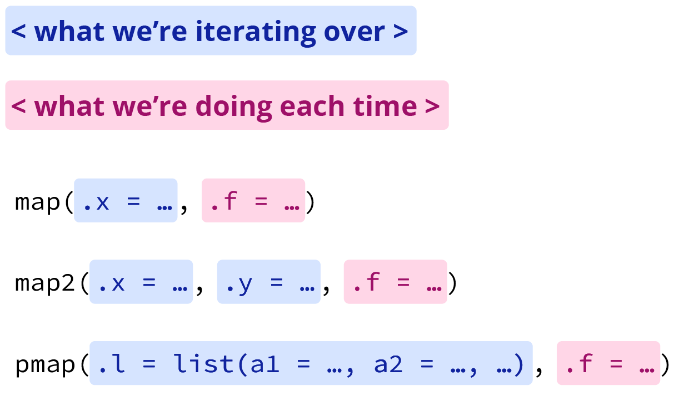
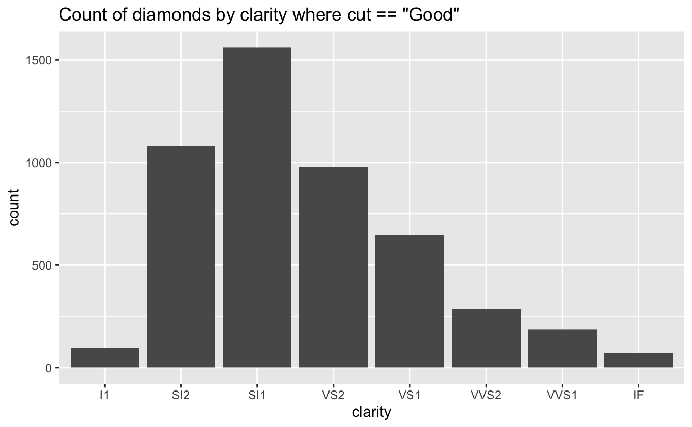

<!--
TODO:
* [x] Look over / edit the post's title in the yaml
* [x] Edit (or delete) the description; note this appears in the Twitter card
* [x] Pick category and tags (see existing with [`hugodown::tidy_show_meta()`](https://rdrr.io/pkg/hugodown/man/use_tidy_post.html))
* [x] Find photo & update yaml metadata
* [x] Create `thumbnail-sq.jpg`; height and width should be equal
* [x] Create `thumbnail-wd.jpg`; width should be >5x height
* [x] [`hugodown::use_tidy_thumbnails()`](https://rdrr.io/pkg/hugodown/man/use_tidy_post.html)
* [ ] Add intro sentence, e.g. the standard tagline for the package
* [ ] [`usethis::use_tidy_thanks()`](https://usethis.r-lib.org/reference/use_tidy_thanks.html)
-->

## Meet the `map()` family

purrr's [`map()`](https://purrr.tidyverse.org/reference/map.html) family of functions are tools for **iteration**, performing the same action on multiple inputs. If you're new to purrr, the [Iteration chapter](https://r4ds.had.co.nz/iteration.html#iteration) of R for Data Science is a good place to get started.

One of the benefits of using [`map()`](https://purrr.tidyverse.org/reference/map.html) is that the function has variants (e.g. [`map2()`](https://purrr.tidyverse.org/reference/map2.html), [`pmap()`](https://purrr.tidyverse.org/reference/pmap.html), etc.) all of which work the same way. To borrow from Jennifer Thompson's excellent [Intro to purrr](https://github.com/jenniferthompson/RLadiesIntroToPurrr),the arguments can be broken into two groups: what we're iterating over, and what we're doing each time. The adapted figure below shows what this looks like for [`map()`](https://purrr.tidyverse.org/reference/map.html), [`map2()`](https://purrr.tidyverse.org/reference/map2.html), and [`pmap()`](https://purrr.tidyverse.org/reference/pmap.html).

Grouped map function arguments, adapted from Intro to purrr by Jennifer Thompson'

In addition to handling different input arguments, the map family of functions has variants that create different outputs. The following table from the [Map-variants section of Advanced R](https://adv-r.hadley.nz/functionals.html#map-variants) shows how the orthogonal inputs and outputs can be used to organise the variants into a matrix:

|                      | List     | Atomic            | Same type   | Nothing   |
|----------------------|----------|-------------------|-------------|-----------|
| One argument         | [`map()`](https://purrr.tidyverse.org/reference/map.html)  | [`map_lgl()`](https://purrr.tidyverse.org/reference/map.html), ...  | [`modify()`](https://purrr.tidyverse.org/reference/modify.html)  | [`walk()`](https://purrr.tidyverse.org/reference/map.html)  |
| Two arguments        | [`map2()`](https://purrr.tidyverse.org/reference/map2.html) | [`map2_lgl()`](https://purrr.tidyverse.org/reference/map2.html), ... | [`modify2()`](https://purrr.tidyverse.org/reference/modify.html) | [`walk2()`](https://purrr.tidyverse.org/reference/map2.html) |
| One argument + index | [`imap()`](https://purrr.tidyverse.org/reference/imap.html) | [`imap_lgl()`](https://purrr.tidyverse.org/reference/imap.html), ... | [`imodify()`](https://purrr.tidyverse.org/reference/modify.html) | [`iwalk()`](https://purrr.tidyverse.org/reference/imap.html) |
| N arguments          | [`pmap()`](https://purrr.tidyverse.org/reference/pmap.html) | [`pmap_lgl()`](https://purrr.tidyverse.org/reference/pmap.html), ... | ---         | [`pwalk()`](https://purrr.tidyverse.org/reference/pmap.html) |

## What's up with `walk()`?

Based on the table above, you might think that [`walk()`](https://purrr.tidyverse.org/reference/map.html) isn't very useful. Indeed, [`walk()`](https://purrr.tidyverse.org/reference/map.html), [`walk2()`](https://purrr.tidyverse.org/reference/map2.html), and [`pwalk()`](https://purrr.tidyverse.org/reference/pmap.html) all invisibly return `.x`. However, they come in handy when you want to call a function for its ***side effects*** rather than its return value.

Here, we'll go through two common use cases: saving multiple CSVs, and multiple plots. We'll also make use of the [fs](https://fs.r-lib.org/) package, a cross-platform interface to file system operations, to inspect our outputs.

If you want to try this out but don't want to save files locally, there's a [companion project on **Posit Cloud**](https://posit.cloud/content/5983147) where you can follow along.

## Writing (and deleting) multiple CSVs

To get started, we'll need some data. Let's use the [gapminder](https://googlesheets4.tidyverse.org/reference/gs4_examples.html) example Sheet built into [googlesheets4](https://googlesheets4.tidyverse.org/). Because there are multiple worksheets (one for each continent), we'll use [`map()`](https://purrr.tidyverse.org/reference/map.html) to apply [`read_sheet()`](https://googlesheets4.tidyverse.org/reference/range_read.html)[^1] to each one, and get back a list of data frames.

<pre class='chroma'><code class='language-r' data-lang='r'><a href='https://rdrr.io/r/base/library.html'>library</a>(<a href='https://tidyverse.tidyverse.org'>tidyverse</a>)
<a href='https://rdrr.io/r/base/library.html'>library</a>(<a href='https://googlesheets4.tidyverse.org'>googlesheets4</a>)</code></pre>

<pre class='chroma'><code class='language-r' data-lang='r'># since we're using data built into googlesheets4 we don't need to auth
<a href='https://googlesheets4.tidyverse.org/reference/gs4_deauth.html'>gs4_deauth</a>()
ss &lt;- <a href='https://googlesheets4.tidyverse.org/reference/gs4_examples.html'>gs4_example</a>("gapminder") # get sheet id
sheets &lt;- <a href='https://googlesheets4.tidyverse.org/reference/sheet_properties.html'>sheet_names</a>(ss) # get the names of individual sheets
gap_dfs &lt;- <a href='https://purrr.tidyverse.org/reference/map.html'>map</a>(sheets, .f = \(x) <a href='https://googlesheets4.tidyverse.org/reference/range_read.html'>read_sheet</a>(ss, sheet = x))
#&gt; ✔ Reading from gapminder.
#&gt; ✔ Range ''Africa''.
#&gt; ✔ Reading from gapminder.
#&gt; ✔ Range ''Americas''.
#&gt; ✔ Reading from gapminder.
#&gt; ✔ Range ''Asia''.
#&gt; ✔ Reading from gapminder.
#&gt; ✔ Range ''Europe''.
#&gt; ✔ Reading from gapminder.
#&gt; ✔ Range ''Oceania''.
</code></pre>

Note that the backslash syntax for anonymous functions (e.g. `\(x) x +1`) was introduced in base R version 4.1.0. If you're using an earlier version of R, you can use a formula instead (e.g. `~ .x + 1`).

Typically, you'd want to combine these data frames into one for the purposes of working with the data in R. To do so, we'll use [`list_rbind()`](https://purrr.tidyverse.org/reference/list_c.html) on `gap_dfs`. I've kept the intermediary object, since we'll use it in a moment with [`walk()`](https://purrr.tidyverse.org/reference/map.html), but could have just as easily piped the output directly. The combination of [`purrr::map()` and `list_rbind()`](https://r4ds.hadley.nz/iteration.html?#purrrmap-and-list_rbind) is a handy one you can learn more about in the linked section of R for Data Science.

<pre class='chroma'><code class='language-r' data-lang='r'>gap_combined &lt;- gap_dfs |&gt;
  <a href='https://purrr.tidyverse.org/reference/list_c.html'>list_rbind</a>()</code></pre>

Now let's say that, for whatever reason, you'd like to save the data from these sheets as individual CSVs. This is where [`walk()`](https://purrr.tidyverse.org/reference/map.html) comes into play---writing out the file with [`write_csv()`](https://readr.tidyverse.org/reference/write_delim.html) is a "side effect." We'll use [`fs::dir_create()`](https://fs.r-lib.org/reference/create.html) to create a data folder to put our files into[^2], and build a vector of paths/file names. Since we have two arguments, the list of data frames, and the paths, we'll use [`walk2()`](https://purrr.tidyverse.org/reference/map2.html).

<pre class='chroma'><code class='language-r' data-lang='r'>fs::<a href='https://fs.r-lib.org/reference/create.html'>dir_create</a>("data")
paths &lt;- <a href='https://stringr.tidyverse.org/reference/str_glue.html'>str_glue</a>("data/gapminder_&#123;tolower(sheets)&#125;.csv")
<a href='https://purrr.tidyverse.org/reference/map2.html'>walk2</a>(gap_dfs, paths, write_csv)</code></pre>

To see what we've done, we can use [`fs::dir_tree()`](https://fs.r-lib.org/reference/dir_tree.html) to see the contents of the directory as a tree, or [`fs::dir_ls()`](https://fs.r-lib.org/reference/dir_ls.html) to return the paths as a list.

<pre class='chroma'><code class='language-r' data-lang='r'>fs::<a href='https://fs.r-lib.org/reference/dir_tree.html'>dir_tree</a>("data")
#&gt; data
#&gt; ├── gapminder_africa.csv
#&gt; ├── gapminder_americas.csv
#&gt; ├── gapminder_asia.csv
#&gt; ├── gapminder_europe.csv
#&gt; └── gapminder_oceania.csv
fs::<a href='https://fs.r-lib.org/reference/dir_ls.html'>dir_ls</a>("data")
#&gt; data/gapminder_africa.csv   data/gapminder_americas.csv 
#&gt; data/gapminder_asia.csv     data/gapminder_europe.csv   
#&gt; data/gapminder_oceania.csv
</code></pre>

If you're having regrets, or want to return your example project to its previous state, it's just as easy to [`walk()`](https://purrr.tidyverse.org/reference/map.html) [`fs::file_delete()`](https://fs.r-lib.org/reference/delete.html) along those same paths.[^3]

<pre class='chroma'><code class='language-r' data-lang='r'><a href='https://purrr.tidyverse.org/reference/map.html'>walk</a>(paths, fs::<a href='https://fs.r-lib.org/reference/delete.html'>file_delete</a>)</code></pre>

## Saving multiple plots

Now, let's say you want to create and save a bunch of plots. We'll use a modified version of the [`conditional_bars()`](https://r4ds.hadley.nz/functions.html#combining-with-other-tidyverse)[^4] function from the R for Data Science chapter on writing [functions](https://r4ds.hadley.nz/functions.html), and the built-in [diamonds](https://ggplot2.tidyverse.org/reference/diamonds.html) dataset.

<pre class='chroma'><code class='language-r' data-lang='r'># modified conditional bars function from R4DS
conditional_bars &lt;- function(df, condition, var) &#123;
  df |&gt;
    <a href='https://dplyr.tidyverse.org/reference/filter.html'>filter</a>(&#123;&#123; condition &#125;&#125;) |&gt;
    <a href='https://ggplot2.tidyverse.org/reference/ggplot.html'>ggplot</a>(<a href='https://ggplot2.tidyverse.org/reference/aes.html'>aes</a>(x = &#123;&#123; var &#125;&#125;)) +
    <a href='https://ggplot2.tidyverse.org/reference/geom_bar.html'>geom_bar</a>() +
    <a href='https://ggplot2.tidyverse.org/reference/labs.html'>ggtitle</a>(rlang::<a href='https://rlang.r-lib.org/reference/englue.html'>englue</a>("Count of diamonds by &#123;&#123;var&#125;&#125; where &#123;&#123;condition&#125;&#125;"))
&#125;</code></pre>

It's easy enough to run this for one condition, for example for the diamonds with `cut == "Good"`.

<pre class='chroma'><code class='language-r' data-lang='r'>diamonds |&gt; conditional_bars(cut == "Good", clarity)
</code></pre>

But what if we want to make a and save plot for each cut? Again, it's [`map()`](https://purrr.tidyverse.org/reference/map.html) and [`walk()`](https://purrr.tidyverse.org/reference/map.html) to the rescue.

Because we're using the same data (`diamonds`) and conditioning on the same variable (`cut`), we'll only need to [`map()`](https://purrr.tidyverse.org/reference/map.html) across the levels of `cut`, and can hard code the rest into the anonymous function.

<pre class='chroma'><code class='language-r' data-lang='r'># get the levels
cuts &lt;- <a href='https://rdrr.io/r/base/levels.html'>levels</a>(diamonds$cut)

# make the plots
plots &lt;- <a href='https://purrr.tidyverse.org/reference/map.html'>map</a>(
  cuts, 
  \(x) conditional_bars(df = diamonds, cut == &#123;&#123; x &#125;&#125;, clarity)
  )</code></pre>

As we did when saving our CSVs, we'll use fs to create a directory to store them in, and make a vector of paths for file names.

<pre class='chroma'><code class='language-r' data-lang='r'># make the folder to put them it (if exists, &#123;fs&#125; does nothing)
fs::<a href='https://fs.r-lib.org/reference/create.html'>dir_create</a>("plots")
# make the file names
plot_paths &lt;- <a href='https://stringr.tidyverse.org/reference/str_glue.html'>str_glue</a>("plots/&#123;tolower(cuts)&#125;_clarity.png")</code></pre>

Now we can use the paths and plots with [`walk2()`](https://purrr.tidyverse.org/reference/map2.html) to pass them as arguments to [`ggsave()`](https://ggplot2.tidyverse.org/reference/ggsave.html). Note that, rather than putting constant arguments (such as height and width) in `…`, we pass them directly into [`ggsave()`](https://ggplot2.tidyverse.org/reference/ggsave.html) in an anonymous function.

<pre class='chroma'><code class='language-r' data-lang='r'><a href='https://purrr.tidyverse.org/reference/map2.html'>walk2</a>(
  plot_paths,
  plots,
  \(path, plot) <a href='https://ggplot2.tidyverse.org/reference/ggsave.html'>ggsave</a>(path, plot, width = 6, height = 6)
)</code></pre>

Again, we can use fs to see what we've done:

<pre class='chroma'><code class='language-r' data-lang='r'>fs::<a href='https://fs.r-lib.org/reference/dir_tree.html'>dir_tree</a>("plots")
#&gt; plots
#&gt; ├── fair_clarity.png
#&gt; ├── good_clarity.png
#&gt; ├── ideal_clarity.png
#&gt; ├── premium_clarity.png
#&gt; └── very good_clarity.png
</code></pre>

And, clean up after ourselves if we didn't *really* want those plots after all.

<pre class='chroma'><code class='language-r' data-lang='r'><a href='https://purrr.tidyverse.org/reference/map.html'>walk</a>(plot_paths, fs::<a href='https://fs.r-lib.org/reference/delete.html'>file_delete</a>)</code></pre>

## Fin

Hopefully this gave you a taste for some of what [`walk()`](https://purrr.tidyverse.org/reference/map.html) can do. To learn more, see [Saving multiple outputs](https://r4ds.hadley.nz/iteration.html#saving-multiple-outputs) in the Iteration chapter of R for Data Science.

[^1]: See [Getting started with googlesheets4](https://googlesheets4.tidyverse.org/articles/googlesheets4.html) to learn more about the basics of reading and writing sheets.

[^2]: If the directory already exists, it will be left unchanged.

[^3]: There's also a function in fs called [`dir_walk()`](https://fs.r-lib.org/reference/dir_ls.html), which you can feel free to explore on your own.

[^4]: I've added a title that reflects the variable name and condition with [`rlang::englue()`](https://rlang.r-lib.org/reference/englue.html), which you can learn more about in the [Labeling](https://r4ds.hadley.nz/functions.html#labeling) section of the same R4DS chapter.

