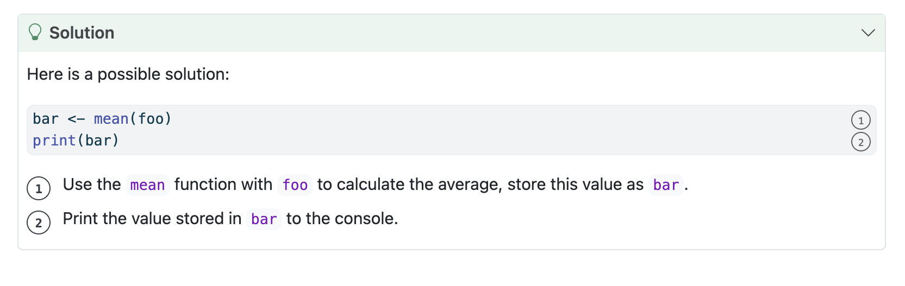

<!--
TODO:
* [x] Look over / edit the post's title in the yaml
* [x] Edit (or delete) the description; note this appears in the Twitter card
* [x] Pick category and tags (see existing with `hugodown::tidy_show_meta()`)
* [x] Find photo & update yaml metadata
* [x] Create `thumbnail-sq.jpg`; height and width should be equal
* [x] Create `thumbnail-wd.jpg`; width should be >5x height
* [x] `hugodown::use_tidy_thumbnails()`
* [x] Add intro sentence, e.g. the standard tagline for the package
* [x] `usethis::use_tidy_thanks()`
-->

We're tickled pink to announce the release of [Quarto Live](https://r-wasm.github.io/quarto-live/) 0.1.1. Quarto Live is a new Quarto extension that uses WebAssembly to bring interactive examples and code exercises with custom grading algorithms to your HTML-based output documents, using standard Quarto markdown syntax.

Quarto Live adds a [CodeMirror](https://codemirror.net/)-based text editor to your document with automatic theming, syntax highlighting, and auto-complete. The editor executes R code using webR, and even integrates with Quarto's OJS support so that interactive code cells update reactively with other `ojs` cells running in the page.

This blog post is part 3 of a WebAssembly roundup series, and will discuss Quarto Live's primary features and show some examples of the extension in use. Authors who are creating educational content should find this post particularly interesting, as adding just a little interactivity can go a long way to keep readers engaged. The post contains only static screenshots, but if you'd like see Quarto Live in action there are interactive examples throughout its [documentation website](https://r-wasm.github.io/quarto-live/).

## Getting Started

You can add the Quarto Live extension to a project by running the following command in a terminal with the current directory of a Quarto project:

```
quarto add r-wasm/quarto-live
```

Then, create a new document with the following template to get up and running using the `knitr` engine:

<!--
  This rather strange way of displaying output throughout this post is to
  avoid invoking knitr with (and shortcodes) in code block output.
-->
```{r}
#| echo: false
#| comment: ''
cat(paste(
  "---",
  "title: R Example",
  "engine: knitr",
  "format: live-html",
  "---",
  "",
  "{{&lt; include ./_extensions/r-wasm/live/_knitr.qmd &gt;}}",
  "",
  "## Main Content",
  "",
sep = "\n"))
```

Once the document has been set up in this way, an R code block can be made into an interactive code block simply by switching `{r}` to `{webr}`. In this example, we create an interactive block that plots example data using the ggplot package.

```{r}
#| echo: false
#| comment: ''
cat(paste(
  "```{webr}",
  "#| warning: false",
  "library(ggplot2)",
  "",
  "ggplot(airquality, aes(Temp, Ozone)) +",
  "  geom_point() +",
  "  geom_smooth(method = \"loess\")",
  "```",
sep = "\n"))
```


The resulting rendered document looks like the screenshot below. An editor is inserted into the document in the place of the code block, and an interested reader can use it to modify and re-execute the source code in place.


Quarto Live executes R code using the [evaluate](https://evaluate.r-lib.org) package, with output rendered using functions from [knitr](https://yihui.org/knitr/), so the output should be almost identical to output generated by R Markdown or Quarto.

The real beauty of this, in my opinion, is that the reader does not have to install any packages, copy and paste source code, switch to an IDE like RStudio, or deal with myriad other small but fiddly distractions just to experiment with a new piece of code or R package. They can do it, right there, without any context switching.

At first you might think of this like cells in a Jupyter notebook. However, to me a notebook feels more like an exploratory environment, whereas a Quarto Live block feels more like published content; it lives somewhere in-between computational notebooks and the static rendered output of literate programming frameworks like R Markdown and Quarto.

## Interactive exercises

Traditionally, this level of direct interactivity for R code in a rendered document has only been possible though tools that require a server-side component, such as a Jupyter server or a Shiny server using the [learnr](https://rstudio.github.io/learnr/) package to execute code dynamically. This has limited deployment options for educators, particularly those who are restricted in where they can deploy to an institution's own [learning management system (LMS)](https://en.wikipedia.org/wiki/Learning_management_system), or hindered by the sheer number of clients in the case of extremely large class sizes. The rise of virtual learning over the last few years has exacerbated the problem, tutorials might no longer be in-person in a managed computer lab, but virtually over the internet and on entirely student controlled devices.

WebAssembly brings a potential solution to this problem in the form of a universal runtime with minimal dependencies. Using Quarto Live an interactive tutorial can be rendered into static HTML output that's well supported by third party virtual learning environments (when compared to traditional Shiny apps) without ongoing management of a server component.

### Defining an exercise

Here's an example showing how to create an interactive tutorial using Quarto Live. We'll build an exercise with a grading component, so that visitors can get feedback on their responses.

```{r}
#| echo: false
#| comment: ''
cat(paste(
  "### Exercise 1",
  "Calculate the average of all the integers in the vector defined as the variable `foo`.",
  "",
  "```{webr}",
  "#| exercise: ex_1",
  "______(foo)",
  "```",
sep = "\n"))
```

This will add an interactive code editor to the page, along with some placeholder code. Notice how the placeholder contains a string of six underscore (`_`) characters. When defining an exercise, Quarto Live will consider six or more underscores as a "blank" that must be replaced by the learner.


In the exercise we've asked about a variable `foo`, but not created it anywhere yet. Let's fix that by adding a `setup` block that will always be executed before learner submitted code. This block can appear before or after the one above, the placement does not matter as it's linked to the exercise by it's label.

```{r}
#| echo: false
#| comment: ''
cat(paste(
  "```{webr}",
  "#| exercise: ex_1",
  "#| setup: true",
  "foo <- sample.int(100, 10)",
  "```",
sep = "\n"))
```


A `check` code block defines a grading algorithm, checking submitted code and assigning feedback in the form of a [feedback list](https://r-wasm.github.io/quarto-live/exercises/grading.html#return-feedback).

```{r}
#| echo: false
#| comment: ''
cat(paste(
  "```{webr}",
  "#| exercise: ex_1",
  "#| check: true",
  "if (identical(.result, mean(foo))) {",
  "  list(correct = TRUE, message = \"Nice work!\")",
  "} else {",
  "  list(correct = FALSE, message = \"That's incorrect, sorry.\")",
  "}",
  "```",
sep = "\n"))
```


Finally, let's add some solution text. This time we'll use a Quarto fenced block to define the content. We still link this block to our exercise by providing the label we used before, just with a slightly different syntax. When a "hint" or "solution" block is added in this way, it is hidden until requested to be revealed by the learner through the Quarto Live exercise editor UI.

````
::: { .solution exercise="ex_1" }
::: { .callout-tip title="Solution" collapse="false"}
Here is a possible solution:
```r
bar <- mean(foo)   #<1>
print(bar)         #<2>
```
1. Use the `mean` function with `foo` to calculate the average, store this value as `bar`.
2. Print the value stored in `bar` to the console.
:::
:::
````



One really great thing about the way this works is that content is defined using standard Quarto markdown syntax. That means we can take full advantage of all the great features that Quarto provides for describing source code and results. Features like collapsible callout blocks and annotated source code allow us to present hints and solutions in the most effective way for learners.

You can read more about exercises and grading, including examples using the existing [gradethis](https://pkgs.rstudio.com/gradethis/index.html) package, in the [Quarto Live documentation](https://r-wasm.github.io/quarto-live/exercises/grading.html).

## Reactivity with OJS

Quarto Live cells may define or take input from OJS reactive variables in the page, providing a seamless way to create dynamic experiences without requiring the use of R Shiny. It is this technology that powers the grading feature shown in the previous section.

In the following example a Quarto Live cell takes input from an OJS variable and defines an output OJS variable. Notice how updates in the Quarto Live cell are propagated to related `ojs` cells in the page.

```{r}
#| echo: false
#| comment: ''
cat(paste(
  "```{ojs}",
  "foo = 123;",
  "```",
  "",
  "```{ojs}",
  "bar",
  "```",
  "",
  "```{webr}",
  "#| input: ['foo']",
  "#| define: ['bar']",
  "bar <- foo ** 2",
  "```",
sep = "\n"))
```


You can even define a function in R and then invoke it reactively using an `ojs` cell. JavaScript arguments will be converted into R objects, including transparently handling datasets using webR's generic R object constructor described in the [first post](/blog/2024/10/webr-0-4-2/) of this blog series.

In this example an R function is defined that produces some output using base plotting commands. The function is executed from an `ojs` cell, reactively in response to a changing OJS input.

```{r}
#| echo: false
#| comment: ''
cat(paste(
  "```{webr}",
  "#| include: false",
  "#| define: draw_hist",
  "draw_hist <- function(colour) {",
  "  hist(rnorm(1000), col = colour)",
  "}",
  "```",
  "",
  "```{ojs}",
  "//| echo: false",
  "viewof colour = Inputs.select(",
  "  [ 'orangered', 'forestgreen', 'cornflowerblue' ],",
  "  { label: 'Colour' }",
  ");",
  "draw_hist(colour);",
  "```",
sep = "\n"))
```


We hope this form of reactivity will become a powerful pattern to create rich interactive experiences for readers. For more examples of integration with OJS, take a look at the [penguins dashboard-like plot example](https://r-wasm.github.io/quarto-live/interactive/reactivity.html#overview) and [dynamic exercises](https://r-wasm.github.io/quarto-live/interactive/dynamic.html) in the Quarto Live documentation.

## Displaying htmlwidgets

The popular [htmltools](https://rstudio.github.io/htmltools/) and [htmlwidgets](https://www.htmlwidgets.org/) packages bring HTML and JavaScript widgets to R, and thanks to updates in webR such HTML output can also be displayed by Quarto Live. Simply print a HTML object or a widget in a live code block and the result will be dynamically added to the web page.


## One more thing

By the way, everything I've shown in this blog post also works for Python using the [Pyodide](https://pyodide.org) WebAssembly engine. Pyodide works really well for executing Python code on the web and inspired much of how the webR engine and library works today. Many examples of using Quarto Live to evaluate Python code, including dynamic experiences similar to those shown the previous sections, can be found on the [Quarto Live documentation website](https://r-wasm.github.io/quarto-live/).

## Acknowledgements

I'm excited and fascinated to see Quarto Live start being used by the community to create interactive content for the education space and beyond. The project is still fairly new, but we would already not where we are without the help of early users providing their comments, issues and bug reports. Thank you!

[&#x0040;Analect](https://github.com/Analect), [&#x0040;andrewpbray](https://github.com/andrewpbray), [&#x0040;aneesha](https://github.com/aneesha), [&#x0040;arnaud-feldmann](https://github.com/arnaud-feldmann), [&#x0040;coatless](https://github.com/coatless), [&#x0040;cwickham](https://github.com/cwickham), [&#x0040;CyuHat](https://github.com/CyuHat), [&#x0040;DrDeception](https://github.com/DrDeception), [&#x0040;fcichos](https://github.com/fcichos), [&#x0040;joelnitta](https://github.com/joelnitta), [&#x0040;joelostblom](https://github.com/joelostblom), [&#x0040;kcarnold](https://github.com/kcarnold), [&#x0040;michaelplynch](https://github.com/michaelplynch), [&#x0040;mine-cetinkaya-rundel](https://github.com/mine-cetinkaya-rundel), [&#x0040;Nenuial](https://github.com/Nenuial), [&#x0040;rpruim](https://github.com/rpruim), [&#x0040;rundel](https://github.com/rundel), [&#x0040;ryjohnson09](https://github.com/ryjohnson09), and [&#x0040;tmieno2](https://github.com/tmieno2).
