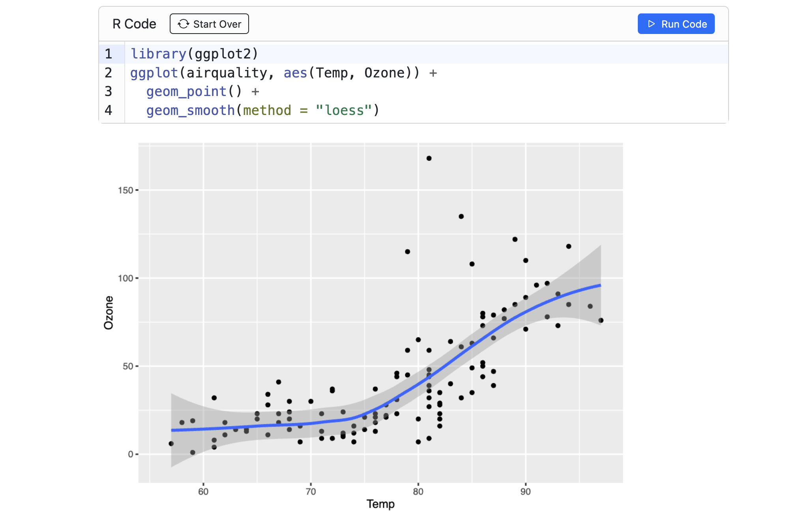
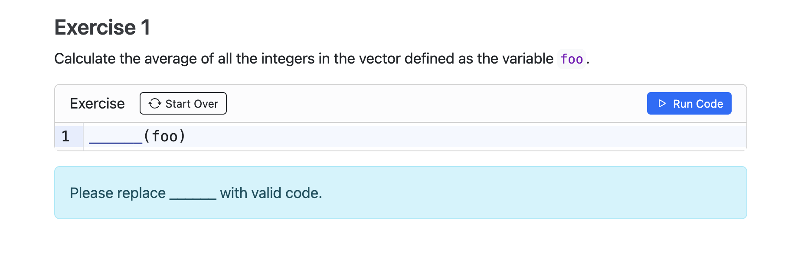
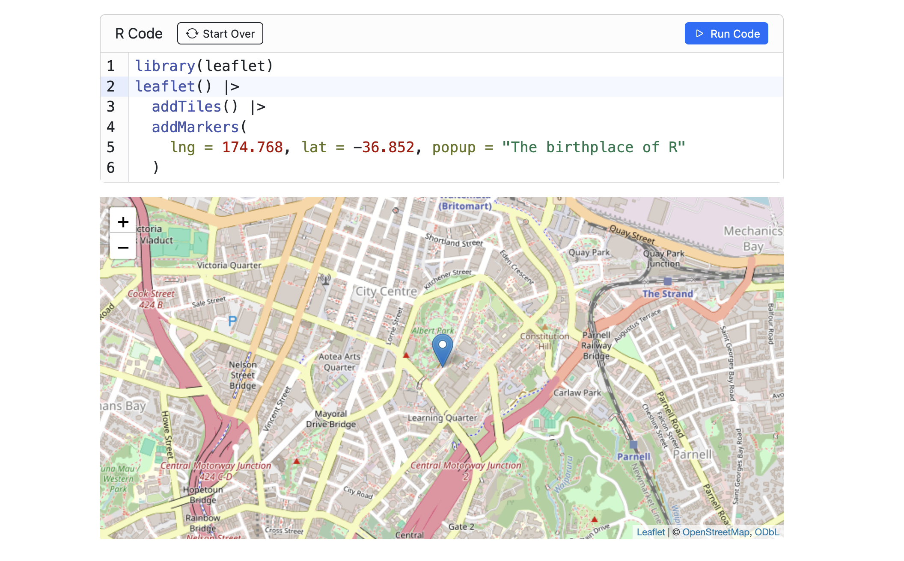

<!--
TODO:
* [x] Look over / edit the post's title in the yaml
* [x] Edit (or delete) the description; note this appears in the Twitter card
* [x] Pick category and tags (see existing with [`hugodown::tidy_show_meta()`](https://rdrr.io/pkg/hugodown/man/use_tidy_post.html))
* [x] Find photo & update yaml metadata
* [x] Create `thumbnail-sq.jpg`; height and width should be equal
* [x] Create `thumbnail-wd.jpg`; width should be >5x height
* [x] [`hugodown::use_tidy_thumbnails()`](https://rdrr.io/pkg/hugodown/man/use_tidy_post.html)
* [x] Add intro sentence, e.g. the standard tagline for the package
* [x] [`usethis::use_tidy_thanks()`](https://usethis.r-lib.org/reference/use_tidy_thanks.html)
-->

We're tickled pink to announce the release of [Quarto Live](https://r-wasm.github.io/quarto-live/) 0.1.1. Quarto Live is a new Quarto extension that uses WebAssembly to bring interactive examples and code exercises with custom grading algorithms to your HTML-based output documents, using standard Quarto markdown syntax.

Quarto Live adds a [CodeMirror](https://codemirror.net/)-based text editor to your document with automatic theming, syntax highlighting, and auto-complete. The editor executes R code using webR, and even integrates with Quarto's OJS support so that interactive code cells update reactively with other `ojs` cells running in the page.

This third in a series of blog posts will show off some of Quarto Live features, showing useful examples -- particularly for authors who are creating educational and instructional content where a little interactivity can go a long way to keep readers engaged. The post will show static screenshots, but if you'd like see it in action there are interactive examples throughout the [Quarto Live documentation website](https://r-wasm.github.io/quarto-live/).

## Getting Started

You can add the Quarto Live extension to a project by running the following command in a terminal:

    quarto add r-wasm/quarto-live

Then, use the create a new document with the following template to get up and running with the `knitr` engine:

<div class="highlight">

<pre class='chroma'><code class='language-r' data-lang='r'>---
title: R Example
engine: knitr
format: live-html
---

{{&lt; include ./_extensions/r-wasm/live/_knitr.qmd &gt;}}
</code></pre>

</div>

Once the live document has been set up in this way, further changes to the Quarto syntax to convert a standard `{r}` code block into an interactive Quarto Live code block are minimal. Simply switch the type of code cell to `{webr}`:

<div class="highlight">

<pre class='chroma'><code class='language-r' data-lang='r'>```{webr}
#| warning: false
library(ggplot2)
ggplot(airquality, aes(Temp, Ozone)) +
  geom_point() +
  geom_smooth(method = "loess")
```
</code></pre>

</div>

The resulting rendered document should look something like the following. An interactive code editor is inserted into the document in the place of the `webr` code block, where an interested reader can modify and re-execute the source code in place.



The real beauty of this, in my opinion, is that the reader does not have to install any packages, copy and paste source code, switch to an IDE like RStudio, or deal with myriad other small but fiddly distractions just to experiment. They can do it, right there, without any context switching.

If this reminds you a little of Jupyter notebook cells, you're not alone! To me, however, they do feel different as a reader and in a fairly interesting way. Where a notebook feels more like an explanatory and computational tool, a Quarto Live cell feels more like published content; somewhere in-between notebooks and the beautiful but static rendered output of literate programming frameworks like Quarto.

## Interactive exercises

One of the demographics I've spoken to who are the most excited about the applications of WebAssembly and webR in rendered content is the education space. Traditionally, this level of direct interactivity in a rendered document has only been possible though tools that require a server-side component, such as a Jupyter server or a Shiny server using the [learnr](https://rstudio.github.io/learnr/) package, to execute R code dynamically. This has limited the deployment options for educators, particularly those who are restricted in where they can deploy to an institution's own [learning management system (LMS)](https://en.wikipedia.org/wiki/Learning_management_system), or by the sheer number of client visitors in the case of extremely large class sizes.

The rise of virtual learning over the last few years has exacerbated the problem, tutorials might no longer be in-person in a managed computer lab, but virtually over the internet and on student controlled devices.

WebAssembly brings a potential solution to this problem in the form of a universal runtime with minimal dependencies. Using Quarto Live, an interactive tutorial can be rendered into static HTML output. Such output is well supported by virtual learning environments compared to traditional Shiny apps, without the upfront and ongoing management of a server component. And since the tutorial content is run entirely within the student's browser, issues of installation and configuration are no longer show stopper problems.

### Defining an exercise

Here's an example showing how to create an interactive tutorial using Quarto Live. We'll build an introductory exercise with a grading component, so that visitors can get feedback on their exercise response.

First, add some exercise text and create some placeholder code to be shown. We'll also label the exercise -- later we'll link additional features using this label.

<div class="highlight">

<pre class='chroma'><code class='language-r' data-lang='r'>### Exercise 1
Calculate the average of all the integers in the vector defined as the variable `foo`.

```{webr}
#| exercise: ex_1
______(foo)
```
</code></pre>

</div>

This will add the interactive code editor to the page, along with your placeholder code. Notice how the placeholder contains a string of six underscore (`_`) characters. When defining an exercise, Quarto Live will consider six or more underscores as a "blank" that must be replaced by the learner.



Next, let's add some setup code. We've asked about a vector `foo`, but not defined it anywhere. Let's fix that using a "setup" block. We'll create a new code block, linked to our exercise by its label, that will always run first whenever the learner submits their code. This code block can appear before or after the one above, the placement does not matter.

<div class="highlight">

<pre class='chroma'><code class='language-r' data-lang='r'>```{webr}
#| exercise: ex_1
#| setup: true
foo <- sample.int(100, 10)
```
</code></pre>

</div>


Success! Our set up code is now executed before the learner submitted code. Let's add a "check" code block. This one will hold our grading algorithm, checking submitted code and assigning feedback.

<div class="highlight">

<pre class='chroma'><code class='language-r' data-lang='r'>```{webr}
#| exercise: ex_1
#| check: true
if (identical(.result, mean(foo))) {
  list(correct = TRUE, message = "Nice work!")
} else {
  list(correct = FALSE, message = "That's incorrect, sorry.")
}
```
</code></pre>

</div>


Finally, let's add a solution. This time we'll use a Quarto fenced block to define the content. We'll still link it to our exercise by providing the same label we used before.

    ::: { .solution exercise="ex_1" }
    ::: { .callout-tip title="Solution" collapse="false"}
    Here is a possible solution:
    ```r
    bar <- mean(foo)   #<1>
    print(bar)         #<2>
    ```
    1. Use the `mean` function with `foo` to calculate the average, store this value as `bar`.
    2. Print the value stored in `bar` to the console.
    :::
    :::


What I really like about this is that you can create hints and solutions that will be revealed only when the relevant buttons are clicked in the Quarto Live exercise editor, but since they are defined in terms of standard Quarto fenced blocks we can take full advantage of all the great features Quarto provides for describing source code and results. Features like collapsible callout blocks and annotated source code allow us to present our solution in the most effective way for learners.

You can read more about exercises and grading, including how to make use of the existing [gradethis](https://pkgs.rstudio.com/gradethis/index.html) package, in the [Quarto Live documentation](https://r-wasm.github.io/quarto-live/exercises/grading.html).

## Reactivity with OJS

The technology powering the grading feature shown in the previous section is very general, based on Quarto's support for `ojs` cells. Quarto Live cells may define or take input from OJS reactive variables in the page, providing a seamless way to create dynamic experiences without requiring the use of R Shiny. In the following example a Quarto Live cell takes input from an OJS variable and defines an output OJS variable. Notice how updates in the Quarto Live cell are propagated to related of the `ojs` cells in the page.

<div class="highlight">

<pre class='chroma'><code class='language-r' data-lang='r'>```{ojs}
foo = 123;
```

```{ojs}
bar
```

```{webr}
#| input: ['foo']
#| define: ['bar']
bar <- foo ** 2
```
</code></pre>

</div>


You can even define an function in R and then call it directly from an `ojs` cell! Complex computational and statistical methods can be defined in R, executed under WebAssembly, and invoked reactively with OJS.

<div class="highlight">

<pre class='chroma'><code class='language-r' data-lang='r'>```{webr}
#| include: false
#| define: draw_hist
draw_hist <- function(colour) {
  hist(rnorm(1000), col = colour)
}
```

```{ojs}
//| echo: false
viewof colour = Inputs.select(
  [ 'orangered', 'forestgreen', 'cornflowerblue' ],
  { label: 'Colour' }
);
draw_hist(colour);
```
</code></pre>

</div>


We hope this form of reactivity will become a powerful pattern to create rich interactive experiences for readers, without the need for a dedicated R execution server. For more examples using integration with OJS, take a look at the [penguins dashboard-like plot example](https://r-wasm.github.io/quarto-live/interactive/reactivity.html#overview) and [dynamic exercises](https://r-wasm.github.io/quarto-live/interactive/dynamic.html) in the Quarto Live documentation.

## Displaying htmlwidgets

The popular [htmltools](https://rstudio.github.io/htmltools/) and [htmlwidgets](https://www.htmlwidgets.org/) packages make HTML and JavaScript output possible from R, and are supported transparently with Quarto Live. This works because Quarto Live executes R code using the [evaluate](https://evaluate.r-lib.org) package and renders output using [knitr](https://yihui.org/knitr/). So, output should be almost identical to when using native R with Rmarkdown or Quarto. Simply print a htmlwidget in a live code block and the result will be dynamically added to the web page.



## One more thing

By the way, everything I've shown in this blog post also works for Python using the [Pyodide](https://pyodide.org) WebAssembly engine. Pyodide is a really great project and inspired much of how the webR engine and library works today. Many examples of running Quarto Live to execute Python code, including dynamic experiences similar to those shown the previous sections, can be found at the [Quarto Live documentation website](https://r-wasm.github.io/quarto-live/).

## Acknowledgements

I'm excited and fascinated to see Quarto Live start being used by the community to create interactive content for the education space and beyond. The project is still fairly new, but we would already not where we are without the help of early users providing their comments, issues and bug reports. Thank you!

[@Analect](https://github.com/Analect), [@andrewpbray](https://github.com/andrewpbray), [@aneesha](https://github.com/aneesha), [@arnaud-feldmann](https://github.com/arnaud-feldmann), [@coatless](https://github.com/coatless), [@cwickham](https://github.com/cwickham), [@CyuHat](https://github.com/CyuHat), [@DrDeception](https://github.com/DrDeception), [@fcichos](https://github.com/fcichos), [@joelnitta](https://github.com/joelnitta), [@joelostblom](https://github.com/joelostblom), [@kcarnold](https://github.com/kcarnold), [@michaelplynch](https://github.com/michaelplynch), [@mine-cetinkaya-rundel](https://github.com/mine-cetinkaya-rundel), [@Nenuial](https://github.com/Nenuial), [@rpruim](https://github.com/rpruim), [@rundel](https://github.com/rundel), [@ryjohnson09](https://github.com/ryjohnson09), and [@tmieno2](https://github.com/tmieno2).

