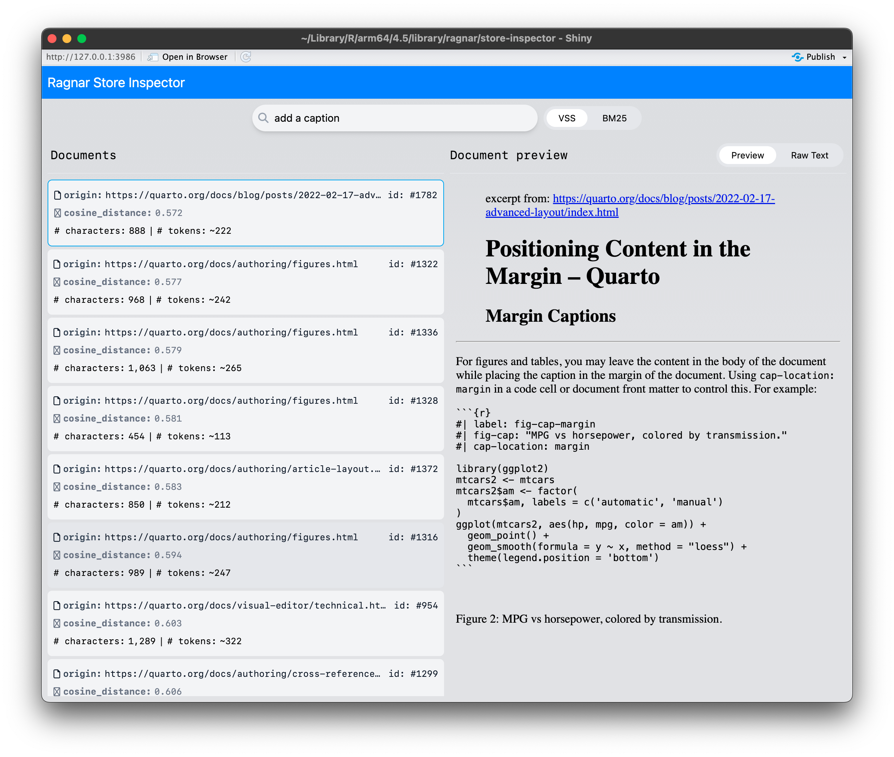

# ragnar 0.1.0

We're happy to announce the release of [ragnar](ragnar.tidyverse.org) 0.1.0, a new R package for building trustworthy Retrieval-Augmented Generation (RAG) workflows.

You can install it from CRAN with:

``` r
install.packages("ragnar")
```

## What's Retrieval-Augmented Generation (RAG)?

Large language models (LLMs) are powerful text generators, but they're also notorious for confidently making things up (*hallucinating*). RAG reduces the risk of hallucinations by grounding LLMs in your factual, trusted documents.

Instead of asking an LLM to respond from its own memory, you:

1.  Retrieve relevant passages from trusted sources.
2.  Ask the model to answer *using those passages*.

RAG shifts the LLMs job from open ended generation towards summarizing and paraphrasing, an easier task where LLMs make substantially fewer fabrications.

## Meet **ragnar**

ragnar is a tidy interface for building a RAG pipeline. Use it to:

- *Ingest* documents from the web, PDFs, Word, or local Markdown.
- *Chunk* and augment text with sensible defaults you can adjust.
- *Embed* chunks with commercial or open-source models.
- *Store* embeddings in DuckDB for fast, local queries.
- *Retrieve* relevant chunks using both vector and text search.

## Quick Start: Ingest, Chunk, and Store Your Documents

Here is how to build a RAG knowledge store from the Quarto docs.

<div class="highlight">

<pre class='chroma'><code class='language-r' data-lang='r'><span><span class='kr'><a href='https://rdrr.io/r/base/library.html'>library</a></span><span class='o'>(</span><span class='nv'><a href='http://ragnar.tidyverse.org/'>ragnar</a></span><span class='o'>)</span></span></code></pre>

</div>

1.  Create an knowledge store

    <div class="highlight">

    <pre class='chroma'><code class='language-r' data-lang='r'><span><span class='nv'>store</span> <span class='o'>&lt;-</span> <span class='nf'><a href='https://ragnar.tidyverse.org/reference/ragnar_store_create.html'>ragnar_store_create</a></span><span class='o'>(</span></span>
    <span>  <span class='s'>"./quarto.ragnar.duckdb"</span>,</span>
    <span>  embed <span class='o'>=</span> \<span class='o'>(</span><span class='nv'>x</span><span class='o'>)</span> <span class='nf'>ragnar</span><span class='nf'>::</span><span class='nf'><a href='https://ragnar.tidyverse.org/reference/embed_ollama.html'>embed_openai</a></span><span class='o'>(</span><span class='nv'>x</span>, model <span class='o'>=</span> <span class='s'>"text-embedding-3-small"</span><span class='o'>)</span></span>
    <span><span class='o'>)</span></span></code></pre>

    </div>

2.  Collect relevant web page urls from quarto.org

    <div class="highlight">

    <pre class='chroma'><code class='language-r' data-lang='r'><span><span class='nv'>pages</span> <span class='o'>&lt;-</span> <span class='nf'><a href='https://ragnar.tidyverse.org/reference/ragnar_find_links.html'>ragnar_find_links</a></span><span class='o'>(</span><span class='s'>"https://quarto.org/"</span>, depth <span class='o'>=</span> <span class='m'>2</span><span class='o'>)</span></span></code></pre>

    </div>

3.  Read, chunk, augment, embed and insert each page

    <div class="highlight">

    <pre class='chroma'><code class='language-r' data-lang='r'><span><span class='kr'>for</span> <span class='o'>(</span><span class='nv'>page</span> <span class='kr'>in</span> <span class='nv'>pages</span><span class='o'>)</span> <span class='o'>&#123;</span></span>
    <span>  <span class='nv'>chunks</span> <span class='o'>&lt;-</span> <span class='nv'>page</span> <span class='o'>|&gt;</span></span>
    <span>    <span class='c'># Convert to markdown</span></span>
    <span>    <span class='nf'><a href='https://ragnar.tidyverse.org/reference/ragnar_read.html'>ragnar_read</a></span><span class='o'>(</span>frame_by_tags <span class='o'>=</span> <span class='nf'><a href='https://rdrr.io/r/base/c.html'>c</a></span><span class='o'>(</span><span class='s'>"h1"</span>, <span class='s'>"h2"</span>, <span class='s'>"h3"</span><span class='o'>)</span><span class='o'>)</span> <span class='o'>|&gt;</span></span>
    <span></span>
    <span>    <span class='c'># Split document into chunks</span></span>
    <span>    <span class='nf'><a href='https://ragnar.tidyverse.org/reference/ragnar_chunk.html'>ragnar_chunk</a></span><span class='o'>(</span>boundaries <span class='o'>=</span> <span class='nf'><a href='https://rdrr.io/r/base/c.html'>c</a></span><span class='o'>(</span><span class='s'>"paragraph"</span>, <span class='s'>"sentence"</span><span class='o'>)</span><span class='o'>)</span> <span class='o'>|&gt;</span></span>
    <span></span>
    <span>    <span class='c'># Add document context to each chunk</span></span>
    <span>    <span class='nf'>dplyr</span><span class='nf'>::</span><span class='nf'><a href='https://dplyr.tidyverse.org/reference/mutate.html'>mutate</a></span><span class='o'>(</span></span>
    <span>      text <span class='o'>=</span> <span class='nf'>glue</span><span class='nf'>::</span><span class='nf'><a href='https://glue.tidyverse.org/reference/glue.html'>glue</a></span><span class='o'>(</span></span>
    <span>        <span class='s'>r"---(</span></span>
    <span><span class='s'>        &gt; Excerpt from: &#123;origin&#125;</span></span>
    <span><span class='s'>        &gt; &#123;h1&#125;</span></span>
    <span><span class='s'>        &gt; &#123;h2&#125;</span></span>
    <span><span class='s'>        &gt; &#123;h3&#125;</span></span>
    <span><span class='s'>        &#123;text&#125;</span></span>
    <span><span class='s'>        )---"</span></span>
    <span>      <span class='o'>)</span></span>
    <span>    <span class='o'>)</span></span>
    <span></span>
    <span>  <span class='nf'><a href='https://ragnar.tidyverse.org/reference/ragnar_store_insert.html'>ragnar_store_insert</a></span><span class='o'>(</span><span class='nv'>store</span>, <span class='nv'>chunks</span><span class='o'>)</span></span>
    <span><span class='o'>&#125;</span></span></code></pre>

    </div>

4.  Build the retrieval index

    <div class="highlight">

    <pre class='chroma'><code class='language-r' data-lang='r'><span><span class='nf'><a href='https://ragnar.tidyverse.org/reference/ragnar_store_build_index.html'>ragnar_store_build_index</a></span><span class='o'>(</span><span class='nv'>store</span><span class='o'>)</span></span></code></pre>

    </div>

Once the store is built, you can access it for fast retrieval.

## Retrieve Relevent Chunks

Pass a query string to [`ragnar_retrieve()`](https://ragnar.tidyverse.org/reference/ragnar_retrieve.html) to perform both semantic search using vector embeddings and conventional text search to retrieve the most relevant chunks.

<div class="highlight">

<pre class='chroma'><code class='language-r' data-lang='r'><span><span class='nv'>store</span> <span class='o'>&lt;-</span> <span class='nf'><a href='https://ragnar.tidyverse.org/reference/rangar_store_create.html'>ragnar_store_connect</a></span><span class='o'>(</span><span class='s'>"./quarto.ragnar.duckdb"</span>, read_only <span class='o'>=</span> <span class='kc'>TRUE</span><span class='o'>)</span></span>
<span><span class='nv'>query</span> <span class='o'>&lt;-</span> <span class='s'>"What's the difference between &#123;.python&#125; and &#123;python&#125; in a code chunk header?"</span></span>
<span></span>
<span><span class='nf'><a href='https://ragnar.tidyverse.org/reference/ragnar_retrieve.html'>ragnar_retrieve</a></span><span class='o'>(</span><span class='nv'>store</span>, <span class='nv'>query</span>, top_k <span class='o'>=</span> <span class='m'>5</span><span class='o'>)</span></span></code></pre>

</div>

## Equip an LLM Chatbot with Your Store

You can let an ellmer chat session search your knowledge store automatically:

<div class="highlight">

</div>

<div class="highlight">

<pre class='chroma'><code class='language-r' data-lang='r'><span><span class='kr'><a href='https://rdrr.io/r/base/library.html'>library</a></span><span class='o'>(</span><span class='nv'><a href='https://ellmer.tidyverse.org'>ellmer</a></span><span class='o'>)</span></span>
<span></span>
<span><span class='nv'>chat</span> <span class='o'>&lt;-</span> <span class='nf'><a href='https://ellmer.tidyverse.org/reference/chat_openai.html'>chat_openai</a></span><span class='o'>(</span></span>
<span>  system_prompt <span class='o'>=</span> <span class='nf'>glue</span><span class='nf'>::</span><span class='nf'><a href='https://glue.tidyverse.org/reference/trim.html'>trim</a></span><span class='o'>(</span><span class='s'>"</span></span>
<span><span class='s'>    You are a Quarto documentation search agent and summarizer.</span></span>
<span><span class='s'>    For every user question, perform a search and include</span></span>
<span><span class='s'>    links to the source documents in your response.</span></span>
<span><span class='s'>    "</span><span class='o'>)</span></span>
<span>  <span class='o'>)</span> <span class='o'>|&gt;</span></span>
<span>  <span class='nf'><a href='https://ragnar.tidyverse.org/reference/ragnar_register_tool_retrieve.html'>ragnar_register_tool_retrieve</a></span><span class='o'>(</span><span class='nv'>store</span>, top_k <span class='o'>=</span> <span class='m'>10</span><span class='o'>)</span></span>
<span></span>
<span><span class='nv'>chat</span><span class='o'>$</span><span class='nf'>chat</span><span class='o'>(</span></span>
<span>  <span class='s'>"What's the difference between &#123;.python&#125; and &#123;python&#125; in a chunk header?"</span></span>
<span><span class='o'>)</span></span></code></pre>

</div>

The model's responses will cite and link back to your source documents, so users can easily follow links to learn more.

### Inspect and Iterate

Use [`ragnar_store_inspect()`](https://ragnar.tidyverse.org/reference/ragnar_store_inspect.html) to interactively preview which text chunks are retrieved for different search queries. This helps identify issues like awkward document conversion, chunking, or context augmentation, so you can refine your data processing pipeline. By making retrieval results easy to explore, `ragnar` lets you iterate and tune your knowledge store before connecting it to an LLM.

<figure>

<figcaption aria-hidden="true">Store Inspector UI screenshot</figcaption>
</figure>

## Additional Features

- **Works with many document types**: [`ragnar_read()`](https://ragnar.tidyverse.org/reference/ragnar_read.html) and [`read_as_markdown()`](https://ragnar.tidyverse.org/reference/read_as_markdown.html) uses [MarkItDown](https://github.com/microsoft/markitdown), which means it can ingest an extremely wide variety of files: HTML, PDF, docx, pptx, epubs, compressed archives, and more.
- **Flexible embeddings**: Choose OpenAI, open-source (`ollama`), or your own embedding function.
- **DuckDB native**: Extremely fast local indexing and retrieval.
- **Customizable chunk augmentation**: Easily customize how chunks are augmented with context (headings, links, titles).
- **Not a black box**: Easily inspect the store contents and retrieval results.

## Get Started

- **Install:** `install.packages("ragnar")`
- **Read the "Getting Started" vignette:** [ragnar documentation](https://tidyverse.github.io/ragnar/articles/ragnar.html)
- **Explore more examples:** [ragnar GitHub README](https://github.com/tidyverse/ragnar#readme)

## Acknowledgements

A big thanks to all contributors who helped out with ragnar development through thoughtful discussions, bug reports, and pull requests.

[@arnavchauhan7](https://github.com/arnavchauhan7), [@bowerth](https://github.com/bowerth), [@dfalbel](https://github.com/dfalbel), [@dingying85](https://github.com/dingying85), [@hadley](https://github.com/hadley), [@PauloSantana2019](https://github.com/PauloSantana2019), [@schochastics](https://github.com/schochastics), [@smach](https://github.com/smach), and [@t-kalinowski](https://github.com/t-kalinowski).

