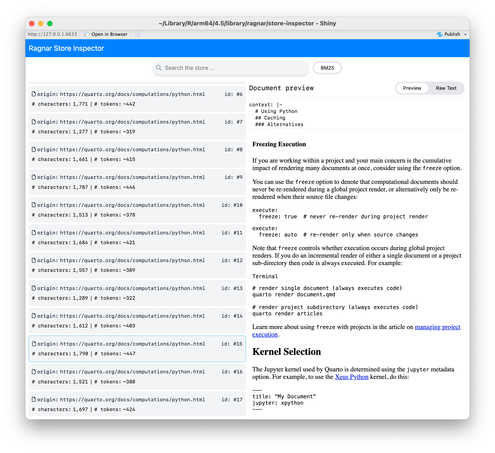

```{r, include = FALSE}
knitr::opts_chunk$set(
  collapse = TRUE,
  comment  = "#>",
  eval = FALSE
)
```

# ragnar 0.2

We're happy to announce the release of [ragnar](ragnar.tidyverse.org)
0.2, a new R package for building trustworthy Retrieval-Augmented
Generation (RAG) workflows.

You can install it from CRAN with:

``` r
install.packages("ragnar")
```

## What’s Retrieval-Augmented Generation (RAG)?

Large language models (LLMs) tend to generate fluent confident text
completely detached from facts and reality. We politely call untrue
statements from an LLM *hallucinations*. RAG reduces the risk of
hallucinations by grounding LLMs in your factual, trusted documents.

With RAG, instead of asking an LLM to respond from its own memory, we:

1.  Retrieve relevant passages from trusted sources.
2.  Ask the model to answer using those passages.

RAG shifts the LLMs job from open ended generation towards summarizing
and paraphrasing, an easier task where LLMs make substantially fewer
fabrications.

## Meet **ragnar**

ragnar is a tidy interface for building a RAG pipeline. Use ragnar to:

-   *Convert* documents from the web or local filesystem into Markdown.
-   *Chunk* documents using meaningful semantic boundaries.
-   *Augment* chunks with a short context string that situates each
    chunk.
-   *Embed* chunks with commercial or open-source models.
-   *Store* embeddings in DuckDB for fast, local queries.
-   *Retrieve* relevant chunks using both vector and text search.

## Quick start: collect, convert, chunk, embed, and store your documents

Here is how to build a RAG knowledge store from the Quarto docs.

```{r, eval = TRUE}
library(ragnar)
```

1.  Create a knowledge store.

    ```{r}
    store <- ragnar_store_create(
      "./quarto.ragnar.duckdb",
      embed = \(x) ragnar::embed_openai(x, model = "text-embedding-3-small"),
      name = "quarto_docs"
    )
    ```

2.  Generate a list of relevant web page URLs from quarto.org. We can
    consult the sitemap, or, if a sitemap wasn't available, we could
    also crawl the site.

    ```{r}
    pages <- ragnar_find_links("https://quarto.org/sitemap.xml")
    ```

3.  Convert, chunk, augment, embed, and store each page.

    ```{r}
    for (page in pages) {
      chunks <- page |>

        # Convert to markdown
        read_as_markdown() |>

        # Split document into chunks and generate 'context' for each chunk.
        markdown_chunk()

      # Embed and store chunks with context and metadata
      ragnar_store_insert(store, chunks)
    }
    ```

4.  Build the retrieval index.

    ```{r}
    ragnar_store_build_index(store)
    ```

Once the store is built, you can access it for fast retrieval.

## Retrieve relevant chunks

Pass a query string to `ragnar_retrieve()` to perform both semantic
search using vector embeddings and conventional text search to retrieve
the most relevant chunks.

```{r, eval = TRUE}
store <- ragnar_store_connect("./quarto.ragnar.duckdb", read_only = TRUE)
query <- "{.python} or {python} code chunk header"

ragnar_retrieve(store, query, top_k = 5)
```

## Equip an LLM chat with your store

You can equip an ellmer chat with a tool that lets the LLM search your
knowledge store automatically.

```{r, eval = TRUE}
library(ellmer)

chat <- chat_openai(
  system_prompt = glue::trim("
    You are a Quarto documentation search agent and summarizer.
    You are concise.
    For every user question, perform between one and three searches.
    Include links to the source documents in your response.
    ")
  ) |>
  ragnar_register_tool_retrieve(store, top_k = 10)
```

The model can now search the store on demand. It has the ability to
rewrite the search query and do repeated searches. The model’s responses
will also cite and link back to your source documents, so users can
easily follow links to learn more.

```{r, eval = TRUE}
chat$chat(
  "What's the difference between {.python} and {python}
  in a code chunk header?"
)
```

### Inspect and iterate

Use `ragnar_store_inspect()` to interactively preview which text chunks
are retrieved for different search queries. This helps identify issues
like poor document conversion, chunking, or context augmentation, so you
can refine your store creation pipeline. By making retrieval results
easy to explore, `ragnar` lets you iterate and tune your knowledge store
before connecting it to an LLM.

You can also launch the store inspector with just a single chunked
document using `ragnar_chunks_view()`. This is particularly useful when
deciding what chunking approach is most appropriate for your content.



## Additional features

-   **Works with many document types**: `read_as_markdown()` uses
    [MarkItDown](https://github.com/microsoft/markitdown), which means
    it can ingest an extremely wide variety of files: HTML, PDF, docx,
    pptx, epubs, compressed archives, and more.
-   **Flexible embeddings**: Use embedding models from providers like
    OpenAI, Google Vertex or Gemini, Bedrock, Databricks, Ollama or LM
    Studio, or easily supply your own embedding function.
-   **DuckDB native**: Extremely fast local indexing and retrieval.
    Native support for MotherDuck if you need to serve the store.
-   **Customizable chunk augmentation**: Customize how chunks are
    augmented with context (headings, links, titles), and easily attach
    additional metadata to chunks.
-   **Not a black box**: Easily inspect the store contents and retrieval
    results.

## Get started

-   **Install:** `install.packages("ragnar")`
-   **Read the vignette:** [Getting
    Started](https://ragnar.tidyverse.org/articles/ragnar.html)
-   **Explore more examples:** [ragnar GitHub
    repository](https://github.com/tidyverse/ragnar)

## Acknowledgements

A big thanks to all contributors who helped out with ragnar development
through thoughtful discussions, bug reports, and pull requests.

[\@app2let](https://github.com/app2let),
[\@arnavchauhan7](https://github.com/arnavchauhan7),
[\@atheriel](https://github.com/atheriel),
[\@bowerth](https://github.com/bowerth),
[\@cboettig](https://github.com/cboettig),
[\@Christophe-Regouby](https://github.com/Christophe-Regouby),
[\@dfalbel](https://github.com/dfalbel),
[\@dingying85](https://github.com/dingying85),
[\@gadenbuie](https://github.com/gadenbuie),
[\@hadley](https://github.com/hadley),
[\@JCfly3000](https://github.com/JCfly3000),
[\@jrosell](https://github.com/jrosell),
[\@kaipingyang](https://github.com/kaipingyang),
[\@mattwarkentin](https://github.com/mattwarkentin),
[\@PauloSantana2019](https://github.com/PauloSantana2019),
[\@pedrobtz](https://github.com/pedrobtz),
[\@RichardHooijmaijers](https://github.com/RichardHooijmaijers),
[\@schochastics](https://github.com/schochastics),
[\@sikiru-atanda](https://github.com/sikiru-atanda),
[\@SimonEdscer](https://github.com/SimonEdscer),
[\@smach](https://github.com/smach),
[\@t-kalinowski](https://github.com/t-kalinowski), and
[\@topepo](https://github.com/topepo).
