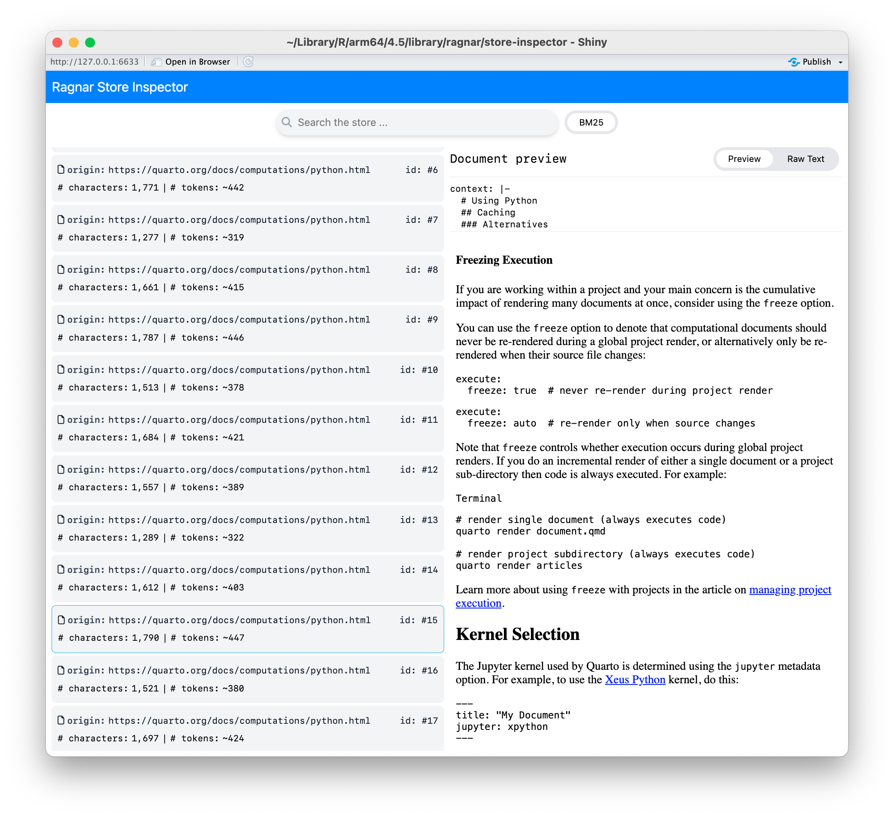

# ragnar 0.2

We're happy to announce the release of [ragnar](ragnar.tidyverse.org) 0.2, a new R package for building trustworthy Retrieval-Augmented Generation (RAG) workflows.

You can install it from CRAN with:

``` r
install.packages("ragnar")
```

## What's Retrieval-Augmented Generation (RAG)?

Large language models (LLMs) tend to generate fluent confident text completely detached from facts and reality. We politely call untrue statements from an LLM *hallucinations*. RAG reduces the risk of hallucinations by grounding LLMs in your factual, trusted documents.

With RAG, instead of asking an LLM to respond from its own memory, we:

1.  Retrieve relevant passages from trusted sources.
2.  Ask the model to answer using those passages.

RAG shifts the LLMs job from open ended generation towards summarizing and paraphrasing, an easier task where LLMs make substantially fewer fabrications.

## Meet **ragnar**

ragnar is a tidy interface for building a RAG pipeline. Use ragnar to:

- *Convert* documents from the web or local filesystem into Markdown.
- *Chunk* documents using meaningful semantic boundaries.
- *Augment* chunks with a short context string that situates each chunk.
- *Embed* chunks with commercial or open-source models.
- *Store* embeddings in DuckDB for fast, local queries.
- *Retrieve* relevant chunks using both vector and text search.

## Quick Start: Ingest, Chunk, and Store Your Documents

Here is how to build a RAG knowledge store from the Quarto docs.

<div class="highlight">

<pre class='chroma'><code class='language-r' data-lang='r'><span><span class='kr'><a href='https://rdrr.io/r/base/library.html'>library</a></span><span class='o'>(</span><span class='nv'><a href='https://ragnar.tidyverse.org/'>ragnar</a></span><span class='o'>)</span></span></code></pre>

</div>

1.  Create a knowledge store.

    <div class="highlight">

    <pre class='chroma'><code class='language-r' data-lang='r'><span><span class='nv'>store</span> <span class='o'>&lt;-</span> <span class='nf'><a href='https://ragnar.tidyverse.org/reference/ragnar_store_create.html'>ragnar_store_create</a></span><span class='o'>(</span></span>
    <span>  <span class='s'>"./quarto.ragnar.duckdb"</span>,</span>
    <span>  embed <span class='o'>=</span> \<span class='o'>(</span><span class='nv'>x</span><span class='o'>)</span> <span class='nf'>ragnar</span><span class='nf'>::</span><span class='nf'><a href='https://ragnar.tidyverse.org/reference/embed_ollama.html'>embed_openai</a></span><span class='o'>(</span><span class='nv'>x</span>, model <span class='o'>=</span> <span class='s'>"text-embedding-3-small"</span><span class='o'>)</span>,</span>
    <span>  name <span class='o'>=</span> <span class='s'>"quarto_docs"</span></span>
    <span><span class='o'>)</span></span></code></pre>

    </div>

2.  Generate a list of relevant web page URLs from quarto.org. We can consult the sitemap, or, if a sitemap wasn't available, we could also crawl the site.

    <div class="highlight">

    <pre class='chroma'><code class='language-r' data-lang='r'><span><span class='nv'>pages</span> <span class='o'>&lt;-</span> <span class='nf'><a href='https://ragnar.tidyverse.org/reference/ragnar_find_links.html'>ragnar_find_links</a></span><span class='o'>(</span><span class='s'>"https://quarto.org/sitemap.xml"</span><span class='o'>)</span></span></code></pre>

    </div>

3.  Convert, chunk, augment, embed, and store each page.

    <div class="highlight">

    <pre class='chroma'><code class='language-r' data-lang='r'><span><span class='kr'>for</span> <span class='o'>(</span><span class='nv'>page</span> <span class='kr'>in</span> <span class='nv'>pages</span><span class='o'>)</span> <span class='o'>&#123;</span></span>
    <span>  <span class='nv'>chunks</span> <span class='o'>&lt;-</span> <span class='nv'>page</span> <span class='o'>|&gt;</span></span>
    <span></span>
    <span>    <span class='c'># Convert to markdown</span></span>
    <span>    <span class='nf'><a href='https://ragnar.tidyverse.org/reference/read_as_markdown.html'>read_as_markdown</a></span><span class='o'>(</span><span class='o'>)</span> <span class='o'>|&gt;</span></span>
    <span></span>
    <span>    <span class='c'># Split document into chunks and generate 'context' for each chunk.</span></span>
    <span>    <span class='nf'><a href='https://ragnar.tidyverse.org/reference/markdown_chunk.html'>markdown_chunk</a></span><span class='o'>(</span><span class='o'>)</span></span>
    <span></span>
    <span>  <span class='c'># Embed and store chunks with context and metadata</span></span>
    <span>  <span class='nf'><a href='https://ragnar.tidyverse.org/reference/ragnar_store_insert.html'>ragnar_store_insert</a></span><span class='o'>(</span><span class='nv'>store</span>, <span class='nv'>chunks</span><span class='o'>)</span></span>
    <span><span class='o'>&#125;</span></span></code></pre>

    </div>

4.  Build the retrieval index.

    <div class="highlight">

    <pre class='chroma'><code class='language-r' data-lang='r'><span><span class='nf'><a href='https://ragnar.tidyverse.org/reference/ragnar_store_build_index.html'>ragnar_store_build_index</a></span><span class='o'>(</span><span class='nv'>store</span><span class='o'>)</span></span></code></pre>

    </div>

Once the store is built, you can access it for fast retrieval.

## Retrieve Relevant Chunks

Pass a query string to [`ragnar_retrieve()`](https://ragnar.tidyverse.org/reference/ragnar_retrieve.html) to perform both semantic search using vector embeddings and conventional text search to retrieve the most relevant chunks.

<div class="highlight">

<pre class='chroma'><code class='language-r' data-lang='r'><span><span class='nv'>store</span> <span class='o'>&lt;-</span> <span class='nf'><a href='https://ragnar.tidyverse.org/reference/ragnar_store_create.html'>ragnar_store_connect</a></span><span class='o'>(</span><span class='s'>"./quarto.ragnar.duckdb"</span>, read_only <span class='o'>=</span> <span class='kc'>TRUE</span><span class='o'>)</span></span>
<span><span class='nv'>query</span> <span class='o'>&lt;-</span> <span class='s'>"&#123;.python&#125; or &#123;python&#125; code chunk header"</span></span>
<span></span>
<span><span class='nf'><a href='https://ragnar.tidyverse.org/reference/ragnar_retrieve.html'>ragnar_retrieve</a></span><span class='o'>(</span><span class='nv'>store</span>, <span class='nv'>query</span>, top_k <span class='o'>=</span> <span class='m'>5</span><span class='o'>)</span></span>
<span><span class='c'>#&gt; <span style='color: #555555;'># A tibble: 9 × 9</span></span></span>
<span><span class='c'>#&gt;   origin         doc_id chunk_id start   end cosine_distance bm25  context text </span></span>
<span><span class='c'>#&gt;   <span style='color: #555555; font-style: italic;'>&lt;chr&gt;</span>           <span style='color: #555555; font-style: italic;'>&lt;int&gt;</span> <span style='color: #555555; font-style: italic;'>&lt;list&gt;</span>   <span style='color: #555555; font-style: italic;'>&lt;int&gt;</span> <span style='color: #555555; font-style: italic;'>&lt;int&gt;</span> <span style='color: #555555; font-style: italic;'>&lt;list&gt;</span>          <span style='color: #555555; font-style: italic;'>&lt;lis&gt;</span> <span style='color: #555555; font-style: italic;'>&lt;chr&gt;</span>   <span style='color: #555555; font-style: italic;'>&lt;chr&gt;</span></span></span>
<span><span class='c'>#&gt; <span style='color: #555555;'>1</span> https://quart…     23 <span style='color: #555555;'>&lt;int&gt;</span>    <span style='text-decoration: underline;'>14</span>318 <span style='text-decoration: underline;'>16</span>132 <span style='color: #555555;'>&lt;dbl [1]&gt;</span>       <span style='color: #555555;'>&lt;dbl&gt;</span> <span style='color: #555555;'>"</span># Dia… <span style='color: #555555;'>"</span>###…</span></span>
<span><span class='c'>#&gt; <span style='color: #555555;'>2</span> https://quart…     55 <span style='color: #555555;'>&lt;int&gt;</span>      869  <span style='text-decoration: underline;'>2</span>386 <span style='color: #555555;'>&lt;dbl [1]&gt;</span>       <span style='color: #555555;'>&lt;dbl&gt;</span> <span style='color: #555555;'>"</span># ASA… <span style='color: #555555;'>"</span>Hom…</span></span>
<span><span class='c'>#&gt; <span style='color: #555555;'>3</span> https://quart…     90 <span style='color: #555555;'>&lt;int&gt;</span>        1  <span style='text-decoration: underline;'>2</span>497 <span style='color: #555555;'>&lt;dbl [2]&gt;</span>       <span style='color: #555555;'>&lt;dbl&gt;</span> <span style='color: #555555;'>""</span>      <span style='color: #555555;'>"</span># U…</span></span>
<span><span class='c'>#&gt; <span style='color: #555555;'>4</span> https://quart…    110 <span style='color: #555555;'>&lt;int&gt;</span>     <span style='text-decoration: underline;'>3</span>156  <span style='text-decoration: underline;'>4</span>928 <span style='color: #555555;'>&lt;dbl [1]&gt;</span>       <span style='color: #555555;'>&lt;dbl&gt;</span> <span style='color: #555555;'>"</span># v1.… <span style='color: #555555;'>"</span>## …</span></span>
<span><span class='c'>#&gt; <span style='color: #555555;'>5</span> https://quart…    132 <span style='color: #555555;'>&lt;int&gt;</span>     <span style='text-decoration: underline;'>5</span>365  <span style='text-decoration: underline;'>7</span>389 <span style='color: #555555;'>&lt;dbl [1]&gt;</span>       <span style='color: #555555;'>&lt;dbl&gt;</span> <span style='color: #555555;'>"</span># Cre… <span style='color: #555555;'>"</span>## …</span></span>
<span><span class='c'>#&gt; <span style='color: #555555;'>6</span> https://quart…    196 <span style='color: #555555;'>&lt;int&gt;</span>     <span style='text-decoration: underline;'>7</span>319  <span style='text-decoration: underline;'>8</span>804 <span style='color: #555555;'>&lt;dbl [1]&gt;</span>       <span style='color: #555555;'>&lt;dbl&gt;</span> <span style='color: #555555;'>"</span># HTM… <span style='color: #555555;'>"</span>## …</span></span>
<span><span class='c'>#&gt; <span style='color: #555555;'>7</span> https://quart…    196 <span style='color: #555555;'>&lt;int&gt;</span>    <span style='text-decoration: underline;'>11</span>096 <span style='text-decoration: underline;'>12</span>763 <span style='color: #555555;'>&lt;dbl [1]&gt;</span>       <span style='color: #555555;'>&lt;dbl&gt;</span> <span style='color: #555555;'>"</span># HTM… <span style='color: #555555;'>"</span>## …</span></span>
<span><span class='c'>#&gt; <span style='color: #555555;'>8</span> https://quart…    269 <span style='color: #555555;'>&lt;int&gt;</span>     <span style='text-decoration: underline;'>9</span>426 <span style='text-decoration: underline;'>11</span>250 <span style='color: #555555;'>&lt;dbl [1]&gt;</span>       <span style='color: #555555;'>&lt;dbl&gt;</span> <span style='color: #555555;'>"</span># Rev… <span style='color: #555555;'>"</span>###…</span></span>
<span><span class='c'>#&gt; <span style='color: #555555;'>9</span> https://quart…    366 <span style='color: #555555;'>&lt;int&gt;</span>     <span style='text-decoration: underline;'>5</span>236  <span style='text-decoration: underline;'>6</span>904 <span style='color: #555555;'>&lt;dbl [1]&gt;</span>       <span style='color: #555555;'>&lt;dbl&gt;</span> <span style='color: #555555;'>"</span># Hel… <span style='color: #555555;'>"</span>###…</span></span>
<span></span></code></pre>

</div>

## Equip an LLM Chatbot with Your Store

You can let an ellmer chat session search your knowledge store automatically:

<div class="highlight">

<pre class='chroma'><code class='language-r' data-lang='r'><span><span class='kr'><a href='https://rdrr.io/r/base/library.html'>library</a></span><span class='o'>(</span><span class='nv'><a href='https://ellmer.tidyverse.org'>ellmer</a></span><span class='o'>)</span></span>
<span></span>
<span><span class='nv'>chat</span> <span class='o'>&lt;-</span> <span class='nf'><a href='https://ellmer.tidyverse.org/reference/chat_openai.html'>chat_openai</a></span><span class='o'>(</span></span>
<span>  system_prompt <span class='o'>=</span> <span class='nf'>glue</span><span class='nf'>::</span><span class='nf'><a href='https://glue.tidyverse.org/reference/trim.html'>trim</a></span><span class='o'>(</span><span class='s'>"</span></span>
<span><span class='s'>    You are a Quarto documentation search agent and summarizer.</span></span>
<span><span class='s'>    You are concise.</span></span>
<span><span class='s'>    For every user question, perform between one and three searches.</span></span>
<span><span class='s'>    Include links to the source documents in your response.</span></span>
<span><span class='s'>    "</span><span class='o'>)</span></span>
<span>  <span class='o'>)</span> <span class='o'>|&gt;</span></span>
<span>  <span class='nf'><a href='https://ragnar.tidyverse.org/reference/ragnar_register_tool_retrieve.html'>ragnar_register_tool_retrieve</a></span><span class='o'>(</span><span class='nv'>store</span>, top_k <span class='o'>=</span> <span class='m'>10</span><span class='o'>)</span></span>
<span><span class='c'>#&gt; Using <span style='color: #00BB00;'>model</span> = <span style='color: #0000BB;'>"gpt-4.1"</span>.</span></span>
<span></span></code></pre>

</div>

The model can now search the store on demand. It has the ability to rewrite the search query and do repeated searches. The model's responses will also cite and link back to your source documents, so users can easily follow links to learn more.

<div class="highlight">

<pre class='chroma'><code class='language-r' data-lang='r'><span><span class='nv'>chat</span><span class='o'>$</span><span class='nf'>chat</span><span class='o'>(</span></span>
<span>  <span class='s'>"What's the difference between &#123;.python&#125; and &#123;python&#125;</span></span>
<span><span class='s'>  in a code chunk header?"</span></span>
<span><span class='o'>)</span></span>
<span><span class='c'>#&gt; <span style='color: #0000BB;'>◯</span> [<span style='color: #0000BB;'>tool call</span>] rag_retrieve_from_store_001(text = "difference between &#123;.python&#125;</span></span>
<span><span class='c'>#&gt; and &#123;python&#125; in Quarto code chunk header")</span></span>
<span></span><span><span class='c'>#&gt; <span style='color: #00BB00;'>●</span> #&gt; <span style='font-style: italic;'>[&#123;"origin":"https://quarto.org/docs/authoring/lipsum.html","doc_id":2…</span></span></span>
<span></span><span><span class='c'>#&gt; <span style='color: #0000BB;'>◯</span> [<span style='color: #0000BB;'>tool call</span>] rag_retrieve_from_store_001(text = "Quarto code chunk header</span></span>
<span><span class='c'>#&gt; syntax curly braces")</span></span>
<span></span><span><span class='c'>#&gt; <span style='color: #00BB00;'>●</span> #&gt; <span style='font-style: italic;'>[&#123;"origin":"https://quarto.org/docs/authoring/penguins.html","doc_id"…</span></span></span>
<span></span><span><span class='c'>#&gt; <span style='color: #0000BB;'>◯</span> [<span style='color: #0000BB;'>tool call</span>] rag_retrieve_from_store_001(text = "language specification in</span></span>
<span><span class='c'>#&gt; Quarto code chunk")</span></span>
<span></span><span><span class='c'>#&gt; <span style='color: #00BB00;'>●</span> #&gt; <span style='font-style: italic;'>[&#123;"origin":"https://quarto.org/docs/authoring/citations.html","doc_id…</span></span></span>
<span></span><span><span class='c'>#&gt; In Quarto, the difference between `&#123;.python&#125;` and `&#123;python&#125;` in a code chunk </span></span>
<span><span class='c'>#&gt; header is as follows:</span></span>
<span><span class='c'>#&gt; </span></span>
<span><span class='c'>#&gt; - ```&#123;python&#125;```: This is the standard way to declare an executable code block </span></span>
<span><span class='c'>#&gt; in Python. Quarto recognizes the language specified in braces and will execute </span></span>
<span><span class='c'>#&gt; the code block using the appropriate computational engine (Jupyter or Knitr, </span></span>
<span><span class='c'>#&gt; depending on your setup). For example:</span></span>
<span><span class='c'>#&gt; </span></span>
<span><span class='c'>#&gt;   ```</span></span>
<span><span class='c'>#&gt;   ```&#123;python&#125;</span></span>
<span><span class='c'>#&gt;   print("Hello, Quarto!")</span></span>
<span><span class='c'>#&gt;   ```</span></span>
<span><span class='c'>#&gt;   ```</span></span>
<span><span class='c'>#&gt;   This block will be executed and its output included in the rendered document.</span></span>
<span><span class='c'>#&gt; </span></span>
<span><span class='c'>#&gt; - ```&#123;.python&#125;```: The leading dot (`.`) before the language indicates a class </span></span>
<span><span class='c'>#&gt; attribute rather than a language. This is standard Pandoc/Markdown syntax, </span></span>
<span><span class='c'>#&gt; which adds a class ("python") to the code block for syntax highlighting, but </span></span>
<span><span class='c'>#&gt; does NOT make the code chunk executable. The block will be syntax-highlighted </span></span>
<span><span class='c'>#&gt; as Python but Quarto will not run the code or display output automatically.</span></span>
<span><span class='c'>#&gt; </span></span>
<span><span class='c'>#&gt; The distinction:</span></span>
<span><span class='c'>#&gt; - `&#123;python&#125;` → Executable code chunk (output shown in rendered document)</span></span>
<span><span class='c'>#&gt; - `&#123;.python&#125;` → Non-executable, syntax-highlighted code block</span></span>
<span><span class='c'>#&gt; </span></span>
<span><span class='c'>#&gt; For more details, see:</span></span>
<span><span class='c'>#&gt; - [Quarto: Using Python](https://quarto.org/docs/computations/python.html)</span></span>
<span><span class='c'>#&gt; - [Quarto: Code Blocks &amp; Syntax </span></span>
<span><span class='c'>#&gt; Highlighting](https://quarto.org/docs/presentations/revealjs/index.html#code-blocks)</span></span>
<span></span></code></pre>

</div>

### Inspect and Iterate

Use [`ragnar_store_inspect()`](https://ragnar.tidyverse.org/reference/ragnar_store_inspect.html) to interactively preview which text chunks are retrieved for different search queries. This helps identify issues like poor document conversion, chunking, or context augmentation, so you can refine your store creation pipeline. By making retrieval results easy to explore, `ragnar` lets you iterate and tune your knowledge store before connecting it to an LLM.

You can also launch the store inspector with just a single chunked document using [`ragnar_chunks_view()`](https://ragnar.tidyverse.org/reference/ragnar_chunks_view.html). This is particularly useful when deciding what chunking approach is most appropriate for your content.

<figure>

<figcaption aria-hidden="true">Store Inspector UI screenshot</figcaption>
</figure>

## Additional Features

- **Works with many document types**: [`read_as_markdown()`](https://ragnar.tidyverse.org/reference/read_as_markdown.html) uses [MarkItDown](https://github.com/microsoft/markitdown), which means it can ingest an extremely wide variety of files: HTML, PDF, docx, pptx, epubs, compressed archives, and more.
- **Flexible embeddings**: Use embedding models from providers like OpenAI, Google Vertex or Gemeni, Bedrock, Databricks, Ollama or LM Studio, or easily supply your own embedding function.
- **DuckDB native**: Extremely fast local indexing and retrieval. Native support for MotherDuck if you need to serve the store.
- **Customizable chunk augmentation**: Customize how chunks are augmented with context (headings, links, titles), and easily attach additional metadata to chunks.
- **Not a black box**: Easily inspect the store contents and retrieval results.

## Get Started

- **Install:** `install.packages("ragnar")`
- **Read the vignette:** [Getting Started](https://ragnar.tidyverse.org/articles/ragnar.html)
- **Explore more examples:** [ragnar GitHub repository](https://github.com/tidyverse/ragnar)

## Acknowledgements

A big thanks to all contributors who helped out with ragnar development through thoughtful discussions, bug reports, and pull requests.

[@app2let](https://github.com/app2let), [@arnavchauhan7](https://github.com/arnavchauhan7), [@atheriel](https://github.com/atheriel), [@bowerth](https://github.com/bowerth), [@cboettig](https://github.com/cboettig), [@Christophe-Regouby](https://github.com/Christophe-Regouby), [@dfalbel](https://github.com/dfalbel), [@dingying85](https://github.com/dingying85), [@gadenbuie](https://github.com/gadenbuie), [@hadley](https://github.com/hadley), [@JCfly3000](https://github.com/JCfly3000), [@jrosell](https://github.com/jrosell), [@kaipingyang](https://github.com/kaipingyang), [@mattwarkentin](https://github.com/mattwarkentin), [@PauloSantana2019](https://github.com/PauloSantana2019), [@pedrobtz](https://github.com/pedrobtz), [@RichardHooijmaijers](https://github.com/RichardHooijmaijers), [@schochastics](https://github.com/schochastics), [@sikiru-atanda](https://github.com/sikiru-atanda), [@SimonEdscer](https://github.com/SimonEdscer), [@smach](https://github.com/smach), [@t-kalinowski](https://github.com/t-kalinowski), and [@topepo](https://github.com/topepo).

